##  **4\. Functional Requirements** {#4.-functional-requirements}

### **4.1 System Functional Overview** {#4.1-system-functional-overview}

#### ***4.1.1 Screens Flow*** {#4.1.1-screens-flow}

**Explain:**

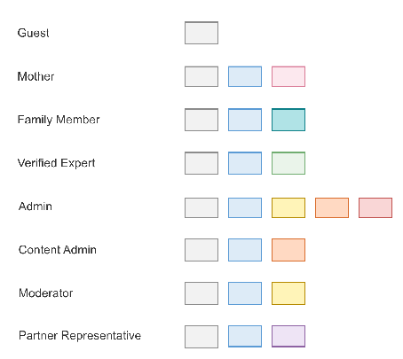

**Figure 32: Screens Flow**

##### **4.1.1.1 Mother Mobile App Screens Flow** {#4.1.1.1-mother-mobile-app-screens-flow}

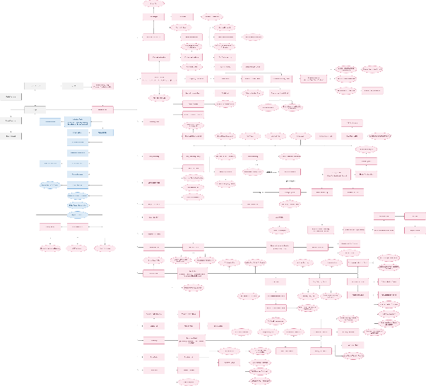

**Figure 33: Mother Mobile App Screens Flow**

[**Mother Mobile App Screens Flow**](https://drive.google.com/file/d/1gizUJoAkzJrhPl58eTQ705XSCV1B5o_E/view?usp=drive_link)

##### **4.1.1.2 Family Member Mobile App Screens Flow** {#4.1.1.2-family-member-mobile-app-screens-flow}

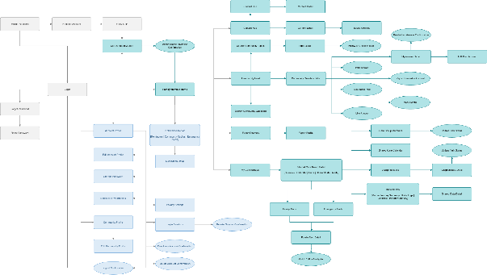

**Figure 34: Family Member Mobile App Screens Flow**

[**Family Member Mobile App Screens Flow**](https://drive.google.com/file/d/1NtGTWluQKdZqZPhSesOKMGSlq1D0eBv4/view?usp=drive_link)

##### **4.1.1.3 Verified Expert App Screens Flow** {#4.1.1.3-verified-expert-app-screens-flow}

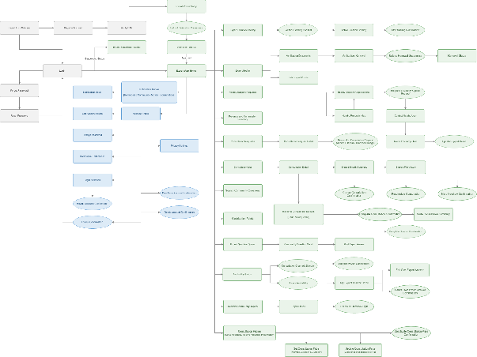

**Figure 35: Verified Expert App Screens Flow**

[**Verified Expert App Screens Flow**](https://drive.google.com/file/d/1fO2g_yiKeptXUbAb9NWkvogn3i0ekYVV/view?usp=drive_link)

##### **4.1.1.4 Verified Expert Web Portal Screens Flow** {#4.1.1.4-verified-expert-web-portal-screens-flow}

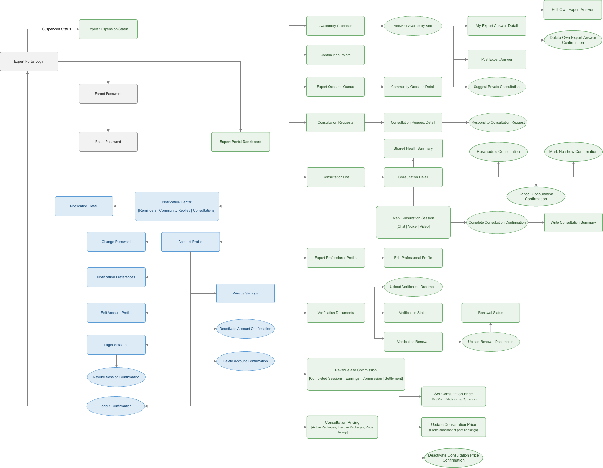

**Figure 36: Verified Expert Web Portal Screens Flow**

[**Verified Expert Web Portal Screens Flow**](https://drive.google.com/file/d/1KVXOnfX1C-lGArJdOhBJRMJ2XT34com7/view?usp=drive_link)

##### **4.1.1.5 System Admin Web Portal Screens Flow** {#4.1.1.5-system-admin-web-portal-screens-flow}

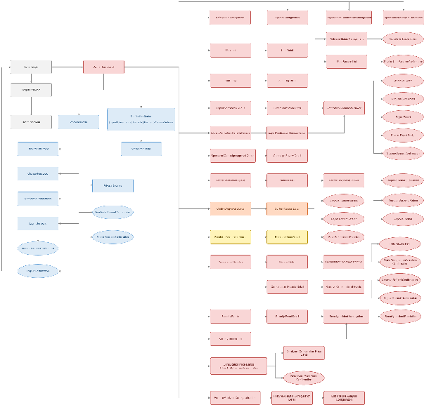

**Figure 37: System Admin Web Portal Screens Flow**

[**System Admin Web Portal Screens Flow**](https://drive.google.com/file/d/1P_2OLQepS3_bZ0U4hMKdhiK2x89hJ87L/view?usp=drive_link)

##### **4.1.1.6 Content Admin Web Portal Screens Flow** {#4.1.1.6-content-admin-web-portal-screens-flow}

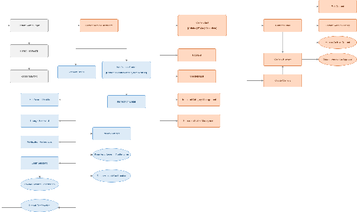

**Figure 38: Content Admin Web Portal Screens Flow**

[**Content Admin Web Portal Screens Flow**](https://drive.google.com/file/d/1iwyIKz5hBYeKz9YxujsxeQvuQcmJVBNR/view?usp=drive_link)

##### **4.1.1.7 Moderator Web Portal Screens Flow** {#4.1.1.7-moderator-web-portal-screens-flow}

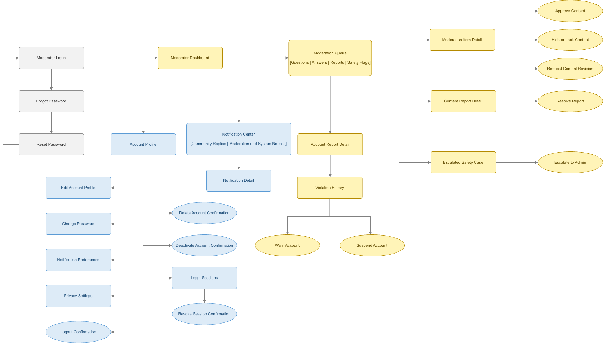

**Figure 39: Moderator Web Portal Screens Flow**

[**Moderator Web Portal Screens Flow**](https://drive.google.com/file/d/1YaK2RbX9cQ8gXngPYIvPVobdAELokfav/view?usp=drive_link)

##### **4.1.1.8 Partner Representative Web Portal Screens Flow** {#4.1.1.8-partner-representative-web-portal-screens-flow}

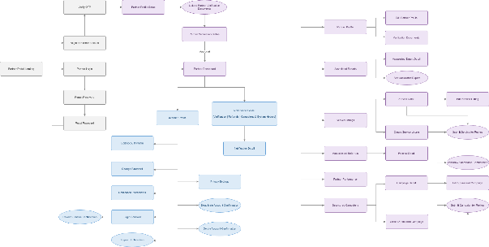

**Figure 40: Partner Representative Web Portal Screens Flow**

[**Partner Representative Web Portal Screens Flow**](https://drive.google.com/file/d/1L-NXMmjBI6xgLw4coJF82dEzV7SuEGLF/view?usp=drive_link)

#### ***4.1.2 Screen Descriptions*** {#4.1.2-screen-descriptions}

| STT | Platform | Feature | Screen | Description |
| ----- | ----- | ----- | ----- | ----- |
| 1 | Shared Mobile Apps | Authentication & setup | Mobile Welcome | Shared entry screen for Mother, Family Member, and Verified Expert mobile apps; role-specific routing is handled after registration or login. |
| 2 | Shared Mobile Apps | Authentication & setup | Register Account | Collects common account credentials and registration details for mobile users, with role-specific fields shown only when required. |
| 3 | Shared Mobile Apps | Authentication & setup | Verify OTP | Validates a one-time password for account activation, recovery, or sensitive account actions across mobile roles. |
| 4 | Shared Mobile Apps | Authentication & setup | Login | Authenticates mobile users and routes each role to the correct home screen. |
| 5 | Shared Mobile Apps | Authentication & setup | Forgot Password | Starts password recovery for mobile users by collecting the registered email or phone number. |
| 6 | Shared Mobile Apps | Authentication & setup | Reset Password | Allows mobile users to set a new password after a valid recovery code or link is confirmed. |
| 7 | Mother Mobile App | Authentication & setup | Mother Journey Setup | Collects the mother’s current stage and key dates to initialize a personalized care journey. |
| 8 | Mother Mobile App | Core experience | Mother Home | Shows the mother’s personalized overview, priorities, reminders, alerts, and shortcuts. |
| 9 | Mother Mobile App | Core experience | Mother Journey | Displays and manages pre-pregnancy, pregnancy, and postpartum journey information. |
| 10 | Mother Mobile App | Core experience | Baby Profiles | Lists the baby profiles managed by the mother and provides access to create or open a profile. |
| 11 | Mother Mobile App | Core experience | Baby Profile | Shows one baby’s overview, daily logs, growth, milestones, vaccination, and health records. |
| 12 | Mother Mobile App | Core experience | Health Record Timeline | Displays maternal and baby health records chronologically with source and category filters. |
| 13 | Mother Mobile App | Core experience | Today Tasks | Shows reminders, appointments, checklist items, and family tasks due today. |
| 14 | Mother Mobile App | Core experience | Community Feed | Displays moderated community questions, answers, topics, and saved content. |
| 15 | Mother Mobile App | Core experience | AI Symptom Intake | Collects symptoms and relevant context through a guided, structured intake flow. |
| 16 | Mother Mobile App | Core experience | Risk Triage Result | Shows the non-diagnostic risk level and the recommended next safe action. |
| 17 | Mother Mobile App | Core experience | Emergency Map | Shows nearby care facilities, available experts, routes, ETA, quick call, and emergency actions. |
| 18 | Mother Mobile App | Core experience | Expert Directory | Lists and filters verified experts by specialty, availability, location, and rating. |
| 19 | Mother Mobile App | Core experience | Consultation Detail | Shows consultation booking information, status, shared data scope, payment, and session actions. |
| 20 | Mother Mobile App | Core experience | Realtime Consultation Session | Provides authenticated chat, voice call, or video call for an active consultation. |
| 21 | Mother Mobile App | Core experience | Care Groups | Lists and manages family care groups, members, permissions, invitations, and assigned tasks. |
| 22 | Mother Mobile App | Core experience | Connected Devices | Manages connected health platforms or devices and displays imported data status. |
| 23 | Mother Mobile App | Core experience | Safety Monitoring | Controls IMU-based activity monitoring and shows safety status, detected events, and alerts. |
| 24 | Family Member Mobile App | Authentication & invitation | Care Group Invitation | Displays an invitation and allows the family member to accept or decline joining a care group. |
| 25 | Family Member Mobile App | Authentication & invitation | Family Member Home | Shows shared care groups, assigned tasks, calendar items, and family alerts. |
| 26 | Family Member Mobile App | Shared care | My Care Groups | Lists the care groups that the family member has joined. |
| 27 | Family Member Mobile App | Shared care | Shared Care Group Detail | Shows the selected group, members, granted permissions, shared data, and tasks. |
| 28 | Family Member Mobile App | Shared care | Shared Care Calendar | Displays appointments, reminders, and care tasks shared with the family member. |
| 29 | Family Member Mobile App | Shared care | Assigned Tasks | Lists assigned care tasks and allows the family member to update task status. |
| 30 | Family Member Mobile App | Shared care | Shared Data | Displays only the maternal or baby data included in the family member’s active permission scope. |
| 31 | Family Member Mobile App | Shared care | Family Alerts | Lists safety, emergency, and important care alerts shared with the family member. |
| 32 | Family Member Mobile App | Shared care | Family Alert Detail | Shows the selected alert, permitted location or context, time, and response actions. |
| 33 | Expert App | Setup & mobile operations | Expert Profile Setup | Collects the expert’s specialty, experience, service scope, and public profile information. |
| 34 | Expert App | Setup & mobile operations | Upload Verification Documents | Allows the expert to upload credentials and supporting documents for verification. |
| 35 | Expert App | Setup & mobile operations | Verification Status | Shows the expert verification result, missing information, rejection reason, or approval state. |
| 36 | Expert App | Setup & mobile operations | Expert App Home | Shows mobile consultation activity, question queue, availability, notifications, and nearby support requests. |
| 37 | Expert App | Setup & mobile operations | Availability Status | Allows the expert to set online status, support methods, location-sharing status, and availability duration. |
| 38 | Expert App | Setup & mobile operations | Consultation Requests | Lists new mobile consultation requests and provides quick accept or decline actions. |
| 39 | Expert App | Setup & mobile operations | Consultation Detail | Shows the request, user consent scope, schedule, status, and actions to accept, reject, or join the consultation. |
| 40 | Expert App | Setup & mobile operations | Shared Health Summary | Displays the consented health summary needed for the selected mobile consultation. |
| 41 | Expert App | Setup & mobile operations | Realtime Consultation Session | Provides authenticated chat, voice call, or video call for an active consultation. |
| 42 | Expert App | Setup & mobile operations | Expert Question Queue | Lists community questions matched to the expert’s verified specialties. |
| 43 | Expert App | Setup & mobile operations | Expert Location Sharing | Allows the expert to start, pause, update, or stop controlled location sharing. |
| 44 | Expert App | Setup & mobile operations | Nearby Support Requests | Lists active nearby support requests that match the expert’s specialty and availability. |
| 45 | Expert App | Setup & mobile operations | Nearby Requests Map | Displays eligible nearby support requests on the shared MF-19 map. |
| 46 | Expert App | Setup & mobile operations | Nearby Support Request Detail | Shows the request summary, distance, consent scope, urgency label, and response options. |
| 47 | Expert App | Setup & mobile operations | Contact Nearby User | Provides approved chat or call actions after the expert accepts a nearby support request. |
| 48 | Expert App | Setup & mobile operations | Route to Nearby User | Displays the route and ETA to the consented user location using the map service. |
| 49 | Shared Mobile Apps | Account & privacy | Notification Center | Lists alerts and account notifications across mobile roles, filtered by the user's permissions and care-group context. |
| 50 | Shared Mobile Apps | Account & privacy | Privacy Settings | Lets mobile users manage consent, data sharing, notification privacy, and account visibility settings. |
| 51 | Shared Mobile Apps | Account & privacy | Delete Account Confirmation | Confirms permanent account deletion and explains role-specific data retention or care-group impact. |
| 52 | Shared Mobile Apps | Account & privacy | Deactivate Account Confirmation | Confirms temporary account deactivation where supported and explains access limitations while inactive. |
| 53 | Shared Web Portals | Authentication & account access | Web Login | Authenticates portal users and routes them to the correct role dashboard. |
| 54 | Expert Web Portal | Professional operations | Expert Portal Dashboard | Summarizes consultations, availability, questions, documents, revenue, and contribution activity. |
| 55 | Expert Web Portal | Professional operations | Expert Professional Profile | Displays and edits the expert’s professional profile and approved service scope. |
| 56 | Expert Web Portal | Professional operations | Verification Documents | Lists submitted credentials, verification status, expiry dates, and document update actions. |
| 57 | Expert Web Portal | Professional operations | Availability Calendar | Manages recurring availability, consultation slots, exceptions, and support methods. |
| 58 | Expert Web Portal | Professional operations | Consultation Requests | Lists new consultation requests that the expert can review, accept, or decline. |
| 59 | Expert Web Portal | Professional operations | Consultation List | Lists scheduled, active, completed, cancelled, and disputed consultations. |
| 60 | Expert Web Portal | Professional operations | Consultation Detail | Shows the consultation schedule, participant, consented records, payment state, session access, and summary actions. |
| 61 | Expert Web Portal | Professional operations | Shared Health Summary | Displays consented maternal or baby health summaries and records for the selected consultation. |
| 62 | Expert Web Portal | Professional operations | Web Consultation Session | Provides the web interface for authenticated chat, voice, or video consultation. |
| 63 | Expert Web Portal | Professional operations | Expert Question Queue | Lists matched community questions and supports detailed expert response drafting. |
| 64 | Expert Web Portal | Professional operations | Revenue and Commission | Shows completed paid consultations, gross revenue, platform commission, and settlement status. |
| 65 | Expert Web Portal | Professional operations | Contribution Points | Shows contribution points, badges, and qualifying community activities. |
| 66 | Admin Web Portal | Moderation | Moderator Dashboard | Summarizes pending reports, moderation queues, violations, and escalated safety cases. |
| 67 | Admin Web Portal | Moderation | Moderation Queue | Lists reported or automatically flagged content awaiting moderator review. |
| 68 | Admin Web Portal | Moderation | Moderation Item Detail | Shows the flagged content, context, evidence, history, and available moderation actions. |
| 69 | Admin Web Portal | Moderation | Content Report Detail | Shows a report against a post or answer and supports resolution actions. |
| 70 | Admin Web Portal | Moderation | Account Report Detail | Shows a report against an account, related evidence, and enforcement options. |
| 71 | Admin Web Portal | Moderation | Violation History | Displays prior warnings, restrictions, suspensions, and resolved violations for an account. |
| 72 | Admin Web Portal | Moderation | Escalated Safety Case | Shows a high-risk content or safety case requiring urgent review and escalation. |
| 73 | Admin Web Portal | Content management | Content Admin Dashboard | Summarizes drafts, pending updates, published content, FAQs, checklists, and categories. |
| 74 | Admin Web Portal | Content management | Content List | Lists articles, FAQs, and checklists with filters for type, status, topic, and version. |
| 75 | Admin Web Portal | Content management | Content Detail | Shows the full content, metadata, source labels, publication status, and version information. |
| 76 | Admin Web Portal | Content management | Create Content | Provides the form for creating a new article, FAQ, or checklist. |
| 77 | Admin Web Portal | Content management | Edit Content | Allows authorized fields, metadata, sources, tags, and status of existing content to be updated. |
| 78 | Admin Web Portal | Content management | Content Preview | Shows how content will appear to end users before submission or publication. |
| 79 | Admin Web Portal | Content management | Content Version History | Lists previous content versions, editors, timestamps, and change summaries. |
| 80 | Admin Web Portal | Content management | FAQ List | Lists and manages verified frequently asked questions and answers. |
| 81 | Admin Web Portal | Content management | Checklist List | Lists and manages verified preparation and care checklists. |
| 82 | Admin Web Portal | Content management | Topic and Category Management | Creates and maintains content topics, categories, tags, and display order. |
| 83 | Admin Web Portal | System administration | Admin Dashboard | Summarizes users, expert and partner verification, operations, disputes, safety, and payments. |
| 84 | Admin Web Portal | System administration | User List | Lists system accounts with filters for role, status, verification, and risk indicators. |
| 85 | Admin Web Portal | System administration | User Detail | Shows account information, roles, status, sessions, reports, and permitted administration actions. |
| 86 | Admin Web Portal | System administration | Expert Verification Queue | Lists expert applications and credential updates awaiting administrative review. |
| 87 | Admin Web Portal | System administration | Content Approval Queue | Lists content versions awaiting approval, rejection, or a request for revision. |
| 88 | Admin Web Portal | System administration | Escalated Moderation Cases | Lists moderation cases escalated to the system administrator for final action. |
| 89 | Admin Web Portal | System administration | Partner Verification Queue | Lists partner applications and submitted evidence awaiting verification. |
| 90 | Admin Web Portal | System administration | Operations and Impact Dashboard | Displays operational KPIs and aggregated social-impact metrics without exposing personal health data. |
| 91 | Admin Web Portal | System administration | Safety Rule Management | Manages controlled safety, triage, escalation, and abuse-prevention rules. |
| 92 | Admin Web Portal | System administration | System Configuration | Manages system-wide settings, limits, reference data, and integration configuration. |
| 93 | Admin Web Portal | System administration | Consultation Disputes | Lists consultation complaints and supports investigation, resolution, and refund decisions. |
| 94 | Admin Web Portal | System administration | Payment and Commission Management | Manages payment records, platform commission, refunds, and settlement status. |
| 95 | Admin Web Portal | System administration | Audit Log | Displays immutable records of sensitive access, permission, moderation, and administration events. |
| 96 | Partner Web Portal | Partner operations | Partner Portal Landing | Introduces the partner portal and provides registration or login entry points. |
| 97 | Partner Web Portal | Partner operations | Register Partner Account | Collects organization and representative information to create a partner application. |
| 98 | Partner Web Portal | Partner operations | Verify OTP | Validates the OTP used to verify the partner representative’s contact information. |
| 99 | Partner Web Portal | Partner operations | Partner Profile Setup | Collects organization identity, contacts, facilities, services, and verification evidence. |
| 100 | Partner Web Portal | Partner operations | Partner Verification Status | Shows the partner application status and any requested corrections or documents. |
| 101 | Partner Web Portal | Partner operations | Partner Dashboard | Summarizes profile status, associated experts, services, referrals, campaigns, and performance. |
| 102 | Partner Web Portal | Partner operations | Partner Profile | Displays and updates the approved organization profile and public partner information. |
| 103 | Partner Web Portal | Partner operations | Associated Experts | Lists experts linked to the partner and supports submission or removal requests. |
| 104 | Partner Web Portal | Partner operations | Service Listings | Lists and manages partner service or appointment-referral listings submitted for review. |
| 105 | Partner Web Portal | Partner operations | Appointment Referrals | Shows appointment referrals, their status, and permitted operational details. |
| 106 | Partner Web Portal | Partner operations | Sponsored Campaigns | Lists and manages sponsored education or support campaigns submitted for approval. |
| 107 | Partner Web Portal | Partner operations | Partner Performance | Displays aggregated referral, service, and campaign performance metrics. |
| 108 | Each actor platform | Shared account | Notifications | Lists role-specific notifications with read and unread status. |
| 109 | Each actor platform | Shared account | Notification Detail | Shows the full notification and opens the related authorized screen or action. |
| 110 | Each actor platform | Shared account | Account Profile | Displays the signed-in user’s account information and account-setting shortcuts. |
| 111 | Each actor platform | Shared account | Edit Account Profile | Updates the signed-in user’s own non-sensitive account information. |
| 112 | Each actor platform | Shared account | Change Password | Changes the current account password after validating the existing password. |
| 113 | Each actor platform | Shared account | Notification Preferences | Manages the notification channels and categories available to the current role. |
| 114 | Each actor platform | Shared account | Login Sessions | Lists active and recent login sessions for the current account. |
| 115 | Each actor platform | Shared account | Revoke Session Confirmation | Confirms signing out a selected device by revoking its stored session or refresh token. |
| 116 | Each actor platform | Shared account | Logout Confirmation | Confirms ending the current login session and returning to the login screen. |
| 117 | Mother Mobile App | Community Q\&A | Community Search | Searches community questions by keyword, stage, topic, answer status and expert label. |
| 118 | Mother Mobile App | Community Q\&A | Topic Directory | Lists and searches community topics for pregnancy, postpartum, child care, nutrition, psychology and safety. |
| 119 | Mother Mobile App | Community Q\&A | Topic Detail | Shows a topic feed and allows the user to follow or unfollow that topic. |
| 120 | Mother Mobile App | Community Q\&A | Edit Community Post | Edits the user’s own community post while it remains editable and is not locked by moderation. |
| 121 | Mother Mobile App | Community Q\&A | Delete Community Post Confirmation | Confirms deletion or archival of the user’s own post when no moderation or investigation lock applies. |
| 122 | Mother Mobile App | File management | File Manager | Lists uploaded ultrasound images, medical records, vaccination files and child photos with ownership and access status. |
| 123 | Mother Mobile App | File management | File Viewer | Previews or downloads an authorized file through a protected access link. |
| 124 | Mother Mobile App | File management | Upload File | Collects file, category, owner, date and metadata before secure upload validation. |
| 125 | Mother Mobile App | File management | Delete File Confirmation | Confirms soft deletion of a user-owned file when retention or record-link rules do not block deletion. |
| 126 | Mother Mobile App | Expert discovery | Expert Search and Filters | Searches and filters verified experts by name, specialty, channel, availability, fee, rating, online state and consented distance. |
| 127 | Mother Mobile App | Safety monitoring | Emergency Contacts | Lists verified emergency contacts and their priority for MF-21 and MF-19 alert delivery. |
| 128 | Mother Mobile App | Safety monitoring | Edit Emergency Contact | Adds, verifies, reprioritizes or removes an emergency contact. |
| 129 | Mother Mobile App | Safety monitoring | Enable Fall Detection Confirmation | Confirms consent, sensor permission and monitoring conditions before fall detection starts. |
| 130 | Mother Mobile App | Safety monitoring | Disable Fall Detection Confirmation | Confirms stopping sensor monitoring and optionally retaining the configuration for later use. |
| 131 | Family Member Mobile App | Community Q\&A | Community Search | Searches community questions and topics available to the family member. |
| 132 | Family Member Mobile App | Community Q\&A | Topic Detail | Shows posts within a topic and allows follow or unfollow actions. |
| 133 | Family Member Mobile App | Emergency alerts | Emergency Alert Detail | Shows the minimum consented alert context, location and response actions for an emergency notification. |
| 134 | Expert App | Expert governance | Verification Renewal | Starts renewal of expert verification before credential expiry. |
| 135 | Expert App | Expert governance | Renewal Status | Shows submitted renewal documents, review status, expiry date and required follow-up. |
| 136 | Expert App | Expert governance | Expert Suspension Status | Explains a suspension, restricted capabilities, effective period and permitted appeal or support action. |
| 137 | Expert Web Portal | Expert governance | Verification Renewal | Submits updated credentials and tracks renewal before the current verification expires. |
| 138 | Expert Web Portal | Expert governance | Expert Suspension Status | Displays suspension reason, restricted capabilities, evidence and available appeal or support actions. |
| 139 | Admin Web Portal | Expert governance | Expert Verification Renewal Queue | Lists expert renewal submissions ordered by expiry risk, completeness and review status. |
| 140 | Admin Web Portal | Expert governance | Expert Verification Renewal Detail | Shows renewal credentials, previous verification, expiry history and approve, supplement or reject actions. |
| 141 | Admin Web Portal | Expert governance | Suspend Expert Confirmation | Confirms suspension scope, reason, effective period and impact on public listing and consultation access. |
| 142 | Admin Web Portal | Audit & security | Security Events | Lists anomalous logins, permission changes, unusual file access and sensitive-record access alerts. |
| 143 | Admin Web Portal | Audit & security | Security Event Detail | Shows event evidence, affected account or resource, risk indicators and related audit records. |
| 144 | Admin Web Portal | Audit & security | Security Incident Investigation | Manages an investigation case, evidence, timeline, assigned reviewer and containment actions. |
| 145 | Admin Web Portal | Audit & security | Security Incident Resolution | Confirms the incident outcome, corrective actions, notifications and case closure. |
| 146 | Expert App | Shared files | Shared File Viewer | Previews a health-record or consultation file only while the expert’s consent scope and access period remain valid. |
| 147 | Expert App | Community Q\&A | Search Community Questions | Searches community questions by keyword, topic, status and specialty relevance. |
| 148 | Expert App | Community Q\&A | Search Community Topics | Searches and browses community topics available to the expert. |
| 149 | Expert App | Community Q\&A | Topic Detail | Shows posts in a selected topic and supports following or unfollowing it. |
| 150 | Expert Web Portal | Shared files | Shared File Viewer | Displays an authorized shared file within the expert’s valid consent scope. |
| 151 | Admin Web Portal | Audit & security | Security Incident List | Lists opened and resolved security investigations by severity, status, affected resource and assigned reviewer. |
| 152 | Mother Mobile App | Pregnancy Exercise & Posture Support | Pre-exercise Safety Check | Collects mandatory safety answers and blocks starting the exercise when a configured warning condition is present. |
| 153 | Mother Mobile App | Pregnancy Exercise & Posture Support | Exercise Session | Runs the selected exercise with instructions, timer, pause/resume controls and optional live posture feedback. |
| 154 | Mother Mobile App | Pregnancy Exercise & Posture Support | Enable Posture Camera Confirmation | Requests explicit consent before enabling camera-based posture analysis for the current exercise session. |
| 155 | Mother Mobile App | Pregnancy Exercise & Posture Support | Exercise Session Result | Shows duration, completion status, aggregate posture score, common posture issues and safety warnings from the completed session. |
| 156 | Mother Mobile App | Pregnancy Exercise & Posture Support | Exercise History | Lists stored exercise sessions and opens the result of a selected session. |
| 157 | Mother Mobile App | Mother Care Journey | Maternal Health Metric Detail | Shows one maternal metric with value, time, source and note, and provides authorized edit or delete actions. |
| 158 | Mother Mobile App | Mother Care Journey | Postpartum Log List | Lists postpartum recovery logs chronologically with filters by symptom or log type. |
| 159 | Mother Mobile App | Mother Care Journey | Postpartum Log Detail | Shows one postpartum log and provides edit or soft-delete actions for the owner. |
| 160 | Mother Mobile App | Baby Care Journey | Switch Active Baby Selector | Allows a mother who manages multiple babies to select the profile used by dashboards, logs and reminders. |
| 161 | Mother Mobile App | Baby Care Journey | Baby Daily Log Detail | Shows one feeding, sleep, diaper, symptom or care entry and provides authorized update or delete actions. |
| 162 | Mother Mobile App | Baby Care Journey | Development Milestone Detail | Shows a recorded milestone, date, note and status and provides update or soft-delete actions. |
| 163 | Mother Mobile App | Community Q\&A | My Answer Detail | Shows the mother’s own answer and provides edit or soft-delete actions while moderation rules allow changes. |
| 164 | Mother Mobile App | Direct Consultation | Reschedule Consultation | Collects a proposed replacement slot and confirms the schedule change under the consultation policy. |
| 165 | Mother Mobile App | Direct Consultation | Cancel Consultation Confirmation | Confirms cancellation, reason and any fee or timing consequence before changing consultation status. |
| 166 | Mother Mobile App | Direct Consultation | Consultation Summary | Shows the expert’s post-session summary and safe follow-up steps for the completed consultation. |
| 167 | Mother Mobile App | Health Records | Reminder Detail | Shows reminder type, recurrence, next time, status and notes with complete, skip, edit and delete actions. |
| 168 | Mother Mobile App | Family Sync | Care Group Members | Lists members, roles, invitation status and permission summary for a selected care group. |
| 169 | Mother Mobile App | Family Sync | Pending Invitations | Lists unaccepted family invitations and allows the mother to revoke an invitation. |
| 170 | Mother Mobile App | Family Sync | Family Task Detail | Shows assignee, due date, status and notes of a family task and supports update or cancellation. |
| 171 | Mother Mobile App | Verified Content | Verified Content Search | Searches approved articles, FAQs and checklists by keyword, care stage and topic. |
| 172 | Mother Mobile App | Verified Content | Verified Content Detail | Shows approved content, source, version, update date and applicable safety notes. |
| 173 | Mother Mobile App | Vaccination & Growth | Vaccination Detail | Shows one scheduled or completed vaccination item with date, status, facility, notes and supporting file. |
| 174 | Mother Mobile App | Vaccination & Growth | Add Vaccination Record | Collects vaccination date, vaccine, facility, notes and optional proof file. |
| 175 | Mother Mobile App | Vaccination & Growth | Growth Measurement History | Lists weight, height and head-circumference measurements used by the growth chart. |
| 176 | Mother Mobile App | Vaccination & Growth | Growth Measurement Detail | Shows one growth measurement and provides authorized edit or soft-delete actions. |
| 177 | Family Member Mobile App | Family Sync | Reject Invitation Confirmation | Confirms declining a care-group invitation without creating membership or data access. |
| 178 | Family Member Mobile App | Family Sync | Leave Care Group Confirmation | Confirms leaving a care group and ending future access to its shared data. |
| 179 | Family Member Mobile App | Community Q\&A | My Answer Detail | Shows the family member’s own answer and allows editing or soft deletion when permitted. |
| 180 | Family Member Mobile App | Verified Content | Verified Content Search | Searches approved articles, FAQs and checklists available to the family member. |
| 181 | Family Member Mobile App | Verified Content | Verified Content Detail | Shows approved content with source, version and safety information. |
| 182 | Expert App | Community Q\&A | My Expert Answer Detail | Shows the expert’s own community answer and supports authorized edit or soft-delete actions. |
| 183 | Expert App | Direct Consultation | Reschedule Consultation | Allows the expert to propose or confirm a new consultation time before the policy deadline. |
| 184 | Expert App | Direct Consultation | Mark No-show Confirmation | Confirms recording a participant no-show after the required waiting period and session evidence. |
| 185 | Expert App | Direct Consultation | Complete Consultation Confirmation | Confirms ending the active consultation before writing the post-session summary. |
| 186 | Expert Web Portal | Community Q\&A | My Expert Answer Detail | Shows an expert-authored answer and provides edit or soft-delete actions when permitted. |
| 187 | Expert Web Portal | Direct Consultation | Reschedule Consultation | Allows the expert to propose or confirm a replacement consultation slot. |
| 188 | Expert Web Portal | Direct Consultation | Mark No-show Confirmation | Confirms a no-show decision after checking timing and technical session evidence. |
| 189 | Content Admin Web Portal | Pregnancy Exercise Management | Pregnancy Exercise List | Lists pregnancy exercises with trimester, difficulty, status and posture-analysis filters. |
| 190 | Content Admin Web Portal | Pregnancy Exercise Management | Pregnancy Exercise Detail | Shows exercise instructions, duration, safety notes, eligibility metadata and publication state. |
| 191 | Content Admin Web Portal | Pregnancy Exercise Management | Create Pregnancy Exercise | Creates a pregnancy exercise with instructions, trimester, difficulty, duration and safety guidance. |
| 192 | Content Admin Web Portal | Pregnancy Exercise Management | Edit Pregnancy Exercise | Updates an existing exercise without adding medical auto-prescription or video-storage behavior. |
| 193 | Content Admin Web Portal | Pregnancy Exercise Management | Exercise Preview | Shows the mobile presentation of an exercise before activation. |
| 194 | Content Admin Web Portal | Verified Content | Content Category List | Lists, orders and manages active or hidden verified-content categories. |
| 195 | Content Admin Web Portal | Verified Content | Unpublish Content Confirmation | Confirms removal of an approved content version from user visibility while retaining version history. |
| 196 | Admin Web Portal | Pregnancy Exercise Management | Posture Analysis Configuration List | Lists rule/model configurations, versions, status and linked exercises. |
| 197 | Admin Web Portal | Pregnancy Exercise Management | Posture Analysis Configuration Detail | Shows analysis mode, version, thresholds, feedback severity and linked exercise scope. |
| 198 | Admin Web Portal | Pregnancy Exercise Management | Edit Posture Analysis Configuration | Updates posture-analysis rules, model version and confidence thresholds under controlled versioning. |
| 199 | Admin Web Portal | Direct Consultation | Consultation No-show Review | Shows consultation timing and technical evidence used to review or confirm a no-show. |
| 200 | Admin Web Portal | Direct Consultation | Resolve Consultation Dispute | Records the administrative dispute outcome and routes the approved financial decision. |
| 201 | Admin Web Portal | Direct Consultation | Approve Refund Confirmation | Confirms the approved refund amount and transaction action. |
| 202 | Admin Web Portal | Direct Consultation | Reject Refund Confirmation | Confirms rejection of the refund request with a recorded reason. |
| 203 | Mother Mobile App | Expert Consultation & Pricing | Expert Profile | Shows the expert's verified identity, specialties, service channels, availability, reviews and entry point to the effective consultation pricing. |
| 204 | Mother Mobile App | Expert Consultation & Pricing | Expert Consultation Pricing | Lists the expert's active chat, voice and video packages with duration, effective price, total payable estimate and cancellation/refund policy before booking. |
| 205 | Mother Mobile App | Expert Consultation & Pricing | Booking Review | Shows the selected expert, slot, shared-data consent and immutable booking price snapshot before final confirmation. |
| 206 | Mother Mobile App | Expert Consultation & Pricing | Payment | Collects the payment method and charges the amount stored in the booking price snapshot rather than the expert's current public price. |
| 207 | Mother Mobile App | Expert Consultation & Pricing | Payment Result | Shows transaction status, booking identifier, locked amount and safe retry or return actions. |
| 208 | Expert App | Consultation Pricing | Consultation Pricing | Lists the expert's active and inactive consultation packages and read-only price history by channel and duration. |
| 209 | Expert App | Consultation Pricing | Set Consultation Price | Creates the initial price for a supported channel and duration after validating it against the active CareBridge price band. |
| 210 | Expert App | Consultation Pricing | Update Consultation Price | Creates a new future-effective price version while preserving price history and existing booking snapshots. |
| 211 | Expert App | Consultation Pricing | Deactivate Consultation Price Confirmation | Confirms stopping new bookings for a selected package without changing existing confirmed or paid bookings. |
| 212 | Expert Web Portal | Consultation Pricing | Consultation Pricing | Provides detailed package management, status filters and price-version history for the signed-in expert. |
| 213 | Expert Web Portal | Consultation Pricing | Set Consultation Price | Creates a package price within the active minimum and maximum for the selected channel and duration. |
| 214 | Expert Web Portal | Consultation Pricing | Update Consultation Price | Schedules a new effective price for future bookings and retains the previous version for audit and reconciliation. |
| 215 | Expert Web Portal | Consultation Pricing | Deactivate Consultation Price Confirmation | Confirms deactivation of a package for future bookings while preserving existing booking obligations. |
| 216 | Admin Web Portal | Consultation Pricing & Commission | Consultation Price Bands | Lists active, draft, inactive and historical price-band versions by channel, duration, limits, commission rate and effective period. |
| 217 | Admin Web Portal | Consultation Pricing & Commission | Configure Consultation Price Band | Creates or updates a versioned minimum, maximum, commission rate and effective period for a consultation channel and duration. |
| 218 | Admin Web Portal | Consultation Pricing & Commission | Deactivate Price Band Confirmation | Confirms deactivation of a price band for new price changes without retroactively changing locked bookings. |
| 219 | Shared Web Portals | Account & privacy | Notification Center | Lists operational, moderation, account, and partner notifications according to the signed-in portal role. |
| 220 | Shared Web Portals | Account & privacy | Privacy Settings | Lets portal users manage account privacy and security preferences available to their role. |
| 221 | Shared Web Portals | Account & privacy | Delete Account Confirmation | Confirms permanent account deletion for portal roles where deletion is allowed. |
| 222 | Shared Web Portals | Account & privacy | Deactivate Account Confirmation | Confirms temporary account deactivation for portal roles where deactivation is allowed. |

**Table 261: Screen Descriptions**

#### ***4.1.3 Screen Authorization*** {#4.1.3-screen-authorization}

| Screen | Guest | Mother | Family Member | Verified Expert | Moderator | Content Admin | Admin | Partner |
| ----- | :---: | :---: | :---: | :---: | :---: | :---: | :---: | :---: |
| Mobile Welcome (Shared Mobile Apps) | X | X | X | X |  |  |  |  |
| Register Account (Shared Mobile Apps) | X | X | X | X |  |  |  |  |
| Verify OTP (Shared Mobile Apps) | X | X | X | X |  |  |  |  |
| Login (Shared Mobile Apps) | X | X | X | X |  |  |  |  |
| Forgot Password (Shared Mobile Apps) | X | X | X | X |  |  |  |  |
| Reset Password (Shared Mobile Apps) | X | X | X | X |  |  |  |  |
| Mother Journey Setup (Mother Mobile App) |  | X |  |  |  |  |  |  |
| Mother Home (Mother Mobile App) |  | X |  |  |  |  |  |  |
| Mother Journey (Mother Mobile App) |  | X |  |  |  |  |  |  |
| Baby Profiles (Mother Mobile App) |  | X |  |  |  |  |  |  |
| Baby Profile (Mother Mobile App) |  | X |  |  |  |  |  |  |
| Health Record Timeline (Mother Mobile App) |  | X |  |  |  |  |  |  |
| Today Tasks (Mother Mobile App) |  | X |  |  |  |  |  |  |
| Community Feed (Mother Mobile App) |  | X |  |  |  |  |  |  |
| AI Symptom Intake (Mother Mobile App) |  | X |  |  |  |  |  |  |
| Risk Triage Result (Mother Mobile App) |  | X |  |  |  |  |  |  |
| Emergency Map (Mother Mobile App) |  | X |  |  |  |  |  |  |
| Expert Directory (Mother Mobile App) |  | X |  |  |  |  |  |  |
| Consultation Detail (Mother Mobile App) |  | X |  |  |  |  |  |  |
| Realtime Consultation Session (Mother Mobile App) |  | X |  |  |  |  |  |  |
| Care Groups (Mother Mobile App) |  | X |  |  |  |  |  |  |
| Connected Devices (Mother Mobile App) |  | X |  |  |  |  |  |  |
| Safety Monitoring (Mother Mobile App) |  | X |  |  |  |  |  |  |
| Care Group Invitation (Family Member Mobile App) | X |  | X |  |  |  |  |  |
| Family Member Home (Family Member Mobile App) |  |  | X |  |  |  |  |  |
| My Care Groups (Family Member Mobile App) |  |  | X |  |  |  |  |  |
| Shared Care Group Detail (Family Member Mobile App) |  |  | X |  |  |  |  |  |
| Shared Care Calendar (Family Member Mobile App) |  |  | X |  |  |  |  |  |
| Assigned Tasks (Family Member Mobile App) |  |  | X |  |  |  |  |  |
| Shared Data (Family Member Mobile App) |  |  | X |  |  |  |  |  |
| Family Alerts (Family Member Mobile App) |  |  | X |  |  |  |  |  |
| Family Alert Detail (Family Member Mobile App) |  |  | X |  |  |  |  |  |
| Expert Profile Setup (Expert App) |  |  |  | X |  |  |  |  |
| Upload Verification Documents (Expert App) |  |  |  | X |  |  |  |  |
| Verification Status (Expert App) |  |  |  | X |  |  |  |  |
| Expert App Home (Expert App) |  |  |  | X |  |  |  |  |
| Availability Status (Expert App) |  |  |  | X |  |  |  |  |
| Consultation Requests (Expert App) |  |  |  | X |  |  |  |  |
| Consultation Detail (Expert App) |  |  |  | X |  |  |  |  |
| Shared Health Summary (Expert App) |  |  |  | X |  |  |  |  |
| Realtime Consultation Session (Expert App) |  |  |  | X |  |  |  |  |
| Expert Question Queue (Expert App) |  |  |  | X |  |  |  |  |
| Expert Location Sharing (Expert App) |  |  |  | X |  |  |  |  |
| Nearby Support Requests (Expert App) |  |  |  | X |  |  |  |  |
| Nearby Requests Map (Expert App) |  |  |  | X |  |  |  |  |
| Nearby Support Request Detail (Expert App) |  |  |  | X |  |  |  |  |
| Contact Nearby User (Expert App) |  |  |  | X |  |  |  |  |
| Route to Nearby User (Expert App) |  |  |  | X |  |  |  |  |
| Notification Center (Shared Mobile Apps) |  | X | X | X |  |  |  |  |
| Privacy Settings (Shared Mobile Apps) |  | X | X | X |  |  |  |  |
| Delete Account Confirmation (Shared Mobile Apps) |  | X | X | X |  |  |  |  |
| Deactivate Account Confirmation (Shared Mobile Apps) |  |  |  | X |  |  |  |  |
| Web Login (Shared Web Portals) | X |  |  | X | X | X | X | X |
| Expert Portal Dashboard (Expert Web Portal) |  |  |  | X |  |  |  |  |
| Expert Professional Profile (Expert Web Portal) |  |  |  | X |  |  |  |  |
| Verification Documents (Expert Web Portal) |  |  |  | X |  |  |  |  |
| Availability Calendar (Expert Web Portal) |  |  |  | X |  |  |  |  |
| Consultation Requests (Expert Web Portal) |  |  |  | X |  |  |  |  |
| Consultation List (Expert Web Portal) |  |  |  | X |  |  |  |  |
| Consultation Detail (Expert Web Portal) |  |  |  | X |  |  |  |  |
| Shared Health Summary (Expert Web Portal) |  |  |  | X |  |  |  |  |
| Web Consultation Session (Expert Web Portal) |  |  |  | X |  |  |  |  |
| Expert Question Queue (Expert Web Portal) |  |  |  | X |  |  |  |  |
| Revenue and Commission (Expert Web Portal) |  |  |  | X |  |  |  |  |
| Contribution Points (Expert Web Portal) |  |  |  | X |  |  |  |  |
| Moderator Dashboard (Admin Web Portal) |  |  |  |  | X |  | X |  |
| Moderation Queue (Admin Web Portal) |  |  |  |  | X |  | X |  |
| Moderation Item Detail (Admin Web Portal) |  |  |  |  | X |  | X |  |
| Content Report Detail (Admin Web Portal) |  |  |  |  | X |  | X |  |
| Account Report Detail (Admin Web Portal) |  |  |  |  | X |  | X |  |
| Violation History (Admin Web Portal) |  |  |  |  | X |  | X |  |
| Escalated Safety Case (Admin Web Portal) |  |  |  |  | X |  | X |  |
| Content Admin Dashboard (Admin Web Portal) |  |  |  |  |  | X | X |  |
| Content List (Admin Web Portal) |  |  |  |  |  | X | X |  |
| Content Detail (Admin Web Portal) |  |  |  |  |  | X | X |  |
| Create Content (Admin Web Portal) |  |  |  |  |  | X | X |  |
| Edit Content (Admin Web Portal) |  |  |  |  |  | X | X |  |
| Content Preview (Admin Web Portal) |  |  |  |  |  | X | X |  |
| Content Version History (Admin Web Portal) |  |  |  |  |  | X | X |  |
| FAQ List (Admin Web Portal) |  |  |  |  |  | X | X |  |
| Checklist List (Admin Web Portal) |  |  |  |  |  | X | X |  |
| Topic and Category Management (Admin Web Portal) |  |  |  |  |  | X | X |  |
| Admin Dashboard (Admin Web Portal) |  |  |  |  |  |  | X |  |
| User List (Admin Web Portal) |  |  |  |  |  |  | X |  |
| User Detail (Admin Web Portal) |  |  |  |  |  |  | X |  |
| Expert Verification Queue (Admin Web Portal) |  |  |  |  |  |  | X |  |
| Content Approval Queue (Admin Web Portal) |  |  |  |  |  |  | X |  |
| Escalated Moderation Cases (Admin Web Portal) |  |  |  |  |  |  | X |  |
| Partner Verification Queue (Admin Web Portal) |  |  |  |  |  |  | X |  |
| Operations and Impact Dashboard (Admin Web Portal) |  |  |  |  |  |  | X |  |
| Safety Rule Management (Admin Web Portal) |  |  |  |  |  |  | X |  |
| System Configuration (Admin Web Portal) |  |  |  |  |  |  | X |  |
| Consultation Disputes (Admin Web Portal) |  |  |  |  |  |  | X |  |
| Payment and Commission Management (Admin Web Portal) |  |  |  |  |  |  | X |  |
| Audit Log (Admin Web Portal) |  |  |  |  |  |  | X |  |
| Partner Portal Landing (Partner Web Portal) | X |  |  |  |  |  |  | X |
| Register Partner Account (Partner Web Portal) | X |  |  |  |  |  |  | X |
| Verify OTP (Partner Web Portal) | X |  |  |  |  |  |  | X |
| Partner Profile Setup (Partner Web Portal) | X |  |  |  |  |  |  | X |
| Partner Verification Status (Partner Web Portal) | X |  |  |  |  |  |  | X |
| Partner Dashboard (Partner Web Portal) |  |  |  |  |  |  |  | X |
| Partner Profile (Partner Web Portal) |  |  |  |  |  |  |  | X |
| Associated Experts (Partner Web Portal) |  |  |  |  |  |  |  | X |
| Service Listings (Partner Web Portal) |  |  |  |  |  |  |  | X |
| Appointment Referrals (Partner Web Portal) |  |  |  |  |  |  |  | X |
| Sponsored Campaigns (Partner Web Portal) |  |  |  |  |  |  |  | X |
| Partner Performance (Partner Web Portal) |  |  |  |  |  |  |  | X |
| Notifications (Each actor platform) |  | X | X | X | X | X | X | X |
| Notification Detail (Each actor platform) |  | X | X | X | X | X | X | X |
| Account Profile (Each actor platform) |  | X | X | X | X | X | X | X |
| Edit Account Profile (Each actor platform) |  | X | X | X | X | X | X | X |
| Change Password (Each actor platform) |  | X | X | X | X | X | X | X |
| Notification Preferences (Each actor platform) |  | X | X | X | X | X | X | X |
| Login Sessions (Each actor platform) |  | X | X | X | X | X | X | X |
| Revoke Session Confirmation (Each actor platform) |  | X | X | X | X | X | X | X |
| Logout Confirmation (Each actor platform) |  | X | X | X | X | X | X | X |
| Community Search (Mother Mobile App) |  | X |  |  |  |  |  |  |
| Topic Directory (Mother Mobile App) |  | X |  |  |  |  |  |  |
| Topic Detail (Mother Mobile App) |  | X |  |  |  |  |  |  |
| Edit Community Post (Mother Mobile App) |  | X |  |  |  |  |  |  |
| Delete Community Post Confirmation (Mother Mobile App) |  | X |  |  |  |  |  |  |
| File Manager (Mother Mobile App) |  | X |  |  |  |  |  |  |
| File Viewer (Mother Mobile App) |  | X |  |  |  |  |  |  |
| Upload File (Mother Mobile App) |  | X |  |  |  |  |  |  |
| Delete File Confirmation (Mother Mobile App) |  | X |  |  |  |  |  |  |
| Expert Search and Filters (Mother Mobile App) |  | X |  |  |  |  |  |  |
| Emergency Contacts (Mother Mobile App) |  | X |  |  |  |  |  |  |
| Edit Emergency Contact (Mother Mobile App) |  | X |  |  |  |  |  |  |
| Enable Fall Detection Confirmation (Mother Mobile App) |  | X |  |  |  |  |  |  |
| Disable Fall Detection Confirmation (Mother Mobile App) |  | X |  |  |  |  |  |  |
| Community Search (Family Member Mobile App) |  |  | X |  |  |  |  |  |
| Topic Detail (Family Member Mobile App) |  |  | X |  |  |  |  |  |
| Emergency Alert Detail (Family Member Mobile App) |  |  | X |  |  |  |  |  |
| Verification Renewal (Expert App) |  |  |  | X |  |  |  |  |
| Renewal Status (Expert App) |  |  |  | X |  |  |  |  |
| Expert Suspension Status (Expert App) |  |  |  | X |  |  |  |  |
| Verification Renewal (Expert Web Portal) |  |  |  | X |  |  |  |  |
| Expert Suspension Status (Expert Web Portal) |  |  |  | X |  |  |  |  |
| Expert Verification Renewal Queue (Admin Web Portal) |  |  |  |  |  |  | X |  |
| Expert Verification Renewal Detail (Admin Web Portal) |  |  |  |  |  |  | X |  |
| Suspend Expert Confirmation (Admin Web Portal) |  |  |  |  |  |  | X |  |
| Security Events (Admin Web Portal) |  |  |  |  |  |  | X |  |
| Security Event Detail (Admin Web Portal) |  |  |  |  |  |  | X |  |
| Security Incident Investigation (Admin Web Portal) |  |  |  |  |  |  | X |  |
| Security Incident Resolution (Admin Web Portal) |  |  |  |  |  |  | X |  |
| Shared File Viewer (Expert App) |  |  |  | X |  |  |  |  |
| Search Community Questions (Expert App) |  |  |  | X |  |  |  |  |
| Search Community Topics (Expert App) |  |  |  | X |  |  |  |  |
| Topic Detail (Expert App) |  |  |  | X |  |  |  |  |
| Shared File Viewer (Expert Web Portal) |  |  |  | X |  |  |  |  |
| Security Incident List (Admin Web Portal) |  |  |  |  |  |  | X |  |
| Pre-exercise Safety Check (Mother Mobile App) |  | X |  |  |  |  |  |  |
| Exercise Session (Mother Mobile App) |  | X |  |  |  |  |  |  |
| Enable Posture Camera Confirmation (Mother Mobile App) |  | X |  |  |  |  |  |  |
| Exercise Session Result (Mother Mobile App) |  | X |  |  |  |  |  |  |
| Exercise History (Mother Mobile App) |  | X |  |  |  |  |  |  |
| Maternal Health Metric Detail (Mother Mobile App) |  | X |  |  |  |  |  |  |
| Postpartum Log List (Mother Mobile App) |  | X |  |  |  |  |  |  |
| Postpartum Log Detail (Mother Mobile App) |  | X |  |  |  |  |  |  |
| Switch Active Baby Selector (Mother Mobile App) |  | X |  |  |  |  |  |  |
| Baby Daily Log Detail (Mother Mobile App) |  | X |  |  |  |  |  |  |
| Development Milestone Detail (Mother Mobile App) |  | X |  |  |  |  |  |  |
| My Answer Detail (Mother Mobile App) |  | X |  |  |  |  |  |  |
| Reschedule Consultation (Mother Mobile App) |  | X |  |  |  |  |  |  |
| Cancel Consultation Confirmation (Mother Mobile App) |  | X |  |  |  |  |  |  |
| Consultation Summary (Mother Mobile App) |  | X |  |  |  |  |  |  |
| Reminder Detail (Mother Mobile App) |  | X |  |  |  |  |  |  |
| Care Group Members (Mother Mobile App) |  | X |  |  |  |  |  |  |
| Pending Invitations (Mother Mobile App) |  | X |  |  |  |  |  |  |
| Family Task Detail (Mother Mobile App) |  | X |  |  |  |  |  |  |
| Verified Content Search (Mother Mobile App) |  | X |  |  |  |  |  |  |
| Verified Content Detail (Mother Mobile App) |  | X |  |  |  |  |  |  |
| Vaccination Detail (Mother Mobile App) |  | X |  |  |  |  |  |  |
| Add Vaccination Record (Mother Mobile App) |  | X |  |  |  |  |  |  |
| Growth Measurement History (Mother Mobile App) |  | X |  |  |  |  |  |  |
| Growth Measurement Detail (Mother Mobile App) |  | X |  |  |  |  |  |  |
| Reject Invitation Confirmation (Family Member Mobile App) |  |  | X |  |  |  |  |  |
| Leave Care Group Confirmation (Family Member Mobile App) |  |  | X |  |  |  |  |  |
| My Answer Detail (Family Member Mobile App) |  |  | X |  |  |  |  |  |
| Verified Content Search (Family Member Mobile App) |  |  | X |  |  |  |  |  |
| Verified Content Detail (Family Member Mobile App) |  |  | X |  |  |  |  |  |
| My Expert Answer Detail (Expert App) |  |  |  | X |  |  |  |  |
| Reschedule Consultation (Expert App) |  |  |  | X |  |  |  |  |
| Mark No-show Confirmation (Expert App) |  |  |  | X |  |  |  |  |
| Complete Consultation Confirmation (Expert App) |  |  |  | X |  |  |  |  |
| My Expert Answer Detail (Expert Web Portal) |  |  |  | X |  |  |  |  |
| Reschedule Consultation (Expert Web Portal) |  |  |  | X |  |  |  |  |
| Mark No-show Confirmation (Expert Web Portal) |  |  |  | X |  |  |  |  |
| Pregnancy Exercise List (Content Admin Web Portal) |  |  |  |  |  | X | X |  |
| Pregnancy Exercise Detail (Content Admin Web Portal) |  |  |  |  |  | X | X |  |
| Create Pregnancy Exercise (Content Admin Web Portal) |  |  |  |  |  | X | X |  |
| Edit Pregnancy Exercise (Content Admin Web Portal) |  |  |  |  |  | X | X |  |
| Exercise Preview (Content Admin Web Portal) |  |  |  |  |  | X | X |  |
| Content Category List (Content Admin Web Portal) |  |  |  |  |  | X | X |  |
| Unpublish Content Confirmation (Content Admin Web Portal) |  |  |  |  |  | X | X |  |
| Posture Analysis Configuration List (Admin Web Portal) |  |  |  |  |  |  | X |  |
| Posture Analysis Configuration Detail (Admin Web Portal) |  |  |  |  |  |  | X |  |
| Edit Posture Analysis Configuration (Admin Web Portal) |  |  |  |  |  |  | X |  |
| Consultation No-show Review (Admin Web Portal) |  |  |  |  |  |  | X |  |
| Resolve Consultation Dispute (Admin Web Portal) |  |  |  |  |  |  | X |  |
| Approve Refund Confirmation (Admin Web Portal) |  |  |  |  |  |  | X |  |
| Reject Refund Confirmation (Admin Web Portal) |  |  |  |  |  |  | X |  |
| Expert Profile (Mother Mobile App) |  | X |  |  |  |  |  |  |
| Expert Consultation Pricing (Mother Mobile App) |  | X |  |  |  |  |  |  |
| Booking Review (Mother Mobile App) |  | X |  |  |  |  |  |  |
| Payment (Mother Mobile App) |  | X |  |  |  |  |  |  |
| Payment Result (Mother Mobile App) |  | X |  |  |  |  |  |  |
| Consultation Pricing (Expert App) |  |  |  | X |  |  |  |  |
| Set Consultation Price (Expert App) |  |  |  | X |  |  |  |  |
| Update Consultation Price (Expert App) |  |  |  | X |  |  |  |  |
| Deactivate Consultation Price Confirmation (Expert App) |  |  |  | X |  |  |  |  |
| Consultation Pricing (Expert Web Portal) |  |  |  | X |  |  |  |  |
| Set Consultation Price (Expert Web Portal) |  |  |  | X |  |  |  |  |
| Update Consultation Price (Expert Web Portal) |  |  |  | X |  |  |  |  |
| Deactivate Consultation Price Confirmation (Expert Web Portal) |  |  |  | X |  |  |  |  |
| Consultation Price Bands (Admin Web Portal) |  |  |  |  |  |  | X |  |
| Configure Consultation Price Band (Admin Web Portal) |  |  |  |  |  |  | X |  |
| Deactivate Price Band Confirmation (Admin Web Portal) |  |  |  |  |  |  | X |  |
| Notification Center (Shared Web Portals) |  |  |  | X | X | X | X | X |
| Privacy Settings (Shared Web Portals) |  |  |  | X | X | X | X | X |
| Delete Account Confirmation (Shared Web Portals) |  |  |  | X | X | X |  | X |
| Deactivate Account Confirmation (Shared Web Portals) |  |  |  | X | X | X | X | X |

**Table 262: Screen Authorization**

#### ***4.1.4 Non-Screen Functions*** {#4.1.4-non-screen-functions}

| STT | Feature | System Function | Description |
| :---: | ----- | ----- | ----- |
| 1 | MF-01 Account, Trust & Access Control | OTP Issuance and Verification Service | Generates expiring OTP challenges, enforces resend and attempt limits, verifies the submitted code and records security-relevant outcomes. |
| 2 | MF-01 Account, Trust & Access Control | Authentication Token and Session Service | Issues short-lived access tokens and device-specific refresh sessions, rotates tokens, detects revoked or expired sessions and supports sign-out from selected devices. |
| 3 | MF-01 Account, Trust & Access Control | RBAC Authorization Service | Evaluates role, permission, ownership, account state and platform context before protected data or operations are allowed. |
| 4 | MF-01 Consent & Privacy | Consent Scope and Expiry Service | Creates, validates, edits, expires and revokes permissions by recipient, purpose, data scope and time limit; access is denied when any condition is no longer valid. |
| 5 | MF-01 Consent & Privacy | Privacy Preference Enforcement Service | Applies profile visibility, online-status, location and data-use settings consistently to search, community, expert discovery and notification processing. |
| 6 | MF-01 Account Lifecycle | Account Deactivation Service | Temporarily disables sign-in and nonessential notifications, revokes active sessions and preserves data for possible reactivation under policy. |
| 7 | MF-01 Account Lifecycle | Account Deletion Workflow Job | Creates a deletion request, checks waiting period and unresolved obligations, anonymizes or deletes eligible data and preserves only legally or operationally required evidence. |
| 8 | MF-01 Expert Governance | Expert Credential Expiry Monitor | Checks credential expiry dates, notifies experts before expiry and changes verification state when evidence is no longer valid. |
| 9 | MF-01 Expert Governance | Expert Verification Renewal Service | Validates renewal submissions, links new evidence to prior verification, routes review to Admin and applies approved expiry dates or required-supplement status. |
| 10 | MF-01 Expert Governance | Expert Suspension Enforcement Service | Disables expert badge, public discovery, new consultation acceptance and restricted expert actions while preserving audit, appeal and settlement access as configured. |
| 11 | MF-02 Mother Care Journey | Journey Stage Calculation Service | Calculates pre-pregnancy, pregnancy week or postpartum stage from user-provided dates and refreshes stage-dependent dashboard data. |
| 12 | MF-03 Baby Care Journey & Growth | Baby Log Aggregation Service | Aggregates feeding, sleep, diaper, symptom and care logs into 24-hour and seven-day summaries without producing a medical diagnosis. |
| 13 | MF-03 / MF-13 Growth & Vaccination | Growth and Vaccination Schedule Service | Calculates age-based growth points and reference vaccination dates, marks sources and creates due or overdue states. |
| 14 | MF-04 Community Q\&A | Community Safety Screening Service | Screens posts and answers for spam, abuse, prohibited advertising and high-risk medical wording, then labels or routes suspicious content for review. |
| 15 | MF-04 Community Q\&A | Community Post Lifecycle Service | Enforces ownership and moderation locks for create, edit, soft-delete and restore states while retaining evidence required for reports or investigations. |
| 16 | MF-04 Community Q\&A | Community Engagement Service | Creates and removes bookmarks, answer likes and topic follows idempotently, updates counters and excludes hidden or deleted content. |
| 17 | MF-04 / MF-17 Moderation | Moderation Queue Builder | Prioritizes cases from user reports, automated safety flags, repeated violations and escalated health-risk content. |
| 18 | MF-04 / MF-17 Moderation | Moderation Action Propagation Service | Applies approved hide, lock, warn or suspend actions to related content and accounts, sends notices and records the result. |
| 19 | MF-05 Verified Expert Network | Expert Availability and Presence Service | Maintains online, available and consultation-channel status and automatically expires stale presence. |
| 20 | MF-05 Verified Expert Network | Expert Search and Filter Service | Searches verified experts and applies specialty, channel, availability, fee, rating, online-state and consented-distance filters. |
| 21 | MF-05 / MF-19 Expert Discovery | Expert Matching and Nearby Search Service | Returns only verified, eligible and opted-in nearby experts using privacy-safe location precision and current availability. |
| 22 | MF-06 Free Expert Contribution | Contribution Point Calculation Job | Calculates expert contribution points and badges from eligible answers, likes and moderation outcomes while excluding removed activity. |
| 23 | MF-07 Direct Consultation | Consultation Booking and Slot Reservation Service | Validates availability and the selected active pricing package, reserves a slot, creates an immutable booking price snapshot, prevents duplicate booking and releases unpaid or expired reservations. |
| 24 | MF-07 Direct Consultation | Realtime Communication Session Service | Creates protected chat, voice or video rooms and short-lived participant tokens for a valid booking or accepted support request. |
| 25 | MF-07 Direct Consultation | Consultation Status and Timeout Job | Updates scheduled, accepted, active, completed, cancelled and no-show states according to events and configured time windows. |
| 26 | MF-07 Direct Consultation | Payment Callback Processing Service | Validates signed and idempotent payment callbacks and updates the transaction against the booking price snapshot; it never recalculates the payable amount from the expert's current price. |
| 27 | MF-07 Direct Consultation | Payment Reconciliation and Commission Job | Reconciles eligible completed consultations and stores gross amount, effective commission rate, platform commission, payment-gateway fee, refunded amount, expert net amount and settlement status. |
| 28 | MF-07 / MF-17 Disputes | Refund and Dispute Workflow Service | Collects consultation and technical evidence, routes cases to Admin and applies the approved refund to the booking/payment breakdown without changing the expert's public pricing or historical price versions. |
| 29 | MF-08 AI Nurse Assistant & Risk Triage | Structured Symptom Intake Service | Transforms user answers and selected context into a structured intake record for controlled safety processing. |
| 30 | MF-08 AI Nurse Assistant & Risk Triage | Risk Triage and Red-Flag Rule Engine | Applies controlled green, yellow and red rules; red flags prioritize emergency or in-person care and never diagnose or prescribe. |
| 31 | MF-08 / MF-12 AI and Verified Content | Verified RAG Answer Service | Retrieves approved content, FAQ and checklist sources and returns bounded answers with citations and safe fallback. |
| 32 | MF-09 Personal Health Records | Health Summary Generation Service | Builds a time-bounded summary from records explicitly selected by the owner and applies source labels and permission scope. |
| 33 | MF-09 File Management | Secure File Upload Processing Service | Validates ownership, file type and size, scans content, stores metadata and protects storage references. |
| 34 | MF-09 File Management | Protected File Access Service | Authorizes preview or download by ownership, consent scope and expiry and issues a short-lived protected file URL. |
| 35 | MF-09 File Management | File Deletion and Retention Service | Soft-deletes eligible owner files, blocks deletion when retention or record links apply and schedules physical purge when allowed. |
| 36 | MF-10 Reminders, Tasks & Care Plan | Reminder Scheduling and Dispatch Job | Finds due appointment, medication, vaccination, checklist and family-task reminders and creates reminder notifications. |
| 37 | MF-10 Reminders, Tasks & Care Plan | Reminder Recurrence and Snooze Service | Calculates the next occurrence, snooze time, completion and missed state while preventing duplicate delivery. |
| 38 | MF-11 Family Sync & Cooperative Care | Care Group Invitation Service | Creates expiring invitations, validates acceptance, prevents duplicate membership and initializes granted permissions. |
| 39 | MF-11 Family Sync & Cooperative Care | Family Alert Distribution Service | Sends consent-limited alerts and task updates only to active members whose scope includes the event type. |
| 40 | MF-12 Verified Content & Checklist Hub | Content Versioning and Publication Service | Stores immutable versions, manages draft and approval state and exposes only the latest approved version. |
| 41 | MF-12 Verified Content & Checklist Hub | Scheduled Content Publication Job | Publishes or unpublishes approved content at configured times and invalidates affected search indexes. |
| 42 | MF-16 Operation, Impact & Partner Dashboard | Operational Metrics Aggregation Job | Aggregates non-identifying usage, moderation, consultation and social-impact indicators for authorized dashboards. |
| 43 | MF-17 Safety, Compliance & Abuse Prevention | Audit Logging Service | Records authentication, sensitive access, permission changes, file activity, expert views, moderation, safety and financial actions in append-only logs. |
| 44 | MF-17 Audit & Security | Security Event Detection Service | Detects anomalous login, permission, file-access and sensitive-record patterns and creates reviewable security events with supporting evidence. |
| 45 | MF-17 Audit & Security | Security Incident Investigation Service | Links security events, audit records and evidence into an investigation case, tracks containment and resolution and records the final decision. |
| 46 | MF-17 Safety, Compliance & Abuse Prevention | Account and Content Risk Scoring Service | Combines report frequency, prohibited patterns and enforcement history to prioritize human review without making medical decisions. |
| 47 | MF-18 Partner Management | Partner Verification and Listing Publication Service | Controls partner review states and publishes only approved profiles, services and sponsored content with required labels and validity periods. |
| 48 | MF-18 Partner Management | Referral and Campaign Metric Aggregation Job | Aggregates listing views, referral events and campaign results without exposing personal health records. |
| 49 | MF-19 Map & Nearby Care Support | Map Geocoding, Nearby Search and ETA Service | Geocodes approved locations, searches nearby care facilities or opted-in experts and calculates distance, route and ETA. |
| 50 | MF-19 Map & Nearby Care Support | Location Privacy and Expiry Service | Limits location precision and visibility by role and purpose and automatically ends sharing when its TTL expires. |
| 51 | MF-19 Map & Nearby Care Support | Nearby Support Request Routing Service | Matches consented support requests with eligible experts and shares only minimum necessary information until expiry or cancellation. |
| 52 | MF-20 Connected Device Integration | Health Platform Synchronization Service | Imports supported observations, normalizes units, attaches source and timestamp labels and prevents duplicate records. |
| 53 | MF-20 Connected Device Integration | Device Synchronization Retry Job | Retries recoverable failures with backoff and marks stale or permanently failed imports without fabricating values. |
| 54 | MF-21 Smart Activity Monitoring | Fall Detection Configuration Service | Stores enable or disable state, sensor permission, monitoring window and device capability while keeping detection off until explicit consent. |
| 55 | MF-21 Smart Activity Monitoring | On-Device IMU Event Detection Service | Processes accelerometer and gyroscope signals on-device to identify a suspected fall or strong impact and starts a safety check. |
| 56 | MF-21 Smart Activity Monitoring | Safety Confirmation Countdown Service | Tracks the response window, cancels escalation when safety is confirmed and continues when help is requested or no response occurs. |
| 57 | MF-21 Smart Activity Monitoring | Emergency Contact Verification Service | Adds, verifies, prioritizes and removes emergency contacts and checks that at least one active recipient is available before alerting. |
| 58 | MF-21 Smart Activity Monitoring | Safety Alert Escalation Service | Sends the minimum necessary emergency alert and consented location, records delivery and offers MF-19 actions while prioritizing emergency services for red flags. |
| 59 | Cross-cutting Notifications | Notification Event Classification Service | Classifies events into reminder, community reply, consultation or emergency categories and applies category-specific urgency, deep link and audience rules. |
| 60 | Cross-cutting Notifications | Notification Queue and Delivery Service | Queues in-app, push and email messages, applies preferences and mandatory-safety rules, retries failures and stores delivery status. |
| 61 | Cross-cutting Notifications | Emergency Notification Delivery Service | Bypasses noncritical muting where policy permits, sends to verified emergency contacts, tracks acknowledgements and escalates failed delivery safely. |
| 62 | Cross-cutting Search | Community Question Search Index Job | Indexes eligible community questions and answers after create, edit, moderation or deletion and supports keyword and structured filters. |
| 63 | Cross-cutting Search | Community Topic Search and Follow Service | Indexes active topics, returns topic discovery results and maintains follow subscriptions used for feed personalization and notifications. |
| 64 | Cross-cutting Search | Expert Search Index Synchronization Job | Updates searchable expert fields, badge, availability and suspension state so ineligible experts are removed promptly. |
| 65 | Cross-cutting Data Protection | Data Retention and Soft-Deletion Job | Applies retention, anonymization and purge rules to deleted or deactivated accounts and expired data while preserving required evidence. |
| 66 | MF-02 Pregnancy Exercise & Posture Support | Exercise Catalog Eligibility Service | Returns only active exercises matching the selected trimester, difficulty and supported duration; it does not automatically prescribe an exercise as medical treatment. |
| 67 | MF-02 Pregnancy Exercise & Posture Support | Pre-exercise Safety Rule Service | Evaluates required safety answers against configured blocking and caution rules before an exercise session may start. |
| 68 | MF-02 Pregnancy Exercise & Posture Support | Exercise Session State Service | Creates and transitions exercise sessions through started, paused, resumed, completed and abandoned states and stores duration and completion metadata. |
| 69 | MF-02 Pregnancy Exercise & Posture Support | Posture Analysis Runtime Service | Processes live camera landmarks using the configured rule-based or ML-based mode and returns bounded posture feedback without saving raw camera video. |
| 70 | MF-02 Pregnancy Exercise & Posture Support | Exercise Result Aggregation Service | Aggregates session duration, completion level, posture score, recurring issues and safety warnings into the stored session result. |
| 71 | MF-02 Pregnancy Exercise & Posture Support | Exercise Content Publication Service | Validates exercise metadata, safety notes and status before an exercise is activated for the mobile catalog. |
| 72 | MF-02 Pregnancy Exercise & Posture Support | Posture Configuration Version Service | Versions analysis mode, rule/model identifier, confidence thresholds and feedback severity and applies only published configurations. |
| 73 | MF-02 Mother Care Journey | Maternal Record Soft-Deletion Service | Soft-deletes owner-entered maternal metrics or postpartum logs while retaining audit evidence and excluding deleted records from trends. |
| 74 | MF-03 Baby Care Journey & Growth | Active Baby Context Service | Stores and validates the currently selected baby profile so logs, reminders and dashboards use the intended child. |
| 75 | MF-03 Baby Care Journey & Growth | Baby Record Lifecycle Service | Applies ownership, edit and soft-delete rules to baby daily logs and development milestones. |
| 76 | MF-04 Community Q\&A | Community Answer Lifecycle Service | Enforces author ownership and moderation locks for editing and soft-deleting the user’s own answers. |
| 77 | MF-07 Direct Consultation | Consultation Rescheduling Service | Validates the policy deadline, slot availability and both-party confirmation before replacing a consultation schedule. |
| 78 | MF-07 Direct Consultation | Consultation Cancellation Service | Calculates allowed cancellation transitions, reason, payment consequence and notifications for both participants. |
| 79 | MF-07 Direct Consultation | Consultation No-show Evaluation Service | Checks waiting time and technical session evidence before allowing an expert or administrator to record a no-show. |
| 80 | MF-07 Direct Consultation | Consultation Completion Service | Transitions an active session to completed, unlocks summary and review steps and queues settlement processing. |
| 81 | MF-09 Personal Health Records | Health Record Detail Authorization Service | Returns metadata and protected attachments only when ownership or a valid consent scope permits access. |
| 82 | MF-10 Reminders, Tasks & Care Plan | Reminder Lifecycle Service | Applies complete, skip and delete actions, updates recurrence and prevents a skipped occurrence from deleting the recurring configuration. |
| 83 | MF-11 Family Sync & Cooperative Care | Care Group Membership Lifecycle Service | Revokes pending invitations, removes members, handles voluntary leave and immediately terminates associated data permissions. |
| 84 | MF-11 Family Sync & Cooperative Care | Family Task Lifecycle Service | Validates task ownership and status transitions for detail view, update, cancellation and assignee notification. |
| 85 | MF-12 Verified Content & Checklist Hub | Verified Content Search Service | Indexes and searches only approved, currently published articles, FAQs and checklists by keyword, stage and category. |
| 86 | MF-12 Verified Content & Checklist Hub | Content Category Management Service | Creates, reorders, updates and hides content categories while preserving references from historical content versions. |
| 87 | MF-12 Verified Content & Checklist Hub | Content Unpublication Service | Removes an approved version from user visibility without deleting its version history or audit trail. |
| 88 | MF-13 Vaccination & Growth Tracking | Vaccination Record Lifecycle Service | Creates, updates, soft-deletes, completes or postpones user-entered vaccination records and recalculates schedule status. |
| 89 | MF-13 Vaccination & Growth Tracking | Growth Measurement Lifecycle Service | Creates, updates and soft-deletes growth measurements and rebuilds chart data from the remaining valid history. |
| 90 | MF-07 Paid Direct Consultation & Commission | Consultation Price Band Versioning Service | Creates draft or effective price-band versions by consultation channel and duration, validates minimum/maximum and commission-rate rules, rejects overlapping effective periods and preserves historical versions. |
| 91 | MF-07 Paid Direct Consultation & Commission | Expert Consultation Price Management Service | Creates, updates and deactivates expert package prices only within the currently effective band, records effective time and price history and rejects out-of-band prices automatically without manual Admin approval. |
| 92 | MF-07 Paid Direct Consultation & Commission | Expert Pricing Read Service | Returns only active expert packages with channel, duration, effective price, estimated total payable amount and cancellation/refund information, and revalidates the selected version before booking. |
| 93 | MF-07 Paid Direct Consultation & Commission | Booking Price Snapshot Service | Copies the selected package, price-band version, gross amount, commission rate and applicable fee policy into an immutable booking snapshot used by payment, refund and settlement processing. |

**Table 263: Non-Screen Functions**

#### ***4.1.5 Entity Relationship Diagram*** {#4.1.5-entity-relationship-diagram}

*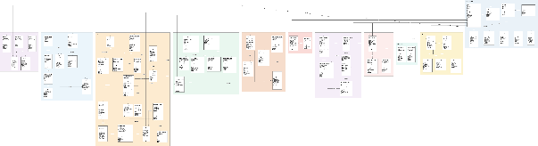*

**Figure 41: Entity Relationship Diagram**

[**Entity Relationship Diagram**](https://drive.google.com/file/d/16CvFUnra71JOTy7lN-Huugk5UT5WM51b/view?usp=sharing)

  **Entities Description**

| \# | Entity | Description |
| :---: | ----- | ----- |
| 1 | roles | Catalog of system roles used for RBAC, including USER, MOTHER, FAMILY\_MEMBER, EXPERT, MODERATOR, CONTENT\_ADMIN, ADMIN, and PARTNER. |
| 2 | users | Root account entity for all CareBridge users; stores identity and account-status data without mixing health records or community-profile data. |
| 3 | user\_roles | Junction entity that resolves the many-to-many relationship between users and roles. |
| 4 | user\_sessions | User login sessions and refresh tokens used to support viewing and revoking sessions on other devices. |
| 5 | community\_profiles | Public community display profile separated from identity records and health profiles. |
| 6 | notification\_preferences | Per-user settings for notification channels and notification categories. |
| 7 | notifications | Personal notifications generated by the system from reminders, community activity, consultations, safety events, or operations. |
| 8 | data\_permissions | Data-sharing permissions granted by users to family members or experts by scope, purpose, and expiry time. |
| 9 | audit\_logs | Immutable log of important actions such as login, profile viewing, permission changes, moderation, consultation, payment, and safety events. |
| 10 | mother\_journeys | Mother care journeys by pre-pregnancy, pregnancy, or postpartum state; one user may have multiple journeys over time. |
| 11 | maternal\_health\_metrics | Maternal health metrics entered manually or synchronized from another source, with source labeling. |
| 12 | postpartum\_logs | Postpartum recovery logs covering discharge, pain, breast milk, sleep, mood, and symptoms. |
| 13 | baby\_profiles | Baby profiles created and managed by the mother or authorized caregiver. |
| 14 | baby\_daily\_logs | Daily baby logs for feeding, sleep, diaper, temperature, reflux/vomiting, prescribed medicine, and notes. |
| 15 | development\_milestones | Baby development milestones such as rolling, crawling, walking, speaking, teething, or weaning. |
| 16 | growth\_measurements | Weight, height, and head-circumference measurements used to build growth charts. |
| 17 | vaccination\_records | Baby vaccination schedule and status data; used for personal tracking and not as a replacement for the official vaccination book. |
| 18 | health\_records | Personal health-record repository for mothers and babies, including ultrasound images, lab results, prescriptions, vaccination slips, and clinical results, with source labels. |
| 19 | health\_summaries | Time-bounded health-data summaries generated by users for viewing or temporary sharing. |
| 20 | reminders | Reminders for appointments, medicine or vitamins, vaccination, checklists, and care tasks. |
| 21 | care\_groups | Care groups created by the mother or manager for a journey or baby. |
| 22 | care\_group\_members | Junction entity between care\_groups and users; stores invitation status and member permissions. |
| 23 | care\_tasks | Care tasks assigned to group members, with due dates and completion status. |
| 24 | expenses | Expenses related to pregnancy, postpartum care, or baby care. |
| 25 | community\_topics | Community topic catalog used to classify questions and content. |
| 26 | community\_questions | Questions posted by users; may appear anonymous publicly while remaining internally traceable. |
| 27 | community\_answers | Answers from users or experts; expert answers carry badge and professional-scope information. |
| 28 | content\_reports | Reports submitted by users for violating content or accounts. |
| 29 | moderation\_actions | Moderation actions for reports or content, such as approve, hide, lock, warn, or suspend. |
| 30 | content\_items | Articles, FAQs, or educational content created and moderated by content administrators. |
| 31 | checklist\_templates | Moderated checklist templates for preparation by care stage. |
| 32 | checklist\_items | Child items belonging to a checklist template. |
| 33 | expert\_profiles | Professional profiles for registered doctors or experts; verification badge is granted only after admin approval. |
| 34 | expert\_credentials | Uploaded expert documents and certificates used for verification. |
| 35 | expert\_availability | Expert availability slots for consultations, including support mode and slot status; prices are versioned separately in expert\_consultation\_prices. |
| 36 | expert\_location\_shares | Expert-shared location or service area, controlled by consent and expiry, to support nearby search. |
| 37 | consultation\_bookings | Consultation booking request between a user and expert; locks the price snapshot, commission rate, and cancellation policy at confirmation or payment time. |
| 38 | consultation\_sessions | Chat, voice-call, or video-call sessions created from valid bookings. |
| 39 | consultation\_messages | Messages exchanged during consultation sessions, protected so only authorized parties can access them. |
| 40 | payment\_transactions | Payment transactions for bookings based on the price snapshot, including gross price, gateway fee, refund amount, net amount, and transaction status. |
| 41 | commission\_records | Commission calculation result after an eligible completed session, including original price, commission rate or amount, gateway fee, refund, expert net amount, and reconciliation status. |
| 42 | expert\_reviews | Expert reviews created only after a valid completed booking. |
| 43 | contribution\_points | Contribution point and badge history for users or experts based on community activity. |
| 44 | consultation\_price\_bands | Versioned CareBridge price bands by consultation mode, duration, and professional scope, including minimum price, maximum price, commission rate, and effective period. |
| 45 | expert\_consultation\_prices | Versioned expert-specific consultation prices within allowed bands; new prices apply only to future bookings and never retroactively change locked bookings. |
| 46 | consultation\_disputes | Consultation dispute records with reason, evidence, handling status, and operations decision. |
| 47 | refund\_records | Refund records linked to transactions and disputes, storing refund amount, processing status, and payment-gateway refund code. |
| 48 | settlement\_records | Expert settlement records by period or commission item, including gross value, commission, gateway fee, refund, net payout, and payment status. |
| 49 | triage\_assessments | Structured symptom-intake sessions with green, yellow, or red risk classification; not a medical diagnosis. |
| 50 | triage\_answers | Step-by-step answers submitted during a symptom-intake session. |
| 51 | partner\_organizations | Profiles for registered or approved clinics, healthcare facilities, social organizations, or sponsors. |
| 52 | partner\_expert\_links | Junction entity between partner\_organizations and expert\_profiles; links are effective only after approval. |
| 53 | partner\_services | Reference clinic or service listings submitted by partners and approved by admins for public display. |
| 54 | sponsored\_campaigns | Partner-submitted sponsored campaigns or content that require clear labeling and moderation. |
| 55 | care\_facilities | Healthcare-facility catalog used for emergency maps and nearby search; records may come from partners or map sources. |
| 56 | emergency\_events | Emergency or support-search flow opened by the user or system from triage, emergency button, or IMU event. |
| 57 | location\_snapshots | Minimal time-limited location snapshots used for emergency, family alerts, or nearby search. |
| 58 | health\_device\_connections | Optional smartwatch or health-platform connections storing secure token references and consent status. |
| 59 | device\_measurements | Device or health-platform measurements with source and confidence labels; used for trend viewing and not as a substitute for clinical measurement. |
| 60 | safety\_monitoring\_settings | Configuration for IMU monitoring, countdown, alert recipients, and location consent. |
| 61 | safety\_events | Suspected fall or strong-impact events detected from IMU data; stores minimal metadata and does not assert injury. |
| 62 | safety\_alerts | Minimal alerts sent to family members after the user requests help or does not respond. |
| 63 | pregnancy\_exercises | Moderated pregnancy-exercise catalog with trimester scope, difficulty, duration, instructions, safety warnings, and version status. |
| 64 | exercise\_safety\_checks | Mother's pre-exercise safety-check results for a specific exercise and journey, including structured answers, red flags, and allow-or-block decision. |
| 65 | exercise\_sessions | Mother's pregnancy-exercise sessions, storing time, pause/completion status, completion level, aggregate posture score, and alerts. |
| 66 | posture\_analysis\_configs | Rule-based or ML-based posture-analysis configuration for each exercise, including rule or model version, confidence threshold, and effective period. |
| 67 | posture\_feedback\_events | Posture feedback events generated during an exercise session; stores only necessary result/keypoint summaries and no raw camera video. |

**Table 264: Entities Description**

**Data Dictionary**

**1\. roles**

| No | Field | Name | Type | Constraint | Description |
| :---: | ----- | ----- | ----- | ----- | ----- |
| 1 | role\_id | Role ID | UUID | PK, NOT NULL | Primary key that uniquely identifies one role record. |
| 2 | role\_code | Role Code | VARCHAR(50) | UNIQUE | Display or reference value for role code. |
| 3 | role\_name | Role Name | VARCHAR(100) | NULL allowed / business validation | Display or reference value for role name. |
| 4 | description | Description | VARCHAR(500) | NULL allowed / business validation | Descriptive text for the role record. |
| 5 | is\_active | Is Active | BOOLEAN | NULL allowed / business validation | Boolean flag indicating is active. |
| 6 | created\_at | Created At | TIMESTAMP | NOT NULL | Timestamp when the record was created. |
| 7 | updated\_at | Updated At | TIMESTAMP | NULL allowed / business validation | Timestamp when the record was last updated. |

**Table 265: roles Data Dictionary**

**2\. users**

| No | Field | Name | Type | Constraint | Description |
| :---: | ----- | ----- | ----- | ----- | ----- |
| 1 | user\_id | User ID | UUID | PK, NOT NULL | Primary key that uniquely identifies one user record. |
| 2 | email | Email | VARCHAR(255) | UNIQUE | Email address associated with this record. |
| 3 | phone | Phone | VARCHAR(30) | NULL allowed / business validation | Phone number associated with this record. |
| 4 | password\_hash | Password Hash | VARCHAR(255) | NULL allowed / business validation | Secure password-related value stored for authentication. |
| 5 | full\_name | Full Name | VARCHAR(150) | NULL allowed / business validation | Display or reference value for full name. |
| 6 | avatar\_url | Avatar URL | VARCHAR(500) | NULL allowed / business validation | URL or URI value for avatar URL. |
| 7 | account\_status | Account Status | VARCHAR(30) | NULL allowed / business validation | Current status value for account status. |
| 8 | email\_verified | Email Verified | BOOLEAN | NULL allowed / business validation | Boolean flag indicating email verified. |
| 9 | phone\_verified | Phone Verified | BOOLEAN | NULL allowed / business validation | Boolean flag indicating phone verified. |
| 10 | last\_login\_at | Last Login At | TIMESTAMP | NULL allowed / business validation | Business timestamp or date value for last login at. |
| 11 | created\_at | Created At | TIMESTAMP | NOT NULL | Timestamp when the record was created. |
| 12 | updated\_at | Updated At | TIMESTAMP | NULL allowed / business validation | Timestamp when the record was last updated. |

**Table 266: users Data Dictionary**

**3\. user\_roles**

| No | Field | Name | Type | Constraint | Description |
| :---: | ----- | ----- | ----- | ----- | ----- |
| 1 | user\_role\_id | User Role ID | UUID | PK, NOT NULL | Primary key that uniquely identifies one user\_role record. |
| 2 | user\_id | User ID | UUID | FK | Foreign key that links this record to the related entity through user\_id. |
| 3 | role\_id | Role ID | UUID | FK | Foreign key that links this record to the related entity through role\_id. |
| 4 | assigned\_by | Assigned By | UUID | FK | Foreign key that links this record to the related entity through assigned\_by. |
| 5 | assigned\_at | Assigned At | TIMESTAMP | NULL allowed / business validation | Business timestamp or date value for assigned at. |
| 6 | expires\_at | Expires At | TIMESTAMP | NULL allowed / business validation | Business timestamp or date value for expires at. |
| 7 | status | Status | VARCHAR(20) | NOT NULL | Current status value for status. |
| 8 | created\_at | Created At | TIMESTAMP | NOT NULL | Timestamp when the record was created. |
| 9 | updated\_at | Updated At | TIMESTAMP | NULL allowed / business validation | Timestamp when the record was last updated. |

**Table 267: user\_roles Data Dictionary**

**4\. user\_sessions**

| No | Field | Name | Type | Constraint | Description |
| :---: | ----- | ----- | ----- | ----- | ----- |
| 1 | session\_id | Session ID | UUID | PK, NOT NULL | Primary key that uniquely identifies one session record. |
| 2 | user\_id | User ID | UUID | FK | Foreign key that links this record to the related entity through user\_id. |
| 3 | refresh\_token\_hash | Refresh Token Hash | VARCHAR(255) | NULL allowed / business validation | Secure token-related value used by the workflow. |
| 4 | device\_name | Device Name | VARCHAR(150) | NULL allowed / business validation | Display or reference value for device name. |
| 5 | ip\_address | IP Address | VARCHAR(64) | NULL allowed / business validation | Stores IP address for this session record. |
| 6 | expires\_at | Expires At | TIMESTAMP | NULL allowed / business validation | Business timestamp or date value for expires at. |
| 7 | revoked\_at | Revoked At | TIMESTAMP | NULL allowed / business validation | Business timestamp or date value for revoked at. |
| 8 | status | Status | VARCHAR(20) | NOT NULL | Current status value for status. |
| 9 | created\_at | Created At | TIMESTAMP | NOT NULL | Timestamp when the record was created. |
| 10 | updated\_at | Updated At | TIMESTAMP | NULL allowed / business validation | Timestamp when the record was last updated. |

**Table 268: user\_sessions Data Dictionary**

**5\. community\_profiles**

| No | Field | Name | Type | Constraint | Description |
| :---: | ----- | ----- | ----- | ----- | ----- |
| 1 | community\_profile\_id | Community Profile ID | UUID | PK, NOT NULL | Primary key that uniquely identifies one community\_profile record. |
| 2 | user\_id | User ID | UUID | FK | Foreign key that links this record to the related entity through user\_id. |
| 3 | display\_name | Display Name | VARCHAR(100) | NULL allowed / business validation | Display or reference value for display name. |
| 4 | public\_avatar\_url | Public Avatar URL | VARCHAR(500) | NULL allowed / business validation | URL or URI value for public avatar URL. |
| 5 | interest\_stage | Interest Stage | VARCHAR(30) | NULL allowed / business validation | Stores interest stage for this community\_profile record. |
| 6 | region | Region | VARCHAR(120) | NULL allowed / business validation | Stores region for this community\_profile record. |
| 7 | bio | Bio | VARCHAR(500) | NULL allowed / business validation | Stores bio for this community\_profile record. |
| 8 | is\_visible | Is Visible | BOOLEAN | NULL allowed / business validation | Boolean flag indicating is visible. |
| 9 | created\_at | Created At | TIMESTAMP | NOT NULL | Timestamp when the record was created. |
| 10 | updated\_at | Updated At | TIMESTAMP | NULL allowed / business validation | Timestamp when the record was last updated. |

**Table 269: community\_profiles Data Dictionary**

**6\. notification\_preferences**

| No | Field | Name | Type | Constraint | Description |
| :---: | ----- | ----- | ----- | ----- | ----- |
| 1 | preference\_id | Preference ID | UUID | PK, NOT NULL | Primary key that uniquely identifies one preference record. |
| 2 | user\_id | User ID | UUID | FK | Foreign key that links this record to the related entity through user\_id. |
| 3 | notification\_type | Notification Type | VARCHAR(50) | NULL allowed / business validation | Classification value for notification type. |
| 4 | in\_app\_enabled | In App Enabled | BOOLEAN | NULL allowed / business validation | Boolean flag indicating in app enabled. |
| 5 | push\_enabled | Push Enabled | BOOLEAN | NULL allowed / business validation | Boolean flag indicating push enabled. |
| 6 | email\_enabled | Email Enabled | BOOLEAN | NULL allowed / business validation | Boolean flag indicating email enabled. |
| 7 | quiet\_hours\_start | Quiet Hours Start | TIME | NULL allowed / business validation | Stores quiet hours start for this preference record. |
| 8 | quiet\_hours\_end | Quiet Hours End | TIME | NULL allowed / business validation | Stores quiet hours end for this preference record. |
| 9 | created\_at | Created At | TIMESTAMP | NOT NULL | Timestamp when the record was created. |
| 10 | updated\_at | Updated At | TIMESTAMP | NULL allowed / business validation | Timestamp when the record was last updated. |

**Table 270: notification\_preferences Data Dictionary**

**7\. notifications**

| No | Field | Name | Type | Constraint | Description |
| :---: | ----- | ----- | ----- | ----- | ----- |
| 1 | notification\_id | Notification ID | UUID | PK, NOT NULL | Primary key that uniquely identifies one notification record. |
| 2 | recipient\_user\_id | Recipient User ID | UUID | FK | Foreign key that links this record to the related entity through recipient\_user\_id. |
| 3 | notification\_type | Notification Type | VARCHAR(50) | NULL allowed / business validation | Classification value for notification type. |
| 4 | title | Title | VARCHAR(200) | NULL allowed / business validation | Display or reference value for title. |
| 5 | body | Body | TEXT | NULL allowed / business validation | Stores body for this notification record. |
| 6 | reference\_type | Reference Type | VARCHAR(50) | NULL allowed / business validation | Classification value for reference type. |
| 7 | reference\_id | Reference ID | UUID | NULL allowed / business validation | Stores reference ID for this notification record. |
| 8 | is\_read | Is Read | BOOLEAN | NULL allowed / business validation | Boolean flag indicating is read. |
| 9 | sent\_at | Sent At | TIMESTAMP | NULL allowed / business validation | Business timestamp or date value for sent at. |
| 10 | delivery\_status | Delivery Status | VARCHAR(20) | NULL allowed / business validation | Current status value for delivery status. |
| 11 | created\_at | Created At | TIMESTAMP | NOT NULL | Timestamp when the record was created. |
| 12 | updated\_at | Updated At | TIMESTAMP | NULL allowed / business validation | Timestamp when the record was last updated. |

**Table 271: notifications Data Dictionary**

**8\. data\_permissions**

| No | Field | Name | Type | Constraint | Description |
| :---: | ----- | ----- | ----- | ----- | ----- |
| 1 | permission\_id | Permission ID | UUID | PK, NOT NULL | Primary key that uniquely identifies one permission record. |
| 2 | owner\_user\_id | Owner User ID | UUID | FK | Foreign key that links this record to the related entity through owner\_user\_id. |
| 3 | grantee\_user\_id | Grantee User ID | UUID | FK | Foreign key that links this record to the related entity through grantee\_user\_id. |
| 4 | scope\_type | Scope Type | VARCHAR(50) | NULL allowed / business validation | Classification value for scope type. |
| 5 | scope\_reference\_id | Scope Reference ID | UUID | NULL allowed / business validation | Stores scope reference ID for this permission record. |
| 6 | purpose | Purpose | VARCHAR(255) | NULL allowed / business validation | Stores purpose for this permission record. |
| 7 | granted\_at | Granted At | TIMESTAMP | NULL allowed / business validation | Business timestamp or date value for granted at. |
| 8 | expires\_at | Expires At | TIMESTAMP | NULL allowed / business validation | Business timestamp or date value for expires at. |
| 9 | revoked\_at | Revoked At | TIMESTAMP | NULL allowed / business validation | Business timestamp or date value for revoked at. |
| 10 | status | Status | VARCHAR(20) | NOT NULL | Current status value for status. |
| 11 | created\_at | Created At | TIMESTAMP | NOT NULL | Timestamp when the record was created. |
| 12 | updated\_at | Updated At | TIMESTAMP | NULL allowed / business validation | Timestamp when the record was last updated. |

**Table 272: data\_permissions Data Dictionary**

**9\. audit\_logs**

| No | Field | Name | Type | Constraint | Description |
| :---: | ----- | ----- | ----- | ----- | ----- |
| 1 | audit\_log\_id | Audit Log ID | UUID | PK, NOT NULL | Primary key that uniquely identifies one audit\_log record. |
| 2 | actor\_user\_id | Actor User ID | UUID | FK | Foreign key that links this record to the related entity through actor\_user\_id. |
| 3 | action | Action | VARCHAR(100) | NULL allowed / business validation | Stores action for this audit\_log record. |
| 4 | entity\_type | Entity Type | VARCHAR(80) | NULL allowed / business validation | Classification value for entity type. |
| 5 | entity\_id | Entity ID | UUID | NULL allowed / business validation | Stores entity ID for this audit\_log record. |
| 6 | old\_value\_json | Old Value Json | JSON | NULL allowed / business validation | Stores old value json for this audit\_log record. |
| 7 | new\_value\_json | New Value Json | JSON | NULL allowed / business validation | Stores new value json for this audit\_log record. |
| 8 | ip\_address | IP Address | VARCHAR(64) | NULL allowed / business validation | Stores IP address for this audit\_log record. |
| 9 | created\_at | Created At | TIMESTAMP | NOT NULL | Timestamp when the record was created. |

**Table 273: audit\_logs Data Dictionary**

**10\. mother\_journeys**

| No | Field | Name | Type | Constraint | Description |
| :---: | ----- | ----- | ----- | ----- | ----- |
| 1 | journey\_id | Journey ID | UUID | PK, NOT NULL | Primary key that uniquely identifies one journey record. |
| 2 | owner\_user\_id | Owner User ID | UUID | FK | Foreign key that links this record to the related entity through owner\_user\_id. |
| 3 | journey\_type | Journey Type | VARCHAR(30) | NULL allowed / business validation | Classification value for journey type. |
| 4 | start\_date | Start Date | DATE | NULL allowed / business validation | Business timestamp or date value for start date. |
| 5 | last\_menstrual\_date | Last Menstrual Date | DATE | NULL allowed / business validation | Business timestamp or date value for last menstrual date. |
| 6 | estimated\_due\_date | Estimated Due Date | DATE | NULL allowed / business validation | Business timestamp or date value for estimated due date. |
| 7 | delivery\_date | Delivery Date | DATE | NULL allowed / business validation | Business timestamp or date value for delivery date. |
| 8 | status | Status | VARCHAR(20) | NOT NULL | Current status value for status. |
| 9 | notes | Notes | TEXT | NULL allowed / business validation | Text content recorded for notes. |
| 10 | created\_at | Created At | TIMESTAMP | NOT NULL | Timestamp when the record was created. |
| 11 | updated\_at | Updated At | TIMESTAMP | NULL allowed / business validation | Timestamp when the record was last updated. |

**Table 274: mother\_journeys Data Dictionary**

**11\. maternal\_health\_metrics**

| No | Field | Name | Type | Constraint | Description |
| :---: | ----- | ----- | ----- | ----- | ----- |
| 1 | metric\_id | Metric ID | UUID | PK, NOT NULL | Primary key that uniquely identifies one metric record. |
| 2 | journey\_id | Journey ID | UUID | FK | Foreign key that links this record to the related entity through journey\_id. |
| 3 | metric\_type | Metric Type | VARCHAR(40) | NULL allowed / business validation | Classification value for metric type. |
| 4 | value\_numeric | Value Numeric | DECIMAL(12,3) | NULL allowed / business validation | Stores value numeric for this metric record. |
| 5 | value\_secondary | Value Secondary | DECIMAL(12,3) | NULL allowed / business validation | Stores value secondary for this metric record. |
| 6 | unit | Unit | VARCHAR(30) | NULL allowed / business validation | Stores unit for this metric record. |
| 7 | measured\_at | Measured At | TIMESTAMP | NULL allowed / business validation | Business timestamp or date value for measured at. |
| 8 | source\_type | Source Type | VARCHAR(30) | NULL allowed / business validation | Classification value for source type. |
| 9 | source\_reference\_id | Source Reference ID | UUID | NULL allowed / business validation | Stores source reference ID for this metric record. |
| 10 | note | Note | VARCHAR(500) | NULL allowed / business validation | Text content recorded for note. |
| 11 | created\_at | Created At | TIMESTAMP | NOT NULL | Timestamp when the record was created. |
| 12 | updated\_at | Updated At | TIMESTAMP | NULL allowed / business validation | Timestamp when the record was last updated. |

**Table 275: maternal\_health\_metrics Data Dictionary**

**12\. postpartum\_logs**

| No | Field | Name | Type | Constraint | Description |
| :---: | ----- | ----- | ----- | ----- | ----- |
| 1 | postpartum\_log\_id | Postpartum Log ID | UUID | PK, NOT NULL | Primary key that uniquely identifies one postpartum\_log record. |
| 2 | journey\_id | Journey ID | UUID | FK | Foreign key that links this record to the related entity through journey\_id. |
| 3 | log\_date | Log Date | DATE | NULL allowed / business validation | Business timestamp or date value for log date. |
| 4 | pain\_level | Pain Level | SMALLINT | CHECK | Classification value for pain level. |
| 5 | bleeding\_level | Bleeding Level | VARCHAR(20) | NULL allowed / business validation | Classification value for bleeding level. |
| 6 | mood\_level | Mood Level | SMALLINT | CHECK | Classification value for mood level. |
| 7 | sleep\_hours | Sleep Hours | DECIMAL(4,1) | NULL allowed / business validation | Stores sleep hours for this postpartum\_log record. |
| 8 | breastfeeding\_note | Breastfeeding Note | TEXT | NULL allowed / business validation | Monetary value used for breastfeeding note. |
| 9 | symptom\_note | Symptom Note | TEXT | NULL allowed / business validation | Text content recorded for symptom note. |
| 10 | created\_at | Created At | TIMESTAMP | NOT NULL | Timestamp when the record was created. |
| 11 | updated\_at | Updated At | TIMESTAMP | NULL allowed / business validation | Timestamp when the record was last updated. |

**Table 276: postpartum\_logs Data Dictionary**

**13\. baby\_profiles**

| No | Field | Name | Type | Constraint | Description |
| :---: | ----- | ----- | ----- | ----- | ----- |
| 1 | baby\_id | Baby ID | UUID | PK, NOT NULL | Primary key that uniquely identifies one baby record. |
| 2 | owner\_user\_id | Owner User ID | UUID | FK | Foreign key that links this record to the related entity through owner\_user\_id. |
| 3 | related\_journey\_id | Related Journey ID | UUID | FK | Foreign key that links this record to the related entity through related\_journey\_id. |
| 4 | nickname | Nickname | VARCHAR(100) | NULL allowed / business validation | Display or reference value for nickname. |
| 5 | birth\_date | Birth Date | DATE | NULL allowed / business validation | Business timestamp or date value for birth date. |
| 6 | sex | Sex | VARCHAR(20) | NULL allowed / business validation | Stores sex for this baby record. |
| 7 | birth\_weight\_kg | Birth Weight Kg | DECIMAL(5,2) | NULL allowed / business validation | Stores birth weight kg for this baby record. |
| 8 | birth\_length\_cm | Birth Length Cm | DECIMAL(5,2) | NULL allowed / business validation | Stores birth length cm for this baby record. |
| 9 | status | Status | VARCHAR(20) | NOT NULL | Current status value for status. |
| 10 | created\_at | Created At | TIMESTAMP | NOT NULL | Timestamp when the record was created. |
| 11 | updated\_at | Updated At | TIMESTAMP | NULL allowed / business validation | Timestamp when the record was last updated. |

**Table 277: baby\_profiles Data Dictionary**

**14\. baby\_daily\_logs**

| No | Field | Name | Type | Constraint | Description |
| :---: | ----- | ----- | ----- | ----- | ----- |
| 1 | baby\_log\_id | Baby Log ID | UUID | PK, NOT NULL | Primary key that uniquely identifies one baby\_log record. |
| 2 | baby\_id | Baby ID | UUID | FK | Foreign key that links this record to the related entity through baby\_id. |
| 3 | log\_type | Log Type | VARCHAR(30) | NULL allowed / business validation | Classification value for log type. |
| 4 | started\_at | Started At | TIMESTAMP | NULL allowed / business validation | Business timestamp or date value for started at. |
| 5 | ended\_at | Ended At | TIMESTAMP | NULL allowed / business validation | Business timestamp or date value for ended at. |
| 6 | quantity | Quantity | DECIMAL(10,2) | NULL allowed / business validation | Stores quantity for this baby\_log record. |
| 7 | unit | Unit | VARCHAR(20) | NULL allowed / business validation | Stores unit for this baby\_log record. |
| 8 | note | Note | TEXT | NULL allowed / business validation | Text content recorded for note. |
| 9 | recorded\_by | Recorded By | UUID | FK | Foreign key that links this record to the related entity through recorded\_by. |
| 10 | created\_at | Created At | TIMESTAMP | NOT NULL | Timestamp when the record was created. |
| 11 | updated\_at | Updated At | TIMESTAMP | NULL allowed / business validation | Timestamp when the record was last updated. |

**Table 278: baby\_daily\_logs Data Dictionary**

**15\. development\_milestones**

| No | Field | Name | Type | Constraint | Description |
| :---: | ----- | ----- | ----- | ----- | ----- |
| 1 | milestone\_id | Milestone ID | UUID | PK, NOT NULL | Primary key that uniquely identifies one milestone record. |
| 2 | baby\_id | Baby ID | UUID | FK | Foreign key that links this record to the related entity through baby\_id. |
| 3 | milestone\_type | Milestone Type | VARCHAR(60) | NULL allowed / business validation | Classification value for milestone type. |
| 4 | achieved\_date | Achieved Date | DATE | NULL allowed / business validation | Business timestamp or date value for achieved date. |
| 5 | note | Note | TEXT | NULL allowed / business validation | Text content recorded for note. |
| 6 | source\_type | Source Type | VARCHAR(30) | NULL allowed / business validation | Classification value for source type. |
| 7 | recorded\_by | Recorded By | UUID | FK | Foreign key that links this record to the related entity through recorded\_by. |
| 8 | created\_at | Created At | TIMESTAMP | NOT NULL | Timestamp when the record was created. |
| 9 | updated\_at | Updated At | TIMESTAMP | NULL allowed / business validation | Timestamp when the record was last updated. |

**Table 279: development\_milestones Data Dictionary**

**16\. growth\_measurements**

| No | Field | Name | Type | Constraint | Description |
| :---: | ----- | ----- | ----- | ----- | ----- |
| 1 | growth\_measurement\_id | Growth Measurement ID | UUID | PK, NOT NULL | Primary key that uniquely identifies one growth\_measurement record. |
| 2 | baby\_id | Baby ID | UUID | FK | Foreign key that links this record to the related entity through baby\_id. |
| 3 | measured\_date | Measured Date | DATE | NULL allowed / business validation | Business timestamp or date value for measured date. |
| 4 | weight\_kg | Weight Kg | DECIMAL(5,2) | NULL allowed / business validation | Stores weight kg for this growth\_measurement record. |
| 5 | height\_cm | Height Cm | DECIMAL(5,2) | NULL allowed / business validation | Stores height cm for this growth\_measurement record. |
| 6 | head\_circumference\_cm | Head Circumference Cm | DECIMAL(5,2) | NULL allowed / business validation | Stores head circumference cm for this growth\_measurement record. |
| 7 | source\_type | Source Type | VARCHAR(30) | NULL allowed / business validation | Classification value for source type. |
| 8 | note | Note | VARCHAR(500) | NULL allowed / business validation | Text content recorded for note. |
| 9 | created\_at | Created At | TIMESTAMP | NOT NULL | Timestamp when the record was created. |
| 10 | updated\_at | Updated At | TIMESTAMP | NULL allowed / business validation | Timestamp when the record was last updated. |

**Table 280: growth\_measurements Data Dictionary**

**17\. vaccination\_records**

| No | Field | Name | Type | Constraint | Description |
| :---: | ----- | ----- | ----- | ----- | ----- |
| 1 | vaccination\_record\_id | Vaccination Record ID | UUID | PK, NOT NULL | Primary key that uniquely identifies one vaccination\_record record. |
| 2 | baby\_id | Baby ID | UUID | FK | Foreign key that links this record to the related entity through baby\_id. |
| 3 | vaccine\_name | Vaccine Name | VARCHAR(200) | NULL allowed / business validation | Display or reference value for vaccine name. |
| 4 | dose\_number | Dose Number | VARCHAR(30) | NULL allowed / business validation | Count or numeric reference used for dose number. |
| 5 | scheduled\_date | Scheduled Date | DATE | NULL allowed / business validation | Business timestamp or date value for scheduled date. |
| 6 | administered\_date | Administered Date | DATE | NULL allowed / business validation | Business timestamp or date value for administered date. |
| 7 | status | Status | VARCHAR(20) | NOT NULL | Current status value for status. |
| 8 | facility\_name | Facility Name | VARCHAR(255) | NULL allowed / business validation | Display or reference value for facility name. |
| 9 | proof\_record\_id | Proof Record ID | UUID | FK | Foreign key that links this record to the related entity through proof\_record\_id. |
| 10 | created\_at | Created At | TIMESTAMP | NOT NULL | Timestamp when the record was created. |
| 11 | updated\_at | Updated At | TIMESTAMP | NULL allowed / business validation | Timestamp when the record was last updated. |

**Table 281: vaccination\_records Data Dictionary**

**18\. health\_records**

| No | Field | Name | Type | Constraint | Description |
| :---: | ----- | ----- | ----- | ----- | ----- |
| 1 | health\_record\_id | Health Record ID | UUID | PK, NOT NULL | Primary key that uniquely identifies one health\_record record. |
| 2 | owner\_user\_id | Owner User ID | UUID | FK | Foreign key that links this record to the related entity through owner\_user\_id. |
| 3 | journey\_id | Journey ID | UUID | FK | Foreign key that links this record to the related entity through journey\_id. |
| 4 | baby\_id | Baby ID | UUID | FK | Foreign key that links this record to the related entity through baby\_id. |
| 5 | record\_type | Record Type | VARCHAR(50) | NULL allowed / business validation | Classification value for record type. |
| 6 | title | Title | VARCHAR(200) | NULL allowed / business validation | Display or reference value for title. |
| 7 | file\_url | File URL | VARCHAR(500) | NULL allowed / business validation | URL or URI value for file URL. |
| 8 | record\_date | Record Date | DATE | NULL allowed / business validation | Business timestamp or date value for record date. |
| 9 | source\_type | Source Type | VARCHAR(30) | NULL allowed / business validation | Classification value for source type. |
| 10 | source\_name | Source Name | VARCHAR(255) | NULL allowed / business validation | Display or reference value for source name. |
| 11 | status | Status | VARCHAR(20) | NOT NULL | Current status value for status. |
| 12 | created\_at | Created At | TIMESTAMP | NOT NULL | Timestamp when the record was created. |
| 13 | updated\_at | Updated At | TIMESTAMP | NULL allowed / business validation | Timestamp when the record was last updated. |

**Table 282: health\_records Data Dictionary**

**19\. health\_summaries**

| No | Field | Name | Type | Constraint | Description |
| :---: | ----- | ----- | ----- | ----- | ----- |
| 1 | summary\_id | Summary ID | UUID | PK, NOT NULL | Primary key that uniquely identifies one summary record. |
| 2 | owner\_user\_id | Owner User ID | UUID | FK | Foreign key that links this record to the related entity through owner\_user\_id. |
| 3 | journey\_id | Journey ID | UUID | FK | Foreign key that links this record to the related entity through journey\_id. |
| 4 | baby\_id | Baby ID | UUID | FK | Foreign key that links this record to the related entity through baby\_id. |
| 5 | summary\_period | Summary Period | VARCHAR(30) | NULL allowed / business validation | Stores summary period for this summary record. |
| 6 | period\_start | Period Start | TIMESTAMP | NULL allowed / business validation | Business timestamp or date value for period start. |
| 7 | period\_end | Period End | TIMESTAMP | NULL allowed / business validation | Business timestamp or date value for period end. |
| 8 | summary\_json | Summary Json | JSON | NULL allowed / business validation | Stores summary json for this summary record. |
| 9 | generated\_by | Generated By | VARCHAR(20) | NULL allowed / business validation | Numeric value used for generated by. |
| 10 | status | Status | VARCHAR(20) | NOT NULL | Current status value for status. |
| 11 | created\_at | Created At | TIMESTAMP | NOT NULL | Timestamp when the record was created. |
| 12 | updated\_at | Updated At | TIMESTAMP | NULL allowed / business validation | Timestamp when the record was last updated. |

**Table 283: health\_summaries Data Dictionary**

**20\. reminders**

| No | Field | Name | Type | Constraint | Description |
| :---: | ----- | ----- | ----- | ----- | ----- |
| 1 | reminder\_id | Reminder ID | UUID | PK, NOT NULL | Primary key that uniquely identifies one reminder record. |
| 2 | owner\_user\_id | Owner User ID | UUID | FK | Foreign key that links this record to the related entity through owner\_user\_id. |
| 3 | journey\_id | Journey ID | UUID | FK | Foreign key that links this record to the related entity through journey\_id. |
| 4 | baby\_id | Baby ID | UUID | FK | Foreign key that links this record to the related entity through baby\_id. |
| 5 | reminder\_type | Reminder Type | VARCHAR(40) | NULL allowed / business validation | Classification value for reminder type. |
| 6 | title | Title | VARCHAR(200) | NULL allowed / business validation | Display or reference value for title. |
| 7 | scheduled\_at | Scheduled At | TIMESTAMP | NULL allowed / business validation | Business timestamp or date value for scheduled at. |
| 8 | recurrence\_rule | Recurrence Rule | VARCHAR(255) | NULL allowed / business validation | Stores recurrence rule for this reminder record. |
| 9 | status | Status | VARCHAR(20) | NOT NULL | Current status value for status. |
| 10 | snoozed\_until | Snoozed Until | TIMESTAMP | NULL allowed / business validation | Business timestamp or date value for snoozed until. |
| 11 | created\_at | Created At | TIMESTAMP | NOT NULL | Timestamp when the record was created. |
| 12 | updated\_at | Updated At | TIMESTAMP | NULL allowed / business validation | Timestamp when the record was last updated. |

**Table 284: reminders Data Dictionary**

**21\. care\_groups**

| No | Field | Name | Type | Constraint | Description |
| :---: | ----- | ----- | ----- | ----- | ----- |
| 1 | care\_group\_id | Care Group ID | UUID | PK, NOT NULL | Primary key that uniquely identifies one care\_group record. |
| 2 | owner\_user\_id | Owner User ID | UUID | FK | Foreign key that links this record to the related entity through owner\_user\_id. |
| 3 | journey\_id | Journey ID | UUID | FK | Foreign key that links this record to the related entity through journey\_id. |
| 4 | baby\_id | Baby ID | UUID | FK | Foreign key that links this record to the related entity through baby\_id. |
| 5 | group\_name | Group Name | VARCHAR(150) | NULL allowed / business validation | Display or reference value for group name. |
| 6 | status | Status | VARCHAR(20) | NOT NULL | Current status value for status. |
| 7 | created\_at | Created At | TIMESTAMP | NOT NULL | Timestamp when the record was created. |
| 8 | updated\_at | Updated At | TIMESTAMP | NULL allowed / business validation | Timestamp when the record was last updated. |

**Table 285: care\_groups Data Dictionary**

**22\. care\_group\_members**

| No | Field | Name | Type | Constraint | Description |
| :---: | ----- | ----- | ----- | ----- | ----- |
| 1 | care\_group\_member\_id | Care Group Member ID | UUID | PK, NOT NULL | Primary key that uniquely identifies one care\_group\_member record. |
| 2 | care\_group\_id | Care Group ID | UUID | FK | Foreign key that links this record to the related entity through care\_group\_id. |
| 3 | user\_id | User ID | UUID | FK | Foreign key that links this record to the related entity through user\_id. |
| 4 | member\_role | Member Role | VARCHAR(30) | NULL allowed / business validation | Stores member role for this care\_group\_member record. |
| 5 | invitation\_status | Invitation Status | VARCHAR(20) | NULL allowed / business validation | Current status value for invitation status. |
| 6 | permission\_json | Permission Json | JSON | NULL allowed / business validation | Stores permission json for this care\_group\_member record. |
| 7 | joined\_at | Joined At | TIMESTAMP | NULL allowed / business validation | Business timestamp or date value for joined at. |
| 8 | created\_at | Created At | TIMESTAMP | NOT NULL | Timestamp when the record was created. |
| 9 | updated\_at | Updated At | TIMESTAMP | NULL allowed / business validation | Timestamp when the record was last updated. |

**Table 286: care\_group\_members Data Dictionary**

**23\. care\_tasks**

| No | Field | Name | Type | Constraint | Description |
| :---: | ----- | ----- | ----- | ----- | ----- |
| 1 | care\_task\_id | Care Task ID | UUID | PK, NOT NULL | Primary key that uniquely identifies one care\_task record. |
| 2 | care\_group\_id | Care Group ID | UUID | FK | Foreign key that links this record to the related entity through care\_group\_id. |
| 3 | assigned\_by | Assigned By | UUID | FK | Foreign key that links this record to the related entity through assigned\_by. |
| 4 | assigned\_to | Assigned To | UUID | FK | Foreign key that links this record to the related entity through assigned\_to. |
| 5 | title | Title | VARCHAR(200) | NULL allowed / business validation | Display or reference value for title. |
| 6 | description | Description | TEXT | NULL allowed / business validation | Descriptive text for the care\_task record. |
| 7 | due\_at | Due At | TIMESTAMP | NULL allowed / business validation | Business timestamp or date value for due at. |
| 8 | status | Status | VARCHAR(20) | NOT NULL | Current status value for status. |
| 9 | completed\_at | Completed At | TIMESTAMP | NULL allowed / business validation | Business timestamp or date value for completed at. |
| 10 | created\_at | Created At | TIMESTAMP | NOT NULL | Timestamp when the record was created. |
| 11 | updated\_at | Updated At | TIMESTAMP | NULL allowed / business validation | Timestamp when the record was last updated. |

**Table 287: care\_tasks Data Dictionary**

**24\. expenses**

| No | Field | Name | Type | Constraint | Description |
| :---: | ----- | ----- | ----- | ----- | ----- |
| 1 | expense\_id | Expense ID | UUID | PK, NOT NULL | Primary key that uniquely identifies one expense record. |
| 2 | owner\_user\_id | Owner User ID | UUID | FK | Foreign key that links this record to the related entity through owner\_user\_id. |
| 3 | journey\_id | Journey ID | UUID | FK | Foreign key that links this record to the related entity through journey\_id. |
| 4 | baby\_id | Baby ID | UUID | FK | Foreign key that links this record to the related entity through baby\_id. |
| 5 | category | Category | VARCHAR(40) | NULL allowed / business validation | Classification value for category. |
| 6 | amount | Amount | DECIMAL(15,2) | NULL allowed / business validation | Monetary value used for amount. |
| 7 | currency | Currency | CHAR(3) | NULL allowed / business validation | Stores currency for this expense record. |
| 8 | expense\_date | Expense Date | DATE | NULL allowed / business validation | Business timestamp or date value for expense date. |
| 9 | note | Note | VARCHAR(500) | NULL allowed / business validation | Text content recorded for note. |
| 10 | created\_at | Created At | TIMESTAMP | NOT NULL | Timestamp when the record was created. |
| 11 | updated\_at | Updated At | TIMESTAMP | NULL allowed / business validation | Timestamp when the record was last updated. |

**Table 288: expenses Data Dictionary**

**25\. community\_topics**

| No | Field | Name | Type | Constraint | Description |
| :---: | ----- | ----- | ----- | ----- | ----- |
| 1 | topic\_id | Topic ID | UUID | PK, NOT NULL | Primary key that uniquely identifies one topic record. |
| 2 | name | Name | VARCHAR(150) | NULL allowed / business validation | Display or reference value for name. |
| 3 | slug | Slug | VARCHAR(160) | NULL allowed / business validation | Stores slug for this topic record. |
| 4 | description | Description | VARCHAR(500) | NULL allowed / business validation | Descriptive text for the topic record. |
| 5 | risk\_level | Risk Level | VARCHAR(20) | NULL allowed / business validation | Classification value for risk level. |
| 6 | is\_active | Is Active | BOOLEAN | NULL allowed / business validation | Boolean flag indicating is active. |
| 7 | created\_at | Created At | TIMESTAMP | NOT NULL | Timestamp when the record was created. |
| 8 | updated\_at | Updated At | TIMESTAMP | NULL allowed / business validation | Timestamp when the record was last updated. |

**Table 289: community\_topics Data Dictionary**

**26\. community\_questions**

| No | Field | Name | Type | Constraint | Description |
| :---: | ----- | ----- | ----- | ----- | ----- |
| 1 | question\_id | Question ID | UUID | PK, NOT NULL | Primary key that uniquely identifies one question record. |
| 2 | author\_user\_id | Author User ID | UUID | FK | Foreign key that links this record to the related entity through author\_user\_id. |
| 3 | topic\_id | Topic ID | UUID | FK | Foreign key that links this record to the related entity through topic\_id. |
| 4 | title | Title | VARCHAR(250) | NULL allowed / business validation | Display or reference value for title. |
| 5 | content | Content | TEXT | NULL allowed / business validation | Text content recorded for content. |
| 6 | is\_anonymous | Is Anonymous | BOOLEAN | NULL allowed / business validation | Boolean flag indicating is anonymous. |
| 7 | urgency\_level | Urgency Level | VARCHAR(20) | NULL allowed / business validation | Classification value for urgency level. |
| 8 | moderation\_status | Moderation Status | VARCHAR(20) | NULL allowed / business validation | Current status value for moderation status. |
| 9 | published\_at | Published At | TIMESTAMP | NULL allowed / business validation | Business timestamp or date value for published at. |
| 10 | created\_at | Created At | TIMESTAMP | NOT NULL | Timestamp when the record was created. |
| 11 | updated\_at | Updated At | TIMESTAMP | NULL allowed / business validation | Timestamp when the record was last updated. |

**Table 290: community\_questions Data Dictionary**

**27\. community\_answers**

| No | Field | Name | Type | Constraint | Description |
| :---: | ----- | ----- | ----- | ----- | ----- |
| 1 | answer\_id | Answer ID | UUID | PK, NOT NULL | Primary key that uniquely identifies one answer record. |
| 2 | question\_id | Question ID | UUID | FK | Foreign key that links this record to the related entity through question\_id. |
| 3 | author\_user\_id | Author User ID | UUID | FK | Foreign key that links this record to the related entity through author\_user\_id. |
| 4 | content | Content | TEXT | NULL allowed / business validation | Text content recorded for content. |
| 5 | answer\_type | Answer Type | VARCHAR(20) | NULL allowed / business validation | Classification value for answer type. |
| 6 | expert\_profile\_id | Expert Profile ID | UUID | FK | Foreign key that links this record to the related entity through expert\_profile\_id. |
| 7 | moderation\_status | Moderation Status | VARCHAR(20) | NULL allowed / business validation | Current status value for moderation status. |
| 8 | helpful\_count | Helpful Count | INT | NULL allowed / business validation | Count or numeric reference used for helpful count. |
| 9 | published\_at | Published At | TIMESTAMP | NULL allowed / business validation | Business timestamp or date value for published at. |
| 10 | created\_at | Created At | TIMESTAMP | NOT NULL | Timestamp when the record was created. |
| 11 | updated\_at | Updated At | TIMESTAMP | NULL allowed / business validation | Timestamp when the record was last updated. |

**Table 291: community\_answers Data Dictionary**

**28\. content\_reports**

| No | Field | Name | Type | Constraint | Description |
| :---: | ----- | ----- | ----- | ----- | ----- |
| 1 | report\_id | Report ID | UUID | PK, NOT NULL | Primary key that uniquely identifies one report record. |
| 2 | reporter\_user\_id | Reporter User ID | UUID | FK | Foreign key that links this record to the related entity through reporter\_user\_id. |
| 3 | target\_type | Target Type | VARCHAR(30) | NULL allowed / business validation | Classification value for target type. |
| 4 | target\_id | Target ID | UUID | NULL allowed / business validation | Stores target ID for this report record. |
| 5 | reason\_code | Reason Code | VARCHAR(40) | NULL allowed / business validation | Text content recorded for reason code. |
| 6 | description | Description | TEXT | NULL allowed / business validation | Descriptive text for the report record. |
| 7 | status | Status | VARCHAR(20) | NOT NULL | Current status value for status. |
| 8 | assigned\_moderator\_id | Assigned Moderator ID | UUID | FK | Foreign key that links this record to the related entity through assigned\_moderator\_id. |
| 9 | resolved\_at | Resolved At | TIMESTAMP | NULL allowed / business validation | Business timestamp or date value for resolved at. |
| 10 | created\_at | Created At | TIMESTAMP | NOT NULL | Timestamp when the record was created. |
| 11 | updated\_at | Updated At | TIMESTAMP | NULL allowed / business validation | Timestamp when the record was last updated. |

**Table 292: content\_reports Data Dictionary**

**29\. moderation\_actions**

| No | Field | Name | Type | Constraint | Description |
| :---: | ----- | ----- | ----- | ----- | ----- |
| 1 | moderation\_action\_id | Moderation Action ID | UUID | PK, NOT NULL | Primary key that uniquely identifies one moderation\_action record. |
| 2 | report\_id | Report ID | UUID | FK | Foreign key that links this record to the related entity through report\_id. |
| 3 | moderator\_user\_id | Moderator User ID | UUID | FK | Foreign key that links this record to the related entity through moderator\_user\_id. |
| 4 | target\_type | Target Type | VARCHAR(30) | NULL allowed / business validation | Classification value for target type. |
| 5 | target\_id | Target ID | UUID | NULL allowed / business validation | Stores target ID for this moderation\_action record. |
| 6 | action\_type | Action Type | VARCHAR(30) | NULL allowed / business validation | Classification value for action type. |
| 7 | reason | Reason | TEXT | NULL allowed / business validation | Text content recorded for reason. |
| 8 | action\_at | Action At | TIMESTAMP | NULL allowed / business validation | Business timestamp or date value for action at. |
| 9 | expires\_at | Expires At | TIMESTAMP | NULL allowed / business validation | Business timestamp or date value for expires at. |

**Table 293: moderation\_actions Data Dictionary**

**30\. content\_items**

| No | Field | Name | Type | Constraint | Description |
| :---: | ----- | ----- | ----- | ----- | ----- |
| 1 | content\_item\_id | Content Item ID | UUID | PK, NOT NULL | Primary key that uniquely identifies one content\_item record. |
| 2 | topic\_id | Topic ID | UUID | FK | Foreign key that links this record to the related entity through topic\_id. |
| 3 | author\_user\_id | Author User ID | UUID | FK | Foreign key that links this record to the related entity through author\_user\_id. |
| 4 | content\_type | Content Type | VARCHAR(30) | NULL allowed / business validation | Text content recorded for content type. |
| 5 | title | Title | VARCHAR(250) | NULL allowed / business validation | Display or reference value for title. |
| 6 | body | Body | TEXT | NULL allowed / business validation | Stores body for this content\_item record. |
| 7 | source\_label | Source Label | VARCHAR(255) | NULL allowed / business validation | Stores source label for this content\_item record. |
| 8 | version\_no | Version No | INT | NULL allowed / business validation | Stores version no for this content\_item record. |
| 9 | status | Status | VARCHAR(20) | NOT NULL | Current status value for status. |
| 10 | published\_at | Published At | TIMESTAMP | NULL allowed / business validation | Business timestamp or date value for published at. |
| 11 | created\_at | Created At | TIMESTAMP | NOT NULL | Timestamp when the record was created. |
| 12 | updated\_at | Updated At | TIMESTAMP | NULL allowed / business validation | Timestamp when the record was last updated. |

**Table 294: content\_items Data Dictionary**

**31\. checklist\_templates**

| No | Field | Name | Type | Constraint | Description |
| :---: | ----- | ----- | ----- | ----- | ----- |
| 1 | checklist\_template\_id | Checklist Template ID | UUID | PK, NOT NULL | Primary key that uniquely identifies one checklist\_template record. |
| 2 | content\_item\_id | Content Item ID | UUID | FK | Foreign key that links this record to the related entity through content\_item\_id. |
| 3 | name | Name | VARCHAR(200) | NULL allowed / business validation | Display or reference value for name. |
| 4 | stage | Stage | VARCHAR(30) | NULL allowed / business validation | Stores stage for this checklist\_template record. |
| 5 | version\_no | Version No | INT | NULL allowed / business validation | Stores version no for this checklist\_template record. |
| 6 | status | Status | VARCHAR(20) | NOT NULL | Current status value for status. |
| 7 | created\_at | Created At | TIMESTAMP | NOT NULL | Timestamp when the record was created. |
| 8 | updated\_at | Updated At | TIMESTAMP | NULL allowed / business validation | Timestamp when the record was last updated. |

**Table 295: checklist\_templates Data Dictionary**

**32\. checklist\_items**

| No | Field | Name | Type | Constraint | Description |
| :---: | ----- | ----- | ----- | ----- | ----- |
| 1 | checklist\_item\_id | Checklist Item ID | UUID | PK, NOT NULL | Primary key that uniquely identifies one checklist\_item record. |
| 2 | checklist\_template\_id | Checklist Template ID | UUID | FK | Foreign key that links this record to the related entity through checklist\_template\_id. |
| 3 | item\_order | Item Order | INT | NULL allowed / business validation | Stores item order for this checklist\_item record. |
| 4 | item\_text | Item Text | VARCHAR(500) | NULL allowed / business validation | Stores item text for this checklist\_item record. |
| 5 | is\_required | Is Required | BOOLEAN | NULL allowed / business validation | Boolean flag indicating is required. |
| 6 | note | Note | VARCHAR(500) | NULL allowed / business validation | Text content recorded for note. |
| 7 | created\_at | Created At | TIMESTAMP | NOT NULL | Timestamp when the record was created. |
| 8 | updated\_at | Updated At | TIMESTAMP | NULL allowed / business validation | Timestamp when the record was last updated. |

**Table 296: checklist\_items Data Dictionary**

**33\. expert\_profiles**

| No | Field | Name | Type | Constraint | Description |
| :---: | ----- | ----- | ----- | ----- | ----- |
| 1 | expert\_profile\_id | Expert Profile ID | UUID | PK, NOT NULL | Primary key that uniquely identifies one expert\_profile record. |
| 2 | user\_id | User ID | UUID | FK | Foreign key that links this record to the related entity through user\_id. |
| 3 | specialty | Specialty | VARCHAR(150) | NULL allowed / business validation | Stores specialty for this expert\_profile record. |
| 4 | professional\_title | Professional Title | VARCHAR(150) | NULL allowed / business validation | Display or reference value for professional title. |
| 5 | experience\_years | Experience Years | INT | NULL allowed / business validation | Stores experience years for this expert\_profile record. |
| 6 | workplace | Workplace | VARCHAR(255) | NULL allowed / business validation | Stores workplace for this expert\_profile record. |
| 7 | consultation\_scope | Consultation Scope | TEXT | NULL allowed / business validation | Stores consultation scope for this expert\_profile record. |
| 8 | verification\_status | Verification Status | VARCHAR(20) | NULL allowed / business validation | Current status value for verification status. |
| 9 | verified\_at | Verified At | TIMESTAMP | NULL allowed / business validation | Business timestamp or date value for verified at. |
| 10 | verified\_by | Verified By | UUID | FK | Foreign key that links this record to the related entity through verified\_by. |
| 11 | rating\_avg | Rating Avg | DECIMAL(3,2) | NULL allowed / business validation | Stores rating avg for this expert\_profile record. |
| 12 | created\_at | Created At | TIMESTAMP | NOT NULL | Timestamp when the record was created. |
| 13 | updated\_at | Updated At | TIMESTAMP | NULL allowed / business validation | Timestamp when the record was last updated. |

**Table 297: expert\_profiles Data Dictionary**

**34\. expert\_credentials**

| No | Field | Name | Type | Constraint | Description |
| :---: | ----- | ----- | ----- | ----- | ----- |
| 1 | credential\_id | Credential ID | UUID | PK, NOT NULL | Primary key that uniquely identifies one credential record. |
| 2 | expert\_profile\_id | Expert Profile ID | UUID | FK | Foreign key that links this record to the related entity through expert\_profile\_id. |
| 3 | credential\_type | Credential Type | VARCHAR(50) | NULL allowed / business validation | Classification value for credential type. |
| 4 | credential\_number | Credential Number | VARCHAR(120) | NULL allowed / business validation | Count or numeric reference used for credential number. |
| 5 | issuer | Issuer | VARCHAR(255) | NULL allowed / business validation | Stores issuer for this credential record. |
| 6 | issued\_date | Issued Date | DATE | NULL allowed / business validation | Business timestamp or date value for issued date. |
| 7 | expiry\_date | Expiry Date | DATE | NULL allowed / business validation | Business timestamp or date value for expiry date. |
| 8 | file\_url | File URL | VARCHAR(500) | NULL allowed / business validation | URL or URI value for file URL. |
| 9 | review\_status | Review Status | VARCHAR(20) | NULL allowed / business validation | Current status value for review status. |
| 10 | review\_note | Review Note | TEXT | NULL allowed / business validation | Text content recorded for review note. |
| 11 | created\_at | Created At | TIMESTAMP | NOT NULL | Timestamp when the record was created. |
| 12 | updated\_at | Updated At | TIMESTAMP | NULL allowed / business validation | Timestamp when the record was last updated. |

**Table 298: expert\_credentials Data Dictionary**

**35\. expert\_availability**

| No | Field | Name | Type | Constraint | Description |
| :---: | ----- | ----- | ----- | ----- | ----- |
| 1 | availability\_id | Availability ID | UUID | PK, NOT NULL | Primary key that uniquely identifies one availability record. |
| 2 | expert\_profile\_id | Expert Profile ID | UUID | FK | Foreign key that links this record to the related entity through expert\_profile\_id. |
| 3 | start\_at | Start At | TIMESTAMP | NULL allowed / business validation | Business timestamp or date value for start at. |
| 4 | end\_at | End At | TIMESTAMP | NULL allowed / business validation | Business timestamp or date value for end at. |
| 5 | channel\_type | Channel Type | VARCHAR(20) | NULL allowed / business validation | Classification value for channel type. |
| 6 | status | Status | VARCHAR(20) | NOT NULL | Current status value for status. |
| 7 | created\_at | Created At | TIMESTAMP | NOT NULL | Timestamp when the record was created. |
| 8 | updated\_at | Updated At | TIMESTAMP | NULL allowed / business validation | Timestamp when the record was last updated. |

**Table 299: expert\_availability Data Dictionary**

**36\. expert\_location\_shares**

| No | Field | Name | Type | Constraint | Description |
| :---: | ----- | ----- | ----- | ----- | ----- |
| 1 | location\_share\_id | Location Share ID | UUID | PK, NOT NULL | Primary key that uniquely identifies one location\_share record. |
| 2 | expert\_profile\_id | Expert Profile ID | UUID | FK | Foreign key that links this record to the related entity through expert\_profile\_id. |
| 3 | latitude | Latitude | DECIMAL(10,7) | NULL allowed / business validation | Location-related value used for latitude. |
| 4 | longitude | Longitude | DECIMAL(10,7) | NULL allowed / business validation | Location-related value used for longitude. |
| 5 | accuracy\_meters | Accuracy Meters | DECIMAL(10,2) | NULL allowed / business validation | Stores accuracy meters for this location\_share record. |
| 6 | availability\_status | Availability Status | VARCHAR(20) | NULL allowed / business validation | Current status value for availability status. |
| 7 | shared\_at | Shared At | TIMESTAMP | NULL allowed / business validation | Business timestamp or date value for shared at. |
| 8 | expires\_at | Expires At | TIMESTAMP | NULL allowed / business validation | Business timestamp or date value for expires at. |
| 9 | consent\_reference | Consent Reference | UUID | FK | Foreign key that links this record to the related entity through consent\_reference. |
| 10 | created\_at | Created At | TIMESTAMP | NOT NULL | Timestamp when the record was created. |
| 11 | updated\_at | Updated At | TIMESTAMP | NULL allowed / business validation | Timestamp when the record was last updated. |

**Table 300: expert\_location\_shares Data Dictionary**

**37\. consultation\_bookings**

| No | Field | Name | Type | Constraint | Description |
| :---: | ----- | ----- | ----- | ----- | ----- |
| 1 | booking\_id | Booking ID | UUID | PK, NOT NULL | Primary key that uniquely identifies one booking record. |
| 2 | requester\_user\_id | Requester User ID | UUID | FK | Foreign key that links this record to the related entity through requester\_user\_id. |
| 3 | expert\_profile\_id | Expert Profile ID | UUID | FK | Foreign key that links this record to the related entity through expert\_profile\_id. |
| 4 | availability\_id | Availability ID | UUID | FK | Foreign key that links this record to the related entity through availability\_id. |
| 5 | expert\_price\_id | Expert Price ID | UUID | FK | Foreign key that links this record to the related entity through expert\_price\_id. |
| 6 | shared\_summary\_id | Shared Summary ID | UUID | FK | Foreign key that links this record to the related entity through shared\_summary\_id. |
| 7 | topic | Topic | VARCHAR(200) | NULL allowed / business validation | Stores topic for this booking record. |
| 8 | channel\_type | Channel Type | VARCHAR(20) | NULL allowed / business validation | Classification value for channel type. |
| 9 | duration\_minutes | Duration Minutes | INT | NULL allowed / business validation | Stores duration minutes for this booking record. |
| 10 | scheduled\_start | Scheduled Start | TIMESTAMP | NULL allowed / business validation | Business timestamp or date value for scheduled start. |
| 11 | scheduled\_end | Scheduled End | TIMESTAMP | NULL allowed / business validation | Business timestamp or date value for scheduled end. |
| 12 | price\_snapshot\_amount | Price Snapshot Amount | DECIMAL(15,2) | NULL allowed / business validation | Monetary value used for price snapshot amount. |
| 13 | commission\_rate\_snapshot | Commission Rate Snapshot | DECIMAL(5,4) | CHECK 0..1 | Monetary value used for commission rate snapshot. |
| 14 | currency | Currency | CHAR(3) | NULL allowed / business validation | Stores currency for this booking record. |
| 15 | cancellation\_policy\_snapshot | Cancellation Policy Snapshot | TEXT | NULL allowed / business validation | Stores cancellation policy snapshot for this booking record. |
| 16 | price\_locked\_at | Price Locked At | TIMESTAMP | NULL allowed / business validation | Business timestamp or date value for price locked at. |
| 17 | status | Status | VARCHAR(25) | NOT NULL | Current status value for status. |
| 18 | created\_at | Created At | TIMESTAMP | NOT NULL | Timestamp when the record was created. |
| 19 | updated\_at | Updated At | TIMESTAMP | NULL allowed / business validation | Timestamp when the record was last updated. |

**Table 301: consultation\_bookings Data Dictionary**

**38\. consultation\_sessions**

| No | Field | Name | Type | Constraint | Description |
| :---: | ----- | ----- | ----- | ----- | ----- |
| 1 | session\_id | Session ID | UUID | PK, NOT NULL | Primary key that uniquely identifies one session record. |
| 2 | booking\_id | Booking ID | UUID | FK | Foreign key that links this record to the related entity through booking\_id. |
| 3 | communication\_room\_id | Communication Room ID | VARCHAR(255) | NULL allowed / business validation | Stores communication room ID for this session record. |
| 4 | started\_at | Started At | TIMESTAMP | NULL allowed / business validation | Business timestamp or date value for started at. |
| 5 | ended\_at | Ended At | TIMESTAMP | NULL allowed / business validation | Business timestamp or date value for ended at. |
| 6 | session\_status | Session Status | VARCHAR(20) | NULL allowed / business validation | Current status value for session status. |
| 7 | expert\_summary | Expert Summary | TEXT | NULL allowed / business validation | Stores expert summary for this session record. |
| 8 | technical\_log\_json | Technical Log Json | JSON | NULL allowed / business validation | Stores technical log json for this session record. |
| 9 | created\_at | Created At | TIMESTAMP | NOT NULL | Timestamp when the record was created. |
| 10 | updated\_at | Updated At | TIMESTAMP | NULL allowed / business validation | Timestamp when the record was last updated. |

**Table 302: consultation\_sessions Data Dictionary**

**39\. consultation\_messages**

| No | Field | Name | Type | Constraint | Description |
| :---: | ----- | ----- | ----- | ----- | ----- |
| 1 | message\_id | Message ID | UUID | PK, NOT NULL | Primary key that uniquely identifies one message record. |
| 2 | session\_id | Session ID | UUID | FK | Foreign key that links this record to the related entity through session\_id. |
| 3 | sender\_user\_id | Sender User ID | UUID | FK | Foreign key that links this record to the related entity through sender\_user\_id. |
| 4 | message\_type | Message Type | VARCHAR(20) | NULL allowed / business validation | Text content recorded for message type. |
| 5 | message\_body | Message Body | TEXT | NULL allowed / business validation | Text content recorded for message body. |
| 6 | file\_url | File URL | VARCHAR(500) | NULL allowed / business validation | URL or URI value for file URL. |
| 7 | sent\_at | Sent At | TIMESTAMP | NULL allowed / business validation | Business timestamp or date value for sent at. |
| 8 | read\_at | Read At | TIMESTAMP | NULL allowed / business validation | Business timestamp or date value for read at. |
| 9 | status | Status | VARCHAR(20) | NOT NULL | Current status value for status. |

**Table 303: consultation\_messages Data Dictionary**

**40\. payment\_transactions**

| No | Field | Name | Type | Constraint | Description |
| :---: | ----- | ----- | ----- | ----- | ----- |
| 1 | payment\_id | Payment ID | UUID | PK, NOT NULL | Primary key that uniquely identifies one payment record. |
| 2 | booking\_id | Booking ID | UUID | FK | Foreign key that links this record to the related entity through booking\_id. |
| 3 | payer\_user\_id | Payer User ID | UUID | FK | Foreign key that links this record to the related entity through payer\_user\_id. |
| 4 | gateway\_name | Gateway Name | VARCHAR(50) | NULL allowed / business validation | Display or reference value for gateway name. |
| 5 | gateway\_transaction\_id | Gateway Transaction ID | VARCHAR(150) | NULL allowed / business validation | Stores gateway transaction ID for this payment record. |
| 6 | gross\_amount | Gross Amount | DECIMAL(15,2) | CHECK \>= 0 | Monetary value used for gross amount. |
| 7 | gateway\_fee | Gateway Fee | DECIMAL(15,2) | CHECK \>= 0 | Monetary value used for gateway fee. |
| 8 | refund\_amount | Refund Amount | DECIMAL(15,2) | CHECK \>= 0 | Monetary value used for refund amount. |
| 9 | net\_paid\_amount | Net Paid Amount | DECIMAL(15,2) | NULL allowed / business validation | Monetary value used for net paid amount. |
| 10 | currency | Currency | CHAR(3) | NULL allowed / business validation | Stores currency for this payment record. |
| 11 | status | Status | VARCHAR(20) | NOT NULL | Current status value for status. |
| 12 | paid\_at | Paid At | TIMESTAMP | NULL allowed / business validation | Business timestamp or date value for paid at. |
| 13 | refunded\_at | Refunded At | TIMESTAMP | NULL allowed / business validation | Business timestamp or date value for refunded at. |
| 14 | created\_at | Created At | TIMESTAMP | NOT NULL | Timestamp when the record was created. |
| 15 | updated\_at | Updated At | TIMESTAMP | NULL allowed / business validation | Timestamp when the record was last updated. |

**Table 304: payment\_transactions Data Dictionary**

**41\. commission\_records**

| No | Field | Name | Type | Constraint | Description |
| :---: | ----- | ----- | ----- | ----- | ----- |
| 1 | commission\_id | Commission ID | UUID | PK, NOT NULL | Primary key that uniquely identifies one commission record. |
| 2 | payment\_id | Payment ID | UUID | FK | Foreign key that links this record to the related entity through payment\_id. |
| 3 | expert\_profile\_id | Expert Profile ID | UUID | FK | Foreign key that links this record to the related entity through expert\_profile\_id. |
| 4 | original\_price | Original Price | DECIMAL(15,2) | CHECK \>= 0 | Monetary value used for original price. |
| 5 | commission\_rate | Commission Rate | DECIMAL(5,4) | CHECK 0..1 | Monetary value used for commission rate. |
| 6 | commission\_amount | Commission Amount | DECIMAL(15,2) | CHECK \>= 0 | Monetary value used for commission amount. |
| 7 | gateway\_fee | Gateway Fee | DECIMAL(15,2) | CHECK \>= 0 | Monetary value used for gateway fee. |
| 8 | refund\_amount | Refund Amount | DECIMAL(15,2) | CHECK \>= 0 | Monetary value used for refund amount. |
| 9 | expert\_net\_amount | Expert Net Amount | DECIMAL(15,2) | CHECK \>= 0 | Monetary value used for expert net amount. |
| 10 | eligible\_at | Eligible At | TIMESTAMP | NULL allowed / business validation | Business timestamp or date value for eligible at. |
| 11 | settlement\_status | Settlement Status | VARCHAR(20) | NULL allowed / business validation | Current status value for settlement status. |
| 12 | created\_at | Created At | TIMESTAMP | NOT NULL | Timestamp when the record was created. |
| 13 | updated\_at | Updated At | TIMESTAMP | NULL allowed / business validation | Timestamp when the record was last updated. |

**Table 305: commission\_records Data Dictionary**

**42\. expert\_reviews**

| No | Field | Name | Type | Constraint | Description |
| :---: | ----- | ----- | ----- | ----- | ----- |
| 1 | review\_id | Review ID | UUID | PK, NOT NULL | Primary key that uniquely identifies one review record. |
| 2 | booking\_id | Booking ID | UUID | FK | Foreign key that links this record to the related entity through booking\_id. |
| 3 | reviewer\_user\_id | Reviewer User ID | UUID | FK | Foreign key that links this record to the related entity through reviewer\_user\_id. |
| 4 | expert\_profile\_id | Expert Profile ID | UUID | FK | Foreign key that links this record to the related entity through expert\_profile\_id. |
| 5 | rating | Rating | SMALLINT | CHECK | Stores rating for this review record. |
| 6 | comment | Comment | TEXT | NULL allowed / business validation | Stores comment for this review record. |
| 7 | moderation\_status | Moderation Status | VARCHAR(20) | NULL allowed / business validation | Current status value for moderation status. |
| 8 | created\_at | Created At | TIMESTAMP | NOT NULL | Timestamp when the record was created. |
| 9 | updated\_at | Updated At | TIMESTAMP | NULL allowed / business validation | Timestamp when the record was last updated. |

**Table 306: expert\_reviews Data Dictionary**

**43\. contribution\_points**

| No | Field | Name | Type | Constraint | Description |
| :---: | ----- | ----- | ----- | ----- | ----- |
| 1 | point\_record\_id | Point Record ID | UUID | PK, NOT NULL | Primary key that uniquely identifies one point\_record record. |
| 2 | user\_id | User ID | UUID | FK | Foreign key that links this record to the related entity through user\_id. |
| 3 | source\_type | Source Type | VARCHAR(40) | NULL allowed / business validation | Classification value for source type. |
| 4 | source\_id | Source ID | UUID | NULL allowed / business validation | Stores source ID for this point\_record record. |
| 5 | points | Points | INT | NULL allowed / business validation | Stores points for this point\_record record. |
| 6 | reason | Reason | VARCHAR(255) | NULL allowed / business validation | Text content recorded for reason. |
| 7 | recorded\_at | Recorded At | TIMESTAMP | NULL allowed / business validation | Business timestamp or date value for recorded at. |

**Table 307: contribution\_points Data Dictionary**

**44\. consultation\_price\_bands**

| No | Field | Name | Type | Constraint | Description |
| :---: | ----- | ----- | ----- | ----- | ----- |
| 1 | price\_band\_id | Price Band ID | UUID | PK, NOT NULL | Primary key that uniquely identifies one price\_band record. |
| 2 | configured\_by | Configured By | UUID | FK | Foreign key that links this record to the related entity through configured\_by. |
| 3 | channel\_type | Channel Type | VARCHAR(20) | NULL allowed / business validation | Classification value for channel type. |
| 4 | duration\_minutes | Duration Minutes | INT | NULL allowed / business validation | Stores duration minutes for this price\_band record. |
| 5 | specialty\_scope | Specialty Scope | VARCHAR(150) | NULL allowed / business validation | Stores specialty scope for this price\_band record. |
| 6 | minimum\_price | Minimum Price | DECIMAL(15,2) | CHECK \>= 0 | Monetary value used for minimum price. |
| 7 | maximum\_price | Maximum Price | DECIMAL(15,2) | CHECK \>= 0 | Monetary value used for maximum price. |
| 8 | commission\_rate | Commission Rate | DECIMAL(5,4) | CHECK 0..1 | Monetary value used for commission rate. |
| 9 | currency | Currency | CHAR(3) | NULL allowed / business validation | Stores currency for this price\_band record. |
| 10 | effective\_from | Effective From | TIMESTAMP | NULL allowed / business validation | Business timestamp or date value for effective from. |
| 11 | effective\_to | Effective To | TIMESTAMP | NULL allowed / business validation | Business timestamp or date value for effective to. |
| 12 | status | Status | VARCHAR(20) | NOT NULL | Current status value for status. |
| 13 | created\_at | Created At | TIMESTAMP | NOT NULL | Timestamp when the record was created. |
| 14 | updated\_at | Updated At | TIMESTAMP | NULL allowed / business validation | Timestamp when the record was last updated. |

**Table 308: consultation\_price\_bands Data Dictionary**

**45\. expert\_consultation\_prices**

| No | Field | Name | Type | Constraint | Description |
| :---: | ----- | ----- | ----- | ----- | ----- |
| 1 | expert\_price\_id | Expert Price ID | UUID | PK, NOT NULL | Primary key that uniquely identifies one expert\_price record. |
| 2 | expert\_profile\_id | Expert Profile ID | UUID | FK | Foreign key that links this record to the related entity through expert\_profile\_id. |
| 3 | price\_band\_id | Price Band ID | UUID | FK | Foreign key that links this record to the related entity through price\_band\_id. |
| 4 | channel\_type | Channel Type | VARCHAR(20) | NULL allowed / business validation | Classification value for channel type. |
| 5 | duration\_minutes | Duration Minutes | INT | NULL allowed / business validation | Stores duration minutes for this expert\_price record. |
| 6 | price\_amount | Price Amount | DECIMAL(15,2) | CHECK \>= 0 | Monetary value used for price amount. |
| 7 | currency | Currency | CHAR(3) | NULL allowed / business validation | Stores currency for this expert\_price record. |
| 8 | cancellation\_policy | Cancellation Policy | TEXT | NULL allowed / business validation | Stores cancellation policy for this expert\_price record. |
| 9 | effective\_from | Effective From | TIMESTAMP | NULL allowed / business validation | Business timestamp or date value for effective from. |
| 10 | effective\_to | Effective To | TIMESTAMP | NULL allowed / business validation | Business timestamp or date value for effective to. |
| 11 | status | Status | VARCHAR(20) | NOT NULL | Current status value for status. |
| 12 | version\_no | Version No | INT | NULL allowed / business validation | Stores version no for this expert\_price record. |
| 13 | created\_at | Created At | TIMESTAMP | NOT NULL | Timestamp when the record was created. |
| 14 | updated\_at | Updated At | TIMESTAMP | NULL allowed / business validation | Timestamp when the record was last updated. |

**Table 309: expert\_consultation\_prices Data Dictionary**

**46\. consultation\_disputes**

| No | Field | Name | Type | Constraint | Description |
| :---: | ----- | ----- | ----- | ----- | ----- |
| 1 | dispute\_id | Dispute ID | UUID | PK, NOT NULL | Primary key that uniquely identifies one dispute record. |
| 2 | booking\_id | Booking ID | UUID | FK | Foreign key that links this record to the related entity through booking\_id. |
| 3 | submitted\_by | Submitted By | UUID | FK | Foreign key that links this record to the related entity through submitted\_by. |
| 4 | resolved\_by | Resolved By | UUID | FK | Foreign key that links this record to the related entity through resolved\_by. |
| 5 | reason\_code | Reason Code | VARCHAR(50) | NULL allowed / business validation | Text content recorded for reason code. |
| 6 | description | Description | TEXT | NULL allowed / business validation | Descriptive text for the dispute record. |
| 7 | evidence\_json | Evidence Json | JSON | NULL allowed / business validation | Stores evidence json for this dispute record. |
| 8 | status | Status | VARCHAR(20) | NOT NULL | Current status value for status. |
| 9 | resolution\_type | Resolution Type | VARCHAR(30) | NULL allowed / business validation | Classification value for resolution type. |
| 10 | resolution\_note | Resolution Note | TEXT | NULL allowed / business validation | Text content recorded for resolution note. |
| 11 | submitted\_at | Submitted At | TIMESTAMP | NULL allowed / business validation | Business timestamp or date value for submitted at. |
| 12 | resolved\_at | Resolved At | TIMESTAMP | NULL allowed / business validation | Business timestamp or date value for resolved at. |
| 13 | created\_at | Created At | TIMESTAMP | NOT NULL | Timestamp when the record was created. |
| 14 | updated\_at | Updated At | TIMESTAMP | NULL allowed / business validation | Timestamp when the record was last updated. |

**Table 310: consultation\_disputes Data Dictionary**

**47\. refund\_records**

| No | Field | Name | Type | Constraint | Description |
| :---: | ----- | ----- | ----- | ----- | ----- |
| 1 | refund\_id | Refund ID | UUID | PK, NOT NULL | Primary key that uniquely identifies one refund record. |
| 2 | payment\_id | Payment ID | UUID | FK | Foreign key that links this record to the related entity through payment\_id. |
| 3 | dispute\_id | Dispute ID | UUID | FK | Foreign key that links this record to the related entity through dispute\_id. |
| 4 | approved\_by | Approved By | UUID | FK | Foreign key that links this record to the related entity through approved\_by. |
| 5 | refund\_amount | Refund Amount | DECIMAL(15,2) | CHECK \>= 0 | Monetary value used for refund amount. |
| 6 | currency | Currency | CHAR(3) | NULL allowed / business validation | Stores currency for this refund record. |
| 7 | reason | Reason | VARCHAR(255) | NULL allowed / business validation | Text content recorded for reason. |
| 8 | gateway\_refund\_id | Gateway Refund ID | VARCHAR(150) | NULL allowed / business validation | Stores gateway refund ID for this refund record. |
| 9 | status | Status | VARCHAR(20) | NOT NULL | Current status value for status. |
| 10 | requested\_at | Requested At | TIMESTAMP | NULL allowed / business validation | Business timestamp or date value for requested at. |
| 11 | processed\_at | Processed At | TIMESTAMP | NULL allowed / business validation | Business timestamp or date value for processed at. |
| 12 | created\_at | Created At | TIMESTAMP | NOT NULL | Timestamp when the record was created. |
| 13 | updated\_at | Updated At | TIMESTAMP | NULL allowed / business validation | Timestamp when the record was last updated. |

**Table 311: refund\_records Data Dictionary**

**48\. settlement\_records**

| No | Field | Name | Type | Constraint | Description |
| :---: | ----- | ----- | ----- | ----- | ----- |
| 1 | settlement\_id | Settlement ID | UUID | PK, NOT NULL | Primary key that uniquely identifies one settlement record. |
| 2 | commission\_id | Commission ID | UUID | FK | Foreign key that links this record to the related entity through commission\_id. |
| 3 | expert\_profile\_id | Expert Profile ID | UUID | FK | Foreign key that links this record to the related entity through expert\_profile\_id. |
| 4 | settlement\_period\_start | Settlement Period Start | DATE | NULL allowed / business validation | Stores settlement period start for this settlement record. |
| 5 | settlement\_period\_end | Settlement Period End | DATE | NULL allowed / business validation | Stores settlement period end for this settlement record. |
| 6 | gross\_amount | Gross Amount | DECIMAL(15,2) | CHECK \>= 0 | Monetary value used for gross amount. |
| 7 | commission\_amount | Commission Amount | DECIMAL(15,2) | CHECK \>= 0 | Monetary value used for commission amount. |
| 8 | gateway\_fee | Gateway Fee | DECIMAL(15,2) | CHECK \>= 0 | Monetary value used for gateway fee. |
| 9 | refund\_amount | Refund Amount | DECIMAL(15,2) | CHECK \>= 0 | Monetary value used for refund amount. |
| 10 | expert\_net\_amount | Expert Net Amount | DECIMAL(15,2) | CHECK \>= 0 | Monetary value used for expert net amount. |
| 11 | status | Status | VARCHAR(20) | NOT NULL | Current status value for status. |
| 12 | settled\_at | Settled At | TIMESTAMP | NULL allowed / business validation | Business timestamp or date value for settled at. |
| 13 | reference\_code | Reference Code | VARCHAR(100) | NULL allowed / business validation | Display or reference value for reference code. |
| 14 | created\_at | Created At | TIMESTAMP | NOT NULL | Timestamp when the record was created. |
| 15 | updated\_at | Updated At | TIMESTAMP | NULL allowed / business validation | Timestamp when the record was last updated. |

**Table 312: settlement\_records Data Dictionary**

**49\. triage\_assessments**

| No | Field | Name | Type | Constraint | Description |
| :---: | ----- | ----- | ----- | ----- | ----- |
| 1 | assessment\_id | Assessment ID | UUID | PK, NOT NULL | Primary key that uniquely identifies one assessment record. |
| 2 | user\_id | User ID | UUID | FK | Foreign key that links this record to the related entity through user\_id. |
| 3 | journey\_id | Journey ID | UUID | FK | Foreign key that links this record to the related entity through journey\_id. |
| 4 | baby\_id | Baby ID | UUID | FK | Foreign key that links this record to the related entity through baby\_id. |
| 5 | symptom\_summary | Symptom Summary | TEXT | NULL allowed / business validation | Stores symptom summary for this assessment record. |
| 6 | risk\_level | Risk Level | VARCHAR(10) | NULL allowed / business validation | Classification value for risk level. |
| 7 | recommended\_action | Recommended Action | TEXT | NULL allowed / business validation | Stores recommended action for this assessment record. |
| 8 | rule\_version | Rule Version | VARCHAR(50) | NULL allowed / business validation | Stores rule version for this assessment record. |
| 9 | disclaimer\_accepted | Disclaimer Accepted | BOOLEAN | NULL allowed / business validation | Boolean flag indicating disclaimer accepted. |
| 10 | completed\_at | Completed At | TIMESTAMP | NULL allowed / business validation | Business timestamp or date value for completed at. |
| 11 | created\_at | Created At | TIMESTAMP | NOT NULL | Timestamp when the record was created. |
| 12 | updated\_at | Updated At | TIMESTAMP | NULL allowed / business validation | Timestamp when the record was last updated. |

**Table 313: triage\_assessments Data Dictionary**

**50\. triage\_answers**

| No | Field | Name | Type | Constraint | Description |
| :---: | ----- | ----- | ----- | ----- | ----- |
| 1 | triage\_answer\_id | Triage Answer ID | UUID | PK, NOT NULL | Primary key that uniquely identifies one triage\_answer record. |
| 2 | assessment\_id | Assessment ID | UUID | FK | Foreign key that links this record to the related entity through assessment\_id. |
| 3 | question\_code | Question Code | VARCHAR(80) | NULL allowed / business validation | Display or reference value for question code. |
| 4 | question\_text | Question Text | VARCHAR(500) | NULL allowed / business validation | Stores question text for this triage\_answer record. |
| 5 | answer\_value | Answer Value | TEXT | NULL allowed / business validation | Stores answer value for this triage\_answer record. |
| 6 | answer\_order | Answer Order | INT | NULL allowed / business validation | Stores answer order for this triage\_answer record. |
| 7 | red\_flag\_triggered | Red Flag Triggered | BOOLEAN | NULL allowed / business validation | Boolean flag indicating red flag triggered. |
| 8 | created\_at | Created At | TIMESTAMP | NOT NULL | Timestamp when the record was created. |
| 9 | updated\_at | Updated At | TIMESTAMP | NULL allowed / business validation | Timestamp when the record was last updated. |

**Table 314: triage\_answers Data Dictionary**

**51\. partner\_organizations**

| No | Field | Name | Type | Constraint | Description |
| :---: | ----- | ----- | ----- | ----- | ----- |
| 1 | partner\_id | Partner ID | UUID | PK, NOT NULL | Primary key that uniquely identifies one partner record. |
| 2 | representative\_user\_id | Representative User ID | UUID | FK | Foreign key that links this record to the related entity through representative\_user\_id. |
| 3 | partner\_type | Partner Type | VARCHAR(30) | NULL allowed / business validation | Classification value for partner type. |
| 4 | name | Name | VARCHAR(255) | NULL allowed / business validation | Display or reference value for name. |
| 5 | license\_number | License Number | VARCHAR(120) | NULL allowed / business validation | Count or numeric reference used for license number. |
| 6 | address | Address | VARCHAR(500) | NULL allowed / business validation | Stores address for this partner record. |
| 7 | latitude | Latitude | DECIMAL(10,7) | NULL allowed / business validation | Location-related value used for latitude. |
| 8 | longitude | Longitude | DECIMAL(10,7) | NULL allowed / business validation | Location-related value used for longitude. |
| 9 | verification\_status | Verification Status | VARCHAR(20) | NULL allowed / business validation | Current status value for verification status. |
| 10 | verified\_by | Verified By | UUID | FK | Foreign key that links this record to the related entity through verified\_by. |
| 11 | created\_at | Created At | TIMESTAMP | NOT NULL | Timestamp when the record was created. |
| 12 | updated\_at | Updated At | TIMESTAMP | NULL allowed / business validation | Timestamp when the record was last updated. |

**Table 315: partner\_organizations Data Dictionary**

**52\. partner\_expert\_links**

| No | Field | Name | Type | Constraint | Description |
| :---: | ----- | ----- | ----- | ----- | ----- |
| 1 | partner\_expert\_link\_id | Partner Expert Link ID | UUID | PK, NOT NULL | Primary key that uniquely identifies one partner\_expert\_link record. |
| 2 | partner\_id | Partner ID | UUID | FK | Foreign key that links this record to the related entity through partner\_id. |
| 3 | expert\_profile\_id | Expert Profile ID | UUID | FK | Foreign key that links this record to the related entity through expert\_profile\_id. |
| 4 | relationship\_type | Relationship Type | VARCHAR(40) | NULL allowed / business validation | Classification value for relationship type. |
| 5 | status | Status | VARCHAR(20) | NOT NULL | Current status value for status. |
| 6 | approved\_by | Approved By | UUID | FK | Foreign key that links this record to the related entity through approved\_by. |
| 7 | start\_date | Start Date | DATE | NULL allowed / business validation | Business timestamp or date value for start date. |
| 8 | end\_date | End Date | DATE | NULL allowed / business validation | Business timestamp or date value for end date. |
| 9 | created\_at | Created At | TIMESTAMP | NOT NULL | Timestamp when the record was created. |
| 10 | updated\_at | Updated At | TIMESTAMP | NULL allowed / business validation | Timestamp when the record was last updated. |

**Table 316: partner\_expert\_links Data Dictionary**

**53\. partner\_services**

| No | Field | Name | Type | Constraint | Description |
| :---: | ----- | ----- | ----- | ----- | ----- |
| 1 | service\_id | Service ID | UUID | PK, NOT NULL | Primary key that uniquely identifies one service record. |
| 2 | partner\_id | Partner ID | UUID | FK | Foreign key that links this record to the related entity through partner\_id. |
| 3 | service\_name | Service Name | VARCHAR(255) | NULL allowed / business validation | Display or reference value for service name. |
| 4 | description | Description | TEXT | NULL allowed / business validation | Descriptive text for the service record. |
| 5 | price\_from | Price From | DECIMAL(15,2) | NULL allowed / business validation | Monetary value used for price from. |
| 6 | currency | Currency | CHAR(3) | NULL allowed / business validation | Stores currency for this service record. |
| 7 | booking\_url | Booking URL | VARCHAR(500) | NULL allowed / business validation | URL or URI value for booking URL. |
| 8 | approval\_status | Approval Status | VARCHAR(20) | NULL allowed / business validation | Current status value for approval status. |
| 9 | created\_at | Created At | TIMESTAMP | NOT NULL | Timestamp when the record was created. |
| 10 | updated\_at | Updated At | TIMESTAMP | NULL allowed / business validation | Timestamp when the record was last updated. |

**Table 317: partner\_services Data Dictionary**

**54\. sponsored\_campaigns**

| No | Field | Name | Type | Constraint | Description |
| :---: | ----- | ----- | ----- | ----- | ----- |
| 1 | campaign\_id | Campaign ID | UUID | PK, NOT NULL | Primary key that uniquely identifies one campaign record. |
| 2 | partner\_id | Partner ID | UUID | FK | Foreign key that links this record to the related entity through partner\_id. |
| 3 | title | Title | VARCHAR(250) | NULL allowed / business validation | Display or reference value for title. |
| 4 | description | Description | TEXT | NULL allowed / business validation | Descriptive text for the campaign record. |
| 5 | start\_date | Start Date | DATE | NULL allowed / business validation | Business timestamp or date value for start date. |
| 6 | end\_date | End Date | DATE | NULL allowed / business validation | Business timestamp or date value for end date. |
| 7 | sponsor\_label | Sponsor Label | VARCHAR(150) | NULL allowed / business validation | Stores sponsor label for this campaign record. |
| 8 | approval\_status | Approval Status | VARCHAR(20) | NULL allowed / business validation | Current status value for approval status. |
| 9 | reviewed\_by | Reviewed By | UUID | FK | Foreign key that links this record to the related entity through reviewed\_by. |
| 10 | created\_at | Created At | TIMESTAMP | NOT NULL | Timestamp when the record was created. |
| 11 | updated\_at | Updated At | TIMESTAMP | NULL allowed / business validation | Timestamp when the record was last updated. |

**Table 318: sponsored\_campaigns Data Dictionary**

**55\. care\_facilities**

| No | Field | Name | Type | Constraint | Description |
| :---: | ----- | ----- | ----- | ----- | ----- |
| 1 | facility\_id | Facility ID | UUID | PK, NOT NULL | Primary key that uniquely identifies one facility record. |
| 2 | partner\_id | Partner ID | UUID | FK | Foreign key that links this record to the related entity through partner\_id. |
| 3 | name | Name | VARCHAR(255) | NULL allowed / business validation | Display or reference value for name. |
| 4 | facility\_type | Facility Type | VARCHAR(40) | NULL allowed / business validation | Classification value for facility type. |
| 5 | address | Address | VARCHAR(500) | NULL allowed / business validation | Stores address for this facility record. |
| 6 | latitude | Latitude | DECIMAL(10,7) | NULL allowed / business validation | Location-related value used for latitude. |
| 7 | longitude | Longitude | DECIMAL(10,7) | NULL allowed / business validation | Location-related value used for longitude. |
| 8 | phone | Phone | VARCHAR(30) | NULL allowed / business validation | Phone number associated with this record. |
| 9 | opening\_hours\_json | Opening Hours Json | JSON | NULL allowed / business validation | Stores opening hours json for this facility record. |
| 10 | source\_type | Source Type | VARCHAR(30) | NULL allowed / business validation | Classification value for source type. |
| 11 | verification\_status | Verification Status | VARCHAR(20) | NULL allowed / business validation | Current status value for verification status. |
| 12 | created\_at | Created At | TIMESTAMP | NOT NULL | Timestamp when the record was created. |
| 13 | updated\_at | Updated At | TIMESTAMP | NULL allowed / business validation | Timestamp when the record was last updated. |

**Table 319: care\_facilities Data Dictionary**

**56\. emergency\_events**

| No | Field | Name | Type | Constraint | Description |
| :---: | ----- | ----- | ----- | ----- | ----- |
| 1 | emergency\_event\_id | Emergency Event ID | UUID | PK, NOT NULL | Primary key that uniquely identifies one emergency\_event record. |
| 2 | user\_id | User ID | UUID | FK | Foreign key that links this record to the related entity through user\_id. |
| 3 | source\_type | Source Type | VARCHAR(30) | NULL allowed / business validation | Classification value for source type. |
| 4 | source\_reference\_id | Source Reference ID | UUID | NULL allowed / business validation | Stores source reference ID for this emergency\_event record. |
| 5 | risk\_level | Risk Level | VARCHAR(10) | NULL allowed / business validation | Classification value for risk level. |
| 6 | action\_type | Action Type | VARCHAR(30) | NULL allowed / business validation | Classification value for action type. |
| 7 | selected\_facility\_id | Selected Facility ID | UUID | FK | Foreign key that links this record to the related entity through selected\_facility\_id. |
| 8 | selected\_expert\_id | Selected Expert ID | UUID | FK | Foreign key that links this record to the related entity through selected\_expert\_id. |
| 9 | status | Status | VARCHAR(20) | NOT NULL | Current status value for status. |
| 10 | opened\_at | Opened At | TIMESTAMP | NULL allowed / business validation | Business timestamp or date value for opened at. |
| 11 | closed\_at | Closed At | TIMESTAMP | NULL allowed / business validation | Business timestamp or date value for closed at. |
| 12 | created\_at | Created At | TIMESTAMP | NOT NULL | Timestamp when the record was created. |
| 13 | updated\_at | Updated At | TIMESTAMP | NULL allowed / business validation | Timestamp when the record was last updated. |

**Table 320: emergency\_events Data Dictionary**

**57\. location\_snapshots**

| No | Field | Name | Type | Constraint | Description |
| :---: | ----- | ----- | ----- | ----- | ----- |
| 1 | location\_snapshot\_id | Location Snapshot ID | UUID | PK, NOT NULL | Primary key that uniquely identifies one location\_snapshot record. |
| 2 | user\_id | User ID | UUID | FK | Foreign key that links this record to the related entity through user\_id. |
| 3 | context\_type | Context Type | VARCHAR(30) | NULL allowed / business validation | Classification value for context type. |
| 4 | context\_id | Context ID | UUID | NULL allowed / business validation | Stores context ID for this location\_snapshot record. |
| 5 | latitude | Latitude | DECIMAL(10,7) | NULL allowed / business validation | Location-related value used for latitude. |
| 6 | longitude | Longitude | DECIMAL(10,7) | NULL allowed / business validation | Location-related value used for longitude. |
| 7 | accuracy\_meters | Accuracy Meters | DECIMAL(10,2) | NULL allowed / business validation | Stores accuracy meters for this location\_snapshot record. |
| 8 | captured\_at | Captured At | TIMESTAMP | NULL allowed / business validation | Business timestamp or date value for captured at. |
| 9 | expires\_at | Expires At | TIMESTAMP | NULL allowed / business validation | Business timestamp or date value for expires at. |
| 10 | consent\_status | Consent Status | VARCHAR(20) | NULL allowed / business validation | Current status value for consent status. |

**Table 321: location\_snapshots Data Dictionary**

**58\. health\_device\_connections**

| No | Field | Name | Type | Constraint | Description |
| :---: | ----- | ----- | ----- | ----- | ----- |
| 1 | connection\_id | Connection ID | UUID | PK, NOT NULL | Primary key that uniquely identifies one connection record. |
| 2 | user\_id | User ID | UUID | FK | Foreign key that links this record to the related entity through user\_id. |
| 3 | provider\_name | Provider Name | VARCHAR(80) | NULL allowed / business validation | Display or reference value for provider name. |
| 4 | device\_name | Device Name | VARCHAR(150) | NULL allowed / business validation | Display or reference value for device name. |
| 5 | scopes\_json | Scopes Json | JSON | NULL allowed / business validation | Stores scopes json for this connection record. |
| 6 | token\_reference | Token Reference | VARCHAR(255) | NULL allowed / business validation | Secure token-related value used by the workflow. |
| 7 | consent\_granted\_at | Consent Granted At | TIMESTAMP | NULL allowed / business validation | Business timestamp or date value for consent granted at. |
| 8 | last\_synced\_at | Last Synced At | TIMESTAMP | NULL allowed / business validation | Business timestamp or date value for last synced at. |
| 9 | status | Status | VARCHAR(20) | NOT NULL | Current status value for status. |
| 10 | created\_at | Created At | TIMESTAMP | NOT NULL | Timestamp when the record was created. |
| 11 | updated\_at | Updated At | TIMESTAMP | NULL allowed / business validation | Timestamp when the record was last updated. |

**Table 322: health\_device\_connections Data Dictionary**

**59\. device\_measurements**

| No | Field | Name | Type | Constraint | Description |
| :---: | ----- | ----- | ----- | ----- | ----- |
| 1 | device\_measurement\_id | Device Measurement ID | UUID | PK, NOT NULL | Primary key that uniquely identifies one device\_measurement record. |
| 2 | connection\_id | Connection ID | UUID | FK | Foreign key that links this record to the related entity through connection\_id. |
| 3 | measurement\_type | Measurement Type | VARCHAR(40) | NULL allowed / business validation | Classification value for measurement type. |
| 4 | value\_numeric | Value Numeric | DECIMAL(12,3) | NULL allowed / business validation | Stores value numeric for this device\_measurement record. |
| 5 | value\_secondary | Value Secondary | DECIMAL(12,3) | NULL allowed / business validation | Stores value secondary for this device\_measurement record. |
| 6 | unit | Unit | VARCHAR(30) | NULL allowed / business validation | Stores unit for this device\_measurement record. |
| 7 | measured\_at | Measured At | TIMESTAMP | NULL allowed / business validation | Business timestamp or date value for measured at. |
| 8 | source\_record\_id | Source Record ID | VARCHAR(150) | NULL allowed / business validation | Stores source record ID for this device\_measurement record. |
| 9 | quality\_label | Quality Label | VARCHAR(30) | NULL allowed / business validation | Stores quality label for this device\_measurement record. |
| 10 | raw\_metadata\_json | Raw Metadata Json | JSON | NULL allowed / business validation | Stores raw metadata json for this device\_measurement record. |
| 11 | created\_at | Created At | TIMESTAMP | NOT NULL | Timestamp when the record was created. |
| 12 | updated\_at | Updated At | TIMESTAMP | NULL allowed / business validation | Timestamp when the record was last updated. |

**Table 323: device\_measurements Data Dictionary**

**60\. safety\_monitoring\_settings**

| No | Field | Name | Type | Constraint | Description |
| :---: | ----- | ----- | ----- | ----- | ----- |
| 1 | setting\_id | Setting ID | UUID | PK, NOT NULL | Primary key that uniquely identifies one setting record. |
| 2 | user\_id | User ID | UUID | FK | Foreign key that links this record to the related entity through user\_id. |
| 3 | is\_enabled | Is Enabled | BOOLEAN | NULL allowed / business validation | Boolean flag indicating is enabled. |
| 4 | countdown\_seconds | Countdown Seconds | INT | NULL allowed / business validation | Count or numeric reference used for countdown seconds. |
| 5 | location\_sharing\_enabled | Location Sharing Enabled | BOOLEAN | NULL allowed / business validation | Boolean flag indicating location sharing enabled. |
| 6 | emergency\_contact\_user\_id | Emergency Contact User ID | UUID | FK | Foreign key that links this record to the related entity through emergency\_contact\_user\_id. |
| 7 | monitoring\_schedule\_json | Monitoring Schedule Json | JSON | NULL allowed / business validation | Stores monitoring schedule json for this setting record. |
| 8 | sensor\_consent\_at | Sensor Consent At | TIMESTAMP | NULL allowed / business validation | Business timestamp or date value for sensor consent at. |
| 9 | location\_consent\_at | Location Consent At | TIMESTAMP | NULL allowed / business validation | Business timestamp or date value for location consent at. |
| 10 | disclaimer\_version | Disclaimer Version | VARCHAR(50) | NULL allowed / business validation | Stores disclaimer version for this setting record. |
| 11 | created\_at | Created At | TIMESTAMP | NOT NULL | Timestamp when the record was created. |
| 12 | updated\_at | Updated At | TIMESTAMP | NULL allowed / business validation | Timestamp when the record was last updated. |

**Table 324: safety\_monitoring\_settings Data Dictionary**

**61\. safety\_events**

| No | Field | Name | Type | Constraint | Description |
| :---: | ----- | ----- | ----- | ----- | ----- |
| 1 | safety\_event\_id | Safety Event ID | UUID | PK, NOT NULL | Primary key that uniquely identifies one safety\_event record. |
| 2 | user\_id | User ID | UUID | FK | Foreign key that links this record to the related entity through user\_id. |
| 3 | setting\_id | Setting ID | UUID | FK | Foreign key that links this record to the related entity through setting\_id. |
| 4 | detected\_at | Detected At | TIMESTAMP | NULL allowed / business validation | Business timestamp or date value for detected at. |
| 5 | event\_type | Event Type | VARCHAR(30) | NULL allowed / business validation | Classification value for event type. |
| 6 | confidence\_score | Confidence Score | DECIMAL(5,4) | NULL allowed / business validation | Numeric value used for confidence score. |
| 7 | peak\_acceleration | Peak Acceleration | DECIMAL(10,4) | NULL allowed / business validation | Stores peak acceleration for this safety\_event record. |
| 8 | angular\_velocity | Angular Velocity | DECIMAL(10,4) | NULL allowed / business validation | Stores angular velocity for this safety\_event record. |
| 9 | inactivity\_seconds | Inactivity Seconds | INT | NULL allowed / business validation | Stores inactivity seconds for this safety\_event record. |
| 10 | user\_response | User Response | VARCHAR(30) | NULL allowed / business validation | Stores user response for this safety\_event record. |
| 11 | response\_at | Response At | TIMESTAMP | NULL allowed / business validation | Business timestamp or date value for response at. |
| 12 | false\_positive\_reason | False Positive Reason | VARCHAR(80) | NULL allowed / business validation | Text content recorded for false positive reason. |
| 13 | status | Status | VARCHAR(20) | NOT NULL | Current status value for status. |
| 14 | created\_at | Created At | TIMESTAMP | NOT NULL | Timestamp when the record was created. |
| 15 | updated\_at | Updated At | TIMESTAMP | NULL allowed / business validation | Timestamp when the record was last updated. |

**Table 325: safety\_events Data Dictionary**

**62\. safety\_alerts**

| No | Field | Name | Type | Constraint | Description |
| :---: | ----- | ----- | ----- | ----- | ----- |
| 1 | safety\_alert\_id | Safety Alert ID | UUID | PK, NOT NULL | Primary key that uniquely identifies one safety\_alert record. |
| 2 | safety\_event\_id | Safety Event ID | UUID | FK | Foreign key that links this record to the related entity through safety\_event\_id. |
| 3 | recipient\_user\_id | Recipient User ID | UUID | FK | Foreign key that links this record to the related entity through recipient\_user\_id. |
| 4 | location\_snapshot\_id | Location Snapshot ID | UUID | FK | Foreign key that links this record to the related entity through location\_snapshot\_id. |
| 5 | alert\_reason | Alert Reason | VARCHAR(30) | NULL allowed / business validation | Text content recorded for alert reason. |
| 6 | payload\_json | Payload Json | JSON | NULL allowed / business validation | Stores payload json for this safety\_alert record. |
| 7 | delivery\_status | Delivery Status | VARCHAR(20) | NULL allowed / business validation | Current status value for delivery status. |
| 8 | sent\_at | Sent At | TIMESTAMP | NULL allowed / business validation | Business timestamp or date value for sent at. |
| 9 | acknowledged\_at | Acknowledged At | TIMESTAMP | NULL allowed / business validation | Business timestamp or date value for acknowledged at. |
| 10 | created\_at | Created At | TIMESTAMP | NOT NULL | Timestamp when the record was created. |
| 11 | updated\_at | Updated At | TIMESTAMP | NULL allowed / business validation | Timestamp when the record was last updated. |

**Table 326: safety\_alerts Data Dictionary**

**63\. pregnancy\_exercises**

| No | Field | Name | Type | Constraint | Description |
| :---: | ----- | ----- | ----- | ----- | ----- |
| 1 | exercise\_id | Exercise ID | UUID | PK, NOT NULL | Primary key that uniquely identifies one exercise record. |
| 2 | created\_by | Created By | UUID | FK | Foreign key that links this record to the related entity through created\_by. |
| 3 | title | Title | VARCHAR(200) | NULL allowed / business validation | Display or reference value for title. |
| 4 | description | Description | TEXT | NULL allowed / business validation | Descriptive text for the exercise record. |
| 5 | trimester\_scope | Trimester Scope | VARCHAR(30) | NULL allowed / business validation | Stores trimester scope for this exercise record. |
| 6 | difficulty\_level | Difficulty Level | VARCHAR(20) | NULL allowed / business validation | Classification value for difficulty level. |
| 7 | duration\_minutes | Duration Minutes | INT | NULL allowed / business validation | Stores duration minutes for this exercise record. |
| 8 | instruction\_content | Instruction Content | TEXT | NULL allowed / business validation | Text content recorded for instruction content. |
| 9 | media\_url | Media URL | VARCHAR(500) | NULL allowed / business validation | URL or URI value for media URL. |
| 10 | safety\_warning | Safety Warning | TEXT | NULL allowed / business validation | Stores safety warning for this exercise record. |
| 11 | supports\_posture\_analysis | Supports Posture Analysis | BOOLEAN | NULL allowed / business validation | Boolean flag indicating supports posture analysis. |
| 12 | status | Status | VARCHAR(20) | NOT NULL | Current status value for status. |
| 13 | version\_no | Version No | INT | NULL allowed / business validation | Stores version no for this exercise record. |
| 14 | created\_at | Created At | TIMESTAMP | NOT NULL | Timestamp when the record was created. |
| 15 | updated\_at | Updated At | TIMESTAMP | NULL allowed / business validation | Timestamp when the record was last updated. |

**Table 327: pregnancy\_exercises Data Dictionary**

**64\. exercise\_safety\_checks**

| No | Field | Name | Type | Constraint | Description |
| :---: | ----- | ----- | ----- | ----- | ----- |
| 1 | safety\_check\_id | Safety Check ID | UUID | PK, NOT NULL | Primary key that uniquely identifies one safety\_check record. |
| 2 | exercise\_id | Exercise ID | UUID | FK | Foreign key that links this record to the related entity through exercise\_id. |
| 3 | journey\_id | Journey ID | UUID | FK | Foreign key that links this record to the related entity through journey\_id. |
| 4 | user\_id | User ID | UUID | FK | Foreign key that links this record to the related entity through user\_id. |
| 5 | answer\_json | Answer Json | JSON | NULL allowed / business validation | Stores answer json for this safety\_check record. |
| 6 | red\_flag\_detected | Red Flag Detected | BOOLEAN | NULL allowed / business validation | Boolean flag indicating red flag detected. |
| 7 | result\_status | Result Status | VARCHAR(20) | NULL allowed / business validation | Current status value for result status. |
| 8 | blocked\_reason | Blocked Reason | TEXT | NULL allowed / business validation | Text content recorded for blocked reason. |
| 9 | completed\_at | Completed At | TIMESTAMP | NULL allowed / business validation | Business timestamp or date value for completed at. |
| 10 | created\_at | Created At | TIMESTAMP | NOT NULL | Timestamp when the record was created. |

**Table 328: exercise\_safety\_checks Data Dictionary**

**65\. exercise\_sessions**

| No | Field | Name | Type | Constraint | Description |
| :---: | ----- | ----- | ----- | ----- | ----- |
| 1 | exercise\_session\_id | Exercise Session ID | UUID | PK, NOT NULL | Primary key that uniquely identifies one exercise\_session record. |
| 2 | exercise\_id | Exercise ID | UUID | FK | Foreign key that links this record to the related entity through exercise\_id. |
| 3 | journey\_id | Journey ID | UUID | FK | Foreign key that links this record to the related entity through journey\_id. |
| 4 | user\_id | User ID | UUID | FK | Foreign key that links this record to the related entity through user\_id. |
| 5 | safety\_check\_id | Safety Check ID | UUID | FK | Foreign key that links this record to the related entity through safety\_check\_id. |
| 6 | started\_at | Started At | TIMESTAMP | NULL allowed / business validation | Business timestamp or date value for started at. |
| 7 | ended\_at | Ended At | TIMESTAMP | NULL allowed / business validation | Business timestamp or date value for ended at. |
| 8 | paused\_seconds | Paused Seconds | INT | NULL allowed / business validation | Stores paused seconds for this exercise\_session record. |
| 9 | completion\_percent | Completion Percent | DECIMAL(5,2) | NULL allowed / business validation | Numeric value used for completion percent. |
| 10 | posture\_score | Posture Score | DECIMAL(5,2) | NULL allowed / business validation | Numeric value used for posture score. |
| 11 | session\_status | Session Status | VARCHAR(20) | NULL allowed / business validation | Current status value for session status. |
| 12 | warning\_count | Warning Count | INT | NULL allowed / business validation | Count or numeric reference used for warning count. |
| 13 | summary\_json | Summary Json | JSON | NULL allowed / business validation | Stores summary json for this exercise\_session record. |
| 14 | created\_at | Created At | TIMESTAMP | NOT NULL | Timestamp when the record was created. |
| 15 | updated\_at | Updated At | TIMESTAMP | NULL allowed / business validation | Timestamp when the record was last updated. |

**Table 329: exercise\_sessions Data Dictionary**

**66\. posture\_analysis\_configs**

| No | Field | Name | Type | Constraint | Description |
| :---: | ----- | ----- | ----- | ----- | ----- |
| 1 | posture\_config\_id | Posture Config ID | UUID | PK, NOT NULL | Primary key that uniquely identifies one posture\_config record. |
| 2 | exercise\_id | Exercise ID | UUID | FK | Foreign key that links this record to the related entity through exercise\_id. |
| 3 | configured\_by | Configured By | UUID | FK | Foreign key that links this record to the related entity through configured\_by. |
| 4 | analysis\_mode | Analysis Mode | VARCHAR(20) | NULL allowed / business validation | Classification value for analysis mode. |
| 5 | rule\_or\_model\_version | Rule Or Model Version | VARCHAR(100) | NULL allowed / business validation | Classification value for rule or model version. |
| 6 | confidence\_threshold | Confidence Threshold | DECIMAL(5,4) | CHECK 0..1 | Stores confidence threshold for this posture\_config record. |
| 7 | feedback\_level | Feedback Level | VARCHAR(20) | NULL allowed / business validation | Monetary value used for feedback level. |
| 8 | config\_json | Config Json | JSON | NULL allowed / business validation | Stores config json for this posture\_config record. |
| 9 | effective\_from | Effective From | TIMESTAMP | NULL allowed / business validation | Business timestamp or date value for effective from. |
| 10 | effective\_to | Effective To | TIMESTAMP | NULL allowed / business validation | Business timestamp or date value for effective to. |
| 11 | status | Status | VARCHAR(20) | NOT NULL | Current status value for status. |
| 12 | created\_at | Created At | TIMESTAMP | NOT NULL | Timestamp when the record was created. |
| 13 | updated\_at | Updated At | TIMESTAMP | NULL allowed / business validation | Timestamp when the record was last updated. |

**Table 330: posture\_analysis\_configs Data Dictionary**

**67\. posture\_feedback\_events**

| No | Field | Name | Type | Constraint | Description |
| :---: | ----- | ----- | ----- | ----- | ----- |
| 1 | feedback\_event\_id | Feedback Event ID | UUID | PK, NOT NULL | Primary key that uniquely identifies one feedback\_event record. |
| 2 | exercise\_session\_id | Exercise Session ID | UUID | FK | Foreign key that links this record to the related entity through exercise\_session\_id. |
| 3 | posture\_config\_id | Posture Config ID | UUID | FK | Foreign key that links this record to the related entity through posture\_config\_id. |
| 4 | event\_time\_ms | Event Time Ms | BIGINT | NULL allowed / business validation | Stores event time ms for this feedback\_event record. |
| 5 | posture\_code | Posture Code | VARCHAR(80) | NULL allowed / business validation | Display or reference value for posture code. |
| 6 | confidence\_score | Confidence Score | DECIMAL(5,4) | NULL allowed / business validation | Numeric value used for confidence score. |
| 7 | severity | Severity | VARCHAR(20) | NULL allowed / business validation | Stores severity for this feedback\_event record. |
| 8 | feedback\_text | Feedback Text | VARCHAR(500) | NULL allowed / business validation | Monetary value used for feedback text. |
| 9 | keypoint\_summary\_json | Keypoint Summary Json | JSON | NULL allowed / business validation | Stores keypoint summary json for this feedback\_event record. |
| 10 | created\_at | Created At | TIMESTAMP | NOT NULL | Timestamp when the record was created. |

**Table 331: posture\_feedback\_events Data Dictionary**

### **4.2 Mobile Screen**  {#4.2-mobile-screen}

#### ***4.2.1 Shared Mobile Authentication Screens*** {#4.2.1-shared-mobile-authentication-screens}

##### **4.2.1.1 Mobile Welcome Screen** {#4.2.1.1-mobile-welcome-screen}

**Applies To:** Mother Mobile App, Family Member Mobile App, and Verified Expert Mobile App where the flow is available.

**Platform:** Shared Mobile Apps

**Feature:** Authentication & setup

**Purpose:** Introduces the shared mobile app entry point and provides role-aware registration or login actions.

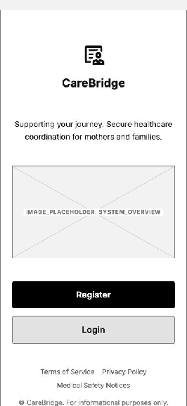

**Figure 42: Mobile Welcome Screen**

| Field name | Description |
| :---- | :---- |
| CareBridge Logo / Wordmark | Displays the CareBridge identity at the top of the welcome screen. |
| Introductory Message | Briefly explains the purpose of the application for the current user type. |
| Register Button | Opens the account-registration screen. |
| Login Button | Opens the login screen for an existing account. |
| Terms and Privacy Links | Opens the terms of use, privacy policy, and medical-safety notice. |

**Table 332: Mobile Welcome Screen Field Description**

##### **4.2.1.2 Login Screen** {#4.2.1.2-login-screen}

**Applies To:** Mother Mobile App, Family Member Mobile App, and Verified Expert Mobile App where the flow is available.

**Platform:** Shared Mobile Apps

**Feature:** Authentication & setup

**Purpose:** Authenticates mobile users and routes each role to the correct home screen.

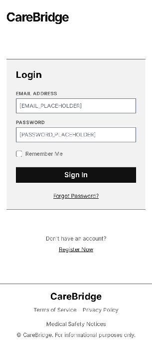

**Figure 43: Login Screen**

| Field name | Description |
| :---- | :---- |
| CareBridge Logo / Wordmark | Displays the application identity. |
| Email / Phone Field | Required account identifier input. |
| Password Field | Required masked password input with show/hide control. |
| Remember Me Checkbox | Keeps the user signed in according to the session policy. |
| Forgot Password Link | Opens the password-recovery screen. |
| Login Button | Authenticates the entered credentials and opens the role-appropriate home or dashboard. |
| Register Link | Opens registration when registration is supported on the current platform. |

**Table 333: Login Screen Field Description**

##### **4.2.1.3 Register Screen** {#4.2.1.3-register-screen}

**Applies To:** Mother Mobile App, Family Member Mobile App, and Verified Expert Mobile App where the flow is available.

**Platform:** Shared Mobile Apps

**Feature:** Authentication & setup

**Purpose:** Collects shared account credentials and role-specific registration details when required.

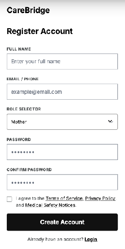

**Figure 44: Register Screen**

| Field name | Description |
| :---- | :---- |
| Full Name Field | Required text input for the account holder’s display name. |
| Email / Phone Field | Required unique contact identifier used for OTP verification and account recovery. |
| Initial Role Selector | Selects the intended account role supported by the current application or portal. |
| Password Field | Required masked input that follows the configured password policy. |
| Confirm Password Field | Must match the password before registration can continue. |
| Terms and Privacy Checkbox | Records acceptance of required terms, privacy policy, and safety notices. |
| Create Account Button | Validates the form and requests an OTP for account verification. |
| Login Link | Returns an existing user to the login screen. |

**Table 334: Register Screen Field Description**

##### **4.2.1.4 Forgot Password Screen** {#4.2.1.4-forgot-password-screen}

**Applies To:** Mother Mobile App, Family Member Mobile App, and Verified Expert Mobile App where the flow is available.

**Platform:** Shared Mobile Apps

**Feature:** Authentication & setup

**Purpose:** Starts password recovery for mobile users by collecting the registered email or phone number.

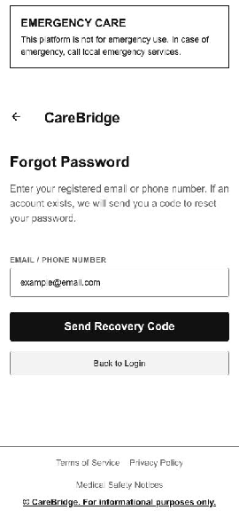

**Figure 45: Forgot Password Screen**

| Field name | Description |
| :---- | :---- |
| Email / Phone Field | Accepts the registered contact used to identify the account. |
| Recovery Instruction | Explains that a code or reset link will be sent if the account is eligible. |
| Send Recovery Code Button | Starts password recovery and applies rate limits. |
| Back to Login Link | Returns to the login screen. |

**Table 335: Forgot Password Screen Field Description**

##### **4.2.1.5 Reset Password Screen** {#4.2.1.5-reset-password-screen}

**Applies To:** Mother Mobile App, Family Member Mobile App, and Verified Expert Mobile App where the flow is available.

**Platform:** Shared Mobile Apps

**Feature:** Authentication & setup

**Purpose:** Allows mobile users to set a new password after a valid recovery code or link is confirmed.

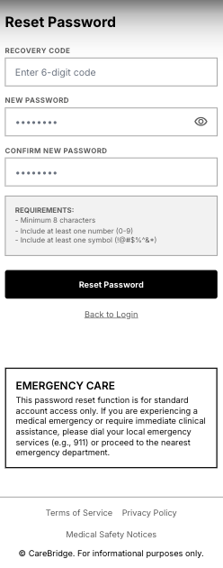

**Figure 46: Reset Password Screen**

| Field name | Description |
| :---- | :---- |
| Recovery Code / Token Field | Accepts or displays the validated recovery credential. |
| New Password Field | Required masked input following the password policy. |
| Confirm New Password Field | Must match the new password. |
| Password Requirements | Shows minimum length and required character rules. |
| Reset Password Button | Saves the new password and invalidates the recovery credential. |
| Back to Login Link | Returns to login after reset or cancellation. |

**Table 336: Reset Password Screen Field Description**

##### **4.2.1.6 Email Verification Screen** {#4.2.1.6-email-verification-screen}

**Applies To:** Mother Mobile App, Family Member Mobile App, and Verified Expert Mobile App where the flow is available.

**Platform:** Shared Mobile Apps

**Feature:** Authentication & setup

**Purpose:** Validates a one-time password for account activation, recovery, or sensitive account actions.

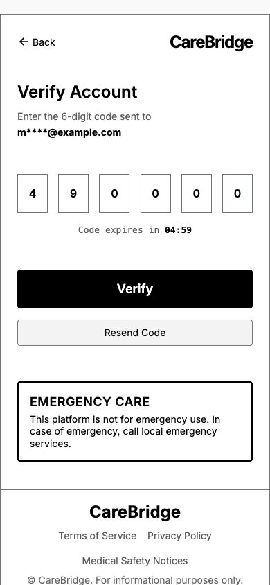

**Figure 47: Email Verification Screen**

| Field name | Description |
| :---- | :---- |
| Masked Contact | Shows the email address or phone number that received the OTP. |
| OTP Input | Accepts the one-time verification code in separated numeric cells. |
| Expiry Indicator | Shows the remaining validity period of the current OTP. |
| Resend OTP Link | Requests a new code subject to resend limits. |
| Verify Button | Validates the code and continues account activation or the protected action. |
| Back Button | Returns to the previous registration or recovery screen. |

**Table 337: Email Verification Screen Field Description**

#### ***4.2.2 Mother Mobile App*** {#4.2.2-mother-mobile-app}

##### **4.2.2.1 Mother Journey Setup Screen** {#4.2.2.1-mother-journey-setup-screen}

**Platform:** Mother Mobile App

**Feature:** Authentication & setup

**Purpose:** Collects the mother’s current stage and key dates to initialize a personalized care journey.

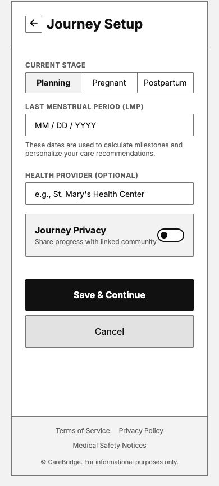

**Figure 48: Mother Journey Setup Screen**

| Field name | Description |
| :---- | :---- |
| Screen Header | Shows the form title, context, and back or cancel control. |
| Primary Information Fields | Collects the core information required by the function. |
| Selectors / Toggles | Provides role-appropriate choices, categories, permissions, channels, or status options. |
| Supporting Details | Collects optional notes, dates, tags, evidence, files, or configuration values. |
| Validation and Help Text | Explains required format, limits, privacy, safety, or eligibility rules. |
| Save / Submit Button | Validates and submits the form. |
| Cancel Button | Returns without saving changes. |

##### **4.2.2.2 Mother Home Screen** {#4.2.2.2-mother-home-screen}

**Platform:** Mother Mobile App

**Feature:** Core experience

**Purpose:** Shows the mother’s personalized overview, priorities, reminders, alerts, and shortcuts.

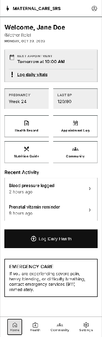

**Figure 49: Mother Home Screen**

| Field name | Description |
| :---- | :---- |
| Header and Identity | Shows the user, role, date, and page title. |
| Priority Summary | Displays the most important current status, alerts, or due actions. |
| Key Metric Cards | Shows role-relevant counts, trends, or status indicators. |
| Primary Modules | Provides shortcuts to the main functions available to the role. |
| Recent Activity | Shows recent records, requests, tasks, cases, or notifications. |
| Action Panel | Provides the main role-specific actions available from the dashboard. |
| Navigation | Provides bottom navigation on mobile or sidebar/top navigation on web. |

##### **4.2.2.3 Mother Journey Screen** {#4.2.2.3-mother-journey-screen}

**Platform:** Mother Mobile App

**Feature:** Core experience

**Purpose:** Displays and manages pre-pregnancy, pregnancy, and postpartum journey information.

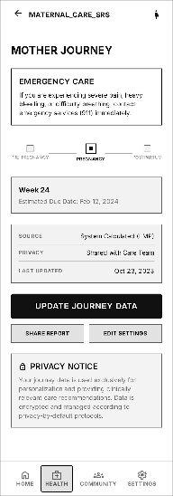

**Figure 50: Mother Journey Screen**

| Field name | Description |
| :---- | :---- |
| Screen Header | Shows the screen name, current context, and navigation controls. |
| Main Content Area | Displays and manages pre-pregnancy, pregnancy, and postpartum journey information. |
| Status / Metadata | Displays relevant status, date, owner, source, permission, or verification information. |
| Primary Action | Performs the main function supported by this screen. |
| Secondary Actions | Provides other permitted actions such as edit, filter, share, report, or return. |
| Privacy / Safety Notice | Displays role-appropriate consent, privacy, moderation, or medical-safety information when required. |

##### **4.2.2.4 Pregnancy Exercise Detail Screen** {#4.2.2.4-pregnancy-exercise-detail-screen}

**Platform:** Mother Mobile App

**Feature:** Pregnancy Exercise & Posture Support

**Purpose:** Displays instructions, trimester suitability, duration, difficulty, precautions, stop criteria and the entry to the safety check.

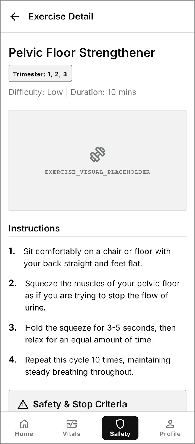

**Figure 51: Pregnancy Exercise Detail Screen**

| Field name | Description |
| :---- | :---- |
| Back button | Executes the back button after required validation and confirmation. |
| Exercise title | Displays or captures the exercise title required for this screen. The control is visible only when permitted by role, ownership, consent and current record state. |
| Trimester badge | Displays or captures the trimester badge required for this screen. The control is visible only when permitted by role, ownership, consent and current record state. |
| Difficulty and duration | Displays or captures the difficulty and duration required for this screen. The control is visible only when permitted by role, ownership, consent and current record state. |
| Instruction steps | Displays or captures the instruction steps required for this screen. The control is visible only when permitted by role, ownership, consent and current record state. |
| Safety notes | Displays or captures the safety notes required for this screen. The control is visible only when permitted by role, ownership, consent and current record state. |
| Start safety check button | Executes the start safety check button after required validation and confirmation. |

##### **4.2.2.5 Pre-exercise Safety Check Screen** {#4.2.2.5-pre-exercise-safety-check-screen}

**Platform:** Mother Mobile App

**Feature:** Pregnancy Exercise & Posture Support

**Purpose:** Collects required safety answers and blocks session start when a warning or red-flag condition is reported.

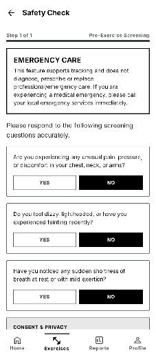

**Figure 52: Pre-exercise Safety Check Screen**

| Field name | Description |
| :---- | :---- |
| Progress indicator | Displays or captures the progress indicator required for this screen. The control is visible only when permitted by role, ownership, consent and current record state. |
| Safety questions | Displays or captures the safety questions required for this screen. The control is visible only when permitted by role, ownership, consent and current record state. |
| Yes/No controls | Displays or captures the yes/no controls required for this screen. The control is visible only when permitted by role, ownership, consent and current record state. |
| Safety notice | Displays the required safety notice before the user continues. |
| Continue button | Executes the continue button after required validation and confirmation. |
| Stop and seek support panel | Displays or captures the stop and seek support panel required for this screen. The control is visible only when permitted by role, ownership, consent and current record state. |

**Table 338: Pre-exercise Safety Check Screen Field Description**

##### **4.2.2.6 Active Exercise Session Screen** {#4.2.2.6-active-exercise-session-screen}

**Platform:** Mother Mobile App

**Feature:** Pregnancy Exercise & Posture Support

**Purpose:** Runs the selected exercise session, tracks elapsed time and exposes pause, resume, camera and finish actions.

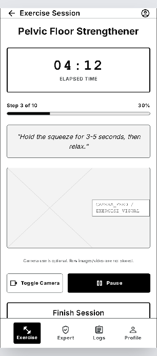

**Figure 53: Active Exercise Session Screen**

| Field name | Description |
| :---- | :---- |
| Exercise title | Displays or captures the exercise title required for this screen. The control is visible only when permitted by role, ownership, consent and current record state. |
| Elapsed timer | Displays or captures the elapsed timer required for this screen. The control is visible only when permitted by role, ownership, consent and current record state. |
| Instruction step | Displays or captures the instruction step required for this screen. The control is visible only when permitted by role, ownership, consent and current record state. |
| Camera toggle | Displays or captures the camera toggle required for this screen. The control is visible only when permitted by role, ownership, consent and current record state. |
| Pause/Resume button | Executes the pause/resume button after required validation and confirmation. |
| Finish button | Executes the finish button after required validation and confirmation. |
| Safety stop link | Executes the safety stop link after required validation and confirmation. |

**Table 339: Active Exercise Session Screen Field Description**

##### **4.2.2.7 Posture Camera & Feedback Screen** {#4.2.2.7-posture-camera-&-feedback-screen}

**Platform:** Mother Mobile App

**Feature:** Pregnancy Exercise & Posture Support

**Purpose:** Shows the optional camera preview and near-real-time posture feedback without storing raw images or video.

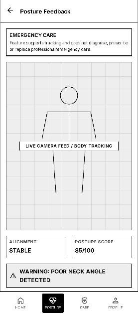

**Figure 54: Posture Camera & Feedback Screen**

| Field name | Description |
| :---- | :---- |
| Camera preview placeholder | Displays or captures the camera preview placeholder required for this screen. The control is visible only when permitted by role, ownership, consent and current record state. |
| Body alignment guide | Displays or captures the body alignment guide required for this screen. The control is visible only when permitted by role, ownership, consent and current record state. |
| Posture score | Displays or captures the posture score required for this screen. The control is visible only when permitted by role, ownership, consent and current record state. |
| Feedback message | Displays or captures the feedback message required for this screen. The control is visible only when permitted by role, ownership, consent and current record state. |
| Warning panel | Displays the required warning panel before the user continues. |
| Disable camera button | Executes the disable camera button after required validation and confirmation. |

**Table 340: Posture Camera & Feedback Screen Field Description**

##### **4.2.2.8 Exercise Session Result Screen** {#4.2.2.8-exercise-session-result-screen}

**Platform:** Mother Mobile App

**Feature:** Pregnancy Exercise & Posture Support

**Purpose:** Summarizes session duration, completion state, posture score and warnings after the exercise ends.

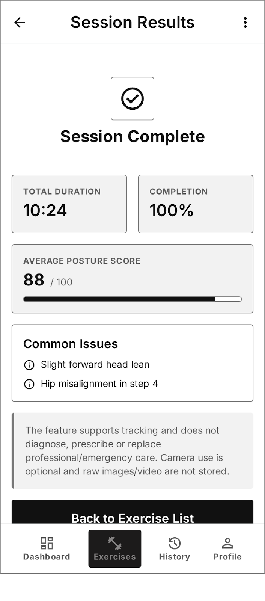

**Figure 55: Exercise Session Result Screen**

| Field name | Description |
| :---- | :---- |
| Completion status | Displays or captures the completion status required for this screen. The control is visible only when permitted by role, ownership, consent and current record state. |
| Duration | Displays or captures the duration required for this screen. The control is visible only when permitted by role, ownership, consent and current record state. |
| Posture score | Displays or captures the posture score required for this screen. The control is visible only when permitted by role, ownership, consent and current record state. |
| Common issues | Displays or captures the common issues required for this screen. The control is visible only when permitted by role, ownership, consent and current record state. |
| Safety note | Displays or captures the safety note required for this screen. The control is visible only when permitted by role, ownership, consent and current record state. |
| Back to exercise list button | Executes the back to exercise list button after required validation and confirmation. |

**Table 341: Exercise Session Result Screen Field Description**

##### **4.2.2.9 Pregnancy Exercise History Screen** {#4.2.2.9-pregnancy-exercise-history-screen}

**Platform:** Mother Mobile App

**Feature:** Pregnancy Exercise & Posture Support

**Purpose:** Lists saved exercise sessions and opens a selected session result.

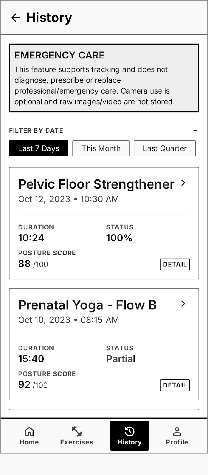

**Figure 56: Pregnancy Exercise History Screen**

| Field name | Description |
| :---- | :---- |
| Date filter | Displays or captures the date filter required for this screen. The control is visible only when permitted by role, ownership, consent and current record state. |
| Session cards | Displays or captures the session cards required for this screen. The control is visible only when permitted by role, ownership, consent and current record state. |
| Exercise name | Displays or captures the exercise name required for this screen. The control is visible only when permitted by role, ownership, consent and current record state. |
| Duration | Displays or captures the duration required for this screen. The control is visible only when permitted by role, ownership, consent and current record state. |
| Completion status | Displays or captures the completion status required for this screen. The control is visible only when permitted by role, ownership, consent and current record state. |
| Posture score | Displays or captures the posture score required for this screen. The control is visible only when permitted by role, ownership, consent and current record state. |
| Open detail action | Executes the open detail action after required validation and confirmation. |

**Table 342: Pregnancy Exercise History Screen Field Description**

##### **4.2.2.10 Maternal Metric Detail Screen** {#4.2.2.10-maternal-metric-detail-screen}

**Platform:** Mother Mobile App

**Feature:** Mother Care Journey

**Purpose:** Displays one maternal health metric with value, timestamp, source and notes, and provides edit or delete actions for user-entered data.

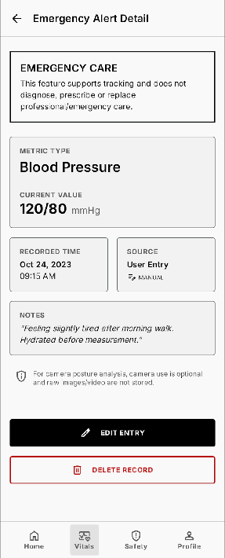

**Figure 57: Maternal Metric Detail Screen**

| Field name | Description |
| :---- | :---- |
| Metric type | Displays or captures the metric type required for this screen. The control is visible only when permitted by role, ownership, consent and current record state. |
| Value and unit | Displays or captures the value and unit required for this screen. The control is visible only when permitted by role, ownership, consent and current record state. |
| Recorded time | Displays or captures the recorded time required for this screen. The control is visible only when permitted by role, ownership, consent and current record state. |
| Source label | Displays or captures the source label required for this screen. The control is visible only when permitted by role, ownership, consent and current record state. |
| Notes | Displays or captures the notes required for this screen. The control is visible only when permitted by role, ownership, consent and current record state. |
| Edit button | Executes the edit button after required validation and confirmation. |
| Delete button | Executes the delete button after required validation and confirmation. |

**Table 343: Maternal Metric Detail Screen Field Description**

##### **4.2.2.11 Delete Maternal Metric Confirmation Screen** {#4.2.2.11-delete-maternal-metric-confirmation-screen}

**Platform:** Mother Mobile App

**Feature:** Mother Care Journey

**Purpose:** Confirms soft deletion of a maternal metric entered by the mother.

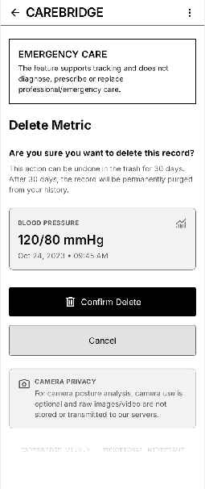

**Figure 58: Delete Maternal Metric Confirmation Screen**

| Field name | Description |
| :---- | :---- |
| Metric summary | Displays or captures the metric summary required for this screen. The control is visible only when permitted by role, ownership, consent and current record state. |
| Deletion warning | Displays the required deletion warning before the user continues. |
| Cancel button | Executes the cancel button after required validation and confirmation. |
| Delete button | Executes the delete button after required validation and confirmation. |

**Table 344: Delete Maternal Metric Confirmation Screen Field Description**

##### **4.2.2.12 Postpartum Log List Screen** {#4.2.2.12-postpartum-log-list-screen}

**Platform:** Mother Mobile App

**Feature:** Mother Care Journey

**Purpose:** Lists postpartum recovery logs by date and category and opens a selected log.

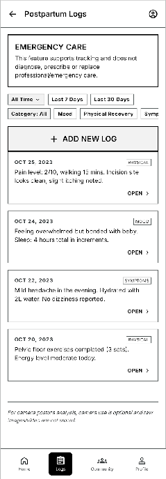

**Figure 59: Postpartum Log List Screen**

| Field name | Description |
| :---- | :---- |
| Date filter | Displays or captures the date filter required for this screen. The control is visible only when permitted by role, ownership, consent and current record state. |
| Category filter | Displays or captures the category filter required for this screen. The control is visible only when permitted by role, ownership, consent and current record state. |
| Log cards | Displays or captures the log cards required for this screen. The control is visible only when permitted by role, ownership, consent and current record state. |
| Add log button | Executes the add log button after required validation and confirmation. |
| Open detail action | Executes the open detail action after required validation and confirmation. |

**Table 345: Postpartum Log List Screen Field Description**

##### **4.2.2.13 Postpartum Log Detail Screen** {#4.2.2.13-postpartum-log-detail-screen}

**Platform:** Mother Mobile App

**Feature:** Mother Care Journey

**Purpose:** Displays one postpartum log and provides edit or delete actions for the mother-owned record.

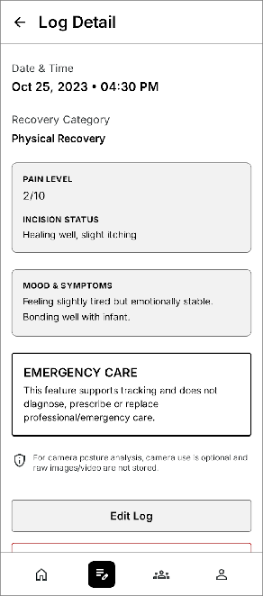

**Figure 60: Postpartum Log Detail Screen**

| Field name | Description |
| :---- | :---- |
| Date and time | Displays or captures the date and time required for this screen. The control is visible only when permitted by role, ownership, consent and current record state. |
| Recovery fields | Displays or captures the recovery fields required for this screen. The control is visible only when permitted by role, ownership, consent and current record state. |
| Mood or symptom notes | Displays or captures the mood or symptom notes required for this screen. The control is visible only when permitted by role, ownership, consent and current record state. |
| Edit button | Executes the edit button after required validation and confirmation. |
| Delete button | Executes the delete button after required validation and confirmation. |

**Table 346: Postpartum Log Detail Screen Field Description**

##### **4.2.2.14 Edit Postpartum Log Screen** {#4.2.2.14-edit-postpartum-log-screen}

**Platform:** Mother Mobile App

**Feature:** Mother Care Journey

**Purpose:** Updates a postpartum recovery log created by the mother.

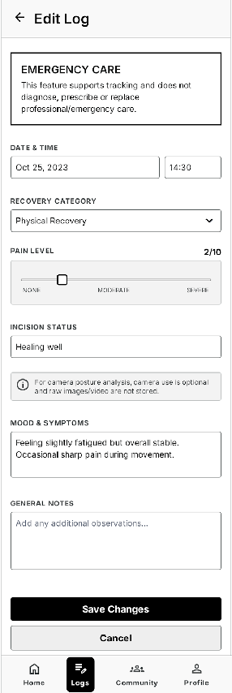

**Figure 61: Edit Postpartum Log Screen**

| Field name | Description |
| :---- | :---- |
| Date/time | Displays or captures the date/time required for this screen. The control is visible only when permitted by role, ownership, consent and current record state. |
| Recovery input fields | Displays or captures the recovery input fields required for this screen. The control is visible only when permitted by role, ownership, consent and current record state. |
| Notes | Displays or captures the notes required for this screen. The control is visible only when permitted by role, ownership, consent and current record state. |
| Save button | Executes the save button after required validation and confirmation. |
| Cancel button | Executes the cancel button after required validation and confirmation. |

**Table 347: Edit Postpartum Log Screen Field Description**

##### **4.2.2.15 Delete Postpartum Log Confirmation Screen** {#4.2.2.15-delete-postpartum-log-confirmation-screen}

**Platform:** Mother Mobile App

**Feature:** Mother Care Journey

**Purpose:** Confirms soft deletion of a postpartum log.

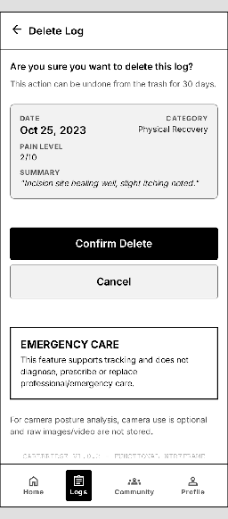

**Figure 62: Delete Postpartum Log Confirmation Screen**

| Field name | Description |
| :---- | :---- |
| Log summary | Displays or captures the log summary required for this screen. The control is visible only when permitted by role, ownership, consent and current record state. |
| Deletion warning | Displays the required deletion warning before the user continues. |
| Cancel button | Executes the cancel button after required validation and confirmation. |
| Delete button | Executes the delete button after required validation and confirmation. |

**Table 348: Delete Postpartum Log Confirmation Screen Field Description**

##### **4.2.2.16 Baby Profiles Screen** {#4.2.2.16-baby-profiles-screen}

**Platform:** Mother Mobile App

**Feature:** Core experience

**Purpose:** Lists the baby profiles managed by the mother and provides access to create or open a profile.

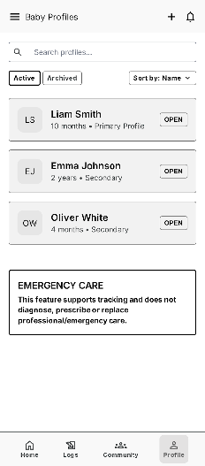

**Figure 63: Baby Profiles Screen**

| Field name | Description |
| :---- | :---- |
| Screen Header | Shows the screen title, context, and primary action when permitted. |
| Search Field | Filters items by supported keywords. |
| Filter Controls | Filters by status, type, date, category, specialty, priority, or ownership as applicable. |
| Sort Control | Orders items by relevance, date, urgency, expiry, or status. |
| Result List / Cards | Displays each item with the key summary, status, and available actions. |
| Item Action | Opens the selected detail screen or performs an authorized quick action. |
| Pagination / Load More | Loads additional results when the list is longer than one page. |
| Empty State | Explains when no item matches the current filters. |

**Table 349: Baby Profiles Screen Field Description**

##### **4.2.2.17 Baby Profile  Screen** {#4.2.2.17-baby-profile-screen}

**Platform:** Mother Mobile App

**Feature:** Core experience

**Purpose:** Shows one baby’s overview, daily logs, growth, milestones, vaccination, and health records.

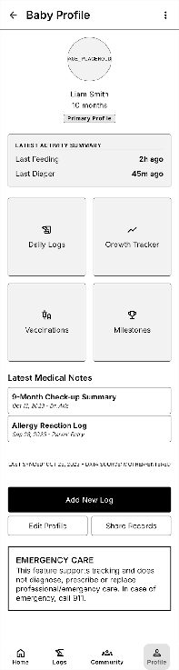

**Figure 64: Baby Profile Screen**

| Field name | Description |
| :---- | :---- |
| Screen Header | Shows the screen name, current context, and navigation controls. |
| Main Content Area | Shows one baby’s overview, daily logs, growth, milestones, vaccination, and health records. |
| Status / Metadata | Displays relevant status, date, owner, source, permission, or verification information. |
| Primary Action | Performs the main function supported by this screen. |
| Secondary Actions | Provides other permitted actions such as edit, filter, share, report, or return. |
| Privacy / Safety Notice | Displays role-appropriate consent, privacy, moderation, or medical-safety information when required. |

**Table 350: Baby Profile Screen Field Description**

##### **4.2.2.18 Baby Profile Detail Screen** {#4.2.2.18-baby-profile-detail-screen}

**Platform:** Mother Mobile App

**Feature:** Baby Care Journey & Growth

**Purpose:** Displays baby identity, birth information, active status and shortcuts to logs, vaccination, growth and milestones.

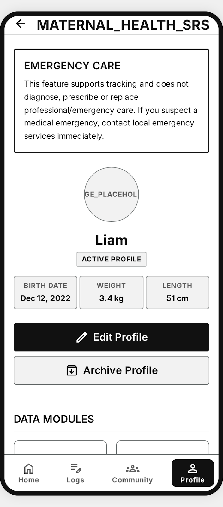

**Figure 65: Baby Profile Detail Screen**

| Field name | Description |
| :---- | :---- |
| Baby avatar placeholder | Displays or captures the baby avatar placeholder required for this screen. The control is visible only when permitted by role, ownership, consent and current record state. |
| Nickname | Displays or captures the nickname required for this screen. The control is visible only when permitted by role, ownership, consent and current record state. |
| Birth information | Displays or captures the birth information required for this screen. The control is visible only when permitted by role, ownership, consent and current record state. |
| Active profile badge | Displays or captures the active profile badge required for this screen. The control is visible only when permitted by role, ownership, consent and current record state. |
| Edit button | Executes the edit button after required validation and confirmation. |
| Archive button | Executes the archive button after required validation and confirmation. |
| Module shortcuts | Displays or captures the module shortcuts required for this screen. The control is visible only when permitted by role, ownership, consent and current record state. |

**Table 351: Baby Profile Detail Screen Field Description**

##### **4.2.2.19 Switch Active Baby Screen** {#4.2.2.19-switch-active-baby-screen}

**Platform:** Mother Mobile App

**Feature:** Baby Care Journey & Growth

**Purpose:** Lets the mother select which baby profile is currently active when multiple profiles exist.

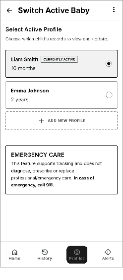

**Figure 66: Switch Active Baby Screen**

| Field name | Description |
| :---- | :---- |
| Baby profile list | Displays or captures the baby profile list required for this screen. The control is visible only when permitted by role, ownership, consent and current record state. |
| Current active badge | Displays or captures the current active badge required for this screen. The control is visible only when permitted by role, ownership, consent and current record state. |
| Select action | Executes the select action after required validation and confirmation. |
| Confirm button | Executes the confirm button after required validation and confirmation. |

**Table 352: Switch Active Baby Screen Field Description**

##### **4.2.2.20 Baby Daily Log Detail Screen** {#4.2.2.20-baby-daily-log-detail-screen}

**Platform:** Mother Mobile App

**Feature:** Baby Care Journey & Growth

**Purpose:** Displays one feeding, sleep, diaper, symptom or medication log and provides edit/delete actions.

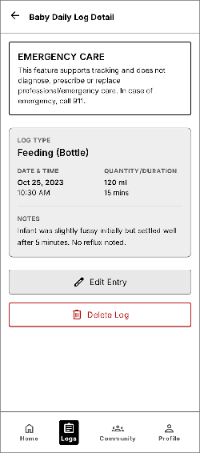

**Figure 67: Baby Daily Log Detail Screen**

| Field name | Description |
| :---- | :---- |
| Log type | Displays or captures the log type required for this screen. The control is visible only when permitted by role, ownership, consent and current record state. |
| Date/time | Displays or captures the date/time required for this screen. The control is visible only when permitted by role, ownership, consent and current record state. |
| Quantity or duration | Displays or captures the quantity or duration required for this screen. The control is visible only when permitted by role, ownership, consent and current record state. |
| Notes | Displays or captures the notes required for this screen. The control is visible only when permitted by role, ownership, consent and current record state. |
| Edit button | Executes the edit button after required validation and confirmation. |
| Delete button | Executes the delete button after required validation and confirmation. |

**Table 353: Baby Daily Log Detail Screen Field Description**

##### **4.2.2.21 Delete Baby Log Confirmation Screen** {#4.2.2.21-delete-baby-log-confirmation-screen}

**Platform:** Mother Mobile App

**Feature:** Baby Care Journey & Growth

**Purpose:** Confirms soft deletion of a baby daily log entered by the mother.

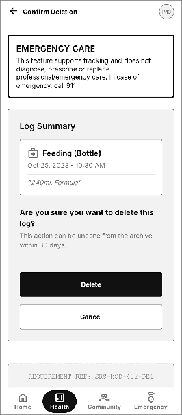

**Figure 68: Delete Baby Log Confirmation Screen**

| Field name | Description |
| :---- | :---- |
| Log summary | Displays or captures the log summary required for this screen. The control is visible only when permitted by role, ownership, consent and current record state. |
| Deletion warning | Displays the required deletion warning before the user continues. |
| Cancel button | Executes the cancel button after required validation and confirmation. |
| Delete button | Executes the delete button after required validation and confirmation. |

**Table 354: Delete Baby Log Confirmation Screen Field Description**

##### **4.2.2.22 Edit Development Milestone Screen** {#4.2.2.22-edit-development-milestone-screen}

**Platform:** Mother Mobile App

**Feature:** Baby Care Journey & Growth

**Purpose:** Updates the date, status and notes of a recorded development milestone.

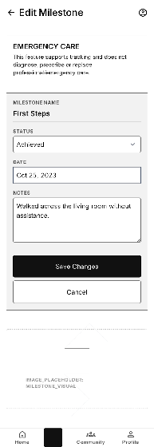

**Figure 69: Edit Development Milestone Screen**

| Field name | Description |
| :---- | :---- |
| Milestone name | Displays or captures the milestone name required for this screen. The control is visible only when permitted by role, ownership, consent and current record state. |
| Status | Displays or captures the status required for this screen. The control is visible only when permitted by role, ownership, consent and current record state. |
| Date | Displays or captures the date required for this screen. The control is visible only when permitted by role, ownership, consent and current record state. |
| Notes | Displays or captures the notes required for this screen. The control is visible only when permitted by role, ownership, consent and current record state. |
| Save button | Executes the save button after required validation and confirmation. |

**Table 355: Edit Development Milestone Screen Field Description**

##### **4.2.2.23 Delete Development Milestone Confirmation Screen** {#4.2.2.23-delete-development-milestone-confirmation-screen}

**Platform:** Mother Mobile App

**Feature:** Baby Care Journey & Growth

**Purpose:** Confirms soft deletion of a development milestone.

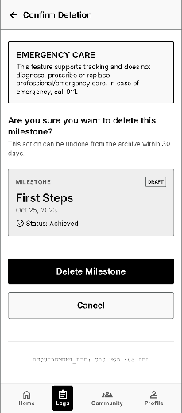

**Figure 70: Delete Development Milestone Confirmation Screen**

| Field name | Description |
| :---- | :---- |
| Milestone summary | Displays or captures the milestone summary required for this screen. The control is visible only when permitted by role, ownership, consent and current record state. |
| Deletion warning | Displays the required deletion warning before the user continues. |
| Cancel button | Executes the cancel button after required validation and confirmation. |
| Delete button | Executes the delete button after required validation and confirmation. |

**Table 356: Delete Development Milestone Confirmation Screen Field Description**

##### **4.2.2.24 Vaccination Schedule Screen** {#4.2.2.24-vaccination-schedule-screen}

**Platform:** Mother Mobile App

**Feature:** Vaccination & Growth Tracking

**Purpose:** Displays planned and completed vaccinations for the active baby with due dates and statuses.

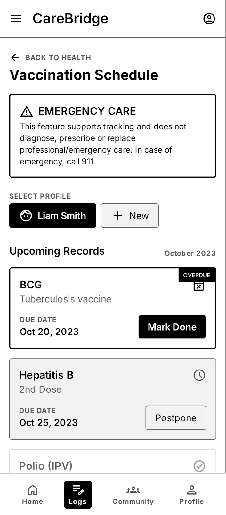

**Figure 71: Vaccination Schedule Screen**

| Field name | Description |
| :---- | :---- |
| Baby selector | Displays or captures the baby selector required for this screen. The control is visible only when permitted by role, ownership, consent and current record state. |
| Schedule timeline | Displays or captures the schedule timeline required for this screen. The control is visible only when permitted by role, ownership, consent and current record state. |
| Vaccine name | Displays or captures the vaccine name required for this screen. The control is visible only when permitted by role, ownership, consent and current record state. |
| Due date | Displays or captures the due date required for this screen. The control is visible only when permitted by role, ownership, consent and current record state. |
| Status | Displays or captures the status required for this screen. The control is visible only when permitted by role, ownership, consent and current record state. |
| Add record action | Executes the add record action after required validation and confirmation. |
| Postpone action | Executes the postpone action after required validation and confirmation. |

**Table 357: Vaccination Schedule Screen Field Description**

##### **4.2.2.25 Vaccination Record Form Screen** {#4.2.2.25-vaccination-record-form-screen}

**Platform:** Mother Mobile App

**Feature:** Vaccination & Growth Tracking

**Purpose:** Creates or updates a vaccination record with date, facility, notes and optional proof file.

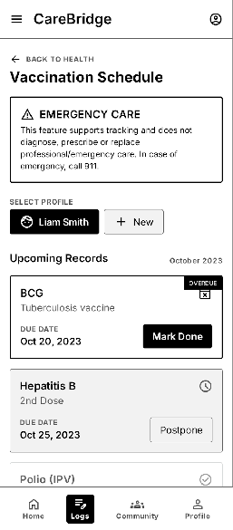

**Figure 72: Vaccination Record Form Screen**

| Field name | Description |
| :---- | :---- |
| Vaccine selector | Displays or captures the vaccine selector required for this screen. The control is visible only when permitted by role, ownership, consent and current record state. |
| Date | Displays or captures the date required for this screen. The control is visible only when permitted by role, ownership, consent and current record state. |
| Facility | Displays or captures the facility required for this screen. The control is visible only when permitted by role, ownership, consent and current record state. |
| Dose/status | Displays or captures the dose/status required for this screen. The control is visible only when permitted by role, ownership, consent and current record state. |
| Notes | Displays or captures the notes required for this screen. The control is visible only when permitted by role, ownership, consent and current record state. |
| File attachment | Displays or captures the file attachment required for this screen. The control is visible only when permitted by role, ownership, consent and current record state. |
| Save button | Executes the save button after required validation and confirmation. |

**Table 358: Vaccination Record Form Screen Field Description**

##### **4.2.2.26 Delete Vaccination Record Confirmation Screen** {#4.2.2.26-delete-vaccination-record-confirmation-screen}

**Platform:** Mother Mobile App

**Feature:** Vaccination & Growth Tracking

**Purpose:** Confirms soft deletion of a mother-entered vaccination record.

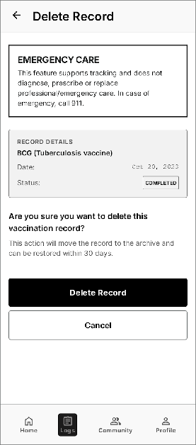

**Figure 73: Delete Vaccination Record Confirmation Screen**

| Field name | Description |
| :---- | :---- |
| Record summary | Displays or captures the record summary required for this screen. The control is visible only when permitted by role, ownership, consent and current record state. |
| Deletion warning | Displays the required deletion warning before the user continues. |
| Cancel button | Executes the cancel button after required validation and confirmation. |
| Delete button | Executes the delete button after required validation and confirmation. |

**Table 359: Delete Vaccination Record Confirmation Screen Field Description**

##### **4.2.2.27 Postpone Vaccination Screen** {#4.2.2.27-postpone-vaccination-screen}

**Platform:** Mother Mobile App

**Feature:** Vaccination & Growth Tracking

**Purpose:** Records a new planned date and user-entered reason for postponing a vaccination.

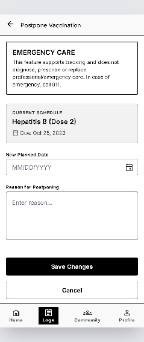

**Figure 74: Postpone Vaccination Screen**

| Field name | Description |
| :---- | :---- |
| Vaccine summary | Displays or captures the vaccine summary required for this screen. The control is visible only when permitted by role, ownership, consent and current record state. |
| Current due date | Displays or captures the current due date required for this screen. The control is visible only when permitted by role, ownership, consent and current record state. |
| New date | Displays or captures the new date required for this screen. The control is visible only when permitted by role, ownership, consent and current record state. |
| Reason | Displays or captures the reason required for this screen. The control is visible only when permitted by role, ownership, consent and current record state. |
| Save button | Executes the save button after required validation and confirmation. |

**Table 360: Postpone Vaccination Screen Field Description**

##### **4.2.2.28 Growth Measurement Form Screen** {#4.2.2.28-growth-measurement-form-screen}

**Platform:** Mother Mobile App

**Feature:** Vaccination & Growth Tracking

**Purpose:** Creates or updates a baby growth measurement.

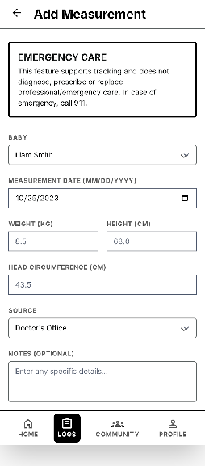

**Figure 75: Growth Measurement Form Screen**

| Field name | Description |
| :---- | :---- |
| Baby selector | Displays or captures the baby selector required for this screen. The control is visible only when permitted by role, ownership, consent and current record state. |
| Measurement date | Displays or captures the measurement date required for this screen. The control is visible only when permitted by role, ownership, consent and current record state. |
| Weight | Displays or captures the weight required for this screen. The control is visible only when permitted by role, ownership, consent and current record state. |
| Height | Displays or captures the height required for this screen. The control is visible only when permitted by role, ownership, consent and current record state. |
| Head circumference | Displays or captures the head circumference required for this screen. The control is visible only when permitted by role, ownership, consent and current record state. |
| Source label | Displays or captures the source label required for this screen. The control is visible only when permitted by role, ownership, consent and current record state. |
| Save button | Executes the save button after required validation and confirmation. |

**Table 361: Growth Measurement Form Screen Field Description**

##### **4.2.2.29 Delete Growth Measurement Confirmation Screen** {#4.2.2.29-delete-growth-measurement-confirmation-screen}

**Platform:** Mother Mobile App

**Feature:** Vaccination & Growth Tracking

**Purpose:** Confirms soft deletion of an incorrect growth measurement.

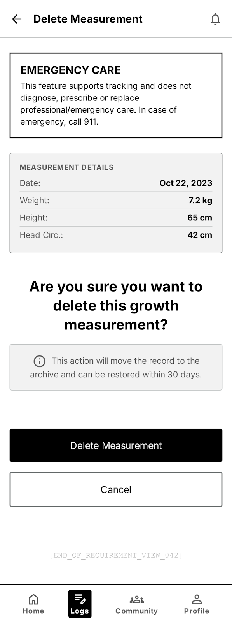

**Figure 76: Delete Growth Measurement Confirmation Screen**

| Field name | Description |
| :---- | :---- |
| Measurement summary | Displays or captures the measurement summary required for this screen. The control is visible only when permitted by role, ownership, consent and current record state. |
| Deletion warning | Displays the required deletion warning before the user continues. |
| Cancel button | Executes the cancel button after required validation and confirmation. |
| Delete button | Executes the delete button after required validation and confirmation. |

**Table 362: Delete Growth Measurement Confirmation Screen Field Description**

##### **4.2.2.30 Growth Measurement History Screen** {#4.2.2.30-growth-measurement-history-screen}

**Platform:** Mother Mobile App

**Feature:** Vaccination & Growth Tracking

**Purpose:** Lists historical measurements used by the baby growth chart.

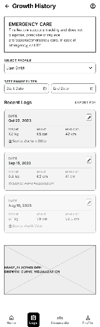

**Figure 77: Growth Measurement History Screen**

| Field name | Description |
| :---- | :---- |
| Baby selector | Displays or captures the baby selector required for this screen. The control is visible only when permitted by role, ownership, consent and current record state. |
| Date range | Displays or captures the date range required for this screen. The control is visible only when permitted by role, ownership, consent and current record state. |
| Measurement list | Displays or captures the measurement list required for this screen. The control is visible only when permitted by role, ownership, consent and current record state. |
| Weight/height/head circumference | Displays or captures the weight/height/head circumference required for this screen. The control is visible only when permitted by role, ownership, consent and current record state. |
| Open/edit action | Executes the open/edit action after required validation and confirmation. |

**Table 363: Growth Measurement History Screen Field Description**

##### **4.2.2.31 Health Record Timeline Screen** {#4.2.2.31-health-record-timeline-screen}

**Platform:** Mother Mobile App

**Feature:** Core experience

**Purpose:** Displays maternal and baby health records chronologically with source and category filters.

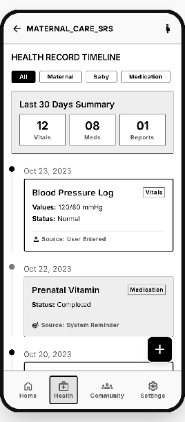

**Figure 78: Health Record Timeline Screen**

| Field name | Description |
| :---- | :---- |
| Screen Header | Shows the item title, identifier, status, and back navigation. |
| Summary Section | Displays the key information needed to understand the selected item. |
| Metadata Section | Shows dates, owner, source, status, category, consent, or verification information as applicable. |
| Detailed Content | Displays the full authorized record, post, file, consultation, alert, or investigation data. |
| Related Items | Shows linked records, files, history, comments, or audit evidence when applicable. |
| Primary Actions | Provides the authorized actions for the current role and item state. |
| Status / Safety Notice | Displays privacy, consent, medical-safety, expiry, or moderation constraints when applicable. |

**Table 364: Health Record Timeline Screen Field Description**

##### **4.2.2.32 Health Record Detail Screen** {#4.2.2.32-health-record-detail-screen}

**Platform:** Mother Mobile App

**Feature:** Personal Health Records & File Management

**Purpose:** Displays record metadata, source, related person, notes and attached files.

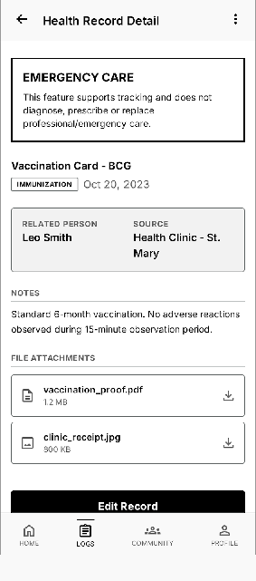

**Figure 79: Health Record Detail Screen**

| Field name | Description |
| :---- | :---- |
| Record title | Displays or captures the record title required for this screen. The control is visible only when permitted by role, ownership, consent and current record state. |
| Record type | Displays or captures the record type required for this screen. The control is visible only when permitted by role, ownership, consent and current record state. |
| Date | Displays or captures the date required for this screen. The control is visible only when permitted by role, ownership, consent and current record state. |
| Related person | Displays or captures the related person required for this screen. The control is visible only when permitted by role, ownership, consent and current record state. |
| Source label | Displays or captures the source label required for this screen. The control is visible only when permitted by role, ownership, consent and current record state. |
| Notes | Displays or captures the notes required for this screen. The control is visible only when permitted by role, ownership, consent and current record state. |
| File attachments | Displays or captures the file attachments required for this screen. The control is visible only when permitted by role, ownership, consent and current record state. |
| Edit/Delete actions | Executes the edit/delete actions after required validation and confirmation. |

**Table 365: Health Record Detail Screen Field Description**

##### **4.2.2.33 Today Tasks Screen** {#4.2.2.33-today-tasks-screen}

**Platform:** Mother Mobile App

**Feature:** Core experience

**Purpose:** Shows reminders, appointments, checklist items, and family tasks due today.

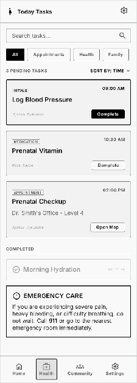

**Figure 80: Today Tasks Screen**

| Field name | Description |
| :---- | :---- |
| Screen Header | Shows the screen title, context, and primary action when permitted. |
| Search Field | Filters items by supported keywords. |
| Filter Controls | Filters by status, type, date, category, specialty, priority, or ownership as applicable. |
| Sort Control | Orders items by relevance, date, urgency, expiry, or status. |
| Result List / Cards | Displays each item with the key summary, status, and available actions. |
| Item Action | Opens the selected detail screen or performs an authorized quick action. |
| Pagination / Load More | Loads additional results when the list is longer than one page. |
| Empty State | Explains when no item matches the current filters. |

**Table 366: Today Tasks Screen Field Description**

##### **4.2.2.34 Reminder Detail Screen** {#4.2.2.34-reminder-detail-screen}

**Platform:** Mother Mobile App

**Feature:** Reminders, Tasks & Care Plan

**Purpose:** Displays reminder type, recurrence, due time, status and notes with complete, skip, edit and delete actions.

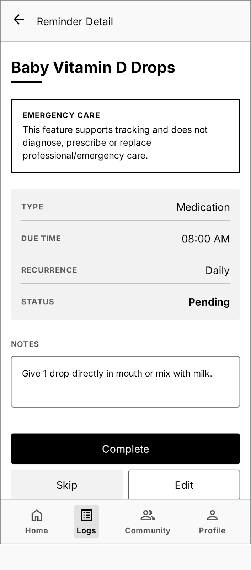

**Figure 81: Reminder Detail Screen**

| Field name | Description |
| :---- | :---- |
| Reminder title | Displays or captures the reminder title required for this screen. The control is visible only when permitted by role, ownership, consent and current record state. |
| Type | Displays or captures the type required for this screen. The control is visible only when permitted by role, ownership, consent and current record state. |
| Due time | Displays or captures the due time required for this screen. The control is visible only when permitted by role, ownership, consent and current record state. |
| Recurrence | Displays or captures the recurrence required for this screen. The control is visible only when permitted by role, ownership, consent and current record state. |
| Status | Displays or captures the status required for this screen. The control is visible only when permitted by role, ownership, consent and current record state. |
| Notes | Displays or captures the notes required for this screen. The control is visible only when permitted by role, ownership, consent and current record state. |
| Complete button | Executes the complete button after required validation and confirmation. |
| Skip button | Executes the skip button after required validation and confirmation. |
| Edit button | Executes the edit button after required validation and confirmation. |
| Delete button | Executes the delete button after required validation and confirmation. |

**Table 367: Reminder Detail Screen Field Description**

##### **4.2.2.35 Delete Reminder Confirmation Screen** {#4.2.2.35-delete-reminder-confirmation-screen}

**Platform:** Mother Mobile App

**Feature:** Reminders, Tasks & Care Plan

**Purpose:** Confirms deletion or deactivation of a reminder created by the mother.

**Figure 82: Delete Reminder Confirmation Screen**

| Field name | Description |
| :---- | :---- |
| Reminder summary | Displays or captures the reminder summary required for this screen. The control is visible only when permitted by role, ownership, consent and current record state. |
| Recurring reminder warning | Displays the required recurring reminder warning before the user continues. |
| Cancel button | Executes the cancel button after required validation and confirmation. |
| Delete button | Executes the delete button after required validation and confirmation. |

**Table 368: Delete Reminder Confirmation Screen Field Description**

##### **4.2.2.36 Community Feed Screen** {#4.2.2.36-community-feed-screen}

**Platform:** Mother Mobile App

**Feature:** Core experience

**Purpose:** Displays moderated community questions, answers, topics, and saved content.

**Figure 83: Community Feed Screen**

| Field name | Description |
| :---- | :---- |
| Screen Header | Shows the screen name, current context, and navigation controls. |
| Main Content Area | Displays moderated community questions, answers, topics, and saved content. |
| Status / Metadata | Displays relevant status, date, owner, source, permission, or verification information. |
| Primary Action | Performs the main function supported by this screen. |
| Secondary Actions | Provides other permitted actions such as edit, filter, share, report, or return. |
| Privacy / Safety Notice | Displays role-appropriate consent, privacy, moderation, or medical-safety information when required. |

**Table 369: Community Feed Screen Field Description**

##### **4.2.2.37 Community Question Detail Screen** {#4.2.2.37-community-question-detail-screen}

**Platform:** Mobile App \- Shared User

**Feature:** Community Q\&A & Moderation

**Purpose:** Displays the question, answers, source labels, moderation status and allowed engagement actions.

**Figure 84: Community Question Detail Screen**

| Field name | Description |
| :---- | :---- |
| Question header | Displays or captures the question header required for this screen. The control is visible only when permitted by role, ownership, consent and current record state. |
| Author/anonymous label | Displays or captures the author/anonymous label required for this screen. The control is visible only when permitted by role, ownership, consent and current record state. |
| Topic and stage tags | Displays or captures the topic and stage tags required for this screen. The control is visible only when permitted by role, ownership, consent and current record state. |
| Question content | Displays or captures the question content required for this screen. The control is visible only when permitted by role, ownership, consent and current record state. |
| Answer list | Displays or captures the answer list required for this screen. The control is visible only when permitted by role, ownership, consent and current record state. |
| Expert badge | Displays or captures the expert badge required for this screen. The control is visible only when permitted by role, ownership, consent and current record state. |
| Like/Bookmark/Report actions | Executes the like/bookmark/report actions after required validation and confirmation. |
| Answer field | Displays or captures the answer field required for this screen. The control is visible only when permitted by role, ownership, consent and current record state. |

**Table 370: Community Question Detail Screen Field Description**

##### **4.2.2.38 Edit Own Answer Screen** {#4.2.2.38-edit-own-answer-screen}

**Platform:** Mobile App \- Shared User

**Feature:** Community Q\&A & Moderation

**Purpose:** Lets the signed-in author update an unlocked answer.

**Figure 85: Edit Own Answer Screen**

| Field name | Description |
| :---- | :---- |
| Answer editor | Displays or captures the answer editor required for this screen. The control is visible only when permitted by role, ownership, consent and current record state. |
| Community safety note | Displays or captures the community safety note required for this screen. The control is visible only when permitted by role, ownership, consent and current record state. |
| Save button | Executes the save button after required validation and confirmation. |
| Cancel button | Executes the cancel button after required validation and confirmation. |

**Table 371: Edit Own Answer Screen Field Description**

##### **4.2.2.39 Delete Own Answer Confirmation Screen** {#4.2.2.39-delete-own-answer-confirmation-screen}

**Platform:** Mobile App \- Shared User

**Feature:** Community Q\&A & Moderation

**Purpose:** Confirms soft deletion of the signed-in author’s answer.

**Figure 86: Delete Own Answer Confirmation Screen**

| Field name | Description |
| :---- | :---- |
| Answer excerpt | Displays or captures the answer excerpt required for this screen. The control is visible only when permitted by role, ownership, consent and current record state. |
| Deletion warning | Displays the required deletion warning before the user continues. |
| Cancel button | Executes the cancel button after required validation and confirmation. |
| Delete button | Executes the delete button after required validation and confirmation. |

**Table 372: Delete Own Answer Confirmation Screen Field Description**

##### **4.2.2.40 Verified Content Search Screen** {#4.2.2.40-verified-content-search-screen}

**Platform:** Mobile App \- Shared User

**Feature:** Verified Content & Checklist Hub

**Purpose:** Searches approved articles, FAQs and checklists by keyword, stage and topic.

**Figure 87: Verified Content Search Screen**

| Field name | Description |
| :---- | :---- |
| Search field | Displays or captures the search field required for this screen. The control is visible only when permitted by role, ownership, consent and current record state. |
| Stage filter | Displays or captures the stage filter required for this screen. The control is visible only when permitted by role, ownership, consent and current record state. |
| Topic filter | Displays or captures the topic filter required for this screen. The control is visible only when permitted by role, ownership, consent and current record state. |
| Content type filter | Displays or captures the content type filter required for this screen. The control is visible only when permitted by role, ownership, consent and current record state. |
| Result list | Displays or captures the result list required for this screen. The control is visible only when permitted by role, ownership, consent and current record state. |
| Source labels | Displays or captures the source labels required for this screen. The control is visible only when permitted by role, ownership, consent and current record state. |

**Table 373: Verified Content Search Screen Field Description**

##### **4.2.2.41 Verified Content Detail Screen** {#4.2.2.41-verified-content-detail-screen}

**Platform:** Mobile App \- Shared User

**Feature:** Verified Content & Checklist Hub

**Purpose:** Displays approved content with source, version, update date and applicable safety warnings.

**Figure 88: Verified Content Detail Screen**

| Field name | Description |
| :---- | :---- |
| Title | Displays or captures the title required for this screen. The control is visible only when permitted by role, ownership, consent and current record state. |
| Content type | Displays or captures the content type required for this screen. The control is visible only when permitted by role, ownership, consent and current record state. |
| Source label | Displays or captures the source label required for this screen. The control is visible only when permitted by role, ownership, consent and current record state. |
| Version/update date | Displays or captures the version/update date required for this screen. The control is visible only when permitted by role, ownership, consent and current record state. |
| Body content | Displays or captures the body content required for this screen. The control is visible only when permitted by role, ownership, consent and current record state. |
| Safety warning | Displays the required safety warning before the user continues. |
| Bookmark action | Executes the bookmark action after required validation and confirmation. |

**Table 374: Verified Content Detail Screen Field Description**

##### **4.2.2.42 AI Symptom Intake Screen** {#4.2.2.42-ai-symptom-intake-screen}

**Platform:** Mother Mobile App

**Feature:** Core experience

**Purpose:** Collects symptoms and relevant context through a guided, structured intake flow.

**Figure 89: AI Symptom Intake Screen**

| Field name | Description |
| :---- | :---- |
| Screen Header | Shows the form title, context, and back or cancel control. |
| Primary Information Fields | Collects the core information required by the function. |
| Selectors / Toggles | Provides role-appropriate choices, categories, permissions, channels, or status options. |
| Supporting Details | Collects optional notes, dates, tags, evidence, files, or configuration values. |
| Validation and Help Text | Explains required format, limits, privacy, safety, or eligibility rules. |
| Save / Submit Button | Validates and submits the form. |
| Cancel Button | Returns without saving changes. |

**Table 375: AI Symptom Intake Screen Field Description**

##### **4.2.2.43 Risk Triage Result Screen** {#4.2.2.43-risk-triage-result-screen}

**Platform:** Mother Mobile App

**Feature:** Core experience

**Purpose:** Shows the non-diagnostic risk level and the recommended next safe action.

**Figure 90: Risk Triage Result Screen**

| Field name | Description |
| :---- | :---- |
| Screen Header | Shows the screen name, current context, and navigation controls. |
| Main Content Area | Shows the non-diagnostic risk level and the recommended next safe action. |
| Status / Metadata | Displays relevant status, date, owner, source, permission, or verification information. |
| Primary Action | Performs the main function supported by this screen. |
| Secondary Actions | Provides other permitted actions such as edit, filter, share, report, or return. |
| Privacy / Safety Notice | Displays role-appropriate consent, privacy, moderation, or medical-safety information when required. |

**Table 376: Risk Triage Result Screen Field Description**

##### **4.2.2.44 Emergency Map Screen** {#4.2.2.44-emergency-map-screen}

**Platform:** Mother Mobile App

**Feature:** Core experience

**Purpose:** Shows nearby care facilities, available experts, routes, ETA, quick call, and emergency actions.

**Figure 91: Emergency Map Screen**

| Field name | Description |
| :---- | :---- |
| Location Permission Status | Shows whether location access is granted and provides a permission action when needed. |
| Search / Filter Bar | Filters nearby facilities, experts, or support requests. |
| Map Canvas | Displays a grayscale map area with current-location and result markers. |
| Marker Details | Shows name, type, distance, status, and availability for the selected marker. |
| Result List / Bottom Sheet | Lists nearby results ordered by distance or relevance. |
| Route and ETA | Displays distance, route preview, and estimated travel time when requested. |
| Quick Actions | Provides call, contact, accept request, or open-navigation actions according to the screen. |
| Safety Disclaimer | Clarifies that the map does not replace emergency services or guarantee professional response. |

**Table 377: Emergency Map Screen Field Description**

##### **4.2.2.45 Expert Directory Screen** {#4.2.2.45-expert-directory-screen}

**Platform:** Mother Mobile App

**Feature:** Core experience

**Purpose:** Lists and filters verified experts by specialty, availability, location, and rating.

**Figure 92: Expert Directory Screen**

| Field name | Description |
| :---- | :---- |
| Screen Header | Shows the screen title, context, and primary action when permitted. |
| Search Field | Filters items by supported keywords. |
| Filter Controls | Filters by status, type, date, category, specialty, priority, or ownership as applicable. |
| Sort Control | Orders items by relevance, date, urgency, expiry, or status. |
| Result List / Cards | Displays each item with the key summary, status, and available actions. |
| Item Action | Opens the selected detail screen or performs an authorized quick action. |
| Pagination / Load More | Loads additional results when the list is longer than one page. |
| Empty State | Explains when no item matches the current filters. |

**Table 378: Expert Directory Screen Field Description**

##### **4.2.2.46 Reschedule Consultation Screen** {#4.2.2.46-reschedule-consultation-screen}

**Platform:** Mother Mobile App / Expert App

**Feature:** Direct Consultation & Commission

**Purpose:** Submits or confirms a new consultation time within the permitted rescheduling window.

**Figure 93: Reschedule Consultation Screen**

| Field name | Description |
| :---- | :---- |
| Current slot | Displays or captures the current slot required for this screen. The control is visible only when permitted by role, ownership, consent and current record state. |
| Available slot picker | Displays or captures the available slot picker required for this screen. The control is visible only when permitted by role, ownership, consent and current record state. |
| Reason field | Displays or captures the reason field required for this screen. The control is visible only when permitted by role, ownership, consent and current record state. |
| Policy notice | Displays the required policy notice before the user continues. |
| Submit button | Executes the submit button after required validation and confirmation. |

**Table 379: Reschedule Consultation Screen Field Description**

##### **4.2.2.47 Cancel Consultation Confirmation Screen** {#4.2.2.47-cancel-consultation-confirmation-screen}

**Platform:** Mother Mobile App / Expert App

**Feature:** Direct Consultation & Commission

**Purpose:** Collects a cancellation reason and confirms cancellation under the applicable fee policy.

**Figure 94: Cancel Consultation Confirmation Screen**

| Field name | Description |
| :---- | :---- |
| Consultation summary | Displays or captures the consultation summary required for this screen. The control is visible only when permitted by role, ownership, consent and current record state. |
| Reason selector | Displays or captures the reason selector required for this screen. The control is visible only when permitted by role, ownership, consent and current record state. |
| Refund policy notice | Displays the required refund policy notice before the user continues. |
| Cancel action | Executes the cancel action after required validation and confirmation. |
| Keep booking button | Executes the keep booking button after required validation and confirmation. |

**Table 380: Cancel Consultation Confirmation Screen Field Description**

##### **4.2.2.48 Consultation Summary Screen** {#4.2.2.48-consultation-summary-screen}

**Platform:** Mother Mobile App

**Feature:** Direct Consultation & Commission

**Purpose:** Displays the safe post-consultation summary and next-step guidance written by the expert.

| Field name | Description |
| :---- | :---- |
| Expert and session details | Displays or captures the expert and session details required for this screen. The control is visible only when permitted by role, ownership, consent and current record state. |
| Summary text | Displays or captures the summary text required for this screen. The control is visible only when permitted by role, ownership, consent and current record state. |
| Next steps | Displays or captures the next steps required for this screen. The control is visible only when permitted by role, ownership, consent and current record state. |
| Safety disclaimer | Displays the required safety disclaimer before the user continues. |
| Download/share disabled notice | Displays the required download/share disabled notice before the user continues. |

**Table 381: Consultation Summary Screen Field Description**

##### **4.2.2.49 Expert Profile Screen** {#4.2.2.49-expert-profile-screen}

**Platform:** Mother Mobile App

**Feature:** Expert Consultation & Pricing

**Purpose:** Shows a verified expert's professional identity, scope, availability, reviews and pricing entry point.

**Figure 95: Expert Profile Screen**

| Field name | Description |
| :---- | :---- |
| Header | Shows back navigation and the title Expert Profile. |
| Expert identity | Displays avatar placeholder, verified badge, name and professional title. |
| Specialties | Shows supported maternal, postpartum or child-care specialties. |
| Credentials summary | Displays verified qualification and experience information without exposing private documents. |
| Availability | Shows supported channels and the next available consultation time. |
| Rating and reviews | Summarizes verified post-consultation ratings. |
| Scope disclaimer | Clarifies that CareBridge consultation is guidance and does not replace emergency or in-person care. |
| View consultation pricing | Opens the active pricing packages for this expert. |

**Table 382: Expert Profile Screen Field Description**

##### **4.2.2.50 Expert Consultation Pricing Screen** {#4.2.2.50-expert-consultation-pricing-screen}

**Platform:** Mother Mobile App

**Feature:** Expert Consultation & Pricing

**Purpose:** Shows the expert's effective packages and total payable amount before the user starts booking.

**Figure 96: Expert Consultation Pricing Screen**

| Field name | Description |
| :---- | :---- |
| Expert summary | Shows the selected expert and verified specialty. |
| Channel filters | Filters active packages by chat, voice or video. |
| Package card | Shows duration, effective price, total payable estimate and status. |
| Cancellation policy | Summarizes cancellation and refund conditions before booking. |
| Last updated | Shows when the displayed effective pricing was loaded. |
| Select package | Revalidates the package and proceeds to slot selection when it is still active. |
| Unavailable state | Explains that the expert currently has no active paid package. |

**Table 383: Expert Consultation Pricing Screen Field Description**

##### **4.2.2.51 Booking Review Screen** {#4.2.2.51-booking-review-screen}

**Platform:** Mother Mobile App

**Feature:** Expert Consultation & Pricing

**Purpose:** Reviews the selected expert, slot, consent and immutable price snapshot before booking confirmation.

**Figure 97: Booking Review Screen**

| Field name | Description |
| :---- | :---- |
| Expert and package | Shows the selected expert, channel and duration. |
| Schedule | Shows the chosen consultation date and time. |
| Shared-data consent | Summarizes records and expiry selected for expert access. |
| Locked price snapshot | Displays the immutable amount and price version used for this booking. |
| Cancellation policy | Shows the applicable cancellation and refund conditions. |
| Terms confirmation | Requires confirmation before creating the booking. |
| Confirm booking | Creates the booking with the displayed price snapshot. |

**Table 384: Booking Review Screen Field Description**

##### **4.2.2.52 Payment Screen** {#4.2.2.52-payment-screen}

**Platform:** Mother Mobile App

**Feature:** Expert Consultation & Pricing

**Purpose:** Pays the exact amount stored in the booking price snapshot.

**Figure 98: Payment Screen**

| Field name | Description |
| :---- | :---- |
| Booking reference | Identifies the booking being paid. |
| Locked amount | Shows the payable amount stored in the booking snapshot. |
| Payment method | Allows selection of a supported gateway or mock-payment method. |
| Gateway notice | Explains external payment processing and retry behavior. |
| Cancellation/refund link | Opens the policy applicable to this booking. |
| Pay now | Starts payment for the locked amount only. |
| Cancel | Returns without changing the expert's public pricing. |

**Table 385: Payment Screen Field Description**

##### **4.2.2.53 Payment Result Screen** {#4.2.2.53-payment-result-screen}

**Platform:** Mother Mobile App

**Feature:** Expert Consultation & Pricing

**Purpose:** Shows the payment result and the booking's locked financial amount.

**Figure 99: Payment Result Screen**

| Field name | Description |
| :---- | :---- |
| Payment status | Shows success, pending or failed state. |
| Booking ID | Identifies the related consultation. |
| Transaction reference | Shows the gateway or mock transaction identifier. |
| Locked amount | Displays the booking snapshot amount used for payment. |
| Paid time | Shows the payment-processing timestamp when available. |
| View consultation | Opens the consultation detail after a successful or pending payment. |
| Retry payment | Retries only when the transaction is safely retryable. |

**Table 386: Payment Result Screen Field Description**

##### **4.2.2.54 Consultation List Screen** {#4.2.2.54-consultation-list-screen}

**Platform:** Mother Mobile App

**Feature:** Direct Consultation & Commission

**Purpose:** Lists the mother's pending, upcoming, active, completed, cancelled, no-show and disputed consultations.

**Figure 100: Consultation List Screen**

| Field name | Description |
| :---- | :---- |
| Status tabs | Displays or captures the status tabs required for this screen. The control is visible only when permitted by role, ownership, consent and current record state. |
| Date filter | Displays or captures the date filter required for this screen. The control is visible only when permitted by role, ownership, consent and current record state. |
| Consultation cards | Displays or captures the consultation cards required for this screen. The control is visible only when permitted by role, ownership, consent and current record state. |
| Participant name | Displays or captures the participant name required for this screen. The control is visible only when permitted by role, ownership, consent and current record state. |
| Time and channel | Displays or captures the time and channel required for this screen. The control is visible only when permitted by role, ownership, consent and current record state. |
| Open detail action | Executes the open detail action after required validation and confirmation. |

**Table 387: Consultation List Screen Field Description**

##### **4.2.2.55 Consultation Detail Screen** {#4.2.2.55-consultation-detail-screen}

**Platform:** Mother Mobile App

**Feature:** Direct Consultation & Commission

**Purpose:** Displays one consultation, its locked price snapshot, payment state, consent scope, schedule and permitted session actions.

**Figure 101: Consultation Detail Screen**

| Field name | Description |
| :---- | :---- |
| Participant summary | Displays or captures the participant summary required for this screen. The control is visible only when permitted by role, ownership, consent and current record state. |
| Date/time | Displays or captures the date/time required for this screen. The control is visible only when permitted by role, ownership, consent and current record state. |
| Channel | Displays or captures the channel required for this screen. The control is visible only when permitted by role, ownership, consent and current record state. |
| Status | Displays or captures the status required for this screen. The control is visible only when permitted by role, ownership, consent and current record state. |
| Fee | Displays or captures the fee required for this screen. The control is visible only when permitted by role, ownership, consent and current record state. |
| Shared-data scope | Displays or captures the shared-data scope required for this screen. The control is visible only when permitted by role, ownership, consent and current record state. |
| Reschedule button | Executes the reschedule button after required validation and confirmation. |
| Cancel button | Executes the cancel button after required validation and confirmation. |
| Join button | Executes the join button after required validation and confirmation. |

**Table 388: Consultation Detail Screen Field Description**

##### **4.2.2.56 Realtime Consultation Session Screen** {#4.2.2.56-realtime-consultation-session-screen}

**Platform:** Mother Mobile App

**Feature:** Core experience

**Purpose:** Provides authenticated chat, voice call, or video call for an active consultation.

**Figure 102: Realtime Consultation Session Screen**

| Field name | Description |
| :---- | :---- |
| Participant Header | Shows participant name, role, verification badge, and session status. |
| Session Information | Shows booking or request context, scheduled time, and consent scope. |
| Conversation / Media Area | Displays chat messages or the active voice/video interface. |
| Message Composer | Sends text messages and permitted attachments during the session. |
| Call Controls | Provides microphone, camera, speaker, reconnect, and network-status controls where applicable. |
| Shared Summary Shortcut | Opens the authorized shared health summary without leaving the session. |
| End Session Button | Ends the session after confirmation and updates session status. |
| Safety Notice | States that consultation does not replace emergency care and follows the approved scope. |

**Table 389: Realtime Consultation Session Screen Field Description**

##### **4.2.2.57 Care Groups Screen** {#4.2.2.57-care-groups-screen}

**Platform:** Mother Mobile App

**Feature:** Core experience

**Purpose:** Lists and manages family care groups, members, permissions, invitations, and assigned tasks.

**Figure 103: Care Groups Screen**

| Field name | Description |
| :---- | :---- |
| Screen Header | Shows the screen title, context, and primary action when permitted. |
| Search Field | Filters items by supported keywords. |
| Filter Controls | Filters by status, type, date, category, specialty, priority, or ownership as applicable. |
| Sort Control | Orders items by relevance, date, urgency, expiry, or status. |
| Result List / Cards | Displays each item with the key summary, status, and available actions. |
| Item Action | Opens the selected detail screen or performs an authorized quick action. |
| Pagination / Load More | Loads additional results when the list is longer than one page. |
| Empty State | Explains when no item matches the current filters. |

**Table 390: Care Groups Screen Field Description**

##### **4.2.2.58 Care Group Members Screen** {#4.2.2.58-care-group-members-screen}

**Platform:** Mother Mobile App / Family Member Mobile App

**Feature:** Family Sync & Cooperative Care

**Purpose:** Lists members, roles, permissions and invitation states for the active care group.

**Figure 104: Care Group Members Screen**

| Field name | Description |
| :---- | :---- |
| Group header | Displays or captures the group header required for this screen. The control is visible only when permitted by role, ownership, consent and current record state. |
| Member list | Displays or captures the member list required for this screen. The control is visible only when permitted by role, ownership, consent and current record state. |
| Role badges | Displays or captures the role badges required for this screen. The control is visible only when permitted by role, ownership, consent and current record state. |
| Permission summary | Displays or captures the permission summary required for this screen. The control is visible only when permitted by role, ownership, consent and current record state. |
| Invitation status | Displays or captures the invitation status required for this screen. The control is visible only when permitted by role, ownership, consent and current record state. |
| Member actions | Executes the member actions after required validation and confirmation. |

**Table 391: Care Group Members Screen Field Description**

##### **4.2.2.59 Revoke Family Invitation Confirmation Screen** {#4.2.2.59-revoke-family-invitation-confirmation-screen}

**Platform:** Mother Mobile App

**Feature:** Family Sync & Cooperative Care

**Purpose:** Confirms cancellation of an invitation that has not yet been accepted.

**Figure 105: Revoke Family Invitation Confirmation Screen**

| Field name | Description |
| :---- | :---- |
| Invitee | Displays or captures the invitee required for this screen. The control is visible only when permitted by role, ownership, consent and current record state. |
| Invitation date | Displays or captures the invitation date required for this screen. The control is visible only when permitted by role, ownership, consent and current record state. |
| Permission preview | Displays or captures the permission preview required for this screen. The control is visible only when permitted by role, ownership, consent and current record state. |
| Cancel button | Executes the cancel button after required validation and confirmation. |
| Revoke button | Executes the revoke button after required validation and confirmation. |

**Table 392: Revoke Family Invitation Confirmation Screen Field Description**

##### **4.2.2.60 Remove Family Member Confirmation Screen** {#4.2.2.60-remove-family-member-confirmation-screen}

**Platform:** Mother Mobile App

**Feature:** Family Sync & Cooperative Care

**Purpose:** Confirms removal of a member and revocation of active sharing permissions.

**Figure 106: Remove Family Member Confirmation Screen**

| Field name | Description |
| :---- | :---- |
| Member summary | Displays or captures the member summary required for this screen. The control is visible only when permitted by role, ownership, consent and current record state. |
| Permission revocation warning | Displays the required permission revocation warning before the user continues. |
| Cancel button | Executes the cancel button after required validation and confirmation. |
| Remove button | Executes the remove button after required validation and confirmation. |

**Table 393: Remove Family Member Confirmation Screen Field Description**

##### **4.2.2.61 Edit Family Task Screen** {#4.2.2.61-edit-family-task-screen}

**Platform:** Mother Mobile App

**Feature:** Family Sync & Cooperative Care

**Purpose:** Updates the content, due date or assignee of an unfinished family task.

**Figure 107: Edit Family Task Screen**

| Field name | Description |
| :---- | :---- |
| Task title | Displays or captures the task title required for this screen. The control is visible only when permitted by role, ownership, consent and current record state. |
| Description | Displays or captures the description required for this screen. The control is visible only when permitted by role, ownership, consent and current record state. |
| Assignee selector | Displays or captures the assignee selector required for this screen. The control is visible only when permitted by role, ownership, consent and current record state. |
| Due date | Displays or captures the due date required for this screen. The control is visible only when permitted by role, ownership, consent and current record state. |
| Reminder option | Displays or captures the reminder option required for this screen. The control is visible only when permitted by role, ownership, consent and current record state. |
| Save button | Executes the save button after required validation and confirmation. |

**Table 394: Edit Family Task Screen Field Description**

##### **4.2.2.62 Cancel Family Task Confirmation Screen** {#4.2.2.62-cancel-family-task-confirmation-screen}

**Platform:** Mother Mobile App

**Feature:** Family Sync & Cooperative Care

**Purpose:** Confirms task cancellation and notification to affected members.

**Figure 108: Cancel Family Task Confirmation Screen**

| Field name | Description |
| :---- | :---- |
| Task summary | Displays or captures the task summary required for this screen. The control is visible only when permitted by role, ownership, consent and current record state. |
| Cancellation notice | Displays the required cancellation notice before the user continues. |
| Cancel button | Executes the cancel button after required validation and confirmation. |
| Confirm cancellation button | Executes the confirm cancellation button after required validation and confirmation. |

**Table 395: Cancel Family Task Confirmation Screen Field Description**

##### **4.2.2.63 Connected Devices Screen** {#4.2.2.63-connected-devices-screen}

**Platform:** Mother Mobile App

**Feature:** Core experience

**Purpose:** Manages connected health platforms or devices and displays imported data status.

**Figure 109: Connected Devices Screen**

| Field name | Description |
| :---- | :---- |
| Screen Header | Shows the screen name, current context, and navigation controls. |
| Main Content Area | Manages connected health platforms or devices and displays imported data status. |
| Status / Metadata | Displays relevant status, date, owner, source, permission, or verification information. |
| Primary Action | Performs the main function supported by this screen. |
| Secondary Actions | Provides other permitted actions such as edit, filter, share, report, or return. |
| Privacy / Safety Notice | Displays role-appropriate consent, privacy, moderation, or medical-safety information when required. |

**Table 396: Connected Devices Screen Field Description**

##### **4.2.2.64 Safety Monitoring Screen** {#4.2.2.64-safety-monitoring-screen}

**Platform:** Mother Mobile App

**Feature:** Core experience

**Purpose:** Controls IMU-based activity monitoring and shows safety status, detected events, and alerts.

**Figure 110: Safety Monitoring Screen**

| Field name | Description |
| :---- | :---- |
| Screen Header | Shows the screen name, current context, and navigation controls. |
| Main Content Area | Controls IMU-based activity monitoring and shows safety status, detected events, and alerts. |
| Status / Metadata | Displays relevant status, date, owner, source, permission, or verification information. |
| Primary Action | Performs the main function supported by this screen. |
| Secondary Actions | Provides other permitted actions such as edit, filter, share, report, or return. |
| Privacy / Safety Notice | Displays role-appropriate consent, privacy, moderation, or medical-safety information when required. |

**Table 397: Safety Monitoring Screen Field Description**

##### **4.2.2.65 Community Search Screen** {#4.2.2.65-community-search-screen}

**Platform:** Mother Mobile App

**Feature:** Community Q\&A

**Purpose:** Searches community questions by keyword, stage, topic, answer status and expert label.

**Figure 111: Community Search Screen**

| Field name | Description |
| :---- | :---- |
| Screen Header | Shows the screen name, current context, and navigation controls. |
| Main Content Area | Searches community questions by keyword, stage, topic, answer status and expert label. |
| Status / Metadata | Displays relevant status, date, owner, source, permission, or verification information. |
| Primary Action | Performs the main function supported by this screen. |
| Secondary Actions | Provides other permitted actions such as edit, filter, share, report, or return. |
| Privacy / Safety Notice | Displays role-appropriate consent, privacy, moderation, or medical-safety information when required. |

**Table 398: Community Search Screen Field Description**

##### **4.2.2.66 Topic Directory Screen** {#4.2.2.66-topic-directory-screen}

**Platform:** Mother Mobile App

**Feature:** Community Q\&A

**Purpose:** Lists and searches community topics for pregnancy, postpartum, child care, nutrition, psychology and safety.

**Figure 112: Topic Directory Screen**

| Field name | Description |
| :---- | :---- |
| Screen Header | Shows the screen title, context, and primary action when permitted. |
| Search Field | Filters items by supported keywords. |
| Filter Controls | Filters by status, type, date, category, specialty, priority, or ownership as applicable. |
| Sort Control | Orders items by relevance, date, urgency, expiry, or status. |
| Result List / Cards | Displays each item with the key summary, status, and available actions. |
| Item Action | Opens the selected detail screen or performs an authorized quick action. |
| Pagination / Load More | Loads additional results when the list is longer than one page. |
| Empty State | Explains when no item matches the current filters. |

**Table 399: Topic Directory Screen Field Description**

##### **4.2.2.67 Topic Detail Screen** {#4.2.2.67-topic-detail-screen}

**Platform:** Mother Mobile App

**Feature:** Community Q\&A

**Purpose:** Shows a topic feed and allows the user to follow or unfollow that topic.

**Figure 113: Topic Detail Screen**

| Field name | Description |
| :---- | :---- |
| Screen Header | Shows the item title, identifier, status, and back navigation. |
| Summary Section | Displays the key information needed to understand the selected item. |
| Metadata Section | Shows dates, owner, source, status, category, consent, or verification information as applicable. |
| Detailed Content | Displays the full authorized record, post, file, consultation, alert, or investigation data. |
| Related Items | Shows linked records, files, history, comments, or audit evidence when applicable. |
| Primary Actions | Provides the authorized actions for the current role and item state. |
| Status / Safety Notice | Displays privacy, consent, medical-safety, expiry, or moderation constraints when applicable. |

**Table 400: Topic Detail Screen Field Description**

##### **4.2.2.68 Edit Community Post Screen** {#4.2.2.68-edit-community-post-screen}

**Platform:** Mother Mobile App

**Feature:** Community Q\&A

**Purpose:** Edits the user’s own community post while it remains editable and is not locked by moderation.

**Figure 114: Edit Community Post Screen**

| Field name | Description |
| :---- | :---- |
| Screen Header | Shows the form title, context, and back or cancel control. |
| Primary Information Fields | Collects the core information required by the function. |
| Selectors / Toggles | Provides role-appropriate choices, categories, permissions, channels, or status options. |
| Supporting Details | Collects optional notes, dates, tags, evidence, files, or configuration values. |
| Validation and Help Text | Explains required format, limits, privacy, safety, or eligibility rules. |
| Save / Submit Button | Validates and submits the form. |
| Cancel Button | Returns without saving changes. |

**Table 401: Edit Community Post Screen Field Description**

##### **4.2.2.69 Delete Community Post Confirmation Screen** {#4.2.2.69-delete-community-post-confirmation-screen}

**Platform:** Mother Mobile App

**Feature:** Community Q\&A

**Purpose:** Confirms deletion or archival of the user’s own post when no moderation or investigation lock applies.

******

**Figure 115: Delete Community Post Confirmation Screen**

| Field name | Description |
| :---- | :---- |
| Dialog Title | Names the action being confirmed. |
| Context Summary | Shows the selected item or configuration affected by the action. |
| Warning / Consequence Message | Explains the immediate result and any irreversible or safety-related effect. |
| Cancel Button | Closes the dialog without performing the action. |
| Confirm Button | Performs the confirmed action when eligibility and authorization checks pass. |

**Table 402: Delete Community Post Confirmation Screen Field Description**

##### **4.2.2.70 File Manager Screen** {#4.2.2.70-file-manager-screen}

**Platform:** Mother Mobile App

**Feature:** File management

**Purpose:** Lists uploaded ultrasound images, medical records, vaccination files and child photos with ownership and access status.

******

**Figure 116: File Manager Screen**

| Field name | Description |
| :---- | :---- |
| Screen Header | Shows the screen name, current context, and navigation controls. |
| Main Content Area | Lists uploaded ultrasound images, medical records, vaccination files and child photos with ownership and access status. |
| Status / Metadata | Displays relevant status, date, owner, source, permission, or verification information. |
| Primary Action | Performs the main function supported by this screen. |
| Secondary Actions | Provides other permitted actions such as edit, filter, share, report, or return. |
| Privacy / Safety Notice | Displays role-appropriate consent, privacy, moderation, or medical-safety information when required. |

**Table 403: File Manager Screen Field Description**

##### **4.2.2.71 File Viewer Screen** {#4.2.2.71-file-viewer-screen}

**Platform:** Mother Mobile App

**Feature:** File management

**Purpose:** Previews or downloads an authorized file through a protected access link.

******

**Figure 117: File Viewer Screen**

| Field name | Description |
| :---- | :---- |
| Screen Header | Shows the item title, identifier, status, and back navigation. |
| Summary Section | Displays the key information needed to understand the selected item. |
| Metadata Section | Shows dates, owner, source, status, category, consent, or verification information as applicable. |
| Detailed Content | Displays the full authorized record, post, file, consultation, alert, or investigation data. |
| Related Items | Shows linked records, files, history, comments, or audit evidence when applicable. |
| Primary Actions | Provides the authorized actions for the current role and item state. |
| Status / Safety Notice | Displays privacy, consent, medical-safety, expiry, or moderation constraints when applicable. |

**Table 404: File Viewer Screen Field Description**

##### **4.2.2.72 Upload File Screen** {#4.2.2.72-upload-file-screen}

**Platform:** Mother Mobile App

**Feature:** File management

**Purpose:** Collects file, category, owner, date and metadata before secure upload validation.

******

**Figure 118: Upload File Screen**

| Field name | Description |
| :---- | :---- |
| Screen Header | Shows the form title, context, and back or cancel control. |
| Primary Information Fields | Collects the core information required by the function. |
| Selectors / Toggles | Provides role-appropriate choices, categories, permissions, channels, or status options. |
| Supporting Details | Collects optional notes, dates, tags, evidence, files, or configuration values. |
| Validation and Help Text | Explains required format, limits, privacy, safety, or eligibility rules. |
| Save / Submit Button | Validates and submits the form. |
| Cancel Button | Returns without saving changes. |

**Table 405: Upload File Screen Field Description**

##### **4.2.2.73 Delete File Confirmation Screen** {#4.2.2.73-delete-file-confirmation-screen}

**Platform:** Mother Mobile App

**Feature:** File management

**Purpose:** Confirms soft deletion of a user-owned file when retention or record-link rules do not block deletion.

******

**Figure 119: Delete File Confirmation Screen**

| Field name | Description |
| :---- | :---- |
| Dialog Title | Names the action being confirmed. |
| Context Summary | Shows the selected item or configuration affected by the action. |
| Warning / Consequence Message | Explains the immediate result and any irreversible or safety-related effect. |
| Cancel Button | Closes the dialog without performing the action. |
| Confirm Button | Performs the confirmed action when eligibility and authorization checks pass. |

**Table 406: Delete File Confirmation Screen Field Description**

##### **4.2.2.74 Expert Search and Filters Screen** {#4.2.2.74-expert-search-and-filters-screen}

**Platform:** Mother Mobile App

**Feature:** Expert discovery

**Purpose:** Searches and filters verified experts by name, specialty, channel, availability, fee, rating, online state and consented distance.

******

**Figure 120: Expert Search and Filters Screen**

| Field name | Description |
| :---- | :---- |
| Screen Header | Shows the screen name, current context, and navigation controls. |
| Main Content Area | Searches and filters verified experts by name, specialty, channel, availability, fee, rating, online state and consented distance. |
| Status / Metadata | Displays relevant status, date, owner, source, permission, or verification information. |
| Primary Action | Performs the main function supported by this screen. |
| Secondary Actions | Provides other permitted actions such as edit, filter, share, report, or return. |
| Privacy / Safety Notice | Displays role-appropriate consent, privacy, moderation, or medical-safety information when required. |

**Table 407: Expert Search and Filters Screen Field Description**

##### **4.2.2.75 Emergency Contacts Screen** {#4.2.2.75-emergency-contacts-screen}

**Platform:** Mother Mobile App

**Feature:** Safety monitoring

**Purpose:** Lists verified emergency contacts and their priority for MF-21 and MF-19 alert delivery.

******

**Figure 121: Emergency Contacts Screen**

| Field name | Description |
| :---- | :---- |
| Screen Header | Shows the form title, context, and back or cancel control. |
| Primary Information Fields | Collects the core information required by the function. |
| Selectors / Toggles | Provides role-appropriate choices, categories, permissions, channels, or status options. |
| Supporting Details | Collects optional notes, dates, tags, evidence, files, or configuration values. |
| Validation and Help Text | Explains required format, limits, privacy, safety, or eligibility rules. |
| Save / Submit Button | Validates and submits the form. |
| Cancel Button | Returns without saving changes. |

**Table 408: Emergency Contacts Screen Field Description**

##### **4.2.2.76 Edit Emergency Contact Screen** {#4.2.2.76-edit-emergency-contact-screen}

**Platform:** Mother Mobile App

**Feature:** Safety monitoring

**Purpose:** Adds, verifies, reprioritizes or removes an emergency contact.

******

**Figure 122: Edit Emergency Contact Screen**

| Field name | Description |
| :---- | :---- |
| Screen Header | Shows the form title, context, and back or cancel control. |
| Primary Information Fields | Collects the core information required by the function. |
| Selectors / Toggles | Provides role-appropriate choices, categories, permissions, channels, or status options. |
| Supporting Details | Collects optional notes, dates, tags, evidence, files, or configuration values. |
| Validation and Help Text | Explains required format, limits, privacy, safety, or eligibility rules. |
| Save / Submit Button | Validates and submits the form. |
| Cancel Button | Returns without saving changes. |

**Table 409: Edit Emergency Contact Screen Field Description**

##### **4.2.2.77 Enable Fall Detection Confirmation Screen** {#4.2.2.77-enable-fall-detection-confirmation-screen}

**Platform:** Mother Mobile App

**Feature:** Safety monitoring

**Purpose:** Confirms consent, sensor permission and monitoring conditions before fall detection starts.

******

**Figure 123: Enable Fall Detection Confirmation Screen**

| Field name | Description |
| :---- | :---- |
| Dialog Title | Names the action being confirmed. |
| Context Summary | Shows the selected item or configuration affected by the action. |
| Warning / Consequence Message | Explains the immediate result and any irreversible or safety-related effect. |
| Cancel Button | Closes the dialog without performing the action. |
| Confirm Button | Performs the confirmed action when eligibility and authorization checks pass. |

**Table 410: Enable Fall Detection Confirmation Screen Field Description**

##### **4.2.2.78 Disable Fall Detection Confirmation Screen** {#4.2.2.78-disable-fall-detection-confirmation-screen}

**Platform:** Mother Mobile App

**Feature:** Safety monitoring

**Purpose:** Confirms stopping sensor monitoring and optionally retaining the configuration for later use.

******

**Figure 124: Disable Fall Detection Confirmation Screen**

| Field name | Description |
| :---- | :---- |
| Dialog Title | Names the action being confirmed. |
| Context Summary | Shows the selected item or configuration affected by the action. |
| Warning / Consequence Message | Explains the immediate result and any irreversible or safety-related effect. |
| Cancel Button | Closes the dialog without performing the action. |
| Confirm Button | Performs the confirmed action when eligibility and authorization checks pass. |

**Table 411: Disable Fall Detection Confirmation Screen Field Description**

#### ***4.2.3 Family Member Mobile App*** {#4.2.3-family-member-mobile-app}

##### **4.2.3.1 Care Group Invitation Screen** {#4.2.3.1-care-group-invitation-screen}

**Platform:** Family Member Mobile App

**Feature:** Authentication & invitation

**Purpose:** Displays an invitation and allows the family member to accept or decline joining a care group.

******

**Figure 125: Care Group Invitation Screen**

| Field name | Description |
| :---- | :---- |
| Screen Header | Shows the screen name, current context, and navigation controls. |
| Main Content Area | Displays an invitation and allows the family member to accept or decline joining a care group. |
| Status / Metadata | Displays relevant status, date, owner, source, permission, or verification information. |
| Primary Action | Performs the main function supported by this screen. |
| Secondary Actions | Provides other permitted actions such as edit, filter, share, report, or return. |
| Privacy / Safety Notice | Displays role-appropriate consent, privacy, moderation, or medical-safety information when required. |

**Table 412: Care Group Invitation Screen Field Description**

##### **4.2.3.2 Reject Care Group Invitation Confirmation Screen** {#4.2.3.2-reject-care-group-invitation-confirmation-screen}

**Platform:** Family Member Mobile App

**Feature:** Family Sync & Cooperative Care

**Purpose:** Confirms rejection of a pending care-group invitation without creating access rights.

**Figure 126: Reject Care Group Invitation Confirmation Screen**

| Field name | Description |
| :---- | :---- |
| Inviter and group summary | Displays or captures the inviter and group summary required for this screen. The control is visible only when permitted by role, ownership, consent and current record state. |
| Shared scope preview | Displays or captures the shared scope preview required for this screen. The control is visible only when permitted by role, ownership, consent and current record state. |
| Cancel button | Executes the cancel button after required validation and confirmation. |
| Reject button | Executes the reject button after required validation and confirmation. |

**Table 413: Reject Care Group Invitation Confirmation Screen Field Description**

##### **4.2.3.3 Family Member Home Screen** {#4.2.3.3-family-member-home-screen}

**Platform:** Family Member Mobile App

**Feature:** Authentication & invitation

**Purpose:** Shows shared care groups, assigned tasks, calendar items, and family alerts.

**Figure 127: Family Member Home Screen**

| Field name | Description |
| :---- | :---- |
| Header and Identity | Shows the user, role, date, and page title. |
| Priority Summary | Displays the most important current status, alerts, or due actions. |
| Key Metric Cards | Shows role-relevant counts, trends, or status indicators. |
| Primary Modules | Provides shortcuts to the main functions available to the role. |
| Recent Activity | Shows recent records, requests, tasks, cases, or notifications. |
| Action Panel | Provides the main role-specific actions available from the dashboard. |
| Navigation | Provides bottom navigation on mobile or sidebar/top navigation on web. |

**Table 414: Family Member Home Screen Field Description**

##### **4.2.3.4 My Care Groups Screen** {#4.2.3.4-my-care-groups-screen}

**Platform:** Family Member Mobile App

**Feature:** Shared care

**Purpose:** Lists the care groups that the family member has joined.

******

**Figure 128: My Care Groups Screen**

| Field name | Description |
| :---- | :---- |
| Screen Header | Shows the screen title, context, and primary action when permitted. |
| Search Field | Filters items by supported keywords. |
| Filter Controls | Filters by status, type, date, category, specialty, priority, or ownership as applicable. |
| Sort Control | Orders items by relevance, date, urgency, expiry, or status. |
| Result List / Cards | Displays each item with the key summary, status, and available actions. |
| Item Action | Opens the selected detail screen or performs an authorized quick action. |
| Pagination / Load More | Loads additional results when the list is longer than one page. |
| Empty State | Explains when no item matches the current filters. |

**Table 415: My Care Groups Screen Field Description**

##### **4.2.3.5 Shared Care Group Detail Screen** {#4.2.3.5-shared-care-group-detail-screen}

**Platform:** Family Member Mobile App

**Feature:** Shared care

**Purpose:** Shows the selected group, members, granted permissions, shared data, and tasks.

******

**Figure 129: Shared Care Group Detail Screen**

| Field name | Description |
| :---- | :---- |
| Screen Header | Shows the item title, identifier, status, and back navigation. |
| Summary Section | Displays the key information needed to understand the selected item. |
| Metadata Section | Shows dates, owner, source, status, category, consent, or verification information as applicable. |
| Detailed Content | Displays the full authorized record, post, file, consultation, alert, or investigation data. |
| Related Items | Shows linked records, files, history, comments, or audit evidence when applicable. |
| Primary Actions | Provides the authorized actions for the current role and item state. |
| Status / Safety Notice | Displays privacy, consent, medical-safety, expiry, or moderation constraints when applicable. |

**Table 416: Shared Care Group Detail Screen Field Description**

##### **4.2.3.6 Leave Care Group Confirmation Screen** {#4.2.3.6-leave-care-group-confirmation-screen}

**Platform:** Family Member Mobile App

**Feature:** Family Sync & Cooperative Care

**Purpose:** Confirms leaving a care group and ending access to shared information.

**Figure 130: Leave Care Group Confirmation Screen**

| Field name | Description |
| :---- | :---- |
| Care group summary | Displays or captures the care group summary required for this screen. The control is visible only when permitted by role, ownership, consent and current record state. |
| Access loss warning | Displays the required access loss warning before the user continues. |
| Cancel button | Executes the cancel button after required validation and confirmation. |
| Leave group button | Executes the leave group button after required validation and confirmation. |

**Table 417: Leave Care Group Confirmation Screen Field Description**

##### **4.2.3.7 Shared Care Calendar Screen** {#4.2.3.7-shared-care-calendar-screen}

**Platform:** Family Member Mobile App

**Feature:** Shared care

**Purpose:** Displays appointments, reminders, and care tasks shared with the family member.

******

**Figure 131: Shared Care Calendar Screen**

| Field name | Description |
| :---- | :---- |
| Screen Header | Shows the screen name, current context, and navigation controls. |
| Main Content Area | Displays appointments, reminders, and care tasks shared with the family member. |
| Status / Metadata | Displays relevant status, date, owner, source, permission, or verification information. |
| Primary Action | Performs the main function supported by this screen. |
| Secondary Actions | Provides other permitted actions such as edit, filter, share, report, or return. |
| Privacy / Safety Notice | Displays role-appropriate consent, privacy, moderation, or medical-safety information when required. |

**Table 418: Shared Care Calendar Screen Field Description**

##### **4.2.3.8 Assigned Tasks Screen** {#4.2.3.8-assigned-tasks-screen}

**Platform:** Family Member Mobile App

**Feature:** Shared care

**Purpose:** Lists assigned care tasks and allows the family member to update task status.

******

**Figure 132: Assigned Tasks Screen**

| Field name | Description |
| :---- | :---- |
| Screen Header | Shows the screen title, context, and primary action when permitted. |
| Search Field | Filters items by supported keywords. |
| Filter Controls | Filters by status, type, date, category, specialty, priority, or ownership as applicable. |
| Sort Control | Orders items by relevance, date, urgency, expiry, or status. |
| Result List / Cards | Displays each item with the key summary, status, and available actions. |
| Item Action | Opens the selected detail screen or performs an authorized quick action. |
| Pagination / Load More | Loads additional results when the list is longer than one page. |
| Empty State | Explains when no item matches the current filters. |

**Table 419: Assigned Tasks Screen Field Description**

##### **4.2.3.9 Assigned Task Detail Screen** {#4.2.3.9-assigned-task-detail-screen}

**Platform:** Mother Mobile App / Family Member Mobile App

**Feature:** Family Sync & Cooperative Care

**Purpose:** Displays task content, due date, assigner, assignee, status and notes.

**Figure 133: Assigned Task Detail Screen**

| Field name | Description |
| :---- | :---- |
| Task title | Displays or captures the task title required for this screen. The control is visible only when permitted by role, ownership, consent and current record state. |
| Assigner/assignee | Displays or captures the assigner/assignee required for this screen. The control is visible only when permitted by role, ownership, consent and current record state. |
| Due date | Displays or captures the due date required for this screen. The control is visible only when permitted by role, ownership, consent and current record state. |
| Status | Displays or captures the status required for this screen. The control is visible only when permitted by role, ownership, consent and current record state. |
| Notes | Displays or captures the notes required for this screen. The control is visible only when permitted by role, ownership, consent and current record state. |
| Update status action | Executes the update status action after required validation and confirmation. |
| Edit/Cancel actions for Mother | Executes the edit/cancel actions for mother after required validation and confirmation. |

**Table 420: Assigned Task Detail Screen Field Description**

##### **4.2.3.10 Shared Data Screen** {#4.2.3.10-shared-data-screen}

**Platform:** Family Member Mobile App

**Feature:** Shared care

**Purpose:** Displays only the maternal or baby data included in the family member’s active permission scope.

******

**Figure 134: Shared Data Screen**

| Field name | Description |
| :---- | :---- |
| Screen Header | Shows the screen name, current context, and navigation controls. |
| Main Content Area | Displays only the maternal or baby data included in the family member’s active permission scope. |
| Status / Metadata | Displays relevant status, date, owner, source, permission, or verification information. |
| Primary Action | Performs the main function supported by this screen. |
| Secondary Actions | Provides other permitted actions such as edit, filter, share, report, or return. |
| Privacy / Safety Notice | Displays role-appropriate consent, privacy, moderation, or medical-safety information when required. |

**Table 421: Shared Data Screen Field Description**

##### **4.2.3.11 Family Alerts Screen** {#4.2.3.11-family-alerts-screen}

**Platform:** Family Member Mobile App

**Feature:** Shared care

**Purpose:** Lists safety, emergency, and important care alerts shared with the family member.

******

**Figure 135: Family Alerts Screen**

| Field name | Description |
| :---- | :---- |
| Screen Header | Shows the screen title, context, and primary action when permitted. |
| Search Field | Filters items by supported keywords. |
| Filter Controls | Filters by status, type, date, category, specialty, priority, or ownership as applicable. |
| Sort Control | Orders items by relevance, date, urgency, expiry, or status. |
| Result List / Cards | Displays each item with the key summary, status, and available actions. |
| Item Action | Opens the selected detail screen or performs an authorized quick action. |
| Pagination / Load More | Loads additional results when the list is longer than one page. |
| Empty State | Explains when no item matches the current filters. |

**Table 422: Family Alerts Screen Field Description**

##### **4.2.3.12 Family Alert Detail Screen** {#4.2.3.12-family-alert-detail-screen}

**Platform:** Family Member Mobile App

**Feature:** Shared care

**Purpose:** Shows the selected alert, permitted location or context, time, and response actions.

******

**Figure 136: Family Alert Detail Screen**

| Field name | Description |
| :---- | :---- |
| Screen Header | Shows the item title, identifier, status, and back navigation. |
| Summary Section | Displays the key information needed to understand the selected item. |
| Metadata Section | Shows dates, owner, source, status, category, consent, or verification information as applicable. |
| Detailed Content | Displays the full authorized record, post, file, consultation, alert, or investigation data. |
| Related Items | Shows linked records, files, history, comments, or audit evidence when applicable. |
| Primary Actions | Provides the authorized actions for the current role and item state. |
| Status / Safety Notice | Displays privacy, consent, medical-safety, expiry, or moderation constraints when applicable. |

**Table 423: Family Alert Detail Screen Field Description**

##### **4.2.3.13 Community Search Screen** {#4.2.3.13-community-search-screen}

**Platform:** Family Member Mobile App

**Feature:** Community Q\&A

**Purpose:** Searches community questions and topics available to the family member.

******

**Figure 137: Community Search Screen**

| Field name | Description |
| :---- | :---- |
| Screen Header | Shows the screen name, current context, and navigation controls. |
| Main Content Area | Searches community questions and topics available to the family member. |
| Status / Metadata | Displays relevant status, date, owner, source, permission, or verification information. |
| Primary Action | Performs the main function supported by this screen. |
| Secondary Actions | Provides other permitted actions such as edit, filter, share, report, or return. |
| Privacy / Safety Notice | Displays role-appropriate consent, privacy, moderation, or medical-safety information when required. |

**Table 424: Community Search Screen Field Description**

##### **4.2.3.14 Topic Detail Screen** {#4.2.3.14-topic-detail-screen}

**Platform:** Family Member Mobile App

**Feature:** Community Q\&A

**Purpose:** Shows posts within a topic and allows follow or unfollow actions.

******

**Figure 138: Topic Detail Screen**

| Field name | Description |
| :---- | :---- |
| Screen Header | Shows the item title, identifier, status, and back navigation. |
| Summary Section | Displays the key information needed to understand the selected item. |
| Metadata Section | Shows dates, owner, source, status, category, consent, or verification information as applicable. |
| Detailed Content | Displays the full authorized record, post, file, consultation, alert, or investigation data. |
| Related Items | Shows linked records, files, history, comments, or audit evidence when applicable. |
| Primary Actions | Provides the authorized actions for the current role and item state. |
| Status / Safety Notice | Displays privacy, consent, medical-safety, expiry, or moderation constraints when applicable. |

**Table 425: Topic Detail Screen Field Description**

##### **4.2.3.15 Emergency Alert Detail Screen** {#4.2.3.15-emergency-alert-detail-screen}

**Platform:** Family Member Mobile App

**Feature:** Emergency alerts

**Purpose:** Shows the minimum consented alert context, location and response actions for an emergency notification.

******

**Figure 139: Emergency Alert Detail Screen**

| Field name | Description |
| :---- | :---- |
| Screen Header | Shows the item title, identifier, status, and back navigation. |
| Summary Section | Displays the key information needed to understand the selected item. |
| Metadata Section | Shows dates, owner, source, status, category, consent, or verification information as applicable. |
| Detailed Content | Displays the full authorized record, post, file, consultation, alert, or investigation data. |
| Related Items | Shows linked records, files, history, comments, or audit evidence when applicable. |
| Primary Actions | Provides the authorized actions for the current role and item state. |
| Status / Safety Notice | Displays privacy, consent, medical-safety, expiry, or moderation constraints when applicable. |

**Table 426: Emergency Alert Detail Screen Field Description**

#### ***4.2.4 Verified Expert Mobile App*** {#4.2.4-verified-expert-mobile-app}

##### **4.2.4.1 Expert Profile Setup Screen** {#4.2.4.1-expert-profile-setup-screen}

**Platform:** Expert App

**Feature:** Setup & mobile operations

**Purpose:** Collects the expert’s specialty, experience, service scope, and public profile information.

******

**Figure 140: Expert Profile Setup Screen**

| Field name | Description |
| :---- | :---- |
| Screen Header | Shows the form title, context, and back or cancel control. |
| Primary Information Fields | Collects the core information required by the function. |
| Selectors / Toggles | Provides role-appropriate choices, categories, permissions, channels, or status options. |
| Supporting Details | Collects optional notes, dates, tags, evidence, files, or configuration values. |
| Validation and Help Text | Explains required format, limits, privacy, safety, or eligibility rules. |
| Save / Submit Button | Validates and submits the form. |
| Cancel Button | Returns without saving changes. |

**Table 427: Expert Profile Setup Screen Field Description**

##### **4.2.4.2 Upload Verification Documents Screen** {#4.2.4.2-upload-verification-documents-screen}

**Platform:** Expert App

**Feature:** Setup & mobile operations

**Purpose:** Allows the expert to upload credentials and supporting documents for verification.

******

**Figure 141: Upload Verification Documents Screen**

| Field name | Description |
| :---- | :---- |
| Screen Header | Shows the screen title, context, and primary action when permitted. |
| Search Field | Filters items by supported keywords. |
| Filter Controls | Filters by status, type, date, category, specialty, priority, or ownership as applicable. |
| Sort Control | Orders items by relevance, date, urgency, expiry, or status. |
| Result List / Cards | Displays each item with the key summary, status, and available actions. |
| Item Action | Opens the selected detail screen or performs an authorized quick action. |
| Pagination / Load More | Loads additional results when the list is longer than one page. |
| Empty State | Explains when no item matches the current filters. |

**Table 428: Upload Verification Documents Screen Field Description**

##### **4.2.4.3 Verification Status Screen** {#4.2.4.3-verification-status-screen}

**Platform:** Expert App

**Feature:** Setup & mobile operations

**Purpose:** Shows the expert verification result, missing information, rejection reason, or approval state.

******

**Figure 142: Verification Status Screen**

| Field name | Description |
| :---- | :---- |
| Screen Header | Shows the screen title and the current profile or subject. |
| Date / Range Filter | Selects the period to display. |
| Metric / Status Selector | Selects the supported measurement or workflow status. |
| Visualization / Status Panel | Displays the trend, milestone, verification, renewal, suspension, or processing state. |
| Source / Timestamp | Shows the data source and latest update time. |
| Guidance / Next Action | Explains the next permitted action without making a medical diagnosis. |
| Back / Refresh Control | Returns or reloads the latest data. |

**Table 429: Verification Status Screen Field Description**

##### **4.2.4.4 Expert App Home Screen** {#4.2.4.4-expert-app-home-screen}

**Platform:** Expert App

**Feature:** Setup & mobile operations

**Purpose:** Shows mobile consultation activity, question queue, availability, notifications, and nearby support requests.

******

**Figure 143: Expert App Home Screen**

| Field name | Description |
| :---- | :---- |
| Header and Identity | Shows the user, role, date, and page title. |
| Priority Summary | Displays the most important current status, alerts, or due actions. |
| Key Metric Cards | Shows role-relevant counts, trends, or status indicators. |
| Primary Modules | Provides shortcuts to the main functions available to the role. |
| Recent Activity | Shows recent records, requests, tasks, cases, or notifications. |
| Action Panel | Provides the main role-specific actions available from the dashboard. |
| Navigation | Provides bottom navigation on mobile or sidebar/top navigation on web. |

**Table 430: Expert App Home Screen Field Description**

##### **4.2.4.5 Availability Status Screen** {#4.2.4.5-availability-status-screen}

**Platform:** Expert App

**Feature:** Setup & mobile operations

**Purpose:** Allows the expert to set online status, support methods, location-sharing status, and availability duration.

******

**Figure 144: Availability Status Screen**

| Field name | Description |
| :---- | :---- |
| Screen Header | Shows the form title, context, and back or cancel control. |
| Primary Information Fields | Collects the core information required by the function. |
| Selectors / Toggles | Provides role-appropriate choices, categories, permissions, channels, or status options. |
| Supporting Details | Collects optional notes, dates, tags, evidence, files, or configuration values. |
| Validation and Help Text | Explains required format, limits, privacy, safety, or eligibility rules. |
| Save / Submit Button | Validates and submits the form. |
| Cancel Button | Returns without saving changes. |

**Table 431: Availability Status Screen Field Description**

##### **4.2.4.6 Consultation Pricing Screen** {#4.2.4.6-consultation-pricing-screen}

**Platform:** Expert App

**Feature:** Consultation Pricing

**Purpose:** Manages the expert's active, inactive and historical consultation package prices.

**Figure 145: Consultation Pricing Screen**

| Field name | Description |
| :---- | :---- |
| Tabs | Switches between active packages, inactive packages and read-only price history. |
| Package card | Shows channel, duration, current price, band range, effective time and status. |
| Set new price | Opens the initial price form for a supported channel and duration. |
| Edit price | Opens a future-effective update form for the selected package. |
| Deactivate | Stops future bookings for the package after confirmation. |
| Validation note | Explains automatic band validation and no manual Admin approval. |
| Price-history entry | Shows previous price and effective period for reconciliation. |

**Table 432: Consultation Pricing Screen Field Description**

##### **4.2.4.7 Set Consultation Price Screen** {#4.2.4.7-set-consultation-price-screen}

**Platform:** Expert App

**Feature:** Consultation Pricing

**Purpose:** Creates an initial package price inside the active CareBridge price band.

**Figure 146: Set Consultation Price Screen**

| Field name | Description |
| :---- | :---- |
| Consultation channel | Selects chat, voice or video when supported. |
| Duration | Selects a system-supported consultation duration. |
| Active price band | Shows the effective minimum, maximum and currency. |
| Price | Captures the expert's proposed amount and validates it immediately. |
| Effective from | Shows when the initial price becomes available for new bookings. |
| Package status | Controls whether the valid package is active after saving. |
| Save price | Stores the price when all band and account-state rules pass. |

**Table 433: Set Consultation Price Screen Field Description**

##### **4.2.4.8 Update Consultation Price Screen** {#4.2.4.8-update-consultation-price-screen}

**Platform:** Expert App

**Feature:** Consultation Pricing

**Purpose:** Creates a new future-effective price version without changing existing booking snapshots.

**Figure 147: Update Consultation Price Screen**

| Field name | Description |
| :---- | :---- |
| Current package | Shows channel, duration, current price and current effective period. |
| Active band | Shows the minimum and maximum allowed for the new version. |
| New price | Captures and validates the replacement price. |
| Effective from | Defines when the new version applies to future bookings. |
| Locked-booking notice | Explains that existing confirmed or paid bookings remain unchanged. |
| Deactivate instead | Allows stopping future bookings without rewriting prior prices. |
| Save new price | Closes the old effective version and creates the new version. |

**Table 434: Update Consultation Price Screen Field Description**

##### **4.2.4.9 Consultation Requests Screen** {#4.2.4.9-consultation-requests-screen}

**Platform:** Expert App

**Feature:** Setup & mobile operations

**Purpose:** Lists new mobile consultation requests and provides quick accept or decline actions.

******

**Figure 148: Consultation Requests Screen**

| Field name | Description |
| :---- | :---- |
| Screen Header | Shows the screen title, context, and primary action when permitted. |
| Search Field | Filters items by supported keywords. |
| Filter Controls | Filters by status, type, date, category, specialty, priority, or ownership as applicable. |
| Sort Control | Orders items by relevance, date, urgency, expiry, or status. |
| Result List / Cards | Displays each item with the key summary, status, and available actions. |
| Item Action | Opens the selected detail screen or performs an authorized quick action. |
| Pagination / Load More | Loads additional results when the list is longer than one page. |
| Empty State | Explains when no item matches the current filters. |

**Table 435: Consultation Requests Screen Field Description**

##### **4.2.4.10 Consultation Detail Screen** {#4.2.4.10-consultation-detail-screen}

**Platform:** Expert App

**Feature:** Setup & mobile operations

**Purpose:** Shows the request, user consent scope, schedule, status, and actions to accept, reject, or join the consultation.

******

**Figure 149: Consultation Detail Screen**

| Field name | Description |
| :---- | :---- |
| Screen Header | Shows the item title, identifier, status, and back navigation. |
| Summary Section | Displays the key information needed to understand the selected item. |
| Metadata Section | Shows dates, owner, source, status, category, consent, or verification information as applicable. |
| Detailed Content | Displays the full authorized record, post, file, consultation, alert, or investigation data. |
| Related Items | Shows linked records, files, history, comments, or audit evidence when applicable. |
| Primary Actions | Provides the authorized actions for the current role and item state. |
| Status / Safety Notice | Displays privacy, consent, medical-safety, expiry, or moderation constraints when applicable. |

**Table 436: Consultation Detail Screen Field Description**

##### **4.2.4.11 Shared Health Summary Screen** {#4.2.4.11-shared-health-summary-screen}

**Platform:** Expert App

**Feature:** Setup & mobile operations

**Purpose:** Displays the consented health summary needed for the selected mobile consultation.

******

**Figure 150: Shared Health Summary Screen**

| Field name | Description |
| :---- | :---- |
| Screen Header | Shows the item title, identifier, status, and back navigation. |
| Summary Section | Displays the key information needed to understand the selected item. |
| Metadata Section | Shows dates, owner, source, status, category, consent, or verification information as applicable. |
| Detailed Content | Displays the full authorized record, post, file, consultation, alert, or investigation data. |
| Related Items | Shows linked records, files, history, comments, or audit evidence when applicable. |
| Primary Actions | Provides the authorized actions for the current role and item state. |
| Status / Safety Notice | Displays privacy, consent, medical-safety, expiry, or moderation constraints when applicable. |

**Table 437: Shared Health Summary Screen Field Description**

##### **4.2.4.12 Realtime Consultation Session Screen** {#4.2.4.12-realtime-consultation-session-screen}

**Platform:** Expert App

**Feature:** Setup & mobile operations

**Purpose:** Provides authenticated chat, voice call, or video call for an active consultation.

******

**Figure 151: Realtime Consultation Session Screen**

| Field name | Description |
| :---- | :---- |
| Participant Header | Shows participant name, role, verification badge, and session status. |
| Session Information | Shows booking or request context, scheduled time, and consent scope. |
| Conversation / Media Area | Displays chat messages or the active voice/video interface. |
| Message Composer | Sends text messages and permitted attachments during the session. |
| Call Controls | Provides microphone, camera, speaker, reconnect, and network-status controls where applicable. |
| Shared Summary Shortcut | Opens the authorized shared health summary without leaving the session. |
| End Session Button | Ends the session after confirmation and updates session status. |
| Safety Notice | States that consultation does not replace emergency care and follows the approved scope. |

**Table 438: Realtime Consultation Session Screen Field Description**

##### **4.2.4.13 Expert Question Queue Screen** {#4.2.4.13-expert-question-queue-screen}

**Platform:** Expert App

**Feature:** Setup & mobile operations

**Purpose:** Lists community questions matched to the expert’s verified specialties.

******

**Figure 152: Expert Question Queue Screen**

| Field name | Description |
| :---- | :---- |
| Screen Header | Shows the screen title, context, and primary action when permitted. |
| Search Field | Filters items by supported keywords. |
| Filter Controls | Filters by status, type, date, category, specialty, priority, or ownership as applicable. |
| Sort Control | Orders items by relevance, date, urgency, expiry, or status. |
| Result List / Cards | Displays each item with the key summary, status, and available actions. |
| Item Action | Opens the selected detail screen or performs an authorized quick action. |
| Pagination / Load More | Loads additional results when the list is longer than one page. |
| Empty State | Explains when no item matches the current filters. |

**Table 439: Expert Question Queue Screen Field Description**

##### **4.2.4.14 Expert Location Sharing Screen** {#4.2.4.14-expert-location-sharing-screen}

**Platform:** Expert App

**Feature:** Setup & mobile operations

**Purpose:** Allows the expert to start, pause, update, or stop controlled location sharing.

******

**Figure 153: Expert Location Sharing Screen**

| Field name | Description |
| :---- | :---- |
| Screen Header | Shows the form title, context, and back or cancel control. |
| Primary Information Fields | Collects the core information required by the function. |
| Selectors / Toggles | Provides role-appropriate choices, categories, permissions, channels, or status options. |
| Supporting Details | Collects optional notes, dates, tags, evidence, files, or configuration values. |
| Validation and Help Text | Explains required format, limits, privacy, safety, or eligibility rules. |
| Save / Submit Button | Validates and submits the form. |
| Cancel Button | Returns without saving changes. |

**Table 440: Expert Location Sharing Screen Field Description**

##### **4.2.4.15 Nearby Support Requests Screen** {#4.2.4.15-nearby-support-requests-screen}

**Platform:** Expert App

**Feature:** Setup & mobile operations

**Purpose:** Lists active nearby support requests that match the expert’s specialty and availability.

******

**Figure 154: Nearby Support Requests Screen**

| Field name | Description |
| :---- | :---- |
| Screen Header | Shows the screen title, context, and primary action when permitted. |
| Search Field | Filters items by supported keywords. |
| Filter Controls | Filters by status, type, date, category, specialty, priority, or ownership as applicable. |
| Sort Control | Orders items by relevance, date, urgency, expiry, or status. |
| Result List / Cards | Displays each item with the key summary, status, and available actions. |
| Item Action | Opens the selected detail screen or performs an authorized quick action. |
| Pagination / Load More | Loads additional results when the list is longer than one page. |
| Empty State | Explains when no item matches the current filters. |

**Table 441: Nearby Support Requests Screen Field Description**

##### **4.2.4.16 Nearby Requests Map Screen** {#4.2.4.16-nearby-requests-map-screen}

**Platform:** Expert App

**Feature:** Setup & mobile operations

**Purpose:** Displays eligible nearby support requests on the shared MF-19 map.

******

**Figure 155: Nearby Requests Map Screen**

| Field name | Description |
| :---- | :---- |
| Location Permission Status | Shows whether location access is granted and provides a permission action when needed. |
| Search / Filter Bar | Filters nearby facilities, experts, or support requests. |
| Map Canvas | Displays a grayscale map area with current-location and result markers. |
| Marker Details | Shows name, type, distance, status, and availability for the selected marker. |
| Result List / Bottom Sheet | Lists nearby results ordered by distance or relevance. |
| Route and ETA | Displays distance, route preview, and estimated travel time when requested. |
| Quick Actions | Provides call, contact, accept request, or open-navigation actions according to the screen. |
| Safety Disclaimer | Clarifies that the map does not replace emergency services or guarantee professional response. |

**Table 442: Nearby Requests Map Screen Field Description**

##### **4.2.4.17 Nearby Support Request Detail Screen** {#4.2.4.17-nearby-support-request-detail-screen}

**Platform:** Expert App

**Feature:** Setup & mobile operations

**Purpose:** Shows the request summary, distance, consent scope, urgency label, and response options.

******

**Figure 156: Nearby Support Request Detail Screen**

| Field name | Description |
| :---- | :---- |
| Screen Header | Shows the item title, identifier, status, and back navigation. |
| Summary Section | Displays the key information needed to understand the selected item. |
| Metadata Section | Shows dates, owner, source, status, category, consent, or verification information as applicable. |
| Detailed Content | Displays the full authorized record, post, file, consultation, alert, or investigation data. |
| Related Items | Shows linked records, files, history, comments, or audit evidence when applicable. |
| Primary Actions | Provides the authorized actions for the current role and item state. |
| Status / Safety Notice | Displays privacy, consent, medical-safety, expiry, or moderation constraints when applicable. |

**Table 443: Nearby Support Request Detail Screen Field Description**

##### **4.2.4.18 Contact Nearby User Screen** {#4.2.4.18-contact-nearby-user-screen}

**Platform:** Expert App

**Feature:** Setup & mobile operations

**Purpose:** Provides approved chat or call actions after the expert accepts a nearby support request.

******

**Figure 157: Contact Nearby User Screen**

| Field name | Description |
| :---- | :---- |
| Participant Header | Shows participant name, role, verification badge, and session status. |
| Session Information | Shows booking or request context, scheduled time, and consent scope. |
| Conversation / Media Area | Displays chat messages or the active voice/video interface. |
| Message Composer | Sends text messages and permitted attachments during the session. |
| Call Controls | Provides microphone, camera, speaker, reconnect, and network-status controls where applicable. |
| Shared Summary Shortcut | Opens the authorized shared health summary without leaving the session. |
| End Session Button | Ends the session after confirmation and updates session status. |
| Safety Notice | States that consultation does not replace emergency care and follows the approved scope. |

**Table 444: Contact Nearby User Screen Field Description**

##### **4.2.4.19 Route to Nearby User Screen** {#4.2.4.19-route-to-nearby-user-screen}

**Platform:** Expert App

**Feature:** Setup & mobile operations

**Purpose:** Displays the route and ETA to the consented user location using the map service.

******

**Figure 158: Route to Nearby User Screen**

| Field name | Description |
| :---- | :---- |
| Location Permission Status | Shows whether location access is granted and provides a permission action when needed. |
| Search / Filter Bar | Filters nearby facilities, experts, or support requests. |
| Map Canvas | Displays a grayscale map area with current-location and result markers. |
| Marker Details | Shows name, type, distance, status, and availability for the selected marker. |
| Result List / Bottom Sheet | Lists nearby results ordered by distance or relevance. |
| Route and ETA | Displays distance, route preview, and estimated travel time when requested. |
| Quick Actions | Provides call, contact, accept request, or open-navigation actions according to the screen. |
| Safety Disclaimer | Clarifies that the map does not replace emergency services or guarantee professional response. |

**Table 445: Route to Nearby User Screen Field Description**

##### **4.2.4.20 Verification Renewal Screen** {#4.2.4.20-verification-renewal-screen}

**Platform:** Expert App

**Feature:** Expert governance

**Purpose:** Starts renewal of expert verification before credential expiry.

******

**Figure 159: Verification Renewal Screen**

| Field name | Description |
| :---- | :---- |
| Screen Header | Shows the form title, context, and back or cancel control. |
| Primary Information Fields | Collects the core information required by the function. |
| Selectors / Toggles | Provides role-appropriate choices, categories, permissions, channels, or status options. |
| Supporting Details | Collects optional notes, dates, tags, evidence, files, or configuration values. |
| Validation and Help Text | Explains required format, limits, privacy, safety, or eligibility rules. |
| Save / Submit Button | Validates and submits the form. |
| Cancel Button | Returns without saving changes. |

**Table 446: Verification Renewal Screen Field Description**

##### **4.2.4.21 Renewal Status Screen** {#4.2.4.21-renewal-status-screen}

**Platform:** Expert App

**Feature:** Expert governance

**Purpose:** Shows submitted renewal documents, review status, expiry date and required follow-up.

******

**Figure 160: Renewal Status Screen**

| Field name | Description |
| :---- | :---- |
| Screen Header | Shows the form title, context, and back or cancel control. |
| Primary Information Fields | Collects the core information required by the function. |
| Selectors / Toggles | Provides role-appropriate choices, categories, permissions, channels, or status options. |
| Supporting Details | Collects optional notes, dates, tags, evidence, files, or configuration values. |
| Validation and Help Text | Explains required format, limits, privacy, safety, or eligibility rules. |
| Save / Submit Button | Validates and submits the form. |
| Cancel Button | Returns without saving changes. |

**Table 447: Renewal Status Screen Field Description**

##### **4.2.4.22 Expert Suspension Status Screen** {#4.2.4.22-expert-suspension-status-screen}

**Platform:** Expert App

**Feature:** Expert governance

**Purpose:** Explains a suspension, restricted capabilities, effective period and permitted appeal or support action.

******

**Figure 161: Expert Suspension Status Screen**

| Field name | Description |
| :---- | :---- |
| Screen Header | Shows the screen title and the current profile or subject. |
| Date / Range Filter | Selects the period to display. |
| Metric / Status Selector | Selects the supported measurement or workflow status. |
| Visualization / Status Panel | Displays the trend, milestone, verification, renewal, suspension, or processing state. |
| Source / Timestamp | Shows the data source and latest update time. |
| Guidance / Next Action | Explains the next permitted action without making a medical diagnosis. |
| Back / Refresh Control | Returns or reloads the latest data. |

**Table 448: Expert Suspension Status Screen Field Description**

##### **4.2.4.23 Shared File Viewer Screen** {#4.2.4.23-shared-file-viewer-screen}

**Platform:** Expert App

**Feature:** Shared files

**Purpose:** Previews a health-record or consultation file only while the expert’s consent scope and access period remain valid.

******

**Figure 162: Shared File Viewer Screen**

| Field name | Description |
| :---- | :---- |
| Screen Header | Shows the item title, identifier, status, and back navigation. |
| Summary Section | Displays the key information needed to understand the selected item. |
| Metadata Section | Shows dates, owner, source, status, category, consent, or verification information as applicable. |
| Detailed Content | Displays the full authorized record, post, file, consultation, alert, or investigation data. |
| Related Items | Shows linked records, files, history, comments, or audit evidence when applicable. |
| Primary Actions | Provides the authorized actions for the current role and item state. |
| Status / Safety Notice | Displays privacy, consent, medical-safety, expiry, or moderation constraints when applicable. |

**Table 449: Shared File Viewer Screen Field Description**

##### **4.2.4.24 Search Community Questions Screen** {#4.2.4.24-search-community-questions-screen}

**Platform:** Expert App

**Feature:** Community Q\&A

**Purpose:** Searches community questions by keyword, topic, status and specialty relevance.

******

**Figure 163: Search Community Questions Screen**

| Field name | Description |
| :---- | :---- |
| Screen Header | Shows the screen name, current context, and navigation controls. |
| Main Content Area | Searches community questions by keyword, topic, status and specialty relevance. |
| Status / Metadata | Displays relevant status, date, owner, source, permission, or verification information. |
| Primary Action | Performs the main function supported by this screen. |
| Secondary Actions | Provides other permitted actions such as edit, filter, share, report, or return. |
| Privacy / Safety Notice | Displays role-appropriate consent, privacy, moderation, or medical-safety information when required. |

**Table 450: Search Community Questions Screen Field Description**

##### **4.2.4.25 Search Community Topics Screen** {#4.2.4.25-search-community-topics-screen}

**Platform:** Expert App

**Feature:** Community Q\&A

**Purpose:** Searches and browses community topics available to the expert.

| Field name | Description |
| :---- | :---- |
| Screen Header | Shows the screen title, context, and primary action when permitted. |
| Search Field | Filters items by supported keywords. |
| Filter Controls | Filters by status, type, date, category, specialty, priority, or ownership as applicable. |
| Sort Control | Orders items by relevance, date, urgency, expiry, or status. |
| Result List / Cards | Displays each item with the key summary, status, and available actions. |
| Item Action | Opens the selected detail screen or performs an authorized quick action. |
| Pagination / Load More | Loads additional results when the list is longer than one page. |
| Empty State | Explains when no item matches the current filters. |

**Table 451: Search Community Topics Screen Field Description**

##### **4.2.4.26 Topic Detail Screen** {#4.2.4.26-topic-detail-screen}

**Platform:** Expert App

**Feature:** Community Q\&A

**Purpose:** Shows posts in a selected topic and supports following or unfollowing it.

******

**Figure 164: Topic Detail Screen**

| Field name | Description |
| :---- | :---- |
| Screen Header | Shows the item title, identifier, status, and back navigation. |
| Summary Section | Displays the key information needed to understand the selected item. |
| Metadata Section | Shows dates, owner, source, status, category, consent, or verification information as applicable. |
| Detailed Content | Displays the full authorized record, post, file, consultation, alert, or investigation data. |
| Related Items | Shows linked records, files, history, comments, or audit evidence when applicable. |
| Primary Actions | Provides the authorized actions for the current role and item state. |
| Status / Safety Notice | Displays privacy, consent, medical-safety, expiry, or moderation constraints when applicable. |

**Table 452: Topic Detail Screen Field Description**

#### ***4.2.5 Common Mobile Account Screens*** {#4.2.5-common-mobile-account-screens}

##### **4.2.5.1 Notification Center Screen** {#4.2.5.1-notification-center-screen}

**Applies To:** Mother Mobile App, Family Member Mobile App, and Verified Expert Mobile App where the flow is available.

**Platform:** Shared Mobile Apps

**Feature:** Account & privacy

**Purpose:** Lists account notifications across mobile roles, filtered by user permissions and care-group context.

**Figure 165: Notification Center Screen**

| Field name | Description |
| :---- | :---- |
| Notification Tabs / Filters | Separates notification categories available to the current role. |
| Unread Counter | Shows the number of unread notifications. |
| Notification List | Displays notification title, short message, type, time, and read status. |
| Mark All as Read Action | Marks all currently eligible notifications as read. |
| Notification Item | Opens the related authorized detail screen or action. |
| Empty State | Explains when no notifications match the selected filter. |

**Table 453: Notification Center Screen Field Description**

##### **4.2.5.2 Privacy Settings Screen** {#4.2.5.2-privacy-settings-screen}

**Applies To:** Mother Mobile App, Family Member Mobile App, and Verified Expert Mobile App where the flow is available.

**Platform:** Shared Mobile Apps

**Feature:** Account & privacy

**Purpose:** Lets mobile users manage consent, data sharing, notification privacy, and account visibility settings.

**Figure 166: Privacy Settings Screen**

| Field name | Description |
| :---- | :---- |
| Visibility Settings | Controls which profile information is visible to other users. |
| Health Data Privacy | Controls default privacy and data-sharing behavior for sensitive records where applicable. |
| Online Status Setting | Controls whether the user’s online or availability state is visible. |
| Location Sharing Setting | Controls location visibility and duration where the role supports location sharing. |
| Data-Use Preferences | Records optional consent for supported data uses and personalization. |
| Save Changes Button | Validates and stores the updated privacy settings. |

**Table 454: Privacy Settings Screen Field Description**

##### **4.2.5.3 Delete Account Confirmation Screen** {#4.2.5.3-delete-account-confirmation-screen}

**Applies To:** Mother Mobile App, Family Member Mobile App, and Verified Expert Mobile App where the flow is available.

**Platform:** Shared Mobile Apps

**Feature:** Account & privacy

**Purpose:** Confirms permanent account deletion and explains role-specific data retention or care-group impact.

**Figure 167: Delete Account Confirmation Screen**

| Field name | Description |
| :---- | :---- |
| Deletion Warning | Explains that account deletion is different from temporary deactivation. |
| Retention and Waiting-Period Notice | Summarizes mandatory retention, audit, financial, medical-record, or investigation constraints. |
| Data Consequence Checklist | Lists data that will be deleted, anonymized, archived, or retained. |
| Password / OTP Confirmation | Re-authenticates the account owner. |
| Acknowledgement Checkbox | Confirms that the user understands the consequences. |
| Cancel Button | Closes the dialog without submitting deletion. |
| Request Account Deletion Button | Submits the permanent deletion request subject to policy checks. |

**Table 455: Delete Account Confirmation Screen Field Description**

##### **4.2.5.4 Deactivate Account Confirmation Screen** {#4.2.5.4-deactivate-account-confirmation-screen}

**Applies To:** Mother Mobile App, Family Member Mobile App, and Verified Expert Mobile App where the flow is available.

**Platform:** Shared Mobile Apps

**Feature:** Account & privacy

**Purpose:** Confirms temporary account deactivation where supported and explains access limitations while inactive.

******

**Figure 168: Deactivate Account Confirmation Screen**

| Field name | Description |
| :---- | :---- |
| Impact Summary | Explains temporary account unavailability and role-specific consequences. |
| Outstanding Obligations | Shows unresolved consultations, settlements, care-group responsibilities, or staff-policy restrictions when applicable. |
| Reason Field | Optionally collects the reason for deactivation. |
| Password / OTP Confirmation | Re-authenticates the user before the sensitive action. |
| Cancel Button | Keeps the account active. |
| Deactivate Account Button | Submits the temporary deactivation request and revokes active sessions as configured. |

**Table 456: Deactivate Account Confirmation Screen Field Description**

##### **4.2.5.5 Notifications Screen** {#4.2.5.5-notifications-screen}

**Platform:** Common Mobile

**Feature:** Shared account

**Purpose:** Lists role-specific notifications with read and unread status.

**Figure 169: Notifications Screen**

| Field name | Description |
| :---- | :---- |
| Notification Tabs / Filters | Separates notification categories available to the current role. |
| Unread Counter | Shows the number of unread notifications. |
| Notification List | Displays notification title, short message, type, time, and read status. |
| Mark All as Read Action | Marks all currently eligible notifications as read. |
| Notification Item | Opens the related authorized detail screen or action. |
| Empty State | Explains when no notifications match the selected filter. |

**Table 457: Notifications Screen Field Description**

##### **4.2.5.6 Notification Detail Screen** {#4.2.5.6-notification-detail-screen}

**Platform:** Common Mobile

**Feature:** Shared account

**Purpose:** Shows the full notification and opens the related authorized screen or action.

**Figure 170: Notification Detail Screen**

| Field name | Description |
| :---- | :---- |
| Notification Type | Identifies the category and urgency of the notification. |
| Title and Timestamp | Shows the full title and delivery time. |
| Message Body | Displays the complete notification content. |
| Related Resource Summary | Shows the authorized booking, post, task, alert, or review item linked to the notification. |
| Open Related Item Button | Navigates to the related authorized screen. |
| Mark Read / Back Control | Updates read status and returns to the notification list. |

**Table 458: Notification Detail Screen Field Description**

##### **4.2.5.7 Account Profile Screen** {#4.2.5.7-account-profile-screen}

**Platform:** Common Mobile

**Feature:** Shared account

**Purpose:** Displays the signed-in user’s account information and account-setting shortcuts.

**Figure 171: Account Profile Screen**

| Field name | Description |
| :---- | :---- |
| Profile Header | Shows avatar or logo, display name, role, verification or account status. |
| Profile Information | Displays the non-sensitive account or professional information available on this screen. |
| Status / Badge Area | Shows verification, account, partner, or community visibility status when applicable. |
| Edit Profile Button | Opens the corresponding edit form for authorized fields. |
| Settings Shortcuts | Provides links to privacy, notification, password, session, and account-lifecycle settings. |
| Back / Navigation Control | Returns to the previous screen or main dashboard. |

**Table 459: Account Profile Screen Field Description**

##### **4.2.5.8 Edit Account Profile Screen** {#4.2.5.8-edit-account-profile-screen}

**Platform:** Common Mobile

**Feature:** Shared account

**Purpose:** Updates the signed-in user’s own non-sensitive account information.

**Figure 172: Edit Account Profile Screen**

| Field name | Description |
| :---- | :---- |
| Profile Header | Shows avatar or logo, display name, role, verification or account status. |
| Profile Information | Displays the non-sensitive account or professional information available on this screen. |
| Status / Badge Area | Shows verification, account, partner, or community visibility status when applicable. |
| Edit Profile Button | Opens the corresponding edit form for authorized fields. |
| Settings Shortcuts | Provides links to privacy, notification, password, session, and account-lifecycle settings. |
| Back / Navigation Control | Returns to the previous screen or main dashboard. |

**Table 460: Edit Account Profile Screen Field Description**

##### **4.2.5.9 Change Password Screen** {#4.2.5.9-change-password-screen}

**Platform:** Common Mobile

**Feature:** Shared account

**Purpose:** Changes the current account password after validating the existing password.

**Figure 173: Change Password Screen**

| Field name | Description |
| :---- | :---- |
| Current Password Field | Verifies the password currently associated with the account. |
| New Password Field | Accepts a new password that follows the configured policy. |
| Confirm New Password Field | Must match the new password. |
| Password Requirements | Displays the active password rules. |
| Change Password Button | Updates the password and may revoke other sessions according to policy. |
| Cancel Button | Returns without changing the password. |

**Table 461: Change Password Screen Field Description**

##### **4.2.5.10 Notification Preferences Screen** {#4.2.5.10-notification-preferences-screen}

**Platform:** Common Mobile

**Feature:** Shared account

**Purpose:** Manages the notification channels and categories available to the current role.

**Figure 174: Notification Preferences Screen**

| Field name | Description |
| :---- | :---- |
| Notification Channel Toggles | Enables or disables in-app, push, or email delivery where supported. |
| Reminder Notifications | Controls appointment, medication, vaccination, and task reminders. |
| Community Notifications | Controls replies, likes, followed-topic activity, and moderation updates. |
| Consultation Notifications | Controls booking, session, payment, and expert-response notifications. |
| Emergency Alert Settings | Shows mandatory or configurable urgent-alert behavior according to role and policy. |
| Save Preferences Button | Stores the selected notification preferences. |

**Table 462: Notification Preferences Screen Field Description**

##### **4.2.5.11 Login Sessions Screen** {#4.2.5.11-login-sessions-screen}

**Platform:** Common Mobile

**Feature:** Shared account

**Purpose:** Lists active and recent login sessions for the current account.

**Figure 175: Login Sessions Screen**

| Field name | Description |
| :---- | :---- |
| Current Session Indicator | Identifies the device and browser used for the current session. |
| Session List | Shows device or browser, operating system, approximate IP or location, and last activity. |
| Session Status | Indicates active, expired, or revoked state. |
| Revoke Action | Opens confirmation for a selected non-current session. |
| Revoke Other Sessions Action | Optionally signs out all other devices according to policy. |
| Refresh Button | Reloads the latest session information. |

**Table 463: Login Sessions Screen Field Description**

##### **4.2.5.12 Revoke Session Confirmation Screen** {#4.2.5.12-revoke-session-confirmation-screen}

**Platform:** Common Mobile

**Feature:** Shared account

**Purpose:** Confirms signing out a selected device by revoking its stored session or refresh token.

**Figure 176: Revoke Session Confirmation Screen**

| Field name | Description |
| :---- | :---- |
| Selected Device Summary | Shows the device, browser, operating system, and last activity of the selected session. |
| Warning Message | Explains that the selected device will be signed out and must authenticate again. |
| Cancel Button | Closes the dialog without changing the session. |
| Sign Out Device Button | Revokes the selected session or refresh token. |

**Table 464: Revoke Session Confirmation Screen Field Description**

##### **4.2.5.13 Logout Confirmation Screen** {#4.2.5.13-logout-confirmation-screen}

**Platform:** Common Mobile

**Feature:** Shared account

**Purpose:** Confirms ending the current login session and returning to the login screen.

**Figure 177: Logout Confirmation Screen**

| Field name | Description |
| :---- | :---- |
| Confirmation Message | Asks whether the user wants to end the current session. |
| Session Note | Clarifies that other active devices are not affected. |
| Cancel Button | Returns to the current screen. |
| Logout Button | Ends the current session and returns to login. |

**Table 465: Logout Confirmation Screen Field Description**

### **4.3 Web Screen**  {#4.3-web-screen}

#### ***4.3.1 Shared Web Authentication Screens*** {#4.3.1-shared-web-authentication-screens}

##### **4.3.1.1 Web Login Screen** {#4.3.1.1-web-login-screen}

**Applies To:** Verified Expert Web Portal, System Admin Web Portal, Content Admin Web Portal, Moderator Web Portal, and Partner Representative Web Portal where portal login is available.

**Platform:** Shared Web Portals

**Feature:** Authentication & account access

**Purpose:** Authenticates portal users and routes each role to the correct dashboard.

**Figure 178: Web Login Screen**

| Field name | Description |
| :---- | :---- |
| CareBridge Logo / Wordmark | Displays the application identity. |
| Email / Phone Field | Required account identifier input. |
| Password Field | Required masked password input with show/hide control. |
| Remember Me Checkbox | Keeps the user signed in according to the session policy. |
| Forgot Password Link | Opens the password-recovery screen. |
| Login Button | Authenticates the entered credentials and opens the role-appropriate home or dashboard. |
| Register Link | Opens registration when registration is supported on the current platform. |

**Table 466: Web Login Screen Field Description**

#### ***4.3.2 Verified Expert Web Portal*** {#4.3.2-verified-expert-web-portal}

##### **4.3.2.1 Expert Portal Dashboard Screen** {#4.3.2.1-expert-portal-dashboard-screen}

**Platform:** Expert Web Portal

**Feature:** Professional operations

**Purpose:** Summarizes consultations, availability, questions, documents, revenue, and contribution activity.

**Figure 179: Expert Portal Dashboard Screen**

| Field name | Description |
| :---- | :---- |
| Header and Identity | Shows the user, role, date, and page title. |
| Priority Summary | Displays the most important current status, alerts, or due actions. |
| Key Metric Cards | Shows role-relevant counts, trends, or status indicators. |
| Primary Modules | Provides shortcuts to the main functions available to the role. |
| Recent Activity | Shows recent records, requests, tasks, cases, or notifications. |
| Action Panel | Provides the main role-specific actions available from the dashboard. |
| Navigation | Provides bottom navigation on mobile or sidebar/top navigation on web. |

**Table 467: Expert Portal Dashboard Screen Field Description**

##### **4.3.2.2 Expert Professional Profile Screen** {#4.3.2.2-expert-professional-profile-screen}

**Platform:** Expert Web Portal

**Feature:** Professional operations

**Purpose:** Displays and edits the expert’s professional profile and approved service scope.

**Figure 180: Expert Professional Profile Screen**

| Field name | Description |
| :---- | :---- |
| Profile Header | Shows avatar or logo, display name, role, verification or account status. |
| Profile Information | Displays the non-sensitive account or professional information available on this screen. |
| Status / Badge Area | Shows verification, account, partner, or community visibility status when applicable. |
| Edit Profile Button | Opens the corresponding edit form for authorized fields. |
| Settings Shortcuts | Provides links to privacy, notification, password, session, and account-lifecycle settings. |
| Back / Navigation Control | Returns to the previous screen or main dashboard. |

**Table 468: Expert Professional Profile Screen Field Description**

##### **4.3.2.3 Verification Documents Screen** {#4.3.2.3-verification-documents-screen}

**Platform:** Expert Web Portal

**Feature:** Professional operations

**Purpose:** Lists submitted credentials, verification status, expiry dates, and document update actions.

**Figure 181: Verification Documents Screen**

| Field name | Description |
| :---- | :---- |
| Screen Header | Shows the screen title, context, and primary action when permitted. |
| Search Field | Filters items by supported keywords. |
| Filter Controls | Filters by status, type, date, category, specialty, priority, or ownership as applicable. |
| Sort Control | Orders items by relevance, date, urgency, expiry, or status. |
| Result List / Table | Displays each item with the key summary, status, and available actions. |
| Item Action | Opens the selected detail screen or performs an authorized quick action. |
| Pagination / Load More | Loads additional results when the list is longer than one page. |
| Empty State | Explains when no item matches the current filters. |

**Table 469: Verification Documents Screen Field Description**

##### **4.3.2.4 Availability Calendar Screen** {#4.3.2.4-availability-calendar-screen}

**Platform:** Expert Web Portal

**Feature:** Professional operations

**Purpose:** Manages recurring availability, consultation slots, exceptions, and support methods.

**Figure 182: Availability Calendar Screen**

| Field name | Description |
| :---- | :---- |
| Screen Header | Shows the screen name, current context, and navigation controls. |
| Main Content Area | Manages recurring availability, consultation slots, exceptions, and support methods. |
| Status / Metadata | Displays relevant status, date, owner, source, permission, or verification information. |
| Primary Action | Performs the main function supported by this screen. |
| Secondary Actions | Provides other permitted actions such as edit, filter, share, report, or return. |
| Privacy / Safety Notice | Displays role-appropriate consent, privacy, moderation, or medical-safety information when required. |

**Table 470: Availability Calendar Screen Field Description**

##### **4.3.2.5 Consultation Pricing Screen** {#4.3.2.5-consultation-pricing-screen}

**Platform:** Expert Web Portal

**Feature:** Consultation Pricing

**Purpose:** Provides detailed package pricing management and price-version history.

**Figure 183: Consultation Pricing Screen**

| Field name | Description |
| :---- | :---- |
| Status tabs | Switches between active, inactive and historical price versions. |
| Pricing table | Shows channel, duration, price, band limits, effective time and status. |
| Filters | Filters by channel, duration and status. |
| Set new price | Opens the initial package-pricing form. |
| Edit | Opens the future-effective price update form. |
| Deactivate | Stops future bookings for the selected package. |
| History | Shows immutable prior versions for audit and reconciliation. |

**Table 471: Consultation Pricing Screen Field Description**

##### **4.3.2.6 Set Consultation Price Screen** {#4.3.2.6-set-consultation-price-screen}

**Platform:** Expert Web Portal

**Feature:** Consultation Pricing

**Purpose:** Creates a new expert package price within the active CareBridge band.

**Figure 184: Set Consultation Price Screen**

| Field name | Description |
| :---- | :---- |
| Channel | Selects chat, voice or video. |
| Duration | Selects a supported consultation duration. |
| Band summary | Shows active minimum, maximum, currency and band version. |
| Price | Captures the initial expert price with inline range validation. |
| Effective from | Defines the first time the package may be booked. |
| Status | Sets the package active or inactive after saving. |
| Save price | Creates the package when the input is valid. |

**Table 472: Set Consultation Price Screen Field Description**

##### **4.3.2.7 Update Consultation Price Screen** {#4.3.2.7-update-consultation-price-screen}

**Platform:** Expert Web Portal

**Feature:** Consultation Pricing

**Purpose:** Versions a new price for future bookings while preserving old price history.

**Figure 185: Update Consultation Price Screen**

| Field name | Description |
| :---- | :---- |
| Current version | Shows the current price and effective period. |
| Active band | Shows the valid range and governing band version. |
| New price | Captures the future package price. |
| Effective from | Defines when future bookings use the new price. |
| Change note | Records an optional reason for audit history. |
| Existing-booking impact | States that locked booking snapshots remain unchanged. |
| Save new price | Creates the next price version after validation. |

**Table 473: Update Consultation Price Screen Field Description**

##### **4.3.2.8 Consultation Requests Screen** {#4.3.2.8-consultation-requests-screen}

**Platform:** Expert Web Portal

**Feature:** Professional operations

**Purpose:** Lists new consultation requests that the expert can review, accept, or decline.

**Figure 186: Consultation Requests Screen**

| Field name | Description |
| :---- | :---- |
| Screen Header | Shows the screen title, context, and primary action when permitted. |
| Search Field | Filters items by supported keywords. |
| Filter Controls | Filters by status, type, date, category, specialty, priority, or ownership as applicable. |
| Sort Control | Orders items by relevance, date, urgency, expiry, or status. |
| Result List / Table | Displays each item with the key summary, status, and available actions. |
| Item Action | Opens the selected detail screen or performs an authorized quick action. |
| Pagination / Load More | Loads additional results when the list is longer than one page. |
| Empty State | Explains when no item matches the current filters. |

**Table 474: Consultation Requests Screen Field Description**

##### **4.3.2.9 Consultation Detail Screen** {#4.3.2.9-consultation-detail-screen}

**Platform:** Expert Web Portal

**Feature:** Professional operations

**Purpose:** Shows the consultation schedule, participant, consented records, payment state, session access, and summary actions.

**Figure 187: Consultation Detail Screen**

| Field name | Description |
| :---- | :---- |
| Screen Header | Shows the item title, identifier, status, and back navigation. |
| Summary Section | Displays the key information needed to understand the selected item. |
| Metadata Section | Shows dates, owner, source, status, category, consent, or verification information as applicable. |
| Detailed Content | Displays the full authorized record, post, file, consultation, alert, or investigation data. |
| Related Items | Shows linked records, files, history, comments, or audit evidence when applicable. |
| Primary Actions | Provides the authorized actions for the current role and item state. |
| Status / Safety Notice | Displays privacy, consent, medical-safety, expiry, or moderation constraints when applicable. |

**Table 475: Consultation Detail Screen Field Description**

##### **4.3.2.10 Shared Health Summary Screen** {#4.3.2.10-shared-health-summary-screen}

**Platform:** Expert Web Portal

**Feature:** Professional operations

**Purpose:** Displays consented maternal or baby health summaries and records for the selected consultation.

**Figure 188: Shared Health Summary Screen**

| Field name | Description |
| :---- | :---- |
| Screen Header | Shows the item title, identifier, status, and back navigation. |
| Summary Section | Displays the key information needed to understand the selected item. |
| Metadata Section | Shows dates, owner, source, status, category, consent, or verification information as applicable. |
| Detailed Content | Displays the full authorized record, post, file, consultation, alert, or investigation data. |
| Related Items | Shows linked records, files, history, comments, or audit evidence when applicable. |
| Primary Actions | Provides the authorized actions for the current role and item state. |
| Status / Safety Notice | Displays privacy, consent, medical-safety, expiry, or moderation constraints when applicable. |

**Table 476: Shared Health Summary Screen Field Description**

##### **4.3.2.11 Web Consultation Session Screen** {#4.3.2.11-web-consultation-session-screen}

**Platform:** Expert Web Portal

**Feature:** Professional operations

**Purpose:** Provides the web interface for authenticated chat, voice, or video consultation.

**Figure 189: Web Consultation Session Screen**

| Field name | Description |
| :---- | :---- |
| Participant Header | Shows participant name, role, verification badge, and session status. |
| Session Information | Shows booking or request context, scheduled time, and consent scope. |
| Conversation / Media Area | Displays chat messages or the active voice/video interface. |
| Message Composer | Sends text messages and permitted attachments during the session. |
| Call Controls | Provides microphone, camera, speaker, reconnect, and network-status controls where applicable. |
| Shared Summary Shortcut | Opens the authorized shared health summary without leaving the session. |
| End Session Button | Ends the session after confirmation and updates session status. |
| Safety Notice | States that consultation does not replace emergency care and follows the approved scope. |

**Table 477: Web Consultation Session Screen Field Description**

##### **4.3.2.12 Expert Question Queue Screen** {#4.3.2.12-expert-question-queue-screen}

**Platform:** Expert Web Portal

**Feature:** Professional operations

**Purpose:** Lists matched community questions and supports detailed expert response drafting.

**Figure 190: Expert Question Queue Screen**

| Field name | Description |
| :---- | :---- |
| Screen Header | Shows the screen title, context, and primary action when permitted. |
| Search Field | Filters items by supported keywords. |
| Filter Controls | Filters by status, type, date, category, specialty, priority, or ownership as applicable. |
| Sort Control | Orders items by relevance, date, urgency, expiry, or status. |
| Result List / Table | Displays each item with the key summary, status, and available actions. |
| Item Action | Opens the selected detail screen or performs an authorized quick action. |
| Pagination / Load More | Loads additional results when the list is longer than one page. |
| Empty State | Explains when no item matches the current filters. |

**Table 478: Expert Question Queue Screen Field Description**

##### **4.3.2.13 Revenue and Commission Screen** {#4.3.2.13-revenue-and-commission-screen}

**Platform:** Expert Web Portal

**Feature:** Professional operations

**Purpose:** Shows completed sessions, gross amount, locked commission rate, gateway fee, refunds, expert net amount and settlement status.

**Figure 191: Revenue and Commission Screen**

| Field name | Description |
| :---- | :---- |
| Screen Header | Shows the screen name, current context, and navigation controls. |
| Main Content Area | Shows completed paid consultations, gross revenue, platform commission, and settlement status. |
| Status / Metadata | Displays relevant status, date, owner, source, permission, or verification information. |
| Primary Action | Performs the main function supported by this screen. |
| Secondary Actions | Provides other permitted actions such as edit, filter, share, report, or return. |
| Privacy / Safety Notice | Displays role-appropriate consent, privacy, moderation, or medical-safety information when required. |
| Financial breakdown | Shows gross amount, commission, gateway fee, refund and expert net amount for each eligible session. |
| Settlement status | Shows pending, eligible, processing, settled or held status. |

**Table 479: Revenue and Commission Screen Field Description**

##### **4.3.2.14 Contribution Points Screen** {#4.3.2.14-contribution-points-screen}

**Platform:** Expert Web Portal

**Feature:** Professional operations

**Purpose:** Shows contribution points, badges, and qualifying community activities.

**Figure 192: Contribution Points Screen**

| Field name | Description |
| :---- | :---- |
| Screen Header | Shows the screen name, current context, and navigation controls. |
| Main Content Area | Shows contribution points, badges, and qualifying community activities. |
| Status / Metadata | Displays relevant status, date, owner, source, permission, or verification information. |
| Primary Action | Performs the main function supported by this screen. |
| Secondary Actions | Provides other permitted actions such as edit, filter, share, report, or return. |
| Privacy / Safety Notice | Displays role-appropriate consent, privacy, moderation, or medical-safety information when required. |

**Table 480: Contribution Points Screen Field Description**

##### **4.3.2.15 Verification Renewal Screen** {#4.3.2.15-verification-renewal-screen}

**Platform:** Expert Web Portal

**Feature:** Expert governance

**Purpose:** Submits updated credentials and tracks renewal before the current verification expires.

**Figure 193: Verification Renewal Screen**

| Field name | Description |
| :---- | :---- |
| Screen Header | Shows the form title, context, and back or cancel control. |
| Primary Information Fields | Collects the core information required by the function. |
| Selectors / Toggles | Provides role-appropriate choices, categories, permissions, channels, or status options. |
| Supporting Details | Collects optional notes, dates, tags, evidence, files, or configuration values. |
| Validation and Help Text | Explains required format, limits, privacy, safety, or eligibility rules. |
| Save / Submit Button | Validates and submits the form. |
| Cancel Button | Returns without saving changes. |

**Table 481: Verification Renewal Screen Field Description**

##### **4.3.2.16 Expert Suspension Status Screen** {#4.3.2.16-expert-suspension-status-screen}

**Platform:** Expert Web Portal

**Feature:** Expert governance

**Purpose:** Displays suspension reason, restricted capabilities, evidence and available appeal or support actions.

**Figure 194: Expert Suspension Status Screen**

| Field name | Description |
| :---- | :---- |
| Screen Header | Shows the screen title and the current profile or subject. |
| Date / Range Filter | Selects the period to display. |
| Metric / Status Selector | Selects the supported measurement or workflow status. |
| Visualization / Status Panel | Displays the trend, milestone, verification, renewal, suspension, or processing state. |
| Source / Timestamp | Shows the data source and latest update time. |
| Guidance / Next Action | Explains the next permitted action without making a medical diagnosis. |
| Back / Refresh Control | Returns or reloads the latest data. |

**Table 482: Expert Suspension Status Screen Field Description**

##### **4.3.2.17 Shared File Viewer Screen** {#4.3.2.17-shared-file-viewer-screen}

**Platform:** Expert Web Portal

**Feature:** Shared files

**Purpose:** Displays an authorized shared file within the expert’s valid consent scope.

**Figure 195: Shared File Viewer Screen**

| Field name | Description |
| :---- | :---- |
| Screen Header | Shows the item title, identifier, status, and back navigation. |
| Summary Section | Displays the key information needed to understand the selected item. |
| Metadata Section | Shows dates, owner, source, status, category, consent, or verification information as applicable. |
| Detailed Content | Displays the full authorized record, post, file, consultation, alert, or investigation data. |
| Related Items | Shows linked records, files, history, comments, or audit evidence when applicable. |
| Primary Actions | Provides the authorized actions for the current role and item state. |
| Status / Safety Notice | Displays privacy, consent, medical-safety, expiry, or moderation constraints when applicable. |

**Table 483: Shared File Viewer Screen Field Description**

#### ***4.3.3 System Admin Web Portal*** {#4.3.3-system-admin-web-portal}

##### **4.3.3.1 Moderator Dashboard Screen** {#4.3.3.1-moderator-dashboard-screen}

**Platform:** Admin Web Portal

**Feature:** Moderation

**Purpose:** Summarizes pending reports, moderation queues, violations, and escalated safety cases.

**Figure 196: Moderator Dashboard Screen**

| Field name | Description |
| :---- | :---- |
| Header and Identity | Shows the user, role, date, and page title. |
| Priority Summary | Displays the most important current status, alerts, or due actions. |
| Key Metric Cards | Shows role-relevant counts, trends, or status indicators. |
| Primary Modules | Provides shortcuts to the main functions available to the role. |
| Recent Activity | Shows recent records, requests, tasks, cases, or notifications. |
| Action Panel | Provides the main role-specific actions available from the dashboard. |
| Navigation | Provides bottom navigation on mobile or sidebar/top navigation on web. |

**Table 484: Moderator Dashboard Screen Field Description**

##### **4.3.3.2 Moderation Queue Screen** {#4.3.3.2-moderation-queue-screen}

**Platform:** Admin Web Portal

**Feature:** Moderation

**Purpose:** Lists reported or automatically flagged content awaiting moderator review.

**Figure 197: Moderation Queue Screen**

| Field name | Description |
| :---- | :---- |
| Screen Header | Shows the screen title, context, and primary action when permitted. |
| Search Field | Filters items by supported keywords. |
| Filter Controls | Filters by status, type, date, category, specialty, priority, or ownership as applicable. |
| Sort Control | Orders items by relevance, date, urgency, expiry, or status. |
| Result List / Table | Displays each item with the key summary, status, and available actions. |
| Item Action | Opens the selected detail screen or performs an authorized quick action. |
| Pagination / Load More | Loads additional results when the list is longer than one page. |
| Empty State | Explains when no item matches the current filters. |

**Table 485: Moderation Queue Screen Field Description**

##### **4.3.3.3 Moderation Item Detail Screen** {#4.3.3.3-moderation-item-detail-screen}

**Platform:** Admin Web Portal

**Feature:** Moderation

**Purpose:** Shows the flagged content, context, evidence, history, and available moderation actions.

**Figure 198: Moderation Item Detail Screen**

| Field name | Description |
| :---- | :---- |
| Screen Header | Shows the item title, identifier, status, and back navigation. |
| Summary Section | Displays the key information needed to understand the selected item. |
| Metadata Section | Shows dates, owner, source, status, category, consent, or verification information as applicable. |
| Detailed Content | Displays the full authorized record, post, file, consultation, alert, or investigation data. |
| Related Items | Shows linked records, files, history, comments, or audit evidence when applicable. |
| Primary Actions | Provides the authorized actions for the current role and item state. |
| Status / Safety Notice | Displays privacy, consent, medical-safety, expiry, or moderation constraints when applicable. |

**Table 486: Moderation Item Detail Screen Field Description**

##### **4.3.3.4 Content Report Detail Screen** {#4.3.3.4-content-report-detail-screen}

**Platform:** Admin Web Portal

**Feature:** Moderation

**Purpose:** Shows a report against a post or answer and supports resolution actions.

**Figure 199: Content Report Detail Screen**

| Field name | Description |
| :---- | :---- |
| Screen Header | Shows the item title, identifier, status, and back navigation. |
| Summary Section | Displays the key information needed to understand the selected item. |
| Metadata Section | Shows dates, owner, source, status, category, consent, or verification information as applicable. |
| Detailed Content | Displays the full authorized record, post, file, consultation, alert, or investigation data. |
| Related Items | Shows linked records, files, history, comments, or audit evidence when applicable. |
| Primary Actions | Provides the authorized actions for the current role and item state. |
| Status / Safety Notice | Displays privacy, consent, medical-safety, expiry, or moderation constraints when applicable. |

**Table 487: Content Report Detail Screen Field Description**

##### **4.3.3.5 Account Report Detail Screen** {#4.3.3.5-account-report-detail-screen}

**Platform:** Admin Web Portal

**Feature:** Moderation

**Purpose:** Shows a report against an account, related evidence, and enforcement options.

**Figure 200: Account Report Detail Screen**

| Field name | Description |
| :---- | :---- |
| Screen Header | Shows the item title, identifier, status, and back navigation. |
| Summary Section | Displays the key information needed to understand the selected item. |
| Metadata Section | Shows dates, owner, source, status, category, consent, or verification information as applicable. |
| Detailed Content | Displays the full authorized record, post, file, consultation, alert, or investigation data. |
| Related Items | Shows linked records, files, history, comments, or audit evidence when applicable. |
| Primary Actions | Provides the authorized actions for the current role and item state. |
| Status / Safety Notice | Displays privacy, consent, medical-safety, expiry, or moderation constraints when applicable. |

**Table 488: Account Report Detail Screen Field Description**

##### **4.3.3.6 Violation History Screen** {#4.3.3.6-violation-history-screen}

**Platform:** Admin Web Portal

**Feature:** Moderation

**Purpose:** Displays prior warnings, restrictions, suspensions, and resolved violations for an account.

**Figure 201: Violation History Screen**

| Field name | Description |
| :---- | :---- |
| Screen Header | Shows the item title, identifier, status, and back navigation. |
| Summary Section | Displays the key information needed to understand the selected item. |
| Metadata Section | Shows dates, owner, source, status, category, consent, or verification information as applicable. |
| Detailed Content | Displays the full authorized record, post, file, consultation, alert, or investigation data. |
| Related Items | Shows linked records, files, history, comments, or audit evidence when applicable. |
| Primary Actions | Provides the authorized actions for the current role and item state. |
| Status / Safety Notice | Displays privacy, consent, medical-safety, expiry, or moderation constraints when applicable. |

**Table 489: Violation History Screen Field Description**

##### **4.3.3.7 Escalated Safety Case Screen** {#4.3.3.7-escalated-safety-case-screen}

**Platform:** Admin Web Portal

**Feature:** Moderation

**Purpose:** Shows a high-risk content or safety case requiring urgent review and escalation.

**Figure 202: Escalated Safety Case Screen**

| Field name | Description |
| :---- | :---- |
| Screen Header | Shows the screen name, current context, and navigation controls. |
| Main Content Area | Shows a high-risk content or safety case requiring urgent review and escalation. |
| Status / Metadata | Displays relevant status, date, owner, source, permission, or verification information. |
| Primary Action | Performs the main function supported by this screen. |
| Secondary Actions | Provides other permitted actions such as edit, filter, share, report, or return. |
| Privacy / Safety Notice | Displays role-appropriate consent, privacy, moderation, or medical-safety information when required. |

**Table 490: Escalated Safety Case Screen Field Description**

##### **4.3.3.8 Content List Screen** {#4.3.3.8-content-list-screen}

**Platform:** Admin Web Portal

**Feature:** Content management

**Purpose:** Lists articles, FAQs, and checklists with filters for type, status, topic, and version.

**Figure 203: Content List Screen**

| Field name | Description |
| :---- | :---- |
| Screen Header | Shows the screen title, context, and primary action when permitted. |
| Search Field | Filters items by supported keywords. |
| Filter Controls | Filters by status, type, date, category, specialty, priority, or ownership as applicable. |
| Sort Control | Orders items by relevance, date, urgency, expiry, or status. |
| Result List / Table | Displays each item with the key summary, status, and available actions. |
| Item Action | Opens the selected detail screen or performs an authorized quick action. |
| Pagination / Load More | Loads additional results when the list is longer than one page. |
| Empty State | Explains when no item matches the current filters. |

**Table 491: Content List Screen Field Description**

##### **4.3.3.9 Content Detail Screen** {#4.3.3.9-content-detail-screen}

**Platform:** Admin Web Portal

**Feature:** Content management

**Purpose:** Shows the full content, metadata, source labels, publication status, and version information.

**Figure 204: Content Detail Screen**

| Field name | Description |
| :---- | :---- |
| Screen Header | Shows the item title, identifier, status, and back navigation. |
| Summary Section | Displays the key information needed to understand the selected item. |
| Metadata Section | Shows dates, owner, source, status, category, consent, or verification information as applicable. |
| Detailed Content | Displays the full authorized record, post, file, consultation, alert, or investigation data. |
| Related Items | Shows linked records, files, history, comments, or audit evidence when applicable. |
| Primary Actions | Provides the authorized actions for the current role and item state. |
| Status / Safety Notice | Displays privacy, consent, medical-safety, expiry, or moderation constraints when applicable. |

**Table 492: Content Detail Screen Field Description**

##### **4.3.3.10 Create Content Screen** {#4.3.3.10-create-content-screen}

**Platform:** Admin Web Portal

**Feature:** Content management

**Purpose:** Provides the form for creating a new article, FAQ, or checklist.

**Figure 205: Create Content Screen**

| Field name | Description |
| :---- | :---- |
| Screen Header | Shows the form title, context, and back or cancel control. |
| Primary Information Fields | Collects the core information required by the function. |
| Selectors / Toggles | Provides role-appropriate choices, categories, permissions, channels, or status options. |
| Supporting Details | Collects optional notes, dates, tags, evidence, files, or configuration values. |
| Validation and Help Text | Explains required format, limits, privacy, safety, or eligibility rules. |
| Save / Submit Button | Validates and submits the form. |
| Cancel Button | Returns without saving changes. |

**Table 493: Create Content Screen Field Description**

##### **4.3.3.11 Edit Content Screen** {#4.3.3.11-edit-content-screen}

**Platform:** Admin Web Portal

**Feature:** Content management

**Purpose:** Allows authorized fields, metadata, sources, tags, and status of existing content to be updated.

**Figure 206: Edit Content Screen**

| Field name | Description |
| :---- | :---- |
| Screen Header | Shows the form title, context, and back or cancel control. |
| Primary Information Fields | Collects the core information required by the function. |
| Selectors / Toggles | Provides role-appropriate choices, categories, permissions, channels, or status options. |
| Supporting Details | Collects optional notes, dates, tags, evidence, files, or configuration values. |
| Validation and Help Text | Explains required format, limits, privacy, safety, or eligibility rules. |
| Save / Submit Button | Validates and submits the form. |
| Cancel Button | Returns without saving changes. |

**Table 494: Edit Content Screen Field Description**

##### **4.3.3.12 Content Preview Screen** {#4.3.3.12-content-preview-screen}

**Platform:** Admin Web Portal

**Feature:** Content management

**Purpose:** Shows how content will appear to end users before submission or publication.

**Figure 207: Content Preview Screen**

| Field name | Description |
| :---- | :---- |
| Screen Header | Shows the screen name, current context, and navigation controls. |
| Main Content Area | Shows how content will appear to end users before submission or publication. |
| Status / Metadata | Displays relevant status, date, owner, source, permission, or verification information. |
| Primary Action | Performs the main function supported by this screen. |
| Secondary Actions | Provides other permitted actions such as edit, filter, share, report, or return. |
| Privacy / Safety Notice | Displays role-appropriate consent, privacy, moderation, or medical-safety information when required. |

**Table 495: Content Preview Screen Field Description**

##### **4.3.3.13 Content Version History Screen** {#4.3.3.13-content-version-history-screen}

**Platform:** Admin Web Portal

**Feature:** Content management

**Purpose:** Lists previous content versions, editors, timestamps, and change summaries.

**Figure 208: Content Version History Screen**

| Field name | Description |
| :---- | :---- |
| Screen Header | Shows the item title, identifier, status, and back navigation. |
| Summary Section | Displays the key information needed to understand the selected item. |
| Metadata Section | Shows dates, owner, source, status, category, consent, or verification information as applicable. |
| Detailed Content | Displays the full authorized record, post, file, consultation, alert, or investigation data. |
| Related Items | Shows linked records, files, history, comments, or audit evidence when applicable. |
| Primary Actions | Provides the authorized actions for the current role and item state. |
| Status / Safety Notice | Displays privacy, consent, medical-safety, expiry, or moderation constraints when applicable. |

**Table 496: Content Version History Screen Field Description**

##### **4.3.3.14 FAQ List Screen** {#4.3.3.14-faq-list-screen}

**Platform:** Admin Web Portal

**Feature:** Content management

**Purpose:** Lists and manages verified frequently asked questions and answers.

**Figure 209: FAQ List Screen**

| Field name | Description |
| :---- | :---- |
| Screen Header | Shows the screen title, context, and primary action when permitted. |
| Search Field | Filters items by supported keywords. |
| Filter Controls | Filters by status, type, date, category, specialty, priority, or ownership as applicable. |
| Sort Control | Orders items by relevance, date, urgency, expiry, or status. |
| Result List / Table | Displays each item with the key summary, status, and available actions. |
| Item Action | Opens the selected detail screen or performs an authorized quick action. |
| Pagination / Load More | Loads additional results when the list is longer than one page. |
| Empty State | Explains when no item matches the current filters. |

**Table 497: FAQ List Screen Field Description**

##### **4.3.3.15 Checklist List Screen** {#4.3.3.15-checklist-list-screen}

**Platform:** Admin Web Portal

**Feature:** Content management

**Purpose:** Lists and manages verified preparation and care checklists.

**Figure 210: Checklist List Screen**

| Field name | Description |
| :---- | :---- |
| Screen Header | Shows the screen title, context, and primary action when permitted. |
| Search Field | Filters items by supported keywords. |
| Filter Controls | Filters by status, type, date, category, specialty, priority, or ownership as applicable. |
| Sort Control | Orders items by relevance, date, urgency, expiry, or status. |
| Result List / Table | Displays each item with the key summary, status, and available actions. |
| Item Action | Opens the selected detail screen or performs an authorized quick action. |
| Pagination / Load More | Loads additional results when the list is longer than one page. |
| Empty State | Explains when no item matches the current filters. |

**Table 498: Checklist List Screen Field Description**

##### **4.3.3.16 Topic and Category Management Screen** {#4.3.3.16-topic-and-category-management-screen}

**Platform:** Admin Web Portal

**Feature:** Content management

**Purpose:** Creates and maintains content topics, categories, tags, and display order.

**Figure 211: Topic and Category Management Screen**

| Field name | Description |
| :---- | :---- |
| Screen Header | Shows the screen name, current context, and navigation controls. |
| Main Content Area | Creates and maintains content topics, categories, tags, and display order. |
| Status / Metadata | Displays relevant status, date, owner, source, permission, or verification information. |
| Primary Action | Performs the main function supported by this screen. |
| Secondary Actions | Provides other permitted actions such as edit, filter, share, report, or return. |
| Privacy / Safety Notice | Displays role-appropriate consent, privacy, moderation, or medical-safety information when required. |

**Table 499: Topic and Category Management Screen Field Description**

##### **4.3.3.17 Pregnancy Exercise Management Screen** {#4.3.3.17-pregnancy-exercise-management-screen}

**Platform:** Content Admin Web Portal

**Feature:** Pregnancy Exercise Management

**Purpose:** Lists pregnancy exercises and supports create, edit, activate and deactivate actions.

**Figure 212: Pregnancy Exercise Management Screen**

| Field name | Description |
| :---- | :---- |
| Sidebar | Displays or captures the sidebar required for this screen. The control is visible only when permitted by role, ownership, consent and current record state. |
| Page title | Displays or captures the page title required for this screen. The control is visible only when permitted by role, ownership, consent and current record state. |
| Search and filters | Displays or captures the search and filters required for this screen. The control is visible only when permitted by role, ownership, consent and current record state. |
| Exercise table | Displays or captures the exercise table required for this screen. The control is visible only when permitted by role, ownership, consent and current record state. |
| Status badge | Displays or captures the status badge required for this screen. The control is visible only when permitted by role, ownership, consent and current record state. |
| Create button | Executes the create button after required validation and confirmation. |
| Edit action | Executes the edit action after required validation and confirmation. |
| Activate/Deactivate action | Executes the activate/deactivate action after required validation and confirmation. |

**Table 500: Pregnancy Exercise Management Screen Field Description**

##### **4.3.3.18 Pregnancy Exercise Editor Screen** {#4.3.3.18-pregnancy-exercise-editor-screen}

**Platform:** Content Admin Web Portal

**Feature:** Pregnancy Exercise Management

**Purpose:** Creates or updates exercise metadata, trimester, difficulty, duration, instructions and safety warnings.

**Figure 213: Pregnancy Exercise Editor Screen**

| Field name | Description |
| :---- | :---- |
| Exercise title | Displays or captures the exercise title required for this screen. The control is visible only when permitted by role, ownership, consent and current record state. |
| Trimester selector | Displays or captures the trimester selector required for this screen. The control is visible only when permitted by role, ownership, consent and current record state. |
| Difficulty | Displays or captures the difficulty required for this screen. The control is visible only when permitted by role, ownership, consent and current record state. |
| Duration | Displays or captures the duration required for this screen. The control is visible only when permitted by role, ownership, consent and current record state. |
| Instruction editor | Displays or captures the instruction editor required for this screen. The control is visible only when permitted by role, ownership, consent and current record state. |
| Safety notes | Displays or captures the safety notes required for this screen. The control is visible only when permitted by role, ownership, consent and current record state. |
| Stop criteria | Displays or captures the stop criteria required for this screen. The control is visible only when permitted by role, ownership, consent and current record state. |
| Save draft button | Executes the save draft button after required validation and confirmation. |
| Submit/Activate button | Executes the submit/activate button after required validation and confirmation. |

**Table 501: Pregnancy Exercise Editor Screen Field Description**

##### **4.3.3.19 Content Category Management Screen** {#4.3.3.19-content-category-management-screen}

**Platform:** Content Admin Web Portal

**Feature:** Verified Content & Checklist Hub

**Purpose:** Creates, reorders, updates and hides content categories.

**Figure 214: Content Category Management Screen**

| Field name | Description |
| :---- | :---- |
| Category table | Displays or captures the category table required for this screen. The control is visible only when permitted by role, ownership, consent and current record state. |
| Search | Displays or captures the search required for this screen. The control is visible only when permitted by role, ownership, consent and current record state. |
| Order controls | Displays or captures the order controls required for this screen. The control is visible only when permitted by role, ownership, consent and current record state. |
| Create button | Executes the create button after required validation and confirmation. |
| Edit action | Executes the edit action after required validation and confirmation. |
| Hide action | Executes the hide action after required validation and confirmation. |

**Table 502: Content Category Management Screen Field Description**

##### **4.3.3.20 Unpublish Content Confirmation Screen** {#4.3.3.20-unpublish-content-confirmation-screen}

**Platform:** Content Admin Web Portal

**Feature:** Verified Content & Checklist Hub

**Purpose:** Confirms that the active content version will stop being displayed while history is retained.

**Figure 215: Unpublish Content Confirmation Screen**

| Field name | Description |
| :---- | :---- |
| Content summary | Displays or captures the content summary required for this screen. The control is visible only when permitted by role, ownership, consent and current record state. |
| Impact notice | Displays the required impact notice before the user continues. |
| Cancel button | Executes the cancel button after required validation and confirmation. |
| Unpublish button | Executes the unpublish button after required validation and confirmation. |

**Table 503: Unpublish Content Confirmation Screen Field Description**

##### [**4.3.2.24 Admin Login Screen**](#heading=) {#4.3.2.24-admin-login-screen}

**Platform:** Admin Web Portal

**Feature:** System administration

**Purpose:** Authenticates a system administrator for access to system administration.

| Field name | Description |
| :---- | :---- |
| CareBridge Logo / Wordmark | Displays the application identity. |
| Email / Phone Field | Required account identifier input. |
| Password Field | Required masked password input with show/hide control. |
| Remember Me Checkbox | Keeps the user signed in according to the session policy. |
| Forgot Password Link | Opens the password-recovery screen. |
| Login Button | Authenticates the entered credentials and opens the role-appropriate home or dashboard. |
| Register Link | Opens registration when registration is supported on the current platform. |

##### **4.3.3.21 Admin Dashboard Screen** {#4.3.3.21-admin-dashboard-screen}

**Platform:** Admin Web Portal

**Feature:** System administration

**Purpose:** Summarizes users, expert and partner verification, operations, disputes, safety, and payments.

**Figure 216: Admin Dashboard Screen**

| Field name | Description |
| :---- | :---- |
| Header and Identity | Shows the user, role, date, and page title. |
| Priority Summary | Displays the most important current status, alerts, or due actions. |
| Key Metric Cards | Shows role-relevant counts, trends, or status indicators. |
| Primary Modules | Provides shortcuts to the main functions available to the role. |
| Recent Activity | Shows recent records, requests, tasks, cases, or notifications. |
| Action Panel | Provides the main role-specific actions available from the dashboard. |
| Navigation | Provides bottom navigation on mobile or sidebar/top navigation on web. |

**Table 504: Admin Dashboard Screen Field Description**

##### **4.3.3.22 User List Screen** {#4.3.3.22-user-list-screen}

**Platform:** Admin Web Portal

**Feature:** System administration

**Purpose:** Lists system accounts with filters for role, status, verification, and risk indicators.

**Figure 217: User List Screen**

| Field name | Description |
| :---- | :---- |
| Screen Header | Shows the screen title, context, and primary action when permitted. |
| Search Field | Filters items by supported keywords. |
| Filter Controls | Filters by status, type, date, category, specialty, priority, or ownership as applicable. |
| Sort Control | Orders items by relevance, date, urgency, expiry, or status. |
| Result List / Table | Displays each item with the key summary, status, and available actions. |
| Item Action | Opens the selected detail screen or performs an authorized quick action. |
| Pagination / Load More | Loads additional results when the list is longer than one page. |
| Empty State | Explains when no item matches the current filters. |

**Table 505: User List Screen Field Description**

##### **4.3.3.23 User Detail Screen** {#4.3.3.23-user-detail-screen}

**Platform:** Admin Web Portal

**Feature:** System administration

**Purpose:** Shows account information, roles, status, sessions, reports, and permitted administration actions.

**Figure 218: User Detail Screen**

| Field name | Description |
| :---- | :---- |
| Screen Header | Shows the item title, identifier, status, and back navigation. |
| Summary Section | Displays the key information needed to understand the selected item. |
| Metadata Section | Shows dates, owner, source, status, category, consent, or verification information as applicable. |
| Detailed Content | Displays the full authorized record, post, file, consultation, alert, or investigation data. |
| Related Items | Shows linked records, files, history, comments, or audit evidence when applicable. |
| Primary Actions | Provides the authorized actions for the current role and item state. |
| Status / Safety Notice | Displays privacy, consent, medical-safety, expiry, or moderation constraints when applicable. |

**Table 506: User Detail Screen Field Description**

##### **4.3.3.24 Expert Verification Queue Screen** {#4.3.3.24-expert-verification-queue-screen}

**Platform:** Admin Web Portal

**Feature:** System administration

**Purpose:** Lists expert applications and credential updates awaiting administrative review.

**Figure 219: Expert Verification Queue Screen**

| Field name | Description |
| :---- | :---- |
| Screen Header | Shows the screen title, context, and primary action when permitted. |
| Search Field | Filters items by supported keywords. |
| Filter Controls | Filters by status, type, date, category, specialty, priority, or ownership as applicable. |
| Sort Control | Orders items by relevance, date, urgency, expiry, or status. |
| Result List / Table | Displays each item with the key summary, status, and available actions. |
| Item Action | Opens the selected detail screen or performs an authorized quick action. |
| Pagination / Load More | Loads additional results when the list is longer than one page. |
| Empty State | Explains when no item matches the current filters. |

**Table 507: Expert Verification Queue Screen Field Description**

##### **4.3.3.25 Content Approval Queue Screen** {#4.3.3.25-content-approval-queue-screen}

**Platform:** Admin Web Portal

**Feature:** System administration

**Purpose:** Lists content versions awaiting approval, rejection, or a request for revision.

**Figure 220: Content Approval Queue Screen**

| Field name | Description |
| :---- | :---- |
| Screen Header | Shows the screen title, context, and primary action when permitted. |
| Search Field | Filters items by supported keywords. |
| Filter Controls | Filters by status, type, date, category, specialty, priority, or ownership as applicable. |
| Sort Control | Orders items by relevance, date, urgency, expiry, or status. |
| Result List / Table | Displays each item with the key summary, status, and available actions. |
| Item Action | Opens the selected detail screen or performs an authorized quick action. |
| Pagination / Load More | Loads additional results when the list is longer than one page. |
| Empty State | Explains when no item matches the current filters. |

**Table 508: Content Approval Queue Screen Field Description**

##### **4.3.3.26 Escalated Moderation Cases Screen** {#4.3.3.26-escalated-moderation-cases-screen}

**Platform:** Admin Web Portal

**Feature:** System administration

**Purpose:** Lists moderation cases escalated to the system administrator for final action.

**Figure 221: Escalated Moderation Cases Screen**

| Field name | Description |
| :---- | :---- |
| Screen Header | Shows the screen name, current context, and navigation controls. |
| Main Content Area | Lists moderation cases escalated to the system administrator for final action. |
| Status / Metadata | Displays relevant status, date, owner, source, permission, or verification information. |
| Primary Action | Performs the main function supported by this screen. |
| Secondary Actions | Provides other permitted actions such as edit, filter, share, report, or return. |
| Privacy / Safety Notice | Displays role-appropriate consent, privacy, moderation, or medical-safety information when required. |

**Table 509: Escalated Moderation Cases Screen Field Description**

##### **4.3.3.27 Partner Verification Queue Screen** {#4.3.3.27-partner-verification-queue-screen}

**Platform:** Admin Web Portal

**Feature:** System administration

**Purpose:** Lists partner applications and submitted evidence awaiting verification.

**Figure 222: Partner Verification Queue Screen**

| Field name | Description |
| :---- | :---- |
| Screen Header | Shows the screen title, context, and primary action when permitted. |
| Search Field | Filters items by supported keywords. |
| Filter Controls | Filters by status, type, date, category, specialty, priority, or ownership as applicable. |
| Sort Control | Orders items by relevance, date, urgency, expiry, or status. |
| Result List / Table | Displays each item with the key summary, status, and available actions. |
| Item Action | Opens the selected detail screen or performs an authorized quick action. |
| Pagination / Load More | Loads additional results when the list is longer than one page. |
| Empty State | Explains when no item matches the current filters. |

**Table 510: Partner Verification Queue Screen Field Description**

##### **4.3.3.28 Operations and Impact Dashboard Screen** {#4.3.3.28-operations-and-impact-dashboard-screen}

**Platform:** Admin Web Portal

**Feature:** System administration

**Purpose:** Displays operational KPIs and aggregated social-impact metrics without exposing personal health data.

**Figure 223: Operations and Impact Dashboard Screen**

| Field name | Description |
| :---- | :---- |
| Header and Identity | Shows the user, role, date, and page title. |
| Priority Summary | Displays the most important current status, alerts, or due actions. |
| Key Metric Cards | Shows role-relevant counts, trends, or status indicators. |
| Primary Modules | Provides shortcuts to the main functions available to the role. |
| Recent Activity | Shows recent records, requests, tasks, cases, or notifications. |
| Action Panel | Provides the main role-specific actions available from the dashboard. |
| Navigation | Provides bottom navigation on mobile or sidebar/top navigation on web. |

**Table 511: Operations and Impact Dashboard Screen Field Description**

##### **4.3.3.29 Safety Rule Management Screen** {#4.3.3.29-safety-rule-management-screen}

**Platform:** Admin Web Portal

**Feature:** System administration

**Purpose:** Manages controlled safety, triage, escalation, and abuse-prevention rules.

**Figure 224: Safety Rule Management Screen**

| Field name | Description |
| :---- | :---- |
| Screen Header | Shows the screen name, current context, and navigation controls. |
| Main Content Area | Manages controlled safety, triage, escalation, and abuse-prevention rules. |
| Status / Metadata | Displays relevant status, date, owner, source, permission, or verification information. |
| Primary Action | Performs the main function supported by this screen. |
| Secondary Actions | Provides other permitted actions such as edit, filter, share, report, or return. |
| Privacy / Safety Notice | Displays role-appropriate consent, privacy, moderation, or medical-safety information when required. |

**Table 512: Safety Rule Management Screen Field Description**

##### **4.3.3.30 System Configuration Screen** {#4.3.3.30-system-configuration-screen}

**Platform:** Admin Web Portal

**Feature:** System administration

**Purpose:** Manages system-wide settings, limits, reference data, and integration configuration.

**Figure 225: System Configuration Screen**

| Field name | Description |
| :---- | :---- |
| Screen Header | Shows the screen name, current context, and navigation controls. |
| Main Content Area | Manages system-wide settings, limits, reference data, and integration configuration. |
| Status / Metadata | Displays relevant status, date, owner, source, permission, or verification information. |
| Primary Action | Performs the main function supported by this screen. |
| Secondary Actions | Provides other permitted actions such as edit, filter, share, report, or return. |
| Privacy / Safety Notice | Displays role-appropriate consent, privacy, moderation, or medical-safety information when required. |

**Table 513: System Configuration Screen Field Description**

##### **4.3.3.31 Consultation Price Bands Screen** {#4.3.3.31-consultation-price-bands-screen}

**Platform:** Admin Web Portal

**Feature:** Consultation Pricing & Commission

**Purpose:** Manages versioned minimum, maximum and commission rules by channel and duration.

**Figure 226: Consultation Price Bands Screen**

| Field name | Description |
| :---- | :---- |
| Tabs | Separates active, draft, inactive and historical band versions. |
| Filters | Filters by channel, duration, status and effective date. |
| Price-band table | Shows limits, commission, effective period, currency and status. |
| Configure price band | Opens the create/update configuration form. |
| Impact indicator | Shows how many current expert prices may need future adjustment. |
| Version history | Provides immutable historical band data for reconciliation. |
| Deactivate action | Stops the band from governing new price changes after confirmation. |

**Table 514: Consultation Price Bands Screen Field Description**

##### **4.3.3.32 Configure Consultation Price Band Screen** {#4.3.3.32-configure-consultation-price-band-screen}

**Platform:** Admin Web Portal

**Feature:** Consultation Pricing & Commission

**Purpose:** Creates or versions a consultation price band and commission rate.

**Figure 227: Configure Consultation Price Band Screen**

| Field name | Description |
| :---- | :---- |
| Channel | Selects chat, voice or video. |
| Duration | Selects the supported duration governed by the band. |
| Scope | Defines the applicable expert/service scope when configured. |
| Minimum price | Sets the lowest accepted expert price. |
| Maximum price | Sets the highest accepted expert price. |
| Commission rate | Sets the platform percentage used for eligible completed sessions. |
| Effective period | Defines when the band version governs new changes. |
| Impact preview | Summarizes affected expert prices without creating a manual approval queue. |
| Save draft / Activate | Stores a draft or activates a validated version. |

**Table 515: Configure Consultation Price Band Screen Field Description**

##### **4.3.3.33 Posture Analysis Configuration Screen** {#4.3.3.33-posture-analysis-configuration-screen}

**Platform:** System Admin Web Portal

**Feature:** Pregnancy Exercise Management

**Purpose:** Manages analysis mode, rule/model version, confidence thresholds and feedback levels for each exercise.

**Figure 228: Posture Analysis Configuration Screen**

| Field name | Description |
| :---- | :---- |
| Exercise selector | Displays or captures the exercise selector required for this screen. The control is visible only when permitted by role, ownership, consent and current record state. |
| Analysis mode | Displays or captures the analysis mode required for this screen. The control is visible only when permitted by role, ownership, consent and current record state. |
| Rule/model version | Displays or captures the rule/model version required for this screen. The control is visible only when permitted by role, ownership, consent and current record state. |
| Confidence threshold | Displays or captures the confidence threshold required for this screen. The control is visible only when permitted by role, ownership, consent and current record state. |
| Feedback severity mapping | Displays or captures the feedback severity mapping required for this screen. The control is visible only when permitted by role, ownership, consent and current record state. |
| Version history | Displays or captures the version history required for this screen. The control is visible only when permitted by role, ownership, consent and current record state. |
| Save button | Executes the save button after required validation and confirmation. |

**Table 516: Posture Analysis Configuration Screen Field Description**

##### **4.3.3.34 Consultation Disputes Screen** {#4.3.3.34-consultation-disputes-screen}

**Platform:** Admin Web Portal

**Feature:** System administration

**Purpose:** Lists consultation complaints and supports investigation, resolution, and refund decisions.

**Figure 229: Consultation Disputes Screen**

| Field name | Description |
| :---- | :---- |
| Screen Header | Shows the screen name, current context, and navigation controls. |
| Main Content Area | Lists consultation complaints and supports investigation, resolution, and refund decisions. |
| Status / Metadata | Displays relevant status, date, owner, source, permission, or verification information. |
| Primary Action | Performs the main function supported by this screen. |
| Secondary Actions | Provides other permitted actions such as edit, filter, share, report, or return. |
| Privacy / Safety Notice | Displays role-appropriate consent, privacy, moderation, or medical-safety information when required. |

**Table 517: Consultation Disputes Screen Field Description**

##### **4.3.3.35 Consultation Dispute Detail Screen** {#4.3.3.35-consultation-dispute-detail-screen}

**Platform:** System Admin Web Portal

**Feature:** Consultation Governance

**Purpose:** Displays minimal evidence and both parties’ submissions for an administrator to resolve a consultation dispute.

**Figure 230: Consultation Dispute Detail Screen**

| Field name | Description |
| :---- | :---- |
| Dispute summary | Displays or captures the dispute summary required for this screen. The control is visible only when permitted by role, ownership, consent and current record state. |
| Consultation status | Displays or captures the consultation status required for this screen. The control is visible only when permitted by role, ownership, consent and current record state. |
| Payment status | Displays or captures the payment status required for this screen. The control is visible only when permitted by role, ownership, consent and current record state. |
| Mother statement | Displays or captures the mother statement required for this screen. The control is visible only when permitted by role, ownership, consent and current record state. |
| Expert statement | Displays or captures the expert statement required for this screen. The control is visible only when permitted by role, ownership, consent and current record state. |
| Technical event log | Displays or captures the technical event log required for this screen. The control is visible only when permitted by role, ownership, consent and current record state. |
| Resolution field | Displays or captures the resolution field required for this screen. The control is visible only when permitted by role, ownership, consent and current record state. |
| Resolve button | Executes the resolve button after required validation and confirmation. |

**Table 518: Consultation Dispute Detail Screen Field Description**

##### **4.3.3.36 Refund Decision Confirmation Screen** {#4.3.3.36-refund-decision-confirmation-screen}

**Platform:** System Admin Web Portal

**Feature:** Consultation Governance

**Purpose:** Confirms approval or rejection of a refund according to the resolved dispute and transaction state.

**Figure 231: Refund Decision Confirmation Screen**

| Field name | Description |
| :---- | :---- |
| Transaction summary | Executes the transaction summary after required validation and confirmation. |
| Decision selector | Displays or captures the decision selector required for this screen. The control is visible only when permitted by role, ownership, consent and current record state. |
| Amount | Displays or captures the amount required for this screen. The control is visible only when permitted by role, ownership, consent and current record state. |
| Reason | Displays or captures the reason required for this screen. The control is visible only when permitted by role, ownership, consent and current record state. |
| Notify parties option | Displays or captures the notify parties option required for this screen. The control is visible only when permitted by role, ownership, consent and current record state. |
| Confirm button | Executes the confirm button after required validation and confirmation. |

**Table 519: Refund Decision Confirmation Screen Field Description**

##### **4.3.3.37 Payment and Commission Management Screen** {#4.3.3.37-payment-and-commission-management-screen}

**Platform:** Admin Web Portal

**Feature:** System administration

**Purpose:** Reconciles consultation payment, refund, commission and expert settlement amounts from locked booking snapshots.

**Figure 232: Payment and Commission Management Screen**

| Field name | Description |
| :---- | :---- |
| Screen Header | Shows the form title, context, and back or cancel control. |
| Primary Information Fields | Collects the core information required by the function. |
| Selectors / Toggles | Provides role-appropriate choices, categories, permissions, channels, or status options. |
| Supporting Details | Collects optional notes, dates, tags, evidence, files, or configuration values. |
| Validation and Help Text | Explains required format, limits, privacy, safety, or eligibility rules. |
| Save / Submit Button | Validates and submits the form. |
| Cancel Button | Returns without saving changes. |
| Locked financial snapshot | Shows the immutable package price and commission rate used by the booking. |
| Settlement breakdown | Shows gross, gateway fee, refund, platform commission and expert net amount. |
| Settlement status | Tracks pending, eligible, held, processing and settled states. |

**Table 520: Payment and Commission Management Screen Field Description**

##### **4.3.3.38 Audit Log Screen** {#4.3.3.38-audit-log-screen}

**Platform:** Admin Web Portal

**Feature:** System administration

**Purpose:** Displays immutable records of sensitive access, permission, moderation, and administration events.

**Figure 233: Audit Log Screen**

| Field name | Description |
| :---- | :---- |
| Screen Header | Shows the screen name, current context, and navigation controls. |
| Main Content Area | Displays immutable records of sensitive access, permission, moderation, and administration events. |
| Status / Metadata | Displays relevant status, date, owner, source, permission, or verification information. |
| Primary Action | Performs the main function supported by this screen. |
| Secondary Actions | Provides other permitted actions such as edit, filter, share, report, or return. |
| Privacy / Safety Notice | Displays role-appropriate consent, privacy, moderation, or medical-safety information when required. |

**Table 521: Audit Log Screen Field Description**

##### **4.3.3.39 Expert Verification Renewal Queue Screen** {#4.3.3.39-expert-verification-renewal-queue-screen}

**Platform:** Admin Web Portal

**Feature:** Expert governance

**Purpose:** Lists expert renewal submissions ordered by expiry risk, completeness and review status.

**Figure 234: Expert Verification Renewal Queue Screen**

| Field name | Description |
| :---- | :---- |
| Screen Header | Shows the screen title, context, and primary action when permitted. |
| Search Field | Filters items by supported keywords. |
| Filter Controls | Filters by status, type, date, category, specialty, priority, or ownership as applicable. |
| Sort Control | Orders items by relevance, date, urgency, expiry, or status. |
| Result List / Table | Displays each item with the key summary, status, and available actions. |
| Item Action | Opens the selected detail screen or performs an authorized quick action. |
| Pagination / Load More | Loads additional results when the list is longer than one page. |
| Empty State | Explains when no item matches the current filters. |

**Table 522: Expert Verification Renewal Queue Screen Field Description**

##### **4.3.3.40 Expert Verification Renewal Detail Screen** {#4.3.3.40-expert-verification-renewal-detail-screen}

**Platform:** Admin Web Portal

**Feature:** Expert governance

**Purpose:** Shows renewal credentials, previous verification, expiry history and approve, supplement or reject actions.

| Field name | Description |
| :---- | :---- |
| Screen Header | Shows the item title, identifier, status, and back navigation. |
| Summary Section | Displays the key information needed to understand the selected item. |
| Metadata Section | Shows dates, owner, source, status, category, consent, or verification information as applicable. |
| Detailed Content | Displays the full authorized record, post, file, consultation, alert, or investigation data. |
| Related Items | Shows linked records, files, history, comments, or audit evidence when applicable. |
| Primary Actions | Provides the authorized actions for the current role and item state. |
| Status / Safety Notice | Displays privacy, consent, medical-safety, expiry, or moderation constraints when applicable. |

**Table 523: Expert Verification Renewal Detail Screen Field Description**

##### **4.3.3.41 Suspend Expert Confirmation Screen** {#4.3.3.41-suspend-expert-confirmation-screen}

**Platform:** Admin Web Portal

**Feature:** Expert governance

**Purpose:** Confirms suspension scope, reason, effective period and impact on public listing and consultation access.

**Figure 235: Suspend Expert Confirmation Screen**

| Field name | Description |
| :---- | :---- |
| Dialog Title | Names the action being confirmed. |
| Context Summary | Shows the selected item or configuration affected by the action. |
| Warning / Consequence Message | Explains the immediate result and any irreversible or safety-related effect. |
| Cancel Button | Closes the dialog without performing the action. |
| Confirm Button | Performs the confirmed action when eligibility and authorization checks pass. |

**Table 524: Suspend Expert Confirmation Screen Field Description**

##### **4.3.3.42 Security Events Screen** {#4.3.3.42-security-events-screen}

**Platform:** Admin Web Portal

**Feature:** Audit & security

**Purpose:** Lists anomalous logins, permission changes, unusual file access and sensitive-record access alerts.

**Figure 236: Security Events Screen**

| Field name | Description |
| :---- | :---- |
| Screen Header | Shows the screen title, context, and primary action when permitted. |
| Search Field | Filters items by supported keywords. |
| Filter Controls | Filters by status, type, date, category, specialty, priority, or ownership as applicable. |
| Sort Control | Orders items by relevance, date, urgency, expiry, or status. |
| Result List / Table | Displays each item with the key summary, status, and available actions. |
| Item Action | Opens the selected detail screen or performs an authorized quick action. |
| Pagination / Load More | Loads additional results when the list is longer than one page. |
| Empty State | Explains when no item matches the current filters. |

**Table 525: Security Events Screen Field Description**

##### **4.3.3.43 Security Event Detail Screen** {#4.3.3.43-security-event-detail-screen}

**Platform:** Admin Web Portal

**Feature:** Audit & security

**Purpose:** Shows event evidence, affected account or resource, risk indicators and related audit records.

**Figure 237: Security Event Detail Screen**

| Field name | Description |
| :---- | :---- |
| Screen Header | Shows the item title, identifier, status, and back navigation. |
| Summary Section | Displays the key information needed to understand the selected item. |
| Metadata Section | Shows dates, owner, source, status, category, consent, or verification information as applicable. |
| Detailed Content | Displays the full authorized record, post, file, consultation, alert, or investigation data. |
| Related Items | Shows linked records, files, history, comments, or audit evidence when applicable. |
| Primary Actions | Provides the authorized actions for the current role and item state. |
| Status / Safety Notice | Displays privacy, consent, medical-safety, expiry, or moderation constraints when applicable. |

**Table 526: Security Event Detail Screen Field Description**

##### **4.3.3.44 Security Incident Investigation Screen** {#4.3.3.44-security-incident-investigation-screen}

**Platform:** Admin Web Portal

**Feature:** Audit & security

**Purpose:** Manages an investigation case, evidence, timeline, assigned reviewer and containment actions.

**Figure 238: Security Incident Investigation Screen**

| Field name | Description |
| :---- | :---- |
| Screen Header | Shows the screen name, current context, and navigation controls. |
| Main Content Area | Manages an investigation case, evidence, timeline, assigned reviewer and containment actions. |
| Status / Metadata | Displays relevant status, date, owner, source, permission, or verification information. |
| Primary Action | Performs the main function supported by this screen. |
| Secondary Actions | Provides other permitted actions such as edit, filter, share, report, or return. |
| Privacy / Safety Notice | Displays role-appropriate consent, privacy, moderation, or medical-safety information when required. |

**Table 527: Security Incident Investigation Screen Field Description**

##### **4.3.3.45 Security Incident Resolution Screen** {#4.3.3.45-security-incident-resolution-screen}

**Platform:** Admin Web Portal

**Feature:** Audit & security

**Purpose:** Confirms the incident outcome, corrective actions, notifications and case closure.

**Figure 239: Security Incident Resolution Screen**

| Field name | Description |
| :---- | :---- |
| Screen Header | Shows the screen name, current context, and navigation controls. |
| Main Content Area | Confirms the incident outcome, corrective actions, notifications and case closure. |
| Status / Metadata | Displays relevant status, date, owner, source, permission, or verification information. |
| Primary Action | Performs the main function supported by this screen. |
| Secondary Actions | Provides other permitted actions such as edit, filter, share, report, or return. |
| Privacy / Safety Notice | Displays role-appropriate consent, privacy, moderation, or medical-safety information when required. |

**Table 528: Security Incident Resolution Screen Field Description**

##### **4.3.3.46 Security Incident List Screen** {#4.3.3.46-security-incident-list-screen}

**Platform:** Admin Web Portal

**Feature:** Audit & security

**Purpose:** Lists opened and resolved security investigations by severity, status, affected resource and assigned reviewer.

**Figure 240: Security Incident List Screen**

| Field name | Description |
| :---- | :---- |
| Screen Header | Shows the screen title, context, and primary action when permitted. |
| Search Field | Filters items by supported keywords. |
| Filter Controls | Filters by status, type, date, category, specialty, priority, or ownership as applicable. |
| Sort Control | Orders items by relevance, date, urgency, expiry, or status. |
| Result List / Table | Displays each item with the key summary, status, and available actions. |
| Item Action | Opens the selected detail screen or performs an authorized quick action. |
| Pagination / Load More | Loads additional results when the list is longer than one page. |
| Empty State | Explains when no item matches the current filters. |

**Table 529: Security Incident List Screen Field Description**

#### ***4.3.4 Partner Representative Web Portal*** {#4.3.4-partner-representative-web-portal}

##### **4.3.4.1 Partner Portal Landing Screen** {#4.3.4.1-partner-portal-landing-screen}

**Platform:** Partner Web Portal

**Feature:** Partner operations

**Purpose:** Introduces the partner portal and provides registration or login entry points.

**Figure 241: Partner Portal Landing Screen**

| Field name | Description |
| :---- | :---- |
| Screen Header | Shows the screen name, current context, and navigation controls. |
| Main Content Area | Introduces the partner portal and provides registration or login entry points. |
| Status / Metadata | Displays relevant status, date, owner, source, permission, or verification information. |
| Primary Action | Performs the main function supported by this screen. |
| Secondary Actions | Provides other permitted actions such as edit, filter, share, report, or return. |
| Privacy / Safety Notice | Displays role-appropriate consent, privacy, moderation, or medical-safety information when required. |

**Table 530: Partner Portal Landing Screen Field Description**

##### **4.3.4.2 Register Partner Account Screen** {#4.3.4.2-register-partner-account-screen}

**Platform:** Partner Web Portal

**Feature:** Partner operations

**Purpose:** Collects organization and representative information to create a partner application.

**Figure 242: Register Partner Account Screen**

| Field name | Description |
| :---- | :---- |
| Screen Header | Shows the screen name, current context, and navigation controls. |
| Main Content Area | Collects organization and representative information to create a partner application. |
| Status / Metadata | Displays relevant status, date, owner, source, permission, or verification information. |
| Primary Action | Performs the main function supported by this screen. |
| Secondary Actions | Provides other permitted actions such as edit, filter, share, report, or return. |
| Privacy / Safety Notice | Displays role-appropriate consent, privacy, moderation, or medical-safety information when required. |

**Table 531: Register Partner Account Screen Field Description**

##### **4.3.4.3 Verify OTP Screen** {#4.3.4.3-verify-otp-screen}

**Platform:** Partner Web Portal

**Feature:** Partner operations

**Purpose:** Validates the OTP used to verify the partner representative’s contact information.

**Figure 243: Verify OTP Screen**

| Field name | Description |
| :---- | :---- |
| Masked Contact | Shows the email address or phone number that received the OTP. |
| OTP Input | Accepts the one-time verification code in separated numeric cells. |
| Expiry Indicator | Shows the remaining validity period of the current OTP. |
| Resend OTP Link | Requests a new code subject to resend limits. |
| Verify Button | Validates the code and continues account activation or the protected action. |
| Back Button | Returns to the previous registration or recovery screen. |

**Table 532: Verify OTP Screen Field Description**

##### **4.3.4.4 Partner Profile Setup Screen** {#4.3.4.4-partner-profile-setup-screen}

**Platform:** Partner Web Portal

**Feature:** Partner operations

**Purpose:** Collects organization identity, contacts, facilities, services, and verification evidence.

**Figure 244: Partner Profile Setup Screen**

| Field name | Description |
| :---- | :---- |
| Screen Header | Shows the form title, context, and back or cancel control. |
| Primary Information Fields | Collects the core information required by the function. |
| Selectors / Toggles | Provides role-appropriate choices, categories, permissions, channels, or status options. |
| Supporting Details | Collects optional notes, dates, tags, evidence, files, or configuration values. |
| Validation and Help Text | Explains required format, limits, privacy, safety, or eligibility rules. |
| Save / Submit Button | Validates and submits the form. |
| Cancel Button | Returns without saving changes. |

**Table 533: Partner Profile Setup Screen Field Description**

##### **4.3.4.5 Partner Verification Status Screen** {#4.3.4.5-partner-verification-status-screen}

**Platform:** Partner Web Portal

**Feature:** Partner operations

**Purpose:** Shows the partner application status and any requested corrections or documents.

**Figure 245: Partner Verification Status Screen**

| Field name | Description |
| :---- | :---- |
| Screen Header | Shows the screen title and the current profile or subject. |
| Date / Range Filter | Selects the period to display. |
| Metric / Status Selector | Selects the supported measurement or workflow status. |
| Visualization / Status Panel | Displays the trend, milestone, verification, renewal, suspension, or processing state. |
| Source / Timestamp | Shows the data source and latest update time. |
| Guidance / Next Action | Explains the next permitted action without making a medical diagnosis. |
| Back / Refresh Control | Returns or reloads the latest data. |

**Table 534: Partner Verification Status Screen Field Description**

##### **4.3.4.6 Partner Dashboard Screen** {#4.3.4.6-partner-dashboard-screen}

**Platform:** Partner Web Portal

**Feature:** Partner operations

**Purpose:** Summarizes profile status, associated experts, services, referrals, campaigns, and performance.

**Figure 246: Partner Dashboard Screen**

| Field name | Description |
| :---- | :---- |
| Header and Identity | Shows the user, role, date, and page title. |
| Priority Summary | Displays the most important current status, alerts, or due actions. |
| Key Metric Cards | Shows role-relevant counts, trends, or status indicators. |
| Primary Modules | Provides shortcuts to the main functions available to the role. |
| Recent Activity | Shows recent records, requests, tasks, cases, or notifications. |
| Action Panel | Provides the main role-specific actions available from the dashboard. |
| Navigation | Provides bottom navigation on mobile or sidebar/top navigation on web. |

**Table 535: Partner Dashboard Screen Field Description**

##### **4.3.4.7 Partner Profile Screen** {#4.3.4.7-partner-profile-screen}

**Platform:** Partner Web Portal

**Feature:** Partner operations

**Purpose:** Displays and updates the approved organization profile and public partner information.

**Figure 247: Partner Profile Screen**

| Field name | Description |
| :---- | :---- |
| Profile Header | Shows avatar or logo, display name, role, verification or account status. |
| Profile Information | Displays the non-sensitive account or professional information available on this screen. |
| Status / Badge Area | Shows verification, account, partner, or community visibility status when applicable. |
| Edit Profile Button | Opens the corresponding edit form for authorized fields. |
| Settings Shortcuts | Provides links to privacy, notification, password, session, and account-lifecycle settings. |
| Back / Navigation Control | Returns to the previous screen or main dashboard. |

**Table 536: Partner Profile Screen Field Description**

##### **4.3.4.8 Associated Experts Screen** {#4.3.4.8-associated-experts-screen}

**Platform:** Partner Web Portal

**Feature:** Partner operations

**Purpose:** Lists experts linked to the partner and supports submission or removal requests.

**Figure 248: Associated Experts Screen**

| Field name | Description |
| :---- | :---- |
| Screen Header | Shows the screen name, current context, and navigation controls. |
| Main Content Area | Lists experts linked to the partner and supports submission or removal requests. |
| Status / Metadata | Displays relevant status, date, owner, source, permission, or verification information. |
| Primary Action | Performs the main function supported by this screen. |
| Secondary Actions | Provides other permitted actions such as edit, filter, share, report, or return. |
| Privacy / Safety Notice | Displays role-appropriate consent, privacy, moderation, or medical-safety information when required. |

**Table 537: Associated Experts Screen Field Description**

##### **4.3.4.9 Service Listings Screen** {#4.3.4.9-service-listings-screen}

**Platform:** Partner Web Portal

**Feature:** Partner operations

**Purpose:** Lists and manages partner service or appointment-referral listings submitted for review.

**Figure 249: Service Listings Screen**

| Field name | Description |
| :---- | :---- |
| Screen Header | Shows the screen title, context, and primary action when permitted. |
| Search Field | Filters items by supported keywords. |
| Filter Controls | Filters by status, type, date, category, specialty, priority, or ownership as applicable. |
| Sort Control | Orders items by relevance, date, urgency, expiry, or status. |
| Result List / Table | Displays each item with the key summary, status, and available actions. |
| Item Action | Opens the selected detail screen or performs an authorized quick action. |
| Pagination / Load More | Loads additional results when the list is longer than one page. |
| Empty State | Explains when no item matches the current filters. |

**Table 538: Service Listings Screen Field Description**

##### **4.3.4.10 Appointment Referrals Screen** {#4.3.4.10-appointment-referrals-screen}

**Platform:** Partner Web Portal

**Feature:** Partner operations

**Purpose:** Shows appointment referrals, their status, and permitted operational details.

**Figure 250: Appointment Referrals Screen**

| Field name | Description |
| :---- | :---- |
| Screen Header | Shows the screen title, context, and primary action when permitted. |
| Search Field | Filters items by supported keywords. |
| Filter Controls | Filters by status, type, date, category, specialty, priority, or ownership as applicable. |
| Sort Control | Orders items by relevance, date, urgency, expiry, or status. |
| Result List / Table | Displays each item with the key summary, status, and available actions. |
| Item Action | Opens the selected detail screen or performs an authorized quick action. |
| Pagination / Load More | Loads additional results when the list is longer than one page. |
| Empty State | Explains when no item matches the current filters. |

**Table 539: Appointment Referrals Screen Field Description**

##### **4.3.4.11 Sponsored Campaigns Screen** {#4.3.4.11-sponsored-campaigns-screen}

**Platform:** Partner Web Portal

**Feature:** Partner operations

**Purpose:** Lists and manages sponsored education or support campaigns submitted for approval.

**Figure 251: Sponsored Campaigns Screen**

| Field name | Description |
| :---- | :---- |
| Screen Header | Shows the screen title, context, and primary action when permitted. |
| Search Field | Filters items by supported keywords. |
| Filter Controls | Filters by status, type, date, category, specialty, priority, or ownership as applicable. |
| Sort Control | Orders items by relevance, date, urgency, expiry, or status. |
| Result List / Table | Displays each item with the key summary, status, and available actions. |
| Item Action | Opens the selected detail screen or performs an authorized quick action. |
| Pagination / Load More | Loads additional results when the list is longer than one page. |
| Empty State | Explains when no item matches the current filters. |

**Table 540: Sponsored Campaigns Screen Field Description**

##### **4.3.4.12 Partner Performance Screen** {#4.3.4.12-partner-performance-screen}

**Platform:** Partner Web Portal

**Feature:** Partner operations

**Purpose:** Displays aggregated referral, service, and campaign performance metrics.

**Figure 252: Partner Performance Screen**

| Field name | Description |
| :---- | :---- |
| Screen Header | Shows the screen name, current context, and navigation controls. |
| Main Content Area | Displays aggregated referral, service, and campaign performance metrics. |
| Status / Metadata | Displays relevant status, date, owner, source, permission, or verification information. |
| Primary Action | Performs the main function supported by this screen. |
| Secondary Actions | Provides other permitted actions such as edit, filter, share, report, or return. |
| Privacy / Safety Notice | Displays role-appropriate consent, privacy, moderation, or medical-safety information when required. |

**Table 541: Partner Performance Screen Field Description**

#### ***4.3.5 Common Web Account Screens*** {#4.3.5-common-web-account-screens}

##### **4.3.5.1 Notification Center Screen** {#4.3.5.1-notification-center-screen}

**Applies To:** Verified Expert Web Portal, System Admin Web Portal, Content Admin Web Portal, Moderator Web Portal, and Partner Representative Web Portal where the flow is available.

**Platform:** Shared Web Portals

**Feature:** Account & privacy

**Purpose:** Lists operational, moderation, account, and partner notifications according to the signed-in portal role.

**Figure 253: Notification Center Screen**

| Field name | Description |
| :---- | :---- |
| Notification Tabs / Filters | Separates notification categories available to the current role. |
| Unread Counter | Shows the number of unread notifications. |
| Notification List | Displays notification title, short message, type, time, and read status. |
| Mark All as Read Action | Marks all currently eligible notifications as read. |
| Notification Item | Opens the related authorized detail screen or action. |
| Empty State | Explains when no notifications match the selected filter. |

**Table 542: Notification Center Screen Field Description**

##### **4.3.5.2 Privacy Settings Screen** {#4.3.5.2-privacy-settings-screen}

**Applies To:** Verified Expert Web Portal, System Admin Web Portal, Content Admin Web Portal, Moderator Web Portal, and Partner Representative Web Portal where the flow is available.

**Platform:** Shared Web Portals

**Feature:** Account & privacy

**Purpose:** Lets portal users manage account privacy and security preferences available to their role.

**Figure 254: Privacy Settings Screen**

| Field name | Description |
| :---- | :---- |
| Visibility Settings | Controls which profile information is visible to other users. |
| Health Data Privacy | Controls default privacy and data-sharing behavior for sensitive records where applicable. |
| Online Status Setting | Controls whether the user’s online or availability state is visible. |
| Location Sharing Setting | Controls location visibility and duration where the role supports location sharing. |
| Data-Use Preferences | Records optional consent for supported data uses and personalization. |
| Save Changes Button | Validates and stores the updated privacy settings. |

**Table 543: Privacy Settings Screen Field Description**

##### **4.3.5.3 Delete Account Confirmation Screen** {#4.3.5.3-delete-account-confirmation-screen}

**Applies To:** Verified Expert Web Portal, System Admin Web Portal, Content Admin Web Portal, Moderator Web Portal, and Partner Representative Web Portal where the flow is available.

**Platform:** Shared Web Portals

**Feature:** Account & privacy

**Purpose:** Confirms permanent account deletion for portal roles where deletion is allowed.

**Figure 255: Delete Account Confirmation Screen**

| Field name | Description |
| :---- | :---- |
| Deletion Warning | Explains that account deletion is different from temporary deactivation. |
| Retention and Waiting-Period Notice | Summarizes mandatory retention, audit, financial, medical-record, or investigation constraints. |
| Data Consequence Checklist | Lists data that will be deleted, anonymized, archived, or retained. |
| Password / OTP Confirmation | Re-authenticates the account owner. |
| Acknowledgement Checkbox | Confirms that the user understands the consequences. |
| Cancel Button | Closes the dialog without submitting deletion. |
| Request Account Deletion Button | Submits the permanent deletion request subject to policy checks. |

**Table 544: Delete Account Confirmation Screen Field Description**

##### **4.3.5.4 Deactivate Account Confirmation Screen** {#4.3.5.4-deactivate-account-confirmation-screen}

**Applies To:** Verified Expert Web Portal, System Admin Web Portal, Content Admin Web Portal, Moderator Web Portal, and Partner Representative Web Portal where the flow is available.

**Platform:** Shared Web Portals

**Feature:** Account & privacy

**Purpose:** Confirms temporary account deactivation for portal roles where deactivation is allowed.

**Figure 256: Deactivate Account Confirmation Screen**

| Field name | Description |
| :---- | :---- |
| Impact Summary | Explains temporary account unavailability and role-specific consequences. |
| Outstanding Obligations | Shows unresolved consultations, settlements, care-group responsibilities, or staff-policy restrictions when applicable. |
| Reason Field | Optionally collects the reason for deactivation. |
| Password / OTP Confirmation | Re-authenticates the user before the sensitive action. |
| Cancel Button | Keeps the account active. |
| Deactivate Account Button | Submits the temporary deactivation request and revokes active sessions as configured. |

**Table 545: Deactivate Account Confirmation Screen Field Description**

##### **4.3.5.5 Notifications Screen** {#4.3.5.5-notifications-screen}

**Platform:** Common Web

**Feature:** Shared account

**Purpose:** Lists role-specific notifications with read and unread status.

**Figure 257: Notifications Screen**

| Field name | Description |
| :---- | :---- |
| Notification Tabs / Filters | Separates notification categories available to the current role. |
| Unread Counter | Shows the number of unread notifications. |
| Notification List | Displays notification title, short message, type, time, and read status. |
| Mark All as Read Action | Marks all currently eligible notifications as read. |
| Notification Item | Opens the related authorized detail screen or action. |
| Empty State | Explains when no notifications match the selected filter. |

**Table 546: Notifications Screen Field Description**

##### **4.3.5.6 Notification Detail Screen** {#4.3.5.6-notification-detail-screen}

**Platform:** Common Web

**Feature:** Shared account

**Purpose:** Shows the full notification and opens the related authorized screen or action.

**Figure 258: Notification Detail Screen**

| Field name | Description |
| :---- | :---- |
| Notification Type | Identifies the category and urgency of the notification. |
| Title and Timestamp | Shows the full title and delivery time. |
| Message Body | Displays the complete notification content. |
| Related Resource Summary | Shows the authorized booking, post, task, alert, or review item linked to the notification. |
| Open Related Item Button | Navigates to the related authorized screen. |
| Mark Read / Back Control | Updates read status and returns to the notification list. |

**Table 547: Notification Detail Screen Field Description**

##### **4.3.5.7 Account Profile Screen** {#4.3.5.7-account-profile-screen}

**Platform:** Common Web

**Feature:** Shared account

**Purpose:** Displays the signed-in user’s account information and account-setting shortcuts.

**Figure 259: Account Profile Screen**

| Field name | Description |
| :---- | :---- |
| Profile Header | Shows avatar or logo, display name, role, verification or account status. |
| Profile Information | Displays the non-sensitive account or professional information available on this screen. |
| Status / Badge Area | Shows verification, account, partner, or community visibility status when applicable. |
| Edit Profile Button | Opens the corresponding edit form for authorized fields. |
| Settings Shortcuts | Provides links to privacy, notification, password, session, and account-lifecycle settings. |
| Back / Navigation Control | Returns to the previous screen or main dashboard. |

**Table 548: Account Profile Screen Field Description**

##### **4.3.5.8 Edit Account Profile Screen** {#4.3.5.8-edit-account-profile-screen}

**Platform:** Common Web

**Feature:** Shared account

**Purpose:** Updates the signed-in user’s own non-sensitive account information.

**Figure 260: Edit Account Profile Screen**

| Field name | Description |
| :---- | :---- |
| Profile Header | Shows avatar or logo, display name, role, verification or account status. |
| Profile Information | Displays the non-sensitive account or professional information available on this screen. |
| Status / Badge Area | Shows verification, account, partner, or community visibility status when applicable. |
| Edit Profile Button | Opens the corresponding edit form for authorized fields. |
| Settings Shortcuts | Provides links to privacy, notification, password, session, and account-lifecycle settings. |
| Back / Navigation Control | Returns to the previous screen or main dashboard. |

**Table 549: Edit Account Profile Screen Field Description**

##### **4.3.5.9 Change Password Screen** {#4.3.5.9-change-password-screen}

**Platform:** Common Web

**Feature:** Shared account

**Purpose:** Changes the current account password after validating the existing password.

**Figure 261: Change Password Screen**

| Field name | Description |
| :---- | :---- |
| Current Password Field | Verifies the password currently associated with the account. |
| New Password Field | Accepts a new password that follows the configured policy. |
| Confirm New Password Field | Must match the new password. |
| Password Requirements | Displays the active password rules. |
| Change Password Button | Updates the password and may revoke other sessions according to policy. |
| Cancel Button | Returns without changing the password. |

**Table 550: Change Password Screen Field Description**

##### **4.3.5.10 Notification Preferences Screen** {#4.3.5.10-notification-preferences-screen}

**Platform:** Common Web

**Feature:** Shared account

**Purpose:** Manages the notification channels and categories available to the current role.

**Figure 262: Notification Preferences Screen**

| Field name | Description |
| :---- | :---- |
| Notification Channel Toggles | Enables or disables in-app, push, or email delivery where supported. |
| Reminder Notifications | Controls appointment, medication, vaccination, and task reminders. |
| Community Notifications | Controls replies, likes, followed-topic activity, and moderation updates. |
| Consultation Notifications | Controls booking, session, payment, and expert-response notifications. |
| Emergency Alert Settings | Shows mandatory or configurable urgent-alert behavior according to role and policy. |
| Save Preferences Button | Stores the selected notification preferences. |

**Table 551: Notification Preferences Screen Field Description**

##### **4.3.5.11 Login Sessions Screen** {#4.3.5.11-login-sessions-screen}

**Platform:** Common Web

**Feature:** Shared account

**Purpose:** Lists active and recent login sessions for the current account.

**Figure 263: Login Sessions Screen**

| Field name | Description |
| :---- | :---- |
| Current Session Indicator | Identifies the device and browser used for the current session. |
| Session List | Shows device or browser, operating system, approximate IP or location, and last activity. |
| Session Status | Indicates active, expired, or revoked state. |
| Revoke Action | Opens confirmation for a selected non-current session. |
| Revoke Other Sessions Action | Optionally signs out all other devices according to policy. |
| Refresh Button | Reloads the latest session information. |

**Table 552: Login Sessions Screen Field Description**

##### **4.3.5.12 Revoke Session Confirmation Screen** {#4.3.5.12-revoke-session-confirmation-screen}

**Platform:** Common Web

**Feature:** Shared account

**Purpose:** Confirms signing out a selected device by revoking its stored session or refresh token.

**Figure 264: Revoke Session Confirmation Screen**

| Field name | Description |
| :---- | :---- |
| Selected Device Summary | Shows the device, browser, operating system, and last activity of the selected session. |
| Warning Message | Explains that the selected device will be signed out and must authenticate again. |
| Cancel Button | Closes the dialog without changing the session. |
| Sign Out Device Button | Revokes the selected session or refresh token. |

**Table 553: Revoke Session Confirmation Screen Field Description**

##### **4.3.5.13 Logout Confirmation Screen** {#4.3.5.13-logout-confirmation-screen}

**Platform:** Common Web

**Feature:** Shared account

**Purpose:** Confirms ending the current login session and returning to the login screen.

**Figure 265: Logout Confirmation Screen**

| Field name | Description |
| :---- | :---- |
| Confirmation Message | Asks whether the user wants to end the current session. |
| Session Note | Clarifies that other active devices are not affected. |
| Cancel Button | Returns to the current screen. |
| Logout Button | Ends the current session and returns to login. |

**Table 554: Logout Confirmation Screen Field Description**

