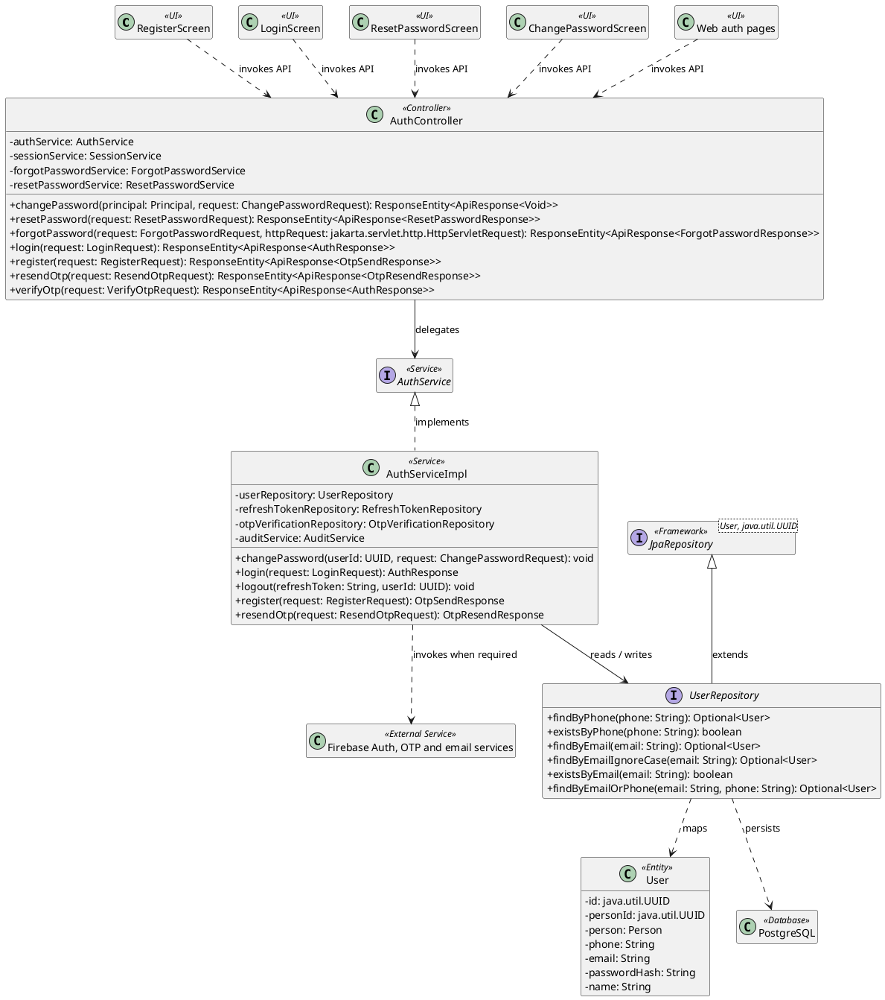

# MF-01 / Spec 01 — Account Registration and Authentication Lifecycle

| Field | Value |
| --- | --- |
| Status | Draft |
| Use Cases Covered | UC-01 Register Account; UC-02 Login; UC-03 Logout; UC-04 Reset Password; UC-05 Change Password |
| Use Case Group | Shared / Common |
| Platform | Mobile App; Web App; Backend |
| Primary Actors | Guest / Authenticated User |
| In Scope | Credential lifecycle including OTP as an embedded registration/reset step |
| Explicitly Excluded | Linked-account management as a separate product goal; community identity |
| Implementation Trace | UI: RegisterScreen, LoginScreen, ResetPasswordScreen, ChangePasswordScreen, Web auth pages; Controller: AuthController; Service: AuthServiceImpl; Repository: UserRepository; Entity: User |

## 1. Tổng quan luồng chính (Main Flow Overview)

Credential lifecycle including OTP as an embedded registration/reset step. The flow starts only from the reachable UI or system trigger named in the metadata. The Backend rechecks authentication, role, ownership, membership, consent and current state as applicable; client-side visibility alone never grants access. A confirmed mutation is persisted before the UI displays success. External-service failure returns a safe retry state and must not fabricate completion.

## 2. Class Diagram



**Figure 1 — Class Diagram: Account Registration and Authentication Lifecycle**

## 3. Sequence Diagram — Main Flow

```plantuml
@startuml MF01_01_AccountRegistrationandAuthenticationLifecycle_SequenceDiagram
skinparam shadowing false

actor "Guest / Authenticated User" as Actor
boundary "Web / Mobile Authentication UI" as UI
control "AuthController" as Controller
participant ":AuthServiceImpl" as AuthService <<service>>
participant ":FederatedAuthServiceImpl" as FederatedService <<service>>
participant ":SessionService" as SessionService <<service>>
participant ":ForgotPasswordServiceImpl" as ForgotService <<service>>
participant ":ResetPasswordServiceImpl" as ResetService <<service>>
participant ":PasswordComplexityPolicy" as PasswordPolicy <<service>>
participant ":AuditService" as Audit <<service>>
participant ":UserRepository" as UserRepo <<repository>>
participant ":OtpVerificationRepository" as OtpRepo <<repository>>
participant ":PasswordResetTokenRepository" as ResetTokenRepo <<repository>>
participant ":RefreshTokenRepository" as RefreshRepo <<repository>>
participant ":UserSessionRepository" as SessionRepo <<repository>>
database "PostgreSQL" as DB
participant ":EmailService / SmsService" as Messaging <<external system>>
participant ":Firebase Auth" as Firebase <<external system>>

group UC-01 Register Account
  Actor -> UI : 1. submitRegistration(contact, password, role)
  activate UI
  UI -> Controller : 2. POST /api/v1/auth/register
  activate Controller
  Controller -> AuthService : 3. register(request)
  activate AuthService
  AuthService -> PasswordPolicy : 4. isComplexEnough(password)
  activate PasswordPolicy
  PasswordPolicy --> AuthService : 5. passwordPolicyResult
  deactivate PasswordPolicy
  AuthService -> UserRepo : 6. existsByEmail(email) / existsByPhone(phone)
  activate UserRepo
  UserRepo -> DB : 7. SELECT account by normalized contact
  activate DB
  DB --> UserRepo : 8. accountLookupResult
  deactivate DB
  UserRepo --> AuthService : 9. duplicateExists
  deactivate UserRepo
  alt [contact is already registered or input is invalid]
    AuthService --> Controller : 9a. validation or conflict error
    deactivate AuthService
    Controller --> UI : 9a-1. 400 Bad Request / 409 Conflict
    deactivate Controller
    UI --> Actor : 9a-2. displayRegistrationError()
    deactivate UI
  else [registration data is valid]
    AuthService -> AuthService : 9b. encodePasswordAndBuildPendingUser()
    activate AuthService
    AuthService --> AuthService : 9b-1. pendingUser
    deactivate AuthService
    AuthService -> UserRepo : 9b-2. save(pendingUser)
    activate UserRepo
    UserRepo -> DB : 9b-3. INSERT user with PENDING_ACTIVATION
    activate DB
    DB --> UserRepo : 9b-4. savedUser
    deactivate DB
    UserRepo --> AuthService : 9b-5. savedUser
    deactivate UserRepo
    AuthService -> AuthService : 9b-6. generateAndHashOtp()
    activate AuthService
    AuthService --> AuthService : 9b-7. otpAndHash
    deactivate AuthService
    AuthService -> OtpRepo : 9b-8. save(registrationOtp)
    activate OtpRepo
    OtpRepo -> DB : 9b-9. INSERT otp_verification
    activate DB
    DB --> OtpRepo : 9b-10. savedOtp
    deactivate DB
    OtpRepo --> AuthService : 9b-11. savedOtp
    deactivate OtpRepo
    AuthService -> Messaging : 9b-12. sendOtp(contact, otp, expiresIn)
    activate Messaging
    Messaging --> AuthService : 9b-13. deliveryAccepted
    deactivate Messaging
    AuthService -> Audit : 9b-14. log(OTP_SENT)
    activate Audit
    Audit --> AuthService : 9b-15. auditRecorded
    deactivate Audit
    AuthService --> Controller : 9b-16. OtpSendResponse
    deactivate AuthService
    Controller --> UI : 9b-17. 201 Created
    deactivate Controller
    UI --> Actor : 9b-18. showOtpVerificationStep()
    deactivate UI
  end

  Actor -> UI : 10. submitRegistrationOtp(contact, otp)
  activate UI
  UI -> Controller : 11. POST /api/v1/auth/verify-otp
  activate Controller
  Controller -> AuthService : 12. verifyOtp(request)
  activate AuthService
  AuthService -> OtpRepo : 13. findLatestUnusedOtp(contact)
  activate OtpRepo
  OtpRepo -> DB : 14. SELECT latest unconsumed OTP
  activate DB
  DB --> OtpRepo : 15. otpVerification
  deactivate DB
  OtpRepo --> AuthService : 16. otpVerification
  deactivate OtpRepo
  AuthService -> AuthService : 17. validateExpiryAttemptsAndHash()
  activate AuthService
  AuthService --> AuthService : 18. verificationResult
  deactivate AuthService
  alt [OTP is invalid, expired, used or exhausted]
    AuthService --> Controller : 18a. OTP validation error
    deactivate AuthService
    Controller --> UI : 18a-1. 400 Bad Request
    deactivate Controller
    UI --> Actor : 18a-2. displayOtpErrorOrResendAction()
    deactivate UI
  else [OTP is valid]
    AuthService -> UserRepo : 18b. activateUserAndSave()
    activate UserRepo
    UserRepo -> DB : 18b-1. UPDATE user SET account_status = ACTIVE
    activate DB
    DB --> UserRepo : 18b-2. activatedUser
    deactivate DB
    UserRepo --> AuthService : 18b-3. activatedUser
    deactivate UserRepo
    AuthService -> OtpRepo : 18b-4. markVerifiedAndUsed(otpId, now)
    activate OtpRepo
    OtpRepo -> DB : 18b-5. UPDATE otp_verification used_at
    activate DB
    DB --> OtpRepo : 18b-6. otpConsumed
    deactivate DB
    OtpRepo --> AuthService : 18b-7. otpConsumed
    deactivate OtpRepo
    AuthService -> RefreshRepo : 18b-8. save(refreshToken)
    activate RefreshRepo
    RefreshRepo -> DB : 18b-9. INSERT refresh_token
    activate DB
    DB --> RefreshRepo : 18b-10. savedRefreshToken
    deactivate DB
    RefreshRepo --> AuthService : 18b-11. savedRefreshToken
    deactivate RefreshRepo
    AuthService -> SessionRepo : 18b-12. save(activatedSession)
    activate SessionRepo
    SessionRepo -> DB : 18b-13. INSERT user_session
    activate DB
    DB --> SessionRepo : 18b-14. savedSession
    deactivate DB
    SessionRepo --> AuthService : 18b-15. savedSession
    deactivate SessionRepo
    AuthService -> Audit : 18b-16. log(OTP_VERIFIED, REGISTRATION_COMPLETED)
    activate Audit
    Audit --> AuthService : 18b-17. auditRecorded
    deactivate Audit
    AuthService --> Controller : 18b-18. AuthResponse(accessToken, refreshToken)
    deactivate AuthService
    Controller --> UI : 18b-19. 200 OK
    deactivate Controller
    UI --> Actor : 18b-20. enterRoleAppropriateWorkspace()
    deactivate UI
  end
end

group UC-02 Login
  Actor -> UI : 19. submitLogin(method, credentials)
  activate UI
  alt [email or phone with password]
    UI -> Controller : 19a. POST /api/v1/auth/login
    activate Controller
    Controller -> AuthService : 19a-1. login(request)
    activate AuthService
    AuthService -> UserRepo : 19a-2. findByEmailOrPhone(normalizedIdentifier)
    activate UserRepo
    UserRepo -> DB : 19a-3. SELECT user account
    activate DB
    DB --> UserRepo : 19a-4. user
    deactivate DB
    UserRepo --> AuthService : 19a-5. user
    deactivate UserRepo
    AuthService -> AuthService : 19a-6. verifyPasswordAndAccountPolicy()
    activate AuthService
    AuthService --> AuthService : 19a-7. authenticationAccepted
    deactivate AuthService
    AuthService -> UserRepo : 19a-8. save(lastLoginAt, lockState)
    activate UserRepo
    UserRepo -> DB : 19a-9. UPDATE user login state
    activate DB
    DB --> UserRepo : 19a-10. updatedUser
    deactivate DB
    UserRepo --> AuthService : 19a-11. updatedUser
    deactivate UserRepo
    AuthService -> RefreshRepo : 19a-12. save(refreshToken)
    activate RefreshRepo
    RefreshRepo -> DB : 19a-13. INSERT refresh_token
    activate DB
    DB --> RefreshRepo : 19a-14. savedRefreshToken
    deactivate DB
    RefreshRepo --> AuthService : 19a-15. savedRefreshToken
    deactivate RefreshRepo
    AuthService -> SessionRepo : 19a-16. save(currentSession)
    activate SessionRepo
    SessionRepo -> DB : 19a-17. INSERT user_session
    activate DB
    DB --> SessionRepo : 19a-18. savedSession
    deactivate DB
    SessionRepo --> AuthService : 19a-19. savedSession
    deactivate SessionRepo
    AuthService -> Audit : 19a-20. log(LOGIN)
    activate Audit
    Audit --> AuthService : 19a-21. auditRecorded
    deactivate Audit
    AuthService --> Controller : 19a-22. AuthResponse(tokens, user)
    deactivate AuthService
  else [Google login]
    UI -> Firebase : 19b. authenticateWithGoogle()
    activate Firebase
    Firebase --> UI : 19b-1. Firebase ID token
    deactivate Firebase
    UI -> Controller : 19b-2. POST /api/v1/auth/federated
    activate Controller
    Controller -> FederatedService : 19b-3. authenticate(request)
    activate FederatedService
    FederatedService -> Firebase : 19b-4. verifyIdToken(idToken)
    activate Firebase
    Firebase --> FederatedService : 19b-5. verifiedIdentity
    deactivate Firebase
    FederatedService -> UserRepo : 19b-6. findOrCreateSupportedUser(identity)
    activate UserRepo
    UserRepo -> DB : 19b-7. SELECT / INSERT user and identity
    activate DB
    DB --> UserRepo : 19b-8. authenticatedUser
    deactivate DB
    UserRepo --> FederatedService : 19b-9. authenticatedUser
    deactivate UserRepo
    FederatedService -> SessionRepo : 19b-10. save(currentSession)
    activate SessionRepo
    SessionRepo -> DB : 19b-11. INSERT user_session
    activate DB
    DB --> SessionRepo : 19b-12. savedSession
    deactivate DB
    SessionRepo --> FederatedService : 19b-13. savedSession
    deactivate SessionRepo
    FederatedService --> Controller : 19b-14. FederatedAuthResponse
    deactivate FederatedService
  end
  Controller --> UI : 20. 200 OK
  deactivate Controller
  UI --> Actor : 21. enterRoleAppropriateWorkspace()
  deactivate UI
end

group UC-03 Logout
  Actor -> UI : 22. confirmLogout()
  activate UI
  UI -> Controller : 23. POST /api/v1/auth/logout
  activate Controller
  Controller -> SessionService : 24. logout(refreshToken, userId, ipAddress)
  activate SessionService
  SessionService -> SessionRepo : 25. revokeCurrentSession(tokenHash, userId)
  activate SessionRepo
  SessionRepo -> DB : 26. UPDATE user_session SET revoked = true
  activate DB
  DB --> SessionRepo : 27. sessionRevoked
  deactivate DB
  SessionRepo --> SessionService : 28. sessionRevoked
  deactivate SessionRepo
  SessionService -> RefreshRepo : 29. revokeCurrentRefreshToken()
  activate RefreshRepo
  RefreshRepo -> DB : 30. UPDATE refresh_token SET revoked = true
  activate DB
  DB --> RefreshRepo : 31. tokenRevoked
  deactivate DB
  RefreshRepo --> SessionService : 32. tokenRevoked
  deactivate RefreshRepo
  SessionService -> Audit : 33. log(LOGOUT)
  activate Audit
  Audit --> SessionService : 34. auditRecorded
  deactivate Audit
  SessionService --> Controller : 35. logoutCompleted
  deactivate SessionService
  Controller --> UI : 36. 200 OK
  deactivate Controller
  UI --> Actor : 37. returnToLoginScreen()
  deactivate UI
end

group UC-04 Reset Password
  Actor -> UI : 38. requestPasswordReset(contact)
  activate UI
  UI -> Controller : 39. POST /api/v1/auth/forgot-password
  activate Controller
  Controller -> ForgotService : 40. forgotPassword(request, ipAddress)
  activate ForgotService
  ForgotService -> UserRepo : 41. findByRegisteredContact(contact)
  activate UserRepo
  UserRepo -> DB : 42. SELECT active user by contact
  activate DB
  DB --> UserRepo : 43. userOrEmpty
  deactivate DB
  UserRepo --> ForgotService : 44. userOrEmpty
  deactivate UserRepo
  opt [active account exists]
    ForgotService -> ResetTokenRepo : 44a. save(passwordResetToken)
    activate ResetTokenRepo
    ResetTokenRepo -> DB : 44a-1. INSERT password_reset_token
    activate DB
    DB --> ResetTokenRepo : 44a-2. savedToken
    deactivate DB
    ResetTokenRepo --> ForgotService : 44a-3. savedToken
    deactivate ResetTokenRepo
    ForgotService -> Messaging : 44a-4. sendResetInstruction(rawToken)
    activate Messaging
    Messaging --> ForgotService : 44a-5. deliveryAccepted
    deactivate Messaging
    ForgotService -> Audit : 44a-6. log(PASSWORD_RESET_REQUESTED)
    activate Audit
    Audit --> ForgotService : 44a-7. auditRecorded
    deactivate Audit
  end
  ForgotService --> Controller : 45. antiEnumerationResponse
  deactivate ForgotService
  Controller --> UI : 46. 200 OK
  deactivate Controller
  UI --> Actor : 47. displayGenericResetInstruction()
  deactivate UI

  Actor -> UI : 48. submitResetTokenAndNewPassword()
  activate UI
  UI -> Controller : 49. POST /api/v1/auth/reset-password
  activate Controller
  Controller -> ResetService : 50. resetPassword(request)
  activate ResetService
  ResetService -> PasswordPolicy : 51. isComplexEnough(newPassword)
  activate PasswordPolicy
  PasswordPolicy --> ResetService : 52. passwordPolicyResult
  deactivate PasswordPolicy
  ResetService -> ForgotService : 53. validateToken(rawToken)
  activate ForgotService
  ForgotService -> ResetTokenRepo : 54. findValidUnusedToken(tokenHash, now)
  activate ResetTokenRepo
  ResetTokenRepo -> DB : 55. SELECT valid password_reset_token
  activate DB
  DB --> ResetTokenRepo : 56. resetToken
  deactivate DB
  ResetTokenRepo --> ForgotService : 57. resetToken
  deactivate ResetTokenRepo
  ForgotService --> ResetService : 58. user
  deactivate ForgotService
  ResetService -> UserRepo : 59. save(newPasswordHash)
  activate UserRepo
  UserRepo -> DB : 60. UPDATE user password_hash
  activate DB
  DB --> UserRepo : 61. passwordUpdated
  deactivate DB
  UserRepo --> ResetService : 62. passwordUpdated
  deactivate UserRepo
  ResetService -> RefreshRepo : 63. revokeAllByUserId(userId)
  activate RefreshRepo
  RefreshRepo -> DB : 64. UPDATE active refresh tokens
  activate DB
  DB --> RefreshRepo : 65. revokedCount
  deactivate DB
  RefreshRepo --> ResetService : 66. revokedCount
  deactivate RefreshRepo
  ResetService -> ForgotService : 67. consumeToken(rawToken)
  activate ForgotService
  ForgotService -> ResetTokenRepo : 68. markAsUsed(tokenHash, now)
  activate ResetTokenRepo
  ResetTokenRepo -> DB : 69. UPDATE password_reset_token used_at
  activate DB
  DB --> ResetTokenRepo : 70. tokenConsumed
  deactivate DB
  ResetTokenRepo --> ForgotService : 71. tokenConsumed
  deactivate ResetTokenRepo
  ForgotService --> ResetService : 72. tokenConsumed
  deactivate ForgotService
  ResetService -> Audit : 73. log(PASSWORD_RESET_COMPLETED)
  activate Audit
  Audit --> ResetService : 74. auditRecorded
  deactivate Audit
  ResetService --> Controller : 75. ResetPasswordResponse
  deactivate ResetService
  Controller --> UI : 76. 200 OK
  deactivate Controller
  UI --> Actor : 77. promptLoginWithNewPassword()
  deactivate UI
end

group UC-05 Change Password
  Actor -> UI : 78. submitCurrentAndNewPassword()
  activate UI
  UI -> Controller : 79. PUT /api/v1/auth/change-password
  activate Controller
  Controller -> AuthService : 80. changePassword(userId, request)
  activate AuthService
  AuthService -> UserRepo : 81. findById(userId)
  activate UserRepo
  UserRepo -> DB : 82. SELECT authenticated user
  activate DB
  DB --> UserRepo : 83. user
  deactivate DB
  UserRepo --> AuthService : 84. user
  deactivate UserRepo
  AuthService -> AuthService : 85. verifyCurrentPasswordAndConfirmation()
  activate AuthService
  AuthService --> AuthService : 86. localValidationResult
  deactivate AuthService
  AuthService -> PasswordPolicy : 87. isComplexEnough(newPassword)
  activate PasswordPolicy
  PasswordPolicy --> AuthService : 88. passwordPolicyResult
  deactivate PasswordPolicy
  alt [current password or policy validation fails]
    AuthService --> Controller : 88a. AUTH-071 / AUTH-072 / AUTH-073 / AUTH-074
    deactivate AuthService
    Controller --> UI : 88a-1. 400 Bad Request
    deactivate Controller
    UI --> Actor : 88a-2. displayPasswordValidationError()
    deactivate UI
  else [new password is valid]
    AuthService -> UserRepo : 88b. save(newPasswordHash)
    activate UserRepo
    UserRepo -> DB : 88b-1. UPDATE user password_hash
    activate DB
    DB --> UserRepo : 88b-2. passwordUpdated
    deactivate DB
    UserRepo --> AuthService : 88b-3. passwordUpdated
    deactivate UserRepo
    AuthService -> RefreshRepo : 88b-4. revokeAllActiveTokens(userId)
    activate RefreshRepo
    RefreshRepo -> DB : 88b-5. UPDATE refresh tokens SET revoked = true
    activate DB
    DB --> RefreshRepo : 88b-6. tokensRevoked
    deactivate DB
    RefreshRepo --> AuthService : 88b-7. tokensRevoked
    deactivate RefreshRepo
    AuthService -> Audit : 88b-8. log(PASSWORD_CHANGED)
    activate Audit
    Audit --> AuthService : 88b-9. auditRecorded
    deactivate Audit
    AuthService --> Controller : 88b-10. passwordChanged
    deactivate AuthService
    Controller --> UI : 88b-11. 200 OK
    deactivate Controller
    UI --> Actor : 88b-12. requireLoginAgain()
    deactivate UI
  end
end
@enduml
```

**Figure 2 — Sequence Diagram: Account Registration and Authentication Lifecycle Main Flow**

**Brief Explanation:**

1. UC-01 creates a pending account, persists and delivers an OTP, then activates the account only after the latest valid OTP is verified.
2. UC-02 supports credential login and Google login as branches of the same use case; both create an authenticated session and return the role-aware user state.
3. UC-03 revokes the current session and refresh token before the client returns to the login screen.
4. UC-04 uses an anti-enumeration reset request, a single-use time-limited token, password-policy validation, token consumption and session revocation.
5. UC-05 verifies the current password and new-password policy, persists the new hash, revokes active refresh tokens and requires the user to log in again.
6. Validation, policy and account-state failures return explicit safe errors without recording a successful transition.

## 4. Business Rules Applied

- Access is enforced server-side using the current actor, role, ownership, membership and consent scope.
- Credential lifecycle including OTP as an embedded registration/reset step.
- The following remains outside this contract: Linked-account management as a separate product goal; community identity.
- Retries must not duplicate confirmed records, transitions, notifications or external side effects.
- Sensitive health, identity, moderation, location and safety operations retain the minimum required audit evidence.
