# MF-01 / Spec 03 — Admin Account Governance, Security and Configuration

| Field | Value |
| --- | --- |
| Status | Draft |
| Use Cases Covered | UC-69 View Admin Dashboard; UC-70 Manage User Accounts and Roles; UC-71 Create Staff Account; UC-72 Review Account Lock Appeals; UC-73 Review Audit and Security Operations; UC-74 Manage System Configuration |
| Use Case Group | Web App |
| Platform | Admin Web; Backend |
| Primary Actors | System Admin |
| In Scope | Reachable System Admin workspaces and their current APIs |
| Explicitly Excluded | Partner administration and any unreachable legacy page |
| Implementation Trace | UI: AdminDashboardPage, UserListPage, UserDetailPage, AccountLockAppealsPage, SecurityEventsPage, SystemConfigurationPage; Controller: AdminUserController, AdminRoleController, AdminAccountLockAppealController; Service: AdminUserServiceImpl, AccountLockAppealServiceImpl, SystemConfigurationServiceImpl; Repository: UserRepository, AccountLockAppealRepository, AuditLogRepository; Entity: User, AccountLockAppeal, AuditLog |

## 1. Tổng quan luồng chính (Main Flow Overview)

Reachable System Admin workspaces and their current APIs. The flow starts only from the reachable UI or system trigger named in the metadata. The Backend rechecks authentication, role, ownership, membership, consent and current state as applicable; client-side visibility alone never grants access. A confirmed mutation is persisted before the UI displays success. External-service failure returns a safe retry state and must not fabricate completion.

## 2. Class Diagram

```plantuml
@startuml MF01_03_AdminAccountGovernanceSecurityandConfiguration_ClassDiagram
skinparam classAttributeIconSize 0
hide empty members

class "AdminDashboardPage" as UI1 <<UI>>
class "UserListPage" as UI2 <<UI>>
class "UserDetailPage" as UI3 <<UI>>
class "AccountLockAppealsPage" as UI4 <<UI>>
class "SecurityEventsPage" as UI5 <<UI>>
class "SystemConfigurationPage" as UI6 <<UI>>
class "AdminUserController" as Controller1 <<Controller>> {
  - adminUserService: AdminUserService
  + getUser(userId: UUID): ResponseEntity<ApiResponse<AdminUserSummaryResponse>>
  + updateStatus(userId: UUID, request: UpdateUserStatusRequest, principal: Principal): ResponseEntity<ApiResponse<AdminUserSummaryResponse>>
}
class "AdminRoleController" as Controller2 <<Controller>> {
  - adminRoleService: AdminRoleService
  + updateRole(userId: UUID, request: UpdateUserRoleRequest, principal: Principal): ResponseEntity<ApiResponse<UserRoleResponse>>
}
class "AdminAccountLockAppealController" as Controller3 <<Controller>> {
  - appealService: AccountLockAppealService
  + review(appealId: UUID, request: ReviewAccountLockAppealRequest, principal: Principal): ResponseEntity<ApiResponse<AccountLockAppealResponse>>
  + get(appealId: UUID): ResponseEntity<ApiResponse<AccountLockAppealResponse>>
}
class "AdminUserServiceImpl" as Service1 <<Service>> {
  - userRepository: UserRepository
  - auditService: AuditService
  - adminUserMapper: AdminUserMapper
  - monitoringRepository: AdminUserMonitoringRepository
  + getUser(userId: UUID): AdminUserSummaryResponse
  + getUserActivity(userId: UUID, pageable: Pageable): Page<AdminUserActivityResponse>
  + getUserSessions(userId: UUID, pageable: Pageable): Page<AdminUserSessionResponse>
  + updateStatus(callerUserId: UUID, targetUserId: UUID, request: UpdateUserStatusRequest): AdminUserSummaryResponse
  - requireUserExists(userId: UUID): void
}
class "AccountLockAppealServiceImpl" as Service2 <<Service>> {
  - appealRepository: AccountLockAppealRepository
  - userRepository: UserRepository
  - jwtTokenProvider: JwtTokenProvider
  - auditService: AuditService
  + review(reviewerId: UUID, appealId: UUID, request: ReviewAccountLockAppealRequest): AccountLockAppealResponse
  - clearLock(user: User): void
  + get(appealId: UUID): AccountLockAppealResponse
  + list(status: AccountLockAppealStatus, pageable: Pageable): Page<AccountLockAppealResponse>
  + submit(request: SubmitAccountLockAppealRequest): AccountLockAppealResponse
}
class "SystemConfigurationServiceImpl" as Service3 <<Service>> {
  - repository: SystemConfigurationRepository
  - auditService: AuditService
  - maintenanceModeService: SystemMaintenanceModeService
  - configurationConflict(): BusinessException
  + afterCommit(): void
  + get(actorId: UUID): SystemConfigurationResponse
  + update(request: UpdateSystemConfigurationRequest, actorId: UUID): SystemConfigurationResponse
  - getOrCreateDefault(actorId: UUID): SystemConfiguration
}
interface "AdminUserService" as Service1Contract <<Service>>
interface "AccountLockAppealService" as Service2Contract <<Service>>
interface "SystemConfigurationService" as Service3Contract <<Service>>
interface "UserRepository" as Repository1 {
  + findByPhone(phone: String): Optional<User>
  + existsByPhone(phone: String): boolean
  + findByEmail(email: String): Optional<User>
  + findByEmailIgnoreCase(email: String): Optional<User>
  + existsByEmail(email: String): boolean
  + findByEmailOrPhone(email: String, phone: String): Optional<User>
}
interface "AccountLockAppealRepository" as Repository2 {
  + findByStatusOrderBySubmittedAtDesc(status: AccountLockAppealStatus, pageable: Pageable): Page<AccountLockAppeal>
  + findByIdAndStatus(id: UUID, status: AccountLockAppealStatus): Optional<AccountLockAppeal>
  + existsByUserIdAndLockEpisodeIdAndStatus(userId: UUID, lockEpisodeId: UUID, status: AccountLockAppealStatus): boolean
  + existsByUserIdAndLockEpisodeId(userId: UUID, lockEpisodeId: UUID): boolean
  + findTopByUserIdAndLockEpisodeIdOrderBySubmittedAtDesc(userId: UUID, lockEpisodeId: UUID): Optional<AccountLockAppeal>
}
interface "AuditLogRepository" as Repository3 {
  + findByEntityIdAndAction(entityId: java.util.UUID, action: AuditAction): List<AuditLog>
  + findByEntityIdAndEntityTypeAndActionInOrderByCreatedAtDesc(entityId: java.util.UUID, entityType: String, actions: Collection<AuditAction>): List<AuditLog>
}
class "User" as Entity1 <<Entity>> {
  - id: java.util.UUID
  - personId: java.util.UUID
  - person: Person
  - phone: String
  - email: String
  - passwordHash: String
  - name: String
}
class "AccountLockAppeal" as Entity2 <<Entity>> {
  - id: UUID
  - userId: UUID
  - lockEpisodeId: UUID
  - reason: String
  - status: AccountLockAppealStatus
  - submittedAt: Instant
  - reviewedBy: UUID
}
class "AuditLog" as Entity3 <<Entity>> {
  - auditLogId: java.util.UUID
  - createdAt: Instant
  - actorUserId: java.util.UUID
  - actorType: String
  - actorService: String
  - subjectUserId: java.util.UUID
  - action: AuditAction
}
interface "JpaRepository<User, java.util.UUID>" as Repository1Base <<Framework>>
interface "JpaRepository<AccountLockAppeal, UUID>" as Repository2Base <<Framework>>
interface "JpaRepository<AuditLog, java.util.UUID>" as Repository3Base <<Framework>>
class "PostgreSQL" as DB <<Database>>

Service1Contract <|.. Service1 : implements
Service2Contract <|.. Service2 : implements
Service3Contract <|.. Service3 : implements
Repository1Base <|-- Repository1 : extends
Repository2Base <|-- Repository2 : extends
Repository3Base <|-- Repository3 : extends
UI1 ..> Controller1 : invokes API
UI2 ..> Controller2 : invokes API
UI3 ..> Controller3 : invokes API
UI4 ..> Controller3 : invokes API
UI5 ..> Controller3 : invokes API
UI6 ..> Controller3 : invokes API
Controller1 --> Service1Contract : delegates
Controller2 --> Service2Contract : delegates
Controller3 --> Service3Contract : delegates
Service1 --> Repository1 : reads / writes
Service2 --> Repository2 : reads / writes
Service3 --> Repository3 : reads / writes
Repository1 ..> Entity1 : maps
Repository1 ..> DB : persists
Repository2 ..> Entity2 : maps
Repository2 ..> DB : persists
Repository3 ..> Entity3 : maps
Repository3 ..> DB : persists
@enduml
```

**Figure 1 — Class Diagram: Admin Account Governance, Security and Configuration**

## 3. Sequence Diagram — Main Flow

```plantuml
@startuml MF01_03_AdminAccountGovernanceSecurityandConfiguration_SequenceDiagram
skinparam shadowing false

actor "System Admin" as Actor
boundary ":AdminDashboardPage" as UI1
boundary ":UserListPage" as UI2
boundary ":AccountLockAppealsPage" as UI3
boundary ":SecurityEventsPage" as UI4
boundary ":SystemConfigurationPage" as UI5
control ":AdminUserController" as Controller1
control ":AdminStaffController" as Controller2
control ":AdminAccountLockAppealController" as Controller3
control ":AuditController" as Controller4
control ":SystemConfigurationController" as Controller5
participant ":AdminUserServiceImpl" as Service1 <<service>>
participant ":AdminStaffServiceImpl" as Service2 <<service>>
participant ":AccountLockAppealServiceImpl" as Service3 <<service>>
participant ":AuditServiceImpl" as Service4 <<service>>
participant ":SystemConfigurationServiceImpl" as Service5 <<service>>
participant ":UserRepository" as Repository1 <<repository>>
participant ":AccountLockAppealRepository" as Repository2 <<repository>>
participant ":AuditLogRepository" as Repository3 <<repository>>
participant ":SystemConfigurationRepository" as Repository4 <<repository>>
database "PostgreSQL" as DB

group UC-69 View Admin Dashboard
  Actor -> UI1 : 1. startViewAdminDashboard()
  activate UI1
  UI1 -> Controller1 : 2. searchUsers(query, pageable)
  activate Controller1
  Controller1 -> Service1 : 3. searchUsers(query, pageable)
  activate Service1
  alt [request is authorized and input is valid]
    Service1 -> Repository1 : 4a. findAll(specification, pageable)
    activate Repository1
    Repository1 -> DB : 4a-1. SELECT
    activate DB
    DB --> Repository1 : 4a-2. queryResult
    deactivate DB
    Repository1 --> Service1 : 4a-3. domainRecords
    deactivate Repository1
    Service1 --> Controller1 : 4a-4. resultDTO
    deactivate Service1
    Controller1 --> UI1 : 4a-5. 200 OK
    deactivate Controller1
    UI1 --> Actor : 4a-6. displayViewAdminDashboardResult()
    deactivate UI1
  else [request is invalid, forbidden or unavailable]
    Service1 --> Controller1 : 4b. domainError
    deactivate Service1
    Controller1 --> UI1 : 4b-1. 400 / 401 / 403 / 404
    deactivate Controller1
    UI1 --> Actor : 4b-2. displayActionableError()
    deactivate UI1
  end
end

group UC-70 Manage User Accounts and Roles
  Actor -> UI2 : 5. startManageUserAccountsAndRoles()
  activate UI2
  UI2 -> Controller1 : 6. searchUsers() / updateStatus()
  activate Controller1
  Controller1 -> Service1 : 7. searchUsers() / updateStatus()
  activate Service1
  alt [selected action is view or list]
    Service1 -> Repository1 : 8a. findById()
    activate Repository1
    Repository1 -> DB : 8a-1. SELECT
    activate DB
    DB --> Repository1 : 8a-2. queryResult
    deactivate DB
    Repository1 --> Service1 : 8a-3. domainRecords
    deactivate Repository1
    Service1 --> Controller1 : 8a-4. resultDTO
    deactivate Service1
    Controller1 --> UI2 : 8a-5. 200 OK
    deactivate Controller1
    UI2 --> Actor : 8a-6. displayCurrentState()
    deactivate UI2
  else [selected action creates, updates, archives or deletes]
    Service1 -> Repository1 : 8b. findById()
    activate Repository1
    Repository1 -> DB : 8b-1. SELECT
    activate DB
    DB --> Repository1 : 8b-2. currentState
    deactivate DB
    Repository1 --> Service1 : 8b-3. scopedEntity
    deactivate Repository1
    Service1 -> Repository1 : 8b-4. save()
    activate Repository1
    Repository1 -> DB : 8b-5. INSERT / UPDATE
    activate DB
    DB --> Repository1 : 8b-6. persistedState
    deactivate DB
    Repository1 --> Service1 : 8b-7. persistedEntity
    deactivate Repository1
    Service1 --> Controller1 : 8b-8. resultDTO
    deactivate Service1
    Controller1 --> UI2 : 8b-9. 200 OK / 201 Created
    deactivate Controller1
    UI2 --> Actor : 8b-10. displayConfirmedState()
    deactivate UI2
  else [request is invalid, forbidden, not found or conflicting]
    Service1 --> Controller1 : 8c. domainError
    deactivate Service1
    Controller1 --> UI2 : 8c-1. 400 / 401 / 403 / 404 / 409
    deactivate Controller1
    UI2 --> Actor : 8c-2. displayActionableError()
    deactivate UI2
  end
end

group UC-71 Create Staff Account
  Actor -> UI2 : 9. startCreateStaffAccount()
  activate UI2
  UI2 -> Controller2 : 10. createStaffAccount(request)
  activate Controller2
  Controller2 -> Service2 : 11. createStaffAccount(request)
  activate Service2
  alt [command is valid and actor is authorized]
    Service2 -> Repository1 : 12a. save(staffUser)
    activate Repository1
    Repository1 -> DB : 12a-1. INSERT / UPDATE
    activate DB
    DB --> Repository1 : 12a-2. persistedState
    deactivate DB
    Repository1 --> Service2 : 12a-3. savedEntity
    deactivate Repository1
    Service2 --> Controller2 : 12a-4. resultDTO
    deactivate Service2
    Controller2 --> UI2 : 12a-5. 200 OK / 201 Created
    deactivate Controller2
    UI2 --> Actor : 12a-6. displayConfirmedState()
    deactivate UI2
  else [validation, authorization or state check fails]
    Service2 --> Controller2 : 12b. domainError
    deactivate Service2
    Controller2 --> UI2 : 12b-1. 400 / 401 / 403 / 404 / 409
    deactivate Controller2
    UI2 --> Actor : 12b-2. displayActionableError()
    deactivate UI2
  end
end

group UC-72 Review Account Lock Appeals
  Actor -> UI3 : 13. startReviewAccountLockAppeals()
  activate UI3
  UI3 -> Controller3 : 14. list(status) / review(appealId, decision)
  activate Controller3
  Controller3 -> Service3 : 15. list(status) / review(appealId, decision)
  activate Service3
  alt [selected action is view or list]
    Service3 -> Repository2 : 16a. findByStatusOrderBySubmittedAtDesc() / findByIdAndStatus()
    activate Repository2
    Repository2 -> DB : 16a-1. SELECT
    activate DB
    DB --> Repository2 : 16a-2. queryResult
    deactivate DB
    Repository2 --> Service3 : 16a-3. domainRecords
    deactivate Repository2
    Service3 --> Controller3 : 16a-4. resultDTO
    deactivate Service3
    Controller3 --> UI3 : 16a-5. 200 OK
    deactivate Controller3
    UI3 --> Actor : 16a-6. displayCurrentState()
    deactivate UI3
  else [selected action creates, updates, archives or deletes]
    Service3 -> Repository2 : 16b. findByStatusOrderBySubmittedAtDesc() / findByIdAndStatus()
    activate Repository2
    Repository2 -> DB : 16b-1. SELECT
    activate DB
    DB --> Repository2 : 16b-2. currentState
    deactivate DB
    Repository2 --> Service3 : 16b-3. scopedEntity
    deactivate Repository2
    Service3 -> Repository2 : 16b-4. save()
    activate Repository2
    Repository2 -> DB : 16b-5. INSERT / UPDATE
    activate DB
    DB --> Repository2 : 16b-6. persistedState
    deactivate DB
    Repository2 --> Service3 : 16b-7. persistedEntity
    deactivate Repository2
    Service3 --> Controller3 : 16b-8. resultDTO
    deactivate Service3
    Controller3 --> UI3 : 16b-9. 200 OK / 201 Created
    deactivate Controller3
    UI3 --> Actor : 16b-10. displayConfirmedState()
    deactivate UI3
  else [request is invalid, forbidden, not found or conflicting]
    Service3 --> Controller3 : 16c. domainError
    deactivate Service3
    Controller3 --> UI3 : 16c-1. 400 / 401 / 403 / 404 / 409
    deactivate Controller3
    UI3 --> Actor : 16c-2. displayActionableError()
    deactivate UI3
  end
end

group UC-73 Review Audit and Security Operations
  Actor -> UI4 : 17. startReviewAuditAndSecurityOperations()
  activate UI4
  UI4 -> Controller4 : 18. search(filters)
  activate Controller4
  Controller4 -> Service4 : 19. search(filters)
  activate Service4
  alt [request is authorized and input is valid]
    Service4 -> Repository3 : 20a. findByEntityIdAndAction()
    activate Repository3
    Repository3 -> DB : 20a-1. SELECT
    activate DB
    DB --> Repository3 : 20a-2. queryResult
    deactivate DB
    Repository3 --> Service4 : 20a-3. domainRecords
    deactivate Repository3
    Service4 --> Controller4 : 20a-4. resultDTO
    deactivate Service4
    Controller4 --> UI4 : 20a-5. 200 OK
    deactivate Controller4
    UI4 --> Actor : 20a-6. displayReviewAuditAndSecurityOperationsResult()
    deactivate UI4
  else [request is invalid, forbidden or unavailable]
    Service4 --> Controller4 : 20b. domainError
    deactivate Service4
    Controller4 --> UI4 : 20b-1. 400 / 401 / 403 / 404
    deactivate Controller4
    UI4 --> Actor : 20b-2. displayActionableError()
    deactivate UI4
  end
end

group UC-74 Manage System Configuration
  Actor -> UI5 : 21. startManageSystemConfiguration()
  activate UI5
  UI5 -> Controller5 : 22. get() / update(request)
  activate Controller5
  Controller5 -> Service5 : 23. get() / update(request)
  activate Service5
  alt [selected action is view or list]
    Service5 -> Repository4 : 24a. findFirstByOrderByCreatedAtAsc()
    activate Repository4
    Repository4 -> DB : 24a-1. SELECT
    activate DB
    DB --> Repository4 : 24a-2. queryResult
    deactivate DB
    Repository4 --> Service5 : 24a-3. domainRecords
    deactivate Repository4
    Service5 --> Controller5 : 24a-4. resultDTO
    deactivate Service5
    Controller5 --> UI5 : 24a-5. 200 OK
    deactivate Controller5
    UI5 --> Actor : 24a-6. displayCurrentState()
    deactivate UI5
  else [selected action creates, updates, archives or deletes]
    Service5 -> Repository4 : 24b. findFirstByOrderByCreatedAtAsc()
    activate Repository4
    Repository4 -> DB : 24b-1. SELECT
    activate DB
    DB --> Repository4 : 24b-2. currentState
    deactivate DB
    Repository4 --> Service5 : 24b-3. scopedEntity
    deactivate Repository4
    Service5 -> Repository4 : 24b-4. save()
    activate Repository4
    Repository4 -> DB : 24b-5. INSERT / UPDATE
    activate DB
    DB --> Repository4 : 24b-6. persistedState
    deactivate DB
    Repository4 --> Service5 : 24b-7. persistedEntity
    deactivate Repository4
    Service5 --> Controller5 : 24b-8. resultDTO
    deactivate Service5
    Controller5 --> UI5 : 24b-9. 200 OK / 201 Created
    deactivate Controller5
    UI5 --> Actor : 24b-10. displayConfirmedState()
    deactivate UI5
  else [request is invalid, forbidden, not found or conflicting]
    Service5 --> Controller5 : 24c. domainError
    deactivate Service5
    Controller5 --> UI5 : 24c-1. 400 / 401 / 403 / 404 / 409
    deactivate Controller5
    UI5 --> Actor : 24c-2. displayActionableError()
    deactivate UI5
  end
end

@enduml
```

**Figure 2 — Sequence Diagram: Admin Account Governance, Security and Configuration Main Flow**

**Brief Explanation:**

1. The diagram separates the implemented goals covered by this specification: UC-69 View Admin Dashboard; UC-70 Manage User Accounts and Roles; UC-71 Create Staff Account; UC-72 Review Account Lock Appeals; UC-73 Review Audit and Security Operations; UC-74 Manage System Configuration.
2. Each actor action enters through the reachable mobile or web boundary and invokes the exact controller operation exposed by the current Backend.
3. The controller delegates to the mapped service operation; read branches query scoped records, while mutation branches load the current state before persisting the requested transition.
4. Repository calls and PostgreSQL responses are shown explicitly, including call-stack activation and dashed return messages.
5. Invalid, unauthorized, missing or conflicting requests return an actionable error without displaying a false success state.
6. External systems are invoked only for the mapped use cases; notification dispatches are asynchronous, while integrations that return data remain synchronous.

## 4. Business Rules Applied

- Access is enforced server-side using the current actor, role, ownership, membership and consent scope.
- Reachable System Admin workspaces and their current APIs.
- The following remains outside this contract: Partner administration and any unreachable legacy page.
- Retries must not duplicate confirmed records, transitions, notifications or external side effects.
- Sensitive health, identity, moderation, location and safety operations retain the minimum required audit evidence.
