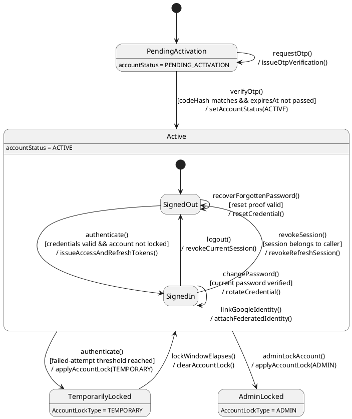

# MF-01 — Account Registration, Authentication, and Sessions

| Field | Value |
| --- | --- |
| Major Feature | **MF-01 — Account, Trust & Access Control** |
| Function package | **Account Registration, Authentication, and Sessions** |
| Code-first use cases | `UC-AC-01, UC-AC-02, UC-AC-03, UC-AC-04, UC-AC-05, UC-AC-07` |
| Status | **Draft** |
| Baseline | Current reachable code and tests, 2026-08-23 |
| Diagram convention | `../sequence-diagram-skill.md`; explicit lifeline order, numbered messages, balanced activation |

## 1. Tổng quan luồng chính

Design the supported registration, proof, login, recovery, password, identity-link, and session paths.

- **UC-AC-01 — Register and Verify Account:** Create a supported email, phone, or federated account, verify the one-time proof, and select an allowed initial role before protected navigation.
- **UC-AC-02 — Authenticate and End Current Session:** Authenticate with a supported credential, refresh the authenticated session, and end the current session through logout.
- **UC-AC-03 — View and Revoke Login Sessions:** Inspect other active login sessions and revoke an eligible session belonging to the authenticated account.
- **UC-AC-04 — Recover Forgotten Password:** Request a time-limited password recovery proof and set a new password after the proof is validated.
- **UC-AC-05 — Change Password:** Replace the authenticated user's password after validating the current credential and password policy.
- **UC-AC-07 — Link Google Identity:** Link a verified Google identity to the current CareBridge account and display the resulting linked-account state.

The code is authoritative for routes, handlers, delegation, authorization, and persisted state. Report1 section 6.2 is authoritative for the Major Feature name. Historical UC numbering and obsolete triage plans are not design inputs.

## 2. Function Design — Code Traceability

| UC | Actor goal | Method / route | Exact handler | Delegated function | Authorization | Source |
| --- | --- | --- | --- | --- | --- | --- |
| `UC-AC-01` | Register and Verify Account | `POST /api/v1/auth/federated` | `AuthController.federated()` | `FederatedAuthService.authenticate()` → `UserIdentityRepository.lockProviderSubject()` → `FirebaseTokenVerifier.verify()` | No @PreAuthorize on handler/class; effective access comes from the security chain | `05_Development/CareBridgeAPI/src/main/java/com/carebridge/backend/security/controller/AuthController.java` |
| `UC-AC-01` | Register and Verify Account | `POST /api/v1/auth/phone/register` | `AuthController.registerPhone()` | `FederatedAuthService.registerPhone()` → `UserIdentityRepository.lockProviderSubject()` → `FirebaseTokenVerifier.verify()` | No @PreAuthorize on handler/class; effective access comes from the security chain | `05_Development/CareBridgeAPI/src/main/java/com/carebridge/backend/security/controller/AuthController.java` |
| `UC-AC-01` | Register and Verify Account | `POST /api/v1/auth/register` | `AuthController.register()` | `AuthService.register()` → `UserRepository.existsByEmail()` | No @PreAuthorize on handler/class; effective access comes from the security chain | `05_Development/CareBridgeAPI/src/main/java/com/carebridge/backend/security/controller/AuthController.java` |
| `UC-AC-01` | Register and Verify Account | `POST /api/v1/auth/resend-otp` | `AuthController.resendOtp()` | `AuthService.resendOtp()` → `UserRepository.findByPhone()` | No @PreAuthorize on handler/class; effective access comes from the security chain | `05_Development/CareBridgeAPI/src/main/java/com/carebridge/backend/security/controller/AuthController.java` |
| `UC-AC-01` | Register and Verify Account | `PUT /api/v1/auth/role` | `AuthController.selectRole()` | `AuthService.selectRole()` → `UserRepository.findByIdForUpdate()` | No @PreAuthorize on handler/class; effective access comes from the security chain | `05_Development/CareBridgeAPI/src/main/java/com/carebridge/backend/security/controller/AuthController.java` |
| `UC-AC-01` | Register and Verify Account | `POST /api/v1/auth/verify-otp` | `AuthController.verifyOtp()` | `AuthService.verifyOtp()` → `UserRepository.findByIdForUpdate()` | No @PreAuthorize on handler/class; effective access comes from the security chain | `05_Development/CareBridgeAPI/src/main/java/com/carebridge/backend/security/controller/AuthController.java` |
| `UC-AC-02` | Authenticate and End Current Session | `POST /api/v1/auth/federated` | `AuthController.federated()` | `FederatedAuthService.authenticate()` → `UserIdentityRepository.lockProviderSubject()` → `FirebaseTokenVerifier.verify()` | No @PreAuthorize on handler/class; effective access comes from the security chain | `05_Development/CareBridgeAPI/src/main/java/com/carebridge/backend/security/controller/AuthController.java` |
| `UC-AC-02` | Authenticate and End Current Session | `POST /api/v1/auth/login` | `AuthController.login()` | `AuthService.login()` → `UserRepository.findByPhone()` | No @PreAuthorize on handler/class; effective access comes from the security chain | `05_Development/CareBridgeAPI/src/main/java/com/carebridge/backend/security/controller/AuthController.java` |
| `UC-AC-02` | Authenticate and End Current Session | `POST /api/v1/auth/logout` | `AuthController.logout()` | `SessionService.logout()` → `UserSessionRepository.findById()` | No @PreAuthorize on handler/class; effective access comes from the security chain | `05_Development/CareBridgeAPI/src/main/java/com/carebridge/backend/security/controller/AuthController.java` |
| `UC-AC-02` | Authenticate and End Current Session | `POST /api/v1/auth/phone/login` | `AuthController.loginPhone()` | `FederatedAuthService.loginPhone()` → `UserIdentityRepository.lockProviderSubject()` → `FirebaseTokenVerifier.verify()` | No @PreAuthorize on handler/class; effective access comes from the security chain | `05_Development/CareBridgeAPI/src/main/java/com/carebridge/backend/security/controller/AuthController.java` |
| `UC-AC-02` | Authenticate and End Current Session | `POST /api/v1/auth/refresh` | `AuthController.refresh()` | `AuthService.refresh()` → `TokenBlacklistRepository.existsByTokenHashAndExpiresAtAfter()` | No @PreAuthorize on handler/class; effective access comes from the security chain | `05_Development/CareBridgeAPI/src/main/java/com/carebridge/backend/security/controller/AuthController.java` |
| `UC-AC-03` | View and Revoke Login Sessions | `GET /api/v1/sessions` | `SessionController.getSessions()` | `SessionService.getActiveSessions()` → `UserSessionRepository.findByUserIdAndRevokedFalseOrderByLastActivityAtDesc()` | isAuthenticated() | `05_Development/CareBridgeAPI/src/main/java/com/carebridge/backend/identity/controller/SessionController.java` |
| `UC-AC-03` | View and Revoke Login Sessions | `DELETE /api/v1/sessions/{sessionId}` | `SessionController.revokeSession()` | `SessionService.revokeSession()` → `UserSessionRepository.findById()` | isAuthenticated() | `05_Development/CareBridgeAPI/src/main/java/com/carebridge/backend/identity/controller/SessionController.java` |
| `UC-AC-04` | Recover Forgotten Password | `POST /api/v1/auth/forgot-password` | `AuthController.forgotPassword()` | `ForgotPasswordService.forgotPassword()` → `UserRepository.findByEmailIgnoreCase()` | No @PreAuthorize on handler/class; effective access comes from the security chain | `05_Development/CareBridgeAPI/src/main/java/com/carebridge/backend/security/controller/AuthController.java` |
| `UC-AC-04` | Recover Forgotten Password | `POST /api/v1/auth/reset-password` | `AuthController.resetPassword()` | `ResetPasswordService.resetPassword()` → `UserRepository.save()` | No @PreAuthorize on handler/class; effective access comes from the security chain | `05_Development/CareBridgeAPI/src/main/java/com/carebridge/backend/security/controller/AuthController.java` |
| `UC-AC-05` | Change Password | `PUT /api/v1/auth/change-password` | `AuthController.changePassword()` | `AuthService.changePassword()` → `UserRepository.findById()` | No @PreAuthorize on handler/class; effective access comes from the security chain | `05_Development/CareBridgeAPI/src/main/java/com/carebridge/backend/security/controller/AuthController.java` |
| `UC-AC-07` | Link Google Identity | `GET /api/v1/auth/identities/google` | `AuthController.getGoogleIdentity()` | `FederatedAuthService.getGoogleIdentity()` → `UserIdentityRepository.findByUserIdAndProvider()` | No @PreAuthorize on handler/class; effective access comes from the security chain | `05_Development/CareBridgeAPI/src/main/java/com/carebridge/backend/security/controller/AuthController.java` |
| `UC-AC-07` | Link Google Identity | `POST /api/v1/auth/identities/google` | `AuthController.linkGoogleIdentity()` | `FederatedAuthService.linkGoogleIdentity()` → `UserIdentityRepository.lockProviderSubject()` → `FirebaseTokenVerifier.verify()` | No @PreAuthorize on handler/class; effective access comes from the security chain | `05_Development/CareBridgeAPI/src/main/java/com/carebridge/backend/security/controller/AuthController.java` |

## 3. Class Diagram

This design-level UML follows the current source declarations: fields become attributes, reachable methods become operations, `implements` becomes realization, repository inheritance becomes generalization, and runtime-only calls remain dependencies. A missing layer or ownership relation is not invented.

```plantuml
@startuml ClassDiagram_01AccountRegistrationAuthenticationandSessions
skinparam classAttributeIconSize 0
skinparam wrapWidth 250
hide empty members

class "CareBridge UI /login" as UICareBridge_UI__login <<UI>>
class "ChangePasswordScreen" as UIChangePasswordScreen <<UI>>
class "ForgotPasswordScreen" as UIForgotPasswordScreen <<UI>>
class "LinkedAccountsScreen" as UILinkedAccountsScreen <<UI>>
class "LoginSessionsScreen" as UILoginSessionsScreen <<UI>>
class "RegisterScreen" as UIRegisterScreen <<UI>>
class "AuthController" as ControllerAuthController <<Controller>> {
  - authService: AuthService
  - sessionService: SessionService
  - forgotPasswordService: ForgotPasswordService
  - resetPasswordService: ResetPasswordService
  - federatedAuthService: FederatedAuthService
  + changePassword(principal: Principal, request: ChangePasswordRequest): ResponseEntity<ApiResponse<Void>>
  + forgotPassword(request: ForgotPasswordRequest, httpRequest: jakarta.servlet.http.HttpServletRequest): ResponseEntity<ApiResponse<ForgotPasswordResponse>>
  + linkGoogleIdentity(principal: Principal, request: LinkGoogleIdentityRequest): ResponseEntity<ApiResponse<LinkedGoogleIdentityResponse>>
  + login(request: LoginRequest): ResponseEntity<ApiResponse<AuthResponse>>
  + logout(request: RefreshTokenRequest, principal: Principal, httpRequest: HttpServletRequest): ResponseEntity<ApiResponse<Void>>
  + register(request: RegisterRequest): ResponseEntity<ApiResponse<OtpSendResponse>>
  + resetPassword(request: ResetPasswordRequest): ResponseEntity<ApiResponse<ResetPasswordResponse>>
  + verifyOtp(request: VerifyOtpRequest): ResponseEntity<ApiResponse<AuthResponse>>
}
class "SessionController" as ControllerSessionController <<Controller>> {
  - sessionService: SessionService
  + getSessions(principal: Principal): ApiResponse<List<SessionInfo>>
  + revokeSession(sessionId: UUID, principal: Principal, request: HttpServletRequest): ApiResponse<Void>
}
interface "AuthService" as ServiceContractAuthService <<Service>> {
  + changePassword(userId: java.util.UUID, request: ChangePasswordRequest): void
  + login(request: LoginRequest): AuthResponse
  + register(request: RegisterRequest): OtpSendResponse
  + verifyOtp(request: VerifyOtpRequest): AuthResponse
}
class "AuthServiceImpl" as ServiceAuthServiceImpl <<Service>> {
  - userRepository: UserRepository
  - refreshTokenRepository: RefreshTokenRepository
  - otpVerificationRepository: OtpVerificationRepository
  - auditService: AuditService
  - userMapper: UserMapper
  - authenticationPolicy: AuthenticationPolicy
  - passwordComplexityPolicy: PasswordComplexityPolicy
  - rateLimitPolicy: RateLimitPolicy
  + changePassword(userId: UUID, request: ChangePasswordRequest): void
  + login(request: LoginRequest): AuthResponse
  + register(request: RegisterRequest): OtpSendResponse
  + verifyOtp(request: VerifyOtpRequest): AuthResponse
}
ServiceContractAuthService <|.. ServiceAuthServiceImpl : implements
interface "FederatedAuthService" as ServiceContractFederatedAuthService <<Service>> {
  + linkGoogleIdentity(userId: UUID, request: LinkGoogleIdentityRequest): LinkedGoogleIdentityResponse
}
class "FederatedAuthServiceImpl" as ServiceFederatedAuthServiceImpl <<Service>> {
  - identityRepository: UserIdentityRepository
  - userRepository: UserRepository
  - refreshTokenRepository: RefreshTokenRepository
  - sessionRepository: UserSessionRepository
  - authenticationPolicy: AuthenticationPolicy
  - passwordComplexityPolicy: PasswordComplexityPolicy
  - userMapper: UserMapper
  - auditService: AuditService
  + linkGoogleIdentity(userId: UUID, request: LinkGoogleIdentityRequest): LinkedGoogleIdentityResponse
}
ServiceContractFederatedAuthService <|.. ServiceFederatedAuthServiceImpl : implements
interface "ForgotPasswordService" as ServiceContractForgotPasswordService <<Service>> {
  + forgotPassword(request: ForgotPasswordRequest, ipAddress: String): ForgotPasswordResponse
}
class "ForgotPasswordServiceImpl" as ServiceForgotPasswordServiceImpl <<Service>> {
  - userRepository: UserRepository
  - tokenRepository: PasswordResetTokenRepository
  - rateLimitPolicy: RateLimitPolicy
  - emailService: EmailService
  - smsService: SmsService
  - auditService: AuditService
  + forgotPassword(request: ForgotPasswordRequest, ipAddress: String): ForgotPasswordResponse
}
ServiceContractForgotPasswordService <|.. ServiceForgotPasswordServiceImpl : implements
interface "ResetPasswordService" as ServiceContractResetPasswordService <<Service>> {
  + resetPassword(request: ResetPasswordRequest): ResetPasswordResponse
}
class "ResetPasswordServiceImpl" as ServiceResetPasswordServiceImpl <<Service>> {
  - forgotPasswordService: ForgotPasswordService
  - userRepository: UserRepository
  - refreshTokenRepository: RefreshTokenRepository
  - passwordComplexityPolicy: PasswordComplexityPolicy
  - auditService: AuditService
  + resetPassword(request: ResetPasswordRequest): ResetPasswordResponse
}
ServiceContractResetPasswordService <|.. ServiceResetPasswordServiceImpl : implements
interface "SessionService" as ServiceContractSessionService <<Service>> {
  + getActiveSessions(userId: UUID): List<SessionInfo>
  + logout(refreshToken: String, userId: UUID, ipAddress: String): void
  + revokeSession(sessionId: UUID, requestingUserId: UUID, ipAddress: String): void
}
class "SessionServiceImpl" as ServiceSessionServiceImpl <<Service>> {
  - sessionRepository: UserSessionRepository
  - auditService: AuditService
  - tokenBlacklistRepository: TokenBlacklistRepository
  - refreshTokenRepository: RefreshTokenRepository
  + getActiveSessions(userId: UUID): List<SessionInfo>
  + logout(refreshToken: String, userId: UUID, ipAddress: String): void
  + revokeSession(sessionId: UUID, requestingUserId: UUID, ipAddress: String): void
}
ServiceContractSessionService <|.. ServiceSessionServiceImpl : implements
class "UserIdentityRepository" as RepositoryUserIdentityRepository <<Repository>> {
  + lockProviderSubject(identityKey: String): void
}
interface "UserRepository" as RepositoryUserRepository <<Repository>> {
  + existsByEmail(email: String): boolean
  + findByEmailIgnoreCase(email: String): Optional<User>
  + findById(id: java.util.UUID): Optional<User>
  + findByIdForUpdate(id: java.util.UUID): Optional<User>
  + findByPhone(phone: String): Optional<User>
  + save(entity: User): User
}
class "User" as EntityUser <<Entity>> {
  - person: Person
  - phone: String
  - email: String
  - passwordHash: String
  - name: String
  - displayName: String
  - dateOfBirth: LocalDate
  - area: String
}
interface "JpaRepository<User, java.util.UUID>" as RepositoryBaseUserRepository <<Framework>>
RepositoryBaseUserRepository <|-- RepositoryUserRepository : extends
interface "UserSessionRepository" as RepositoryUserSessionRepository <<Repository>> {
  + findById(id: UUID): Optional<UserSession>
  + findByUserIdAndRevokedFalseOrderByLastActivityAtDesc(UUID userId) { return findByUserIdAndRevokedAtIsNullOrderByLastActivityAtDesc(userId): default List<UserSession>
}
class "UserSession" as EntityUserSession <<Entity>> {
  - sessionId: UUID
  - userId: UUID
  - refreshTokenHash: String
  - deviceName: String
  - ipAddress: String
  - browser: String
  - location: String
  - lastActivityAt: Instant
}
interface "JpaRepository<UserSession, UUID>" as RepositoryBaseUserSessionRepository <<Framework>>
RepositoryBaseUserSessionRepository <|-- RepositoryUserSessionRepository : extends
class "FirebaseTokenVerifier" as ExternalFirebaseTokenVerifier <<External Service>> {
  + verify(idToken: String): VerifiedFederatedIdentity
}
class "PostgreSQL" as DB <<Database>>
UICareBridge_UI__login ..> ControllerAuthController : invokes API
UIChangePasswordScreen ..> ControllerAuthController : invokes API
UIForgotPasswordScreen ..> ControllerAuthController : invokes API
UILinkedAccountsScreen ..> ControllerAuthController : invokes API
UILoginSessionsScreen ..> ControllerSessionController : invokes API
UIRegisterScreen ..> ControllerAuthController : invokes API
ControllerAuthController --> ServiceContractAuthService : delegates
ControllerAuthController --> ServiceContractFederatedAuthService : delegates
ControllerAuthController --> ServiceContractForgotPasswordService : delegates
ControllerAuthController --> ServiceContractResetPasswordService : delegates
ControllerAuthController --> ServiceContractSessionService : delegates
ControllerSessionController --> ServiceContractSessionService : delegates
ServiceAuthServiceImpl --> RepositoryUserRepository : reads / writes
ServiceFederatedAuthServiceImpl --> RepositoryUserIdentityRepository : reads / writes
ServiceForgotPasswordServiceImpl --> RepositoryUserRepository : reads / writes
ServiceResetPasswordServiceImpl --> RepositoryUserRepository : reads / writes
ServiceSessionServiceImpl --> RepositoryUserSessionRepository : reads / writes
RepositoryUserRepository ..> EntityUser : maps
RepositoryUserSessionRepository ..> EntityUserSession : maps
RepositoryUserIdentityRepository ..> DB : persists
RepositoryUserRepository ..> DB : persists
RepositoryUserSessionRepository ..> DB : persists
ServiceFederatedAuthServiceImpl ..> ExternalFirebaseTokenVerifier : invokes when required
@enduml
```



**Figure 1 — Class Diagram: Account Registration, Authentication, and Sessions**

## 4. Sequence Diagram — Main Flow

Each group is a representative reachable main flow. The full endpoint surface remains in the Function Design table above.

```plantuml
@startuml
skinparam shadowing false
skinparam maxMessageSize 90
title Account Registration, Authentication, and Sessions — code-reachable representative flows

actor "Guest" as AGuest
actor "Registered User" as ARegistered_User
actor "Authenticated User" as AAuthenticated_User
boundary "RegisterScreen" as UIRegisterScreen <<boundary>>
boundary "CareBridge UI /login" as UICareBridge_UI__login <<boundary>>
boundary "LoginSessionsScreen" as UILoginSessionsScreen <<boundary>>
boundary "ForgotPasswordScreen" as UIForgotPasswordScreen <<boundary>>
boundary "ChangePasswordScreen" as UIChangePasswordScreen <<boundary>>
boundary "LinkedAccountsScreen" as UILinkedAccountsScreen <<boundary>>
participant "JwtAuthenticationFilter" as JWT <<middleware>>
control "AuthController" as CAuthController <<control>>
control "SessionController" as CSessionController <<control>>
participant "AuthService" as SAuthService <<service>>
participant "SessionService" as SSessionService <<service>>
participant "ForgotPasswordService" as SForgotPasswordService <<service>>
participant "ResetPasswordService" as SResetPasswordService <<service>>
participant "FederatedAuthService" as SFederatedAuthService <<service>>
participant "UserRepository" as RUserRepository <<repository>>
participant "UserSessionRepository" as RUserSessionRepository <<repository>>
participant "UserIdentityRepository" as RUserIdentityRepository <<repository>>
database "PostgreSQL" as DB
participant "FirebaseTokenVerifier" as XFirebaseTokenVerifier <<external system>>

group UC-AC-01 — Register and Verify Account [register()]
AGuest -> UIRegisterScreen : 1. submitRegistration(contact, password, role)
activate UIRegisterScreen
alt [request succeeds]
UIRegisterScreen -> CAuthController : 2a. POST /api/v1/auth/register
activate CAuthController
CAuthController -> SAuthService : 2a-1. register(request)
activate SAuthService
SAuthService -> RUserRepository : 2a-2. existsByEmail(email)
activate RUserRepository
RUserRepository -> DB : 2a-3. SELECT User via existsByEmail()
activate DB
DB --> RUserRepository : 2a-4. userQueryResult
deactivate DB
RUserRepository --> SAuthService : 2a-5. booleanResult
deactivate RUserRepository
SAuthService --> CAuthController : 2a-6. otpSendResponse
deactivate SAuthService
CAuthController --> UIRegisterScreen : 2a-7. 201 Created — otpSendResponse
deactivate CAuthController
UIRegisterScreen --> AGuest : 2a-8. showOtpVerificationStep()
else [validation fails or state conflict is detected]
UIRegisterScreen -> CAuthController : 2b. POST /api/v1/auth/register
activate CAuthController
CAuthController -> SAuthService : 2b-1. register(request)
activate SAuthService
SAuthService --> CAuthController : 2b-2. validationOrStateConflictError
deactivate SAuthService
CAuthController --> UIRegisterScreen : 2b-3. 400 Bad Request / 409 Conflict — validationOrStateConflictError
deactivate CAuthController
UIRegisterScreen --> AGuest : 2b-4. showRegisterError(message)
end
deactivate UIRegisterScreen
end

group UC-AC-01 — Register and Verify Account [verifyOtp()]
AGuest -> UIRegisterScreen : 3. submitRegistrationOtp(contact, otp)
activate UIRegisterScreen
alt [request succeeds]
UIRegisterScreen -> CAuthController : 4a. POST /api/v1/auth/verify-otp
activate CAuthController
CAuthController -> SAuthService : 4a-1. verifyOtp(request)
activate SAuthService
SAuthService -> RUserRepository : 4a-2. findByIdForUpdate(id)
activate RUserRepository
RUserRepository -> DB : 4a-3. SELECT User via findByIdForUpdate()
activate DB
DB --> RUserRepository : 4a-4. userQueryResult
deactivate DB
RUserRepository --> SAuthService : 4a-5. optionalUser
deactivate RUserRepository
SAuthService --> CAuthController : 4a-6. authResponse
deactivate SAuthService
CAuthController --> UIRegisterScreen : 4a-7. 200 OK — authResponse
deactivate CAuthController
UIRegisterScreen --> AGuest : 4a-8. enterRoleAppropriateWorkspace()
else [validation fails or owned resource is not found]
UIRegisterScreen -> CAuthController : 4b. POST /api/v1/auth/verify-otp
activate CAuthController
CAuthController -> SAuthService : 4b-1. verifyOtp(request)
activate SAuthService
SAuthService --> CAuthController : 4b-2. validationOrResourceNotFoundError
deactivate SAuthService
CAuthController --> UIRegisterScreen : 4b-3. 400 Bad Request / 404 Not Found — validationOrResourceNotFoundError
deactivate CAuthController
UIRegisterScreen --> AGuest : 4b-4. showVerifyOtpError(message)
end
deactivate UIRegisterScreen
end

group UC-AC-02 — Authenticate and End Current Session [login()]
ARegistered_User -> UICareBridge_UI__login : 5. submitLogin(credentials)
activate UICareBridge_UI__login
alt [request succeeds]
UICareBridge_UI__login -> CAuthController : 6a. POST /api/v1/auth/login
activate CAuthController
CAuthController -> SAuthService : 6a-1. login(request)
activate SAuthService
SAuthService -> RUserRepository : 6a-2. findByPhone(phone)
activate RUserRepository
RUserRepository -> DB : 6a-3. SELECT User via findByPhone()
activate DB
DB --> RUserRepository : 6a-4. userQueryResult
deactivate DB
RUserRepository --> SAuthService : 6a-5. optionalUser
deactivate RUserRepository
SAuthService --> CAuthController : 6a-6. authResponse
deactivate SAuthService
CAuthController --> UICareBridge_UI__login : 6a-7. 200 OK — authResponse
deactivate CAuthController
UICareBridge_UI__login --> ARegistered_User : 6a-8. enterRoleAppropriateWorkspace()
else [validation fails or rate limit is exceeded]
UICareBridge_UI__login -> CAuthController : 6b. POST /api/v1/auth/login
activate CAuthController
CAuthController -> SAuthService : 6b-1. login(request)
activate SAuthService
SAuthService --> CAuthController : 6b-2. validationOrRateLimitError
deactivate SAuthService
CAuthController --> UICareBridge_UI__login : 6b-3. 400 Bad Request / 403 Forbidden / 429 Too Many Requests — validationOrRateLimitError
deactivate CAuthController
UICareBridge_UI__login --> ARegistered_User : 6b-4. showLoginError(message)
end
deactivate UICareBridge_UI__login
end

group UC-AC-02 — Authenticate and End Current Session [logout()]
ARegistered_User -> UICareBridge_UI__login : 7. requestLogout()
activate UICareBridge_UI__login
alt [authorized request succeeds]
UICareBridge_UI__login -> JWT : 8a. POST /api/v1/auth/logout with bearer token
activate JWT
JWT -> CAuthController : 8a-1. logout(request, principal, httpRequest)
activate CAuthController
CAuthController -> SSessionService : 8a-2. logout(refreshToken, userId, ipAddress)
activate SSessionService
SSessionService -> RUserSessionRepository : 8a-3. findById()
activate RUserSessionRepository
RUserSessionRepository -> DB : 8a-4. SELECT UserSession via findById()
activate DB
DB --> RUserSessionRepository : 8a-5. userSessionQueryResult
deactivate DB
RUserSessionRepository --> SSessionService : 8a-6. userSessionQueryResult
deactivate RUserSessionRepository
SSessionService --> CAuthController : 8a-7. completed
deactivate SSessionService
CAuthController --> JWT : 8a-8. completed
deactivate CAuthController
JWT --> UICareBridge_UI__login : 8a-9. 200 OK — completed
deactivate JWT
UICareBridge_UI__login --> ARegistered_User : 8a-10. displayLoggedOutState()
else [authentication or role authorization fails]
UICareBridge_UI__login -> JWT : 8b. POST /api/v1/auth/logout with invalid or insufficient bearer token
activate JWT
JWT --> UICareBridge_UI__login : 8b-1. 401 Unauthorized / 403 Forbidden
deactivate JWT
UICareBridge_UI__login --> ARegistered_User : 8b-2. showAuthenticationOrAuthorizationError(message)
else [application policy rejects the request]
UICareBridge_UI__login -> JWT : 8c. POST /api/v1/auth/logout with bearer token
activate JWT
JWT -> CAuthController : 8c-1. logout(request, principal, httpRequest)
activate CAuthController
CAuthController -> SSessionService : 8c-2. logout(refreshToken, userId, ipAddress)
activate SSessionService
SSessionService --> CAuthController : 8c-3. policyRejectionError
deactivate SSessionService
CAuthController --> JWT : 8c-4. policyRejectionError
deactivate CAuthController
JWT --> UICareBridge_UI__login : 8c-5. 401 Unauthorized — policyRejectionError
deactivate JWT
UICareBridge_UI__login --> ARegistered_User : 8c-6. showLogoutError(message)
end
deactivate UICareBridge_UI__login
end

group UC-AC-03 — View and Revoke Login Sessions [getSessions()]
AAuthenticated_User -> UILoginSessionsScreen : 9. openLoginSessions()
activate UILoginSessionsScreen
alt [authorized request succeeds]
UILoginSessionsScreen -> JWT : 10a. GET /api/v1/sessions with bearer token
activate JWT
JWT -> CSessionController : 10a-1. getSessions(principal)
activate CSessionController
CSessionController -> SSessionService : 10a-2. getActiveSessions(userId)
activate SSessionService
SSessionService -> RUserSessionRepository : 10a-3. findByUserIdAndRevokedFalseOrderByLastActivityAtDesc()
activate RUserSessionRepository
RUserSessionRepository -> DB : 10a-4. SELECT UserSession via findByUserIdAndRevokedFalseOrderByLastActivityAtDesc()
activate DB
DB --> RUserSessionRepository : 10a-5. userSessionQueryResult
deactivate DB
RUserSessionRepository --> SSessionService : 10a-6. userSession
deactivate RUserSessionRepository
SSessionService --> CSessionController : 10a-7. sessionInfoList
deactivate SSessionService
CSessionController --> JWT : 10a-8. sessionInfo
deactivate CSessionController
JWT --> UILoginSessionsScreen : 10a-9. 200 OK — sessionInfo
deactivate JWT
UILoginSessionsScreen --> AAuthenticated_User : 10a-10. displayActiveSessions()
else [authentication or role authorization fails]
UILoginSessionsScreen -> JWT : 10b. GET /api/v1/sessions with invalid or insufficient bearer token
activate JWT
JWT --> UILoginSessionsScreen : 10b-1. 401 Unauthorized / 403 Forbidden
deactivate JWT
UILoginSessionsScreen --> AAuthenticated_User : 10b-2. showAuthenticationOrAuthorizationError(message)
end
deactivate UILoginSessionsScreen
end

group UC-AC-03 — View and Revoke Login Sessions [revokeSession()]
AAuthenticated_User -> UILoginSessionsScreen : 11. selectSessionToRevoke(sessionId)
activate UILoginSessionsScreen
alt [authorized request succeeds]
UILoginSessionsScreen -> JWT : 12a. DELETE /api/v1/sessions/{sessionId} with bearer token
activate JWT
JWT -> CSessionController : 12a-1. revokeSession(sessionId, principal, request)
activate CSessionController
CSessionController -> SSessionService : 12a-2. revokeSession(sessionId, requestingUserId, ipAddress)
activate SSessionService
SSessionService -> RUserSessionRepository : 12a-3. findById()
activate RUserSessionRepository
RUserSessionRepository -> DB : 12a-4. SELECT UserSession via findById()
activate DB
DB --> RUserSessionRepository : 12a-5. userSessionQueryResult
deactivate DB
RUserSessionRepository --> SSessionService : 12a-6. userSessionQueryResult
deactivate RUserSessionRepository
SSessionService --> CSessionController : 12a-7. completed
deactivate SSessionService
CSessionController --> JWT : 12a-8. completed
deactivate CSessionController
JWT --> UILoginSessionsScreen : 12a-9. 200 OK — completed
deactivate JWT
UILoginSessionsScreen --> AAuthenticated_User : 12a-10. displayRevokedSession()
else [authentication or role authorization fails]
UILoginSessionsScreen -> JWT : 12b. DELETE /api/v1/sessions/{sessionId} with invalid or insufficient bearer token
activate JWT
JWT --> UILoginSessionsScreen : 12b-1. 401 Unauthorized / 403 Forbidden
deactivate JWT
UILoginSessionsScreen --> AAuthenticated_User : 12b-2. showAuthenticationOrAuthorizationError(message)
end
deactivate UILoginSessionsScreen
end

group UC-AC-04 — Recover Forgotten Password [forgotPassword()]
AGuest -> UIForgotPasswordScreen : 13. submitPasswordRecovery(contact)
activate UIForgotPasswordScreen
alt [request succeeds]
UIForgotPasswordScreen -> CAuthController : 14a. POST /api/v1/auth/forgot-password
activate CAuthController
CAuthController -> SForgotPasswordService : 14a-1. forgotPassword(request, ipAddress)
activate SForgotPasswordService
SForgotPasswordService -> RUserRepository : 14a-2. findByEmailIgnoreCase(email)
activate RUserRepository
RUserRepository -> DB : 14a-3. SELECT User via findByEmailIgnoreCase()
activate DB
DB --> RUserRepository : 14a-4. userQueryResult
deactivate DB
RUserRepository --> SForgotPasswordService : 14a-5. optionalUser
deactivate RUserRepository
SForgotPasswordService --> CAuthController : 14a-6. forgotPasswordResponse
deactivate SForgotPasswordService
CAuthController --> UIForgotPasswordScreen : 14a-7. 200 OK — forgotPasswordResponse
deactivate CAuthController
UIForgotPasswordScreen --> AGuest : 14a-8. showPasswordResetInstructions()
else [validation fails or rate limit is exceeded]
UIForgotPasswordScreen -> CAuthController : 14b. POST /api/v1/auth/forgot-password
activate CAuthController
CAuthController -> SForgotPasswordService : 14b-1. forgotPassword(request, ipAddress)
activate SForgotPasswordService
SForgotPasswordService --> CAuthController : 14b-2. validationOrRateLimitError
deactivate SForgotPasswordService
CAuthController --> UIForgotPasswordScreen : 14b-3. 400 Bad Request / 429 Too Many Requests — validationOrRateLimitError
deactivate CAuthController
UIForgotPasswordScreen --> AGuest : 14b-4. showForgotPasswordError(message)
end
deactivate UIForgotPasswordScreen
end

group UC-AC-04 — Recover Forgotten Password [resetPassword()]
AGuest -> UIForgotPasswordScreen : 15. submitNewPassword(token, newPassword)
activate UIForgotPasswordScreen
alt [request succeeds]
UIForgotPasswordScreen -> CAuthController : 16a. POST /api/v1/auth/reset-password
activate CAuthController
CAuthController -> SResetPasswordService : 16a-1. resetPassword(request)
activate SResetPasswordService
SResetPasswordService -> RUserRepository : 16a-2. save()
activate RUserRepository
RUserRepository -> DB : 16a-3. INSERT / UPDATE User
activate DB
DB --> RUserRepository : 16a-4. persistedUser
deactivate DB
RUserRepository --> SResetPasswordService : 16a-5. persistedUser
deactivate RUserRepository
SResetPasswordService --> CAuthController : 16a-6. resetPasswordResponse
deactivate SResetPasswordService
CAuthController --> UIForgotPasswordScreen : 16a-7. 200 OK — resetPasswordResponse
deactivate CAuthController
UIForgotPasswordScreen --> AGuest : 16a-8. displayPasswordResetSuccess()
else [validation fails or rate limit is exceeded]
UIForgotPasswordScreen -> CAuthController : 16b. POST /api/v1/auth/reset-password
activate CAuthController
CAuthController -> SResetPasswordService : 16b-1. resetPassword(request)
activate SResetPasswordService
SResetPasswordService --> CAuthController : 16b-2. validationOrRateLimitError
deactivate SResetPasswordService
CAuthController --> UIForgotPasswordScreen : 16b-3. 400 Bad Request / 429 Too Many Requests — validationOrRateLimitError
deactivate CAuthController
UIForgotPasswordScreen --> AGuest : 16b-4. showResetPasswordError(message)
end
deactivate UIForgotPasswordScreen
end

group UC-AC-05 — Change Password [changePassword()]
AAuthenticated_User -> UIChangePasswordScreen : 17. submitPasswordChange(currentPassword, newPassword)
activate UIChangePasswordScreen
alt [authorized request succeeds]
UIChangePasswordScreen -> JWT : 18a. PUT /api/v1/auth/change-password with bearer token
activate JWT
JWT -> CAuthController : 18a-1. changePassword(principal, request)
activate CAuthController
CAuthController -> SAuthService : 18a-2. changePassword(userId, request)
activate SAuthService
SAuthService -> RUserRepository : 18a-3. findById()
activate RUserRepository
RUserRepository -> DB : 18a-4. SELECT User via findById()
activate DB
DB --> RUserRepository : 18a-5. userQueryResult
deactivate DB
RUserRepository --> SAuthService : 18a-6. userQueryResult
deactivate RUserRepository
SAuthService --> CAuthController : 18a-7. completed
deactivate SAuthService
CAuthController --> JWT : 18a-8. completed
deactivate CAuthController
JWT --> UIChangePasswordScreen : 18a-9. 200 OK — completed
deactivate JWT
UIChangePasswordScreen --> AAuthenticated_User : 18a-10. displayPasswordChangeSuccess()
else [authentication or role authorization fails]
UIChangePasswordScreen -> JWT : 18b. PUT /api/v1/auth/change-password with invalid or insufficient bearer token
activate JWT
JWT --> UIChangePasswordScreen : 18b-1. 401 Unauthorized / 403 Forbidden
deactivate JWT
UIChangePasswordScreen --> AAuthenticated_User : 18b-2. showAuthenticationOrAuthorizationError(message)
else [validation fails]
UIChangePasswordScreen -> JWT : 18c. PUT /api/v1/auth/change-password with bearer token
activate JWT
JWT -> CAuthController : 18c-1. changePassword(principal, request)
activate CAuthController
CAuthController -> SAuthService : 18c-2. changePassword(userId, request)
activate SAuthService
SAuthService --> CAuthController : 18c-3. validationError
deactivate SAuthService
CAuthController --> JWT : 18c-4. validationError
deactivate CAuthController
JWT --> UIChangePasswordScreen : 18c-5. 400 Bad Request / 401 Unauthorized — validationError
deactivate JWT
UIChangePasswordScreen --> AAuthenticated_User : 18c-6. showChangePasswordError(message)
end
deactivate UIChangePasswordScreen
end

group UC-AC-07 — Link Google Identity [linkGoogleIdentity()]
AAuthenticated_User -> UILinkedAccountsScreen : 19. submitGoogleIdentityProof(idToken)
activate UILinkedAccountsScreen
alt [authorized request succeeds]
UILinkedAccountsScreen -> JWT : 20a. POST /api/v1/auth/identities/google with bearer token
activate JWT
JWT -> CAuthController : 20a-1. linkGoogleIdentity(principal, request)
activate CAuthController
CAuthController -> SFederatedAuthService : 20a-2. linkGoogleIdentity(userId, request)
activate SFederatedAuthService
SFederatedAuthService -> XFirebaseTokenVerifier : 20a-3. verify(idToken)
activate XFirebaseTokenVerifier
XFirebaseTokenVerifier --> SFederatedAuthService : 20a-4. verifiedFederatedIdentity
deactivate XFirebaseTokenVerifier
SFederatedAuthService -> RUserIdentityRepository : 20a-5. lockProviderSubject(identityKey)
activate RUserIdentityRepository
RUserIdentityRepository -> DB : 20a-6. SELECT UserIdentity FOR UPDATE
activate DB
DB --> RUserIdentityRepository : 20a-7. lockedUserIdentity
deactivate DB
RUserIdentityRepository --> SFederatedAuthService : 20a-8. completed
deactivate RUserIdentityRepository
SFederatedAuthService --> CAuthController : 20a-9. linkedGoogleIdentityResponse
deactivate SFederatedAuthService
CAuthController --> JWT : 20a-10. linkedGoogleIdentityResponse
deactivate CAuthController
JWT --> UILinkedAccountsScreen : 20a-11. 200 OK — linkedGoogleIdentityResponse
deactivate JWT
UILinkedAccountsScreen --> AAuthenticated_User : 20a-12. displayLinkedGoogleIdentity()
else [authentication or role authorization fails]
UILinkedAccountsScreen -> JWT : 20b. POST /api/v1/auth/identities/google with invalid or insufficient bearer token
activate JWT
JWT --> UILinkedAccountsScreen : 20b-1. 401 Unauthorized / 403 Forbidden
deactivate JWT
UILinkedAccountsScreen --> AAuthenticated_User : 20b-2. showAuthenticationOrAuthorizationError(message)
end
deactivate UILinkedAccountsScreen
end
@enduml
```

**Brief Explanation:**

1. The actor starts each grouped use case through the code-reachable UI boundary.
2. Protected requests pass through JwtAuthenticationFilter; rejected credentials or roles return 401 Unauthorized or 403 Forbidden without invoking the controller.
3. The controller receives the request and invokes the exact delegated operation resolved from the current source.
4. The service applies the business policy and coordinates downstream collaborators while its caller remains active.
5. The repository executes the represented persistence operation and returns the stored or queried result before its activation ends.
6. Where the current implementation requires an external system, the service waits for its response before completing the domain result.
7. The HTTP response unwinds through middleware when present, and the UI renders the server-authoritative outcome to the actor.

## 5. State Chart Diagram

The lifecycle below belongs to **User.accountStatus, with the signed-in session lifecycle nested inside an active account**. Its states are the persisted constants declared in the sources cited under this diagram, and every transition, guard, and action is taken from the service method that writes that constant. No unreachable state is introduced.



**Figure 2 — State Chart Diagram: Account Registration, Authentication, and Sessions**

**Brief Explanation:**

1. A new registration starts in `PendingActivation` because `AuthServiceImpl` creates the `User` with `accountStatus = PENDING_ACTIVATION` and issues an `OtpVerification`.
2. The event `verifyOtp()` promotes the account to `Active` only under the guard that the stored `codeHash` matches and `expiresAt` has not passed; the action sets `accountStatus = ACTIVE`.
3. Inside `Active`, `authenticate()` moves the account from `SignedOut` to `SignedIn` and the action issues the access and refresh tokens that back a session.
4. The events `logout()` and `revokeSession()` both return the account to `SignedOut`, but `revokeSession()` carries the guard that the targeted session must belong to the caller.
5. `changePassword()` and `linkGoogleIdentity()` are self-transitions on `SignedIn`: they mutate credentials without ending the session.
6. Repeated failed authentication moves the whole account to `TemporarilyLocked` via `AccountLockType.TEMPORARY`, which `AuthenticationPolicy` re-checks on every later sign-in attempt.

**State sources:**

- `05_Development/CareBridgeAPI/src/main/java/com/carebridge/backend/security/entity/User.java`
- `05_Development/CareBridgeAPI/src/main/java/com/carebridge/backend/security/entity/OtpVerification.java`
- `05_Development/CareBridgeAPI/src/main/java/com/carebridge/backend/security/entity/AccountLockType.java`
- `05_Development/CareBridgeAPI/src/main/java/com/carebridge/backend/security/service/impl/AuthServiceImpl.java`
- `05_Development/CareBridgeAPI/src/main/java/com/carebridge/backend/security/policy/AuthenticationPolicy.java`

## 6. Business Rules Applied

| UC | Enforced business/security rules | Known boundary or gap |
| --- | --- | --- |
| `UC-AC-01` | OTP cooldown, uniqueness, proof validity, and the role allow-list are server authoritative. General Web registration redirects to login; only expert registration is reachable on Web. | Deleted legacy federated-registration pages are not valid Web entry points. |
| `UC-AC-02` | Blocked accounts and unsupported roles are routed to explicit safe screens. Logout, not the revoke-other-session endpoint, ends the current session. | No additional gap recorded in the code-first baseline. |
| `UC-AC-03` | A user cannot enumerate or revoke another account's sessions. The current session must be ended through logout. | No focused Mobile widget test was found. |
| `UC-AC-04` | Recovery responses must not disclose whether an unrelated account exists. Proof expiry, one-time use, and password complexity are server authoritative. | No focused backend forgot/reset service test was found. |
| `UC-AC-05` | The authenticated principal, not a client-supplied user id, owns the change. The new password must satisfy the server password policy. | No focused end-to-end change-password test was found. |
| `UC-AC-07` | A federated identity cannot be linked to multiple CareBridge accounts. The server verifies provider identity; client display state is not proof of linkage. | No reachable Web linked-account UI exists. |

## 7. Partial / Excluded Boundaries

- Deleted legacy federated-registration pages are not valid Web entry points.
- No focused Mobile widget test was found.
- No focused backend forgot/reset service test was found.
- No focused end-to-end change-password test was found.
- No reachable Web linked-account UI exists.

## 8. Code and Test Evidence

- `05_Development/CareBridgeAPI/src/main/java/com/carebridge/backend/security/controller/AuthController.java`
- `05_Development/CareBridgeMobileApp/lib/features/auth/screens/register_screen.dart`
- `05_Development/CareBridgeMobileApp/lib/features/auth/screens/otp_verification_screen.dart`
- `05_Development/CareBridgeAPI/src/test/java/com/carebridge/backend/security/integration/RegistrationIntegrationTest.java`
- `05_Development/CareBridgeAPI/src/test/java/com/carebridge/backend/security/integration/VerifyOtpIntegrationTest.java`
- `05_Development/CareBridgeWebApp/src/features/auth/pages/ExpertRegisterPage.test.tsx`
- `05_Development/CareBridgeMobileApp/lib/features/auth/services/auth_service.dart`
- `05_Development/CareBridgeWebApp/src/features/auth/services/authApi.ts`
- `05_Development/CareBridgeAPI/src/test/java/com/carebridge/backend/security/integration/LoginIntegrationTest.java`
- `05_Development/CareBridgeAPI/src/test/java/com/carebridge/backend/security/integration/LogoutIntegrationTest.java`
- `05_Development/CareBridgeAPI/src/test/java/com/carebridge/backend/security/integration/FederatedLoginIntegrationTest.java`
- `05_Development/CareBridgeMobileApp/test/features/auth/password_login_test.dart`
- `05_Development/CareBridgeAPI/src/main/java/com/carebridge/backend/identity/controller/SessionController.java`
- `05_Development/CareBridgeMobileApp/lib/features/session/screens/login_sessions_screen.dart`
- `05_Development/CareBridgeAPI/src/test/java/com/carebridge/backend/identity/service/impl/SessionServiceImplTest.java`
- `05_Development/CareBridgeMobileApp/lib/features/auth/screens/forgot_password_screen.dart`
- `05_Development/CareBridgeMobileApp/lib/features/auth/screens/reset_password_screen.dart`
- `05_Development/CareBridgeWebApp/src/features/auth/pages/ForgotPasswordPage.tsx`
- `05_Development/CareBridgeWebApp/src/features/auth/pages/PasswordRecoveryPages.test.tsx`
- `05_Development/CareBridgeAPI/src/test/java/com/carebridge/backend/security/policy/PasswordComplexityPolicyTest.java`
- `05_Development/CareBridgeMobileApp/lib/features/auth/screens/change_password_screen.dart`
- `05_Development/CareBridgeWebApp/src/features/auth/pages/ChangePasswordPage.tsx`
- `05_Development/CareBridgeAPI/src/main/java/com/carebridge/backend/security/service/FederatedAuthService.java`
- `05_Development/CareBridgeMobileApp/lib/features/auth/screens/linked_accounts_screen.dart`
- `05_Development/CareBridgeAPI/src/test/java/com/carebridge/backend/security/integration/FederatedIdentityLinkIntegrationTest.java`
- `05_Development/CareBridgeMobileApp/test/features/auth/linked_accounts_screen_test.dart`
