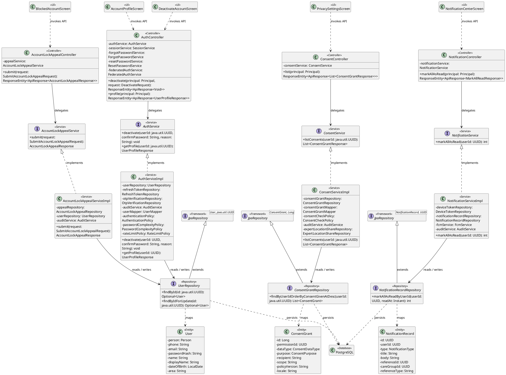
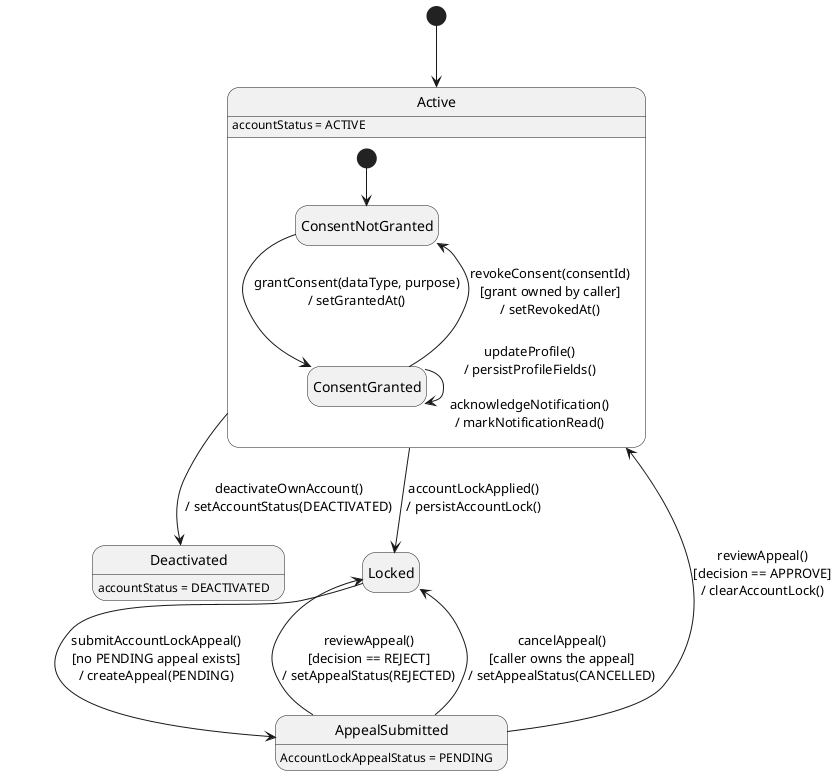

# MF-01 — Profile, Notifications, Privacy, and Account State

| Field | Value |
| --- | --- |
| Major Feature | **MF-01 — Account, Trust & Access Control** |
| Function package | **Profile, Notifications, Privacy, and Account State** |
| Code-first use cases | `UC-AC-06, UC-AC-08, UC-AC-09, UC-AC-10, UC-AC-11` |
| Status | **Draft** |
| Baseline | Current reachable code and tests, 2026-08-23 |
| Diagram convention | `../sequence-diagram-skill.md`; explicit lifeline order, numbered messages, balanced activation |

## 1. Tổng quan luồng chính

Design self-service profile, notification, consent/privacy, deactivation, and lock-appeal functions.

- **UC-AC-06 — View and Edit Account Profile:** View and update the supported profile fields of the authenticated account.
- **UC-AC-08 — View and Acknowledge Notifications:** View account notifications, mark one or all notifications read, and register or deregister the current device token for delivery.
- **UC-AC-09 — Manage Privacy Settings and Consent Grants:** Read and update supported privacy settings and grant or revoke purpose-bound consent used by downstream CareBridge features.
- **UC-AC-10 — Deactivate Own Account:** Deactivate the authenticated account through the supported confirmation flow.
- **UC-AC-11 — Submit Account Lock Appeal:** View the current account block state and submit one eligible appeal for administrative review.

The code is authoritative for routes, handlers, delegation, authorization, and persisted state. Report1 section 6.2 is authoritative for the Major Feature name. Historical UC numbering and obsolete triage plans are not design inputs.

## 2. Function Design — Code Traceability

| UC | Actor goal | Method / route | Exact handler | Delegated function | Authorization | Source |
| --- | --- | --- | --- | --- | --- | --- |
| `UC-AC-06` | View and Edit Account Profile | `GET /api/v1/auth/profile` | `AuthController.profile()` | `AuthService.getProfile()` → `UserRepository.findById()` | No @PreAuthorize on handler/class; effective access comes from the security chain | `05_Development/CareBridgeAPI/src/main/java/com/carebridge/backend/security/controller/AuthController.java` |
| `UC-AC-06` | View and Edit Account Profile | `PUT /api/v1/auth/profile` | `AuthController.updateProfile()` | `AuthService.updateProfile()` → `UserRepository.findById()` | No @PreAuthorize on handler/class; effective access comes from the security chain | `05_Development/CareBridgeAPI/src/main/java/com/carebridge/backend/security/controller/AuthController.java` |
| `UC-AC-06` | View and Edit Account Profile | `GET /api/v1/profile` | `ProfileController.getProfile()` | `ProfileService.getProfile()` → `ProfileRepository.findByUserId()` | isAuthenticated() | `05_Development/CareBridgeAPI/src/main/java/com/carebridge/backend/profile/controller/ProfileController.java` |
| `UC-AC-06` | View and Edit Account Profile | `PATCH /api/v1/profile` | `ProfileController.updateProfile()` | `ProfileService.updateProfile()` → `UserRepository.findById()` | isAuthenticated() | `05_Development/CareBridgeAPI/src/main/java/com/carebridge/backend/profile/controller/ProfileController.java` |
| `UC-AC-08` | View and Acknowledge Notifications | `DELETE /api/v1/notifications/device-token` | `NotificationController.deregisterDeviceToken()` | `NotificationService.deregisterDeviceToken()` → `DeviceTokenRepository.deactivateByUserIdAndToken()` | isAuthenticated() | `05_Development/CareBridgeAPI/src/main/java/com/carebridge/backend/notification/controller/NotificationController.java` |
| `UC-AC-08` | View and Acknowledge Notifications | `POST /api/v1/notifications/device-token` | `NotificationController.registerDeviceToken()` | `NotificationService.registerDeviceToken()` → `DeviceTokenRepository.deactivateByTokenForOtherUsers()` | isAuthenticated() | `05_Development/CareBridgeAPI/src/main/java/com/carebridge/backend/notification/controller/NotificationController.java` |
| `UC-AC-08` | View and Acknowledge Notifications | `GET /api/v1/notifications/me` | `NotificationController.getMyNotifications()` | `NotificationService.getMyNotifications()` → `NotificationRecordRepository.findVisibleByUserIdAndType()` | isAuthenticated() | `05_Development/CareBridgeAPI/src/main/java/com/carebridge/backend/notification/controller/NotificationController.java` |
| `UC-AC-08` | View and Acknowledge Notifications | `PUT /api/v1/notifications/read-all` | `NotificationController.markAllAsRead()` | `NotificationService.markAllAsRead()` → `NotificationRecordRepository.markAllAsReadByUserId()` | isAuthenticated() | `05_Development/CareBridgeAPI/src/main/java/com/carebridge/backend/notification/controller/NotificationController.java` |
| `UC-AC-08` | View and Acknowledge Notifications | `PUT /api/v1/notifications/{notificationId}/read` | `NotificationController.markAsRead()` | `NotificationService.markAsRead()` → `NotificationRecordRepository.findByIdAndUserId()` | isAuthenticated() | `05_Development/CareBridgeAPI/src/main/java/com/carebridge/backend/notification/controller/NotificationController.java` |
| `UC-AC-09` | Manage Privacy Settings and Consent Grants | `GET /api/v1/consent/grants` | `ConsentController.list()` | `ConsentService.listConsents()` → `ConsentGrantRepository.findByUserIdOrderByConsentGivenAtDesc()` | No @PreAuthorize on handler/class; effective access comes from the security chain | `05_Development/CareBridgeAPI/src/main/java/com/carebridge/backend/consent/controller/ConsentController.java` |
| `UC-AC-09` | Manage Privacy Settings and Consent Grants | `POST /api/v1/consent/grants` | `ConsentController.grant()` | `ConsentService.grantConsent()` → `ConsentGrantRepository.save()` | No @PreAuthorize on handler/class; effective access comes from the security chain | `05_Development/CareBridgeAPI/src/main/java/com/carebridge/backend/consent/controller/ConsentController.java` |
| `UC-AC-09` | Manage Privacy Settings and Consent Grants | `DELETE /api/v1/consent/grants/{consentId}` | `ConsentController.revoke()` | `ConsentService.revokeConsent()` → `ConsentGrantRepository.acquireLifecycleOwnerLock()` | No @PreAuthorize on handler/class; effective access comes from the security chain | `05_Development/CareBridgeAPI/src/main/java/com/carebridge/backend/consent/controller/ConsentController.java` |
| `UC-AC-09` | Manage Privacy Settings and Consent Grants | `GET /api/v1/privacy-settings/me` | `PrivacySettingsController.getMySettings()` | `PrivacySettingsService.getSettings()` → `PrivacySettingsRepository.findByUserId()` | isAuthenticated() | `05_Development/CareBridgeAPI/src/main/java/com/carebridge/backend/privacy/controller/PrivacySettingsController.java` |
| `UC-AC-09` | Manage Privacy Settings and Consent Grants | `PUT /api/v1/privacy-settings/me` | `PrivacySettingsController.updateMySettings()` | `PrivacySettingsService.updateSettings()` → `PrivacySettingsRepository.patchFields()` | isAuthenticated() | `05_Development/CareBridgeAPI/src/main/java/com/carebridge/backend/privacy/controller/PrivacySettingsController.java` |
| `UC-AC-10` | Deactivate Own Account | `DELETE /api/v1/auth/deactivate` | `AuthController.deactivate()` | `AuthService.deactivate()` → `UserRepository.findById()` | No @PreAuthorize on handler/class; effective access comes from the security chain | `05_Development/CareBridgeAPI/src/main/java/com/carebridge/backend/security/controller/AuthController.java` |
| `UC-AC-11` | Submit Account Lock Appeal | `POST /api/v1/auth/lock-appeals` | `AccountLockAppealController.submit()` | `AccountLockAppealService.submit()` → `UserRepository.findByIdForUpdate()` | No @PreAuthorize on handler/class; effective access comes from the security chain | `05_Development/CareBridgeAPI/src/main/java/com/carebridge/backend/security/controller/AccountLockAppealController.java` |

## 3. Class Diagram

This design-level UML follows the current source declarations: fields become attributes, reachable methods become operations, `implements` becomes realization, repository inheritance becomes generalization, and runtime-only calls remain dependencies. A missing layer or ownership relation is not invented.

**Figure 1 — Class Diagram: Profile, Notifications, Privacy, and Account State**

## 4. Sequence Diagram — Main Flow

Each group is a representative reachable main flow. The full endpoint surface remains in the Function Design table above.

```plantuml
@startuml
skinparam shadowing false
skinparam maxMessageSize 90
title Profile, Notifications, Privacy, and Account State — code-reachable representative flows

actor "Authenticated User" as AAuthenticated_User
actor "Blocked User" as ABlocked_User
boundary "AccountProfileScreen" as UIAccountProfileScreen <<boundary>>
boundary "NotificationCenterScreen" as UINotificationCenterScreen <<boundary>>
boundary "PrivacySettingsScreen" as UIPrivacySettingsScreen <<boundary>>
boundary "DeactivateAccountScreen" as UIDeactivateAccountScreen <<boundary>>
boundary "BlockedAccountScreen" as UIBlockedAccountScreen <<boundary>>
participant "JwtAuthenticationFilter" as JWT <<middleware>>
control "AuthController" as CAuthController <<control>>
control "NotificationController" as CNotificationController <<control>>
control "ConsentController" as CConsentController <<control>>
control "AccountLockAppealController" as CAccountLockAppealController <<control>>
participant "AuthService" as SAuthService <<service>>
participant "NotificationService" as SNotificationService <<service>>
participant "ConsentService" as SConsentService <<service>>
participant "AccountLockAppealService" as SAccountLockAppealService <<service>>
participant "UserRepository" as RUserRepository <<repository>>
participant "NotificationRecordRepository" as RNotificationRecordRepository <<repository>>
participant "ConsentGrantRepository" as RConsentGrantRepository <<repository>>
database "PostgreSQL" as DB

group UC-AC-06 — View and Edit Account Profile [profile()]
AAuthenticated_User -> UIAccountProfileScreen : 1. openAccountProfile()
activate UIAccountProfileScreen
alt [authorized request succeeds]
UIAccountProfileScreen -> JWT : 2a. GET /api/v1/auth/profile with bearer token
activate JWT
JWT -> CAuthController : 2a-1. profile(principal)
activate CAuthController
CAuthController -> SAuthService : 2a-2. getProfile(userId)
activate SAuthService
SAuthService -> RUserRepository : 2a-3. findById()
activate RUserRepository
RUserRepository -> DB : 2a-4. SELECT User via findById()
activate DB
DB --> RUserRepository : 2a-5. userQueryResult
deactivate DB
RUserRepository --> SAuthService : 2a-6. userQueryResult
deactivate RUserRepository
SAuthService --> CAuthController : 2a-7. userProfileResponse
deactivate SAuthService
CAuthController --> JWT : 2a-8. userProfileResponse
deactivate CAuthController
JWT --> UIAccountProfileScreen : 2a-9. 200 OK — userProfileResponse
deactivate JWT
UIAccountProfileScreen --> AAuthenticated_User : 2a-10. displayAccountProfile()
else [authentication or role authorization fails]
UIAccountProfileScreen -> JWT : 2b. GET /api/v1/auth/profile with invalid or insufficient bearer token
activate JWT
JWT --> UIAccountProfileScreen : 2b-1. 401 Unauthorized / 403 Forbidden
deactivate JWT
UIAccountProfileScreen --> AAuthenticated_User : 2b-2. showAuthenticationOrAuthorizationError(message)
else [application policy rejects the request]
UIAccountProfileScreen -> JWT : 2c. GET /api/v1/auth/profile with bearer token
activate JWT
JWT -> CAuthController : 2c-1. profile(principal)
activate CAuthController
CAuthController -> SAuthService : 2c-2. getProfile(userId)
activate SAuthService
SAuthService --> CAuthController : 2c-3. policyRejectionError
deactivate SAuthService
CAuthController --> JWT : 2c-4. policyRejectionError
deactivate CAuthController
JWT --> UIAccountProfileScreen : 2c-5. 401 Unauthorized — policyRejectionError
deactivate JWT
UIAccountProfileScreen --> AAuthenticated_User : 2c-6. showAccountProfileError(message)
end
deactivate UIAccountProfileScreen
end

group UC-AC-08 — View and Acknowledge Notifications [markAllAsRead()]
AAuthenticated_User -> UINotificationCenterScreen : 3. markAllNotificationsAsRead()
activate UINotificationCenterScreen
alt [authorized request succeeds]
UINotificationCenterScreen -> JWT : 4a. PUT /api/v1/notifications/read-all with bearer token
activate JWT
JWT -> CNotificationController : 4a-1. markAllAsRead(principal)
activate CNotificationController
CNotificationController -> SNotificationService : 4a-2. markAllAsRead(userId)
activate SNotificationService
SNotificationService -> RNotificationRecordRepository : 4a-3. markAllAsReadByUserId(userId, readAt)
activate RNotificationRecordRepository
RNotificationRecordRepository -> DB : 4a-4. UPDATE NotificationRecord via markAllAsReadByUserId()
activate DB
DB --> RNotificationRecordRepository : 4a-5. updatedNotificationRecord
deactivate DB
RNotificationRecordRepository --> SNotificationService : 4a-6. affectedCount
deactivate RNotificationRecordRepository
SNotificationService --> CNotificationController : 4a-7. affectedCount
deactivate SNotificationService
CNotificationController --> JWT : 4a-8. markAllReadResponse
deactivate CNotificationController
JWT --> UINotificationCenterScreen : 4a-9. 200 OK — markAllReadResponse
deactivate JWT
UINotificationCenterScreen --> AAuthenticated_User : 4a-10. displayNotificationsReadState()
else [authentication or role authorization fails]
UINotificationCenterScreen -> JWT : 4b. PUT /api/v1/notifications/read-all with invalid or insufficient bearer token
activate JWT
JWT --> UINotificationCenterScreen : 4b-1. 401 Unauthorized / 403 Forbidden
deactivate JWT
UINotificationCenterScreen --> AAuthenticated_User : 4b-2. showAuthenticationOrAuthorizationError(message)
end
deactivate UINotificationCenterScreen
end

group UC-AC-09 — Manage Privacy Settings and Consent Grants [list()]
AAuthenticated_User -> UIPrivacySettingsScreen : 5. openPrivacyAndConsentSettings()
activate UIPrivacySettingsScreen
alt [authorized request succeeds]
UIPrivacySettingsScreen -> JWT : 6a. GET /api/v1/consent/grants with bearer token
activate JWT
JWT -> CConsentController : 6a-1. list(principal)
activate CConsentController
CConsentController -> SConsentService : 6a-2. listConsents(userId)
activate SConsentService
SConsentService -> RConsentGrantRepository : 6a-3. findByUserIdOrderByConsentGivenAtDesc(userId)
activate RConsentGrantRepository
RConsentGrantRepository -> DB : 6a-4. SELECT ConsentGrant via findByUserIdOrderByConsentGivenAtDesc()
activate DB
DB --> RConsentGrantRepository : 6a-5. consentGrantQueryResult
deactivate DB
RConsentGrantRepository --> SConsentService : 6a-6. consentGrantList
deactivate RConsentGrantRepository
SConsentService --> CConsentController : 6a-7. consentGrantResponseList
deactivate SConsentService
CConsentController --> JWT : 6a-8. consentGrantResponse
deactivate CConsentController
JWT --> UIPrivacySettingsScreen : 6a-9. 200 OK — consentGrantResponse
deactivate JWT
UIPrivacySettingsScreen --> AAuthenticated_User : 6a-10. displayPrivacySettingsAndConsentGrants()
else [authentication or role authorization fails]
UIPrivacySettingsScreen -> JWT : 6b. GET /api/v1/consent/grants with invalid or insufficient bearer token
activate JWT
JWT --> UIPrivacySettingsScreen : 6b-1. 401 Unauthorized / 403 Forbidden
deactivate JWT
UIPrivacySettingsScreen --> AAuthenticated_User : 6b-2. showAuthenticationOrAuthorizationError(message)
end
deactivate UIPrivacySettingsScreen
end

group UC-AC-10 — Deactivate Own Account [deactivate()]
AAuthenticated_User -> UIDeactivateAccountScreen : 7. confirmAccountDeactivation()
activate UIDeactivateAccountScreen
alt [authorized request succeeds]
UIDeactivateAccountScreen -> JWT : 8a. DELETE /api/v1/auth/deactivate with bearer token
activate JWT
JWT -> CAuthController : 8a-1. deactivate(principal, request)
activate CAuthController
CAuthController -> SAuthService : 8a-2. deactivate(userId, confirmPassword, reason)
activate SAuthService
SAuthService -> RUserRepository : 8a-3. findById()
activate RUserRepository
RUserRepository -> DB : 8a-4. SELECT User via findById()
activate DB
DB --> RUserRepository : 8a-5. userQueryResult
deactivate DB
RUserRepository --> SAuthService : 8a-6. userQueryResult
deactivate RUserRepository
SAuthService --> CAuthController : 8a-7. completed
deactivate SAuthService
CAuthController --> JWT : 8a-8. completed
deactivate CAuthController
JWT --> UIDeactivateAccountScreen : 8a-9. 200 OK — completed
deactivate JWT
UIDeactivateAccountScreen --> AAuthenticated_User : 8a-10. displayDeactivatedAccount()
else [authentication or role authorization fails]
UIDeactivateAccountScreen -> JWT : 8b. DELETE /api/v1/auth/deactivate with invalid or insufficient bearer token
activate JWT
JWT --> UIDeactivateAccountScreen : 8b-1. 401 Unauthorized / 403 Forbidden
deactivate JWT
UIDeactivateAccountScreen --> AAuthenticated_User : 8b-2. showAuthenticationOrAuthorizationError(message)
else [validation fails]
UIDeactivateAccountScreen -> JWT : 8c. DELETE /api/v1/auth/deactivate with bearer token
activate JWT
JWT -> CAuthController : 8c-1. deactivate(principal, request)
activate CAuthController
CAuthController -> SAuthService : 8c-2. deactivate(userId, confirmPassword, reason)
activate SAuthService
SAuthService --> CAuthController : 8c-3. validationError
deactivate SAuthService
CAuthController --> JWT : 8c-4. validationError
deactivate CAuthController
JWT --> UIDeactivateAccountScreen : 8c-5. 400 Bad Request / 401 Unauthorized / 403 Forbidden — validationError
deactivate JWT
UIDeactivateAccountScreen --> AAuthenticated_User : 8c-6. showAccountDeactivationError(message)
end
deactivate UIDeactivateAccountScreen
end

group UC-AC-11 — Submit Account Lock Appeal [submit()]
ABlocked_User -> UIBlockedAccountScreen : 9. submitAccountLockAppeal(reason)
activate UIBlockedAccountScreen
UIBlockedAccountScreen -> CAccountLockAppealController : 10. POST /api/v1/auth/lock-appeals
activate CAccountLockAppealController
CAccountLockAppealController -> SAccountLockAppealService : 11. submit(request)
activate SAccountLockAppealService
SAccountLockAppealService -> RUserRepository : 12. findByIdForUpdate(id)
activate RUserRepository
RUserRepository -> DB : 13. SELECT User via findByIdForUpdate()
activate DB
DB --> RUserRepository : 14. userQueryResult
deactivate DB
RUserRepository --> SAccountLockAppealService : 15. optionalUser
deactivate RUserRepository
SAccountLockAppealService --> CAccountLockAppealController : 16. accountLockAppealResponse
deactivate SAccountLockAppealService
CAccountLockAppealController --> UIBlockedAccountScreen : 17. 201 Created — accountLockAppealResponse
deactivate CAccountLockAppealController
UIBlockedAccountScreen --> ABlocked_User : 18. displaySubmittedAccountLockAppeal()
deactivate UIBlockedAccountScreen
end
@enduml
```

**Brief Explanation:**

1. The actor starts each grouped use case through the code-reachable UI boundary.
2. Protected requests pass through JwtAuthenticationFilter; rejected credentials or roles return 401 Unauthorized or 403 Forbidden without invoking the controller.
3. The controller receives the request and invokes the exact delegated operation resolved from the current source.
4. The service applies the business policy and coordinates downstream collaborators while its caller remains active.
5. The repository executes the represented persistence operation and returns the stored or queried result before its activation ends.
6. The HTTP response unwinds through middleware when present, and the UI renders the server-authoritative outcome to the actor.

## 5. State Chart Diagram

The lifecycle below belongs to **The member-owned User.accountStatus and AccountLockAppeal, with the ConsentGrant lifecycle nested inside an active account**. Its states are the persisted constants declared in the sources cited under this diagram, and every transition, guard, and action is taken from the service method that writes that constant. No unreachable state is introduced.

**Figure 2 — State Chart Diagram: Profile, Notifications, Privacy, and Account State**

**Brief Explanation:**

1. The member starts in `Active`, the only state from which self-service profile, notification, and privacy operations are accepted.
2. Inside `Active`, `grantConsent()` stamps `grantedAt` and `revokeConsent()` stamps `revokedAt`; a `ConsentGrant` is never deleted, so revocation is a state change rather than a removal.
3. `updateProfile()` and `acknowledgeNotification()` are self-transitions — they change stored fields without moving the account between lifecycle states.
4. The event `deactivateOwnAccount()` sets `accountStatus = DEACTIVATED`, which `AuthenticationPolicy` then treats as a non-signable account.
5. When a lock is applied, `submitAccountLockAppeal()` is guarded so that only one `PENDING` appeal may exist at a time.
6. The guard on `reviewAppeal()` decides the outcome: `APPROVE` clears the lock and restores `Active`, while `REJECT` and `cancelAppeal()` both return the account to `Locked`.

**State sources:**

- `05_Development/CareBridgeAPI/src/main/java/com/carebridge/backend/security/entity/User.java`
- `05_Development/CareBridgeAPI/src/main/java/com/carebridge/backend/consent/entity/ConsentGrant.java`
- `05_Development/CareBridgeAPI/src/main/java/com/carebridge/backend/consent/service/impl/ConsentServiceImpl.java`
- `05_Development/CareBridgeAPI/src/main/java/com/carebridge/backend/identity/admin/entity/AccountLockAppealStatus.java`
- `05_Development/CareBridgeAPI/src/main/java/com/carebridge/backend/identity/admin/service/impl/AccountLockAppealServiceImpl.java`
- `05_Development/CareBridgeAPI/src/main/java/com/carebridge/backend/notification/entity/NotificationRecordStatus.java`

## 6. Business Rules Applied

| UC | Enforced business/security rules | Known boundary or gap |
| --- | --- | --- |
| `UC-AC-06` | Profile ownership comes from the authenticated principal. Role, verification, and protected identity fields cannot be self-escalated through profile edits. | No additional gap recorded in the code-first baseline. |
| `UC-AC-08` | Notification ownership and unread counts are server authoritative. Device tokens belong to the authenticated account and must not expose another user's notifications. | No additional gap recorded in the code-first baseline. |
| `UC-AC-09` | Consent is purpose-bound and revocation must affect downstream location, sharing, or personalization checks. The audit trail must not contain raw protected data. | Web Account Profile privacy shortcuts are static and are not a functional self-service UI. |
| `UC-AC-10` | Only the authenticated account may initiate self-deactivation. Deactivation is not a client-only logout and must use the server lifecycle. | No focused Mobile widget test was found. |
| `UC-AC-11` | Appeal eligibility and duplicate-pending rules are server authoritative. Submitting an appeal does not remove the block before review. | No additional gap recorded in the code-first baseline. |

## 7. Partial / Excluded Boundaries

- Web Account Profile privacy shortcuts are static and are not a functional self-service UI.
- No focused Mobile widget test was found.

## 8. Code and Test Evidence

- `05_Development/CareBridgeAPI/src/main/java/com/carebridge/backend/security/controller/AuthController.java`
- `05_Development/CareBridgeAPI/src/main/java/com/carebridge/backend/profile/controller/ProfileController.java`
- `05_Development/CareBridgeMobileApp/lib/features/auth/screens/account_profile_screen.dart`
- `05_Development/CareBridgeMobileApp/lib/features/auth/screens/edit_profile_screen.dart`
- `05_Development/CareBridgeWebApp/src/features/auth/pages/AccountProfilePage.tsx`
- `05_Development/CareBridgeAPI/src/test/java/com/carebridge/backend/profile/ProfileIntegrationTest.java`
- `05_Development/CareBridgeAPI/src/test/java/com/carebridge/backend/security/integration/AuthProfileIntegrationTest.java`
- `05_Development/CareBridgeAPI/src/main/java/com/carebridge/backend/notification/controller/NotificationController.java`
- `05_Development/CareBridgeMobileApp/lib/features/notification/screens/notification_center_screen.dart`
- `05_Development/CareBridgeWebApp/src/features/notification/pages/NotificationCenterPage.tsx`
- `05_Development/CareBridgeMobileApp/lib/core/notifications/fcm_service.dart`
- `05_Development/CareBridgeAPI/src/test/java/com/carebridge/backend/notification/NotificationControllerContractTest.java`
- `05_Development/CareBridgeMobileApp/test/features/notification/emergency_notification_routing_test.dart`
- `05_Development/CareBridgeAPI/src/main/java/com/carebridge/backend/privacy/controller/PrivacySettingsController.java`
- `05_Development/CareBridgeAPI/src/main/java/com/carebridge/backend/consent/controller/ConsentController.java`
- `05_Development/CareBridgeMobileApp/lib/features/privacy/screens/privacy_settings_screen.dart`
- `05_Development/CareBridgeAPI/src/test/java/com/carebridge/backend/privacy/controller/PrivacySettingsControllerTest.java`
- `05_Development/CareBridgeAPI/src/test/java/com/carebridge/backend/consent/ConsentServiceImplGrantTest.java`
- `05_Development/CareBridgeAPI/src/test/java/com/carebridge/backend/consent/ConsentServiceImplListTest.java`
- `05_Development/CareBridgeAPI/src/test/java/com/carebridge/backend/consent/ConsentServiceImplRevokeTest.java`
- `05_Development/CareBridgeMobileApp/lib/features/auth/screens/deactivate_account_screen.dart`
- `05_Development/CareBridgeAPI/src/test/java/com/carebridge/backend/security/AuthServiceDeactivateTest.java`
- `05_Development/CareBridgeAPI/src/main/java/com/carebridge/backend/security/controller/AccountLockAppealController.java`
- `05_Development/CareBridgeMobileApp/lib/features/auth/screens/blocked_account_screen.dart`
- `05_Development/CareBridgeWebApp/src/features/auth/pages/BlockedAccountPage.tsx`
- `05_Development/CareBridgeAPI/src/test/java/com/carebridge/backend/identity/admin/service/AccountLockAppealServiceImplTest.java`
- `05_Development/CareBridgeMobileApp/test/features/auth/blocked_account_screen_test.dart`
- `05_Development/CareBridgeWebApp/src/features/auth/pages/BlockedAccountPage.test.tsx`
