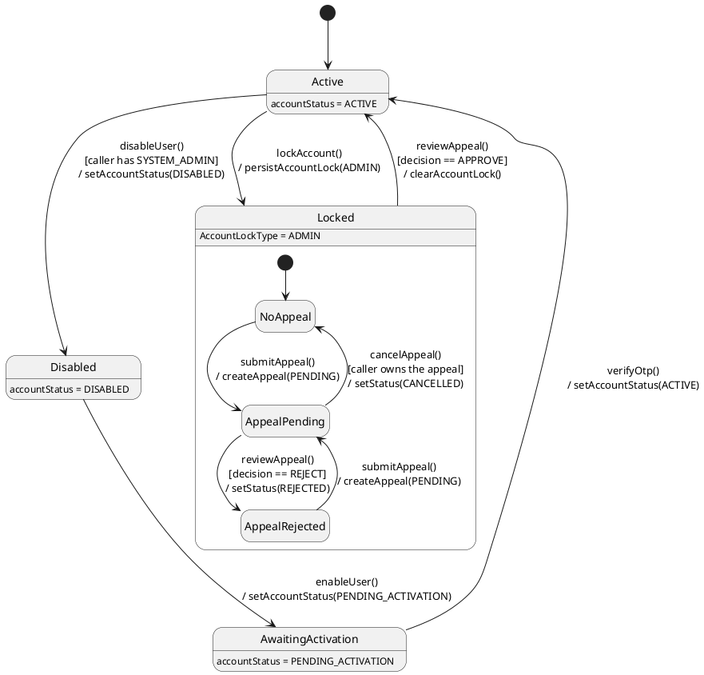

# MF-01 — Admin Account Governance, Security, and Audit

| Field | Value |
| --- | --- |
| Major Feature | **MF-01 — Account, Trust & Access Control** |
| Function package | **Admin Account Governance, Security, and Audit** |
| Code-first use cases | `UC-AD-01, UC-AD-02, UC-AD-03, UC-AD-04, UC-AD-05` |
| Status | **Draft** |
| Baseline | Current reachable code and tests, 2026-08-23 |
| Diagram convention | `../sequence-diagram-skill.md`; explicit lifeline order, numbered messages, balanced activation |

## 1. Tổng quan luồng chính

Design administrative account, staff, appeal, audit, and system-configuration operations.

- **UC-AD-01 — Manage User Accounts and Roles:** Search and inspect user accounts, sessions/activity, update eligible account status, and assign an allowed role.
- **UC-AD-02 — Provision Staff Accounts:** Create a supported staff account with an allowed administrative/content/moderation role and bounded initial credential delivery.
- **UC-AD-03 — Review Account Lock Appeals:** List and inspect pending account-lock appeals and record an eligible approval/rejection decision.
- **UC-AD-04 — Inspect Audit Activity:** Inspect the supported recent audit projection exposed to authorized administrators.
- **UC-AD-05 — Configure System and Maintenance Mode:** Read and update supported system configuration, including maintenance-mode behavior.

The code is authoritative for routes, handlers, delegation, authorization, and persisted state. Report1 section 6.2 is authoritative for the Major Feature name. Historical UC numbering and obsolete triage plans are not design inputs.

## 2. Function Design — Code Traceability

| UC | Actor goal | Method / route | Exact handler | Delegated function | Authorization | Source |
| --- | --- | --- | --- | --- | --- | --- |
| `UC-AD-01` | Manage User Accounts and Roles | `GET /api/v1/admin/users` | `AdminUserController.searchUsers()` | `AdminUserService.searchUsers()` → `UserRepository.search()` | hasRole('SYSTEM_ADMIN') | `05_Development/CareBridgeAPI/src/main/java/com/carebridge/backend/identity/admin/controller/AdminUserController.java` |
| `UC-AD-01` | Manage User Accounts and Roles | `GET /api/v1/admin/users/{userId}` | `AdminUserController.getUser()` | `AdminUserService.getUser()` → `UserRepository.findById()` | hasRole('SYSTEM_ADMIN') | `05_Development/CareBridgeAPI/src/main/java/com/carebridge/backend/identity/admin/controller/AdminUserController.java` |
| `UC-AD-01` | Manage User Accounts and Roles | `GET /api/v1/admin/users/{userId}/activity` | `AdminUserController.getUserActivity()` | `AdminUserService.getUserActivity()` → `AdminUserMonitoringRepository.findActivity()` | hasRole('SYSTEM_ADMIN') | `05_Development/CareBridgeAPI/src/main/java/com/carebridge/backend/identity/admin/controller/AdminUserController.java` |
| `UC-AD-01` | Manage User Accounts and Roles | `PATCH /api/v1/admin/users/{userId}/role` | `AdminRoleController.updateRole()` | `AdminRoleService.updateRole()` → `UserRepository.findById()` | hasRole('SYSTEM_ADMIN') | `05_Development/CareBridgeAPI/src/main/java/com/carebridge/backend/identity/admin/controller/AdminRoleController.java` |
| `UC-AD-01` | Manage User Accounts and Roles | `GET /api/v1/admin/users/{userId}/sessions` | `AdminUserController.getUserSessions()` | `AdminUserService.getUserSessions()` → `AdminUserMonitoringRepository.findSessions()` | hasRole('SYSTEM_ADMIN') | `05_Development/CareBridgeAPI/src/main/java/com/carebridge/backend/identity/admin/controller/AdminUserController.java` |
| `UC-AD-01` | Manage User Accounts and Roles | `PATCH /api/v1/admin/users/{userId}/status` | `AdminUserController.updateStatus()` | `AdminUserService.updateStatus()` → `UserRepository.findByIdForUpdate()` | hasRole('SYSTEM_ADMIN') | `05_Development/CareBridgeAPI/src/main/java/com/carebridge/backend/identity/admin/controller/AdminUserController.java` |
| `UC-AD-02` | Provision Staff Accounts | `POST /api/v1/admin/staff-accounts` | `AdminStaffController.createStaffAccount()` | `AdminStaffService.createStaffAccount()` → `UserRepository.existsByEmail()` | hasRole('SYSTEM_ADMIN') | `05_Development/CareBridgeAPI/src/main/java/com/carebridge/backend/identity/admin/controller/AdminStaffController.java` |
| `UC-AD-03` | Review Account Lock Appeals | `GET /api/v1/admin/account-lock-appeals` | `AdminAccountLockAppealController.list()` | `AccountLockAppealService.list()` → `AccountLockAppealRepository.findByStatusOrderBySubmittedAtDesc()` | hasRole('SYSTEM_ADMIN') | `05_Development/CareBridgeAPI/src/main/java/com/carebridge/backend/identity/admin/controller/AdminAccountLockAppealController.java` |
| `UC-AD-03` | Review Account Lock Appeals | `GET /api/v1/admin/account-lock-appeals/{appealId}` | `AdminAccountLockAppealController.get()` | `AccountLockAppealService.get()` → `AccountLockAppealRepository.findById()` | hasRole('SYSTEM_ADMIN') | `05_Development/CareBridgeAPI/src/main/java/com/carebridge/backend/identity/admin/controller/AdminAccountLockAppealController.java` |
| `UC-AD-03` | Review Account Lock Appeals | `PATCH /api/v1/admin/account-lock-appeals/{appealId}/review` | `AdminAccountLockAppealController.review()` | `AccountLockAppealService.review()` → `AccountLockAppealRepository.findByIdAndStatus()` | hasRole('SYSTEM_ADMIN') | `05_Development/CareBridgeAPI/src/main/java/com/carebridge/backend/identity/admin/controller/AdminAccountLockAppealController.java` |
| `UC-AD-04` | Inspect Audit Activity | `GET /api/v1/admin/audit-logs` | `AuditController.search()` | `AuditService.search()` → `AuditLogRepository.search()` | hasAnyRole('SYSTEM_ADMIN', 'OPERATIONS') | `05_Development/CareBridgeAPI/src/main/java/com/carebridge/backend/audit/controller/AuditController.java` |
| `UC-AD-05` | Configure System and Maintenance Mode | `GET /api/v1/admin/system-configuration` | `SystemConfigurationController.get()` | `SystemConfigurationService.get()` → `SystemConfigurationRepository.findFirstByOrderByCreatedAtAsc()` | hasRole('SYSTEM_ADMIN') | `05_Development/CareBridgeAPI/src/main/java/com/carebridge/backend/systemconfiguration/controller/SystemConfigurationController.java` |
| `UC-AD-05` | Configure System and Maintenance Mode | `PUT /api/v1/admin/system-configuration` | `SystemConfigurationController.update()` | `SystemConfigurationService.update()` → `SystemConfigurationRepository.saveAndFlush()` | hasRole('SYSTEM_ADMIN') | `05_Development/CareBridgeAPI/src/main/java/com/carebridge/backend/systemconfiguration/controller/SystemConfigurationController.java` |

## 3. Class Diagram

This design-level UML follows the current source declarations: fields become attributes, reachable methods become operations, `implements` becomes realization, repository inheritance becomes generalization, and runtime-only calls remain dependencies. A missing layer or ownership relation is not invented.

```plantuml
@startuml ClassDiagram_03AdminAccountGovernanceSecurityandAudit
skinparam classAttributeIconSize 0
skinparam wrapWidth 250
hide empty members

class "AccountLockAppealsPage" as UIAccountLockAppealsPage <<UI>>
class "AdminDashboardPage" as UIAdminDashboardPage <<UI>>
class "CreateStaffAccountPage" as UICreateStaffAccountPage <<UI>>
class "SystemConfigurationPage" as UISystemConfigurationPage <<UI>>
class "UserListPage" as UIUserListPage <<UI>>
class "AdminAccountLockAppealController" as ControllerAdminAccountLockAppealController <<Controller>> {
  - appealService: AccountLockAppealService
  + list(status: AccountLockAppealStatus, page: int, size: int): ResponseEntity<PaginatedResponse<AccountLockAppealResponse>>
}
class "AdminStaffController" as ControllerAdminStaffController <<Controller>> {
  - adminStaffService: AdminStaffService
  + createStaffAccount(request: CreateStaffAccountRequest, principal: Principal): ResponseEntity<ApiResponse<StaffAccountResponse>>
}
class "AdminUserController" as ControllerAdminUserController <<Controller>> {
  - adminUserService: AdminUserService
  + searchUsers(email: String, phone: String, name: String, role: Role, enabled: Boolean, locked: Boolean, page: int, size: int): ResponseEntity<PaginatedResponse<AdminUserSummaryResponse>>
}
class "AuditController" as ControllerAuditController <<Controller>> {
  - auditService: AuditService
  + search(userId: java.util.UUID, action: AuditAction, fromDate: Instant, toDate: Instant, page: int, size: int, principal: Principal): ResponseEntity<PaginatedResponse<com.carebridge.backend.audit.dto.response.AuditLogResponse>>
}
class "SystemConfigurationController" as ControllerSystemConfigurationController <<Controller>> {
  - service: SystemConfigurationService
  + update(request: UpdateSystemConfigurationRequest, principal: Principal): ResponseEntity<ApiResponse<SystemConfigurationResponse>>
}
interface "AccountLockAppealService" as ServiceContractAccountLockAppealService <<Service>> {
  + list(status: AccountLockAppealStatus, pageable: Pageable): Page<AccountLockAppealResponse>
}
class "AccountLockAppealServiceImpl" as ServiceAccountLockAppealServiceImpl <<Service>> {
  - appealRepository: AccountLockAppealRepository
  - userRepository: UserRepository
  - auditService: AuditService
  + list(status: AccountLockAppealStatus, pageable: Pageable): Page<AccountLockAppealResponse>
}
ServiceContractAccountLockAppealService <|.. ServiceAccountLockAppealServiceImpl : implements
interface "AdminStaffService" as ServiceContractAdminStaffService <<Service>> {
  + createStaffAccount(callerUserId: UUID, request: CreateStaffAccountRequest): StaffAccountResponse
}
class "AdminStaffServiceImpl" as ServiceAdminStaffServiceImpl <<Service>> {
  - userRepository: UserRepository
  - passwordComplexityPolicy: PasswordComplexityPolicy
  - emailService: EmailService
  - auditService: AuditService
  + createStaffAccount(callerUserId: UUID, request: CreateStaffAccountRequest): StaffAccountResponse
}
ServiceContractAdminStaffService <|.. ServiceAdminStaffServiceImpl : implements
interface "AdminUserService" as ServiceContractAdminUserService <<Service>> {
  + searchUsers(query: AdminUserSearchQuery, pageable: Pageable): Page<AdminUserSummaryResponse>
}
class "AdminUserServiceImpl" as ServiceAdminUserServiceImpl <<Service>> {
  - userRepository: UserRepository
  - auditService: AuditService
  - adminUserMapper: AdminUserMapper
  - monitoringRepository: AdminUserMonitoringRepository
  - userSessionRepository: UserSessionRepository
  + searchUsers(query: AdminUserSearchQuery, pageable: Pageable): Page<AdminUserSummaryResponse>
}
ServiceContractAdminUserService <|.. ServiceAdminUserServiceImpl : implements
interface "AuditService" as ServiceContractAuditService <<Service>> {
  + search(userId: java.util.UUID, action: AuditAction, fromDate: Instant, toDate: Instant, pageable: Pageable): Page<AuditLogResponse>
}
class "AuditServiceImpl" as ServiceAuditServiceImpl <<Service>> {
  - auditLogRepository: AuditLogRepository
  - auditLogMapper: AuditLogMapper
  - auditEligibilityPolicy: AuditEligibilityPolicy
  - objectMapper: ObjectMapper
  - userRepository: UserRepository
  + search(userId: java.util.UUID, action: AuditAction, fromDate: Instant, toDate: Instant, pageable: Pageable): Page<AuditLogResponse>
}
ServiceContractAuditService <|.. ServiceAuditServiceImpl : implements
interface "SystemConfigurationService" as ServiceContractSystemConfigurationService <<Service>> {
  + update(request: UpdateSystemConfigurationRequest, actorId: UUID): SystemConfigurationResponse
}
class "SystemConfigurationServiceImpl" as ServiceSystemConfigurationServiceImpl <<Service>> {
  - repository: SystemConfigurationRepository
  - auditService: AuditService
  - maintenanceModeService: SystemMaintenanceModeService
  + update(request: UpdateSystemConfigurationRequest, actorId: UUID): SystemConfigurationResponse
}
ServiceContractSystemConfigurationService <|.. ServiceSystemConfigurationServiceImpl : implements
interface "AccountLockAppealRepository" as RepositoryAccountLockAppealRepository <<Repository>> {
  + findByStatusOrderBySubmittedAtDesc(status: AccountLockAppealStatus, pageable: Pageable): Page<AccountLockAppeal>
}
class "AccountLockAppeal" as EntityAccountLockAppeal <<Entity>> {
  - id: UUID
  - userId: UUID
  - lockEpisodeId: UUID
  - reason: String
  - status: AccountLockAppealStatus
  - submittedAt: Instant
  - reviewedBy: UUID
  - reviewedAt: Instant
}
interface "JpaRepository<AccountLockAppeal, UUID>" as RepositoryBaseAccountLockAppealRepository <<Framework>>
RepositoryBaseAccountLockAppealRepository <|-- RepositoryAccountLockAppealRepository : extends
interface "AuditLogRepository" as RepositoryAuditLogRepository <<Repository>> {
  + search(userId: java.util.UUID, action: AuditAction, fromDate: Instant, toDate: Instant, pageable: Pageable): Page<AuditLog>
}
class "AuditLog" as EntityAuditLog <<Entity>> {
  - createdAt: Instant
  - actorType: String
  - actorService: String
  - action: AuditAction
  - entityType: String
  - reasonCode: String
  - careContextType: ChecklistCareContextType
  - newValueJson: String
}
interface "JpaRepository<AuditLog, java.util.UUID>" as RepositoryBaseAuditLogRepository <<Framework>>
RepositoryBaseAuditLogRepository <|-- RepositoryAuditLogRepository : extends
interface "SystemConfigurationRepository" as RepositorySystemConfigurationRepository <<Repository>> {
  + saveAndFlush(entity: SystemConfiguration): SystemConfiguration
}
class "SystemConfiguration" as EntitySystemConfiguration <<Entity>> {
  - id: UUID
  - apiRateLimit: int
  - connectionTimeoutMs: int
  - maxUploadSizeMb: int
  - administratorEmail: String
  - emailAlerts: boolean
  - smsAlerts: boolean
  - webhookAlerts: boolean
}
interface "JpaRepository<SystemConfiguration, UUID>" as RepositoryBaseSystemConfigurationRepository <<Framework>>
RepositoryBaseSystemConfigurationRepository <|-- RepositorySystemConfigurationRepository : extends
interface "UserRepository" as RepositoryUserRepository <<Repository>> {
  + existsByEmail(email: String): boolean
  + search(email: String, phone: String, name: String, role: Role, enabled: Boolean, locked: Boolean, pageable: Pageable): Page<User>
}
class "User" as EntityUser <<Entity>> {
  - person: Person
  - phone: String
  - email: String
  - passwordHash: String
  - name: String
  - displayName: String
  - dateOfBirth: LocalDate
  - area: String
}
interface "JpaRepository<User, java.util.UUID>" as RepositoryBaseUserRepository <<Framework>>
RepositoryBaseUserRepository <|-- RepositoryUserRepository : extends
class "PostgreSQL" as DB <<Database>>
UIAccountLockAppealsPage ..> ControllerAdminAccountLockAppealController : invokes API
UIAdminDashboardPage ..> ControllerAuditController : invokes API
UICreateStaffAccountPage ..> ControllerAdminStaffController : invokes API
UISystemConfigurationPage ..> ControllerSystemConfigurationController : invokes API
UIUserListPage ..> ControllerAdminUserController : invokes API
ControllerAdminAccountLockAppealController --> ServiceContractAccountLockAppealService : delegates
ControllerAdminStaffController --> ServiceContractAdminStaffService : delegates
ControllerAdminUserController --> ServiceContractAdminUserService : delegates
ControllerAuditController --> ServiceContractAuditService : delegates
ControllerSystemConfigurationController --> ServiceContractSystemConfigurationService : delegates
ServiceAccountLockAppealServiceImpl --> RepositoryAccountLockAppealRepository : reads / writes
ServiceAdminStaffServiceImpl --> RepositoryUserRepository : reads / writes
ServiceAdminUserServiceImpl --> RepositoryUserRepository : reads / writes
ServiceAuditServiceImpl --> RepositoryAuditLogRepository : reads / writes
ServiceSystemConfigurationServiceImpl --> RepositorySystemConfigurationRepository : reads / writes
RepositoryAccountLockAppealRepository ..> EntityAccountLockAppeal : maps
RepositoryAuditLogRepository ..> EntityAuditLog : maps
RepositorySystemConfigurationRepository ..> EntitySystemConfiguration : maps
RepositoryUserRepository ..> EntityUser : maps
RepositoryAccountLockAppealRepository ..> DB : persists
RepositoryAuditLogRepository ..> DB : persists
RepositorySystemConfigurationRepository ..> DB : persists
RepositoryUserRepository ..> DB : persists
@enduml
```

**Figure 1 — Class Diagram: Admin Account Governance, Security, and Audit**

## 4. Sequence Diagram — Main Flow

Each group is a representative reachable main flow. The full endpoint surface remains in the Function Design table above.

```plantuml
@startuml
skinparam shadowing false
skinparam maxMessageSize 90
title Admin Account Governance, Security, and Audit — code-reachable representative flows

actor "System Admin" as ASystem_Admin
boundary "UserListPage" as UIUserListPage <<boundary>>
boundary "CreateStaffAccountPage" as UICreateStaffAccountPage <<boundary>>
boundary "AccountLockAppealsPage" as UIAccountLockAppealsPage <<boundary>>
boundary "AdminDashboardPage" as UIAdminDashboardPage <<boundary>>
boundary "SystemConfigurationPage" as UISystemConfigurationPage <<boundary>>
participant "JwtAuthenticationFilter" as JWT <<middleware>>
control "AdminUserController" as CAdminUserController <<control>>
control "AdminStaffController" as CAdminStaffController <<control>>
control "AdminAccountLockAppealController" as CAdminAccountLockAppealController <<control>>
control "AuditController" as CAuditController <<control>>
control "SystemConfigurationController" as CSystemConfigurationController <<control>>
participant "AdminUserService" as SAdminUserService <<service>>
participant "AdminStaffService" as SAdminStaffService <<service>>
participant "AccountLockAppealService" as SAccountLockAppealService <<service>>
participant "AuditService" as SAuditService <<service>>
participant "SystemConfigurationService" as SSystemConfigurationService <<service>>
participant "UserRepository" as RUserRepository <<repository>>
participant "AccountLockAppealRepository" as RAccountLockAppealRepository <<repository>>
participant "AuditLogRepository" as RAuditLogRepository <<repository>>
participant "SystemConfigurationRepository" as RSystemConfigurationRepository <<repository>>
database "PostgreSQL" as DB

group UC-AD-01 — Manage User Accounts and Roles [searchUsers()]
ASystem_Admin -> UIUserListPage : 1. submitUserSearch(filters)
activate UIUserListPage
alt [authorized request succeeds]
UIUserListPage -> JWT : 2a. GET /api/v1/admin/users with bearer token
activate JWT
JWT -> CAdminUserController : 2a-1. searchUsers(email, phone, name, role, ...)
activate CAdminUserController
CAdminUserController -> SAdminUserService : 2a-2. searchUsers(query, pageable)
activate SAdminUserService
SAdminUserService -> RUserRepository : 2a-3. search(email, phone, name, role, ...)
activate RUserRepository
RUserRepository -> DB : 2a-4. SELECT User via search()
activate DB
DB --> RUserRepository : 2a-5. userQueryResult
deactivate DB
RUserRepository --> SAdminUserService : 2a-6. userPage
deactivate RUserRepository
SAdminUserService --> CAdminUserController : 2a-7. adminUserSummaryResponsePage
deactivate SAdminUserService
CAdminUserController --> JWT : 2a-8. adminUserSummaryResponse
deactivate CAdminUserController
JWT --> UIUserListPage : 2a-9. 200 OK — adminUserSummaryResponse
deactivate JWT
UIUserListPage --> ASystem_Admin : 2a-10. displayFilteredUsers()
else [authentication or role authorization fails]
UIUserListPage -> JWT : 2b. GET /api/v1/admin/users with invalid or insufficient bearer token
activate JWT
JWT --> UIUserListPage : 2b-1. 401 Unauthorized / 403 Forbidden
deactivate JWT
UIUserListPage --> ASystem_Admin : 2b-2. showAuthenticationOrAuthorizationError(message)
end
deactivate UIUserListPage
end

group UC-AD-02 — Provision Staff Accounts [createStaffAccount()]
ASystem_Admin -> UICreateStaffAccountPage : 3. submitStaffAccountDetails()
activate UICreateStaffAccountPage
alt [authorized request succeeds]
UICreateStaffAccountPage -> JWT : 4a. POST /api/v1/admin/staff-accounts with bearer token
activate JWT
JWT -> CAdminStaffController : 4a-1. createStaffAccount(request, principal)
activate CAdminStaffController
CAdminStaffController -> SAdminStaffService : 4a-2. createStaffAccount(callerUserId, request)
activate SAdminStaffService
SAdminStaffService -> RUserRepository : 4a-3. existsByEmail(email)
activate RUserRepository
RUserRepository -> DB : 4a-4. SELECT User via existsByEmail()
activate DB
DB --> RUserRepository : 4a-5. userQueryResult
deactivate DB
RUserRepository --> SAdminStaffService : 4a-6. booleanResult
deactivate RUserRepository
SAdminStaffService --> CAdminStaffController : 4a-7. staffAccountResponse
deactivate SAdminStaffService
CAdminStaffController --> JWT : 4a-8. staffAccountResponse
deactivate CAdminStaffController
JWT --> UICreateStaffAccountPage : 4a-9. 201 Created — staffAccountResponse
deactivate JWT
UICreateStaffAccountPage --> ASystem_Admin : 4a-10. displayProvisionedStaffAccount()
else [authentication or role authorization fails]
UICreateStaffAccountPage -> JWT : 4b. POST /api/v1/admin/staff-accounts with invalid or insufficient bearer token
activate JWT
JWT --> UICreateStaffAccountPage : 4b-1. 401 Unauthorized / 403 Forbidden
deactivate JWT
UICreateStaffAccountPage --> ASystem_Admin : 4b-2. showAuthenticationOrAuthorizationError(message)
end
deactivate UICreateStaffAccountPage
end

group UC-AD-03 — Review Account Lock Appeals [list()]
ASystem_Admin -> UIAccountLockAppealsPage : 5. openAccountLockAppeals()
activate UIAccountLockAppealsPage
alt [authorized request succeeds]
UIAccountLockAppealsPage -> JWT : 6a. GET /api/v1/admin/account-lock-appeals with bearer token
activate JWT
JWT -> CAdminAccountLockAppealController : 6a-1. list(status, page, size)
activate CAdminAccountLockAppealController
CAdminAccountLockAppealController -> SAccountLockAppealService : 6a-2. list(status, pageable)
activate SAccountLockAppealService
SAccountLockAppealService -> RAccountLockAppealRepository : 6a-3. findByStatusOrderBySubmittedAtDesc(status, pageable)
activate RAccountLockAppealRepository
RAccountLockAppealRepository -> DB : 6a-4. SELECT AccountLockAppeal via findByStatusOrderBySubmittedAtDesc()
activate DB
DB --> RAccountLockAppealRepository : 6a-5. accountLockAppealQueryResult
deactivate DB
RAccountLockAppealRepository --> SAccountLockAppealService : 6a-6. accountLockAppealPage
deactivate RAccountLockAppealRepository
SAccountLockAppealService --> CAdminAccountLockAppealController : 6a-7. accountLockAppealResponsePage
deactivate SAccountLockAppealService
CAdminAccountLockAppealController --> JWT : 6a-8. accountLockAppealResponse
deactivate CAdminAccountLockAppealController
JWT --> UIAccountLockAppealsPage : 6a-9. 200 OK — accountLockAppealResponse
deactivate JWT
UIAccountLockAppealsPage --> ASystem_Admin : 6a-10. displayAccountLockAppeals()
else [authentication or role authorization fails]
UIAccountLockAppealsPage -> JWT : 6b. GET /api/v1/admin/account-lock-appeals with invalid or insufficient bearer token
activate JWT
JWT --> UIAccountLockAppealsPage : 6b-1. 401 Unauthorized / 403 Forbidden
deactivate JWT
UIAccountLockAppealsPage --> ASystem_Admin : 6b-2. showAuthenticationOrAuthorizationError(message)
end
deactivate UIAccountLockAppealsPage
end

group UC-AD-04 — Inspect Audit Activity [search()]
ASystem_Admin -> UIAdminDashboardPage : 7. submitAuditSearch(filters)
activate UIAdminDashboardPage
alt [authorized request succeeds]
UIAdminDashboardPage -> JWT : 8a. GET /api/v1/admin/audit-logs with bearer token
activate JWT
JWT -> CAuditController : 8a-1. search(userId, action, fromDate, toDate, ...)
activate CAuditController
CAuditController -> SAuditService : 8a-2. search(userId, action, fromDate, toDate, ...)
activate SAuditService
SAuditService -> RAuditLogRepository : 8a-3. search(userId, action, fromDate, toDate, ...)
activate RAuditLogRepository
RAuditLogRepository -> DB : 8a-4. SELECT AuditLog via search()
activate DB
DB --> RAuditLogRepository : 8a-5. auditLogQueryResult
deactivate DB
RAuditLogRepository --> SAuditService : 8a-6. auditLogPage
deactivate RAuditLogRepository
SAuditService --> CAuditController : 8a-7. auditLogResponsePage
deactivate SAuditService
CAuditController --> JWT : 8a-8. auditLogResponse
deactivate CAuditController
JWT --> UIAdminDashboardPage : 8a-9. 200 OK — auditLogResponse
deactivate JWT
UIAdminDashboardPage --> ASystem_Admin : 8a-10. displayAuditEvents()
else [authentication or role authorization fails]
UIAdminDashboardPage -> JWT : 8b. GET /api/v1/admin/audit-logs with invalid or insufficient bearer token
activate JWT
JWT --> UIAdminDashboardPage : 8b-1. 401 Unauthorized / 403 Forbidden
deactivate JWT
UIAdminDashboardPage --> ASystem_Admin : 8b-2. showAuthenticationOrAuthorizationError(message)
else [validation fails]
UIAdminDashboardPage -> JWT : 8c. GET /api/v1/admin/audit-logs with bearer token
activate JWT
JWT -> CAuditController : 8c-1. search(userId, action, fromDate, toDate, ...)
activate CAuditController
CAuditController -> SAuditService : 8c-2. search(userId, action, fromDate, toDate, ...)
activate SAuditService
SAuditService --> CAuditController : 8c-3. validationError
deactivate SAuditService
CAuditController --> JWT : 8c-4. validationError
deactivate CAuditController
JWT --> UIAdminDashboardPage : 8c-5. 400 Bad Request — validationError
deactivate JWT
UIAdminDashboardPage --> ASystem_Admin : 8c-6. showAuditSearchError(message)
end
deactivate UIAdminDashboardPage
end

group UC-AD-05 — Configure System and Maintenance Mode [update()]
ASystem_Admin -> UISystemConfigurationPage : 9. submitSystemConfigurationChanges()
activate UISystemConfigurationPage
alt [authorized request succeeds]
UISystemConfigurationPage -> JWT : 10a. PUT /api/v1/admin/system-configuration with bearer token
activate JWT
JWT -> CSystemConfigurationController : 10a-1. update(request, principal)
activate CSystemConfigurationController
CSystemConfigurationController -> SSystemConfigurationService : 10a-2. update(request, actorId)
activate SSystemConfigurationService
SSystemConfigurationService -> RSystemConfigurationRepository : 10a-3. saveAndFlush()
activate RSystemConfigurationRepository
RSystemConfigurationRepository -> DB : 10a-4. INSERT / UPDATE SystemConfiguration
activate DB
DB --> RSystemConfigurationRepository : 10a-5. persistedSystemConfiguration
deactivate DB
RSystemConfigurationRepository --> SSystemConfigurationService : 10a-6. persistedSystemConfiguration
deactivate RSystemConfigurationRepository
SSystemConfigurationService --> CSystemConfigurationController : 10a-7. systemConfigurationResponse
deactivate SSystemConfigurationService
CSystemConfigurationController --> JWT : 10a-8. systemConfigurationResponse
deactivate CSystemConfigurationController
JWT --> UISystemConfigurationPage : 10a-9. 200 OK — systemConfigurationResponse
deactivate JWT
UISystemConfigurationPage --> ASystem_Admin : 10a-10. displayUpdatedSystemConfiguration()
else [authentication or role authorization fails]
UISystemConfigurationPage -> JWT : 10b. PUT /api/v1/admin/system-configuration with invalid or insufficient bearer token
activate JWT
JWT --> UISystemConfigurationPage : 10b-1. 401 Unauthorized / 403 Forbidden
deactivate JWT
UISystemConfigurationPage --> ASystem_Admin : 10b-2. showAuthenticationOrAuthorizationError(message)
end
deactivate UISystemConfigurationPage
end
@enduml
```

**Brief Explanation:**

1. The actor starts each grouped use case through the code-reachable UI boundary.
2. Protected requests pass through JwtAuthenticationFilter; rejected credentials or roles return 401 Unauthorized or 403 Forbidden without invoking the controller.
3. The controller receives the request and invokes the exact delegated operation resolved from the current source.
4. The service applies the business policy and coordinates downstream collaborators while its caller remains active.
5. The repository executes the represented persistence operation and returns the stored or queried result before its activation ends.
6. The HTTP response unwinds through middleware when present, and the UI renders the server-authoritative outcome to the actor.

## 5. State Chart Diagram

The lifecycle below belongs to **The administered User account, with the AccountLockAppeal lifecycle nested inside a locked account**. Its states are the persisted constants declared in the sources cited under this diagram, and every transition, guard, and action is taken from the service method that writes that constant. No unreachable state is introduced.

**Figure 2 — State Chart Diagram: Admin Account Governance, Security, and Audit**

**Brief Explanation:**

1. An administered account starts in `Active`; every transition below is written by `AdminUserServiceImpl` under a SYSTEM_ADMIN guard and is recorded through `AuditService`.
2. The event `disableUser()` sets `accountStatus = DISABLED`, and re-enabling does not restore access directly — `enableUser()` sets `PENDING_ACTIVATION` so the holder must re-prove the account.
3. The event `lockAccount()` persists an `AccountLockType.ADMIN` lock, which is the only lock type an appeal can contest.
4. Inside `Locked`, `submitAppeal()` creates an appeal in `PENDING`; the guard on `reviewAppeal()` splits the outcome between `APPROVED` and `REJECTED`.
5. Only `decision == APPROVE` clears the lock and returns the account to `Active`; a rejection leaves the account locked with the appeal recorded as `REJECTED`.
6. A rejected appeal is not terminal for the account — `submitAppeal()` may open a new `PENDING` appeal, so the nested region re-enters `AppealPending`.

**State sources:**

- `05_Development/CareBridgeAPI/src/main/java/com/carebridge/backend/identity/admin/service/impl/AdminUserServiceImpl.java`
- `05_Development/CareBridgeAPI/src/main/java/com/carebridge/backend/identity/admin/entity/AccountLockAppealStatus.java`
- `05_Development/CareBridgeAPI/src/main/java/com/carebridge/backend/identity/admin/service/impl/AccountLockAppealServiceImpl.java`
- `05_Development/CareBridgeAPI/src/main/java/com/carebridge/backend/security/entity/AccountLockType.java`
- `05_Development/CareBridgeAPI/src/main/java/com/carebridge/backend/audit/entity/AuditAction.java`

## 6. Business Rules Applied

| UC | Enforced business/security rules | Known boundary or gap |
| --- | --- | --- |
| `UC-AD-01` | All mutations are System-Admin-only and audited. The role vocabulary comes from current server enums; UI options cannot grant unsupported roles. | No additional gap recorded in the code-first baseline. |
| `UC-AD-02` | Only System Admin may provision staff. Allowed role, uniqueness, temporary credential, and audit behavior are server authoritative. | No additional gap recorded in the code-first baseline. |
| `UC-AD-03` | Only a pending eligible appeal can be reviewed. The decision is audited and is distinct from general audit-log inspection. | No additional gap recorded in the code-first baseline. |
| `UC-AD-04` | Audit access is restricted and returned payloads must not contain raw secrets or unnecessary health data. There is no separate full audit-log page in the current Web router. | No additional gap recorded in the code-first baseline. |
| `UC-AD-05` | Only System Admin may mutate configuration. Validation, version/concurrency, maintenance allow-list, and audit behavior are server authoritative. | No additional gap recorded in the code-first baseline. |

## 7. Partial / Excluded Boundaries

- No extra release boundary beyond the code-first UC catalogue is introduced by this package.

## 8. Code and Test Evidence

- `05_Development/CareBridgeAPI/src/main/java/com/carebridge/backend/identity/admin/controller/AdminUserController.java`
- `05_Development/CareBridgeAPI/src/main/java/com/carebridge/backend/identity/admin/controller/AdminRoleController.java`
- `05_Development/CareBridgeWebApp/src/features/admin/pages/UserListPage.tsx`
- `05_Development/CareBridgeWebApp/src/features/admin/pages/UserDetailPage.tsx`
- `05_Development/CareBridgeAPI/src/test/java/com/carebridge/backend/identity/admin/controller/AdminUserControllerIntegrationTest.java`
- `05_Development/CareBridgeAPI/src/test/java/com/carebridge/backend/identity/admin/service/AdminRoleServiceImplTest.java`
- `05_Development/CareBridgeWebApp/src/features/admin/pages/UserListPage.test.tsx`
- `05_Development/CareBridgeAPI/src/main/java/com/carebridge/backend/identity/admin/controller/AdminStaffController.java`
- `05_Development/CareBridgeWebApp/src/features/admin/pages/CreateStaffAccountPage.tsx`
- `05_Development/CareBridgeAPI/src/test/java/com/carebridge/backend/identity/admin/controller/AdminStaffControllerTest.java`
- `05_Development/CareBridgeAPI/src/test/java/com/carebridge/backend/identity/admin/service/AdminStaffServiceImplTest.java`
- `05_Development/CareBridgeAPI/src/main/java/com/carebridge/backend/identity/admin/controller/AdminAccountLockAppealController.java`
- `05_Development/CareBridgeWebApp/src/features/admin/pages/AccountLockAppealsPage.tsx`
- `05_Development/CareBridgeWebApp/src/features/admin/pages/AccountLockAppealDetailPage.tsx`
- `05_Development/CareBridgeAPI/src/test/java/com/carebridge/backend/identity/admin/service/AccountLockAppealServiceImplTest.java`
- `05_Development/CareBridgeAPI/src/main/java/com/carebridge/backend/audit/controller/AuditController.java`
- `05_Development/CareBridgeWebApp/src/features/admin/models/auditLog.ts`
- `05_Development/CareBridgeWebApp/src/features/admin/pages/AdminDashboardPage.tsx`
- `05_Development/CareBridgeAPI/src/test/java/com/carebridge/backend/audit/controller/AuditControllerTest.java`
- `05_Development/CareBridgeAPI/src/test/java/com/carebridge/backend/audit/AuditServiceImplTest.java`
- `05_Development/CareBridgeWebApp/src/features/admin/models/auditLog.test.ts`
- `05_Development/CareBridgeAPI/src/main/java/com/carebridge/backend/systemconfiguration/controller/SystemConfigurationController.java`
- `05_Development/CareBridgeWebApp/src/features/aiRuleManagement/pages/SystemConfigurationPage.tsx`
- `05_Development/CareBridgeAPI/src/main/java/com/carebridge/backend/systemconfiguration/security/MaintenanceModeFilter.java`
- `05_Development/CareBridgeAPI/src/test/java/com/carebridge/backend/systemconfiguration/SystemConfigurationControllerSecurityTest.java`
- `05_Development/CareBridgeAPI/src/test/java/com/carebridge/backend/systemconfiguration/SystemConfigurationServiceImplTest.java`
- `05_Development/CareBridgeAPI/src/test/java/com/carebridge/backend/systemconfiguration/MaintenanceModeFilterTest.java`
- `05_Development/CareBridgeWebApp/src/features/aiRuleManagement/pages/SystemConfigurationPage.test.tsx`
