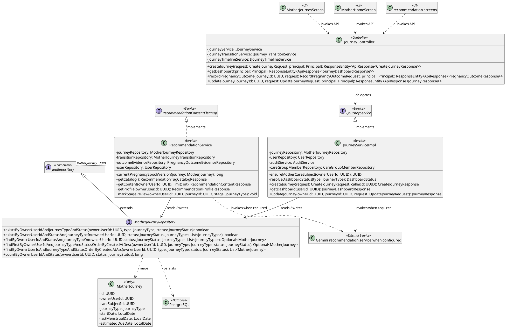
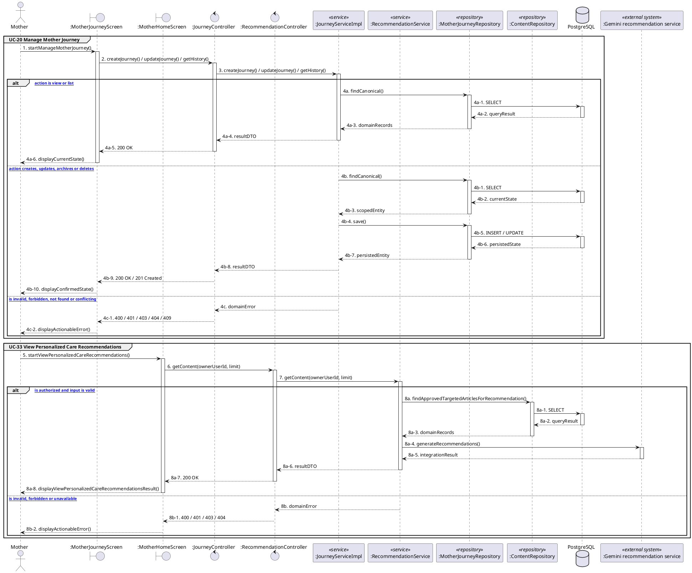

# MF-02 / Spec 01 — Mother Journey Lifecycle and Dashboard

| Field | Value |
| --- | --- |
| Status | Draft |
| Use Cases Covered | UC-20 Manage Mother Journey; UC-33 View Personalized Care Recommendations |
| Use Case Group | Mobile App |
| Platform | Mother Mobile App; Backend |
| Primary Actors | Mother |
| In Scope | Preconception, pregnancy and postpartum journey state |
| Explicitly Excluded | Placeholder journey-update route as a separate flow |
| Implementation Trace | UI: MotherJourneyScreen, MotherHomeScreen, recommendation screens; Controller: JourneyController; Service: JourneyServiceImpl, RecommendationService; Repository: MotherJourneyRepository; Entity: MotherJourney |

## 1. Tổng quan luồng chính (Main Flow Overview)

Preconception, pregnancy and postpartum journey state. The flow starts only from the reachable UI or system trigger named in the metadata. The Backend rechecks authentication, role, ownership, membership, consent and current state as applicable; client-side visibility alone never grants access. A confirmed mutation is persisted before the UI displays success. External-service failure returns a safe retry state and must not fabricate completion.

## 2. Class Diagram

**Figure 1 — Class Diagram: Mother Journey Lifecycle and Dashboard**

## 3. Sequence Diagram — Main Flow

**Figure 2 — Sequence Diagram: Mother Journey Lifecycle and Dashboard Main Flow**

**Brief Explanation:**

1. The diagram separates the implemented goals covered by this specification: UC-20 Manage Mother Journey; UC-33 View Personalized Care Recommendations.
2. Each actor action enters through the reachable mobile or web boundary and invokes the exact controller operation exposed by the current Backend.
3. The controller delegates to the mapped service operation; read branches query scoped records, while mutation branches load the current state before persisting the requested transition.
4. Repository calls and PostgreSQL responses are shown explicitly, including call-stack activation and dashed return messages.
5. Invalid, unauthorized, missing or conflicting requests return an actionable error without displaying a false success state.
6. External systems are invoked only for the mapped use cases; notification dispatches are asynchronous, while integrations that return data remain synchronous.

## 4. Business Rules Applied

- Access is enforced server-side using the current actor, role, ownership, membership and consent scope.
- Preconception, pregnancy and postpartum journey state.
- The following remains outside this contract: Placeholder journey-update route as a separate flow.
- Retries must not duplicate confirmed records, transitions, notifications or external side effects.
- Sensitive health, identity, moderation, location and safety operations retain the minimum required audit evidence.
