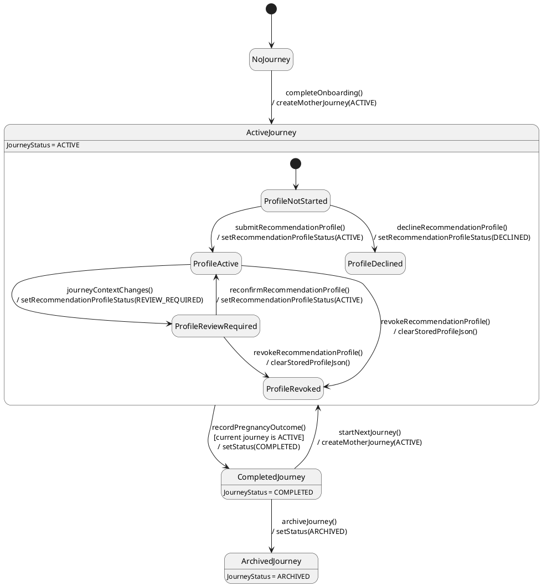

# MF-02 — Mother Journey Onboarding, Lifecycle, and Recommendations

| Field | Value |
| --- | --- |
| Major Feature | **MF-02 — Mother Care Journey** |
| Function package | **Mother Journey Onboarding, Lifecycle, and Recommendations** |
| Code-first use cases | `UC-MH-01, UC-MH-02, UC-MH-03, UC-MH-04, UC-MH-05, UC-MH-06` |
| Status | **Draft** |
| Baseline | Current reachable code and tests, 2026-08-23 |
| Diagram convention | `../sequence-diagram-skill.md`; explicit lifeline order, numbered messages, balanced activation |

## 1. Tổng quan luồng chính

Design the code-reachable journey lifecycle and personalized content projection.

- **UC-MH-01 — Complete Journey Consent and Stage Onboarding:** Complete journey consent and choose the supported maternal stage before entering stage-specific care flows.
- **UC-MH-02 — Create or Update Maternal Journey:** Create a stage-specific maternal journey or update supported fields of an owned active journey.
- **UC-MH-03 — Record Pregnancy Outcome and Transition:** Record an outcome for an eligible pregnancy journey and transition to supported postpartum or baby-care state.
- **UC-MH-04 — View Journey Dashboard, History, and Timeline:** View the current journey dashboard plus server-projected history and timeline for an owned maternal journey.
- **UC-MH-05 — Manage Recommendation Profile:** Create or update the consent-gated preference/profile data used by personalized recommendations.
- **UC-MH-06 — Browse Personalized Recommendations:** Browse stage-aware verified content recommendations derived from the stored recommendation profile.

The code is authoritative for routes, handlers, delegation, authorization, and persisted state. Report1 section 6.2 is authoritative for the Major Feature name. Historical UC numbering and obsolete triage plans are not design inputs.

## 2. Function Design — Code Traceability

| UC | Actor goal | Method / route | Exact handler | Delegated function | Authorization | Source |
| --- | --- | --- | --- | --- | --- | --- |
| `UC-MH-01` | Complete Journey Consent and Stage Onboarding | `POST /api/v1/journey-onboarding` | `JourneyOnboardingController.submit()` | `IJourneyOnboardingService.submit()` → `MotherBaselineContextRepository.acquireOwnerLock()` | hasRole('MOTHER') | `05_Development/CareBridgeAPI/src/main/java/com/carebridge/backend/journey/controller/JourneyOnboardingController.java` |
| `UC-MH-01` | Complete Journey Consent and Stage Onboarding | `GET /api/v1/journey-onboarding/status` | `JourneyOnboardingController.status()` | `IJourneyOnboardingService.getStatus()` → `MotherBaselineContextRepository.findTopByOwnerUserIdOrderByRevisionDesc()` | hasRole('MOTHER') | `05_Development/CareBridgeAPI/src/main/java/com/carebridge/backend/journey/controller/JourneyOnboardingController.java` |
| `UC-MH-02` | Create or Update Maternal Journey | `POST /api/v1/journeys` | `JourneyController.createJourney()` | `IJourneyService.createJourney()` → `UserRepository.findById()` | isAuthenticated() | `05_Development/CareBridgeAPI/src/main/java/com/carebridge/backend/journey/controller/JourneyController.java` |
| `UC-MH-02` | Create or Update Maternal Journey | `PUT /api/v1/journeys/{journeyId}` | `JourneyController.updateJourney()` | `IJourneyService.updateJourney()` → `MotherJourneyRepository.findById()` | hasRole('MOTHER') | `05_Development/CareBridgeAPI/src/main/java/com/carebridge/backend/journey/controller/JourneyController.java` |
| `UC-MH-03` | Record Pregnancy Outcome and Transition | `POST /api/v1/journeys/{journeyId}/pregnancy-outcomes` | `JourneyController.recordPregnancyOutcome()` | `IJourneyTransitionService.recordPregnancyOutcome()` → `MotherJourneyRepository.findByIdForUpdate()` | hasRole('MOTHER') | `05_Development/CareBridgeAPI/src/main/java/com/carebridge/backend/journey/controller/JourneyController.java` |
| `UC-MH-04` | View Journey Dashboard, History, and Timeline | `GET /api/v1/journeys/me/dashboard` | `JourneyController.getDashboard()` | `IJourneyService.getDashboard()` → `MotherJourneyRepository.findByOwnerUserIdAndStatusAndJourneyTypeIn()` | hasAnyRole('MOTHER', 'FAMILY') | `05_Development/CareBridgeAPI/src/main/java/com/carebridge/backend/journey/controller/JourneyController.java` |
| `UC-MH-04` | View Journey Dashboard, History, and Timeline | `GET /api/v1/journeys/{journeyId}/history` | `JourneyController.getHistory()` | `IJourneyService.getHistory()` | hasRole('MOTHER') | `05_Development/CareBridgeAPI/src/main/java/com/carebridge/backend/journey/controller/JourneyController.java` |
| `UC-MH-04` | View Journey Dashboard, History, and Timeline | `GET /api/v1/journeys/{journeyId}/timeline` | `JourneyController.getTimeline()` | `IJourneyTimelineService.getTimeline()` → `MotherJourneyRepository.existsByIdAndOwnerUserId()` | hasRole('MOTHER') | `05_Development/CareBridgeAPI/src/main/java/com/carebridge/backend/journey/controller/JourneyController.java` |
| `UC-MH-05` | Manage Recommendation Profile | `GET /api/v1/recommendations/profile` | `RecommendationController.getProfile()` | `RecommendationService.getProfile()` → `ConsentGrantRepository.findLatestRecommendationGrant()` | hasRole('MOTHER') | `05_Development/CareBridgeAPI/src/main/java/com/carebridge/backend/recommendation/controller/RecommendationController.java` |
| `UC-MH-05` | Manage Recommendation Profile | `PUT /api/v1/recommendations/profile` | `RecommendationController.putProfile()` | `RecommendationService.putProfile()` → `UserRepository.findById()` | hasRole('MOTHER') | `05_Development/CareBridgeAPI/src/main/java/com/carebridge/backend/recommendation/controller/RecommendationController.java` |
| `UC-MH-06` | Browse Personalized Recommendations | `GET /api/v1/recommendations/content` | `RecommendationController.getContent()` | `RecommendationService.getContent()` | hasAnyRole('MOTHER', 'FAMILY') | `05_Development/CareBridgeAPI/src/main/java/com/carebridge/backend/recommendation/controller/RecommendationController.java` |

## 3. Class Diagram

This design-level UML follows the current source declarations: fields become attributes, reachable methods become operations, `implements` becomes realization, repository inheritance becomes generalization, and runtime-only calls remain dependencies. A missing layer or ownership relation is not invented.

```plantuml
@startuml ClassDiagram_01MotherJourneyOnboardingLifecycleandRecommendations
skinparam classAttributeIconSize 0
skinparam wrapWidth 250
hide empty members

class "JourneySetupScreen" as UIJourneySetupScreen <<UI>>
class "MotherHomeScreen" as UIMotherHomeScreen <<UI>>
class "MotherJourneyScreen" as UIMotherJourneyScreen <<UI>>
class "MotherStageSelectionScreen" as UIMotherStageSelectionScreen <<UI>>
class "PregnancyOutcomeScreen" as UIPregnancyOutcomeScreen <<UI>>
class "RecommendationProfileScreen" as UIRecommendationProfileScreen <<UI>>
class "JourneyController" as ControllerJourneyController <<Controller>> {
  - journeyService: IJourneyService
  - journeyTransitionService: IJourneyTransitionService
  - journeyTimelineService: IJourneyTimelineService
  + createJourney(request: CreateJourneyRequest, contractVersion: String, principal: Principal): ResponseEntity<ApiResponse<CreateJourneyResponse>>
  + getDashboard(principal: Principal): ResponseEntity<ApiResponse<JourneyDashboardResponse>>
  + recordPregnancyOutcome(journeyId: UUID, request: RecordPregnancyOutcomeRequest, principal: Principal): ResponseEntity<ApiResponse<PregnancyOutcomeResponse>>
}
class "JourneyOnboardingController" as ControllerJourneyOnboardingController <<Controller>> {
  - onboardingService: IJourneyOnboardingService
  + submit(request: SubmitJourneyOnboardingRequest, principal: Principal): ResponseEntity<ApiResponse<JourneyOnboardingStatusResponse>>
}
class "RecommendationController" as ControllerRecommendationController <<Controller>> {
  - recommendationService: RecommendationService
  - objectMapper: ObjectMapper
  + getContent(rawLimit: String, careGroupId: UUID, principal: Principal): ResponseEntity<ApiResponse<RecommendationContentResponse>>
  + getProfile(principal: Principal): ResponseEntity<ApiResponse<RecommendationProfileResponse>>
}
interface "IJourneyOnboardingService" as ServiceContractIJourneyOnboardingService <<Service>> {
  + submit(userId: UUID, request: SubmitJourneyOnboardingRequest): JourneyOnboardingStatusResponse
}
class "JourneyOnboardingServiceImpl" as ServiceJourneyOnboardingServiceImpl <<Service>> {
  - baselineRepository: MotherBaselineContextRepository
  - consentRepository: ConsentGrantRepository
  - auditService: AuditService
  - clock: Clock
  + submit(userId: UUID, request: SubmitJourneyOnboardingRequest): JourneyOnboardingStatusResponse
}
ServiceContractIJourneyOnboardingService <|.. ServiceJourneyOnboardingServiceImpl : implements
interface "IJourneyService" as ServiceContractIJourneyService <<Service>> {
  + createJourney(request: CreateJourneyRequest, callerId: UUID): CreateJourneyResponse
  + getDashboard(userId: UUID): JourneyDashboardResponse
}
class "JourneyServiceImpl" as ServiceJourneyServiceImpl <<Service>> {
  - journeyRepository: MotherJourneyRepository
  - userRepository: UserRepository
  - auditService: AuditService
  - careGroupMemberRepository: CareGroupMemberRepository
  - careGroupRepository: CareGroupRepository
  - clock: Clock
  - transitionService: IJourneyTransitionService
  - outcomeEvidenceRepository: PregnancyOutcomeEvidenceRepository
  + createJourney(request: CreateJourneyRequest, callerId: UUID): CreateJourneyResponse
  + getDashboard(userId: UUID): JourneyDashboardResponse
}
ServiceContractIJourneyService <|.. ServiceJourneyServiceImpl : implements
interface "IJourneyTransitionService" as ServiceContractIJourneyTransitionService <<Service>> {
  + recordPregnancyOutcome(ownerId: UUID, journeyId: UUID, request: RecordPregnancyOutcomeRequest): PregnancyOutcomeResponse
}
class "JourneyTransitionServiceImpl" as ServiceJourneyTransitionServiceImpl <<Service>> {
  - journeyRepository: MotherJourneyRepository
  - transitionRepository: MotherJourneyTransitionRepository
  - outcomeRepository: PregnancyOutcomeEvidenceRepository
  - userRepository: UserRepository
  - auditService: AuditService
  - transitionPolicy: JourneyTransitionPolicy
  - eventPublisher: ApplicationEventPublisher
  - onboardingService: IJourneyOnboardingService
  + recordPregnancyOutcome(ownerId: UUID, journeyId: UUID, request: RecordPregnancyOutcomeRequest): PregnancyOutcomeResponse
}
ServiceContractIJourneyTransitionService <|.. ServiceJourneyTransitionServiceImpl : implements
class "RecommendationService" as ServiceRecommendationService <<Service>> {
  - journeyRepository: MotherJourneyRepository
  - transitionRepository: MotherJourneyTransitionRepository
  - outcomeEvidenceRepository: PregnancyOutcomeEvidenceRepository
  - userRepository: UserRepository
  - contentRepository: ContentRepository
  - topicRepository: CommunityTopicRepository
  - consentGrantRepository: ConsentGrantRepository
  - auditService: AuditService
  + getContent(ownerUserId: UUID, limit: int): RecommendationContentResponse
  + getProfile(ownerUserId: UUID): RecommendationProfileResponse
}
interface "ConsentGrantRepository" as RepositoryConsentGrantRepository <<Repository>> {
  + findLatestRecommendationGrant(userId: UUID, scope: String, pageable: org.springframework.data.domain.Pageable): List<ConsentGrant>
}
class "ConsentGrant" as EntityConsentGrant <<Entity>> {
  - id: Long
  - permissionId: UUID
  - dataType: ConsentDataType
  - purpose: ConsentPurpose
  - recipient: String
  - scope: String
  - policyVersion: String
  - locale: String
}
interface "JpaRepository<ConsentGrant, Long>" as RepositoryBaseConsentGrantRepository <<Framework>>
RepositoryBaseConsentGrantRepository <|-- RepositoryConsentGrantRepository : extends
interface "MotherBaselineContextRepository" as RepositoryMotherBaselineContextRepository <<Repository>> {
  + acquireOwnerLock(ownerUserId: UUID): Integer
}
class "MotherBaselineContext" as EntityMotherBaselineContext <<Entity>> {
  - id: UUID
  - ownerUserId: UUID
  - submissionId: UUID
  - revision: long
  - schemaVersion: String
  - source: String
  - lifecycleGoal: LifecycleGoal
  - locale: String
}
interface "JpaRepository<MotherBaselineContext, UUID>" as RepositoryBaseMotherBaselineContextRepository <<Framework>>
RepositoryBaseMotherBaselineContextRepository <|-- RepositoryMotherBaselineContextRepository : extends
interface "MotherJourneyRepository" as RepositoryMotherJourneyRepository <<Repository>> {
  + findByIdForUpdate(journeyId: UUID): Optional<MotherJourney>
  + findByOwnerUserIdAndStatusAndJourneyTypeIn(ownerUserId: UUID, status: JourneyStatus, journeyTypes: List<JourneyType>): Optional<MotherJourney>
}
class "MotherJourney" as EntityMotherJourney <<Entity>> {
  - id: UUID
  - ownerUserId: UUID
  - careSubjectId: UUID
  - journeyType: JourneyType
  - startDate: LocalDate
  - lastMenstrualDate: LocalDate
  - estimatedDueDate: LocalDate
  - deliveryDate: LocalDate
}
interface "JpaRepository<MotherJourney, UUID>" as RepositoryBaseMotherJourneyRepository <<Framework>>
RepositoryBaseMotherJourneyRepository <|-- RepositoryMotherJourneyRepository : extends
interface "UserRepository" as RepositoryUserRepository <<Repository>> {
  + findById(id: java.util.UUID): Optional<User>
}
class "User" as EntityUser <<Entity>> {
  - person: Person
  - phone: String
  - email: String
  - passwordHash: String
  - name: String
  - displayName: String
  - dateOfBirth: LocalDate
  - area: String
}
interface "JpaRepository<User, java.util.UUID>" as RepositoryBaseUserRepository <<Framework>>
RepositoryBaseUserRepository <|-- RepositoryUserRepository : extends
class "PostgreSQL" as DB <<Database>>
UIJourneySetupScreen ..> ControllerJourneyController : invokes API
UIMotherHomeScreen ..> ControllerRecommendationController : invokes API
UIMotherJourneyScreen ..> ControllerJourneyController : invokes API
UIMotherStageSelectionScreen ..> ControllerJourneyOnboardingController : invokes API
UIPregnancyOutcomeScreen ..> ControllerJourneyController : invokes API
UIRecommendationProfileScreen ..> ControllerRecommendationController : invokes API
ControllerJourneyController --> ServiceContractIJourneyService : delegates
ControllerJourneyController --> ServiceContractIJourneyTransitionService : delegates
ControllerJourneyOnboardingController --> ServiceContractIJourneyOnboardingService : delegates
ControllerRecommendationController --> ServiceRecommendationService : delegates
ServiceJourneyOnboardingServiceImpl --> RepositoryMotherBaselineContextRepository : reads / writes
ServiceJourneyServiceImpl --> RepositoryMotherJourneyRepository : reads / writes
ServiceJourneyServiceImpl --> RepositoryUserRepository : reads / writes
ServiceJourneyTransitionServiceImpl --> RepositoryMotherJourneyRepository : reads / writes
ServiceRecommendationService --> RepositoryConsentGrantRepository : reads / writes
RepositoryConsentGrantRepository ..> EntityConsentGrant : maps
RepositoryMotherBaselineContextRepository ..> EntityMotherBaselineContext : maps
RepositoryMotherJourneyRepository ..> EntityMotherJourney : maps
RepositoryUserRepository ..> EntityUser : maps
RepositoryConsentGrantRepository ..> DB : persists
RepositoryMotherBaselineContextRepository ..> DB : persists
RepositoryMotherJourneyRepository ..> DB : persists
RepositoryUserRepository ..> DB : persists
@enduml
```

**Figure 1 — Class Diagram: Mother Journey Onboarding, Lifecycle, and Recommendations**

## 4. Sequence Diagram — Main Flow

Each group is a representative reachable main flow. The full endpoint surface remains in the Function Design table above.

```plantuml
@startuml
skinparam shadowing false
skinparam maxMessageSize 90
title Mother Journey Onboarding, Lifecycle, and Recommendations — code-reachable representative flows

actor "Mother" as AMother
boundary "MotherStageSelectionScreen" as UIMotherStageSelectionScreen <<boundary>>
boundary "JourneySetupScreen" as UIJourneySetupScreen <<boundary>>
boundary "PregnancyOutcomeScreen" as UIPregnancyOutcomeScreen <<boundary>>
boundary "MotherJourneyScreen" as UIMotherJourneyScreen <<boundary>>
boundary "RecommendationProfileScreen" as UIRecommendationProfileScreen <<boundary>>
boundary "MotherHomeScreen" as UIMotherHomeScreen <<boundary>>
participant "JwtAuthenticationFilter" as JWT <<middleware>>
control "JourneyOnboardingController" as CJourneyOnboardingController <<control>>
control "JourneyController" as CJourneyController <<control>>
control "RecommendationController" as CRecommendationController <<control>>
participant "IJourneyOnboardingService" as SIJourneyOnboardingService <<service>>
participant "IJourneyService" as SIJourneyService <<service>>
participant "IJourneyTransitionService" as SIJourneyTransitionService <<service>>
participant "RecommendationService" as SRecommendationService <<service>>
participant "MotherBaselineContextRepository" as RMotherBaselineContextRepository <<repository>>
participant "UserRepository" as RUserRepository <<repository>>
participant "MotherJourneyRepository" as RMotherJourneyRepository <<repository>>
participant "ConsentGrantRepository" as RConsentGrantRepository <<repository>>
database "PostgreSQL" as DB

group UC-MH-01 — Complete Journey Consent and Stage Onboarding [submit()]
AMother -> UIMotherStageSelectionScreen : 1. submitJourneyOnboardingProfile()
activate UIMotherStageSelectionScreen
alt [authorized request succeeds]
UIMotherStageSelectionScreen -> JWT : 2a. POST /api/v1/journey-onboarding with bearer token
activate JWT
JWT -> CJourneyOnboardingController : 2a-1. submit(request, principal)
activate CJourneyOnboardingController
CJourneyOnboardingController -> SIJourneyOnboardingService : 2a-2. submit(userId, request)
activate SIJourneyOnboardingService
SIJourneyOnboardingService -> RMotherBaselineContextRepository : 2a-3. acquireOwnerLock(ownerUserId)
activate RMotherBaselineContextRepository
RMotherBaselineContextRepository -> DB : 2a-4. SELECT MotherBaselineContext FOR UPDATE
activate DB
DB --> RMotherBaselineContextRepository : 2a-5. lockedMotherBaselineContext
deactivate DB
RMotherBaselineContextRepository --> SIJourneyOnboardingService : 2a-6. affectedCount
deactivate RMotherBaselineContextRepository
SIJourneyOnboardingService --> CJourneyOnboardingController : 2a-7. journeyOnboardingStatusResponse
deactivate SIJourneyOnboardingService
CJourneyOnboardingController --> JWT : 2a-8. journeyOnboardingStatusResponse
deactivate CJourneyOnboardingController
JWT --> UIMotherStageSelectionScreen : 2a-9. 200 OK — journeyOnboardingStatusResponse
deactivate JWT
UIMotherStageSelectionScreen --> AMother : 2a-10. displayActiveJourneyStage()
else [authentication or role authorization fails]
UIMotherStageSelectionScreen -> JWT : 2b. POST /api/v1/journey-onboarding with invalid or insufficient bearer token
activate JWT
JWT --> UIMotherStageSelectionScreen : 2b-1. 401 Unauthorized / 403 Forbidden
deactivate JWT
UIMotherStageSelectionScreen --> AMother : 2b-2. showAuthenticationOrAuthorizationError(message)
end
deactivate UIMotherStageSelectionScreen
end

group UC-MH-02 — Create or Update Maternal Journey [createJourney()]
AMother -> UIJourneySetupScreen : 3. submitJourneySetup()
activate UIJourneySetupScreen
alt [authorized request succeeds]
UIJourneySetupScreen -> JWT : 4a. POST /api/v1/journeys with bearer token
activate JWT
JWT -> CJourneyController : 4a-1. createJourney(request, contractVersion, principal)
activate CJourneyController
CJourneyController -> SIJourneyService : 4a-2. createJourney(request, callerId)
activate SIJourneyService
SIJourneyService -> RUserRepository : 4a-3. findById()
activate RUserRepository
RUserRepository -> DB : 4a-4. SELECT User via findById()
activate DB
DB --> RUserRepository : 4a-5. userQueryResult
deactivate DB
RUserRepository --> SIJourneyService : 4a-6. userQueryResult
deactivate RUserRepository
SIJourneyService --> CJourneyController : 4a-7. createJourneyResponse
deactivate SIJourneyService
CJourneyController --> JWT : 4a-8. createJourneyResponse
deactivate CJourneyController
JWT --> UIJourneySetupScreen : 4a-9. 201 Created — createJourneyResponse
deactivate JWT
UIJourneySetupScreen --> AMother : 4a-10. displayMaternalJourney()
else [authentication or role authorization fails]
UIJourneySetupScreen -> JWT : 4b. POST /api/v1/journeys with invalid or insufficient bearer token
activate JWT
JWT --> UIJourneySetupScreen : 4b-1. 401 Unauthorized / 403 Forbidden
deactivate JWT
UIJourneySetupScreen --> AMother : 4b-2. showAuthenticationOrAuthorizationError(message)
end
deactivate UIJourneySetupScreen
end

group UC-MH-03 — Record Pregnancy Outcome and Transition [recordPregnancyOutcome()]
AMother -> UIPregnancyOutcomeScreen : 5. submitPregnancyOutcome()
activate UIPregnancyOutcomeScreen
alt [authorized request succeeds]
UIPregnancyOutcomeScreen -> JWT : 6a. POST /api/v1/journeys/{journeyId}/pregnancy-outcomes with bearer token
activate JWT
JWT -> CJourneyController : 6a-1. recordPregnancyOutcome(journeyId, request, principal)
activate CJourneyController
CJourneyController -> SIJourneyTransitionService : 6a-2. recordPregnancyOutcome(ownerId, journeyId, request)
activate SIJourneyTransitionService
SIJourneyTransitionService -> RMotherJourneyRepository : 6a-3. findByIdForUpdate(journeyId)
activate RMotherJourneyRepository
RMotherJourneyRepository -> DB : 6a-4. SELECT MotherJourney via findByIdForUpdate()
activate DB
DB --> RMotherJourneyRepository : 6a-5. motherJourneyQueryResult
deactivate DB
RMotherJourneyRepository --> SIJourneyTransitionService : 6a-6. optionalMotherJourney
deactivate RMotherJourneyRepository
SIJourneyTransitionService --> CJourneyController : 6a-7. pregnancyOutcomeResponse
deactivate SIJourneyTransitionService
CJourneyController --> JWT : 6a-8. pregnancyOutcomeResponse
deactivate CJourneyController
JWT --> UIPregnancyOutcomeScreen : 6a-9. 201 Created — pregnancyOutcomeResponse
deactivate JWT
UIPregnancyOutcomeScreen --> AMother : 6a-10. displayUpdatedPregnancyOutcome()
else [authentication or role authorization fails]
UIPregnancyOutcomeScreen -> JWT : 6b. POST /api/v1/journeys/{journeyId}/pregnancy-outcomes with invalid or insufficient bearer token
activate JWT
JWT --> UIPregnancyOutcomeScreen : 6b-1. 401 Unauthorized / 403 Forbidden
deactivate JWT
UIPregnancyOutcomeScreen --> AMother : 6b-2. showAuthenticationOrAuthorizationError(message)
end
deactivate UIPregnancyOutcomeScreen
end

group UC-MH-04 — View Journey Dashboard, History, and Timeline [getDashboard()]
AMother -> UIMotherJourneyScreen : 7. openJourneyDashboard()
activate UIMotherJourneyScreen
alt [authorized request succeeds]
UIMotherJourneyScreen -> JWT : 8a. GET /api/v1/journeys/me/dashboard with bearer token
activate JWT
JWT -> CJourneyController : 8a-1. getDashboard(principal)
activate CJourneyController
CJourneyController -> SIJourneyService : 8a-2. getDashboard(userId)
activate SIJourneyService
SIJourneyService -> RMotherJourneyRepository : 8a-3. findByOwnerUserIdAndStatusAndJourneyTypeIn(ownerUserId, status, journeyTypes)
activate RMotherJourneyRepository
RMotherJourneyRepository -> DB : 8a-4. SELECT MotherJourney via findByOwnerUserIdAndStatusAndJourneyTypeIn()
activate DB
DB --> RMotherJourneyRepository : 8a-5. motherJourneyQueryResult
deactivate DB
RMotherJourneyRepository --> SIJourneyService : 8a-6. optionalMotherJourney
deactivate RMotherJourneyRepository
SIJourneyService --> CJourneyController : 8a-7. journeyDashboardResponse
deactivate SIJourneyService
CJourneyController --> JWT : 8a-8. journeyDashboardResponse
deactivate CJourneyController
JWT --> UIMotherJourneyScreen : 8a-9. 200 OK — journeyDashboardResponse
deactivate JWT
UIMotherJourneyScreen --> AMother : 8a-10. displayJourneyDashboard()
else [authentication or role authorization fails]
UIMotherJourneyScreen -> JWT : 8b. GET /api/v1/journeys/me/dashboard with invalid or insufficient bearer token
activate JWT
JWT --> UIMotherJourneyScreen : 8b-1. 401 Unauthorized / 403 Forbidden
deactivate JWT
UIMotherJourneyScreen --> AMother : 8b-2. showAuthenticationOrAuthorizationError(message)
end
deactivate UIMotherJourneyScreen
end

group UC-MH-05 — Manage Recommendation Profile [getProfile()]
AMother -> UIRecommendationProfileScreen : 9. openRecommendationProfile()
activate UIRecommendationProfileScreen
alt [authorized request succeeds]
UIRecommendationProfileScreen -> JWT : 10a. GET /api/v1/recommendations/profile with bearer token
activate JWT
JWT -> CRecommendationController : 10a-1. getProfile(principal)
activate CRecommendationController
CRecommendationController -> SRecommendationService : 10a-2. getProfile(ownerUserId)
activate SRecommendationService
SRecommendationService -> RConsentGrantRepository : 10a-3. findLatestRecommendationGrant(userId, scope, pageable)
activate RConsentGrantRepository
RConsentGrantRepository -> DB : 10a-4. SELECT ConsentGrant via findLatestRecommendationGrant()
activate DB
DB --> RConsentGrantRepository : 10a-5. consentGrantQueryResult
deactivate DB
RConsentGrantRepository --> SRecommendationService : 10a-6. consentGrantList
deactivate RConsentGrantRepository
SRecommendationService --> CRecommendationController : 10a-7. recommendationProfileResponse
deactivate SRecommendationService
CRecommendationController --> JWT : 10a-8. recommendationProfileResponse
deactivate CRecommendationController
JWT --> UIRecommendationProfileScreen : 10a-9. 200 OK — recommendationProfileResponse
deactivate JWT
UIRecommendationProfileScreen --> AMother : 10a-10. displayRecommendationProfile()
else [authentication or role authorization fails]
UIRecommendationProfileScreen -> JWT : 10b. GET /api/v1/recommendations/profile with invalid or insufficient bearer token
activate JWT
JWT --> UIRecommendationProfileScreen : 10b-1. 401 Unauthorized / 403 Forbidden
deactivate JWT
UIRecommendationProfileScreen --> AMother : 10b-2. showAuthenticationOrAuthorizationError(message)
end
deactivate UIRecommendationProfileScreen
end

group UC-MH-06 — Browse Personalized Recommendations [getContent()]
AMother -> UIMotherHomeScreen : 11. browsePersonalizedRecommendations()
activate UIMotherHomeScreen
alt [authorized request succeeds]
UIMotherHomeScreen -> JWT : 12a. GET /api/v1/recommendations/content with bearer token
activate JWT
JWT -> CRecommendationController : 12a-1. getContent(rawLimit, careGroupId, principal)
activate CRecommendationController
CRecommendationController -> SRecommendationService : 12a-2. getContent(ownerUserId, limit)
activate SRecommendationService
SRecommendationService --> CRecommendationController : 12a-3. recommendationContentResponse
deactivate SRecommendationService
CRecommendationController --> JWT : 12a-4. recommendationContentResponse
deactivate CRecommendationController
JWT --> UIMotherHomeScreen : 12a-5. 200 OK — recommendationContentResponse
deactivate JWT
UIMotherHomeScreen --> AMother : 12a-6. displayPersonalizedRecommendations()
else [authentication or role authorization fails]
UIMotherHomeScreen -> JWT : 12b. GET /api/v1/recommendations/content with invalid or insufficient bearer token
activate JWT
JWT --> UIMotherHomeScreen : 12b-1. 401 Unauthorized / 403 Forbidden
deactivate JWT
UIMotherHomeScreen --> AMother : 12b-2. showAuthenticationOrAuthorizationError(message)
else [validation fails]
UIMotherHomeScreen -> JWT : 12c. GET /api/v1/recommendations/content with bearer token
activate JWT
JWT -> CRecommendationController : 12c-1. getContent(rawLimit, careGroupId, principal)
activate CRecommendationController
CRecommendationController -> SRecommendationService : 12c-2. getContent(ownerUserId, limit)
activate SRecommendationService
SRecommendationService --> CRecommendationController : 12c-3. validationError
deactivate SRecommendationService
CRecommendationController --> JWT : 12c-4. validationError
deactivate CRecommendationController
JWT --> UIMotherHomeScreen : 12c-5. 400 Bad Request — validationError
deactivate JWT
UIMotherHomeScreen --> AMother : 12c-6. showRecommendationLoadError(message)
end
deactivate UIMotherHomeScreen
end
@enduml
```

**Brief Explanation:**

1. The actor starts each grouped use case through the code-reachable UI boundary.
2. Protected requests pass through JwtAuthenticationFilter; rejected credentials or roles return 401 Unauthorized or 403 Forbidden without invoking the controller.
3. The controller receives the request and invokes the exact delegated operation resolved from the current source.
4. The service applies the business policy and coordinates downstream collaborators while its caller remains active.
5. The repository executes the represented persistence operation and returns the stored or queried result before its activation ends.
6. The HTTP response unwinds through middleware when present, and the UI renders the server-authoritative outcome to the actor.

## 5. State Chart Diagram

The lifecycle below belongs to **MotherJourney.status, with the owner-scoped RecommendationProfileStatus nested inside an active journey**. Its states are the persisted constants declared in the sources cited under this diagram, and every transition, guard, and action is taken from the service method that writes that constant. No unreachable state is introduced.

**Figure 2 — State Chart Diagram: Mother Journey Onboarding, Lifecycle, and Recommendations**

**Brief Explanation:**

1. A mother starts in `NoJourney` because no `MotherJourney` row exists until onboarding completes.
2. The event `completeOnboarding()` creates the canonical journey with `JourneyStatus.ACTIVE`; every downstream metric, checklist, and recommendation guard re-checks this state.
3. `recordPregnancyOutcome()` is guarded on the current journey still being `ACTIVE`, so a completed journey cannot be closed twice.
4. Inside `ActiveJourney`, the recommendation profile carries its own lifecycle: it begins `NOT_STARTED` and only a submitted profile reaches `ACTIVE`.
5. When journey context changes, the action moves an `ACTIVE` profile to `REVIEW_REQUIRED`, and only an explicit re-confirmation returns it to `ACTIVE` — stale personalization is never silently reused.
6. Revocation is terminal for the profile and its action clears the stored raw JSON, which is why the inactive profile states deliberately hold no payload.

**State sources:**

- `05_Development/CareBridgeAPI/src/main/java/com/carebridge/backend/journey/entity/JourneyStatus.java`
- `05_Development/CareBridgeAPI/src/main/java/com/carebridge/backend/journey/service/impl/JourneyServiceImpl.java`
- `05_Development/CareBridgeAPI/src/main/java/com/carebridge/backend/journey/service/impl/JourneyTransitionServiceImpl.java`
- `05_Development/CareBridgeAPI/src/main/java/com/carebridge/backend/recommendation/entity/RecommendationProfileStatus.java`
- `05_Development/CareBridgeAPI/src/main/java/com/carebridge/backend/recommendation/service/RecommendationService.java`

## 6. Business Rules Applied

| UC | Enforced business/security rules | Known boundary or gap |
| --- | --- | --- |
| `UC-MH-01` | Consent and onboarding eligibility are server authoritative. A stage-specific flow cannot bypass required onboarding state. | No additional gap recorded in the code-first baseline. |
| `UC-MH-02` | Journey ownership, date compatibility, and active-lifecycle constraints are server authoritative. The `/journey-update` text placeholder is not a valid route. | No additional gap recorded in the code-first baseline. |
| `UC-MH-03` | Outcome submission is guarded by journey ownership and lifecycle state. The transition must not create duplicate baby/postpartum state on retry. | No additional gap recorded in the code-first baseline. |
| `UC-MH-04` | Only compatible active/current lifecycle data is exposed on the dashboard. History and timeline remain scoped to the authenticated mother. | No additional gap recorded in the code-first baseline. |
| `UC-MH-05` | Recommendation profile data belongs to the authenticated mother and is consent gated. Validation and supported enum/range values are server authoritative. | No additional gap recorded in the code-first baseline. |
| `UC-MH-06` | Recommendations are informational and do not replace clinical advice. Consent, stage, and publication eligibility filter the server result. | No additional gap recorded in the code-first baseline. |

## 7. Partial / Excluded Boundaries

- No extra release boundary beyond the code-first UC catalogue is introduced by this package.

## 8. Code and Test Evidence

- `05_Development/CareBridgeAPI/src/main/java/com/carebridge/backend/journey/controller/JourneyOnboardingController.java`
- `05_Development/CareBridgeMobileApp/lib/features/journey/services/journey_onboarding_service.dart`
- `05_Development/CareBridgeMobileApp/lib/features/journey/screens/mother_stage_selection_screen.dart`
- `05_Development/CareBridgeAPI/src/test/java/com/carebridge/backend/journey/JourneyOnboardingIntegrationTest.java`
- `05_Development/CareBridgeMobileApp/test/features/journey/journey_onboarding_screen_test.dart`
- `05_Development/CareBridgeAPI/src/main/java/com/carebridge/backend/journey/controller/JourneyController.java`
- `05_Development/CareBridgeMobileApp/lib/features/journey/screens/journey_setup_screen.dart`
- `05_Development/CareBridgeAPI/src/test/java/com/carebridge/backend/journey/JourneyUpdateServiceImplTest.java`
- `05_Development/CareBridgeMobileApp/test/features/journey/journey_setup_screen_test.dart`
- `05_Development/CareBridgeMobileApp/lib/features/journey/screens/pregnancy_outcome_screen.dart`
- `05_Development/CareBridgeAPI/src/test/java/com/carebridge/backend/journey/PregnancyOutcomeIntegrationTest.java`
- `05_Development/CareBridgeMobileApp/test/features/journey/pregnancy_outcome_screen_test.dart`
- `05_Development/CareBridgeMobileApp/lib/features/journey/screens/mother_journey_screen.dart`
- `05_Development/CareBridgeAPI/src/test/java/com/carebridge/backend/journey/JourneyDashboardServiceImplTest.java`
- `05_Development/CareBridgeAPI/src/test/java/com/carebridge/backend/journey/JourneyTimelineServiceTest.java`
- `05_Development/CareBridgeAPI/src/main/java/com/carebridge/backend/recommendation/controller/RecommendationController.java`
- `05_Development/CareBridgeMobileApp/lib/features/recommendation/screens/recommendation_profile_screen.dart`
- `05_Development/CareBridgeAPI/src/test/java/com/carebridge/backend/recommendation/RecommendationProfileValidatorTest.java`
- `05_Development/CareBridgeMobileApp/test/features/recommendation/recommendation_questionnaire_test.dart`
- `05_Development/CareBridgeMobileApp/lib/features/home/screens/mother_home_screen.dart`
- `05_Development/CareBridgeAPI/src/test/java/com/carebridge/backend/recommendation/RecommendationServiceTest.java`
- `05_Development/CareBridgeMobileApp/test/features/home/mother_home_recommendation_test.dart`
