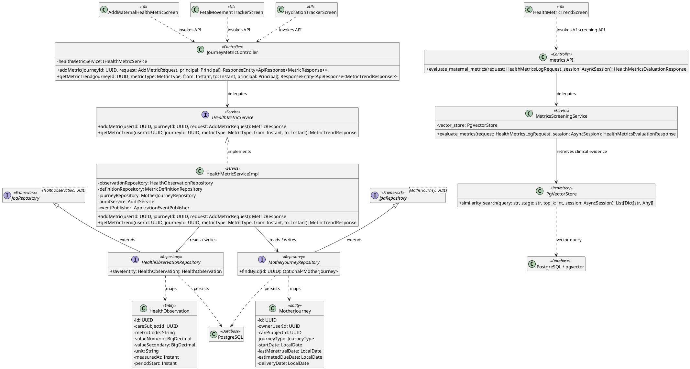

# MF-02 — Maternal Metrics, Fetal Movement, Hydration, and AI Screening

| Field | Value |
| --- | --- |
| Major Feature | **MF-02 — Mother Care Journey** |
| Function package | **Maternal Metrics, Fetal Movement, Hydration, and AI Screening** |
| Code-first use cases | `UC-MH-07, UC-MH-08, UC-MH-09, UC-MH-11` |
| Status | **Draft** |
| Baseline | Current reachable code and tests, 2026-08-23 |
| Diagram convention | `../sequence-diagram-skill.md`; explicit lifeline order, numbered messages, balanced activation |

## 1. Tổng quan luồng chính

Design maternal observations and the separate metrics screening endpoint without conflating it with AI Nurse chat.

- **UC-MH-07 — Record and Review General Maternal Metrics:** Create, view, update, delete when allowed, and trend supported maternal metric observations for an owned journey.
- **UC-MH-08 — Track Fetal Movement Sessions:** Run a timed fetal-movement observation session and store the supported session result as a journey metric.
- **UC-MH-09 — Track Hydration:** Record hydration intake through the dedicated tracker and persist the corresponding journey metric.
- **UC-MH-11 — Request AI Health Overview Screening:** Submit a recent metric or latest multi-metric snapshot to deterministic maternal screening and follow the NORMAL, ANOMALY_MONITOR, or CRITICAL_EMERGENCY result.

The code is authoritative for routes, handlers, delegation, authorization, and persisted state. Report1 section 6.2 is authoritative for the Major Feature name. Historical UC numbering and obsolete triage plans are not design inputs.

## 2. Function Design — Code Traceability

| UC | Actor goal | Method / route | Exact handler | Delegated function | Authorization | Source |
| --- | --- | --- | --- | --- | --- | --- |
| `UC-MH-07` | Record and Review General Maternal Metrics | `DELETE /api/v1/health-metrics/{metricId}` | `HealthMetricController.deleteMetric()` | `IHealthMetricService.deleteMetric()` → `HealthObservationRepository.findByIdAndStatus()` | hasRole('MOTHER') | `05_Development/CareBridgeAPI/src/main/java/com/carebridge/backend/health/controller/HealthMetricController.java` |
| `UC-MH-07` | Record and Review General Maternal Metrics | `GET /api/v1/health-metrics/{metricId}` | `HealthMetricController.getMetricDetail()` | `IHealthMetricService.getMetricDetail()` → `HealthObservationRepository.findByIdAndStatus()` | hasRole('MOTHER') | `05_Development/CareBridgeAPI/src/main/java/com/carebridge/backend/health/controller/HealthMetricController.java` |
| `UC-MH-07` | Record and Review General Maternal Metrics | `GET /api/v1/journeys/{journeyId}/metrics` | `JourneyMetricController.getMetricTrend()` | `IHealthMetricService.getMetricTrend()` → `MotherJourneyRepository.findById()` | hasAnyRole('MOTHER', 'FAMILY', 'EXPERT') | `05_Development/CareBridgeAPI/src/main/java/com/carebridge/backend/health/controller/JourneyMetricController.java` |
| `UC-MH-07` | Record and Review General Maternal Metrics | `POST /api/v1/journeys/{journeyId}/metrics` | `JourneyMetricController.addMetric()` | `IHealthMetricService.addMetric()` → `HealthObservationRepository.save()` | hasRole('MOTHER') | `05_Development/CareBridgeAPI/src/main/java/com/carebridge/backend/health/controller/JourneyMetricController.java` |
| `UC-MH-07` | Record and Review General Maternal Metrics | `GET /api/v1/journeys/{journeyId}/metrics/capabilities` | `JourneyMetricController.getCapabilities()` | `IHealthMetricService.getCapabilities()` → `MotherJourneyRepository.findById()` | hasRole('MOTHER') | `05_Development/CareBridgeAPI/src/main/java/com/carebridge/backend/health/controller/JourneyMetricController.java` |
| `UC-MH-07` | Record and Review General Maternal Metrics | `PUT /api/v1/journeys/{journeyId}/metrics/{metricId}` | `JourneyMetricController.updateMetric()` | `IHealthMetricService.updateMetric()` → `HealthObservationRepository.findByIdAndCareSubjectIdAndStatus()` | hasRole('MOTHER') | `05_Development/CareBridgeAPI/src/main/java/com/carebridge/backend/health/controller/JourneyMetricController.java` |
| `UC-MH-08` | Track Fetal Movement Sessions | `GET /api/v1/journeys/{journeyId}/metrics` | `JourneyMetricController.getMetricTrend()` | `IHealthMetricService.getMetricTrend()` → `MotherJourneyRepository.findById()` | hasAnyRole('MOTHER', 'FAMILY', 'EXPERT') | `05_Development/CareBridgeAPI/src/main/java/com/carebridge/backend/health/controller/JourneyMetricController.java` |
| `UC-MH-08` | Track Fetal Movement Sessions | `POST /api/v1/journeys/{journeyId}/metrics` | `JourneyMetricController.addMetric()` | `IHealthMetricService.addMetric()` → `HealthObservationRepository.save()` | hasRole('MOTHER') | `05_Development/CareBridgeAPI/src/main/java/com/carebridge/backend/health/controller/JourneyMetricController.java` |
| `UC-MH-08` | Track Fetal Movement Sessions | `GET /api/v1/journeys/{journeyId}/metrics/capabilities` | `JourneyMetricController.getCapabilities()` | `IHealthMetricService.getCapabilities()` → `MotherJourneyRepository.findById()` | hasRole('MOTHER') | `05_Development/CareBridgeAPI/src/main/java/com/carebridge/backend/health/controller/JourneyMetricController.java` |
| `UC-MH-08` | Track Fetal Movement Sessions | `PUT /api/v1/journeys/{journeyId}/metrics/{metricId}` | `JourneyMetricController.updateMetric()` | `IHealthMetricService.updateMetric()` → `HealthObservationRepository.findByIdAndCareSubjectIdAndStatus()` | hasRole('MOTHER') | `05_Development/CareBridgeAPI/src/main/java/com/carebridge/backend/health/controller/JourneyMetricController.java` |
| `UC-MH-09` | Track Hydration | `GET /api/v1/journeys/{journeyId}/metrics` | `JourneyMetricController.getMetricTrend()` | `IHealthMetricService.getMetricTrend()` → `MotherJourneyRepository.findById()` | hasAnyRole('MOTHER', 'FAMILY', 'EXPERT') | `05_Development/CareBridgeAPI/src/main/java/com/carebridge/backend/health/controller/JourneyMetricController.java` |
| `UC-MH-09` | Track Hydration | `POST /api/v1/journeys/{journeyId}/metrics` | `JourneyMetricController.addMetric()` | `IHealthMetricService.addMetric()` → `HealthObservationRepository.save()` | hasRole('MOTHER') | `05_Development/CareBridgeAPI/src/main/java/com/carebridge/backend/health/controller/JourneyMetricController.java` |
| `UC-MH-09` | Track Hydration | `GET /api/v1/journeys/{journeyId}/metrics/capabilities` | `JourneyMetricController.getCapabilities()` | `IHealthMetricService.getCapabilities()` → `MotherJourneyRepository.findById()` | hasRole('MOTHER') | `05_Development/CareBridgeAPI/src/main/java/com/carebridge/backend/health/controller/JourneyMetricController.java` |
| `UC-MH-09` | Track Hydration | `PUT /api/v1/journeys/{journeyId}/metrics/{metricId}` | `JourneyMetricController.updateMetric()` | `IHealthMetricService.updateMetric()` → `HealthObservationRepository.findByIdAndCareSubjectIdAndStatus()` | hasRole('MOTHER') | `05_Development/CareBridgeAPI/src/main/java/com/carebridge/backend/health/controller/JourneyMetricController.java` |
| `UC-MH-11` | Request AI Health Overview Screening | `POST /api/v1/metrics/evaluate` | `metrics.evaluate_maternal_metrics()` | `MetricsScreeningService.evaluate_metrics()` → `PgVectorStore.similarity_search()` | Internal API key via `verify_internal_api_key` dependency | `05_Development/CareBridgeAITriageService/app/api/v1/metrics.py` |

## 3. Class Diagram

This design-level UML follows the current source declarations: fields become attributes, reachable methods become operations, `implements` becomes realization, repository inheritance becomes generalization, and runtime-only calls remain dependencies. A missing layer or ownership relation is not invented.

**Figure 1 — Class Diagram: Maternal Metrics, Fetal Movement, Hydration, and AI Screening**

## 4. Sequence Diagram — Main Flow

Each group is a representative reachable main flow. The full endpoint surface remains in the Function Design table above.

```plantuml
@startuml
skinparam shadowing false
skinparam maxMessageSize 90
title Maternal Metrics, Fetal Movement, Hydration, and AI Screening — code-reachable representative flows

actor "Mother" as AMother
boundary "AddMaternalHealthMetricScreen" as UIAddMaternalHealthMetricScreen <<boundary>>
boundary "FetalMovementTrackerScreen" as UIFetalMovementTrackerScreen <<boundary>>
boundary "HydrationTrackerScreen" as UIHydrationTrackerScreen <<boundary>>
boundary "HealthMetricTrendScreen" as UIHealthMetricTrendScreen <<boundary>>
participant "JwtAuthenticationFilter" as JWT <<middleware>>
participant "verify_internal_api_key" as InternalKey <<middleware>>
control "JourneyMetricController" as CJourneyMetricController <<control>>
control "metrics" as Cmetrics <<control>>
participant "IHealthMetricService" as SIHealthMetricService <<service>>
participant "MetricsScreeningService" as SMetricsScreeningService <<service>>
participant "HealthObservationRepository" as RHealthObservationRepository <<repository>>
participant "MotherJourneyRepository" as RMotherJourneyRepository <<repository>>
participant "PgVectorStore" as RPgVectorStore <<repository>>
database "PostgreSQL / pgvector" as DB

group UC-MH-07 — Record and Review General Maternal Metrics [addMetric()]
AMother -> UIAddMaternalHealthMetricScreen : 1. submitMaternalMetric(metricType, value, measuredAt)
activate UIAddMaternalHealthMetricScreen
alt [authorized request succeeds]
UIAddMaternalHealthMetricScreen -> JWT : 2a. POST /api/v1/journeys/{journeyId}/metrics with bearer token
activate JWT
JWT -> CJourneyMetricController : 2a-1. addMetric(journeyId, request, principal)
activate CJourneyMetricController
CJourneyMetricController -> SIHealthMetricService : 2a-2. addMetric(userId, journeyId, request)
activate SIHealthMetricService
SIHealthMetricService -> RHealthObservationRepository : 2a-3. save()
activate RHealthObservationRepository
RHealthObservationRepository -> DB : 2a-4. INSERT / UPDATE HealthObservation
activate DB
DB --> RHealthObservationRepository : 2a-5. persistedHealthObservation
deactivate DB
RHealthObservationRepository --> SIHealthMetricService : 2a-6. persistedHealthObservation
deactivate RHealthObservationRepository
SIHealthMetricService --> CJourneyMetricController : 2a-7. metricResponse
deactivate SIHealthMetricService
CJourneyMetricController --> JWT : 2a-8. metricResponse
deactivate CJourneyMetricController
JWT --> UIAddMaternalHealthMetricScreen : 2a-9. 201 Created — metricResponse
deactivate JWT
UIAddMaternalHealthMetricScreen --> AMother : 2a-10. displaySavedMetric()
else [authentication or role authorization fails]
UIAddMaternalHealthMetricScreen -> JWT : 2b. POST /api/v1/journeys/{journeyId}/metrics with invalid or insufficient bearer token
activate JWT
JWT --> UIAddMaternalHealthMetricScreen : 2b-1. 401 Unauthorized / 403 Forbidden
deactivate JWT
UIAddMaternalHealthMetricScreen --> AMother : 2b-2. showAuthenticationOrAuthorizationError(message)
end
deactivate UIAddMaternalHealthMetricScreen
end

group UC-MH-08 — Track Fetal Movement Sessions [getMetricTrend()]
AMother -> UIFetalMovementTrackerScreen : 3. openFetalMovementTrend()
activate UIFetalMovementTrackerScreen
alt [authorized request succeeds]
UIFetalMovementTrackerScreen -> JWT : 4a. GET /api/v1/journeys/{journeyId}/metrics with bearer token
activate JWT
JWT -> CJourneyMetricController : 4a-1. getMetricTrend(journeyId, metricType, from, to, ...)
activate CJourneyMetricController
CJourneyMetricController -> SIHealthMetricService : 4a-2. getMetricTrend(userId, journeyId, metricType, from, ...)
activate SIHealthMetricService
SIHealthMetricService -> RMotherJourneyRepository : 4a-3. findById()
activate RMotherJourneyRepository
RMotherJourneyRepository -> DB : 4a-4. SELECT MotherJourney via findById()
activate DB
DB --> RMotherJourneyRepository : 4a-5. motherJourneyQueryResult
deactivate DB
RMotherJourneyRepository --> SIHealthMetricService : 4a-6. motherJourneyQueryResult
deactivate RMotherJourneyRepository
SIHealthMetricService --> CJourneyMetricController : 4a-7. metricTrendResponse
deactivate SIHealthMetricService
CJourneyMetricController --> JWT : 4a-8. metricTrendResponse
deactivate CJourneyMetricController
JWT --> UIFetalMovementTrackerScreen : 4a-9. 200 OK — metricTrendResponse
deactivate JWT
UIFetalMovementTrackerScreen --> AMother : 4a-10. displayFetalMovementTrend()
else [authentication or role authorization fails]
UIFetalMovementTrackerScreen -> JWT : 4b. GET /api/v1/journeys/{journeyId}/metrics with invalid or insufficient bearer token
activate JWT
JWT --> UIFetalMovementTrackerScreen : 4b-1. 401 Unauthorized / 403 Forbidden
deactivate JWT
UIFetalMovementTrackerScreen --> AMother : 4b-2. showAuthenticationOrAuthorizationError(message)
end
deactivate UIFetalMovementTrackerScreen
end

group UC-MH-09 — Track Hydration [getMetricTrend()]
AMother -> UIHydrationTrackerScreen : 5. openHydrationTrend()
activate UIHydrationTrackerScreen
alt [authorized request succeeds]
UIHydrationTrackerScreen -> JWT : 6a. GET /api/v1/journeys/{journeyId}/metrics with bearer token
activate JWT
JWT -> CJourneyMetricController : 6a-1. getMetricTrend(journeyId, metricType, from, to, ...)
activate CJourneyMetricController
CJourneyMetricController -> SIHealthMetricService : 6a-2. getMetricTrend(userId, journeyId, metricType, from, ...)
activate SIHealthMetricService
SIHealthMetricService -> RMotherJourneyRepository : 6a-3. findById()
activate RMotherJourneyRepository
RMotherJourneyRepository -> DB : 6a-4. SELECT MotherJourney via findById()
activate DB
DB --> RMotherJourneyRepository : 6a-5. motherJourneyQueryResult
deactivate DB
RMotherJourneyRepository --> SIHealthMetricService : 6a-6. motherJourneyQueryResult
deactivate RMotherJourneyRepository
SIHealthMetricService --> CJourneyMetricController : 6a-7. metricTrendResponse
deactivate SIHealthMetricService
CJourneyMetricController --> JWT : 6a-8. metricTrendResponse
deactivate CJourneyMetricController
JWT --> UIHydrationTrackerScreen : 6a-9. 200 OK — metricTrendResponse
deactivate JWT
UIHydrationTrackerScreen --> AMother : 6a-10. displayHydrationTrend()
else [authentication or role authorization fails]
UIHydrationTrackerScreen -> JWT : 6b. GET /api/v1/journeys/{journeyId}/metrics with invalid or insufficient bearer token
activate JWT
JWT --> UIHydrationTrackerScreen : 6b-1. 401 Unauthorized / 403 Forbidden
deactivate JWT
UIHydrationTrackerScreen --> AMother : 6b-2. showAuthenticationOrAuthorizationError(message)
end
deactivate UIHydrationTrackerScreen
end

group UC-MH-11 — Request AI Health Overview Screening [evaluate_maternal_metrics()]
AMother -> UIHealthMetricTrendScreen : 7. requestHealthOverviewScreening(metrics)
activate UIHealthMetricTrendScreen
alt [authorized request succeeds]
UIHealthMetricTrendScreen -> InternalKey : 8a. POST /api/v1/metrics/evaluate with internal API key
activate InternalKey
InternalKey -> Cmetrics : 8a-1. evaluate_maternal_metrics(request)
activate Cmetrics
Cmetrics -> SMetricsScreeningService : 8a-2. evaluate_metrics(request, session)
activate SMetricsScreeningService
SMetricsScreeningService -> RPgVectorStore : 8a-3. similarity_search(query, stage, topic, topK)
activate RPgVectorStore
RPgVectorStore -> DB : 8a-4. SELECT ranked MaternalKnowledgeChunk rows by vector similarity
activate DB
DB --> RPgVectorStore : 8a-5. rankedMaternalKnowledgeChunkRows
deactivate DB
RPgVectorStore --> SMetricsScreeningService : 8a-6. knowledgeChunkList
deactivate RPgVectorStore
SMetricsScreeningService --> Cmetrics : 8a-7. healthMetricsEvaluationResponse
deactivate SMetricsScreeningService
Cmetrics --> InternalKey : 8a-8. healthMetricsEvaluationResponse
deactivate Cmetrics
InternalKey --> UIHealthMetricTrendScreen : 8a-9. 200 OK — healthMetricsEvaluationResponse
deactivate InternalKey
UIHealthMetricTrendScreen --> AMother : 8a-10. displayHealthOverviewScreening()
else [internal API key is rejected]
UIHealthMetricTrendScreen -> InternalKey : 8b. POST /api/v1/metrics/evaluate with invalid internal API key
activate InternalKey
InternalKey --> UIHealthMetricTrendScreen : 8b-1. 401 Unauthorized
deactivate InternalKey
UIHealthMetricTrendScreen --> AMother : 8b-2. showInternalApiKeyError(message)
end
deactivate UIHealthMetricTrendScreen
end
@enduml
```

**Brief Explanation:**

1. The actor starts each grouped use case through the code-reachable UI boundary.
2. Backend requests use their code-defined guard: JwtAuthenticationFilter for bearer-authenticated APIs and verify_internal_api_key for the Python AI service; rejected credentials stop before the controller.
3. The controller receives the request and invokes the exact delegated operation resolved from the current source.
4. The service applies the business policy and coordinates downstream collaborators while its caller remains active.
5. The repository executes the represented persistence operation and returns the stored or queried result before its activation ends.
6. The HTTP response unwinds through middleware when present, and the UI renders the server-authoritative outcome to the actor.

## 5. Business Rules Applied

| UC | Enforced business/security rules | Known boundary or gap |
| --- | --- | --- |
| `UC-MH-07` | Metric type, unit, ranges, journey ownership, and edit/delete capability are server authoritative. Specialized fetal movement, hydration, and EPDS flows are specified separately. | No additional gap recorded in the code-first baseline. |
| `UC-MH-08` | Period start/end and movement values follow server validation. This is tracking, not a diagnostic conclusion. | No additional gap recorded in the code-first baseline. |
| `UC-MH-09` | Amount/unit/range validation is server authoritative. Hydration tracking does not diagnose dehydration. | No focused hydration-screen test was found. |
| `UC-MH-11` | Deterministic thresholds establish the safety result; retrieval/generation cannot lower it. The feature is screening and guidance, not diagnosis. | Mobile currently embeds an internal key and calls Python directly; replace with a server-side gateway before production. |

## 6. Partial / Excluded Boundaries

- No focused hydration-screen test was found.
- Mobile currently embeds an internal key and calls Python directly; replace with a server-side gateway before production.

## 7. Code and Test Evidence

- `05_Development/CareBridgeAPI/src/main/java/com/carebridge/backend/health/controller/JourneyMetricController.java`
- `05_Development/CareBridgeAPI/src/main/java/com/carebridge/backend/health/controller/HealthMetricController.java`
- `05_Development/CareBridgeMobileApp/lib/features/healthRecords/screens/add_maternal_health_metric_screen.dart`
- `05_Development/CareBridgeMobileApp/lib/features/healthRecords/screens/health_metric_trend_screen.dart`
- `05_Development/CareBridgeAPI/src/test/java/com/carebridge/backend/health/HealthMetricAddServiceTest.java`
- `05_Development/CareBridgeAPI/src/test/java/com/carebridge/backend/health/HealthMetricUpdateServiceTest.java`
- `05_Development/CareBridgeAPI/src/test/java/com/carebridge/backend/health/MetricTrendServiceTest.java`
- `05_Development/CareBridgeMobileApp/lib/features/healthRecords/screens/fetal_movement_tracker_screen.dart`
- `05_Development/CareBridgeAPI/src/main/java/com/carebridge/backend/health/service/MetricObservationValidator.java`
- `05_Development/CareBridgeAPI/src/test/java/com/carebridge/backend/health/MetricObservationValidatorTest.java`
- `05_Development/CareBridgeMobileApp/lib/features/healthRecords/screens/hydration_tracker_screen.dart`
- `05_Development/CareBridgeAITriageService/app/api/v1/metrics.py`
- `05_Development/CareBridgeAITriageService/app/services/metrics_screening_service.py`
- `05_Development/CareBridgeAITriageService/tests/test_metrics_screening.py`
- `05_Development/CareBridgeAITriageService/tests/test_api_endpoints.py`
