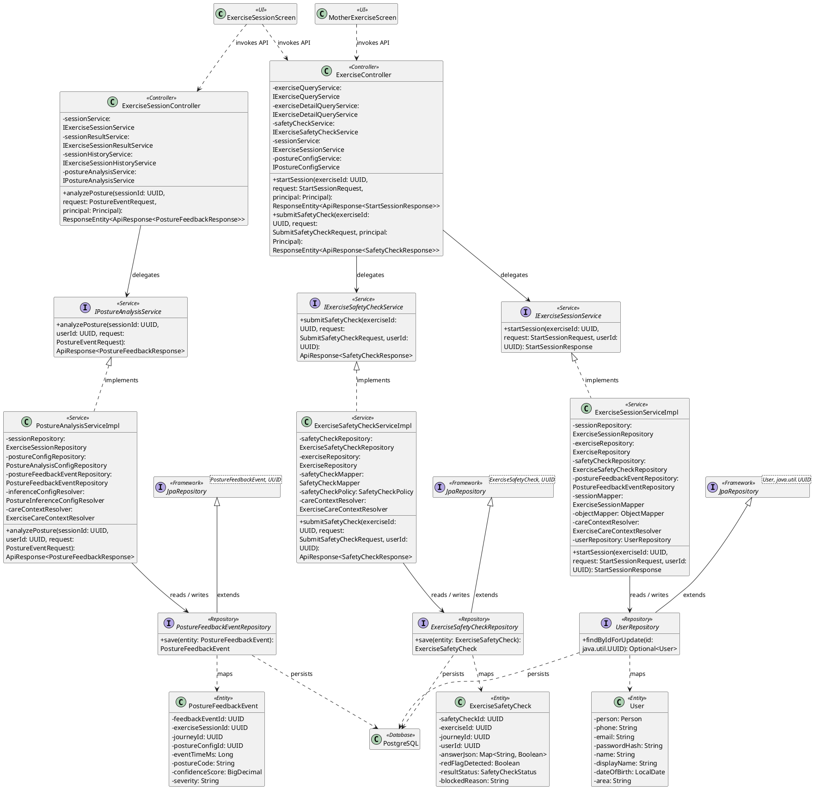
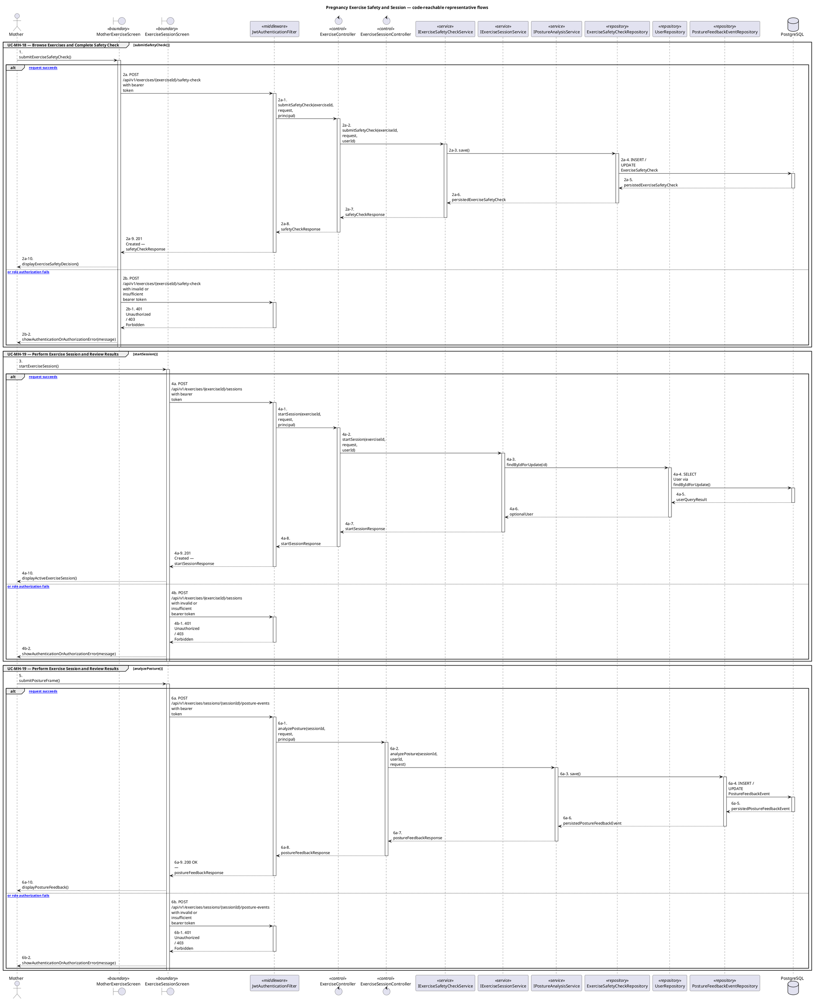
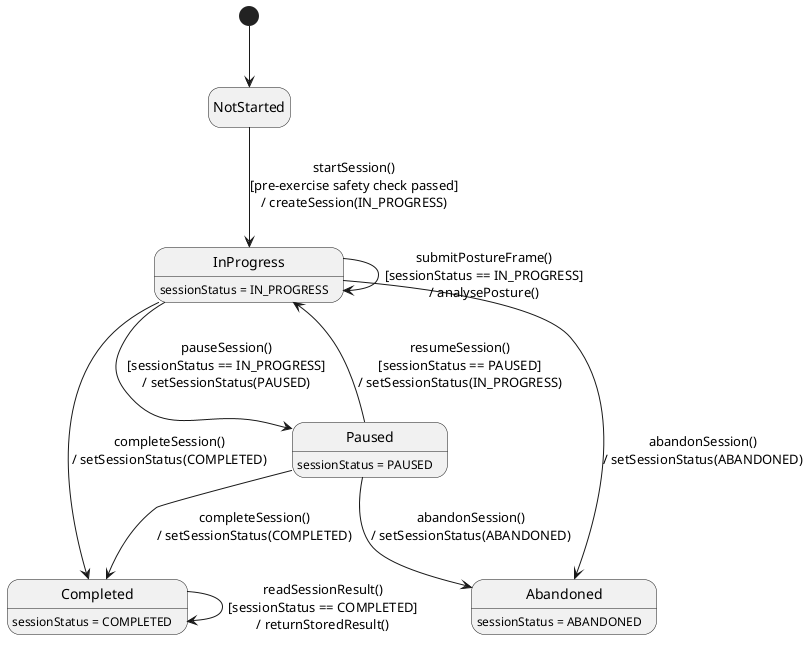

# MF-02 — Pregnancy Exercise Safety and Session

| Field | Value |
| --- | --- |
| Major Feature | **MF-02 — Mother Care Journey** |
| Function package | **Pregnancy Exercise Safety and Session** |
| Code-first use cases | `UC-MH-18, UC-MH-19` |
| Status | **Draft** |
| Baseline | Current reachable code and tests, 2026-08-23 |
| Diagram convention | `../sequence-diagram-skill.md`; explicit lifeline order, numbered messages, balanced activation |

## 1. Tổng quan luồng chính

Design exercise discovery, pre-exercise safety, session state, and posture sidecar integration.

- **UC-MH-18 — Browse Exercises and Complete Safety Check:** Browse pregnancy exercises, review an exercise detail, submit the implemented pre-session safety check, and reload its latest result before camera execution.
- **UC-MH-19 — Perform Exercise Session and Review Results:** Load the active posture configuration, start an eligible exercise session, run posture analysis, complete/abort it, and review the result or history.

The code is authoritative for routes, handlers, delegation, authorization, and persisted state. Report1 section 6.2 is authoritative for the Major Feature name. Historical UC numbering and obsolete triage plans are not design inputs.

## 2. Function Design — Code Traceability

| UC | Actor goal | Method / route | Exact handler | Delegated function | Authorization | Source |
| --- | --- | --- | --- | --- | --- | --- |
| `UC-MH-18` | Browse Exercises and Complete Safety Check | `GET /api/v1/exercises` | `ExerciseController.listExercises()` | `IExerciseQueryService.listPublishedExercises()` → `ExerciseRepository.findPublishedByFilters()` | hasAnyRole('MOTHER', 'SYSTEM_ADMIN') | `05_Development/CareBridgeAPI/src/main/java/com/carebridge/backend/exercise/controller/ExerciseController.java` |
| `UC-MH-18` | Browse Exercises and Complete Safety Check | `GET /api/v1/exercises/{exerciseId}` | `ExerciseController.getExerciseDetail()` | `IExerciseDetailQueryService.getExerciseDetail()` | hasAnyRole('MOTHER', 'SYSTEM_ADMIN') | `05_Development/CareBridgeAPI/src/main/java/com/carebridge/backend/exercise/controller/ExerciseController.java` |
| `UC-MH-18` | Browse Exercises and Complete Safety Check | `POST /api/v1/exercises/{exerciseId}/safety-check` | `ExerciseController.submitSafetyCheck()` | `IExerciseSafetyCheckService.submitSafetyCheck()` → `ExerciseSafetyCheckRepository.save()` | hasAnyRole('MOTHER', 'SYSTEM_ADMIN') | `05_Development/CareBridgeAPI/src/main/java/com/carebridge/backend/exercise/controller/ExerciseController.java` |
| `UC-MH-18` | Browse Exercises and Complete Safety Check | `GET /api/v1/exercises/{exerciseId}/safety-check/latest` | `ExerciseController.getLatestSafetyCheck()` | `IExerciseSafetyCheckService.getLatestSafetyCheck()` | hasAnyRole('MOTHER', 'SYSTEM_ADMIN') | `05_Development/CareBridgeAPI/src/main/java/com/carebridge/backend/exercise/controller/ExerciseController.java` |
| `UC-MH-19` | Perform Exercise Session and Review Results | `GET /api/v1/exercises/sessions/history` | `ExerciseSessionController.getSessionHistory()` | `IExerciseSessionHistoryService.getSessionHistory()` → `ExerciseSessionRepository.findCompletedByUserIdAndFilters()` | hasAnyRole('MOTHER', 'SYSTEM_ADMIN') | `05_Development/CareBridgeAPI/src/main/java/com/carebridge/backend/exercise/controller/ExerciseSessionController.java` |
| `UC-MH-19` | Perform Exercise Session and Review Results | `PATCH /api/v1/exercises/sessions/{sessionId}/complete` | `ExerciseSessionController.completeSession()` | `IExerciseSessionService.completeSession()` → `ExerciseSessionRepository.save()` | hasAnyRole('MOTHER', 'SYSTEM_ADMIN') | `05_Development/CareBridgeAPI/src/main/java/com/carebridge/backend/exercise/controller/ExerciseSessionController.java` |
| `UC-MH-19` | Perform Exercise Session and Review Results | `PATCH /api/v1/exercises/sessions/{sessionId}/pause` | `ExerciseSessionController.pauseSession()` | `IExerciseSessionService.pauseSession()` → `ExerciseSessionRepository.save()` | hasAnyRole('MOTHER', 'SYSTEM_ADMIN') | `05_Development/CareBridgeAPI/src/main/java/com/carebridge/backend/exercise/controller/ExerciseSessionController.java` |
| `UC-MH-19` | Perform Exercise Session and Review Results | `POST /api/v1/exercises/sessions/{sessionId}/posture-events` | `ExerciseSessionController.analyzePosture()` | `IPostureAnalysisService.analyzePosture()` → `PostureFeedbackEventRepository.save()` | hasAnyRole('MOTHER', 'SYSTEM_ADMIN') | `05_Development/CareBridgeAPI/src/main/java/com/carebridge/backend/exercise/controller/ExerciseSessionController.java` |
| `UC-MH-19` | Perform Exercise Session and Review Results | `GET /api/v1/exercises/sessions/{sessionId}/result` | `ExerciseSessionController.getSessionResult()` | `IExerciseSessionResultService.getSessionResult()` | hasAnyRole('MOTHER', 'SYSTEM_ADMIN') | `05_Development/CareBridgeAPI/src/main/java/com/carebridge/backend/exercise/controller/ExerciseSessionController.java` |
| `UC-MH-19` | Perform Exercise Session and Review Results | `PATCH /api/v1/exercises/sessions/{sessionId}/resume` | `ExerciseSessionController.resumeSession()` | `IExerciseSessionService.resumeSession()` → `ExerciseSessionRepository.save()` | hasAnyRole('MOTHER', 'SYSTEM_ADMIN') | `05_Development/CareBridgeAPI/src/main/java/com/carebridge/backend/exercise/controller/ExerciseSessionController.java` |
| `UC-MH-19` | Perform Exercise Session and Review Results | `GET /api/v1/exercises/{exerciseId}/posture-config` | `ExerciseController.getPostureConfig()` | `IPostureConfigService.getActiveConfig()` | hasAnyRole('MOTHER', 'SYSTEM_ADMIN') | `05_Development/CareBridgeAPI/src/main/java/com/carebridge/backend/exercise/controller/ExerciseController.java` |
| `UC-MH-19` | Perform Exercise Session and Review Results | `POST /api/v1/exercises/{exerciseId}/sessions` | `ExerciseController.startSession()` | `IExerciseSessionService.startSession()` → `UserRepository.findByIdForUpdate()` | hasAnyRole('MOTHER', 'SYSTEM_ADMIN') | `05_Development/CareBridgeAPI/src/main/java/com/carebridge/backend/exercise/controller/ExerciseController.java` |
| `UC-MH-19` | Perform Exercise Session and Review Results | `POST /v1/inference/landmarks` | `main.infer()` | — | No explicit internal-key dependency on this handler; router/application policy must be checked | `05_Development/MachineLearning/MediaPipe_Posture/exercise_correction_sidecar/app/main.py` |

## 3. Class Diagram

This design-level UML follows the current source declarations: fields become attributes, reachable methods become operations, `implements` becomes realization, repository inheritance becomes generalization, and runtime-only calls remain dependencies. A missing layer or ownership relation is not invented.

**Figure 1 — Class Diagram: Pregnancy Exercise Safety and Session**

## 4. Sequence Diagram — Main Flow

Each group is a representative reachable main flow. The full endpoint surface remains in the Function Design table above.

**Brief Explanation:**

1. The actor starts each grouped use case through the code-reachable UI boundary.
2. Protected requests pass through JwtAuthenticationFilter; rejected credentials or roles return 401 Unauthorized or 403 Forbidden without invoking the controller.
3. The controller receives the request and invokes the exact delegated operation resolved from the current source.
4. The service applies the business policy and coordinates downstream collaborators while its caller remains active.
5. The repository executes the represented persistence operation and returns the stored or queried result before its activation ends.
6. The HTTP response unwinds through middleware when present, and the UI renders the server-authoritative outcome to the actor.

## 5. State Chart Diagram

The lifecycle below belongs to **ExerciseSession.sessionStatus**. Its states are the persisted constants declared in the sources cited under this diagram, and every transition, guard, and action is taken from the service method that writes that constant. No unreachable state is introduced.

**Figure 2 — State Chart Diagram: Pregnancy Exercise Safety and Session**

**Brief Explanation:**

1. A session starts in `NotStarted`; the pre-exercise safety check is the guard that must pass before `startSession()` creates the row.
2. `pauseSession()` and `resumeSession()` each carry an explicit status guard, so the pair cannot be replayed out of order.
3. Both `InProgress` and `Paused` may complete or be abandoned, which is why `completeSession()` and `abandonSession()` are drawn from each of them rather than only from `InProgress`.
4. The action `analysePosture()` runs as a self-transition on `InProgress` only — `PostureAnalysisServiceImpl` rejects frames for any other status, so a paused session cannot be scored.
5. `ExerciseSessionResultServiceImpl` guards result reads on `sessionStatus == COMPLETED`, so an abandoned session never exposes a result.
6. `Completed` and `Abandoned` are terminal: no transition in the code returns a session from either state.

**State sources:**

- `05_Development/CareBridgeAPI/src/main/java/com/carebridge/backend/exercise/entity/SessionStatus.java`
- `05_Development/CareBridgeAPI/src/main/java/com/carebridge/backend/exercise/service/impl/ExerciseSessionServiceImpl.java`
- `05_Development/CareBridgeAPI/src/main/java/com/carebridge/backend/exercise/service/impl/ExerciseSessionResultServiceImpl.java`
- `05_Development/CareBridgeAPI/src/main/java/com/carebridge/backend/exercise/service/impl/PostureAnalysisServiceImpl.java`

## 6. Business Rules Applied

| UC | Enforced business/security rules | Known boundary or gap |
| --- | --- | --- |
| `UC-MH-18` | Stage/publication eligibility and safety-check policy are server authoritative. A failed/blocked safety check cannot be bypassed by client navigation. | No additional gap recorded in the code-first baseline. |
| `UC-MH-19` | Server session state is canonical; camera/model feedback is advisory. The sidecar inference contract validates sequence and landmark payloads; provider failure follows the implemented backend fallback/degraded path. Late frames and retries must not mutate a completed/aborted session. | No additional gap recorded in the code-first baseline. |

## 7. Partial / Excluded Boundaries

- No extra release boundary beyond the code-first UC catalogue is introduced by this package.

## 8. Code and Test Evidence

- `05_Development/CareBridgeAPI/src/main/java/com/carebridge/backend/exercise/controller/ExerciseController.java`
- `05_Development/CareBridgeAPI/src/main/java/com/carebridge/backend/exercise/policy/SafetyCheckPolicy.java`
- `05_Development/CareBridgeMobileApp/lib/features/exercise/screens/mother_exercise_screen.dart`
- `05_Development/CareBridgeAPI/src/test/java/com/carebridge/backend/exercise/ExerciseQueryServiceTest.java`
- `05_Development/CareBridgeAPI/src/test/java/com/carebridge/backend/exercise/ExerciseSafetyCheckServiceTest.java`
- `05_Development/CareBridgeAPI/src/main/java/com/carebridge/backend/exercise/controller/ExerciseSessionController.java`
- `05_Development/CareBridgeAPI/src/main/java/com/carebridge/backend/exercise/service/impl/PostureAnalysisServiceImpl.java`
- `05_Development/CareBridgeAPI/src/main/java/com/carebridge/backend/exercise/inference/ExerciseCorrectionHttpAdapter.java`
- `05_Development/MachineLearning/MediaPipe_Posture/exercise_correction_sidecar/app/main.py`
- `05_Development/CareBridgeMobileApp/lib/features/exercise/screens/exercise_session_screen.dart`
- `05_Development/CareBridgeAPI/src/test/java/com/carebridge/backend/exercise/ExerciseSessionServiceTest.java`
- `05_Development/CareBridgeAPI/src/test/java/com/carebridge/backend/exercise/ExerciseSessionHistoryEmbeddedPostgresTest.java`
- `05_Development/CareBridgeAPI/src/test/java/com/carebridge/backend/exercise/PostureAnalysisServiceTest.java`
- `05_Development/CareBridgeAPI/src/test/java/com/carebridge/backend/exercise/inference/ExerciseCorrectionHttpAdapterTest.java`
- `05_Development/MachineLearning/MediaPipe_Posture/exercise_correction_sidecar/tests/test_http_contract.py`
- `05_Development/CareBridgeMobileApp/test/features/exercise/exercise_session_screen_test.dart`
