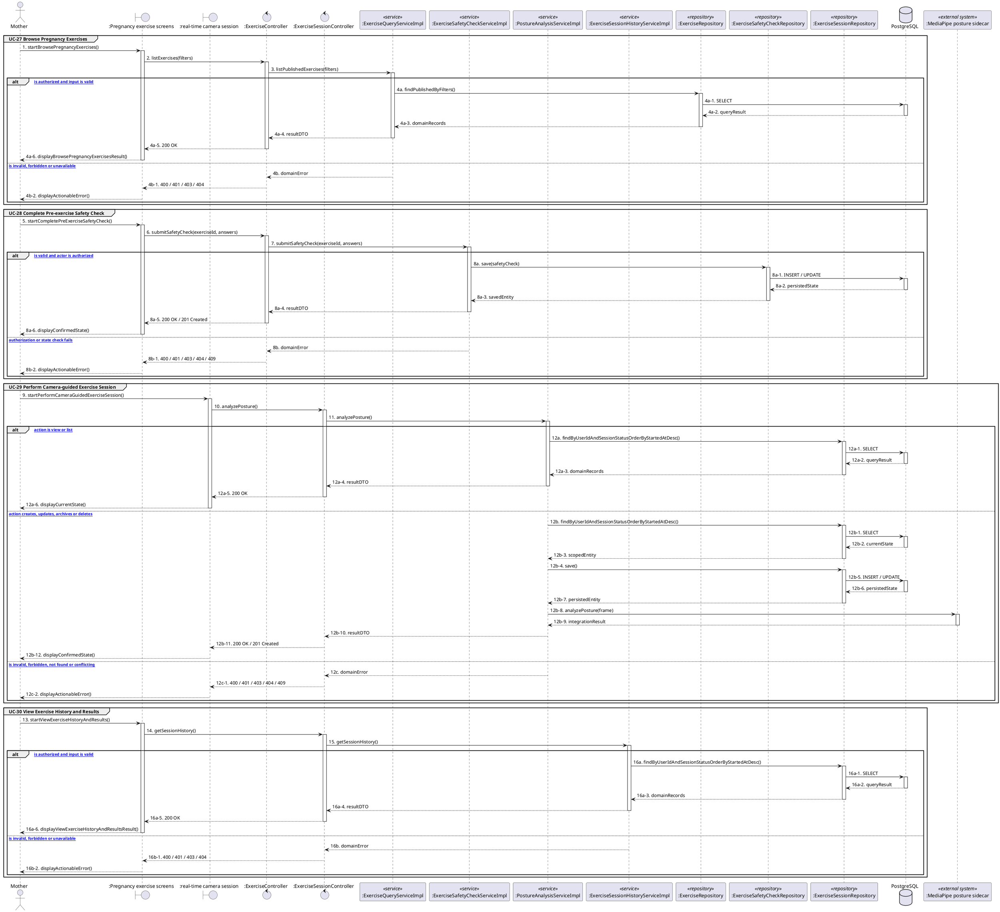

# MF-02 / Spec 03 — Pregnancy Exercise Session, Safety Check and Posture Feedback

| Field | Value |
| --- | --- |
| Status | Draft |
| Use Cases Covered | UC-27 Browse Pregnancy Exercises; UC-28 Complete Pre-exercise Safety Check; UC-29 Perform Camera-guided Exercise Session; UC-30 View Exercise History and Results |
| Use Case Group | Mobile App |
| Platform | Mother Mobile App; Backend; Posture AI |
| Primary Actors | Mother |
| In Scope | Optional camera feedback after permission and safety clearance |
| Explicitly Excluded | Medical fitness diagnosis |
| Implementation Trace | UI: Pregnancy exercise screens and real-time camera session; Controller: ExerciseController, ExerciseSessionController; Service: ExerciseSessionServiceImpl; Repository: ExerciseSessionRepository, ExerciseRepository; Entity: PregnancyExercise, ExerciseSession |

## 1. Tổng quan luồng chính (Main Flow Overview)

Optional camera feedback after permission and safety clearance. The flow starts only from the reachable UI or system trigger named in the metadata. The Backend rechecks authentication, role, ownership, membership, consent and current state as applicable; client-side visibility alone never grants access. A confirmed mutation is persisted before the UI displays success. External-service failure returns a safe retry state and must not fabricate completion.

## 2. Class Diagram

```plantuml
@startuml MF02_03_PregnancyExerciseSessionSafetyCheckandPostureFeedback_ClassDiagram
skinparam classAttributeIconSize 0
hide empty members

class "Pregnancy exercise screens and real-time camera session" as UI1 <<UI>>
class "ExerciseController" as Controller1 <<Controller>> {
  - exerciseQueryService: IExerciseQueryService
  - exerciseDetailQueryService: IExerciseDetailQueryService
  - safetyCheckService: IExerciseSafetyCheckService
  - sessionService: IExerciseSessionService
  + getLatestSafetyCheck(exerciseId: UUID, principal: Principal): ResponseEntity<ApiResponse<SafetyCheckResponse>>
  + submitSafetyCheck(exerciseId: UUID, request: SubmitSafetyCheckRequest, principal: Principal): ResponseEntity<ApiResponse<SafetyCheckResponse>>
  + getExerciseDetail(exerciseId: UUID): ResponseEntity<ApiResponse<ExerciseDetailResponse>>
  + getPostureConfig(exerciseId: UUID): ResponseEntity<ApiResponse<PostureConfigResponse>>
  + startSession(exerciseId: UUID, request: StartSessionRequest, principal: Principal): ResponseEntity<ApiResponse<StartSessionResponse>>
}
class "ExerciseSessionController" as Controller2 <<Controller>> {
  - sessionService: IExerciseSessionService
  - sessionResultService: IExerciseSessionResultService
  - sessionHistoryService: IExerciseSessionHistoryService
  - postureAnalysisService: IPostureAnalysisService
  + completeSession(sessionId: UUID, principal: Principal): ResponseEntity<ApiResponse<SessionResultResponse>>
  + analyzePosture(sessionId: UUID, request: PostureEventRequest, principal: Principal): ResponseEntity<ApiResponse<PostureFeedbackResponse>>
  + getSessionResult(sessionId: UUID, principal: Principal): ResponseEntity<ApiResponse<SessionResultResponse>>
  + pauseSession(sessionId: UUID, principal: Principal): ResponseEntity<ApiResponse<SessionStateResponse>>
  + resumeSession(sessionId: UUID, principal: Principal): ResponseEntity<ApiResponse<SessionStateResponse>>
}
class "ExerciseSessionServiceImpl" as Service1 <<Service>> {
  - sessionRepository: ExerciseSessionRepository
  - exerciseRepository: ExerciseRepository
  - safetyCheckRepository: ExerciseSafetyCheckRepository
  - postureFeedbackEventRepository: PostureFeedbackEventRepository
  + completeSession(sessionId: UUID, userId: UUID): SessionResultResponse
  + pauseSession(sessionId: UUID, userId: UUID): SessionStateResponse
  + resumeSession(sessionId: UUID, userId: UUID): SessionStateResponse
  + startSession(exerciseId: UUID, request: StartSessionRequest, userId: UUID): StartSessionResponse
  - computePostureScore(sessionId: UUID): BigDecimal
}
interface "IExerciseSessionService" as Service1Contract <<Service>>
interface "ExerciseSessionRepository" as Repository1 {
  + findFirstByExerciseIdAndUserIdAndSessionStatusInAndStartedAtGreaterThanEqualAndStartedAtLessThanOrderByStartedAtAscExerciseSessionIdAsc(exerciseId: UUID, userId: UUID, statuses: List<SessionStatus>, ...): Optional<ExerciseSession>
  + findByUserIdAndSessionStatusOrderByStartedAtDesc(userId: UUID, status: SessionStatus, pageable: Pageable): List<ExerciseSession>
}
interface "ExerciseRepository" as Repository2 {
  + findByExerciseIdAndStatus(exerciseId: UUID, status: ExerciseStatus): Optional<PregnancyExercise>
}
class "PregnancyExercise" as Entity1 <<Entity>> {
  - exerciseId: UUID
  - createdBy: UUID
  - title: String
  - description: String
  - trimesterScope: TrimesterScope
  - difficultyLevel: DifficultyLevel
  - durationMinutes: Short
}
class "ExerciseSession" as Entity2 <<Entity>> {
  - exerciseSessionId: UUID
  - exerciseId: UUID
  - journeyId: UUID
  - userId: UUID
  - safetyCheckId: UUID
  - startedAt: OffsetDateTime
  - endedAt: OffsetDateTime
}
interface "JpaRepository<ExerciseSession, UUID>" as Repository1Base <<Framework>>
interface "JpaRepository<PregnancyExercise, UUID>" as Repository2Base <<Framework>>
class "PostgreSQL" as DB <<Database>>
class "MediaPipe posture sidecar" as External <<External Service>>

Service1Contract <|.. Service1 : implements
Repository1Base <|-- Repository1 : extends
Repository2Base <|-- Repository2 : extends
UI1 ..> Controller1 : invokes API
UI1 ..> Controller2 : invokes API
Controller1 --> Service1Contract : delegates
Controller2 --> Service1Contract : delegates
Service1 --> Repository1 : reads / writes
Repository1 ..> Entity2 : maps
Repository1 ..> DB : persists
Repository2 ..> Entity1 : maps
Repository2 ..> DB : persists
Entity1 "1" -- "0..*" Entity2 : exercise sessions
Service1 ..> External : invokes when required
@enduml
```

**Figure 1 — Class Diagram: Pregnancy Exercise Session, Safety Check and Posture Feedback**

## 3. Sequence Diagram — Main Flow

**Figure 2 — Sequence Diagram: Pregnancy Exercise Session, Safety Check and Posture Feedback Main Flow**

**Brief Explanation:**

1. The diagram separates the implemented goals covered by this specification: UC-27 Browse Pregnancy Exercises; UC-28 Complete Pre-exercise Safety Check; UC-29 Perform Camera-guided Exercise Session; UC-30 View Exercise History and Results.
2. Each actor action enters through the reachable mobile or web boundary and invokes the exact controller operation exposed by the current Backend.
3. The controller delegates to the mapped service operation; read branches query scoped records, while mutation branches load the current state before persisting the requested transition.
4. Repository calls and PostgreSQL responses are shown explicitly, including call-stack activation and dashed return messages.
5. Invalid, unauthorized, missing or conflicting requests return an actionable error without displaying a false success state.
6. External systems are invoked only for the mapped use cases; notification dispatches are asynchronous, while integrations that return data remain synchronous.

## 4. Business Rules Applied

- Access is enforced server-side using the current actor, role, ownership, membership and consent scope.
- Optional camera feedback after permission and safety clearance.
- The following remains outside this contract: Medical fitness diagnosis.
- Retries must not duplicate confirmed records, transitions, notifications or external side effects.
- Sensitive health, identity, moderation, location and safety operations retain the minimum required audit evidence.
