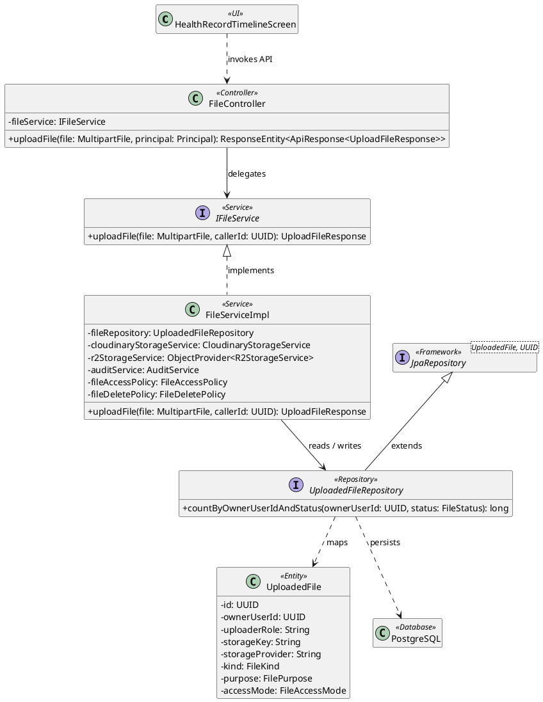
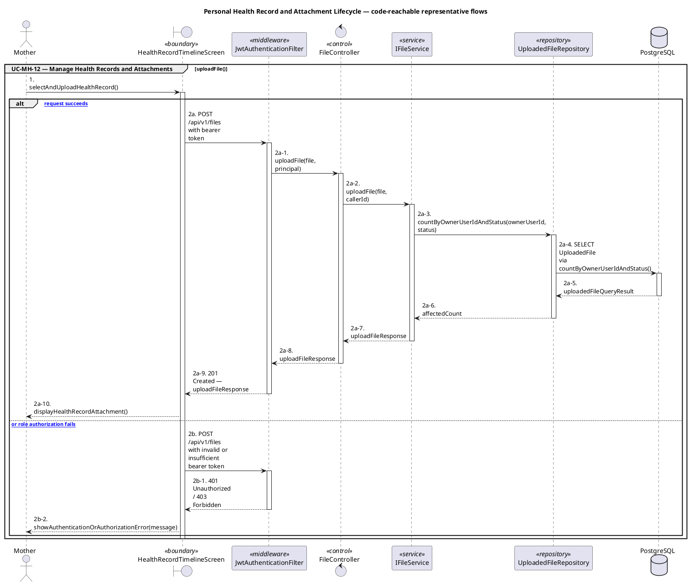
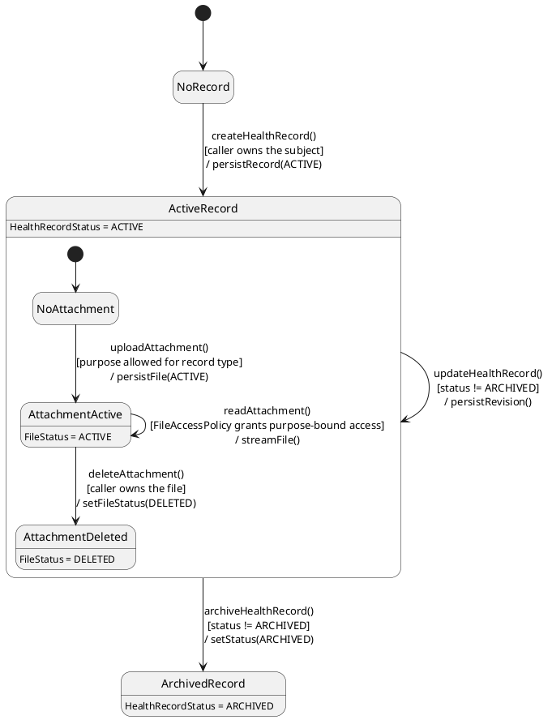

# MF-02 — Personal Health Record and Attachment Lifecycle

| Field | Value |
| --- | --- |
| Major Feature | **MF-02 — Mother Care Journey** |
| Function package | **Personal Health Record and Attachment Lifecycle** |
| Code-first use cases | `UC-MH-12` |
| Status | **Draft** |
| Baseline | Current reachable code and tests, 2026-08-23 |
| Diagram convention | `../sequence-diagram-skill.md`; explicit lifeline order, numbered messages, balanced activation |

## 1. Tổng quan luồng chính

Design owned health records and purpose-bound attachment access.

- **UC-MH-12 — Manage Health Records and Attachments:** Create, view, edit, archive, and list maternal health records and access purpose-authorized attachments.

The code is authoritative for routes, handlers, delegation, authorization, and persisted state. Report1 section 6.2 is authoritative for the Major Feature name. Historical UC numbering and obsolete triage plans are not design inputs.

## 2. Function Design — Code Traceability

| UC | Actor goal | Method / route | Exact handler | Delegated function | Authorization | Source |
| --- | --- | --- | --- | --- | --- | --- |
| `UC-MH-12` | Manage Health Records and Attachments | `POST /api/v1/files` | `FileController.uploadFile()` | `IFileService.uploadFile()` → `UploadedFileRepository.countByOwnerUserIdAndStatus()` | hasRole('MOTHER') | `05_Development/CareBridgeAPI/src/main/java/com/carebridge/backend/file/controller/FileController.java` |
| `UC-MH-12` | Manage Health Records and Attachments | `POST /api/v1/files/health-records` | `FileController.uploadHealthRecordFile()` | `IFileService.uploadHealthRecordFile()` → `UploadedFileRepository.countByOwnerUserIdAndStatus()` | hasRole('MOTHER') | `05_Development/CareBridgeAPI/src/main/java/com/carebridge/backend/file/controller/FileController.java` |
| `UC-MH-12` | Manage Health Records and Attachments | `POST /api/v1/files/upload/with-purpose` | `FileController.uploadFileWithPurpose()` | `IFileService.uploadWithPurpose()` → `UploadedFileRepository.countByOwnerUserIdAndStatus()` | hasAnyRole('EXPERT', 'ADMIN', 'SYSTEM_ADMIN', 'MODERATOR', 'CONTENT_ADMIN', 'MOTHER') | `05_Development/CareBridgeAPI/src/main/java/com/carebridge/backend/file/controller/FileController.java` |
| `UC-MH-12` | Manage Health Records and Attachments | `DELETE /api/v1/files/{fileId}` | `FileController.deleteFile()` | `IFileService.deleteFile()` → `UploadedFileRepository.findByIdAndStatus()` | hasRole('MOTHER') | `05_Development/CareBridgeAPI/src/main/java/com/carebridge/backend/file/controller/FileController.java` |
| `UC-MH-12` | Manage Health Records and Attachments | `GET /api/v1/files/{fileId}` | `FileController.viewFile()` | `IFileService.viewFile()` → `UploadedFileRepository.findByIdAndStatus()` | isAuthenticated() | `05_Development/CareBridgeAPI/src/main/java/com/carebridge/backend/file/controller/FileController.java` |
| `UC-MH-12` | Manage Health Records and Attachments | `GET /api/v1/health-records` | `HealthRecordController.getTimeline()` | `IHealthRecordService.getTimeline()` → `HealthRecordRepository.findActiveByOwnerFiltered()` | hasAnyRole('MOTHER', 'FAMILY') | `05_Development/CareBridgeAPI/src/main/java/com/carebridge/backend/health/controller/HealthRecordController.java` |
| `UC-MH-12` | Manage Health Records and Attachments | `POST /api/v1/health-records` | `HealthRecordController.addHealthRecord()` | `IHealthRecordService.addHealthRecord()` → `HealthRecordRepository.saveAndFlush()` | hasRole('MOTHER') | `05_Development/CareBridgeAPI/src/main/java/com/carebridge/backend/health/controller/HealthRecordController.java` |
| `UC-MH-12` | Manage Health Records and Attachments | `GET /api/v1/health-records/timeline` | `HealthRecordController.getTimeline()` | `IHealthRecordService.getTimeline()` → `HealthRecordRepository.findActiveByOwnerFiltered()` | hasAnyRole('MOTHER', 'FAMILY') | `05_Development/CareBridgeAPI/src/main/java/com/carebridge/backend/health/controller/HealthRecordController.java` |
| `UC-MH-12` | Manage Health Records and Attachments | `PATCH /api/v1/health-records/{id}` | `HealthRecordController.updateHealthRecord()` | `IHealthRecordService.updateHealthRecord()` → `HealthRecordRepository.findById()` | hasRole('MOTHER') | `05_Development/CareBridgeAPI/src/main/java/com/carebridge/backend/health/controller/HealthRecordController.java` |
| `UC-MH-12` | Manage Health Records and Attachments | `PATCH /api/v1/health-records/{id}/archive` | `HealthRecordController.archiveHealthRecord()` | `IHealthRecordService.archiveRecord()` → `HealthRecordRepository.findById()` | hasRole('MOTHER') | `05_Development/CareBridgeAPI/src/main/java/com/carebridge/backend/health/controller/HealthRecordController.java` |
| `UC-MH-12` | Manage Health Records and Attachments | `GET /api/v1/health-records/{recordId}` | `HealthRecordController.getHealthRecord()` | `IHealthRecordService.getHealthRecord()` → `HealthRecordRepository.findByIdAndStatus()` | isAuthenticated() | `05_Development/CareBridgeAPI/src/main/java/com/carebridge/backend/health/controller/HealthRecordController.java` |

## 3. Class Diagram

This design-level UML follows the current source declarations: fields become attributes, reachable methods become operations, `implements` becomes realization, repository inheritance becomes generalization, and runtime-only calls remain dependencies. A missing layer or ownership relation is not invented.

**Figure 1 — Class Diagram: Personal Health Record and Attachment Lifecycle**

## 4. Sequence Diagram — Main Flow

Each group is a representative reachable main flow. The full endpoint surface remains in the Function Design table above.

**Brief Explanation:**

1. The actor starts each grouped use case through the code-reachable UI boundary.
2. Protected requests pass through JwtAuthenticationFilter; rejected credentials or roles return 401 Unauthorized or 403 Forbidden without invoking the controller.
3. The controller receives the request and invokes the exact delegated operation resolved from the current source.
4. The service applies the business policy and coordinates downstream collaborators while its caller remains active.
5. The repository executes the represented persistence operation and returns the stored or queried result before its activation ends.
6. The HTTP response unwinds through middleware when present, and the UI renders the server-authoritative outcome to the actor.

## 5. State Chart Diagram

The lifecycle below belongs to **HealthRecord.status, with the purpose-bound FileStatus of its attachments nested inside an active record**. Its states are the persisted constants declared in the sources cited under this diagram, and every transition, guard, and action is taken from the service method that writes that constant. No unreachable state is introduced.

**Figure 2 — State Chart Diagram: Personal Health Record and Attachment Lifecycle**

**Brief Explanation:**

1. A record starts in `NoRecord`; creation is guarded on the caller owning the subject of the record.
2. The event `updateHealthRecord()` is a self-transition guarded on the record not being archived — `HealthRecordServiceImpl` rejects writes once `status == ARCHIVED`.
3. Archiving is one-way: `ArchivedRecord` has no outgoing transition in the code, so an archived record is a stable terminal condition rather than a deletion.
4. Inside `ActiveRecord`, an attachment enters `AttachmentActive` only when its `FilePurpose` is allowed for the record type.
5. Every read is a guarded self-transition, because `FileAccessPolicyImpl` re-evaluates purpose-bound access on each request rather than trusting a previously issued link.
6. Attachment deletion is soft — the action sets `FileStatus.DELETED`, keeping the row for audit while removing it from every later projection.

**State sources:**

- `05_Development/CareBridgeAPI/src/main/java/com/carebridge/backend/health/entity/HealthRecordStatus.java`
- `05_Development/CareBridgeAPI/src/main/java/com/carebridge/backend/health/service/impl/HealthRecordServiceImpl.java`
- `05_Development/CareBridgeAPI/src/main/java/com/carebridge/backend/file/entity/FileStatus.java`
- `05_Development/CareBridgeAPI/src/main/java/com/carebridge/backend/file/policy/FileAccessPolicyImpl.java`
- `05_Development/CareBridgeAPI/src/main/java/com/carebridge/backend/file/enums/FilePurpose.java`

## 6. Business Rules Applied

| UC | Enforced business/security rules | Known boundary or gap |
| --- | --- | --- |
| `UC-MH-12` | File purpose, owner, share expiry, and consultation context determine access. Archive is the supported record lifecycle; file deletion follows explicit policy. | No additional gap recorded in the code-first baseline. |

## 7. Partial / Excluded Boundaries

- No extra release boundary beyond the code-first UC catalogue is introduced by this package.

## 8. Code and Test Evidence

- `05_Development/CareBridgeAPI/src/main/java/com/carebridge/backend/health/controller/HealthRecordController.java`
- `05_Development/CareBridgeAPI/src/main/java/com/carebridge/backend/file/controller/FileController.java`
- `05_Development/CareBridgeAPI/src/main/java/com/carebridge/backend/file/policy/FileAccessPolicy.java`
- `05_Development/CareBridgeMobileApp/lib/features/healthRecords/screens/health_record_timeline_screen.dart`
- `05_Development/CareBridgeAPI/src/test/java/com/carebridge/backend/health/HealthRecordServiceImplTest.java`
- `05_Development/CareBridgeAPI/src/test/java/com/carebridge/backend/file/FileControllerUploadTest.java`
- `05_Development/CareBridgeAPI/src/test/java/com/carebridge/backend/file/policy/FileAccessPolicyTest.java`
