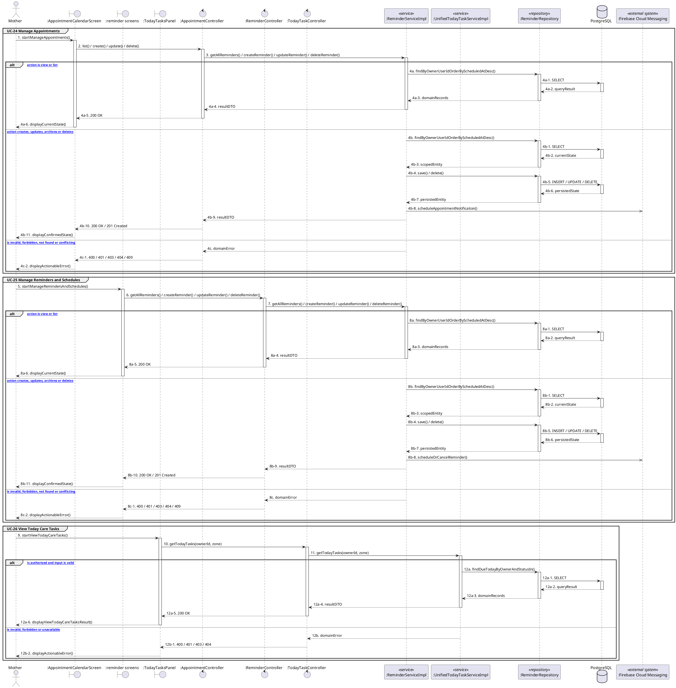

# MF-02 / Spec 05 — Appointments, Reminder Schedules and Today Tasks

| Field | Value |
| --- | --- |
| Status | Draft |
| Use Cases Covered | UC-24 Manage Appointments; UC-25 Manage Reminders and Schedules; UC-26 View Today Care Tasks |
| Use Case Group | Mobile App |
| Platform | Mother Mobile App; Backend |
| Primary Actors | Mother |
| In Scope | Appointment is a separate resource from Reminder; today tasks aggregate supported providers |
| Explicitly Excluded | Prescription or proof of treatment completion |
| Implementation Trace | UI: AppointmentCalendarScreen, reminder screens, TodayTasksPanel; Controller: AppointmentController, ReminderController, ReminderScheduleController, TodayTaskController; Service: ReminderServiceImpl, ReminderScheduleServiceImpl, UnifiedTodayTaskServiceImpl; Repository: ReminderRepository, ReminderScheduleRepository; Entity: Reminder, ReminderSchedule |

## 1. Tổng quan luồng chính (Main Flow Overview)

Appointment is a separate resource from Reminder; today tasks aggregate supported providers. The flow starts only from the reachable UI or system trigger named in the metadata. The Backend rechecks authentication, role, ownership, membership, consent and current state as applicable; client-side visibility alone never grants access. A confirmed mutation is persisted before the UI displays success. External-service failure returns a safe retry state and must not fabricate completion.

## 2. Class Diagram

```plantuml
@startuml MF02_05_AppointmentsReminderSchedulesandTodayTasks_ClassDiagram
skinparam classAttributeIconSize 0
hide empty members

class "AppointmentCalendarScreen" as UI1 <<UI>>
class "reminder screens" as UI2 <<UI>>
class "TodayTasksPanel" as UI3 <<UI>>
class "AppointmentController" as Controller1 <<Controller>> {
  - reminderService: IReminderService
  - isAppointment(response: ReminderDetailResponse): boolean
  - requireAppointment(request: CreateReminderRequest): void
  - toAppointment(response: CreateReminderResponse): AppointmentResponse
  + create(request: CreateReminderRequest, principal: Principal): ResponseEntity<ApiResponse<AppointmentResponse>>
  + delete(appointmentId: UUID, principal: Principal): ResponseEntity<Void>
  + get(appointmentId: UUID, principal: Principal): ApiResponse<AppointmentResponse>
  + list(principal: Principal): ApiResponse<List<AppointmentResponse>>
}
class "ReminderController" as Controller2 <<Controller>> {
  - reminderService: IReminderService
  - todayTaskService: ITodayTaskService
  - taskActionFacade: UnifiedTaskActionFacade
  + completeReminder(reminderId: UUID, principal: Principal): ResponseEntity<ApiResponse<ReminderDetailResponse>>
  + createMedicationReminder(request: CreateMedicationReminderRequest, principal: Principal): ResponseEntity<ApiResponse<CreateReminderResponse>>
  + createReminder(request: CreateReminderRequest, principal: Principal): ResponseEntity<ApiResponse<CreateReminderResponse>>
  + createVaccinationReminder(request: CreateVaccinationReminderRequest, principal: Principal): ResponseEntity<ApiResponse<CreateReminderResponse>>
  + deleteReminder(reminderId: UUID, principal: Principal): ResponseEntity<Void>
  + enableReminder(reminderId: UUID, principal: Principal): ResponseEntity<ApiResponse<ReminderDetailResponse>>
  + getAllReminders(principal: Principal): ResponseEntity<ApiResponse<List<ReminderDetailResponse>>>
}
class "ReminderScheduleController" as Controller3 <<Controller>> {
  - scheduleService: ReminderScheduleService
  + create(request: CreateReminderScheduleRequest, principal: Principal): ResponseEntity<ApiResponse<ReminderScheduleResponse>>
  + delete(scheduleId: UUID, principal: Principal): ResponseEntity<Void>
  + get(scheduleId: UUID, principal: Principal): ApiResponse<ReminderScheduleResponse>
  + list(principal: Principal): ApiResponse<List<ReminderScheduleResponse>>
  + update(scheduleId: UUID, request: UpdateReminderScheduleRequest, principal: Principal): ApiResponse<ReminderScheduleResponse>
}
class "TodayTaskController" as Controller4 <<Controller>> {
  - todayTaskService: UnifiedTodayTaskService
  - actionFacade: UnifiedTaskActionFacade
  + applyAction(taskKind: TaskKind, taskId: UUID, request: TaskActionRequest, ...): TaskActionResponse
}
class "ReminderServiceImpl" as Service1 <<Service>> {
  - reminderRepository: ReminderRepository
  - notificationService: INotificationService
  - auditService: AuditService
  - babyProfileRepository: BabyProfileRepository
  - isRecurringReminder(reminder: Reminder): boolean
  + completeReminder(reminderId: UUID, callerId: UUID): ReminderDetailResponse
  + createMedicationReminder(request: CreateMedicationReminderRequest, callerId: UUID): CreateReminderResponse
  + createReminder(request: CreateReminderRequest, callerId: UUID): CreateReminderResponse
  + createVaccinationReminder(request: CreateVaccinationReminderRequest, callerId: UUID): CreateReminderResponse
}
class "ReminderScheduleServiceImpl" as Service2 <<Service>> {
  - scheduleRepository: ReminderScheduleRepository
  - timeRepository: ReminderScheduleTimeRepository
  - jobRepository: ReminderScheduleJobRepository
  - clock: Clock
  + create(ownerUserId: UUID, request: CreateReminderScheduleRequest): ReminderScheduleResponse
  + delete(ownerUserId: UUID, scheduleId: UUID): void
  + get(ownerUserId: UUID, scheduleId: UUID): ReminderScheduleResponse
  + list(ownerUserId: UUID): List<ReminderScheduleResponse>
  + materializeForPlanner(schedule: ReminderSchedule): void
}
class "UnifiedTodayTaskServiceImpl" as Service3 <<Service>> {
  - providers: List<TodayTaskProvider>
  - labelResolver: TodayTaskContextLabelResolver
  - ensureAssignments: EnsureEligibleChecklistAssignmentsService
  - historyReconciliationService: ChecklistHistoryReconciliationService
  + getTodayTasks(actorUserId: UUID, date: LocalDate, timezoneHeader: String): TodayTasksResponse
  - bucket(status: String, dueAt: Instant, terminalAt: Instant, ...): TaskTimeBucket
  - resolveZone(header: String): ZoneId
  - section(Map<String, unique: TodayTaskItemResponse>, bucket: TaskTimeBucket): List<TodayTaskItemResponse>
}
interface "IReminderService" as Service1Contract <<Service>>
interface "ReminderScheduleService" as Service2Contract <<Service>>
interface "UnifiedTodayTaskService" as Service3Contract <<Service>>
interface "ReminderRepository" as Repository1 {
  + findByIdAndOwnerUserId(id: UUID, ownerUserId: UUID): Optional<Reminder>
  + findByOwnerUserIdOrderByScheduledAtDesc(ownerUserId: UUID): List<Reminder>
  + findByOwnerUserIdAndStatusNot(ownerUserId: UUID, status: ReminderStatus): List<Reminder>
  + findById(id: UUID): Optional<Reminder>
  + findByOwnerUserIdAndScheduledAtBetweenAndStatusIn(ownerUserId: UUID, start: Instant, end: Instant, ...): List<Reminder>
  + findByOwnerUserIdAndReminderTypeAndStatusIn(ownerUserId: UUID, reminderType: ReminderType, statuses: List<ReminderStatus>): List<Reminder>
}
interface "ReminderScheduleRepository" as Repository2 {
  + findByIdAndOwnerUserId(id: UUID, ownerUserId: UUID): Optional<ReminderSchedule>
  + findByOwnerUserIdOrderByStartDateAscCreatedAtDesc(ownerUserId: UUID): List<ReminderSchedule>
  + findByActiveTrueAndRecurrence(recurrence: com.carebridge.backend.reminder.schedule.entity.ReminderScheduleRecurrence): List<ReminderSchedule>
}
class "Reminder" as Entity1 <<Entity>> {
  - id: UUID
  - ownerUserId: UUID
  - journeyId: UUID
  - babyId: UUID
  - careSubjectId: UUID
  - reminderType: ReminderType
  - title: String
}
class "ReminderSchedule" as Entity2 <<Entity>> {
  - id: UUID
  - ownerUserId: UUID
  - title: String
  - timeZone: String
  - recurrence: ReminderScheduleRecurrence
  - startDate: LocalDate
  - endDate: LocalDate
}
interface "JpaRepository<Reminder, UUID>" as Repository1Base <<Framework>>
interface "JpaRepository<ReminderSchedule, UUID>" as Repository2Base <<Framework>>
class "PostgreSQL" as DB <<Database>>
class "Firebase Cloud Messaging" as External <<External Service>>

Service1Contract <|.. Service1 : implements
Service2Contract <|.. Service2 : implements
Service3Contract <|.. Service3 : implements
Repository1Base <|-- Repository1 : extends
Repository2Base <|-- Repository2 : extends
UI1 ..> Controller1 : invokes API
UI2 ..> Controller2 : invokes API
UI2 ..> Controller3 : invokes API
UI3 ..> Controller4 : invokes API
Controller1 --> Service1Contract : delegates
Controller2 --> Service1Contract : delegates
Controller3 --> Service2Contract : delegates
Controller4 --> Service3Contract : delegates
Service1 --> Repository1 : reads / writes
Service2 --> Repository2 : reads / writes
Repository1 ..> Entity1 : maps
Repository1 ..> DB : persists
Repository2 ..> Entity2 : maps
Repository2 ..> DB : persists
Service1 ..> External : schedules notifications
@enduml
```

**Figure 1 — Class Diagram: Appointments, Reminder Schedules and Today Tasks**

## 3. Sequence Diagram — Main Flow

**Figure 2 — Sequence Diagram: Appointments, Reminder Schedules and Today Tasks Main Flow**

**Brief Explanation:**

1. The diagram separates the implemented goals covered by this specification: UC-24 Manage Appointments; UC-25 Manage Reminders and Schedules; UC-26 View Today Care Tasks.
2. Each actor action enters through the reachable mobile or web boundary and invokes the exact controller operation exposed by the current Backend.
3. The controller delegates to the mapped service operation; read branches query scoped records, while mutation branches load the current state before persisting the requested transition.
4. Repository calls and PostgreSQL responses are shown explicitly, including call-stack activation and dashed return messages.
5. Invalid, unauthorized, missing or conflicting requests return an actionable error without displaying a false success state.
6. External systems are invoked only for the mapped use cases; notification dispatches are asynchronous, while integrations that return data remain synchronous.

## 4. Business Rules Applied

- Access is enforced server-side using the current actor, role, ownership, membership and consent scope.
- Appointment is a separate resource from Reminder; today tasks aggregate supported providers.
- The following remains outside this contract: Prescription or proof of treatment completion.
- Retries must not duplicate confirmed records, transitions, notifications or external side effects.
- Sensitive health, identity, moderation, location and safety operations retain the minimum required audit evidence.
