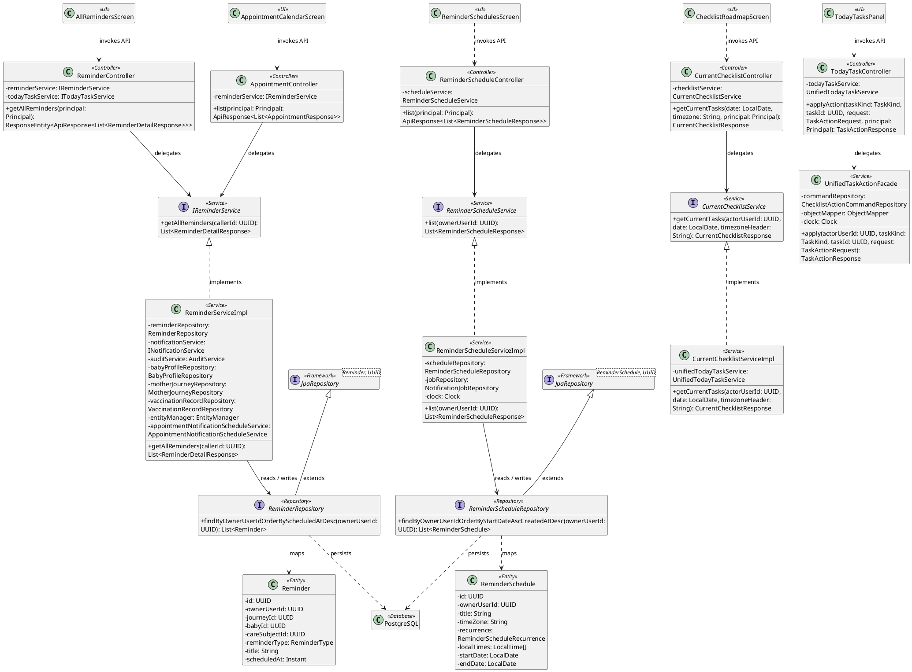
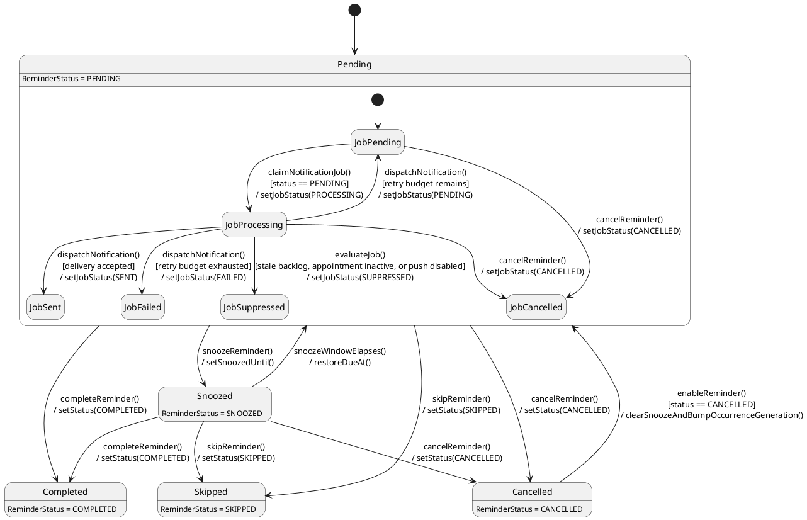

# MF-02 — Appointments, Reminders, Checklists, and Today Tasks

| Field | Value |
| --- | --- |
| Major Feature | **MF-02 — Mother Care Journey** |
| Function package | **Appointments, Reminders, Checklists, and Today Tasks** |
| Code-first use cases | `UC-MH-13, UC-MH-14, UC-MH-15, UC-MH-16, UC-MH-17` |
| Status | **Draft** |
| Baseline | Current reachable code and tests, 2026-08-23 |
| Diagram convention | `../sequence-diagram-skill.md`; explicit lifeline order, numbered messages, balanced activation |

## 1. Tổng quan luồng chính

Design planning resources and the unified server-authoritative today-task projection.

- **UC-MH-13 — Manage Appointments and Calendar:** Create, view, update, cancel/delete when allowed, and calendar-browse personal or shared care-group appointments.
- **UC-MH-14 — Manage General, Medication, and Vaccination Reminders:** Create, view, update, snooze, complete, or remove supported reminder types.
- **UC-MH-15 — Manage Recurring Reminder Schedules:** Create, inspect, update, pause/resume, and delete recurring reminder schedules.
- **UC-MH-16 — Manage Personal Checklist and Roadmap:** View the lifecycle checklist roadmap, import optional templates, create personal items, and manage eligible checklist history/actions.
- **UC-MH-17 — View and Act on Unified Today Tasks:** View the unified today projection, execute the supported action for an appointment/reminder/checklist/care task, and advance checklist sequence when the owning workflow requires it.

The code is authoritative for routes, handlers, delegation, authorization, and persisted state. Report1 section 6.2 is authoritative for the Major Feature name. Historical UC numbering and obsolete triage plans are not design inputs.

## 2. Function Design — Code Traceability

| UC | Actor goal | Method / route | Exact handler | Delegated function | Authorization | Source |
| --- | --- | --- | --- | --- | --- | --- |
| `UC-MH-13` | Manage Appointments and Calendar | `GET /api/v1/appointments` | `AppointmentController.list()` | `IReminderService.getAllReminders()` → `ReminderRepository.findByOwnerUserIdOrderByScheduledAtDesc()` | hasRole('MOTHER') | `05_Development/CareBridgeAPI/src/main/java/com/carebridge/backend/reminder/appointment/controller/AppointmentController.java` |
| `UC-MH-13` | Manage Appointments and Calendar | `POST /api/v1/appointments` | `AppointmentController.create()` | `IReminderService.createReminder()` → `ReminderRepository.save()` | hasRole('MOTHER') | `05_Development/CareBridgeAPI/src/main/java/com/carebridge/backend/reminder/appointment/controller/AppointmentController.java` |
| `UC-MH-13` | Manage Appointments and Calendar | `DELETE /api/v1/appointments/{appointmentId}` | `AppointmentController.delete()` | `IReminderService.getReminderDetail()` → `ReminderRepository.findById()` | hasRole('MOTHER') | `05_Development/CareBridgeAPI/src/main/java/com/carebridge/backend/reminder/appointment/controller/AppointmentController.java` |
| `UC-MH-13` | Manage Appointments and Calendar | `GET /api/v1/appointments/{appointmentId}` | `AppointmentController.get()` | `IReminderService.getReminderDetail()` → `ReminderRepository.findById()` | hasRole('MOTHER') | `05_Development/CareBridgeAPI/src/main/java/com/carebridge/backend/reminder/appointment/controller/AppointmentController.java` |
| `UC-MH-13` | Manage Appointments and Calendar | `PATCH /api/v1/appointments/{appointmentId}` | `AppointmentController.update()` | `IReminderService.getReminderDetail()` → `ReminderRepository.findById()` | hasRole('MOTHER') | `05_Development/CareBridgeAPI/src/main/java/com/carebridge/backend/reminder/appointment/controller/AppointmentController.java` |
| `UC-MH-13` | Manage Appointments and Calendar | `GET /api/v1/care-groups/{careGroupId}/appointments` | `CareGroupAppointmentController.list()` | `CareGroupAppointmentService.list()` → `ReminderRepository.findSharedAppointments()` | isAuthenticated() | `05_Development/CareBridgeAPI/src/main/java/com/carebridge/backend/reminder/appointment/controller/CareGroupAppointmentController.java` |
| `UC-MH-13` | Manage Appointments and Calendar | `GET /api/v1/care-groups/{careGroupId}/appointments/{appointmentId}` | `CareGroupAppointmentController.get()` | `CareGroupAppointmentService.get()` → `ReminderRepository.findSharedAppointment()` | isAuthenticated() | `05_Development/CareBridgeAPI/src/main/java/com/carebridge/backend/reminder/appointment/controller/CareGroupAppointmentController.java` |
| `UC-MH-14` | Manage General, Medication, and Vaccination Reminders | `GET /api/v1/reminders` | `ReminderController.getAllReminders()` | `IReminderService.getAllReminders()` → `ReminderRepository.findByOwnerUserIdOrderByScheduledAtDesc()` | hasRole('MOTHER') | `05_Development/CareBridgeAPI/src/main/java/com/carebridge/backend/reminder/controller/ReminderController.java` |
| `UC-MH-14` | Manage General, Medication, and Vaccination Reminders | `POST /api/v1/reminders` | `ReminderController.createReminder()` | `IReminderService.createReminder()` → `ReminderRepository.save()` | hasRole('MOTHER') | `05_Development/CareBridgeAPI/src/main/java/com/carebridge/backend/reminder/controller/ReminderController.java` |
| `UC-MH-14` | Manage General, Medication, and Vaccination Reminders | `POST /api/v1/reminders/medication` | `ReminderController.createMedicationReminder()` | `IReminderService.createMedicationReminder()` → `ReminderRepository.save()` | hasRole('MOTHER') | `05_Development/CareBridgeAPI/src/main/java/com/carebridge/backend/reminder/controller/ReminderController.java` |
| `UC-MH-14` | Manage General, Medication, and Vaccination Reminders | `GET /api/v1/reminders/today` | `ReminderController.getTodayTasks()` | `ITodayTaskService.getTodayTasks()` → `ReminderRepository.findByOwnerUserIdAndStatusNot()` | hasAnyRole('MOTHER', 'FAMILY') | `05_Development/CareBridgeAPI/src/main/java/com/carebridge/backend/reminder/controller/ReminderController.java` |
| `UC-MH-14` | Manage General, Medication, and Vaccination Reminders | `POST /api/v1/reminders/vaccination` | `ReminderController.createVaccinationReminder()` | `IReminderService.createVaccinationReminder()` → `ReminderRepository.save()` | hasRole('MOTHER') | `05_Development/CareBridgeAPI/src/main/java/com/carebridge/backend/reminder/controller/ReminderController.java` |
| `UC-MH-14` | Manage General, Medication, and Vaccination Reminders | `GET /api/v1/reminders/vaccination/suggestions` | `ReminderController.getVaccinationSuggestions()` | `IReminderService.getVaccinationSuggestions()` → `BabyProfileRepository.findByIdAndOwnerUserId()` | hasRole('MOTHER') | `05_Development/CareBridgeAPI/src/main/java/com/carebridge/backend/reminder/controller/ReminderController.java` |
| `UC-MH-14` | Manage General, Medication, and Vaccination Reminders | `DELETE /api/v1/reminders/{reminderId}` | `ReminderController.deleteReminder()` | `IReminderService.deleteReminder()` → `ReminderRepository.save()` | hasRole('MOTHER') | `05_Development/CareBridgeAPI/src/main/java/com/carebridge/backend/reminder/controller/ReminderController.java` |
| `UC-MH-14` | Manage General, Medication, and Vaccination Reminders | `GET /api/v1/reminders/{reminderId}` | `ReminderController.getReminderDetail()` | `IReminderService.getReminderDetail()` → `ReminderRepository.findById()` | hasRole('MOTHER') | `05_Development/CareBridgeAPI/src/main/java/com/carebridge/backend/reminder/controller/ReminderController.java` |
| `UC-MH-14` | Manage General, Medication, and Vaccination Reminders | `PATCH /api/v1/reminders/{reminderId}` | `ReminderController.updateReminder()` | `IReminderService.updateReminder()` → `ReminderRepository.save()` | hasRole('MOTHER') | `05_Development/CareBridgeAPI/src/main/java/com/carebridge/backend/reminder/controller/ReminderController.java` |
| `UC-MH-14` | Manage General, Medication, and Vaccination Reminders | `PATCH /api/v1/reminders/{reminderId}/complete` | `ReminderController.completeReminder()` | `UnifiedTaskActionFacade.apply()` | hasRole('MOTHER') | `05_Development/CareBridgeAPI/src/main/java/com/carebridge/backend/reminder/controller/ReminderController.java` |
| `UC-MH-14` | Manage General, Medication, and Vaccination Reminders | `PATCH /api/v1/reminders/{reminderId}/enable` | `ReminderController.enableReminder()` | `IReminderService.enableReminder()` → `ReminderRepository.save()` | hasRole('MOTHER') | `05_Development/CareBridgeAPI/src/main/java/com/carebridge/backend/reminder/controller/ReminderController.java` |
| `UC-MH-14` | Manage General, Medication, and Vaccination Reminders | `DELETE /api/v1/reminders/{reminderId}/permanent` | `ReminderController.hardDeleteReminder()` | `IReminderService.hardDeleteReminder()` → `ReminderRepository.delete()` | hasRole('MOTHER') | `05_Development/CareBridgeAPI/src/main/java/com/carebridge/backend/reminder/controller/ReminderController.java` |
| `UC-MH-14` | Manage General, Medication, and Vaccination Reminders | `PATCH /api/v1/reminders/{reminderId}/snooze` | `ReminderController.snoozeReminder()` | `IReminderService.snoozeReminder()` → `ReminderRepository.save()` | hasRole('MOTHER') | `05_Development/CareBridgeAPI/src/main/java/com/carebridge/backend/reminder/controller/ReminderController.java` |
| `UC-MH-15` | Manage Recurring Reminder Schedules | `GET /api/v1/reminder-schedules` | `ReminderScheduleController.list()` | `ReminderScheduleService.list()` → `ReminderScheduleRepository.findByOwnerUserIdOrderByStartDateAscCreatedAtDesc()` | hasAnyRole('MOTHER', 'FAMILY') | `05_Development/CareBridgeAPI/src/main/java/com/carebridge/backend/reminder/schedule/controller/ReminderScheduleController.java` |
| `UC-MH-15` | Manage Recurring Reminder Schedules | `POST /api/v1/reminder-schedules` | `ReminderScheduleController.create()` | `ReminderScheduleService.create()` → `ReminderScheduleRepository.save()` | hasAnyRole('MOTHER', 'FAMILY') | `05_Development/CareBridgeAPI/src/main/java/com/carebridge/backend/reminder/schedule/controller/ReminderScheduleController.java` |
| `UC-MH-15` | Manage Recurring Reminder Schedules | `DELETE /api/v1/reminder-schedules/{scheduleId}` | `ReminderScheduleController.delete()` | `ReminderScheduleService.delete()` → `NotificationJobRepository.cancelActiveByScheduleId()` | hasAnyRole('MOTHER', 'FAMILY') | `05_Development/CareBridgeAPI/src/main/java/com/carebridge/backend/reminder/schedule/controller/ReminderScheduleController.java` |
| `UC-MH-15` | Manage Recurring Reminder Schedules | `GET /api/v1/reminder-schedules/{scheduleId}` | `ReminderScheduleController.get()` | `ReminderScheduleService.get()` → `ReminderScheduleRepository.findByIdAndOwnerUserId()` | hasAnyRole('MOTHER', 'FAMILY') | `05_Development/CareBridgeAPI/src/main/java/com/carebridge/backend/reminder/schedule/controller/ReminderScheduleController.java` |
| `UC-MH-15` | Manage Recurring Reminder Schedules | `PATCH /api/v1/reminder-schedules/{scheduleId}` | `ReminderScheduleController.update()` | `ReminderScheduleService.update()` → `ReminderScheduleRepository.save()` | hasAnyRole('MOTHER', 'FAMILY') | `05_Development/CareBridgeAPI/src/main/java/com/carebridge/backend/reminder/schedule/controller/ReminderScheduleController.java` |
| `UC-MH-16` | Manage Personal Checklist and Roadmap | `GET /api/v1/checklists/current/tasks` | `CurrentChecklistController.getCurrentTasks()` | `CurrentChecklistService.getCurrentTasks()` | hasAnyRole('MOTHER', 'FAMILY') | `05_Development/CareBridgeAPI/src/main/java/com/carebridge/backend/checklist/today/controller/CurrentChecklistController.java` |
| `UC-MH-16` | Manage Personal Checklist and Roadmap | `GET /api/v1/checklists/history` | `ChecklistHistoryController.listHistory()` | `ChecklistHistoryService.listHistory()` → `ChecklistInstanceRepository.findOwnerHistory()` | hasRole('MOTHER') | `05_Development/CareBridgeAPI/src/main/java/com/carebridge/backend/checklist/history/controller/ChecklistHistoryController.java` |
| `UC-MH-16` | Manage Personal Checklist and Roadmap | `GET /api/v1/checklists/journeys/{journeyId}/tasks` | `CurrentChecklistController.getJourneyTasks()` | `CurrentChecklistService.getCurrentTasks()` | hasAnyRole('MOTHER', 'FAMILY', 'EXPERT', 'ADMIN') | `05_Development/CareBridgeAPI/src/main/java/com/carebridge/backend/checklist/today/controller/CurrentChecklistController.java` |
| `UC-MH-16` | Manage Personal Checklist and Roadmap | `POST /api/v1/checklists/tasks/{taskId}/actions` | `CurrentChecklistController.applyAction()` | `UnifiedTaskActionFacade.apply()` | hasAnyRole('MOTHER', 'FAMILY') | `05_Development/CareBridgeAPI/src/main/java/com/carebridge/backend/checklist/today/controller/CurrentChecklistController.java` |
| `UC-MH-16` | Manage Personal Checklist and Roadmap | `GET /api/v1/checklists/users/{userId}/tasks` | `CurrentChecklistController.getUserTasks()` | `CurrentChecklistService.getCurrentTasks()` | hasAnyRole('EXPERT', 'ADMIN') | `05_Development/CareBridgeAPI/src/main/java/com/carebridge/backend/checklist/today/controller/CurrentChecklistController.java` |
| `UC-MH-16` | Manage Personal Checklist and Roadmap | `GET /api/v1/user-checklist-items` | `UserChecklistItemController.listItems()` | `UserCreatedChecklistTaskService.listAuthorized()` → `ChecklistInstanceRepository.findByRecipientUserId()` | hasRole('MOTHER') | `05_Development/CareBridgeAPI/src/main/java/com/carebridge/backend/checklist/controller/UserChecklistItemController.java` |
| `UC-MH-16` | Manage Personal Checklist and Roadmap | `POST /api/v1/user-checklist-items` | `UserChecklistItemController.addItem()` | `UserCreatedChecklistTaskService.create()` | hasAnyRole('MOTHER', 'FAMILY') | `05_Development/CareBridgeAPI/src/main/java/com/carebridge/backend/checklist/controller/UserChecklistItemController.java` |
| `UC-MH-16` | Manage Personal Checklist and Roadmap | `POST /api/v1/user-checklist-items/from-template` | `UserChecklistItemController.selfAssignFromTemplate()` | `OptionalChecklistTemplateImportService.selfAssign()` → `ChecklistTemplateRepository.findById()` | hasRole('MOTHER') | `05_Development/CareBridgeAPI/src/main/java/com/carebridge/backend/checklist/controller/UserChecklistItemController.java` |
| `UC-MH-16` | Manage Personal Checklist and Roadmap | `POST /api/v1/user-checklist-items/import` | `UserChecklistItemController.importFromTemplate()` | — | hasRole('MOTHER') | `05_Development/CareBridgeAPI/src/main/java/com/carebridge/backend/checklist/controller/UserChecklistItemController.java` |
| `UC-MH-16` | Manage Personal Checklist and Roadmap | `DELETE /api/v1/user-checklist-items/{itemId}` | `UserChecklistItemController.deleteItem()` | `ChecklistV2CompatibilityMutationService.delete()` → `ChecklistTaskInstanceRepository.findById()` | hasRole('MOTHER') | `05_Development/CareBridgeAPI/src/main/java/com/carebridge/backend/checklist/controller/UserChecklistItemController.java` |
| `UC-MH-16` | Manage Personal Checklist and Roadmap | `PUT /api/v1/user-checklist-items/{itemId}` | `UserChecklistItemController.updateItem()` | `ChecklistV2CompatibilityMutationService.rejectUpdate()` → `ChecklistTaskInstanceRepository.findById()` | hasRole('MOTHER') | `05_Development/CareBridgeAPI/src/main/java/com/carebridge/backend/checklist/controller/UserChecklistItemController.java` |
| `UC-MH-16` | Manage Personal Checklist and Roadmap | `PATCH /api/v1/user-checklist-items/{itemId}/toggle` | `UserChecklistItemController.toggleComplete()` | — | hasRole('MOTHER') | `05_Development/CareBridgeAPI/src/main/java/com/carebridge/backend/checklist/controller/UserChecklistItemController.java` |
| `UC-MH-17` | View and Act on Unified Today Tasks | `POST /api/v1/checklists/sequences/advance` | `ChecklistSequenceController.advance()` | `ChecklistSequenceAdvanceService.advance()` → `ChecklistInstanceRepository.findById()` | hasRole('MOTHER') | `05_Development/CareBridgeAPI/src/main/java/com/carebridge/backend/checklist/sequence/ChecklistSequenceController.java` |
| `UC-MH-17` | View and Act on Unified Today Tasks | `GET /api/v1/tasks/today` | `TodayTaskController.getTodayTasks()` | `UnifiedTodayTaskService.getTodayTasks()` | hasAnyRole('MOTHER', 'FAMILY') | `05_Development/CareBridgeAPI/src/main/java/com/carebridge/backend/checklist/today/controller/TodayTaskController.java` |
| `UC-MH-17` | View and Act on Unified Today Tasks | `POST /api/v1/tasks/{taskKind}/{taskId}/actions` | `TodayTaskController.applyAction()` | `UnifiedTaskActionFacade.apply()` | hasAnyRole('MOTHER', 'FAMILY') | `05_Development/CareBridgeAPI/src/main/java/com/carebridge/backend/checklist/today/controller/TodayTaskController.java` |

## 3. Class Diagram

This design-level UML follows the current source declarations: fields become attributes, reachable methods become operations, `implements` becomes realization, repository inheritance becomes generalization, and runtime-only calls remain dependencies. A missing layer or ownership relation is not invented.

**Figure 1 — Class Diagram: Appointments, Reminders, Checklists, and Today Tasks**

## 4. Sequence Diagram — Main Flow

Each group is a representative reachable main flow. The full endpoint surface remains in the Function Design table above.

```plantuml
@startuml
skinparam shadowing false
skinparam maxMessageSize 90
title Appointments, Reminders, Checklists, and Today Tasks — code-reachable representative flows

actor "Mother" as AMother
boundary "AppointmentCalendarScreen" as UIAppointmentCalendarScreen <<boundary>>
boundary "AllRemindersScreen" as UIAllRemindersScreen <<boundary>>
boundary "ReminderSchedulesScreen" as UIReminderSchedulesScreen <<boundary>>
boundary "ChecklistRoadmapScreen" as UIChecklistRoadmapScreen <<boundary>>
boundary "TodayTasksPanel" as UITodayTasksPanel <<boundary>>
participant "JwtAuthenticationFilter" as JWT <<middleware>>
control "AppointmentController" as CAppointmentController <<control>>
control "ReminderController" as CReminderController <<control>>
control "ReminderScheduleController" as CReminderScheduleController <<control>>
control "CurrentChecklistController" as CCurrentChecklistController <<control>>
control "TodayTaskController" as CTodayTaskController <<control>>
participant "IReminderService" as SIReminderService <<service>>
participant "ReminderScheduleService" as SReminderScheduleService <<service>>
participant "CurrentChecklistService" as SCurrentChecklistService <<service>>
participant "UnifiedTaskActionFacade" as SUnifiedTaskActionFacade <<service>>
participant "ReminderRepository" as RReminderRepository <<repository>>
participant "ReminderScheduleRepository" as RReminderScheduleRepository <<repository>>
database "PostgreSQL" as DB

group UC-MH-13 — Manage Appointments and Calendar [list()]
AMother -> UIAppointmentCalendarScreen : 1. openAppointmentCalendar()
activate UIAppointmentCalendarScreen
alt [authorized request succeeds]
UIAppointmentCalendarScreen -> JWT : 2a. GET /api/v1/appointments with bearer token
activate JWT
JWT -> CAppointmentController : 2a-1. list(principal)
activate CAppointmentController
CAppointmentController -> SIReminderService : 2a-2. getAllReminders(callerId)
activate SIReminderService
SIReminderService -> RReminderRepository : 2a-3. findByOwnerUserIdOrderByScheduledAtDesc(ownerUserId)
activate RReminderRepository
RReminderRepository -> DB : 2a-4. SELECT Reminder via findByOwnerUserIdOrderByScheduledAtDesc()
activate DB
DB --> RReminderRepository : 2a-5. reminderQueryResult
deactivate DB
RReminderRepository --> SIReminderService : 2a-6. reminderList
deactivate RReminderRepository
SIReminderService --> CAppointmentController : 2a-7. reminderDetailResponseList
deactivate SIReminderService
CAppointmentController --> JWT : 2a-8. appointmentResponse
deactivate CAppointmentController
JWT --> UIAppointmentCalendarScreen : 2a-9. 200 OK — appointmentResponse
deactivate JWT
UIAppointmentCalendarScreen --> AMother : 2a-10. displayAppointmentCalendar()
else [authentication or role authorization fails]
UIAppointmentCalendarScreen -> JWT : 2b. GET /api/v1/appointments with invalid or insufficient bearer token
activate JWT
JWT --> UIAppointmentCalendarScreen : 2b-1. 401 Unauthorized / 403 Forbidden
deactivate JWT
UIAppointmentCalendarScreen --> AMother : 2b-2. showAuthenticationOrAuthorizationError(message)
end
deactivate UIAppointmentCalendarScreen
end

group UC-MH-14 — Manage General, Medication, and Vaccination Reminders [getAllReminders()]
AMother -> UIAllRemindersScreen : 3. openReminderCenter()
activate UIAllRemindersScreen
alt [authorized request succeeds]
UIAllRemindersScreen -> JWT : 4a. GET /api/v1/reminders with bearer token
activate JWT
JWT -> CReminderController : 4a-1. getAllReminders(principal)
activate CReminderController
CReminderController -> SIReminderService : 4a-2. getAllReminders(callerId)
activate SIReminderService
SIReminderService -> RReminderRepository : 4a-3. findByOwnerUserIdOrderByScheduledAtDesc(ownerUserId)
activate RReminderRepository
RReminderRepository -> DB : 4a-4. SELECT Reminder via findByOwnerUserIdOrderByScheduledAtDesc()
activate DB
DB --> RReminderRepository : 4a-5. reminderQueryResult
deactivate DB
RReminderRepository --> SIReminderService : 4a-6. reminderList
deactivate RReminderRepository
SIReminderService --> CReminderController : 4a-7. reminderDetailResponseList
deactivate SIReminderService
CReminderController --> JWT : 4a-8. reminderDetailResponse
deactivate CReminderController
JWT --> UIAllRemindersScreen : 4a-9. 200 OK — reminderDetailResponse
deactivate JWT
UIAllRemindersScreen --> AMother : 4a-10. displayReminderCenter()
else [authentication or role authorization fails]
UIAllRemindersScreen -> JWT : 4b. GET /api/v1/reminders with invalid or insufficient bearer token
activate JWT
JWT --> UIAllRemindersScreen : 4b-1. 401 Unauthorized / 403 Forbidden
deactivate JWT
UIAllRemindersScreen --> AMother : 4b-2. showAuthenticationOrAuthorizationError(message)
end
deactivate UIAllRemindersScreen
end

group UC-MH-15 — Manage Recurring Reminder Schedules [list()]
AMother -> UIReminderSchedulesScreen : 5. openReminderSchedules()
activate UIReminderSchedulesScreen
alt [authorized request succeeds]
UIReminderSchedulesScreen -> JWT : 6a. GET /api/v1/reminder-schedules with bearer token
activate JWT
JWT -> CReminderScheduleController : 6a-1. list(principal)
activate CReminderScheduleController
CReminderScheduleController -> SReminderScheduleService : 6a-2. list(ownerUserId)
activate SReminderScheduleService
SReminderScheduleService -> RReminderScheduleRepository : 6a-3. findByOwnerUserIdOrderByStartDateAscCreatedAtDesc(ownerUserId)
activate RReminderScheduleRepository
RReminderScheduleRepository -> DB : 6a-4. SELECT ReminderSchedule via findByOwnerUserIdOrderByStartDateAscCreatedAtDesc()
activate DB
DB --> RReminderScheduleRepository : 6a-5. reminderScheduleQueryResult
deactivate DB
RReminderScheduleRepository --> SReminderScheduleService : 6a-6. reminderScheduleList
deactivate RReminderScheduleRepository
SReminderScheduleService --> CReminderScheduleController : 6a-7. reminderScheduleResponseList
deactivate SReminderScheduleService
CReminderScheduleController --> JWT : 6a-8. reminderScheduleResponse
deactivate CReminderScheduleController
JWT --> UIReminderSchedulesScreen : 6a-9. 200 OK — reminderScheduleResponse
deactivate JWT
UIReminderSchedulesScreen --> AMother : 6a-10. displayReminderSchedules()
else [authentication or role authorization fails]
UIReminderSchedulesScreen -> JWT : 6b. GET /api/v1/reminder-schedules with invalid or insufficient bearer token
activate JWT
JWT --> UIReminderSchedulesScreen : 6b-1. 401 Unauthorized / 403 Forbidden
deactivate JWT
UIReminderSchedulesScreen --> AMother : 6b-2. showAuthenticationOrAuthorizationError(message)
end
deactivate UIReminderSchedulesScreen
end

group UC-MH-16 — Manage Personal Checklist and Roadmap [getCurrentTasks()]
AMother -> UIChecklistRoadmapScreen : 7. openPersonalCareRoadmap()
activate UIChecklistRoadmapScreen
alt [authorized request succeeds]
UIChecklistRoadmapScreen -> JWT : 8a. GET /api/v1/checklists/current/tasks with bearer token
activate JWT
JWT -> CCurrentChecklistController : 8a-1. getCurrentTasks(date, timezone, principal)
activate CCurrentChecklistController
CCurrentChecklistController -> SCurrentChecklistService : 8a-2. getCurrentTasks(actorUserId, date, timezoneHeader)
activate SCurrentChecklistService
SCurrentChecklistService --> CCurrentChecklistController : 8a-3. currentChecklistResponse
deactivate SCurrentChecklistService
CCurrentChecklistController --> JWT : 8a-4. currentChecklistResponse
deactivate CCurrentChecklistController
JWT --> UIChecklistRoadmapScreen : 8a-5. 2xx Success — currentChecklistResponse
deactivate JWT
UIChecklistRoadmapScreen --> AMother : 8a-6. displayPersonalCareRoadmap()
else [authentication or role authorization fails]
UIChecklistRoadmapScreen -> JWT : 8b. GET /api/v1/checklists/current/tasks with invalid or insufficient bearer token
activate JWT
JWT --> UIChecklistRoadmapScreen : 8b-1. 401 Unauthorized / 403 Forbidden
deactivate JWT
UIChecklistRoadmapScreen --> AMother : 8b-2. showAuthenticationOrAuthorizationError(message)
end
deactivate UIChecklistRoadmapScreen
end

group UC-MH-17 — View and Act on Unified Today Tasks [applyAction()]
AMother -> UITodayTasksPanel : 9. selectTodayTaskAction()
activate UITodayTasksPanel
alt [authorized request succeeds]
UITodayTasksPanel -> JWT : 10a. POST /api/v1/tasks/{taskKind}/{taskId}/actions with bearer token
activate JWT
JWT -> CTodayTaskController : 10a-1. applyAction(taskKind, taskId, request, principal)
activate CTodayTaskController
CTodayTaskController -> SUnifiedTaskActionFacade : 10a-2. apply(actorUserId, taskKind, taskId, request)
activate SUnifiedTaskActionFacade
SUnifiedTaskActionFacade --> CTodayTaskController : 10a-3. taskActionResponse
deactivate SUnifiedTaskActionFacade
CTodayTaskController --> JWT : 10a-4. taskActionResponse
deactivate CTodayTaskController
JWT --> UITodayTasksPanel : 10a-5. 2xx Success — taskActionResponse
deactivate JWT
UITodayTasksPanel --> AMother : 10a-6. displayUpdatedTodayTask()
else [authentication or role authorization fails]
UITodayTasksPanel -> JWT : 10b. POST /api/v1/tasks/{taskKind}/{taskId}/actions with invalid or insufficient bearer token
activate JWT
JWT --> UITodayTasksPanel : 10b-1. 401 Unauthorized / 403 Forbidden
deactivate JWT
UITodayTasksPanel --> AMother : 10b-2. showAuthenticationOrAuthorizationError(message)
end
deactivate UITodayTasksPanel
end
@enduml
```

**Brief Explanation:**

1. The actor starts each grouped use case through the code-reachable UI boundary.
2. Protected requests pass through JwtAuthenticationFilter; rejected credentials or roles return 401 Unauthorized or 403 Forbidden without invoking the controller.
3. The controller receives the request and invokes the exact delegated operation resolved from the current source.
4. The service applies the business policy and coordinates downstream collaborators while its caller remains active.
5. The repository executes the represented persistence operation and returns the stored or queried result before its activation ends.
6. The HTTP response unwinds through middleware when present, and the UI renders the server-authoritative outcome to the actor.

## 5. State Chart Diagram

The lifecycle below belongs to **Reminder.status, with the AppointmentNotificationJob delivery lifecycle nested inside a pending reminder**. Its states are the persisted constants declared in the sources cited under this diagram, and every transition, guard, and action is taken from the service method that writes that constant. No unreachable state is introduced.

**Figure 2 — State Chart Diagram: Appointments, Reminders, Checklists, and Today Tasks**

**Brief Explanation:**

1. A reminder starts in `Pending`, the state the unified today-task projection reads together with `Snoozed`.
2. `snoozeReminder()` moves the reminder to `Snoozed` and the action stores `snoozedUntil`, which `ReminderRecurrenceService` uses to recompute the effective due time.
3. `Completed`, `Skipped`, and `Cancelled` are reachable from both `Pending` and `Snoozed`, which is why each is drawn from both states; `enableReminder()` then makes `Cancelled` reversible back to `Pending`.
4. Recurrence is not drawn as a transition: `ReminderRecurrenceService` derives a per-date occurrence status for the projection and never writes the stored status, so a completed recurring reminder stays `COMPLETED` in the database.
5. Inside `Pending`, the notification job is claimed into `JobProcessing` before dispatch, so two workers cannot deliver the same reminder.
6. `AppointmentNotificationProcessingService` suppresses rather than sends a job that is a stale backlog entry, belongs to an inactive appointment, or has push disabled, keeping `SUPPRESSED` distinct from a genuine delivery `FAILED`; a failed attempt with retry budget left returns the job to `PENDING`.

**State sources:**

- `05_Development/CareBridgeAPI/src/main/java/com/carebridge/backend/reminder/entity/ReminderStatus.java`
- `05_Development/CareBridgeAPI/src/main/java/com/carebridge/backend/reminder/service/ReminderRecurrenceService.java`
- `05_Development/CareBridgeAPI/src/main/java/com/carebridge/backend/reminder/notification/entity/AppointmentNotificationJobStatus.java`
- `05_Development/CareBridgeAPI/src/main/java/com/carebridge/backend/reminder/notification/service/AppointmentNotificationProcessingService.java`

## 6. Business Rules Applied

| UC | Enforced business/security rules | Known boundary or gap |
| --- | --- | --- |
| `UC-MH-13` | Ownership/care-group access is rechecked after locking for mutations. Notification preferences may be read for delivery, but their settings UI is Partial. | No additional gap recorded in the code-first baseline. |
| `UC-MH-14` | Reminder ownership and state transitions are server authoritative. Delivery side effects do not replace canonical reminder state. | No additional gap recorded in the code-first baseline. |
| `UC-MH-15` | Recurrence parsing, ownership, and schedule state are server authoritative. Retries must not create duplicate occurrences beyond current policy. | No additional gap recorded in the code-first baseline. |
| `UC-MH-16` | System-distributed and user-created items have different mutation rules. Checklist operations remain scoped to the active lifecycle/authorized group. | No additional gap recorded in the code-first baseline. |
| `UC-MH-17` | The task kind/id pair is resolved server-side and ownership/membership is rechecked. Actions are idempotent only where the owning domain defines that semantic. | No additional gap recorded in the code-first baseline. |

## 7. Partial / Excluded Boundaries

- No extra release boundary beyond the code-first UC catalogue is introduced by this package.

## 8. Code and Test Evidence

- `05_Development/CareBridgeAPI/src/main/java/com/carebridge/backend/reminder/appointment/controller/AppointmentController.java`
- `05_Development/CareBridgeAPI/src/main/java/com/carebridge/backend/reminder/appointment/controller/CareGroupAppointmentController.java`
- `05_Development/CareBridgeMobileApp/lib/features/reminder/screens/appointment_calendar_screen.dart`
- `05_Development/CareBridgeAPI/src/test/java/com/carebridge/backend/reminder/appointment/service/CareGroupAppointmentServiceTest.java`
- `05_Development/CareBridgeMobileApp/test/features/reminder/appointment_calendar_screen_test.dart`
- `05_Development/CareBridgeMobileApp/test/features/reminder/shared_appointment_detail_screen_test.dart`
- `05_Development/CareBridgeAPI/src/main/java/com/carebridge/backend/reminder/controller/ReminderController.java`
- `05_Development/CareBridgeMobileApp/lib/features/reminder/screens/all_reminders_screen.dart`
- `05_Development/CareBridgeMobileApp/lib/features/reminder/screens/create_medication_reminder_screen.dart`
- `05_Development/CareBridgeMobileApp/lib/features/reminder/screens/create_vaccination_reminder_screen.dart`
- `05_Development/CareBridgeAPI/src/test/java/com/carebridge/backend/reminder/ReminderServiceImplTest.java`
- `05_Development/CareBridgeAPI/src/test/java/com/carebridge/backend/reminder/MedicationReminderServiceTest.java`
- `05_Development/CareBridgeAPI/src/test/java/com/carebridge/backend/reminder/VaccinationReminderServiceTest.java`
- `05_Development/CareBridgeAPI/src/main/java/com/carebridge/backend/reminder/schedule/controller/ReminderScheduleController.java`
- `05_Development/CareBridgeMobileApp/lib/features/reminder/screens/reminder_schedules_screen.dart`
- `05_Development/CareBridgeAPI/src/test/java/com/carebridge/backend/reminder/schedule/ReminderScheduleServiceTest.java`
- `05_Development/CareBridgeMobileApp/test/features/reminder/reminder_schedule_service_test.dart`
- `05_Development/CareBridgeAPI/src/main/java/com/carebridge/backend/checklist/controller/UserChecklistItemController.java`
- `05_Development/CareBridgeAPI/src/main/java/com/carebridge/backend/checklist/today/controller/CurrentChecklistController.java`
- `05_Development/CareBridgeAPI/src/main/java/com/carebridge/backend/checklist/history/controller/ChecklistHistoryController.java`
- `05_Development/CareBridgeMobileApp/lib/features/checklist/screens/checklist_roadmap_screen.dart`
- `05_Development/CareBridgeAPI/src/test/java/com/carebridge/backend/checklist/UserCreatedChecklistTaskServiceTest.java`
- `05_Development/CareBridgeAPI/src/test/java/com/carebridge/backend/checklist/history/ChecklistHistoryServiceTest.java`
- `05_Development/CareBridgeMobileApp/test/features/checklist/checklist_roadmap_screen_test.dart`
- `05_Development/CareBridgeAPI/src/main/java/com/carebridge/backend/checklist/today/controller/TodayTaskController.java`
- `05_Development/CareBridgeAPI/src/main/java/com/carebridge/backend/checklist/sequence/ChecklistSequenceController.java`
- `05_Development/CareBridgeMobileApp/lib/features/reminder/widgets/today_tasks_panel.dart`
- `05_Development/CareBridgeMobileApp/lib/features/reminder/services/today_task_service.dart`
- `05_Development/CareBridgeAPI/src/test/java/com/carebridge/backend/checklist/today/UnifiedTodayTaskServiceTest.java`
- `05_Development/CareBridgeMobileApp/test/features/reminder/today_tasks_navigation_contract_test.dart`
