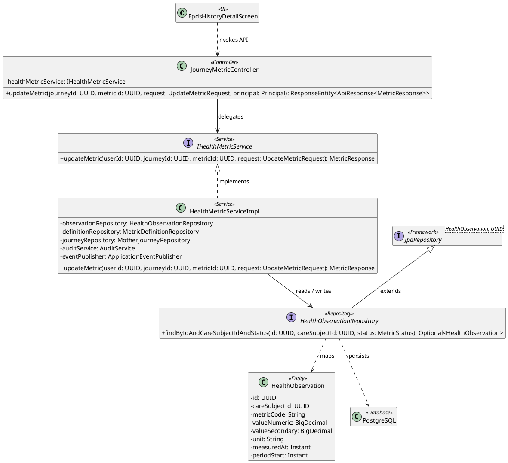
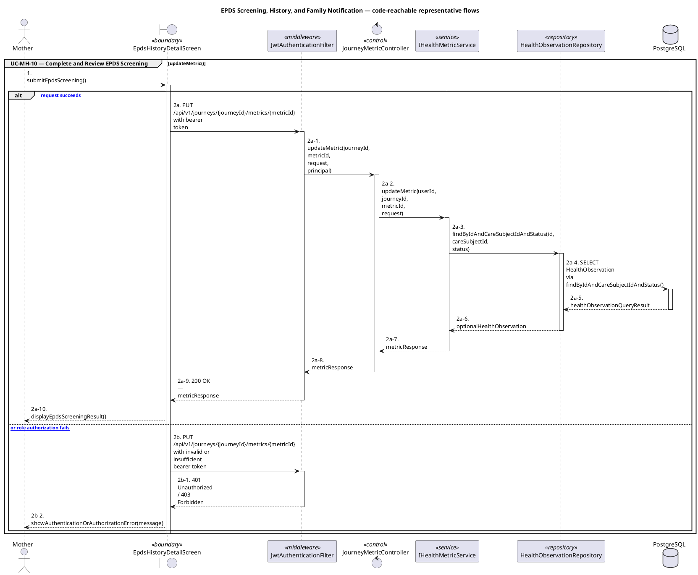
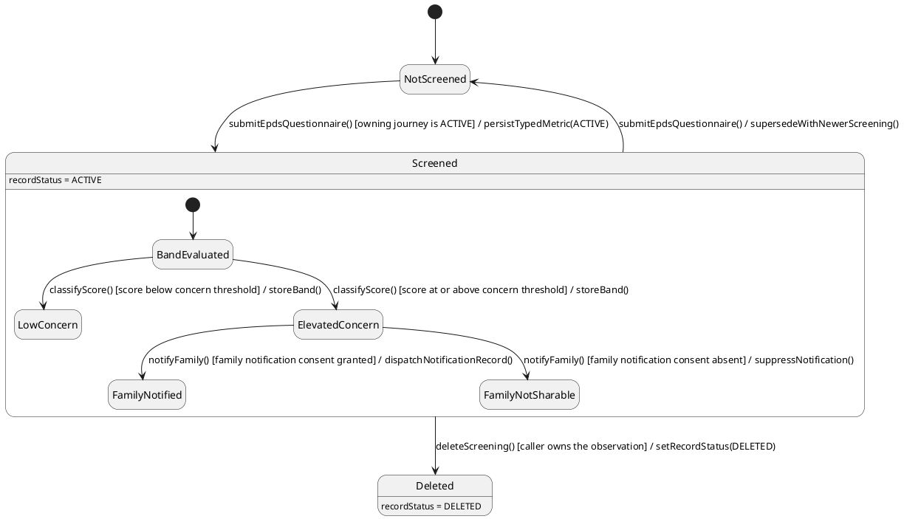

# MF-02 — EPDS Screening, History, and Family Notification

| Field | Value |
| --- | --- |
| Major Feature | **MF-02 — Mother Care Journey** |
| Function package | **EPDS Screening, History, and Family Notification** |
| Code-first use cases | `UC-MH-10` |
| Status | **Draft** |
| Baseline | Current reachable code and tests, 2026-08-23 |
| Diagram convention | `../sequence-diagram-skill.md`; explicit lifeline order, numbered messages, balanced activation |

## 1. Tổng quan luồng chính

Design EPDS as a typed journey metric with severity policy and notification side effects.

- **UC-MH-10 — Complete and Review EPDS Screening:** Answer the EPDS questionnaire, store the computed screening metric, and follow the implemented severity/safety response.

The code is authoritative for routes, handlers, delegation, authorization, and persisted state. Report1 section 6.2 is authoritative for the Major Feature name. Historical UC numbering and obsolete triage plans are not design inputs.

## 2. Function Design — Code Traceability

| UC | Actor goal | Method / route | Exact handler | Delegated function | Authorization | Source |
| --- | --- | --- | --- | --- | --- | --- |
| `UC-MH-10` | Complete and Review EPDS Screening | `GET /api/v1/journeys/{journeyId}/metrics` | `JourneyMetricController.getMetricTrend()` | `IHealthMetricService.getMetricTrend()` → `MotherJourneyRepository.findById()` | hasAnyRole('MOTHER', 'FAMILY', 'EXPERT') | `05_Development/CareBridgeAPI/src/main/java/com/carebridge/backend/health/controller/JourneyMetricController.java` |
| `UC-MH-10` | Complete and Review EPDS Screening | `POST /api/v1/journeys/{journeyId}/metrics` | `JourneyMetricController.addMetric()` | `IHealthMetricService.addMetric()` → `HealthObservationRepository.save()` | hasRole('MOTHER') | `05_Development/CareBridgeAPI/src/main/java/com/carebridge/backend/health/controller/JourneyMetricController.java` |
| `UC-MH-10` | Complete and Review EPDS Screening | `GET /api/v1/journeys/{journeyId}/metrics/capabilities` | `JourneyMetricController.getCapabilities()` | `IHealthMetricService.getCapabilities()` → `MotherJourneyRepository.findById()` | hasRole('MOTHER') | `05_Development/CareBridgeAPI/src/main/java/com/carebridge/backend/health/controller/JourneyMetricController.java` |
| `UC-MH-10` | Complete and Review EPDS Screening | `PUT /api/v1/journeys/{journeyId}/metrics/{metricId}` | `JourneyMetricController.updateMetric()` | `IHealthMetricService.updateMetric()` → `HealthObservationRepository.findByIdAndCareSubjectIdAndStatus()` | hasRole('MOTHER') | `05_Development/CareBridgeAPI/src/main/java/com/carebridge/backend/health/controller/JourneyMetricController.java` |

## 3. Class Diagram

This design-level UML follows the current source declarations: fields become attributes, reachable methods become operations, `implements` becomes realization, repository inheritance becomes generalization, and runtime-only calls remain dependencies. A missing layer or ownership relation is not invented.

**Figure 1 — Class Diagram: EPDS Screening, History, and Family Notification**

## 4. Sequence Diagram — Main Flow

Each group is a representative reachable main flow. The full endpoint surface remains in the Function Design table above.

**Brief Explanation:**

1. The actor starts each grouped use case through the code-reachable UI boundary.
2. Protected requests pass through JwtAuthenticationFilter; rejected credentials or roles return 401 Unauthorized or 403 Forbidden without invoking the controller.
3. The controller receives the request and invokes the exact delegated operation resolved from the current source.
4. The service applies the business policy and coordinates downstream collaborators while its caller remains active.
5. The repository executes the represented persistence operation and returns the stored or queried result before its activation ends.
6. The HTTP response unwinds through middleware when present, and the UI renders the server-authoritative outcome to the actor.

## 5. State Chart Diagram

The lifecycle below belongs to **The EPDS HealthMetricObservation.recordStatus, with the severity band and its family-notification side effect nested inside a stored screening**. Its states are the persisted constants declared in the sources cited under this diagram, and every transition, guard, and action is taken from the service method that writes that constant. No unreachable state is introduced.

**Figure 2 — State Chart Diagram: EPDS Screening, History, and Family Notification**

**Brief Explanation:**

1. A mother starts in `NotScreened`; EPDS is stored as a typed journey metric, so the same `ACTIVE` journey guard as other maternal metrics applies.
2. The event `submitEpdsQuestionnaire()` persists the observation with `MetricStatus.ACTIVE` and immediately enters the nested band evaluation.
3. The guard `classifyScore()` applies `EpdsSeverityPolicy` to split the result into `LowConcern` and `ElevatedConcern`; the severity band is stored, not inferred at read time.
4. The family-notification side effect fires only from `ElevatedConcern`, so a low-concern screening never generates an alert.
5. The second guard is consent: without a granted family-notification consent the action suppresses the notification rather than widening the audience.
6. Submitting a newer questionnaire supersedes the previous screening, and deletion is soft — `recordStatus = DELETED` preserves the history row.

**State sources:**

- `05_Development/CareBridgeAPI/src/main/java/com/carebridge/backend/health/entity/MetricStatus.java`
- `05_Development/CareBridgeAPI/src/main/java/com/carebridge/backend/health/policy/EpdsSeverityPolicy.java`
- `05_Development/CareBridgeAPI/src/main/java/com/carebridge/backend/health/service/impl/HealthMetricServiceImpl.java`
- `05_Development/CareBridgeAPI/src/main/java/com/carebridge/backend/notification/entity/NotificationRecordStatus.java`

## 6. Business Rules Applied

| UC | Enforced business/security rules | Known boundary or gap |
| --- | --- | --- |
| `UC-MH-10` | EPDS is screening, not diagnosis. The self-harm item follows the deterministic safety-event floor even if the total score is lower. | No additional gap recorded in the code-first baseline. |

## 7. Partial / Excluded Boundaries

- No extra release boundary beyond the code-first UC catalogue is introduced by this package.

## 8. Code and Test Evidence

- `05_Development/CareBridgeAPI/src/main/java/com/carebridge/backend/health/controller/JourneyMetricController.java`
- `05_Development/CareBridgeMobileApp/lib/features/healthRecords/screens/epds_screen.dart`
- `05_Development/CareBridgeAPI/src/main/java/com/carebridge/backend/health/policy/EpdsSeverityPolicy.java`
- `05_Development/CareBridgeAPI/src/test/java/com/carebridge/backend/health/HealthMetricServiceEpdsEventTest.java`
- `05_Development/CareBridgeAPI/src/test/java/com/carebridge/backend/health/policy/EpdsSeverityPolicyTest.java`
- `05_Development/CareBridgeMobileApp/test/features/healthRecords/epds_screen_test.dart`
