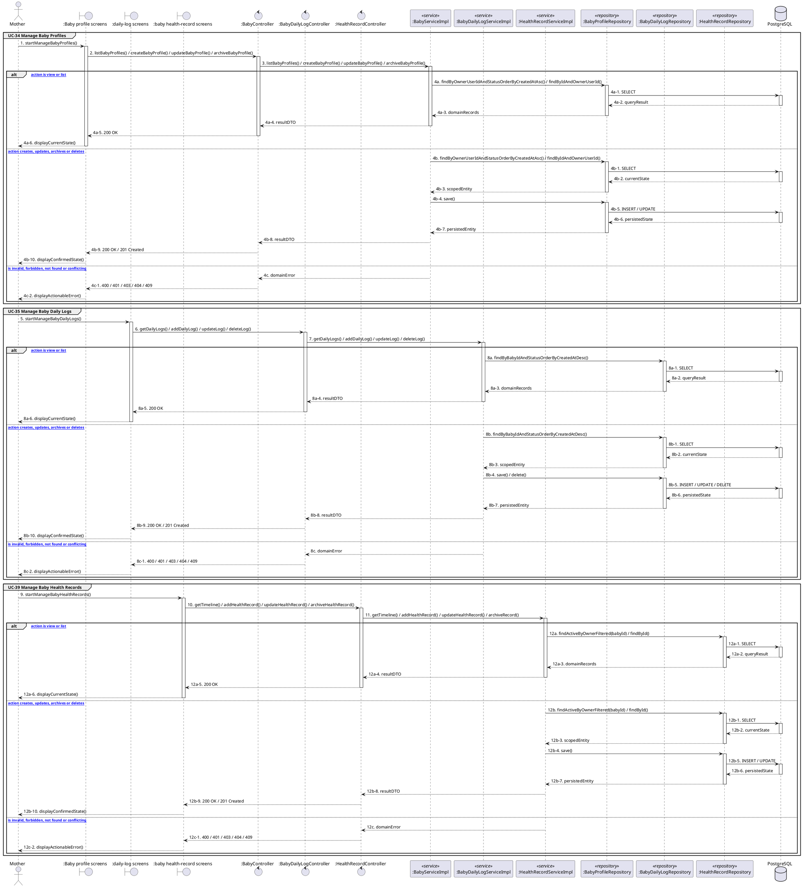

# MF-03 / Spec 01 — Baby Profile and Daily Care Overview

| Field | Value |
| --- | --- |
| Status | Draft |
| Use Cases Covered | UC-34 Manage Baby Profiles; UC-35 Manage Baby Daily Logs; UC-39 Manage Baby Health Records |
| Use Case Group | Mobile App |
| Platform | Mother Mobile App; Backend |
| Primary Actors | Mother |
| In Scope | All operations are scoped to the selected authorized baby |
| Explicitly Excluded | Pediatric diagnosis |
| Implementation Trace | UI: Baby profile, daily-log and baby health-record screens; Controller: BabyController, BabyDailyLogController, HealthRecordController; Service: BabyServiceImpl, BabyDailyLogServiceImpl, HealthRecordServiceImpl; Repository: BabyProfileRepository, BabyDailyLogRepository, HealthRecordRepository; Entity: BabyProfile, BabyDailyLog, HealthRecord |

## 1. Tổng quan luồng chính (Main Flow Overview)

All operations are scoped to the selected authorized baby. The flow starts only from the reachable UI or system trigger named in the metadata. The Backend rechecks authentication, role, ownership, membership, consent and current state as applicable; client-side visibility alone never grants access. A confirmed mutation is persisted before the UI displays success. External-service failure returns a safe retry state and must not fabricate completion.

## 2. Class Diagram

```plantuml
@startuml MF03_01_BabyProfileandDailyCareOverview_ClassDiagram
skinparam classAttributeIconSize 0
hide empty members

class "Baby profile" as UI1 <<UI>>
class "daily-log and baby health-record screens" as UI2 <<UI>>
class "BabyController" as Controller1 <<Controller>> {
  - babyService: IBabyService
  + archiveBabyProfile(babyId: UUID, principal: Principal): ResponseEntity<ApiResponse<ArchiveBabyProfileResponse>>
  + createBabyProfile(request: CreateBabyProfileRequest, principal: Principal): ResponseEntity<ApiResponse<CreateBabyProfileResponse>>
  + getBabyProfile(babyId: UUID, principal: Principal): ResponseEntity<ApiResponse<BabyProfileDetailResponse>>
  + listBabyProfiles(principal: Principal): ResponseEntity<ApiResponse<List<BabyProfileDetailResponse>>>
  + switchActiveBabyProfile(babyId: UUID, principal: Principal): ResponseEntity<ApiResponse<BabyProfileDetailResponse>>
  + updateBabyProfile(babyId: UUID, request: UpdateBabyProfileRequest, principal: Principal): ResponseEntity<ApiResponse<UpdateBabyProfileResponse>>
}
class "BabyDailyLogController" as Controller2 <<Controller>> {
  - babyDailyLogService: IBabyDailyLogService
  + getDailyLogs(babyId: UUID, principal: Principal): ApiResponse<List<BabyDailyLogResponse>>
  + addDailyLog(babyId: UUID, request: AddBabyDailyLogRequest, principal: Principal): ApiResponse<AddBabyDailyLogResponse>
  + getDailyLogDetail(babyId: UUID, logId: UUID, principal: Principal): ApiResponse<BabyDailyLogResponse>
  + deleteLog(babyId: UUID, logId: UUID, principal: Principal): ApiResponse<Void>
  + updateLog(babyId: UUID, logId: UUID, request: UpdateBabyDailyLogRequest, ...): ApiResponse<BabyDailyLogResponse>
}
class "HealthRecordController" as Controller3 <<Controller>> {
  - healthRecordService: IHealthRecordService
  + addHealthRecord(request: AddHealthRecordRequest, principal: Principal): ResponseEntity<ApiResponse<AddHealthRecordResponse>>
  + archiveHealthRecord(id: UUID, principal: Principal): ResponseEntity<ApiResponse<ArchiveHealthRecordResponse>>
  + getHealthRecord(recordId: UUID, principal: Principal): ResponseEntity<ApiResponse<HealthRecordDetailResponse>>
  + updateHealthRecord(id: UUID, request: UpdateHealthRecordRequest, principal: Principal): ResponseEntity<ApiResponse<UpdateHealthRecordResponse>>
  + getTimeline(filter: TimelineFilter, principal: Principal): ResponseEntity<ApiResponse<TimelineResponse>>
}
class "BabyServiceImpl" as Service1 <<Service>> {
  - babyRepository: BabyProfileRepository
  - accessPolicy: BabyAccessPolicy
  - auditService: AuditService
  + archiveBabyProfile(babyId: UUID, callerId: UUID): ArchiveBabyProfileResponse
  + createBabyProfile(request: CreateBabyProfileRequest, callerId: UUID): CreateBabyProfileResponse
  + getBabyProfile(profileId: UUID, callerId: UUID): BabyProfileDetailResponse
  + listBabyProfiles(callerId: UUID): List<BabyProfileDetailResponse>
  + switchActiveBabyProfile(babyId: UUID, callerId: UUID): BabyProfileDetailResponse
}
class "BabyDailyLogServiceImpl" as Service2 <<Service>> {
  - babyDailyLogRepository: BabyDailyLogRepository
  - babyProfileRepository: BabyProfileRepository
  - babyAccessPolicy: BabyAccessPolicy
  - auditService: AuditService
  + getDailyLogs(babyId: UUID, principal: Principal): List<BabyDailyLogResponse>
  - validateLogBelongsToBaby(log: BabyDailyLog, babyId: UUID): void
  + addDailyLog(babyId: UUID, request: AddBabyDailyLogRequest, userId: UUID): AddBabyDailyLogResponse
  + getDailyLogDetail(babyId: UUID, logId: UUID, principal: Principal): BabyDailyLogResponse
  - checkActiveStatus(baby: BabyProfile): void
}
class "HealthRecordServiceImpl" as Service3 <<Service>> {
  - recordRepository: HealthRecordRepository
  - recordFileRepository: HealthRecordFileRepository
  - uploadedFileRepository: UploadedFileRepository
  - fileService: IFileService
  + addHealthRecord(request: AddHealthRecordRequest, callerId: UUID): AddHealthRecordResponse
  + getHealthRecord(recordId: UUID, callerId: UUID): HealthRecordDetailResponse
  + updateHealthRecord(id: UUID, request: UpdateHealthRecordRequest, ownerUserId: UUID): UpdateHealthRecordResponse
  + archiveRecord(id: UUID, ownerUserId: UUID): ArchiveHealthRecordResponse
  + getTimeline(ownerUserId: UUID, filter: TimelineFilter): TimelineResponse
}
interface "IBabyService" as Service1Contract <<Service>>
interface "IBabyDailyLogService" as Service2Contract <<Service>>
interface "IHealthRecordService" as Service3Contract <<Service>>
interface "BabyProfileRepository" as Repository1 {
  + countByOwnerUserId(ownerUserId: UUID): long
  + findByOwnerUserIdAndStatusOrderByCreatedAtAsc(ownerUserId: UUID, status: BabyProfileStatus): List<BabyProfile>
  + findByStatus(status: BabyProfileStatus): List<BabyProfile>
  + findByIdAndOwnerUserId(id: UUID, ownerUserId: UUID): Optional<BabyProfile>
}
interface "BabyDailyLogRepository" as Repository2 {
  + findByBabyId(babyId: UUID): List<BabyDailyLog>
  + findByBabyIdAndStatusOrderByCreatedAtDesc(babyId: UUID, status: BabyDailyLogStatus): List<BabyDailyLog>
  + findByBabyLogIdAndStatus(babyLogId: UUID, status: BabyDailyLogStatus): Optional<BabyDailyLog>
}
interface "HealthRecordRepository" as Repository3 {
  + findByIdAndStatus(id: UUID, status: HealthRecordStatus): Optional<HealthRecord>
  + countByOwnerUserIdAndStatus(ownerUserId: UUID, status: HealthRecordStatus): long
}
class "BabyProfile" as Entity1 <<Entity>> {
  - id: UUID
  - ownerUserId: UUID
  - person: Person
  - nickname: String
  - birthDate: LocalDate
  - gender: Gender
  - birthWeightKg: BigDecimal
}
class "BabyDailyLog" as Entity2 <<Entity>> {
  - babyLogId: UUID
  - babyId: UUID
  - logType: String
  - startedAt: Instant
  - endedAt: Instant
  - quantity: BigDecimal
  - unit: String
}
class "HealthRecord" as Entity3 <<Entity>> {
  - id: UUID
  - ownerUserId: UUID
  - journeyId: UUID
  - babyId: UUID
  - recordType: RecordType
  - title: String
  - fileUrl: String
}
interface "JpaRepository<BabyProfile, UUID>" as Repository1Base <<Framework>>
interface "JpaRepository<BabyDailyLog, UUID>" as Repository2Base <<Framework>>
interface "JpaRepository<HealthRecord, UUID>" as Repository3Base <<Framework>>
class "PostgreSQL" as DB <<Database>>

Service1Contract <|.. Service1 : implements
Service2Contract <|.. Service2 : implements
Service3Contract <|.. Service3 : implements
Repository1Base <|-- Repository1 : extends
Repository2Base <|-- Repository2 : extends
Repository3Base <|-- Repository3 : extends
UI1 ..> Controller1 : invokes API
UI2 ..> Controller2 : invokes API
UI2 ..> Controller3 : invokes API
Controller1 --> Service1Contract : delegates
Controller2 --> Service2Contract : delegates
Controller3 --> Service3Contract : delegates
Service1 --> Repository1 : reads / writes
Service2 --> Repository2 : reads / writes
Service3 --> Repository3 : reads / writes
Repository1 ..> Entity1 : maps
Repository1 ..> DB : persists
Repository2 ..> Entity2 : maps
Repository2 ..> DB : persists
Repository3 ..> Entity3 : maps
Repository3 ..> DB : persists
Entity1 "1" -- "0..*" Entity2 : daily logs
Entity1 "1" -- "0..*" Entity3 : health records
@enduml
```

**Figure 1 — Class Diagram: Baby Profile and Daily Care Overview**

## 3. Sequence Diagram — Main Flow

**Figure 2 — Sequence Diagram: Baby Profile and Daily Care Overview Main Flow**

**Brief Explanation:**

1. The diagram separates the implemented goals covered by this specification: UC-34 Manage Baby Profiles; UC-35 Manage Baby Daily Logs; UC-39 Manage Baby Health Records.
2. Each actor action enters through the reachable mobile or web boundary and invokes the exact controller operation exposed by the current Backend.
3. The controller delegates to the mapped service operation; read branches query scoped records, while mutation branches load the current state before persisting the requested transition.
4. Repository calls and PostgreSQL responses are shown explicitly, including call-stack activation and dashed return messages.
5. Invalid, unauthorized, missing or conflicting requests return an actionable error without displaying a false success state.
6. External systems are invoked only for the mapped use cases; notification dispatches are asynchronous, while integrations that return data remain synchronous.

## 4. Business Rules Applied

- Access is enforced server-side using the current actor, role, ownership, membership and consent scope.
- All operations are scoped to the selected authorized baby.
- The following remains outside this contract: Pediatric diagnosis.
- Retries must not duplicate confirmed records, transitions, notifications or external side effects.
- Sensitive health, identity, moderation, location and safety operations retain the minimum required audit evidence.
