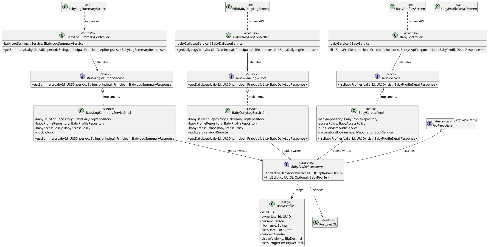
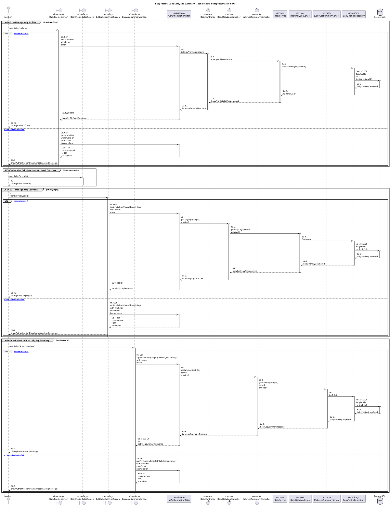
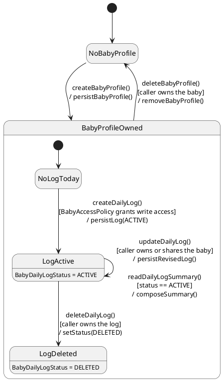

# MF-03 — Baby Profile, Daily Care, and Summary

| Field | Value |
| --- | --- |
| Major Feature | **MF-03 — Baby Care Journey, Growth & Vaccination** |
| Function package | **Baby Profile, Daily Care, and Summary** |
| Code-first use cases | `UC-BC-01, UC-BC-02, UC-BC-03, UC-BC-04` |
| Status | **Draft** |
| Baseline | Current reachable code and tests, 2026-08-23 |
| Diagram convention | `../sequence-diagram-skill.md`; explicit lifeline order, numbered messages, balanced activation |

## 1. Tổng quan luồng chính

Design baby profile ownership and the composed care-hub/daily-log experience.

- **UC-BC-01 — Manage Baby Profiles:** Create, view, update, activate, and archive an eligible baby profile.
- **UC-BC-02 — View Baby Care Hub and Detail Overview:** View the selected baby's care hub assembled from current daily-log, growth, milestone, and vaccination projections.
- **UC-BC-03 — Manage Baby Daily Logs:** Create, view, edit, and remove eligible baby feeding, sleep, diaper, or other supported daily logs.
- **UC-BC-04 — Review 24-Hour Daily Log Summary:** View the server-computed 24-hour summary of supported daily-log categories for an authorized baby.

The code is authoritative for routes, handlers, delegation, authorization, and persisted state. Report1 section 6.2 is authoritative for the Major Feature name. Historical UC numbering and obsolete triage plans are not design inputs.

## 2. Function Design — Code Traceability

| UC | Actor goal | Method / route | Exact handler | Delegated function | Authorization | Source |
| --- | --- | --- | --- | --- | --- | --- |
| `UC-BC-01` | Manage Baby Profiles | `GET /api/v1/babies` | `BabyController.listBabyProfiles()` | `IBabyService.listBabyProfiles()` → `BabyProfileRepository.findActiveBabyId()` | isAuthenticated() | `05_Development/CareBridgeAPI/src/main/java/com/carebridge/backend/baby/controller/BabyController.java` |
| `UC-BC-01` | Manage Baby Profiles | `POST /api/v1/babies` | `BabyController.createBabyProfile()` | `IBabyService.createBabyProfile()` → `BabyProfileRepository.save()` | hasAnyRole('MOTHER', 'FAMILY') | `05_Development/CareBridgeAPI/src/main/java/com/carebridge/backend/baby/controller/BabyController.java` |
| `UC-BC-01` | Manage Baby Profiles | `GET /api/v1/babies/{babyId}` | `BabyController.getBabyProfile()` | `IBabyService.getBabyProfile()` → `BabyProfileRepository.findById()` | isAuthenticated() | `05_Development/CareBridgeAPI/src/main/java/com/carebridge/backend/baby/controller/BabyController.java` |
| `UC-BC-01` | Manage Baby Profiles | `PUT /api/v1/babies/{babyId}` | `BabyController.updateBabyProfile()` | `IBabyService.updateBabyProfile()` → `BabyProfileRepository.findById()` | hasAnyRole('MOTHER', 'FAMILY') | `05_Development/CareBridgeAPI/src/main/java/com/carebridge/backend/baby/controller/BabyController.java` |
| `UC-BC-01` | Manage Baby Profiles | `PATCH /api/v1/babies/{babyId}/active` | `BabyController.switchActiveBabyProfile()` | `IBabyService.switchActiveBabyProfile()` → `BabyProfileRepository.findById()` | hasRole('MOTHER') | `05_Development/CareBridgeAPI/src/main/java/com/carebridge/backend/baby/controller/BabyController.java` |
| `UC-BC-01` | Manage Baby Profiles | `POST /api/v1/babies/{babyId}/archive` | `BabyController.archiveBabyProfile()` | `IBabyService.archiveBabyProfile()` → `BabyProfileRepository.findById()` | hasAnyRole('MOTHER', 'FAMILY') | `05_Development/CareBridgeAPI/src/main/java/com/carebridge/backend/baby/controller/BabyController.java` |
| `UC-BC-02` | View Baby Care Hub and Detail Overview | GET `/api/v1/babies` | Client composition in `baby_profile_detail_screen.dart` | Web selects the active baby or first authorized baby; empty data yields no selected baby. | Bearer-authenticated mother/caregiver; backend filters authorized babies | `05_Development/CareBridgeMobileApp/lib/features/baby/screens/baby_profile_detail_screen.dart`, `05_Development/CareBridgeWebApp/src/features/babyCare/pages/BabyCareHubPage.tsx` |
| `UC-BC-02` | View Baby Care Hub and Detail Overview | PATCH `/api/v1/babies/{babyId}/active` | Client composition in `baby_profile_detail_screen.dart` | Web persists active-baby selection before reloading all hub counters. | Authorized baby relationship required | `05_Development/CareBridgeMobileApp/lib/features/baby/screens/baby_profile_detail_screen.dart`, `05_Development/CareBridgeWebApp/src/features/babyCare/pages/BabyCareHubPage.tsx` |
| `UC-BC-02` | View Baby Care Hub and Detail Overview | GET `/api/v1/babies/{babyId}/daily-logs` | Client composition in `baby_profile_detail_screen.dart` | Web derives the journal count from the returned data array; Mobile opens the owning daily-log flow. | Authorized baby relationship required | `05_Development/CareBridgeMobileApp/lib/features/baby/screens/baby_profile_detail_screen.dart`, `05_Development/CareBridgeWebApp/src/features/babyCare/pages/BabyCareHubPage.tsx` |
| `UC-BC-02` | View Baby Care Hub and Detail Overview | GET `/api/v1/babies/{babyId}/growth-measurements?page=0&size=20` | Client composition in `baby_profile_detail_screen.dart` | Web derives the growth count from page content; Mobile loads the growth history/chart through `GrowthMeasurementService`. | Authorized baby relationship required | `05_Development/CareBridgeMobileApp/lib/features/baby/screens/baby_profile_detail_screen.dart`, `05_Development/CareBridgeWebApp/src/features/babyCare/pages/BabyCareHubPage.tsx` |
| `UC-BC-02` | View Baby Care Hub and Detail Overview | GET `/api/v1/babies/{babyId}/milestones` | Client composition in `baby_profile_detail_screen.dart` | Web derives the milestone count; Mobile loads milestone records through the baby-log service. | Authorized baby relationship required | `05_Development/CareBridgeMobileApp/lib/features/baby/screens/baby_profile_detail_screen.dart`, `05_Development/CareBridgeWebApp/src/features/babyCare/pages/BabyCareHubPage.tsx` |
| `UC-BC-02` | View Baby Care Hub and Detail Overview | GET `/api/v1/vaccination/babies/{babyId}/records` plus schedule | Client composition in `baby_profile_detail_screen.dart` | Web derives the vaccination count; Mobile separately loads vaccination records and computed schedule. | Authorized baby relationship required | `05_Development/CareBridgeMobileApp/lib/features/baby/screens/baby_profile_detail_screen.dart`, `05_Development/CareBridgeWebApp/src/features/babyCare/pages/BabyCareHubPage.tsx` |
| `UC-BC-03` | Manage Baby Daily Logs | `GET /api/v1/babies/{babyId}/daily-logs` | `BabyDailyLogController.getDailyLogs()` | `IBabyDailyLogService.getDailyLogs()` → `BabyProfileRepository.findById()` | isAuthenticated() | `05_Development/CareBridgeAPI/src/main/java/com/carebridge/backend/carejourney/controller/BabyDailyLogController.java` |
| `UC-BC-03` | Manage Baby Daily Logs | `POST /api/v1/babies/{babyId}/daily-logs` | `BabyDailyLogController.addDailyLog()` | `IBabyDailyLogService.addDailyLog()` → `BabyDailyLogRepository.save()` | hasAnyRole('MOTHER', 'FAMILY') | `05_Development/CareBridgeAPI/src/main/java/com/carebridge/backend/carejourney/controller/BabyDailyLogController.java` |
| `UC-BC-03` | Manage Baby Daily Logs | `DELETE /api/v1/babies/{babyId}/daily-logs/{logId}` | `BabyDailyLogController.deleteLog()` | `IBabyDailyLogService.deleteLog()` → `BabyDailyLogRepository.save()` | hasAnyRole('MOTHER', 'FAMILY') | `05_Development/CareBridgeAPI/src/main/java/com/carebridge/backend/carejourney/controller/BabyDailyLogController.java` |
| `UC-BC-03` | Manage Baby Daily Logs | `GET /api/v1/babies/{babyId}/daily-logs/{logId}` | `BabyDailyLogController.getDailyLogDetail()` | `IBabyDailyLogService.getDailyLogDetail()` → `BabyDailyLogRepository.findByBabyLogIdAndStatus()` | isAuthenticated() | `05_Development/CareBridgeAPI/src/main/java/com/carebridge/backend/carejourney/controller/BabyDailyLogController.java` |
| `UC-BC-03` | Manage Baby Daily Logs | `PUT /api/v1/babies/{babyId}/daily-logs/{logId}` | `BabyDailyLogController.updateLog()` | `IBabyDailyLogService.updateLog()` → `BabyDailyLogRepository.save()` | hasAnyRole('MOTHER', 'FAMILY') | `05_Development/CareBridgeAPI/src/main/java/com/carebridge/backend/carejourney/controller/BabyDailyLogController.java` |
| `UC-BC-04` | Review 24-Hour Daily Log Summary | `GET /api/v1/babies/{babyId}/daily-logs/summary` | `BabyLogSummaryController.getSummary()` | `IBabyLogSummaryService.getSummary()` → `BabyProfileRepository.findById()` | hasAnyRole('MOTHER', 'FAMILY') | `05_Development/CareBridgeAPI/src/main/java/com/carebridge/backend/carejourney/controller/BabyLogSummaryController.java` |

## 3. Class Diagram

This design-level UML follows the current source declarations: fields become attributes, reachable methods become operations, `implements` becomes realization, repository inheritance becomes generalization, and runtime-only calls remain dependencies. A missing layer or ownership relation is not invented.

**Figure 1 — Class Diagram: Baby Profile, Daily Care, and Summary**

## 4. Sequence Diagram — Main Flow

Each group is a representative reachable main flow. The full endpoint surface remains in the Function Design table above.

**Brief Explanation:**

1. The actor starts each grouped use case through the code-reachable UI boundary.
2. Protected requests pass through JwtAuthenticationFilter; rejected credentials or roles return 401 Unauthorized or 403 Forbidden without invoking the controller.
3. The controller receives the request and invokes the exact delegated operation resolved from the current source.
4. The service applies the business policy and coordinates downstream collaborators while its caller remains active.
5. The repository executes the represented persistence operation and returns the stored or queried result before its activation ends.
6. The HTTP response unwinds through middleware when present, and the UI renders the server-authoritative outcome to the actor.

## 5. State Chart Diagram

The lifecycle below belongs to **BabyDailyLog.status, with the owning baby profile as the enclosing precondition**. Its states are the persisted constants declared in the sources cited under this diagram, and every transition, guard, and action is taken from the service method that writes that constant. No unreachable state is introduced.

**Figure 2 — State Chart Diagram: Baby Profile, Daily Care, and Summary**

**Brief Explanation:**

1. The lifecycle starts in `NoBabyProfile`; no daily-care operation is reachable until a baby profile exists.
2. `BabyAccessPolicy` is the guard on entering `LogActive` — it resolves both direct ownership and access through an `ACTIVE` care group.
3. The event `createDailyLog()` persists the entry with `BabyDailyLogStatus.ACTIVE`, the only state the care hub and summary read.
4. `updateDailyLog()` and `readDailyLogSummary()` are self-transitions: they revise or compose from the stored entry without changing its lifecycle state.
5. Deletion is soft — the action sets `status = DELETED`, which removes the entry from the summary projection while keeping the row.
6. `LogDeleted` is terminal; the code has no transition that restores a deleted daily log.

**State sources:**

- `05_Development/CareBridgeAPI/src/main/java/com/carebridge/backend/carejourney/entity/BabyDailyLogStatus.java`
- `05_Development/CareBridgeAPI/src/main/java/com/carebridge/backend/carejourney/service/impl/BabyDailyLogServiceImpl.java`
- `05_Development/CareBridgeAPI/src/main/java/com/carebridge/backend/baby/policy/BabyAccessPolicy.java`
- `05_Development/CareBridgeAPI/src/main/java/com/carebridge/backend/family/entity/CareGroupStatus.java`

## 6. Business Rules Applied

| UC | Enforced business/security rules | Known boundary or gap |
| --- | --- | --- |
| `UC-BC-01` | Baby access follows mother/care-group authorization. Archive and active-profile state are server authoritative. | No additional gap recorded in the code-first baseline. |
| `UC-BC-02` | The hub is a composition; it does not create a separate canonical care-overview resource. Baby authorization is rechecked by every underlying endpoint. | Web BabyCareHub has no focused test; backend `care-overview`/`care-timeline` routes have no client consumer. |
| `UC-BC-03` | Type-specific field validation and baby authorization are server authoritative. Log time/order uses server-normalized values. | No additional gap recorded in the code-first baseline. |
| `UC-BC-04` | The summary is derived from canonical logs and must not expose another baby's data. Empty periods return a stable empty summary rather than fabricated values. | No additional gap recorded in the code-first baseline. |

## 7. Partial / Excluded Boundaries

- Web BabyCareHub has no focused test; backend `care-overview`/`care-timeline` routes have no client consumer.

## 8. Code and Test Evidence

- `05_Development/CareBridgeAPI/src/main/java/com/carebridge/backend/baby/controller/BabyController.java`
- `05_Development/CareBridgeMobileApp/lib/features/baby/screens/baby_profiles_screen.dart`
- `05_Development/CareBridgeMobileApp/lib/features/baby/screens/add_baby_screen.dart`
- `05_Development/CareBridgeAPI/src/test/java/com/carebridge/backend/baby/BabyServiceImplTest.java`
- `05_Development/CareBridgeAPI/src/test/java/com/carebridge/backend/baby/BabyServiceArchiveTest.java`
- `05_Development/CareBridgeMobileApp/test/features/baby/add_baby_screen_test.dart`
- `05_Development/CareBridgeMobileApp/lib/features/baby/screens/baby_profile_detail_screen.dart`
- `05_Development/CareBridgeWebApp/src/features/babyCare/pages/BabyCareHubPage.tsx`
- `05_Development/CareBridgeMobileApp/test/features/baby/baby_care_contract_test.dart`
- `05_Development/CareBridgeAPI/src/main/java/com/carebridge/backend/carejourney/controller/BabyDailyLogController.java`
- `05_Development/CareBridgeMobileApp/lib/features/baby/screens/edit_baby_daily_log_screen.dart`
- `05_Development/CareBridgeAPI/src/test/java/com/carebridge/backend/carejourney/BabyDailyLogServiceTest.java`
- `05_Development/CareBridgeAPI/src/main/java/com/carebridge/backend/carejourney/controller/BabyLogSummaryController.java`
- `05_Development/CareBridgeMobileApp/lib/features/baby/screens/baby_log_summary_screen.dart`
- `05_Development/CareBridgeAPI/src/test/java/com/carebridge/backend/carejourney/BabyLogSummaryServiceTest.java`
- `05_Development/CareBridgeMobileApp/test/features/baby/baby_log_summary_screen_test.dart`
