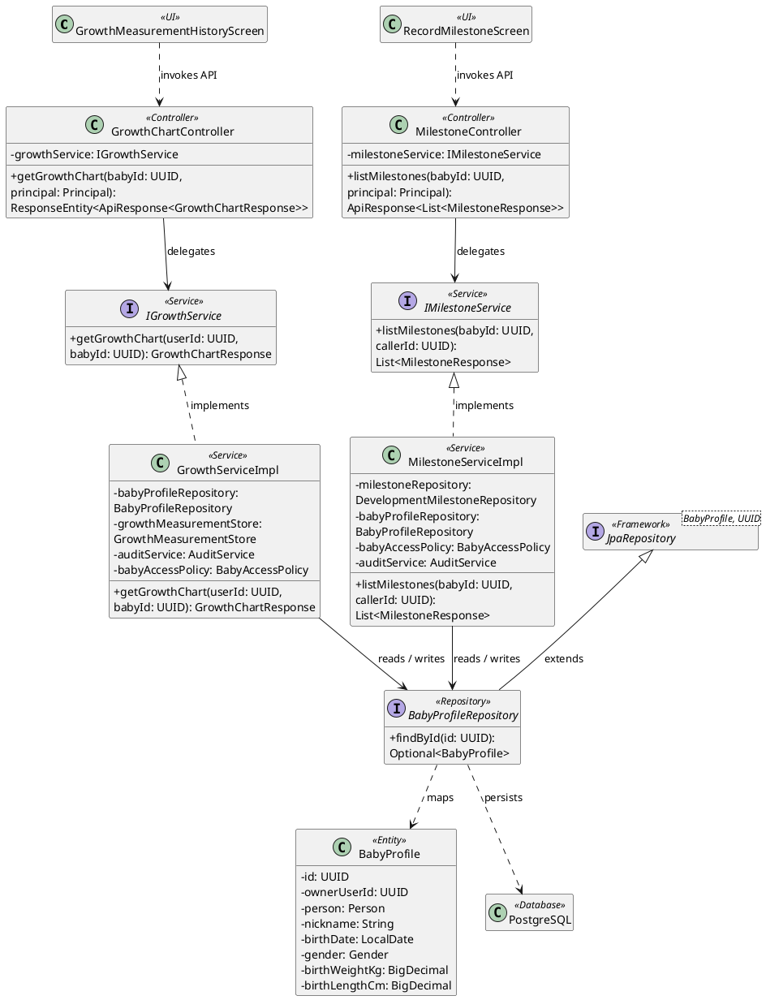
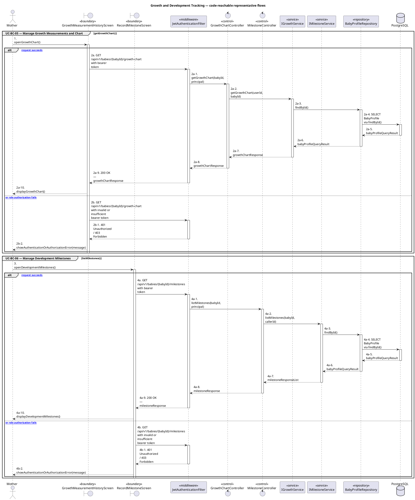
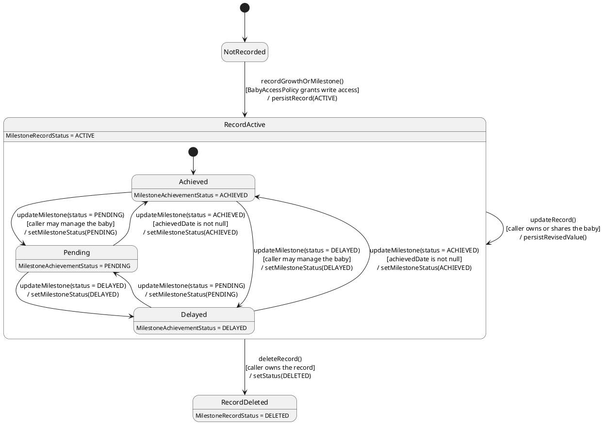

# MF-03 — Growth and Development Tracking

| Field | Value |
| --- | --- |
| Major Feature | **MF-03 — Baby Care Journey, Growth & Vaccination** |
| Function package | **Growth and Development Tracking** |
| Code-first use cases | `UC-BC-05, UC-BC-06` |
| Status | **Draft** |
| Baseline | Current reachable code and tests, 2026-08-23 |
| Diagram convention | `../sequence-diagram-skill.md`; explicit lifeline order, numbered messages, balanced activation |

## 1. Tổng quan luồng chính

Design authorized growth measurements/charts and milestone records.

- **UC-BC-05 — Manage Growth Measurements and Chart:** Record and manage growth measurements and view the derived growth chart for an authorized baby.
- **UC-BC-06 — Manage Development Milestones:** Create, view, update, and remove supported development milestone records for an authorized baby.

The code is authoritative for routes, handlers, delegation, authorization, and persisted state. Report1 section 6.2 is authoritative for the Major Feature name. Historical UC numbering and obsolete triage plans are not design inputs.

## 2. Function Design — Code Traceability

| UC | Actor goal | Method / route | Exact handler | Delegated function | Authorization | Source |
| --- | --- | --- | --- | --- | --- | --- |
| `UC-BC-05` | Manage Growth Measurements and Chart | `GET /api/v1/babies/{babyId}/growth-chart` | `GrowthChartController.getGrowthChart()` | `IGrowthService.getGrowthChart()` → `BabyProfileRepository.findById()` | hasAnyRole('MOTHER', 'FAMILY') | `05_Development/CareBridgeAPI/src/main/java/com/carebridge/backend/carejourney/controller/GrowthChartController.java` |
| `UC-BC-05` | Manage Growth Measurements and Chart | `GET /api/v1/babies/{babyId}/growth-measurements` | `GrowthMeasurementController.getGrowthMeasurementHistory()` | `IGrowthService.getGrowthMeasurementHistory()` → `BabyProfileRepository.findById()` | hasAnyRole('MOTHER', 'FAMILY') | `05_Development/CareBridgeAPI/src/main/java/com/carebridge/backend/carejourney/controller/GrowthMeasurementController.java` |
| `UC-BC-05` | Manage Growth Measurements and Chart | `POST /api/v1/babies/{babyId}/growth-measurements` | `GrowthMeasurementController.addGrowthMeasurement()` | `IGrowthService.addGrowthMeasurement()` → `BabyProfileRepository.findById()` | hasAnyRole('MOTHER', 'FAMILY') | `05_Development/CareBridgeAPI/src/main/java/com/carebridge/backend/carejourney/controller/GrowthMeasurementController.java` |
| `UC-BC-05` | Manage Growth Measurements and Chart | `DELETE /api/v1/babies/{babyId}/growth-measurements/{growthMeasurementId}` | `GrowthMeasurementController.deleteGrowthMeasurement()` | `IGrowthService.deleteGrowthMeasurement()` → `BabyProfileRepository.findById()` | hasAnyRole('MOTHER', 'FAMILY') | `05_Development/CareBridgeAPI/src/main/java/com/carebridge/backend/carejourney/controller/GrowthMeasurementController.java` |
| `UC-BC-05` | Manage Growth Measurements and Chart | `PATCH /api/v1/babies/{babyId}/growth-measurements/{growthMeasurementId}` | `GrowthMeasurementController.updateGrowthMeasurement()` | `IGrowthService.updateGrowthMeasurement()` → `BabyProfileRepository.findById()` | hasAnyRole('MOTHER', 'FAMILY') | `05_Development/CareBridgeAPI/src/main/java/com/carebridge/backend/carejourney/controller/GrowthMeasurementController.java` |
| `UC-BC-06` | Manage Development Milestones | `GET /api/v1/babies/{babyId}/milestones` | `MilestoneController.listMilestones()` | `IMilestoneService.listMilestones()` → `BabyProfileRepository.findById()` | isAuthenticated() | `05_Development/CareBridgeAPI/src/main/java/com/carebridge/backend/carejourney/controller/MilestoneController.java` |
| `UC-BC-06` | Manage Development Milestones | `POST /api/v1/babies/{babyId}/milestones` | `MilestoneController.addMilestone()` | `IMilestoneService.addMilestone()` → `BabyProfileRepository.findById()` | hasRole('MOTHER') | `05_Development/CareBridgeAPI/src/main/java/com/carebridge/backend/carejourney/controller/MilestoneController.java` |
| `UC-BC-06` | Manage Development Milestones | `DELETE /api/v1/babies/{babyId}/milestones/{milestoneId}` | `MilestoneController.deleteMilestone()` | `IMilestoneService.deleteMilestone()` → `DevelopmentMilestoneRepository.save()` | hasRole('MOTHER') | `05_Development/CareBridgeAPI/src/main/java/com/carebridge/backend/carejourney/controller/MilestoneController.java` |
| `UC-BC-06` | Manage Development Milestones | `PATCH /api/v1/babies/{babyId}/milestones/{milestoneId}` | `MilestoneController.updateMilestone()` | `IMilestoneService.updateMilestone()` → `DevelopmentMilestoneRepository.save()` | hasRole('MOTHER') | `05_Development/CareBridgeAPI/src/main/java/com/carebridge/backend/carejourney/controller/MilestoneController.java` |

## 3. Class Diagram

This design-level UML follows the current source declarations: fields become attributes, reachable methods become operations, `implements` becomes realization, repository inheritance becomes generalization, and runtime-only calls remain dependencies. A missing layer or ownership relation is not invented.

**Figure 1 — Class Diagram: Growth and Development Tracking**

## 4. Sequence Diagram — Main Flow

Each group is a representative reachable main flow. The full endpoint surface remains in the Function Design table above.

**Brief Explanation:**

1. The actor starts each grouped use case through the code-reachable UI boundary.
2. Protected requests pass through JwtAuthenticationFilter; rejected credentials or roles return 401 Unauthorized or 403 Forbidden without invoking the controller.
3. The controller receives the request and invokes the exact delegated operation resolved from the current source.
4. The service applies the business policy and coordinates downstream collaborators while its caller remains active.
5. The repository executes the represented persistence operation and returns the stored or queried result before its activation ends.
6. The HTTP response unwinds through middleware when present, and the UI renders the server-authoritative outcome to the actor.

## 5. State Chart Diagram

The lifecycle below belongs to **MilestoneRecord.status, with the derived MilestoneAchievementStatus nested inside an active record**. Its states are the persisted constants declared in the sources cited under this diagram, and every transition, guard, and action is taken from the service method that writes that constant. No unreachable state is introduced.

**Figure 2 — State Chart Diagram: Growth and Development Tracking**

**Brief Explanation:**

1. Growth measurements and development milestones start in `NotRecorded` and require `BabyAccessPolicy` to grant write access before a row is persisted.
2. The event `recordGrowthOrMilestone()` persists the record with `MilestoneRecordStatus.ACTIVE`; charts and projections read only this state.
3. Deletion is soft, so `RecordDeleted` removes the record from charts without destroying the measurement history.
4. Inside `RecordActive`, a `DevelopmentMilestone` is created with `MilestoneAchievementStatus.ACHIEVED` as its field default, so the nested region starts there rather than in `PENDING`.
5. The achievement status is supplied by the caller on `updateMilestone()` and stored — `MilestoneServiceImpl` does not derive it from the age window, so no automatic evaluation transition is drawn.
6. The one server-enforced guard is that `ACHIEVED` requires a non-null `achievedDate`; the service rejects the update otherwise, so no milestone can be marked achieved without a date.

**State sources:**

- `05_Development/CareBridgeAPI/src/main/java/com/carebridge/backend/carejourney/entity/MilestoneRecordStatus.java`
- `05_Development/CareBridgeAPI/src/main/java/com/carebridge/backend/carejourney/entity/MilestoneAchievementStatus.java`
- `05_Development/CareBridgeAPI/src/main/java/com/carebridge/backend/baby/policy/BabyAccessPolicy.java`

## 6. Business Rules Applied

| UC | Enforced business/security rules | Known boundary or gap |
| --- | --- | --- |
| `UC-BC-05` | Measurement units, ranges, chronology, and baby authorization are server authoritative. Growth charts are informational and not a diagnosis. | No additional gap recorded in the code-first baseline. |
| `UC-BC-06` | Milestone ownership and chronology are server authoritative. Milestone status is tracking information, not a diagnosis. | No additional gap recorded in the code-first baseline. |

## 7. Partial / Excluded Boundaries

- No extra release boundary beyond the code-first UC catalogue is introduced by this package.

## 8. Code and Test Evidence

- `05_Development/CareBridgeAPI/src/main/java/com/carebridge/backend/carejourney/controller/GrowthMeasurementController.java`
- `05_Development/CareBridgeAPI/src/main/java/com/carebridge/backend/carejourney/controller/GrowthChartController.java`
- `05_Development/CareBridgeMobileApp/lib/features/healthRecords/screens/growth_measurement_history_screen.dart`
- `05_Development/CareBridgeWebApp/src/features/babyCare/pages/BabyCareHubPage.tsx`
- `05_Development/CareBridgeAPI/src/test/java/com/carebridge/backend/carejourney/service/GrowthServiceTest.java`
- `05_Development/CareBridgeMobileApp/test/features/healthRecords/growth_measurement_form_test.dart`
- `05_Development/CareBridgeAPI/src/main/java/com/carebridge/backend/carejourney/controller/MilestoneController.java`
- `05_Development/CareBridgeMobileApp/lib/features/baby/screens/record_milestone_screen.dart`
- `05_Development/CareBridgeAPI/src/test/java/com/carebridge/backend/carejourney/MilestoneServiceTest.java`
- `05_Development/CareBridgeMobileApp/test/features/baby/milestone_model_test.dart`
