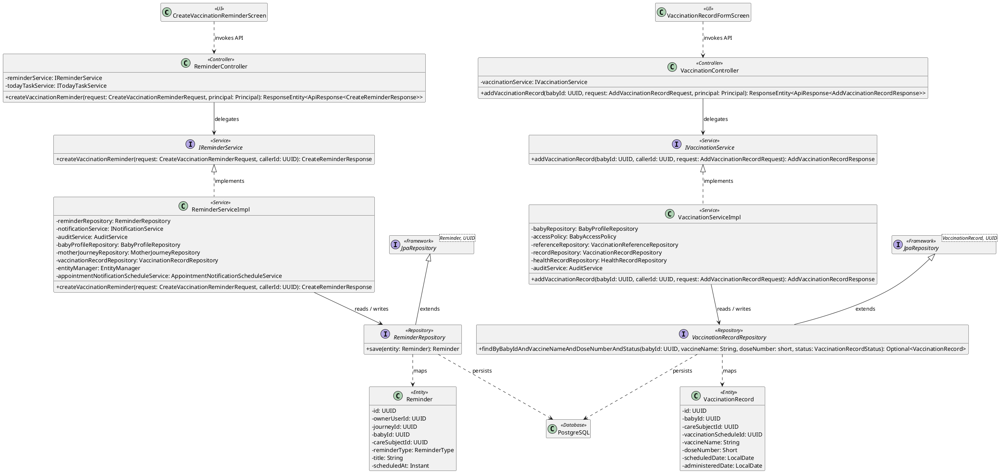
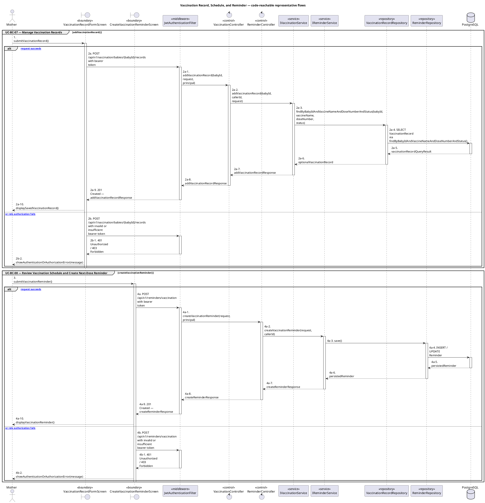

# MF-03 — Vaccination Record, Schedule, and Reminder

| Field | Value |
| --- | --- |
| Major Feature | **MF-03 — Baby Care Journey, Growth & Vaccination** |
| Function package | **Vaccination Record, Schedule, and Reminder** |
| Code-first use cases | `UC-BC-07, UC-BC-08` |
| Status | **Draft** |
| Baseline | Current reachable code and tests, 2026-08-23 |
| Diagram convention | `../sequence-diagram-skill.md`; explicit lifeline order, numbered messages, balanced activation |

## 1. Tổng quan luồng chính

Design vaccination evidence, computed schedules, and reminder creation.

- **UC-BC-07 — Manage Vaccination Records:** Create, view, update, and remove vaccination completion records for an authorized baby.
- **UC-BC-08 — Review Vaccination Schedule and Create Next-Dose Reminder:** Review the baby's vaccination schedule and create a supported reminder for an upcoming suggested dose.

The code is authoritative for routes, handlers, delegation, authorization, and persisted state. Report1 section 6.2 is authoritative for the Major Feature name. Historical UC numbering and obsolete triage plans are not design inputs.

## 2. Function Design — Code Traceability

| UC | Actor goal | Method / route | Exact handler | Delegated function | Authorization | Source |
| --- | --- | --- | --- | --- | --- | --- |
| `UC-BC-07` | Manage Vaccination Records | `GET /api/v1/vaccination/babies/{babyId}/records` | `VaccinationController.listVaccinationRecords()` | `IVaccinationService.listVaccinationRecords()` → `BabyProfileRepository.findById()` | isAuthenticated() | `05_Development/CareBridgeAPI/src/main/java/com/carebridge/backend/vaccination/controller/VaccinationController.java` |
| `UC-BC-07` | Manage Vaccination Records | `POST /api/v1/vaccination/babies/{babyId}/records` | `VaccinationController.addVaccinationRecord()` | `IVaccinationService.addVaccinationRecord()` → `VaccinationRecordRepository.findByBabyIdAndVaccineNameAndDoseNumberAndStatus()` | isAuthenticated() | `05_Development/CareBridgeAPI/src/main/java/com/carebridge/backend/vaccination/controller/VaccinationController.java` |
| `UC-BC-07` | Manage Vaccination Records | `DELETE /api/v1/vaccination/babies/{babyId}/records/{recordId}` | `VaccinationController.deleteVaccinationRecord()` | `IVaccinationService.deleteVaccinationRecord()` → `VaccinationRecordRepository.findByIdAndBabyId()` | isAuthenticated() | `05_Development/CareBridgeAPI/src/main/java/com/carebridge/backend/vaccination/controller/VaccinationController.java` |
| `UC-BC-07` | Manage Vaccination Records | `PATCH /api/v1/vaccination/babies/{babyId}/records/{recordId}` | `VaccinationController.updateVaccinationRecord()` | `IVaccinationService.updateVaccinationRecord()` → `VaccinationRecordRepository.findByIdAndBabyId()` | isAuthenticated() | `05_Development/CareBridgeAPI/src/main/java/com/carebridge/backend/vaccination/controller/VaccinationController.java` |
| `UC-BC-08` | Review Vaccination Schedule and Create Next-Dose Reminder | `POST /api/v1/reminders/vaccination` | `ReminderController.createVaccinationReminder()` | `IReminderService.createVaccinationReminder()` → `ReminderRepository.save()` | hasRole('MOTHER') | `05_Development/CareBridgeAPI/src/main/java/com/carebridge/backend/reminder/controller/ReminderController.java` |
| `UC-BC-08` | Review Vaccination Schedule and Create Next-Dose Reminder | `GET /api/v1/reminders/vaccination/suggestions` | `ReminderController.getVaccinationSuggestions()` | `IReminderService.getVaccinationSuggestions()` → `BabyProfileRepository.findByIdAndOwnerUserId()` | hasRole('MOTHER') | `05_Development/CareBridgeAPI/src/main/java/com/carebridge/backend/reminder/controller/ReminderController.java` |
| `UC-BC-08` | Review Vaccination Schedule and Create Next-Dose Reminder | `GET /api/v1/vaccination/babies/{babyId}/schedule` | `VaccinationController.getVaccinationSchedule()` | `IVaccinationService.getVaccinationSchedule()` → `BabyProfileRepository.findById()` | isAuthenticated() | `05_Development/CareBridgeAPI/src/main/java/com/carebridge/backend/vaccination/controller/VaccinationController.java` |

## 3. Class Diagram

This design-level UML follows the current source declarations: fields become attributes, reachable methods become operations, `implements` becomes realization, repository inheritance becomes generalization, and runtime-only calls remain dependencies. A missing layer or ownership relation is not invented.

**Figure 1 — Class Diagram: Vaccination Record, Schedule, and Reminder**

## 4. Sequence Diagram — Main Flow

Each group is a representative reachable main flow. The full endpoint surface remains in the Function Design table above.

**Brief Explanation:**

1. The actor starts each grouped use case through the code-reachable UI boundary.
2. Protected requests pass through JwtAuthenticationFilter; rejected credentials or roles return 401 Unauthorized or 403 Forbidden without invoking the controller.
3. The controller receives the request and invokes the exact delegated operation resolved from the current source.
4. The service applies the business policy and coordinates downstream collaborators while its caller remains active.
5. The repository executes the represented persistence operation and returns the stored or queried result before its activation ends.
6. The HTTP response unwinds through middleware when present, and the UI renders the server-authoritative outcome to the actor.

## 5. Business Rules Applied

| UC | Enforced business/security rules | Known boundary or gap |
| --- | --- | --- |
| `UC-BC-07` | Dose identity, chronology, duplication, and baby authorization are server authoritative. A record does not change the vaccine catalogue itself. | No additional gap recorded in the code-first baseline. |
| `UC-BC-08` | Schedule/suggestion state comes from canonical vaccination records and catalogue rules. Creating a reminder does not mark a dose completed. | No additional gap recorded in the code-first baseline. |

## 6. Partial / Excluded Boundaries

- No extra release boundary beyond the code-first UC catalogue is introduced by this package.

## 7. Code and Test Evidence

- `05_Development/CareBridgeAPI/src/main/java/com/carebridge/backend/vaccination/controller/VaccinationController.java`
- `05_Development/CareBridgeMobileApp/lib/features/healthRecords/screens/vaccination_record_form_screen.dart`
- `05_Development/CareBridgeWebApp/src/features/babyCare/pages/BabyCareHubPage.tsx`
- `05_Development/CareBridgeAPI/src/test/java/com/carebridge/backend/vaccination/VaccinationServiceImplTest.java`
- `05_Development/CareBridgeMobileApp/test/features/healthRecords/vaccination_model_test.dart`
- `05_Development/CareBridgeMobileApp/lib/features/healthRecords/services/vaccination_service.dart`
- `05_Development/CareBridgeMobileApp/lib/features/reminder/screens/create_vaccination_reminder_screen.dart`
- `05_Development/CareBridgeAPI/src/main/java/com/carebridge/backend/reminder/controller/ReminderController.java`
- `05_Development/CareBridgeMobileApp/lib/features/reminder/services/reminder_service.dart`
- `05_Development/CareBridgeAPI/src/test/java/com/carebridge/backend/vaccination/VaccinationBookServiceTest.java`
- `05_Development/CareBridgeAPI/src/test/java/com/carebridge/backend/vaccination/VaccinationReminderDispatchTest.java`
- `05_Development/CareBridgeAPI/src/test/java/com/carebridge/backend/reminder/VaccinationReminderServiceTest.java`
