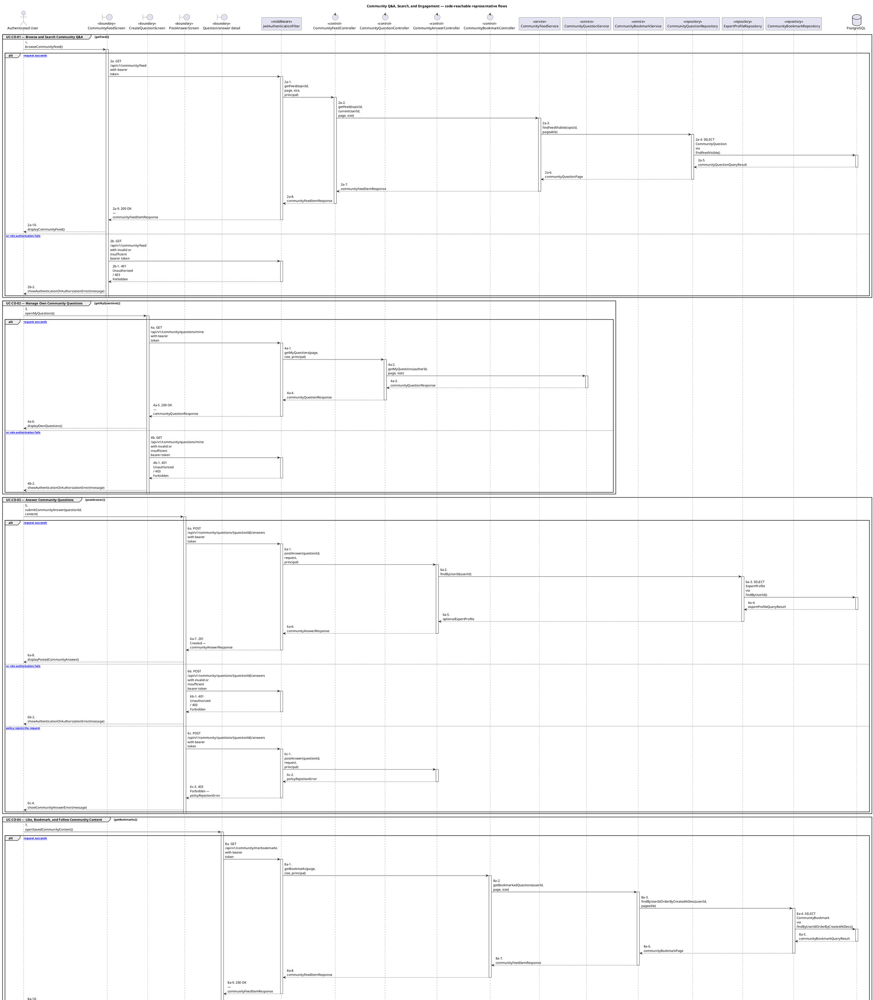

# MF-04 — Community Q&A, Search, and Engagement

| Field | Value |
| --- | --- |
| Major Feature | **MF-04 — Community Q&A & Moderation** |
| Function package | **Community Q&A, Search, and Engagement** |
| Code-first use cases | `UC-CO-01, UC-CO-02, UC-CO-03, UC-CO-04` |
| Status | **Draft** |
| Baseline | Current reachable code and tests, 2026-08-23 |
| Diagram convention | `../sequence-diagram-skill.md`; explicit lifeline order, numbered messages, balanced activation |

## 1. Tổng quan luồng chính

Design community feed/search, authored Q&A, and engagement state.

- **UC-CO-01 — Browse and Search Community Q&A:** Browse the moderated community feed, search eligible questions, inspect a question, and browse the topic directory.
- **UC-CO-02 — Manage Own Community Questions:** Create, list, edit, and delete the authenticated user's community questions with supported image attachments.
- **UC-CO-03 — Answer Community Questions:** Post, edit, or delete an eligible answer and allow experts to process questions through the expert queue.
- **UC-CO-04 — Like, Bookmark, and Follow Community Content:** Toggle question/answer likes, bookmark eligible questions, and follow topics for the authenticated user.

The code is authoritative for routes, handlers, delegation, authorization, and persisted state. Report1 section 6.2 is authoritative for the Major Feature name. Historical UC numbering and obsolete triage plans are not design inputs.

## 2. Function Design — Code Traceability

| UC | Actor goal | Method / route | Exact handler | Delegated function | Authorization | Source |
| --- | --- | --- | --- | --- | --- | --- |
| `UC-CO-01` | Browse and Search Community Q&A | `GET /api/v1/community/feed` | `CommunityFeedController.getFeed()` | `CommunityFeedService.getFeed()` → `CommunityQuestionRepository.findFeedVisible()` | No @PreAuthorize on handler/class; effective access comes from the security chain | `05_Development/CareBridgeAPI/src/main/java/com/carebridge/backend/community/controller/CommunityFeedController.java` |
| `UC-CO-01` | Browse and Search Community Q&A | `GET /api/v1/community/questions` | `CommunityQuestionController.searchQuestions()` | `CommunityQuestionSearchService.searchQuestions()` | No @PreAuthorize on handler/class; effective access comes from the security chain | `05_Development/CareBridgeAPI/src/main/java/com/carebridge/backend/community/controller/CommunityQuestionController.java` |
| `UC-CO-01` | Browse and Search Community Q&A | `GET /api/v1/community/questions/{id}` | `CommunityQuestionController.getQuestionDetail()` | `CommunityQuestionService.getQuestionDetail()` → `CommunityQuestionRepository.findById()` | isAuthenticated() | `05_Development/CareBridgeAPI/src/main/java/com/carebridge/backend/community/controller/CommunityQuestionController.java` |
| `UC-CO-01` | Browse and Search Community Q&A | `GET /api/v1/community/topics` | `CommunityTopicController.getTopics()` | `CommunityTopicService.searchTopics()` → `CommunityTopicRepository.searchByKeywordIncludingHidden()` | No @PreAuthorize on handler/class; effective access comes from the security chain | `05_Development/CareBridgeAPI/src/main/java/com/carebridge/backend/community/controller/CommunityTopicController.java` |
| `UC-CO-02` | Manage Own Community Questions | `POST /api/v1/community/questions` | `CommunityQuestionController.createQuestion()` | `CommunityQuestionService.createQuestion()` → `CommunityTopicRepository.findByIdAndTypeAndIsHiddenFalse()` | hasAnyRole('MOTHER', 'FAMILY') | `05_Development/CareBridgeAPI/src/main/java/com/carebridge/backend/community/controller/CommunityQuestionController.java` |
| `UC-CO-02` | Manage Own Community Questions | `GET /api/v1/community/questions/mine` | `CommunityQuestionController.getMyQuestions()` | `CommunityQuestionService.getMyQuestions()` | hasAnyRole('MOTHER', 'FAMILY') | `05_Development/CareBridgeAPI/src/main/java/com/carebridge/backend/community/controller/CommunityQuestionController.java` |
| `UC-CO-02` | Manage Own Community Questions | `DELETE /api/v1/community/questions/{id}` | `CommunityQuestionController.deleteQuestion()` | `CommunityQuestionService.deleteQuestion()` → `CommunityQuestionRepository.findById()` | isAuthenticated() | `05_Development/CareBridgeAPI/src/main/java/com/carebridge/backend/community/controller/CommunityQuestionController.java` |
| `UC-CO-02` | Manage Own Community Questions | `PATCH /api/v1/community/questions/{id}` | `CommunityQuestionController.editQuestion()` | `CommunityQuestionService.editQuestion()` → `CommunityQuestionRepository.findById()` | hasAnyRole('MOTHER', 'FAMILY') | `05_Development/CareBridgeAPI/src/main/java/com/carebridge/backend/community/controller/CommunityQuestionController.java` |
| `UC-CO-03` | Answer Community Questions | `POST /api/v1/community/questions/{questionId}/answers` | `CommunityAnswerController.postAnswer()` | `ExpertProfileRepository.findByUserId()` | isAuthenticated() | `05_Development/CareBridgeAPI/src/main/java/com/carebridge/backend/community/controller/CommunityAnswerController.java` |
| `UC-CO-03` | Answer Community Questions | `DELETE /api/v1/community/questions/{questionId}/answers/{id}` | `CommunityAnswerController.deleteAnswer()` | `CommunityAnswerService.deleteAnswer()` → `CommunityAnswerRepository.findById()` | isAuthenticated() | `05_Development/CareBridgeAPI/src/main/java/com/carebridge/backend/community/controller/CommunityAnswerController.java` |
| `UC-CO-03` | Answer Community Questions | `PATCH /api/v1/community/questions/{questionId}/answers/{id}` | `CommunityAnswerController.editAnswer()` | `CommunityAnswerService.editAnswer()` → `CommunityAnswerRepository.findById()` | isAuthenticated() | `05_Development/CareBridgeAPI/src/main/java/com/carebridge/backend/community/controller/CommunityAnswerController.java` |
| `UC-CO-04` | Like, Bookmark, and Follow Community Content | `POST /api/v1/community/answers/{answerId}/like` | `CommunityAnswerLikeController.toggleLike()` | `CommunityAnswerLikeService.toggleLike()` → `CommunityAnswerLikeRepository.existsByUserIdAndAnswerId()` | isAuthenticated() | `05_Development/CareBridgeAPI/src/main/java/com/carebridge/backend/community/controller/CommunityAnswerLikeController.java` |
| `UC-CO-04` | Like, Bookmark, and Follow Community Content | `GET /api/v1/community/me/bookmarks` | `CommunityBookmarkController.getBookmarks()` | `CommunityBookmarkService.getBookmarkedQuestions()` → `CommunityBookmarkRepository.findByUserIdOrderByCreatedAtDesc()` | isAuthenticated() | `05_Development/CareBridgeAPI/src/main/java/com/carebridge/backend/community/controller/CommunityBookmarkController.java` |
| `UC-CO-04` | Like, Bookmark, and Follow Community Content | `POST /api/v1/community/questions/{questionId}/bookmark` | `CommunityBookmarkController.toggleBookmark()` | `CommunityBookmarkService.toggleBookmark()` → `CommunityBookmarkRepository.existsByUserIdAndQuestionId()` | isAuthenticated() | `05_Development/CareBridgeAPI/src/main/java/com/carebridge/backend/community/controller/CommunityBookmarkController.java` |
| `UC-CO-04` | Like, Bookmark, and Follow Community Content | `POST /api/v1/community/questions/{questionId}/like` | `CommunityQuestionLikeController.toggleLike()` | `CommunityQuestionLikeService.toggleLike()` → `CommunityQuestionLikeRepository.existsByUserIdAndQuestionId()` | isAuthenticated() | `05_Development/CareBridgeAPI/src/main/java/com/carebridge/backend/community/controller/CommunityQuestionLikeController.java` |
| `UC-CO-04` | Like, Bookmark, and Follow Community Content | `POST /api/v1/community/topics/{id}/follow` | `CommunityTopicController.toggleFollow()` | `TopicFollowService.toggleFollow()` → `CommunityTopicRepository.findById()` | isAuthenticated() | `05_Development/CareBridgeAPI/src/main/java/com/carebridge/backend/community/controller/CommunityTopicController.java` |

## 3. Class Diagram

This design-level UML follows the current source declarations: fields become attributes, reachable methods become operations, `implements` becomes realization, repository inheritance becomes generalization, and runtime-only calls remain dependencies. A missing layer or ownership relation is not invented.

```plantuml
@startuml ClassDiagram_01CommunityQASearchandEngagement
skinparam classAttributeIconSize 0
hide empty members

class "CommunityFeedScreen" as UICommunityFeedScreen <<UI>>
class "CreateQuestionScreen" as UICreateQuestionScreen <<UI>>
class "PostAnswerScreen" as UIPostAnswerScreen <<UI>>
class "Question/answer detail" as UIQuestion_answer_detail <<UI>>
class "CommunityAnswerController" as ControllerCommunityAnswerController <<Controller>> {
  - answerService: CommunityAnswerService
  - expertProfileRepository: ExpertProfileRepository
  + postAnswer(questionId: UUID, request: PostCommunityAnswerRequest, principal: Principal): ResponseEntity<ApiResponse<CommunityAnswerResponse>>
}
class "CommunityBookmarkController" as ControllerCommunityBookmarkController <<Controller>> {
  - bookmarkService: CommunityBookmarkService
  + getBookmarks(page: int, size: int, principal: Principal): ResponseEntity<PaginatedResponse<CommunityFeedItemResponse>>
}
class "CommunityFeedController" as ControllerCommunityFeedController <<Controller>> {
  - feedService: CommunityFeedService
  + getFeed(topicId: UUID, page: int, size: int, principal: Principal): ResponseEntity<PaginatedResponse<CommunityFeedItemResponse>>
}
class "CommunityQuestionController" as ControllerCommunityQuestionController <<Controller>> {
  - questionService: CommunityQuestionService
  - searchService: CommunityQuestionSearchService
  + getMyQuestions(page: int, size: int, principal: Principal): ResponseEntity<PaginatedResponse<CommunityQuestionResponse>>
}
interface "CommunityBookmarkService" as ServiceContractCommunityBookmarkService <<Service>> {
  + getBookmarkedQuestions(userId: UUID, page: int, size: int): PaginatedResponse<CommunityFeedItemResponse>
}
class "CommunityBookmarkServiceImpl" as ServiceCommunityBookmarkServiceImpl <<Service>> {
  - bookmarkRepository: CommunityBookmarkRepository
  - questionRepository: CommunityQuestionRepository
  - topicRepository: CommunityTopicRepository
  - answerRepository: CommunityAnswerRepository
  - likeRepository: CommunityQuestionLikeRepository
  - feedMapper: CommunityFeedMapper
  - auditService: AuditService
  - communitySafetyPolicy: CommunitySafetyPolicy
  + getBookmarkedQuestions(userId: UUID, page: int, size: int): PaginatedResponse<CommunityFeedItemResponse>
}
ServiceContractCommunityBookmarkService <|.. ServiceCommunityBookmarkServiceImpl : implements
interface "CommunityFeedService" as ServiceContractCommunityFeedService <<Service>> {
  + getFeed(topicId: UUID, currentUserId: UUID, page: int, size: int): PaginatedResponse<CommunityFeedItemResponse>
}
class "CommunityFeedServiceImpl" as ServiceCommunityFeedServiceImpl <<Service>> {
  - questionRepository: CommunityQuestionRepository
  - answerRepository: CommunityAnswerRepository
  - topicRepository: CommunityTopicRepository
  - bookmarkRepository: CommunityBookmarkRepository
  - likeRepository: CommunityQuestionLikeRepository
  - feedMapper: CommunityFeedMapper
  - authorDisplayResolver: CommunityAuthorDisplayResolver
  + getFeed(topicId: UUID, currentUserId: UUID, page: int, size: int): PaginatedResponse<CommunityFeedItemResponse>
}
ServiceContractCommunityFeedService <|.. ServiceCommunityFeedServiceImpl : implements
interface "CommunityQuestionService" as ServiceContractCommunityQuestionService <<Service>> {
  + getMyQuestions(authorId: UUID, page: int, size: int): PaginatedResponse<CommunityQuestionResponse>
}
class "CommunityQuestionServiceImpl" as ServiceCommunityQuestionServiceImpl <<Service>> {
  - questionRepository: CommunityQuestionRepository
  - topicRepository: CommunityTopicRepository
  - answerRepository: CommunityAnswerRepository
  - bookmarkRepository: CommunityBookmarkRepository
  - answerLikeRepository: CommunityAnswerLikeRepository
  - questionLikeRepository: CommunityQuestionLikeRepository
  - questionMapper: CommunityQuestionMapper
  - answerMapper: CommunityAnswerMapper
  + getMyQuestions(authorId: UUID, page: int, size: int): PaginatedResponse<CommunityQuestionResponse>
}
ServiceContractCommunityQuestionService <|.. ServiceCommunityQuestionServiceImpl : implements
interface "CommunityBookmarkRepository" as RepositoryCommunityBookmarkRepository <<Repository>> {
  + findByUserIdOrderByCreatedAtDesc(userId: UUID, pageable: Pageable): Page<CommunityBookmark>
}
class "CommunityBookmark" as EntityCommunityBookmark <<Entity>> {
  - id: UUID
  - userId: UUID
  - questionId: UUID
  - createdAt: Instant
  - interactionType: String
  - targetContentType: String
}
interface "JpaRepository<CommunityBookmark, UUID>" as RepositoryBaseCommunityBookmarkRepository <<Framework>>
RepositoryBaseCommunityBookmarkRepository <|-- RepositoryCommunityBookmarkRepository : extends
interface "CommunityQuestionRepository" as RepositoryCommunityQuestionRepository <<Repository>> {
  + findFeedVisible(topicId: UUID, pageable: Pageable): Page<CommunityQuestion>
}
class "CommunityQuestion" as EntityCommunityQuestion <<Entity>> {
  - id: UUID
  - topicId: UUID
  - title: String
  - body: String
  - imageUrls: List<String>
  - stage: PregnancyStage
  - pregnancyWeek: Short
  - babyAgeMonths: Short
}
interface "JpaRepository<CommunityQuestion, UUID>" as RepositoryBaseCommunityQuestionRepository <<Framework>>
RepositoryBaseCommunityQuestionRepository <|-- RepositoryCommunityQuestionRepository : extends
interface "ExpertProfileRepository" as RepositoryExpertProfileRepository <<Repository>> {
  + findByUserId(userId: UUID): Optional<ExpertProfile>
}
class "ExpertProfile" as EntityExpertProfile <<Entity>> {
  - expertProfileId: UUID
  - specialty: String
  - professionalTitle: String
  - experienceYears: Integer
  - workplace: String
  - facilityId: UUID
  - workplaceProvinceId: String
  - consultationScope: String
}
interface "JpaRepository<ExpertProfile, UUID>" as RepositoryBaseExpertProfileRepository <<Framework>>
RepositoryBaseExpertProfileRepository <|-- RepositoryExpertProfileRepository : extends
class "PostgreSQL" as DB <<Database>>
UICommunityFeedScreen ..> ControllerCommunityFeedController : invokes API
UICreateQuestionScreen ..> ControllerCommunityQuestionController : invokes API
UIPostAnswerScreen ..> ControllerCommunityAnswerController : invokes API
UIQuestion_answer_detail ..> ControllerCommunityBookmarkController : invokes API
ControllerCommunityBookmarkController --> ServiceContractCommunityBookmarkService : delegates
ControllerCommunityFeedController --> ServiceContractCommunityFeedService : delegates
ControllerCommunityQuestionController --> ServiceContractCommunityQuestionService : delegates
ControllerCommunityAnswerController --> RepositoryExpertProfileRepository : reads / writes
ServiceCommunityBookmarkServiceImpl --> RepositoryCommunityBookmarkRepository : reads / writes
ServiceCommunityFeedServiceImpl --> RepositoryCommunityQuestionRepository : reads / writes
RepositoryCommunityBookmarkRepository ..> EntityCommunityBookmark : maps
RepositoryCommunityQuestionRepository ..> EntityCommunityQuestion : maps
RepositoryExpertProfileRepository ..> EntityExpertProfile : maps
RepositoryCommunityBookmarkRepository ..> DB : persists
RepositoryCommunityQuestionRepository ..> DB : persists
RepositoryExpertProfileRepository ..> DB : persists
@enduml
```

**Figure 1 — Class Diagram: Community Q&A, Search, and Engagement**

## 4. Sequence Diagram — Main Flow

Each group is a representative reachable main flow. The full endpoint surface remains in the Function Design table above.

**Brief Explanation:**

1. The actor starts each grouped use case through the code-reachable UI boundary.
2. Protected requests pass through JwtAuthenticationFilter; rejected credentials or roles return 401 Unauthorized or 403 Forbidden without invoking the controller.
3. The controller receives the request and invokes the exact delegated operation resolved from the current source.
4. The service applies the business policy and coordinates downstream collaborators while its caller remains active.
5. The repository executes the represented persistence operation and returns the stored or queried result before its activation ends.
6. The HTTP response unwinds through middleware when present, and the UI renders the server-authoritative outcome to the actor.

## 5. Business Rules Applied

| UC | Enforced business/security rules | Known boundary or gap |
| --- | --- | --- |
| `UC-CO-01` | Publication/moderation state controls visibility. Community Q&A is distinct from verified health-content lifecycle. | No additional gap recorded in the code-first baseline. |
| `UC-CO-02` | Question ownership and moderation lifecycle are server authoritative. Image upload/orphan cleanup follows current file policy. | No additional gap recorded in the code-first baseline. |
| `UC-CO-03` | Answer ownership and question/moderation state are server authoritative. Answer notification/presentation effects do not bypass canonical state. | No additional gap recorded in the code-first baseline. |
| `UC-CO-04` | Each actor-target toggle is unique/idempotent according to its owning service. Engagement cannot make hidden/ineligible content visible. | No additional gap recorded in the code-first baseline. |

## 6. Partial / Excluded Boundaries

- No extra release boundary beyond the code-first UC catalogue is introduced by this package.

## 7. Code and Test Evidence

- `05_Development/CareBridgeAPI/src/main/java/com/carebridge/backend/community/controller/CommunityFeedController.java`
- `05_Development/CareBridgeAPI/src/main/java/com/carebridge/backend/community/controller/CommunityQuestionController.java`
- `05_Development/CareBridgeAPI/src/main/java/com/carebridge/backend/community/controller/CommunityTopicController.java`
- `05_Development/CareBridgeMobileApp/lib/features/community/screens/community_feed_screen.dart`
- `05_Development/CareBridgeAPI/src/test/java/com/carebridge/backend/community/controller/CommunityFeedControllerTest.java`
- `05_Development/CareBridgeAPI/src/test/java/com/carebridge/backend/community/service/CommunityFeedServiceImplTest.java`
- `05_Development/CareBridgeAPI/src/test/java/com/carebridge/backend/community/service/CommunityQuestionSearchServiceImplTest.java`
- `05_Development/CareBridgeMobileApp/test/features/community/community_feed_screen_test.dart`
- `05_Development/CareBridgeMobileApp/lib/features/community/screens/create_question_screen.dart`
- `05_Development/CareBridgeMobileApp/lib/features/community/screens/my_questions_screen.dart`
- `05_Development/CareBridgeAPI/src/test/java/com/carebridge/backend/community/controller/CommunityQuestionControllerTest.java`
- `05_Development/CareBridgeAPI/src/test/java/com/carebridge/backend/community/controller/CommunityQuestionEditControllerTest.java`
- `05_Development/CareBridgeAPI/src/test/java/com/carebridge/backend/community/controller/CommunityQuestionDeleteControllerTest.java`
- `05_Development/CareBridgeAPI/src/main/java/com/carebridge/backend/community/controller/CommunityAnswerController.java`
- `05_Development/CareBridgeMobileApp/lib/features/community/screens/post_answer_screen.dart`
- `05_Development/CareBridgeWebApp/src/features/expert/pages/ExpertQuestionQueuePage.tsx`
- `05_Development/CareBridgeAPI/src/test/java/com/carebridge/backend/community/controller/CommunityAnswerControllerTest.java`
- `05_Development/CareBridgeAPI/src/test/java/com/carebridge/backend/community/service/CommunityAnswerServiceImplTest.java`
- `05_Development/CareBridgeMobileApp/test/features/community/post_answer_screen_test.dart`
- `05_Development/CareBridgeAPI/src/main/java/com/carebridge/backend/community/controller/CommunityQuestionLikeController.java`
- `05_Development/CareBridgeAPI/src/main/java/com/carebridge/backend/community/controller/CommunityAnswerLikeController.java`
- `05_Development/CareBridgeAPI/src/main/java/com/carebridge/backend/community/controller/CommunityBookmarkController.java`
- `05_Development/CareBridgeAPI/src/test/java/com/carebridge/backend/community/service/CommunityQuestionLikeServiceImplTest.java`
- `05_Development/CareBridgeAPI/src/test/java/com/carebridge/backend/community/service/CommunityAnswerLikeServiceImplTest.java`
- `05_Development/CareBridgeAPI/src/test/java/com/carebridge/backend/community/service/CommunityBookmarkServiceImplTest.java`
- `05_Development/CareBridgeAPI/src/test/java/com/carebridge/backend/community/service/TopicFollowServiceImplTest.java`
