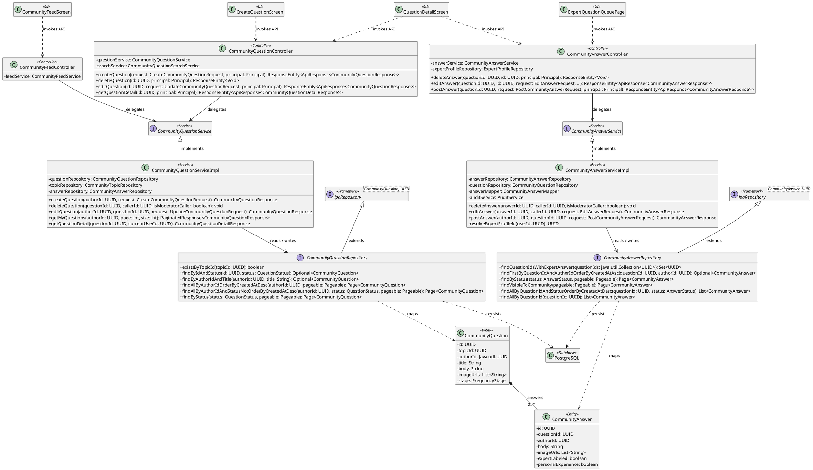
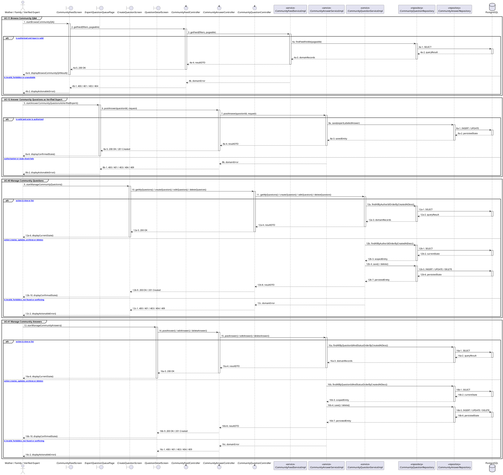

# MF-04 / Spec 01 — Community Question and Answer Flow

| Field | Value |
| --- | --- |
| Status | Draft |
| Use Cases Covered | UC-11 Browse Community Q&A; UC-12 Answer Community Questions as Verified Expert; UC-40 Manage Community Questions; UC-41 Manage Community Answers |
| Use Case Group | Shared / Common and Mobile App |
| Platform | Mobile App; Expert Web; Backend |
| Primary Actors | Mother / Family / Verified Expert |
| In Scope | Mother and Family may ask; only approved active experts receive the expert label |
| Explicitly Excluded | Bookmarks, likes, follows and community identity |
| Implementation Trace | UI: CommunityFeedScreen, QuestionDetailScreen, CreateQuestionScreen, ExpertQuestionQueuePage; Controller: CommunityFeedController, CommunityQuestionController, CommunityAnswerController; Service: CommunityQuestionServiceImpl, CommunityAnswerServiceImpl; Repository: CommunityQuestionRepository, CommunityAnswerRepository; Entity: CommunityQuestion, CommunityAnswer |

## 1. Tổng quan luồng chính (Main Flow Overview)

Mother and Family may ask; only approved active experts receive the expert label. The flow starts only from the reachable UI or system trigger named in the metadata. The Backend rechecks authentication, role, ownership, membership, consent and current state as applicable; client-side visibility alone never grants access. A confirmed mutation is persisted before the UI displays success. External-service failure returns a safe retry state and must not fabricate completion.

## 2. Class Diagram

**Figure 1 — Class Diagram: Community Question and Answer Flow**

## 3. Sequence Diagram — Main Flow

**Figure 2 — Sequence Diagram: Community Question and Answer Flow Main Flow**

**Brief Explanation:**

1. The diagram separates the implemented goals covered by this specification: UC-11 Browse Community Q&A; UC-12 Answer Community Questions as Verified Expert; UC-40 Manage Community Questions; UC-41 Manage Community Answers.
2. Each actor action enters through the reachable mobile or web boundary and invokes the exact controller operation exposed by the current Backend.
3. The controller delegates to the mapped service operation; read branches query scoped records, while mutation branches load the current state before persisting the requested transition.
4. Repository calls and PostgreSQL responses are shown explicitly, including call-stack activation and dashed return messages.
5. Invalid, unauthorized, missing or conflicting requests return an actionable error without displaying a false success state.
6. External systems are invoked only for the mapped use cases; notification dispatches are asynchronous, while integrations that return data remain synchronous.

## 4. Business Rules Applied

- Access is enforced server-side using the current actor, role, ownership, membership and consent scope.
- Mother and Family may ask; only approved active experts receive the expert label.
- The following remains outside this contract: Bookmarks, likes, follows and community identity.
- Retries must not duplicate confirmed records, transitions, notifications or external side effects.
- Sensitive health, identity, moderation, location and safety operations retain the minimum required audit evidence.
