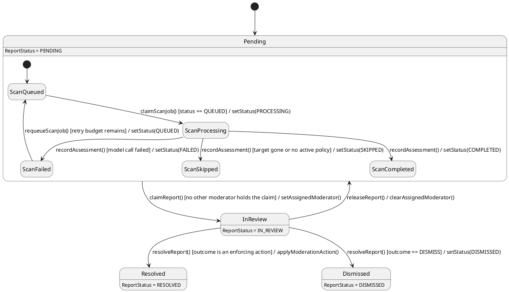

# MF-04 — Reporting, Moderation, Taxonomy, and AI Policy

| Field | Value |
| --- | --- |
| Major Feature | **MF-04 — Community Q&A & Moderation** |
| Function package | **Reporting, Moderation, Taxonomy, and AI Policy** |
| Code-first use cases | `UC-CO-06, UC-AD-09, UC-AD-16, UC-AD-17, UC-AD-18, UC-AD-19` |
| Status | **Draft** |
| Baseline | Current reachable code and tests, 2026-08-23 |
| Diagram convention | `../sequence-diagram-skill.md`; explicit lifeline order, numbered messages, balanced activation |

## 1. Tổng quan luồng chính

Design report intake, topic governance, human moderation, account enforcement, and configurable AI moderation policy.

- **UC-CO-06 — Report Community Content or Account:** Submit a supported report against eligible community content or an account for moderator review.
- **UC-AD-09 — Manage Community Taxonomy:** Create, edit, organize, hide/show, and delete eligible community categories/topics/tags while preserving hierarchy and slug invariants.
- **UC-AD-16 — Moderate Pending and Visible Community Content:** Review the community moderation dashboard and pending/visible content, inspect action history, apply an eligible moderation action, and undo it when policy allows.
- **UC-AD-17 — Claim and Resolve User Reports:** Claim/release a report case, inspect related context and advisory AI assessment, and resolve it through the report workflow.
- **UC-AD-18 — Manage Account Violations:** Inspect account violation history, apply an eligible warn/suspend action, and undo it while policy permits.
- **UC-AD-19 — Configure AI Moderation Policies:** Manage AI moderation policy versions/status, test policy behavior, and request supported rescans without allowing the model to enforce penalties directly.

The code is authoritative for routes, handlers, delegation, authorization, and persisted state. Report1 section 6.2 is authoritative for the Major Feature name. Historical UC numbering and obsolete triage plans are not design inputs.

## 2. Function Design — Code Traceability

| UC | Actor goal | Method / route | Exact handler | Delegated function | Authorization | Source |
| --- | --- | --- | --- | --- | --- | --- |
| `UC-CO-06` | Report Community Content or Account | `POST /api/v1/reports` | `ReportController.createReport()` | `ReportService.createReport()` → `ContentReportRepository.countByReporterUserIdAndTargetIdAndCreatedAtAfter()` | No @PreAuthorize on handler/class; effective access comes from the security chain | `05_Development/CareBridgeAPI/src/main/java/com/carebridge/backend/content/controller/ReportController.java` |
| `UC-AD-09` | Manage Community Taxonomy | `GET /api/v1/community/topics` | `CommunityTopicController.getTopics()` | `CommunityTopicService.searchTopics()` → `CommunityTopicRepository.searchByKeywordIncludingHidden()` | No @PreAuthorize on handler/class; effective access comes from the security chain | `05_Development/CareBridgeAPI/src/main/java/com/carebridge/backend/community/controller/CommunityTopicController.java` |
| `UC-AD-09` | Manage Community Taxonomy | `POST /api/v1/community/topics` | `CommunityTopicController.createTopic()` | `CommunityTopicService.createTopic()` → `CommunityTopicRepository.existsByNameIgnoreCase()` | hasAnyRole('MODERATOR', 'CONTENT_ADMIN') | `05_Development/CareBridgeAPI/src/main/java/com/carebridge/backend/community/controller/CommunityTopicController.java` |
| `UC-AD-09` | Manage Community Taxonomy | `DELETE /api/v1/community/topics/{id}` | `CommunityTopicController.deleteTopic()` | `CommunityTopicService.deleteTopic()` → `CommunityTopicRepository.findById()` | hasAnyRole('MODERATOR', 'CONTENT_ADMIN') | `05_Development/CareBridgeAPI/src/main/java/com/carebridge/backend/community/controller/CommunityTopicController.java` |
| `UC-AD-09` | Manage Community Taxonomy | `PATCH /api/v1/community/topics/{id}` | `CommunityTopicController.updateTopic()` | `CommunityTopicService.updateTopic()` → `CommunityTopicRepository.findById()` | hasAnyRole('MODERATOR', 'CONTENT_ADMIN') | `05_Development/CareBridgeAPI/src/main/java/com/carebridge/backend/community/controller/CommunityTopicController.java` |
| `UC-AD-16` | Moderate Pending and Visible Community Content | `POST /api/v1/admin/moderation/actions` | `ModerationController.moderateContent()` | `ModerationService.moderateContent()` → `ModerationActionRepository.save()` | hasRole('MODERATOR') | `05_Development/CareBridgeAPI/src/main/java/com/carebridge/backend/content/controller/ModerationController.java` |
| `UC-AD-16` | Moderate Pending and Visible Community Content | `POST /api/v1/admin/moderation/actions/{actionId}/undo` | `ModerationController.undoModerationAction()` | `ModerationService.undoModerationAction()` → `ModerationActionRepository.findById()` | hasRole('MODERATOR') | `05_Development/CareBridgeAPI/src/main/java/com/carebridge/backend/content/controller/ModerationController.java` |
| `UC-AD-16` | Moderate Pending and Visible Community Content | `GET /api/v1/admin/moderation/community-content` | `ModerationController.getVisibleCommunityContent()` | `ModerationService.getVisibleCommunityContent()` → `CommunityQuestionRepository.findByStatus()` | hasRole('MODERATOR') | `05_Development/CareBridgeAPI/src/main/java/com/carebridge/backend/content/controller/ModerationController.java` |
| `UC-AD-16` | Moderate Pending and Visible Community Content | `GET /api/v1/admin/moderation/content/{targetType}/{targetId}` | `ModerationController.getContentDetail()` | `ModerationService.getContentDetail()` → `CommunityQuestionRepository.findById()` | hasRole('MODERATOR') | `05_Development/CareBridgeAPI/src/main/java/com/carebridge/backend/content/controller/ModerationController.java` |
| `UC-AD-16` | Moderate Pending and Visible Community Content | `GET /api/v1/admin/moderation/history` | `ModerationController.getModerationHistory()` | `ModerationService.getModerationHistory()` → `UserRepository.findAllById()` | hasRole('MODERATOR') | `05_Development/CareBridgeAPI/src/main/java/com/carebridge/backend/content/controller/ModerationController.java` |
| `UC-AD-16` | Moderate Pending and Visible Community Content | `GET /api/v1/admin/moderation/pending-content` | `ModerationController.getPendingContentQueue()` | `ModerationService.getPendingContentQueue()` → `CommunityQuestionRepository.findByStatusWithoutOpenModerationCase()` | hasRole('MODERATOR') | `05_Development/CareBridgeAPI/src/main/java/com/carebridge/backend/content/controller/ModerationController.java` |
| `UC-AD-16` | Moderate Pending and Visible Community Content | `GET /api/v1/moderator/community/dashboard` | `CommunityDashboardController.getDashboard()` | `CommunityDashboardService.getDashboard()` → `UserRepository.countGroupByRole()` | hasRole('MODERATOR') | `05_Development/CareBridgeAPI/src/main/java/com/carebridge/backend/content/controller/CommunityDashboardController.java` |
| `UC-AD-17` | Claim and Resolve User Reports | `POST /api/v1/admin/moderation/assessments/{assessmentId}/feedback` | `AiModerationModeratorController.submitFeedback()` | `AiAssessmentModeratorService.submitFeedback()` → `AiContentAssessmentRepository.findById()` | hasRole('MODERATOR') | `05_Development/CareBridgeAPI/src/main/java/com/carebridge/backend/aimoderation/controller/AiModerationModeratorController.java` |
| `UC-AD-17` | Claim and Resolve User Reports | `GET /api/v1/admin/moderation/queue` | `ModerationController.getQueue()` | `ModerationService.getModerationQueue()` → `ContentReportRepository.findByStatusAndTargetType()` | hasRole('MODERATOR') | `05_Development/CareBridgeAPI/src/main/java/com/carebridge/backend/content/controller/ModerationController.java` |
| `UC-AD-17` | Claim and Resolve User Reports | `GET /api/v1/admin/moderation/reports/{reportId}/assessment` | `AiModerationModeratorController.getAssessment()` | `AiAssessmentModeratorService.getAssessmentForReport()` → `ContentReportRepository.findById()` | hasRole('MODERATOR') | `05_Development/CareBridgeAPI/src/main/java/com/carebridge/backend/aimoderation/controller/AiModerationModeratorController.java` |
| `UC-AD-17` | Claim and Resolve User Reports | `POST /api/v1/admin/moderation/reports/{reportId}/claim` | `ModerationController.claimReport()` | `ModerationService.claimReport()` → `ContentReportRepository.findById()` | hasRole('MODERATOR') | `05_Development/CareBridgeAPI/src/main/java/com/carebridge/backend/content/controller/ModerationController.java` |
| `UC-AD-17` | Claim and Resolve User Reports | `GET /api/v1/admin/moderation/reports/{reportId}/related` | `ModerationController.getRelatedReports()` | `ModerationService.getRelatedReports()` → `ContentReportRepository.findById()` | hasRole('MODERATOR') | `05_Development/CareBridgeAPI/src/main/java/com/carebridge/backend/content/controller/ModerationController.java` |
| `UC-AD-17` | Claim and Resolve User Reports | `POST /api/v1/admin/moderation/reports/{reportId}/release` | `ModerationController.releaseReport()` | `ModerationService.releaseReport()` → `ContentReportRepository.findById()` | hasRole('MODERATOR') | `05_Development/CareBridgeAPI/src/main/java/com/carebridge/backend/content/controller/ModerationController.java` |
| `UC-AD-17` | Claim and Resolve User Reports | `POST /api/v1/admin/moderation/reports/{reportId}/resolve` | `ModerationController.resolveReport()` | `ModerationService.resolveReport()` → `ContentReportRepository.findById()` | hasRole('MODERATOR') | `05_Development/CareBridgeAPI/src/main/java/com/carebridge/backend/content/controller/ModerationController.java` |
| `UC-AD-18` | Manage Account Violations | `POST /api/v1/admin/moderation/account-actions` | `ModerationController.moderateAccount()` | `ModerationService.moderateAccount()` → `UserRepository.findById()` | hasRole('MODERATOR') | `05_Development/CareBridgeAPI/src/main/java/com/carebridge/backend/content/controller/ModerationController.java` |
| `UC-AD-18` | Manage Account Violations | `GET /api/v1/admin/moderation/account-history` | `ModerationController.getAccountViolationHistory()` | `ModerationService.getAccountViolationHistory()` → `ModerationActionRepository.findDistinctAccountTargetIds()` | hasRole('MODERATOR') | `05_Development/CareBridgeAPI/src/main/java/com/carebridge/backend/content/controller/ModerationController.java` |
| `UC-AD-18` | Manage Account Violations | `GET /api/v1/admin/moderation/account-history/{targetUserId}` | `ModerationController.getAccountViolationDetail()` | `ModerationService.getAccountViolationHistory()` → `ModerationActionRepository.findDistinctAccountTargetIds()` | hasRole('MODERATOR') | `05_Development/CareBridgeAPI/src/main/java/com/carebridge/backend/content/controller/ModerationController.java` |
| `UC-AD-18` | Manage Account Violations | `POST /api/v1/admin/moderation/actions/{actionId}/undo` | `ModerationController.undoModerationAction()` | `ModerationService.undoModerationAction()` → `ModerationActionRepository.findById()` | hasRole('MODERATOR') | `05_Development/CareBridgeAPI/src/main/java/com/carebridge/backend/content/controller/ModerationController.java` |
| `UC-AD-19` | Configure AI Moderation Policies | `GET /api/v1/admin/ai-moderation/policies` | `AiModerationAdminController.listPolicies()` | `AiPolicyService.listPolicies()` → `AiModerationPolicyRepository.findByActive()` | hasRole('SYSTEM_ADMIN') | `05_Development/CareBridgeAPI/src/main/java/com/carebridge/backend/aimoderation/controller/AiModerationAdminController.java` |
| `UC-AD-19` | Configure AI Moderation Policies | `POST /api/v1/admin/ai-moderation/policies` | `AiModerationAdminController.createPolicy()` | `AiPolicyService.createPolicy()` → `AiModerationPolicyRepository.existsByPolicyCodeIgnoreCase()` | hasRole('SYSTEM_ADMIN') | `05_Development/CareBridgeAPI/src/main/java/com/carebridge/backend/aimoderation/controller/AiModerationAdminController.java` |
| `UC-AD-19` | Configure AI Moderation Policies | `PUT /api/v1/admin/ai-moderation/policies/{id}` | `AiModerationAdminController.updatePolicy()` | `AiPolicyService.updatePolicy()` → `AiModerationPolicyRepository.findById()` | hasRole('SYSTEM_ADMIN') | `05_Development/CareBridgeAPI/src/main/java/com/carebridge/backend/aimoderation/controller/AiModerationAdminController.java` |
| `UC-AD-19` | Configure AI Moderation Policies | `PATCH /api/v1/admin/ai-moderation/policies/{id}/status` | `AiModerationAdminController.updatePolicyStatus()` | `AiPolicyService.updatePolicyStatus()` → `AiModerationPolicyRepository.findById()` | hasRole('SYSTEM_ADMIN') | `05_Development/CareBridgeAPI/src/main/java/com/carebridge/backend/aimoderation/controller/AiModerationAdminController.java` |
| `UC-AD-19` | Configure AI Moderation Policies | `POST /api/v1/admin/ai-moderation/rescan` | `AiModerationAdminController.rescan()` | `AiScanEnqueueService.enqueueRescan()` → `AiContentScanJobRepository.existsByTargetTypeAndTargetIdAndContentHashAndStatusIn()` | hasRole('SYSTEM_ADMIN') | `05_Development/CareBridgeAPI/src/main/java/com/carebridge/backend/aimoderation/controller/AiModerationAdminController.java` |
| `UC-AD-19` | Configure AI Moderation Policies | `GET /api/v1/admin/ai-moderation/status` | `AiModerationAdminController.status()` | `AiModerationStatusService.status()` → `SystemConfigurationRepository.findFirstByOrderByCreatedAtAsc()` → `GeminiModerationClient.configState()` | hasAnyRole('SYSTEM_ADMIN', 'MODERATOR') | `05_Development/CareBridgeAPI/src/main/java/com/carebridge/backend/aimoderation/controller/AiModerationAdminController.java` |
| `UC-AD-19` | Configure AI Moderation Policies | `POST /api/v1/admin/ai-moderation/test` | `AiModerationAdminController.testPolicies()` | `AiPolicyService.testPolicies()` → `GeminiModerationClient.configState()` | hasRole('SYSTEM_ADMIN') | `05_Development/CareBridgeAPI/src/main/java/com/carebridge/backend/aimoderation/controller/AiModerationAdminController.java` |

## 3. Class Diagram

This design-level UML follows the current source declarations: fields become attributes, reachable methods become operations, `implements` becomes realization, repository inheritance becomes generalization, and runtime-only calls remain dependencies. A missing layer or ownership relation is not invented.

```plantuml
@startuml ClassDiagram_02ReportingModerationTaxonomyandAIPolicy
skinparam classAttributeIconSize 0
hide empty members

class "ManageTopicsPage" as UIManageTopicsPage <<UI>>
class "PendingContentQueuePage" as UIPendingContentQueuePage <<UI>>
class "Report action from Mobile community content/account surfaces" as UIReport_action_from_Mobile_community_content_account_surfaces <<UI>>
class "ReportsQueuePage" as UIReportsQueuePage <<UI>>
class "SafetyRuleManagementPage" as UISafetyRuleManagementPage <<UI>>
class "ViolationHistoryPage" as UIViolationHistoryPage <<UI>>
class "AiModerationAdminController" as ControllerAiModerationAdminController <<Controller>> {
  - policyService: AiPolicyService
  - statusService: AiModerationStatusService
  - enqueueService: AiScanEnqueueService
  - auditService: AuditService
  + updatePolicyStatus(id: UUID, request: UpdateAiPolicyStatusRequest, principal: Principal): ResponseEntity<ApiResponse<AiPolicyResponse>>
}
class "AiModerationModeratorController" as ControllerAiModerationModeratorController <<Controller>> {
  - moderatorService: AiAssessmentModeratorService
  + submitFeedback(assessmentId: UUID, request: AiFeedbackRequest, principal: Principal): ResponseEntity<AiFeedbackResponse>
}
class "CommunityTopicController" as ControllerCommunityTopicController <<Controller>> {
  - topicService: CommunityTopicService
  - followService: TopicFollowService
  + getTopics(keyword: String, includeHidden: boolean, type: TopicType, authentication: Authentication): ResponseEntity<ApiResponse<List<CommunityTopicResponse>>>
}
class "ModerationController" as ControllerModerationController <<Controller>> {
  - moderationService: ModerationService
  + getAccountViolationHistory(page: int, size: int, principal: Principal): ResponseEntity<AccountViolationSummaryResponse>
  + getVisibleCommunityContent(targetType: ReportTargetType, page: int, size: int, principal: Principal): ResponseEntity<CommunityContentMonitorResponse>
}
class "ReportController" as ControllerReportController <<Controller>> {
  - reportService: ReportService
  + createReport(principal: Principal, request: CreateReportRequest): ResponseEntity<ApiResponse<CreateReportResponse>>
}
class "AiAssessmentModeratorService" as ServiceAiAssessmentModeratorService <<Service>> {
  - assessmentRepository: AiContentAssessmentRepository
  - contentReportRepository: ContentReportRepository
  - moderationActionRepository: ModerationActionRepository
  - mapper: AiModerationMapper
  - auditService: AuditService
  + submitFeedback(assessmentId: UUID, request: AiFeedbackRequest, moderatorUserId: UUID): AiFeedbackResponse
}
interface "AiPolicyService" as ServiceContractAiPolicyService <<Service>> {
  + updatePolicyStatus(policyId: UUID, active: boolean, actorUserId: UUID): AiPolicyResponse
}
class "AiPolicyServiceImpl" as ServiceAiPolicyServiceImpl <<Service>> {
  - policyRepository: AiModerationPolicyRepository
  - mapper: AiModerationMapper
  - auditService: AuditService
  - policySetService: AiPolicySetService
  - decisionPolicy: AiModerationDecisionPolicy
  - geminiModerationClient: GeminiModerationClient
  + updatePolicyStatus(policyId: UUID, active: boolean, actorUserId: UUID): AiPolicyResponse
}
ServiceContractAiPolicyService <|.. ServiceAiPolicyServiceImpl : implements
interface "CommunityTopicService" as ServiceContractCommunityTopicService <<Service>> {
  + searchTopics(keyword: String, includeHidden: boolean, type: TopicType, currentUserId: UUID): List<CommunityTopicResponse>
}
class "CommunityTopicServiceImpl" as ServiceCommunityTopicServiceImpl <<Service>> {
  - topicRepository: CommunityTopicRepository
  - topicMapper: CommunityTopicMapper
  - auditService: AuditService
  - topicFollowRepository: UserTopicFollowRepository
  - questionRepository: CommunityQuestionRepository
  + searchTopics(keyword: String, includeHidden: boolean, type: TopicType, currentUserId: UUID): List<CommunityTopicResponse>
}
ServiceContractCommunityTopicService <|.. ServiceCommunityTopicServiceImpl : implements
interface "ModerationService" as ServiceContractModerationService <<Service>> {
  + getAccountViolationHistory(page: int, size: int, principal: Principal): AccountViolationSummaryResponse
  + getVisibleCommunityContent(filter: PendingContentQueueFilter, principal: Principal): CommunityContentMonitorResponse
}
class "ModerationServiceImpl" as ServiceModerationServiceImpl <<Service>> {
  - contentReportRepository: ContentReportRepository
  - contentPreviewService: ContentPreviewService
  - moderationMapper: ModerationMapper
  - auditService: AuditService
  - communityQuestionRepository: CommunityQuestionRepository
  - communityAnswerRepository: CommunityAnswerRepository
  - moderationActionRepository: ModerationActionRepository
  - userRepository: UserRepository
  + getAccountViolationHistory(page: int, size: int, principal: Principal): AccountViolationSummaryResponse
  + getVisibleCommunityContent(filter: PendingContentQueueFilter, principal: Principal): CommunityContentMonitorResponse
}
ServiceContractModerationService <|.. ServiceModerationServiceImpl : implements
interface "ReportService" as ServiceContractReportService <<Service>> {
  + createReport(request: CreateReportRequest, reporterUserId: UUID): CreateReportResponse
}
class "ReportServiceImpl" as ServiceReportServiceImpl <<Service>> {
  - contentReportRepository: ContentReportRepository
  - communityQuestionRepository: CommunityQuestionRepository
  - communityAnswerRepository: CommunityAnswerRepository
  - contentRepository: ContentRepository
  - userRepository: UserRepository
  - auditService: AuditService
  + createReport(request: CreateReportRequest, reporterUserId: UUID): CreateReportResponse
}
ServiceContractReportService <|.. ServiceReportServiceImpl : implements
interface "AiContentAssessmentRepository" as RepositoryAiContentAssessmentRepository <<Repository>> {
  + findById(id: UUID): Optional<AiContentAssessment>
}
class "AiContentAssessment" as EntityAiContentAssessment <<Entity>> {
  - id: UUID
  - jobId: UUID
  - targetType: ReportTargetType
  - targetId: UUID
  - contentHash: String
  - policySetHash: String
  - provider: String
  - model: String
}
interface "JpaRepository<AiContentAssessment, UUID>" as RepositoryBaseAiContentAssessmentRepository <<Framework>>
RepositoryBaseAiContentAssessmentRepository <|-- RepositoryAiContentAssessmentRepository : extends
interface "AiModerationPolicyRepository" as RepositoryAiModerationPolicyRepository <<Repository>> {
  + findById(id: UUID): Optional<AiModerationPolicy>
}
class "AiModerationPolicy" as EntityAiModerationPolicy <<Entity>> {
  - id: UUID
  - policyCode: String
  - name: String
  - detectionGuidance: String
  - violationCategory: AiViolationCategory
  - reportCategory: ReportCategory
  - severity: AiPolicySeverity
  - applicableTargetTypes: String
}
interface "JpaRepository<AiModerationPolicy, UUID>" as RepositoryBaseAiModerationPolicyRepository <<Framework>>
RepositoryBaseAiModerationPolicyRepository <|-- RepositoryAiModerationPolicyRepository : extends
interface "CommunityQuestionRepository" as RepositoryCommunityQuestionRepository <<Repository>> {
  + findByStatus(status: QuestionStatus, pageable: Pageable): Page<CommunityQuestion>
}
class "CommunityQuestion" as EntityCommunityQuestion <<Entity>> {
  - id: UUID
  - topicId: UUID
  - title: String
  - body: String
  - imageUrls: List<String>
  - stage: PregnancyStage
  - pregnancyWeek: Short
  - babyAgeMonths: Short
}
interface "JpaRepository<CommunityQuestion, UUID>" as RepositoryBaseCommunityQuestionRepository <<Framework>>
RepositoryBaseCommunityQuestionRepository <|-- RepositoryCommunityQuestionRepository : extends
interface "CommunityTopicRepository" as RepositoryCommunityTopicRepository <<Repository>> {
  + searchByKeywordIncludingHidden(keyword: String): List<CommunityTopic>
}
class "CommunityTopic" as EntityCommunityTopic <<Entity>> {
  - id: UUID
  - name: String
  - description: String
  - icon: String
  - type: TopicType
  - slug: String
  - parentId: UUID
  - isHidden: boolean
}
interface "JpaRepository<CommunityTopic, UUID>" as RepositoryBaseCommunityTopicRepository <<Framework>>
RepositoryBaseCommunityTopicRepository <|-- RepositoryCommunityTopicRepository : extends
interface "ContentReportRepository" as RepositoryContentReportRepository <<Repository>> {
  + countByReporterUserIdAndTargetIdAndCreatedAtAfter(reporterUserId: UUID, targetId: UUID, since: Instant): int
}
class "ContentReport" as EntityContentReport <<Entity>> {
  - id: UUID
  - targetId: UUID
  - targetType: ReportTargetType
  - status: ReportStatus
  - category: String
  - reportSource: ReportSource
  - description: String
  - reporterUserId: UUID
}
interface "JpaRepository<ContentReport, UUID>" as RepositoryBaseContentReportRepository <<Framework>>
RepositoryBaseContentReportRepository <|-- RepositoryContentReportRepository : extends
interface "ModerationActionRepository" as RepositoryModerationActionRepository <<Repository>> {
  + findDistinctAccountTargetIds(actionTypes: Collection<ModerationActionType>, pageable: Pageable pageable) { return findDistinctTargetIdsByTargetTypeAndEventCategoryIn( ReportTargetType.ACCOUNT, categories(actionTypes),): default Page<UUID>
}
class "ModerationAction" as EntityModerationAction <<Entity>> {
  - id: UUID
  - reportId: UUID
  - targetId: UUID
  - targetType: ReportTargetType
  - actionType: ModerationActionType
  - moderatorUserId: UUID
  - reason: String
  - actionAt: Instant
}
interface "JpaRepository<ModerationAction, UUID>" as RepositoryBaseModerationActionRepository <<Framework>>
RepositoryBaseModerationActionRepository <|-- RepositoryModerationActionRepository : extends
class "PostgreSQL" as DB <<Database>>
UIManageTopicsPage ..> ControllerCommunityTopicController : invokes API
UIPendingContentQueuePage ..> ControllerModerationController : invokes API
UIReport_action_from_Mobile_community_content_account_surfaces ..> ControllerReportController : invokes API
UIReportsQueuePage ..> ControllerAiModerationModeratorController : invokes API
UISafetyRuleManagementPage ..> ControllerAiModerationAdminController : invokes API
UIViolationHistoryPage ..> ControllerModerationController : invokes API
ControllerAiModerationAdminController --> ServiceContractAiPolicyService : delegates
ControllerAiModerationModeratorController --> ServiceAiAssessmentModeratorService : delegates
ControllerCommunityTopicController --> ServiceContractCommunityTopicService : delegates
ControllerModerationController --> ServiceContractModerationService : delegates
ControllerReportController --> ServiceContractReportService : delegates
ServiceAiAssessmentModeratorService --> RepositoryAiContentAssessmentRepository : reads / writes
ServiceAiPolicyServiceImpl --> RepositoryAiModerationPolicyRepository : reads / writes
ServiceCommunityTopicServiceImpl --> RepositoryCommunityTopicRepository : reads / writes
ServiceModerationServiceImpl --> RepositoryCommunityQuestionRepository : reads / writes
ServiceModerationServiceImpl --> RepositoryModerationActionRepository : reads / writes
ServiceReportServiceImpl --> RepositoryContentReportRepository : reads / writes
RepositoryAiContentAssessmentRepository ..> EntityAiContentAssessment : maps
RepositoryAiModerationPolicyRepository ..> EntityAiModerationPolicy : maps
RepositoryCommunityQuestionRepository ..> EntityCommunityQuestion : maps
RepositoryCommunityTopicRepository ..> EntityCommunityTopic : maps
RepositoryContentReportRepository ..> EntityContentReport : maps
RepositoryModerationActionRepository ..> EntityModerationAction : maps
RepositoryAiContentAssessmentRepository ..> DB : persists
RepositoryAiModerationPolicyRepository ..> DB : persists
RepositoryCommunityQuestionRepository ..> DB : persists
RepositoryCommunityTopicRepository ..> DB : persists
RepositoryContentReportRepository ..> DB : persists
RepositoryModerationActionRepository ..> DB : persists
@enduml
```

**Figure 1 — Class Diagram: Reporting, Moderation, Taxonomy, and AI Policy**

## 4. Sequence Diagram — Main Flow

Each group is a representative reachable main flow. The full endpoint surface remains in the Function Design table above.

```plantuml
@startuml
skinparam shadowing false
skinparam maxMessageSize 90
title Reporting, Moderation, Taxonomy, and AI Policy — code-reachable representative flows

actor "Authenticated User" as AAuthenticated_User
actor "Content Admin" as AContent_Admin
actor "Moderator" as AModerator
actor "System Admin" as ASystem_Admin
boundary "Report action from Mobile community content/account surfaces" as UIReport_action_from_Mobile_community_content_account_surfaces <<boundary>>
boundary "ManageTopicsPage" as UIManageTopicsPage <<boundary>>
boundary "PendingContentQueuePage" as UIPendingContentQueuePage <<boundary>>
boundary "ReportsQueuePage" as UIReportsQueuePage <<boundary>>
boundary "ViolationHistoryPage" as UIViolationHistoryPage <<boundary>>
boundary "SafetyRuleManagementPage" as UISafetyRuleManagementPage <<boundary>>
participant "JwtAuthenticationFilter" as JWT <<middleware>>
control "ReportController" as CReportController <<control>>
control "CommunityTopicController" as CCommunityTopicController <<control>>
control "ModerationController" as CModerationController <<control>>
control "AiModerationModeratorController" as CAiModerationModeratorController <<control>>
control "AiModerationAdminController" as CAiModerationAdminController <<control>>
participant "ReportService" as SReportService <<service>>
participant "CommunityTopicService" as SCommunityTopicService <<service>>
participant "ModerationService" as SModerationService <<service>>
participant "AiAssessmentModeratorService" as SAiAssessmentModeratorService <<service>>
participant "AiPolicyService" as SAiPolicyService <<service>>
participant "ContentReportRepository" as RContentReportRepository <<repository>>
participant "CommunityTopicRepository" as RCommunityTopicRepository <<repository>>
participant "CommunityQuestionRepository" as RCommunityQuestionRepository <<repository>>
participant "AiContentAssessmentRepository" as RAiContentAssessmentRepository <<repository>>
participant "ModerationActionRepository" as RModerationActionRepository <<repository>>
participant "AiModerationPolicyRepository" as RAiModerationPolicyRepository <<repository>>
database "PostgreSQL" as DB

group UC-CO-06 — Report Community Content or Account [createReport()]
AAuthenticated_User -> UIReport_action_from_Mobile_community_content_account_surfaces : 1. submitCommunityReport(targetId, reason)
activate UIReport_action_from_Mobile_community_content_account_surfaces
alt [authorized request succeeds]
UIReport_action_from_Mobile_community_content_account_surfaces -> JWT : 2a. POST /api/v1/reports with bearer token
activate JWT
JWT -> CReportController : 2a-1. createReport(principal, request)
activate CReportController
CReportController -> SReportService : 2a-2. createReport(request, reporterUserId)
activate SReportService
SReportService -> RContentReportRepository : 2a-3. countByReporterUserIdAndTargetIdAndCreatedAtAfter(reporterUserId, targetId, since)
activate RContentReportRepository
RContentReportRepository -> DB : 2a-4. SELECT ContentReport via countByReporterUserIdAndTargetIdAndCreatedAtAfter()
activate DB
DB --> RContentReportRepository : 2a-5. contentReportQueryResult
deactivate DB
RContentReportRepository --> SReportService : 2a-6. affectedCount
deactivate RContentReportRepository
SReportService --> CReportController : 2a-7. createReportResponse
deactivate SReportService
CReportController --> JWT : 2a-8. createReportResponse
deactivate CReportController
JWT --> UIReport_action_from_Mobile_community_content_account_surfaces : 2a-9. 201 Created — createReportResponse
deactivate JWT
UIReport_action_from_Mobile_community_content_account_surfaces --> AAuthenticated_User : 2a-10. displaySubmittedCommunityReport()
else [authentication or role authorization fails]
UIReport_action_from_Mobile_community_content_account_surfaces -> JWT : 2b. POST /api/v1/reports with invalid or insufficient bearer token
activate JWT
JWT --> UIReport_action_from_Mobile_community_content_account_surfaces : 2b-1. 401 Unauthorized / 403 Forbidden
deactivate JWT
UIReport_action_from_Mobile_community_content_account_surfaces --> AAuthenticated_User : 2b-2. showAuthenticationOrAuthorizationError(message)
end
deactivate UIReport_action_from_Mobile_community_content_account_surfaces
end

group UC-AD-09 — Manage Community Taxonomy [getTopics()]
AContent_Admin -> UIManageTopicsPage : 3. openCommunityTopics()
activate UIManageTopicsPage
alt [authorized request succeeds]
UIManageTopicsPage -> JWT : 4a. GET /api/v1/community/topics with bearer token
activate JWT
JWT -> CCommunityTopicController : 4a-1. getTopics(keyword, includeHidden, type, authentication)
activate CCommunityTopicController
CCommunityTopicController -> SCommunityTopicService : 4a-2. searchTopics(keyword, includeHidden, type, currentUserId)
activate SCommunityTopicService
SCommunityTopicService -> RCommunityTopicRepository : 4a-3. searchByKeywordIncludingHidden(keyword)
activate RCommunityTopicRepository
RCommunityTopicRepository -> DB : 4a-4. SELECT CommunityTopic via searchByKeywordIncludingHidden()
activate DB
DB --> RCommunityTopicRepository : 4a-5. communityTopicQueryResult
deactivate DB
RCommunityTopicRepository --> SCommunityTopicService : 4a-6. communityTopicList
deactivate RCommunityTopicRepository
SCommunityTopicService --> CCommunityTopicController : 4a-7. communityTopicResponseList
deactivate SCommunityTopicService
CCommunityTopicController --> JWT : 4a-8. communityTopicResponse
deactivate CCommunityTopicController
JWT --> UIManageTopicsPage : 4a-9. 200 OK — communityTopicResponse
deactivate JWT
UIManageTopicsPage --> AContent_Admin : 4a-10. displayCommunityTopics()
else [authentication or role authorization fails]
UIManageTopicsPage -> JWT : 4b. GET /api/v1/community/topics with invalid or insufficient bearer token
activate JWT
JWT --> UIManageTopicsPage : 4b-1. 401 Unauthorized / 403 Forbidden
deactivate JWT
UIManageTopicsPage --> AContent_Admin : 4b-2. showAuthenticationOrAuthorizationError(message)
end
deactivate UIManageTopicsPage
end

group UC-AD-16 — Moderate Pending and Visible Community Content [getVisibleCommunityContent()]
AModerator -> UIPendingContentQueuePage : 5. openModerationQueue()
activate UIPendingContentQueuePage
alt [authorized request succeeds]
UIPendingContentQueuePage -> JWT : 6a. GET /api/v1/admin/moderation/community-content with bearer token
activate JWT
JWT -> CModerationController : 6a-1. getVisibleCommunityContent(targetType, page, size, principal)
activate CModerationController
CModerationController -> SModerationService : 6a-2. getVisibleCommunityContent(filter, principal)
activate SModerationService
SModerationService -> RCommunityQuestionRepository : 6a-3. findByStatus(status, pageable)
activate RCommunityQuestionRepository
RCommunityQuestionRepository -> DB : 6a-4. SELECT CommunityQuestion via findByStatus()
activate DB
DB --> RCommunityQuestionRepository : 6a-5. communityQuestionQueryResult
deactivate DB
RCommunityQuestionRepository --> SModerationService : 6a-6. communityQuestionPage
deactivate RCommunityQuestionRepository
SModerationService --> CModerationController : 6a-7. communityContentMonitorResponse
deactivate SModerationService
CModerationController --> JWT : 6a-8. communityContentMonitorResponse
deactivate CModerationController
JWT --> UIPendingContentQueuePage : 6a-9. 200 OK — communityContentMonitorResponse
deactivate JWT
UIPendingContentQueuePage --> AModerator : 6a-10. displayModerationQueue()
else [authentication or role authorization fails]
UIPendingContentQueuePage -> JWT : 6b. GET /api/v1/admin/moderation/community-content with invalid or insufficient bearer token
activate JWT
JWT --> UIPendingContentQueuePage : 6b-1. 401 Unauthorized / 403 Forbidden
deactivate JWT
UIPendingContentQueuePage --> AModerator : 6b-2. showAuthenticationOrAuthorizationError(message)
end
deactivate UIPendingContentQueuePage
end

group UC-AD-17 — Claim and Resolve User Reports [submitFeedback()]
AModerator -> UIReportsQueuePage : 7. submitReportResolution(reportId, decision)
activate UIReportsQueuePage
alt [authorized request succeeds]
UIReportsQueuePage -> JWT : 8a. POST /api/v1/admin/moderation/assessments/{assessmentId}/feedback with bearer token
activate JWT
JWT -> CAiModerationModeratorController : 8a-1. submitFeedback(assessmentId, request, principal)
activate CAiModerationModeratorController
CAiModerationModeratorController -> SAiAssessmentModeratorService : 8a-2. submitFeedback(assessmentId, request, moderatorUserId)
activate SAiAssessmentModeratorService
SAiAssessmentModeratorService -> RAiContentAssessmentRepository : 8a-3. findById()
activate RAiContentAssessmentRepository
RAiContentAssessmentRepository -> DB : 8a-4. SELECT AiContentAssessment via findById()
activate DB
DB --> RAiContentAssessmentRepository : 8a-5. aiContentAssessmentQueryResult
deactivate DB
RAiContentAssessmentRepository --> SAiAssessmentModeratorService : 8a-6. aiContentAssessmentQueryResult
deactivate RAiContentAssessmentRepository
SAiAssessmentModeratorService --> CAiModerationModeratorController : 8a-7. aiFeedbackResponse
deactivate SAiAssessmentModeratorService
CAiModerationModeratorController --> JWT : 8a-8. aiFeedbackResponse
deactivate CAiModerationModeratorController
JWT --> UIReportsQueuePage : 8a-9. 201 Created — aiFeedbackResponse
deactivate JWT
UIReportsQueuePage --> AModerator : 8a-10. displayResolvedReport()
else [authentication or role authorization fails]
UIReportsQueuePage -> JWT : 8b. POST /api/v1/admin/moderation/assessments/{assessmentId}/feedback with invalid or insufficient bearer token
activate JWT
JWT --> UIReportsQueuePage : 8b-1. 401 Unauthorized / 403 Forbidden
deactivate JWT
UIReportsQueuePage --> AModerator : 8b-2. showAuthenticationOrAuthorizationError(message)
end
deactivate UIReportsQueuePage
end

group UC-AD-18 — Manage Account Violations [getAccountViolationHistory()]
AModerator -> UIViolationHistoryPage : 9. openAccountViolationHistory()
activate UIViolationHistoryPage
alt [authorized request succeeds]
UIViolationHistoryPage -> JWT : 10a. GET /api/v1/admin/moderation/account-history with bearer token
activate JWT
JWT -> CModerationController : 10a-1. getAccountViolationHistory(page, size, principal)
activate CModerationController
CModerationController -> SModerationService : 10a-2. getAccountViolationHistory(page, size, principal)
activate SModerationService
SModerationService -> RModerationActionRepository : 10a-3. findDistinctAccountTargetIds(actionTypes, pageable)
activate RModerationActionRepository
RModerationActionRepository -> DB : 10a-4. SELECT ModerationAction via findDistinctAccountTargetIds()
activate DB
DB --> RModerationActionRepository : 10a-5. moderationActionQueryResult
deactivate DB
RModerationActionRepository --> SModerationService : 10a-6. uUID
deactivate RModerationActionRepository
SModerationService --> CModerationController : 10a-7. accountViolationSummaryResponse
deactivate SModerationService
CModerationController --> JWT : 10a-8. accountViolationSummaryResponse
deactivate CModerationController
JWT --> UIViolationHistoryPage : 10a-9. 200 OK — accountViolationSummaryResponse
deactivate JWT
UIViolationHistoryPage --> AModerator : 10a-10. displayAccountViolationHistory()
else [authentication or role authorization fails]
UIViolationHistoryPage -> JWT : 10b. GET /api/v1/admin/moderation/account-history with invalid or insufficient bearer token
activate JWT
JWT --> UIViolationHistoryPage : 10b-1. 401 Unauthorized / 403 Forbidden
deactivate JWT
UIViolationHistoryPage --> AModerator : 10b-2. showAuthenticationOrAuthorizationError(message)
end
deactivate UIViolationHistoryPage
end

group UC-AD-19 — Configure AI Moderation Policies [updatePolicyStatus()]
ASystem_Admin -> UISafetyRuleManagementPage : 11. submitAiModerationPolicyStatus(policyId, status)
activate UISafetyRuleManagementPage
alt [authorized request succeeds]
UISafetyRuleManagementPage -> JWT : 12a. PATCH /api/v1/admin/ai-moderation/policies/{id}/status with bearer token
activate JWT
JWT -> CAiModerationAdminController : 12a-1. updatePolicyStatus(id, request, principal)
activate CAiModerationAdminController
CAiModerationAdminController -> SAiPolicyService : 12a-2. updatePolicyStatus(policyId, active, actorUserId)
activate SAiPolicyService
SAiPolicyService -> RAiModerationPolicyRepository : 12a-3. findById()
activate RAiModerationPolicyRepository
RAiModerationPolicyRepository -> DB : 12a-4. SELECT AiModerationPolicy via findById()
activate DB
DB --> RAiModerationPolicyRepository : 12a-5. aiModerationPolicyQueryResult
deactivate DB
RAiModerationPolicyRepository --> SAiPolicyService : 12a-6. aiModerationPolicyQueryResult
deactivate RAiModerationPolicyRepository
SAiPolicyService --> CAiModerationAdminController : 12a-7. aiPolicyResponse
deactivate SAiPolicyService
CAiModerationAdminController --> JWT : 12a-8. aiPolicyResponse
deactivate CAiModerationAdminController
JWT --> UISafetyRuleManagementPage : 12a-9. 200 OK — aiPolicyResponse
deactivate JWT
UISafetyRuleManagementPage --> ASystem_Admin : 12a-10. displayAiModerationPolicyStatus()
else [authentication or role authorization fails]
UISafetyRuleManagementPage -> JWT : 12b. PATCH /api/v1/admin/ai-moderation/policies/{id}/status with invalid or insufficient bearer token
activate JWT
JWT --> UISafetyRuleManagementPage : 12b-1. 401 Unauthorized / 403 Forbidden
deactivate JWT
UISafetyRuleManagementPage --> ASystem_Admin : 12b-2. showAuthenticationOrAuthorizationError(message)
end
deactivate UISafetyRuleManagementPage
end
@enduml
```

**Brief Explanation:**

1. The actor starts each grouped use case through the code-reachable UI boundary.
2. Protected requests pass through JwtAuthenticationFilter; rejected credentials or roles return 401 Unauthorized or 403 Forbidden without invoking the controller.
3. The controller receives the request and invokes the exact delegated operation resolved from the current source.
4. The service applies the business policy and coordinates downstream collaborators while its caller remains active.
5. The repository executes the represented persistence operation and returns the stored or queried result before its activation ends.
6. The HTTP response unwinds through middleware when present, and the UI renders the server-authoritative outcome to the actor.

## 5. State Chart Diagram

The lifecycle below belongs to **Report.status, with the AiScanJob lifecycle that can raise an automated case nested alongside it**. Its states are the persisted constants declared in the sources cited under this diagram, and every transition, guard, and action is taken from the service method that writes that constant. No unreachable state is introduced.

**Figure 2 — State Chart Diagram: Reporting, Moderation, Taxonomy, and AI Policy**

**Brief Explanation:**

1. A report enters as `PENDING`, whether it was raised by a user through `ReportServiceImpl` or opened automatically as an AI moderation case.
2. `claimReport()` is guarded so only one moderator holds a case at a time, and the release transition returns it to the shared `PENDING` queue.
3. The guard on `resolveReport()` splits the terminal outcome: `DISMISS` records no enforcement, while every other `ResolutionOutcome` applies a moderation action before the case becomes `RESOLVED`; `ReportStatus` also declares `CLOSED`, but no reachable code path writes it, so it is omitted here.
4. The nested scan job is claimed from `QUEUED` into `PROCESSING` with a compare-and-set, so concurrent workers cannot scan the same target twice.
5. `FAILED` is deliberately distinct from a safe verdict — `AiScanResultRecorder` never interprets a failed scan as clean, and `SKIPPED` separately covers a missing target or an inactive policy.
6. Only a failed job may be requeued, and only while retry budget remains; a completed or skipped job is terminal.

**State sources:**

- `05_Development/CareBridgeAPI/src/main/java/com/carebridge/backend/content/entity/ReportStatus.java`
- `05_Development/CareBridgeAPI/src/main/java/com/carebridge/backend/content/service/ReportServiceImpl.java`
- `05_Development/CareBridgeAPI/src/main/java/com/carebridge/backend/content/service/ModerationServiceImpl.java`
- `05_Development/CareBridgeAPI/src/main/java/com/carebridge/backend/aimoderation/entity/AiScanJobStatus.java`
- `05_Development/CareBridgeAPI/src/main/java/com/carebridge/backend/aimoderation/service/AiScanProcessingService.java`
- `05_Development/CareBridgeAPI/src/main/java/com/carebridge/backend/aimoderation/service/AiScanResultRecorder.java`

## 6. Business Rules Applied

| UC | Enforced business/security rules | Known boundary or gap |
| --- | --- | --- |
| `UC-CO-06` | Target type, reporter identity, duplicate policy, and initial report state are server authoritative. Submitting a report does not directly punish or hide an account/content item. | No additional gap recorded in the code-first baseline. |
| `UC-AD-09` | Use the hand-authored `04_Implement/CommunityTopicManagement` TDS/Test-Spec as the canonical detailed baseline for this UC. Hierarchy, type, parent, slug uniqueness, dependent-question/follow, visibility, and RBAC rules are server authoritative. | No additional gap recorded in the code-first baseline. |
| `UC-AD-16` | Backend endpoints accept Moderator according to current security policy; Web route visibility is not authorization. Moderation transitions and undo eligibility are server authoritative. | No additional gap recorded in the code-first baseline. |
| `UC-AD-17` | Claim/state ownership and resolve actions are audited. AI assessment is advisory and never directly punishes an account. | No additional gap recorded in the code-first baseline. |
| `UC-AD-18` | Role, current account state, action severity, expiry, and undo eligibility are server authoritative. Every enforcement and reversal is auditable. | No additional gap recorded in the code-first baseline. |
| `UC-AD-19` | Only System Admin manages policies. Deterministic server policy decides cases; Gemini output is advisory signal and medical symptom text is not automatically a violation. | No additional gap recorded in the code-first baseline. |

## 7. Partial / Excluded Boundaries

- No extra release boundary beyond the code-first UC catalogue is introduced by this package.

## 8. Code and Test Evidence

- `05_Development/CareBridgeAPI/src/main/java/com/carebridge/backend/content/controller/ReportController.java`
- `05_Development/CareBridgeAPI/src/main/java/com/carebridge/backend/content/service/ReportServiceImpl.java`
- `05_Development/CareBridgeAPI/src/test/java/com/carebridge/backend/content/report/ReportControllerTest.java`
- `05_Development/CareBridgeAPI/src/test/java/com/carebridge/backend/content/report/ReportServiceImplTest.java`
- `05_Development/CareBridgeAPI/src/test/java/com/carebridge/backend/content/report/ReportIntegrationTest.java`
- `05_Development/CareBridgeAPI/src/main/java/com/carebridge/backend/community/controller/CommunityTopicController.java`
- `05_Development/CareBridgeWebApp/src/features/contentManagement/pages/ManageTopicsPage.tsx`
- `05_Development/CareBridgeAPI/src/main/java/com/carebridge/backend/community/service/CommunityTopicServiceImpl.java`
- `05_Development/CareBridgeAPI/src/test/java/com/carebridge/backend/community/CommunityTopicControllerTest.java`
- `05_Development/CareBridgeAPI/src/test/java/com/carebridge/backend/community/CommunityTopicServiceImplTest.java`
- `05_Development/CareBridgeAPI/src/test/java/com/carebridge/backend/community/CommunityTopicIntegrationTest.java`
- `05_Development/CareBridgeAPI/src/test/java/com/carebridge/backend/community/util/SlugGeneratorTest.java`
- `05_Development/CareBridgeWebApp/src/features/contentManagement/pages/topicTree.test.ts`
- `05_Development/CareBridgeAPI/src/main/java/com/carebridge/backend/content/controller/CommunityDashboardController.java`
- `05_Development/CareBridgeAPI/src/main/java/com/carebridge/backend/content/controller/ModerationController.java`
- `05_Development/CareBridgeWebApp/src/features/moderation/pages/PendingContentQueuePage.tsx`
- `05_Development/CareBridgeWebApp/src/features/moderation/pages/CommunityContentMonitorPage.tsx`
- `05_Development/CareBridgeAPI/src/test/java/com/carebridge/backend/moderation/ModerationQueueIntegrationTest.java`
- `05_Development/CareBridgeAPI/src/test/java/com/carebridge/backend/moderation/ModerationContentDetailIntegrationTest.java`
- `05_Development/CareBridgeAPI/src/test/java/com/carebridge/backend/moderation/UndoModerationActionIntegrationTest.java`
- `05_Development/CareBridgeAPI/src/main/java/com/carebridge/backend/aimoderation/controller/AiModerationModeratorController.java`
- `05_Development/CareBridgeWebApp/src/features/moderation/pages/ReportsQueuePage.tsx`
- `05_Development/CareBridgeWebApp/src/features/moderation/pages/ContentReportDetailPage.tsx`
- `05_Development/CareBridgeAPI/src/test/java/com/carebridge/backend/moderation/ClaimReportWorkflowTest.java`
- `05_Development/CareBridgeAPI/src/test/java/com/carebridge/backend/moderation/ResolveReportControllerTest.java`
- `05_Development/CareBridgeAPI/src/test/java/com/carebridge/backend/moderation/ResolveReportServiceImplTest.java`
- `05_Development/CareBridgeAPI/src/test/java/com/carebridge/backend/aimoderation/AiAssessmentModeratorServiceTest.java`
- `05_Development/CareBridgeWebApp/src/features/moderation/pages/ViolationHistoryPage.tsx`
- `05_Development/CareBridgeWebApp/src/features/moderation/pages/ViolationDetailPage.tsx`
- `05_Development/CareBridgeAPI/src/test/java/com/carebridge/backend/moderation/WarnOrSuspendAccountServiceImplTest.java`
- `05_Development/CareBridgeAPI/src/test/java/com/carebridge/backend/integration/WarnOrSuspendAccountEnforcementIntegrationTest.java`
- `05_Development/CareBridgeAPI/src/main/java/com/carebridge/backend/aimoderation/controller/AiModerationAdminController.java`
- `05_Development/CareBridgeAPI/src/main/java/com/carebridge/backend/aimoderation/service/AiPolicyServiceImpl.java`
- `05_Development/CareBridgeWebApp/src/features/aiRuleManagement/pages/SafetyRuleManagementPage.tsx`
- `05_Development/CareBridgeAPI/src/test/java/com/carebridge/backend/aimoderation/AiModerationAdminControllerSecurityTest.java`
- `05_Development/CareBridgeAPI/src/test/java/com/carebridge/backend/aimoderation/AiPolicyServiceImplTest.java`
- `05_Development/CareBridgeAPI/src/test/java/com/carebridge/backend/aimoderation/AiModerationDecisionPolicyTest.java`
- `05_Development/CareBridgeAPI/src/test/java/com/carebridge/backend/aimoderation/AiContentScanWorkerTest.java`
