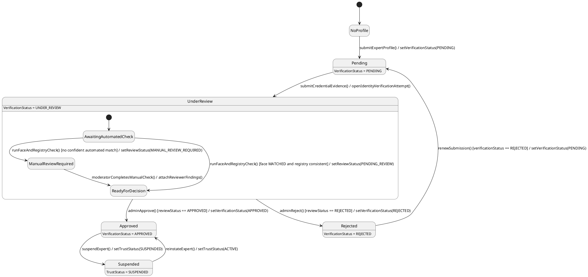

# MF-05 — Expert Onboarding, Identity, Credentials, and Trust

| Field | Value |
| --- | --- |
| Major Feature | **MF-05 — Verified Expert Network** |
| Function package | **Expert Onboarding, Identity, Credentials, and Trust** |
| Code-first use cases | `UC-EX-01, UC-EX-02, UC-EX-03, UC-EX-04, UC-EX-05, UC-AD-06` |
| Status | **Draft** |
| Baseline | Current reachable code and tests, 2026-08-23 |
| Diagram convention | `../sequence-diagram-skill.md`; explicit lifeline order, numbered messages, balanced activation |

## 1. Tổng quan luồng chính

Design expert onboarding, evidence submission, professional profile, and administrative verification.

- **UC-EX-01 — Create Expert Profile and Select Expert Type:** Create the expert profile shell, select the supported expert type, load onboarding master data, and persist onboarding progress.
- **UC-EX-02 — Review and Accept Expert Contract:** Review the current cooperation contract offer and record the applicant's acceptance.
- **UC-EX-03 — Verify Expert Identity and Face:** Capture purpose-bound identity evidence and complete the implemented face/identity verification workflow.
- **UC-EX-04 — Submit Credentials and Track Verification:** Submit professional credential evidence, preview the current submission, and track or renew verification when supported.
- **UC-EX-05 — Manage Professional Profile:** View and update supported professional-profile fields owned by the authenticated expert.
- **UC-AD-06 — Verify Experts and Credentials:** Review expert profiles, identity and credential evidence, record review decisions, and approve/reject/trust eligible experts.

The code is authoritative for routes, handlers, delegation, authorization, and persisted state. Report1 section 6.2 is authoritative for the Major Feature name. Historical UC numbering and obsolete triage plans are not design inputs.

## 2. Function Design — Code Traceability

| UC | Actor goal | Method / route | Exact handler | Delegated function | Authorization | Source |
| --- | --- | --- | --- | --- | --- | --- |
| `UC-EX-01` | Create Expert Profile and Select Expert Type | `GET /api/v1/expert/onboarding` | `ExpertIdentityVerificationController.getOnboarding()` | `IExpertIdentityVerificationService.getOnboarding()` → `ExpertProfileRepository.findByUserId()` | hasRole('EXPERT') | `05_Development/CareBridgeAPI/src/main/java/com/carebridge/backend/expertverification/controller/ExpertIdentityVerificationController.java` |
| `UC-EX-01` | Create Expert Profile and Select Expert Type | `POST /api/v1/expert/profiles` | `ExpertProfileController.createProfile()` | `IExpertProfileService.createProfile()` → `ExpertProfileRepository.findByUserId()` | hasRole('EXPERT') | `05_Development/CareBridgeAPI/src/main/java/com/carebridge/backend/expert/controller/ExpertProfileController.java` |
| `UC-EX-01` | Create Expert Profile and Select Expert Type | `PATCH /api/v1/expert/profiles/me/expert-type` | `ExpertProfileController.chooseExpertType()` | `IExpertProfileService.chooseExpertType()` → `ExpertProfileRepository.findByIdForUpdate()` | hasRole('EXPERT') | `05_Development/CareBridgeAPI/src/main/java/com/carebridge/backend/expert/controller/ExpertProfileController.java` |
| `UC-EX-01` | Create Expert Profile and Select Expert Type | `GET /api/v1/master-data/districts` | `MasterDataController.getDistricts()` | `IMasterDataService.getDistrictsByProvince()` → `AdministrativeAreaRepository.findDistrictsByProvinceCode()` | No @PreAuthorize on handler/class; effective access comes from the security chain | `05_Development/CareBridgeAPI/src/main/java/com/carebridge/backend/masterdata/controller/MasterDataController.java` |
| `UC-EX-01` | Create Expert Profile and Select Expert Type | `GET /api/v1/master-data/hospitals` | `MasterDataController.getHospitals()` | `IMasterDataService.getHospitals()` → `CareFacilityRepository.findByActiveTrueOrderByNameAsc()` | No @PreAuthorize on handler/class; effective access comes from the security chain | `05_Development/CareBridgeAPI/src/main/java/com/carebridge/backend/masterdata/controller/MasterDataController.java` |
| `UC-EX-01` | Create Expert Profile and Select Expert Type | `GET /api/v1/master-data/hospitals/search/trackasia` | `MasterDataController.searchTrackAsiaHospitals()` | `ProvinceCacheService.getProvinces()` → `HttpClient.send()` | No @PreAuthorize on handler/class; effective access comes from the security chain | `05_Development/CareBridgeAPI/src/main/java/com/carebridge/backend/masterdata/controller/MasterDataController.java` |
| `UC-EX-01` | Create Expert Profile and Select Expert Type | `GET /api/v1/master-data/hospitals/{id}` | `MasterDataController.getHospital()` | `IMasterDataService.getHospitalById()` → `CareFacilityRepository.findByFacilityIdAndActiveTrue()` | No @PreAuthorize on handler/class; effective access comes from the security chain | `05_Development/CareBridgeAPI/src/main/java/com/carebridge/backend/masterdata/controller/MasterDataController.java` |
| `UC-EX-01` | Create Expert Profile and Select Expert Type | `GET /api/v1/master-data/provinces` | `MasterDataController.getProvinces()` | `ProvinceCacheService.getProvinces()` → `HttpClient.send()` | No @PreAuthorize on handler/class; effective access comes from the security chain | `05_Development/CareBridgeAPI/src/main/java/com/carebridge/backend/masterdata/controller/MasterDataController.java` |
| `UC-EX-01` | Create Expert Profile and Select Expert Type | `GET /api/v1/master-data/wards` | `MasterDataController.getWards()` | `ProvinceCacheService.getWardsByProvince()` → `HttpClient.send()` | No @PreAuthorize on handler/class; effective access comes from the security chain | `05_Development/CareBridgeAPI/src/main/java/com/carebridge/backend/masterdata/controller/MasterDataController.java` |
| `UC-EX-02` | Review and Accept Expert Contract | `POST /api/v1/expert/contract/accept` | `ExpertContractController.accept()` | `ExpertContractService.accept()` → `ExpertProfileRepository.findByIdForUpdate()` | hasRole('EXPERT') | `05_Development/CareBridgeAPI/src/main/java/com/carebridge/backend/expertcontract/controller/ExpertContractController.java` |
| `UC-EX-02` | Review and Accept Expert Contract | `GET /api/v1/expert/contract/offer` | `ExpertContractController.getOffer()` | `ExpertContractService.getOffer()` → `ExpertProfileRepository.findById()` | hasRole('EXPERT') | `05_Development/CareBridgeAPI/src/main/java/com/carebridge/backend/expertcontract/controller/ExpertContractController.java` |
| `UC-EX-02` | Review and Accept Expert Contract | `GET /api/v1/expert/contract/{expertProfileId}/preview` | `ExpertContractController.previewForExpert()` | `ExpertContractService.previewFor()` → `ExpertProfileRepository.findById()` | hasRole('SYSTEM_ADMIN') | `05_Development/CareBridgeAPI/src/main/java/com/carebridge/backend/expertcontract/controller/ExpertContractController.java` |
| `UC-EX-03` | Verify Expert Identity and Face | `POST /api/v1/expert/identity` | `ExpertIdentityVerificationController.submitIdentity()` | `IExpertIdentityVerificationService.submit()` → `ExpertProfileRepository.findByUserIdForUpdate()` → `CompreFacePipelineAdapter.verifyWithPipeline()` | hasRole('EXPERT') | `05_Development/CareBridgeAPI/src/main/java/com/carebridge/backend/expertverification/controller/ExpertIdentityVerificationController.java` |
| `UC-EX-03` | Verify Expert Identity and Face | `GET /api/v1/expert/identity/files/{fileId}/url` | `ExpertIdentityVerificationController.getIdentityFileUrl()` | `IExpertIdentityVerificationService.getAuthorizedFileUrl()` | hasAnyRole('EXPERT', 'SYSTEM_ADMIN') | `05_Development/CareBridgeAPI/src/main/java/com/carebridge/backend/expertverification/controller/ExpertIdentityVerificationController.java` |
| `UC-EX-03` | Verify Expert Identity and Face | `POST /api/v1/expert/verify-face` | `ExpertProfileController.verifyFace()` | `CompreFacePipelineAdapter.verifyWithPipeline()` → `FaceDetectionAdapter.detect()` | hasRole('EXPERT') | `05_Development/CareBridgeAPI/src/main/java/com/carebridge/backend/expert/controller/ExpertProfileController.java` |
| `UC-EX-04` | Submit Credentials and Track Verification | `POST /api/v1/expert/credentials` | `ExpertCredentialController.submitCredential()` | `IExpertCredentialService.submitCredential()` → `ExpertProfileRepository.findByUserId()` | hasRole('EXPERT') | `05_Development/CareBridgeAPI/src/main/java/com/carebridge/backend/expertverification/controller/ExpertCredentialController.java` |
| `UC-EX-04` | Submit Credentials and Track Verification | `GET /api/v1/expert/credentials/me` | `ExpertCredentialController.getMyCredentials()` | `IExpertCredentialService.getMyCredentials()` → `ExpertProfileRepository.findByUserId()` | hasRole('EXPERT') | `05_Development/CareBridgeAPI/src/main/java/com/carebridge/backend/expertverification/controller/ExpertCredentialController.java` |
| `UC-EX-04` | Submit Credentials and Track Verification | `DELETE /api/v1/expert/credentials/{credentialId}` | `ExpertCredentialController.deleteCredential()` | `IExpertCredentialService.deleteCredential()` → `ExpertCredentialRepository.findByCredentialId()` | hasRole('EXPERT') | `05_Development/CareBridgeAPI/src/main/java/com/carebridge/backend/expertverification/controller/ExpertCredentialController.java` |
| `UC-EX-04` | Submit Credentials and Track Verification | `GET /api/v1/expert/credentials/{credentialId}` | `ExpertCredentialController.getCredentialDetail()` | `IExpertCredentialService.getCredentialDetail()` → `ExpertCredentialRepository.findByCredentialId()` | hasRole('EXPERT') | `05_Development/CareBridgeAPI/src/main/java/com/carebridge/backend/expertverification/controller/ExpertCredentialController.java` |
| `UC-EX-04` | Submit Credentials and Track Verification | `GET /api/v1/expert/credentials/{credentialId}/file` | `ExpertCredentialController.getCredentialFile()` | `IExpertCredentialService.getCredentialFile()` → `ExpertCredentialRepository.findByCredentialId()` | hasRole('SYSTEM_ADMIN') | `05_Development/CareBridgeAPI/src/main/java/com/carebridge/backend/expertverification/controller/ExpertCredentialController.java` |
| `UC-EX-04` | Submit Credentials and Track Verification | `GET /api/v1/expert/credentials/{credentialId}/preview` | `ExpertCredentialController.previewCredential()` | `IExpertCredentialService.previewCredential()` → `ExpertCredentialRepository.findByCredentialId()` | hasRole('SYSTEM_ADMIN') | `05_Development/CareBridgeAPI/src/main/java/com/carebridge/backend/expertverification/controller/ExpertCredentialController.java` |
| `UC-EX-04` | Submit Credentials and Track Verification | `POST /api/v1/expert/profiles/me/renew` | `ExpertProfileController.renewVerification()` | `IExpertProfileService.renewVerification()` → `ExpertProfileRepository.findByUserId()` | hasRole('EXPERT') | `05_Development/CareBridgeAPI/src/main/java/com/carebridge/backend/expert/controller/ExpertProfileController.java` |
| `UC-EX-04` | Submit Credentials and Track Verification | `GET /api/v1/expert/profiles/me/verification-status` | `ExpertProfileController.getMyVerificationStatus()` | `IExpertProfileService.getMyVerificationStatus()` → `ExpertProfileRepository.findByUserId()` | hasRole('EXPERT') | `05_Development/CareBridgeAPI/src/main/java/com/carebridge/backend/expert/controller/ExpertProfileController.java` |
| `UC-EX-05` | Manage Professional Profile | `GET /api/v1/expert/profiles/me` | `ExpertProfileController.getMyProfile()` | `IExpertProfileService.getMyProfile()` → `ExpertProfileRepository.findByUserId()` | hasRole('EXPERT') | `05_Development/CareBridgeAPI/src/main/java/com/carebridge/backend/expert/controller/ExpertProfileController.java` |
| `UC-EX-05` | Manage Professional Profile | `PATCH /api/v1/expert/profiles/me` | `ExpertProfileController.updateProfile()` | `IExpertProfileService.updateProfile()` → `ExpertProfileRepository.findByUserIdForUpdate()` | hasRole('EXPERT') | `05_Development/CareBridgeAPI/src/main/java/com/carebridge/backend/expert/controller/ExpertProfileController.java` |
| `UC-AD-06` | Verify Experts and Credentials | `GET /api/v1/expert/admin/profiles` | `ExpertProfileController.getAdminProfiles()` | `IExpertProfileService.getAllAdminExperts()` → `ExpertProfileRepository.findAll()` | hasRole('SYSTEM_ADMIN') | `05_Development/CareBridgeAPI/src/main/java/com/carebridge/backend/expert/controller/ExpertProfileController.java` |
| `UC-AD-06` | Verify Experts and Credentials | `GET /api/v1/expert/credentials/pending` | `ExpertCredentialController.getPendingReviews()` | `IExpertCredentialService.getPendingReviews()` → `ExpertCredentialRepository.findPendingWithExpert()` | hasRole('SYSTEM_ADMIN') | `05_Development/CareBridgeAPI/src/main/java/com/carebridge/backend/expertverification/controller/ExpertCredentialController.java` |
| `UC-AD-06` | Verify Experts and Credentials | `GET /api/v1/expert/credentials/{credentialId}` | `ExpertCredentialController.getCredentialDetail()` | `IExpertCredentialService.getCredentialDetail()` → `ExpertCredentialRepository.findByCredentialId()` | hasRole('EXPERT') | `05_Development/CareBridgeAPI/src/main/java/com/carebridge/backend/expertverification/controller/ExpertCredentialController.java` |
| `UC-AD-06` | Verify Experts and Credentials | `GET /api/v1/expert/credentials/{credentialId}/file` | `ExpertCredentialController.getCredentialFile()` | `IExpertCredentialService.getCredentialFile()` → `ExpertCredentialRepository.findByCredentialId()` | hasRole('SYSTEM_ADMIN') | `05_Development/CareBridgeAPI/src/main/java/com/carebridge/backend/expertverification/controller/ExpertCredentialController.java` |
| `UC-AD-06` | Verify Experts and Credentials | `GET /api/v1/expert/credentials/{credentialId}/preview` | `ExpertCredentialController.previewCredential()` | `IExpertCredentialService.previewCredential()` → `ExpertCredentialRepository.findByCredentialId()` | hasRole('SYSTEM_ADMIN') | `05_Development/CareBridgeAPI/src/main/java/com/carebridge/backend/expertverification/controller/ExpertCredentialController.java` |
| `UC-AD-06` | Verify Experts and Credentials | `PUT /api/v1/expert/credentials/{credentialId}/review` | `ExpertCredentialController.reviewCredential()` | `IExpertCredentialService.reviewCredential()` → `ExpertCredentialRepository.findByCredentialIdForUpdate()` | hasRole('SYSTEM_ADMIN') | `05_Development/CareBridgeAPI/src/main/java/com/carebridge/backend/expertverification/controller/ExpertCredentialController.java` |
| `UC-AD-06` | Verify Experts and Credentials | `GET /api/v1/expert/identity/files/{fileId}/url` | `ExpertIdentityVerificationController.getIdentityFileUrl()` | `IExpertIdentityVerificationService.getAuthorizedFileUrl()` | hasAnyRole('EXPERT', 'SYSTEM_ADMIN') | `05_Development/CareBridgeAPI/src/main/java/com/carebridge/backend/expertverification/controller/ExpertIdentityVerificationController.java` |
| `UC-AD-06` | Verify Experts and Credentials | `GET /api/v1/expert/identity/pending` | `ExpertIdentityVerificationController.getPendingReviews()` | `IExpertIdentityVerificationService.getPendingReviews()` → `ExpertIdentityVerificationRepository.findByReviewStatusInOrderByCreatedAtAsc()` | hasRole('SYSTEM_ADMIN') | `05_Development/CareBridgeAPI/src/main/java/com/carebridge/backend/expertverification/controller/ExpertIdentityVerificationController.java` |
| `UC-AD-06` | Verify Experts and Credentials | `PUT /api/v1/expert/identity/{attemptId}/review` | `ExpertIdentityVerificationController.review()` | `IExpertIdentityVerificationService.review()` → `ExpertIdentityVerificationRepository.findByIdForUpdate()` | hasRole('SYSTEM_ADMIN') | `05_Development/CareBridgeAPI/src/main/java/com/carebridge/backend/expertverification/controller/ExpertIdentityVerificationController.java` |
| `UC-AD-06` | Verify Experts and Credentials | `POST /api/v1/expert/profiles/{expertProfileId}/approve` | `ExpertProfileController.approveExpert()` | `IExpertProfileService.approveExpert()` | hasRole('SYSTEM_ADMIN') | `05_Development/CareBridgeAPI/src/main/java/com/carebridge/backend/expert/controller/ExpertProfileController.java` |
| `UC-AD-06` | Verify Experts and Credentials | `PATCH /api/v1/expert/profiles/{expertProfileId}/expert-type` | `ExpertProfileController.setExpertType()` | `IExpertProfileService.setExpertType()` → `ExpertProfileRepository.findByIdForUpdate()` | hasRole('SYSTEM_ADMIN') | `05_Development/CareBridgeAPI/src/main/java/com/carebridge/backend/expert/controller/ExpertProfileController.java` |
| `UC-AD-06` | Verify Experts and Credentials | `POST /api/v1/expert/profiles/{expertProfileId}/reject` | `ExpertProfileController.rejectExpert()` | `IExpertProfileService.rejectExpert()` → `ExpertProfileRepository.findByIdForUpdate()` | hasRole('SYSTEM_ADMIN') | `05_Development/CareBridgeAPI/src/main/java/com/carebridge/backend/expert/controller/ExpertProfileController.java` |
| `UC-AD-06` | Verify Experts and Credentials | `PATCH /api/v1/expert/profiles/{expertProfileId}/trust` | `ExpertProfileController.setTrustStatus()` | `IExpertProfileService.setTrustStatus()` → `ExpertProfileRepository.findByIdForUpdate()` | hasAnyRole('SYSTEM_ADMIN', 'CONTENT_ADMIN') | `05_Development/CareBridgeAPI/src/main/java/com/carebridge/backend/expert/controller/ExpertProfileController.java` |
| `UC-AD-06` | Verify Experts and Credentials | `GET /api/v1/expert/review-cases` | `ExpertIdentityVerificationController.getReviewCases()` | `IExpertIdentityVerificationService.getAdminReviewCases()` → `ExpertProfileRepository.findForReview()` | hasRole('SYSTEM_ADMIN') | `05_Development/CareBridgeAPI/src/main/java/com/carebridge/backend/expertverification/controller/ExpertIdentityVerificationController.java` |
| `UC-AD-06` | Verify Experts and Credentials | `GET /api/v1/expert/review-cases/{expertProfileId}` | `ExpertIdentityVerificationController.getReviewCase()` | `IExpertIdentityVerificationService.getAdminReviewCase()` → `ExpertProfileRepository.findById()` | hasRole('SYSTEM_ADMIN') | `05_Development/CareBridgeAPI/src/main/java/com/carebridge/backend/expertverification/controller/ExpertIdentityVerificationController.java` |

## 3. Class Diagram

This design-level UML follows the current source declarations: fields become attributes, reachable methods become operations, `implements` becomes realization, repository inheritance becomes generalization, and runtime-only calls remain dependencies. A missing layer or ownership relation is not invented.

```plantuml
@startuml ClassDiagram_01ExpertOnboardingIdentityCredentialsandTrust
skinparam classAttributeIconSize 0
hide empty members

class "ExpertContractScreen" as UIExpertContractScreen <<UI>>
class "ExpertIdentityCaptureScreen" as UIExpertIdentityCaptureScreen <<UI>>
class "ExpertProfilePageScreen" as UIExpertProfilePageScreen <<UI>>
class "ExpertProfileSetupScreen" as UIExpertProfileSetupScreen <<UI>>
class "ExpertVerificationQueuePage" as UIExpertVerificationQueuePage <<UI>>
class "VerificationDocumentsPageScreen" as UIVerificationDocumentsPageScreen <<UI>>
class "ExpertContractController" as ControllerExpertContractController <<Controller>> {
  - contractService: ExpertContractService
  + accept(request: AcceptRequest, httpRequest: HttpServletRequest, principal: Principal): ResponseEntity<ApiResponse<Acceptance>>
}
class "ExpertCredentialController" as ControllerExpertCredentialController <<Controller>> {
  - credentialService: IExpertCredentialService
  + submitCredential(principal: Principal, request: SubmitCredentialRequest, file: MultipartFile): ResponseEntity<ApiResponse<CredentialResponse>>
}
class "ExpertIdentityVerificationController" as ControllerExpertIdentityVerificationController <<Controller>> {
  - identityService: IExpertIdentityVerificationService
  + getIdentityFileUrl(principal: Principal, fileId: UUID): ResponseEntity<ApiResponse<ViewFileResponse>>
}
class "ExpertProfileController" as ControllerExpertProfileController <<Controller>> {
  - expertProfileService: IExpertProfileService
  - compreFacePipelineAdapter: CompreFacePipelineAdapter
  + createProfile(request: CreateExpertProfileRequest, principal: Principal): ResponseEntity<ApiResponse<ExpertProfileResponse>>
  + getAdminProfiles(status: String, keyword: String): ResponseEntity<ApiResponse<List<ExpertProfileResponse>>>
  + getMyProfile(principal: Principal): ResponseEntity<ApiResponse<ExpertProfileDetailResponse>>
}
class "ExpertContractService" as ServiceExpertContractService <<Service>> {
  - expertProfileRepository: ExpertProfileRepository
  - credentialRepository: ExpertCredentialRepository
  - acceptanceRepository: ExpertContractAcceptanceRepository
  - userRepository: UserRepository
  - fileService: IFileService
  + accept(expertUserId: UUID, request: AcceptRequest, ipAddress: String, userAgent: String): Acceptance
}
interface "IExpertCredentialService" as ServiceContractIExpertCredentialService <<Service>> {
  + submitCredential(userId: UUID, request: SubmitCredentialRequest, file: MultipartFile): CredentialResponse
}
class "ExpertCredentialServiceImpl" as ServiceExpertCredentialServiceImpl <<Service>> {
  - credentialRepository: ExpertCredentialRepository
  - expertProfileRepository: ExpertProfileRepository
  - credentialMapper: ExpertCredentialMapper
  - fileService: IFileService
  - auditService: AuditService
  + submitCredential(userId: UUID, request: SubmitCredentialRequest, file: MultipartFile): CredentialResponse
}
ServiceContractIExpertCredentialService <|.. ServiceExpertCredentialServiceImpl : implements
interface "IExpertIdentityVerificationService" as ServiceContractIExpertIdentityVerificationService <<Service>> {
  + getAuthorizedFileUrl(fileId: UUID, callerId: UUID): ViewFileResponse
}
class "ExpertIdentityVerificationServiceImpl" as ServiceExpertIdentityVerificationServiceImpl <<Service>> {
  - profileRepository: ExpertProfileRepository
  - identityRepository: ExpertIdentityVerificationRepository
  - credentialRepository: ExpertCredentialRepository
  - credentialService: IExpertCredentialService
  - profileMapper: ExpertProfileMapper
  - userRepository: UserRepository
  - careFacilityRepository: CareFacilityRepository
  - pipelineAdapter: CompreFacePipelineAdapter
  + getAuthorizedFileUrl(fileId: UUID, callerId: UUID): ViewFileResponse
}
ServiceContractIExpertIdentityVerificationService <|.. ServiceExpertIdentityVerificationServiceImpl : implements
interface "IExpertProfileService" as ServiceContractIExpertProfileService <<Service>> {
  + createProfile(userId: UUID, request: CreateExpertProfileRequest): ExpertProfileResponse
  + getAllAdminExperts(status: String, keyword: String): List<ExpertProfileResponse>
  + getMyProfile(userId: UUID): ExpertProfileDetailResponse
}
class "ExpertProfileServiceImpl" as ServiceExpertProfileServiceImpl <<Service>> {
  - expertProfileRepository: ExpertProfileRepository
  - userRepository: UserRepository
  - expertProfileMapper: ExpertProfileMapper
  - identityVerificationRepository: ExpertIdentityVerificationRepository
  - credentialRepository: ExpertCredentialRepository
  - auditService: AuditService
  - specialtyRepository: SpecialtyRepository
  - careFacilityRepository: CareFacilityRepository
  + createProfile(userId: UUID, request: CreateExpertProfileRequest): ExpertProfileResponse
  + getAllAdminExperts(status: String, keyword: String): List<ExpertProfileResponse>
  + getMyProfile(userId: UUID): ExpertProfileDetailResponse
}
ServiceContractIExpertProfileService <|.. ServiceExpertProfileServiceImpl : implements
interface "ExpertProfileRepository" as RepositoryExpertProfileRepository <<Repository>> {
  + findAll(): List<ExpertProfile>
  + findByIdForUpdate(id: UUID): Optional<ExpertProfile>
  + findByUserId(userId: UUID): Optional<ExpertProfile>
}
class "ExpertProfile" as EntityExpertProfile <<Entity>> {
  - expertProfileId: UUID
  - specialty: String
  - professionalTitle: String
  - experienceYears: Integer
  - workplace: String
  - facilityId: UUID
  - workplaceProvinceId: String
  - consultationScope: String
}
interface "JpaRepository<ExpertProfile, UUID>" as RepositoryBaseExpertProfileRepository <<Framework>>
RepositoryBaseExpertProfileRepository <|-- RepositoryExpertProfileRepository : extends
class "PostgreSQL" as DB <<Database>>
UIExpertContractScreen ..> ControllerExpertContractController : invokes API
UIExpertIdentityCaptureScreen ..> ControllerExpertIdentityVerificationController : invokes API
UIExpertProfilePageScreen ..> ControllerExpertProfileController : invokes API
UIExpertProfileSetupScreen ..> ControllerExpertProfileController : invokes API
UIExpertVerificationQueuePage ..> ControllerExpertProfileController : invokes API
UIVerificationDocumentsPageScreen ..> ControllerExpertCredentialController : invokes API
ControllerExpertContractController --> ServiceExpertContractService : delegates
ControllerExpertCredentialController --> ServiceContractIExpertCredentialService : delegates
ControllerExpertIdentityVerificationController --> ServiceContractIExpertIdentityVerificationService : delegates
ControllerExpertProfileController --> ServiceContractIExpertProfileService : delegates
ServiceExpertContractService --> RepositoryExpertProfileRepository : reads / writes
ServiceExpertCredentialServiceImpl --> RepositoryExpertProfileRepository : reads / writes
ServiceExpertProfileServiceImpl --> RepositoryExpertProfileRepository : reads / writes
RepositoryExpertProfileRepository ..> EntityExpertProfile : maps
RepositoryExpertProfileRepository ..> DB : persists
@enduml
```

**Figure 1 — Class Diagram: Expert Onboarding, Identity, Credentials, and Trust**

## 4. Sequence Diagram — Main Flow

Each group is a representative reachable main flow. The full endpoint surface remains in the Function Design table above.

```plantuml
@startuml
skinparam shadowing false
skinparam maxMessageSize 90
title Expert Onboarding, Identity, Credentials, and Trust — code-reachable representative flows

actor "Expert Applicant" as AExpert_Applicant
actor "Verified Expert" as AVerified_Expert
actor "System Admin" as ASystem_Admin
boundary "ExpertProfileSetupScreen" as UIExpertProfileSetupScreen <<boundary>>
boundary "ExpertContractScreen" as UIExpertContractScreen <<boundary>>
boundary "ExpertIdentityCaptureScreen" as UIExpertIdentityCaptureScreen <<boundary>>
boundary "VerificationDocumentsPageScreen" as UIVerificationDocumentsPageScreen <<boundary>>
boundary "ExpertProfilePageScreen" as UIExpertProfilePageScreen <<boundary>>
boundary "ExpertVerificationQueuePage" as UIExpertVerificationQueuePage <<boundary>>
participant "JwtAuthenticationFilter" as JWT <<middleware>>
control "ExpertProfileController" as CExpertProfileController <<control>>
control "ExpertContractController" as CExpertContractController <<control>>
control "ExpertIdentityVerificationController" as CExpertIdentityVerificationController <<control>>
control "ExpertCredentialController" as CExpertCredentialController <<control>>
participant "IExpertProfileService" as SIExpertProfileService <<service>>
participant "ExpertContractService" as SExpertContractService <<service>>
participant "IExpertIdentityVerificationService" as SIExpertIdentityVerificationService <<service>>
participant "IExpertCredentialService" as SIExpertCredentialService <<service>>
participant "ExpertProfileRepository" as RExpertProfileRepository <<repository>>
database "PostgreSQL" as DB

group UC-EX-01 — Create Expert Profile and Select Expert Type [createProfile()]
AExpert_Applicant -> UIExpertProfileSetupScreen : 1. submitExpertProfile()
activate UIExpertProfileSetupScreen
alt [authorized request succeeds]
UIExpertProfileSetupScreen -> JWT : 2a. POST /api/v1/expert/profiles with bearer token
activate JWT
JWT -> CExpertProfileController : 2a-1. createProfile(request, principal)
activate CExpertProfileController
CExpertProfileController -> SIExpertProfileService : 2a-2. createProfile(userId, request)
activate SIExpertProfileService
SIExpertProfileService -> RExpertProfileRepository : 2a-3. findByUserId(userId)
activate RExpertProfileRepository
RExpertProfileRepository -> DB : 2a-4. SELECT ExpertProfile via findByUserId()
activate DB
DB --> RExpertProfileRepository : 2a-5. expertProfileQueryResult
deactivate DB
RExpertProfileRepository --> SIExpertProfileService : 2a-6. optionalExpertProfile
deactivate RExpertProfileRepository
SIExpertProfileService --> CExpertProfileController : 2a-7. expertProfileResponse
deactivate SIExpertProfileService
CExpertProfileController --> JWT : 2a-8. expertProfileResponse
deactivate CExpertProfileController
JWT --> UIExpertProfileSetupScreen : 2a-9. 201 Created — expertProfileResponse
deactivate JWT
UIExpertProfileSetupScreen --> AExpert_Applicant : 2a-10. displayExpertProfile()
else [authentication or role authorization fails]
UIExpertProfileSetupScreen -> JWT : 2b. POST /api/v1/expert/profiles with invalid or insufficient bearer token
activate JWT
JWT --> UIExpertProfileSetupScreen : 2b-1. 401 Unauthorized / 403 Forbidden
deactivate JWT
UIExpertProfileSetupScreen --> AExpert_Applicant : 2b-2. showAuthenticationOrAuthorizationError(message)
end
deactivate UIExpertProfileSetupScreen
end

group UC-EX-02 — Review and Accept Expert Contract [accept()]
AExpert_Applicant -> UIExpertContractScreen : 3. confirmExpertContractAcceptance()
activate UIExpertContractScreen
alt [authorized request succeeds]
UIExpertContractScreen -> JWT : 4a. POST /api/v1/expert/contract/accept with bearer token
activate JWT
JWT -> CExpertContractController : 4a-1. accept(request, httpRequest, principal)
activate CExpertContractController
CExpertContractController -> SExpertContractService : 4a-2. accept(expertUserId, request, ipAddress, userAgent)
activate SExpertContractService
SExpertContractService -> RExpertProfileRepository : 4a-3. findByIdForUpdate(id)
activate RExpertProfileRepository
RExpertProfileRepository -> DB : 4a-4. SELECT ExpertProfile via findByIdForUpdate()
activate DB
DB --> RExpertProfileRepository : 4a-5. expertProfileQueryResult
deactivate DB
RExpertProfileRepository --> SExpertContractService : 4a-6. optionalExpertProfile
deactivate RExpertProfileRepository
SExpertContractService --> CExpertContractController : 4a-7. acceptance
deactivate SExpertContractService
CExpertContractController --> JWT : 4a-8. acceptance
deactivate CExpertContractController
JWT --> UIExpertContractScreen : 4a-9. 200 OK — acceptance
deactivate JWT
UIExpertContractScreen --> AExpert_Applicant : 4a-10. displayAcceptedExpertContract()
else [authentication or role authorization fails]
UIExpertContractScreen -> JWT : 4b. POST /api/v1/expert/contract/accept with invalid or insufficient bearer token
activate JWT
JWT --> UIExpertContractScreen : 4b-1. 401 Unauthorized / 403 Forbidden
deactivate JWT
UIExpertContractScreen --> AExpert_Applicant : 4b-2. showAuthenticationOrAuthorizationError(message)
end
deactivate UIExpertContractScreen
end

group UC-EX-03 — Verify Expert Identity and Face [getIdentityFileUrl()]
AExpert_Applicant -> UIExpertIdentityCaptureScreen : 5. requestIdentityVerificationUploadUrl()
activate UIExpertIdentityCaptureScreen
alt [authorized request succeeds]
UIExpertIdentityCaptureScreen -> JWT : 6a. GET /api/v1/expert/identity/files/{fileId}/url with bearer token
activate JWT
JWT -> CExpertIdentityVerificationController : 6a-1. getIdentityFileUrl(principal, fileId)
activate CExpertIdentityVerificationController
CExpertIdentityVerificationController -> SIExpertIdentityVerificationService : 6a-2. getAuthorizedFileUrl(fileId, callerId)
activate SIExpertIdentityVerificationService
SIExpertIdentityVerificationService --> CExpertIdentityVerificationController : 6a-3. viewFileResponse
deactivate SIExpertIdentityVerificationService
CExpertIdentityVerificationController --> JWT : 6a-4. viewFileResponse
deactivate CExpertIdentityVerificationController
JWT --> UIExpertIdentityCaptureScreen : 6a-5. 200 OK — viewFileResponse
deactivate JWT
UIExpertIdentityCaptureScreen --> AExpert_Applicant : 6a-6. displayIdentityVerificationUploadUrl()
else [authentication or role authorization fails]
UIExpertIdentityCaptureScreen -> JWT : 6b. GET /api/v1/expert/identity/files/{fileId}/url with invalid or insufficient bearer token
activate JWT
JWT --> UIExpertIdentityCaptureScreen : 6b-1. 401 Unauthorized / 403 Forbidden
deactivate JWT
UIExpertIdentityCaptureScreen --> AExpert_Applicant : 6b-2. showAuthenticationOrAuthorizationError(message)
end
deactivate UIExpertIdentityCaptureScreen
end

group UC-EX-04 — Submit Credentials and Track Verification [submitCredential()]
AExpert_Applicant -> UIVerificationDocumentsPageScreen : 7. submitExpertCredential()
activate UIVerificationDocumentsPageScreen
alt [authorized request succeeds]
UIVerificationDocumentsPageScreen -> JWT : 8a. POST /api/v1/expert/credentials with bearer token
activate JWT
JWT -> CExpertCredentialController : 8a-1. submitCredential(principal, request, file)
activate CExpertCredentialController
CExpertCredentialController -> SIExpertCredentialService : 8a-2. submitCredential(userId, request, file)
activate SIExpertCredentialService
SIExpertCredentialService -> RExpertProfileRepository : 8a-3. findByUserId(userId)
activate RExpertProfileRepository
RExpertProfileRepository -> DB : 8a-4. SELECT ExpertProfile via findByUserId()
activate DB
DB --> RExpertProfileRepository : 8a-5. expertProfileQueryResult
deactivate DB
RExpertProfileRepository --> SIExpertCredentialService : 8a-6. optionalExpertProfile
deactivate RExpertProfileRepository
SIExpertCredentialService --> CExpertCredentialController : 8a-7. credentialResponse
deactivate SIExpertCredentialService
CExpertCredentialController --> JWT : 8a-8. credentialResponse
deactivate CExpertCredentialController
JWT --> UIVerificationDocumentsPageScreen : 8a-9. 201 Created — credentialResponse
deactivate JWT
UIVerificationDocumentsPageScreen --> AExpert_Applicant : 8a-10. displaySubmittedExpertCredential()
else [authentication or role authorization fails]
UIVerificationDocumentsPageScreen -> JWT : 8b. POST /api/v1/expert/credentials with invalid or insufficient bearer token
activate JWT
JWT --> UIVerificationDocumentsPageScreen : 8b-1. 401 Unauthorized / 403 Forbidden
deactivate JWT
UIVerificationDocumentsPageScreen --> AExpert_Applicant : 8b-2. showAuthenticationOrAuthorizationError(message)
end
deactivate UIVerificationDocumentsPageScreen
end

group UC-EX-05 — Manage Professional Profile [getMyProfile()]
AVerified_Expert -> UIExpertProfilePageScreen : 9. openProfessionalProfile()
activate UIExpertProfilePageScreen
alt [authorized request succeeds]
UIExpertProfilePageScreen -> JWT : 10a. GET /api/v1/expert/profiles/me with bearer token
activate JWT
JWT -> CExpertProfileController : 10a-1. getMyProfile(principal)
activate CExpertProfileController
CExpertProfileController -> SIExpertProfileService : 10a-2. getMyProfile(userId)
activate SIExpertProfileService
SIExpertProfileService -> RExpertProfileRepository : 10a-3. findByUserId(userId)
activate RExpertProfileRepository
RExpertProfileRepository -> DB : 10a-4. SELECT ExpertProfile via findByUserId()
activate DB
DB --> RExpertProfileRepository : 10a-5. expertProfileQueryResult
deactivate DB
RExpertProfileRepository --> SIExpertProfileService : 10a-6. optionalExpertProfile
deactivate RExpertProfileRepository
SIExpertProfileService --> CExpertProfileController : 10a-7. expertProfileDetailResponse
deactivate SIExpertProfileService
CExpertProfileController --> JWT : 10a-8. expertProfileDetailResponse
deactivate CExpertProfileController
JWT --> UIExpertProfilePageScreen : 10a-9. 200 OK — expertProfileDetailResponse
deactivate JWT
UIExpertProfilePageScreen --> AVerified_Expert : 10a-10. displayProfessionalProfile()
else [authentication or role authorization fails]
UIExpertProfilePageScreen -> JWT : 10b. GET /api/v1/expert/profiles/me with invalid or insufficient bearer token
activate JWT
JWT --> UIExpertProfilePageScreen : 10b-1. 401 Unauthorized / 403 Forbidden
deactivate JWT
UIExpertProfilePageScreen --> AVerified_Expert : 10b-2. showAuthenticationOrAuthorizationError(message)
end
deactivate UIExpertProfilePageScreen
end

group UC-AD-06 — Verify Experts and Credentials [getAdminProfiles()]
ASystem_Admin -> UIExpertVerificationQueuePage : 11. openExpertVerificationQueue()
activate UIExpertVerificationQueuePage
alt [authorized request succeeds]
UIExpertVerificationQueuePage -> JWT : 12a. GET /api/v1/expert/admin/profiles with bearer token
activate JWT
JWT -> CExpertProfileController : 12a-1. getAdminProfiles(status, keyword)
activate CExpertProfileController
CExpertProfileController -> SIExpertProfileService : 12a-2. getAllAdminExperts(status, keyword)
activate SIExpertProfileService
SIExpertProfileService -> RExpertProfileRepository : 12a-3. findAll()
activate RExpertProfileRepository
RExpertProfileRepository -> DB : 12a-4. SELECT ExpertProfile via findAll()
activate DB
DB --> RExpertProfileRepository : 12a-5. expertProfileQueryResult
deactivate DB
RExpertProfileRepository --> SIExpertProfileService : 12a-6. expertProfileQueryResult
deactivate RExpertProfileRepository
SIExpertProfileService --> CExpertProfileController : 12a-7. expertProfileResponseList
deactivate SIExpertProfileService
CExpertProfileController --> JWT : 12a-8. expertProfileResponse
deactivate CExpertProfileController
JWT --> UIExpertVerificationQueuePage : 12a-9. 200 OK — expertProfileResponse
deactivate JWT
UIExpertVerificationQueuePage --> ASystem_Admin : 12a-10. displayExpertVerificationQueue()
else [authentication or role authorization fails]
UIExpertVerificationQueuePage -> JWT : 12b. GET /api/v1/expert/admin/profiles with invalid or insufficient bearer token
activate JWT
JWT --> UIExpertVerificationQueuePage : 12b-1. 401 Unauthorized / 403 Forbidden
deactivate JWT
UIExpertVerificationQueuePage --> ASystem_Admin : 12b-2. showAuthenticationOrAuthorizationError(message)
end
deactivate UIExpertVerificationQueuePage
end
@enduml
```

**Brief Explanation:**

1. The actor starts each grouped use case through the code-reachable UI boundary.
2. Protected requests pass through JwtAuthenticationFilter; rejected credentials or roles return 401 Unauthorized or 403 Forbidden without invoking the controller.
3. The controller receives the request and invokes the exact delegated operation resolved from the current source.
4. The service applies the business policy and coordinates downstream collaborators while its caller remains active.
5. The repository executes the represented persistence operation and returns the stored or queried result before its activation ends.
6. The HTTP response unwinds through middleware when present, and the UI renders the server-authoritative outcome to the actor.

## 5. State Chart Diagram

The lifecycle below belongs to **ExpertProfile.verificationStatus, with the IdentityReviewStatus of a verification attempt nested inside review**. Its states are the persisted constants declared in the sources cited under this diagram, and every transition, guard, and action is taken from the service method that writes that constant. No unreachable state is introduced.

**Figure 2 — State Chart Diagram: Expert Onboarding, Identity, Credentials, and Trust**

**Brief Explanation:**

1. An applicant starts with `NoProfile`; `ExpertProfileServiceImpl` writes `VerificationStatus.PENDING` when the profile is first submitted.
2. Only `APPROVED` unlocks expert capability — availability publishing, direct conversations, and consultation acceptance all re-check this status independently.
3. Inside `UnderReview`, the automated face and registry check decides the guard: a confident match reaches a decision directly, anything less is routed to `MANUAL_REVIEW_REQUIRED`.
4. The administrative decision is the only transition that writes `APPROVED` or `REJECTED`; the automated check never approves an expert on its own.
5. A rejection is recoverable — `renewSubmission()` is guarded on `verificationStatus == REJECTED` and returns the profile to `PENDING`; `EXPIRED` is declared and read as a renewal guard but is never written by reachable code, so it is not drawn as a state.
6. Suspension acts on `TrustStatus` rather than the verification decision, so a suspended expert keeps their approved credential record while losing active privileges.

**State sources:**

- `05_Development/CareBridgeAPI/src/main/java/com/carebridge/backend/expert/verificationstatus/VerificationStatus.java`
- `05_Development/CareBridgeAPI/src/main/java/com/carebridge/backend/expert/truststatus/TrustStatus.java`
- `05_Development/CareBridgeAPI/src/main/java/com/carebridge/backend/expert/service/impl/ExpertProfileServiceImpl.java`
- `05_Development/CareBridgeAPI/src/main/java/com/carebridge/backend/expertverification/enums/IdentityReviewStatus.java`
- `05_Development/CareBridgeAPI/src/main/java/com/carebridge/backend/expertverification/service/impl/ExpertIdentityVerificationServiceImpl.java`

## 6. Business Rules Applied

| UC | Enforced business/security rules | Known boundary or gap |
| --- | --- | --- |
| `UC-EX-01` | Expert type and onboarding state are server authoritative. Protected expert workspaces remain gated until all required verification stages are eligible. | No additional gap recorded in the code-first baseline. |
| `UC-EX-02` | Acceptance applies to the current version/offer returned by the server. UI progression alone does not prove contract acceptance. | No focused backend ExpertContract test was found. |
| `UC-EX-03` | Identity files use purpose-bound authorization and are not public URLs. Duplicate identity/face policy is server authoritative. | No additional gap recorded in the code-first baseline. |
| `UC-EX-04` | Credential files are purpose-bound and verification state is server authoritative. Submission does not grant verified-expert access before approval. | No additional gap recorded in the code-first baseline. |
| `UC-EX-05` | Only the owning expert may update mutable professional fields. Verification/trust fields cannot be self-escalated. | Mobile avatar update currently calls nonexistent `PATCH /api/v1/users/me/profile`; avatar editing is Partial. |
| `UC-AD-06` | Backend verification state, not UI state, grants expert eligibility. Sensitive evidence access is purpose-bound and review decisions are audited. | No additional gap recorded in the code-first baseline. |

## 7. Partial / Excluded Boundaries

- No focused backend ExpertContract test was found.
- Mobile avatar update currently calls nonexistent `PATCH /api/v1/users/me/profile`; avatar editing is Partial.

## 8. Code and Test Evidence

- `05_Development/CareBridgeAPI/src/main/java/com/carebridge/backend/expert/controller/ExpertProfileController.java`
- `05_Development/CareBridgeAPI/src/main/java/com/carebridge/backend/expertverification/controller/ExpertIdentityVerificationController.java`
- `05_Development/CareBridgeAPI/src/main/java/com/carebridge/backend/masterdata/controller/MasterDataController.java`
- `05_Development/CareBridgeMobileApp/lib/features/expert/screens/expert_profile_setup_screen.dart`
- `05_Development/CareBridgeWebApp/src/features/expert/pages/ExpertOnboardingPage.tsx`
- `05_Development/CareBridgeAPI/src/test/java/com/carebridge/backend/expert/controller/ExpertProfileControllerTest.java`
- `05_Development/CareBridgeWebApp/src/features/expert/pages/ExpertOnboardingPage.test.tsx`
- `05_Development/CareBridgeAPI/src/main/java/com/carebridge/backend/expertcontract/controller/ExpertContractController.java`
- `05_Development/CareBridgeMobileApp/lib/features/expert/screens/expert_contract_screen.dart`
- `05_Development/CareBridgeMobileApp/lib/features/expert/screens/expert_identity_capture_screen.dart`
- `05_Development/CareBridgeAPI/src/test/java/com/carebridge/backend/expertverification/ExpertIdentityVerificationServiceTest.java`
- `05_Development/CareBridgeAPI/src/test/java/com/carebridge/backend/expertverification/DuplicateIdentityFaceServiceTest.java`
- `05_Development/CareBridgeAPI/src/main/java/com/carebridge/backend/expertverification/controller/ExpertCredentialController.java`
- `05_Development/CareBridgeMobileApp/lib/features/expert/screens/verification_documents_page_screen.dart`
- `05_Development/CareBridgeAPI/src/test/java/com/carebridge/backend/expertverification/ExpertCredentialPreviewServiceTest.java`
- `05_Development/CareBridgeMobileApp/lib/features/expert/screens/expert_profile_page_screen.dart`
- `05_Development/CareBridgeWebApp/src/features/expert/pages/ExpertProfilePage.tsx`
- `05_Development/CareBridgeWebApp/src/features/expert/pages/ExpertVerificationQueuePage.tsx`
- `05_Development/CareBridgeAPI/src/test/java/com/carebridge/backend/expertverification/registry/RegistryMatcherTest.java`
- `05_Development/CareBridgeWebApp/src/features/expert/pages/ExpertVerificationQueuePage.test.tsx`
