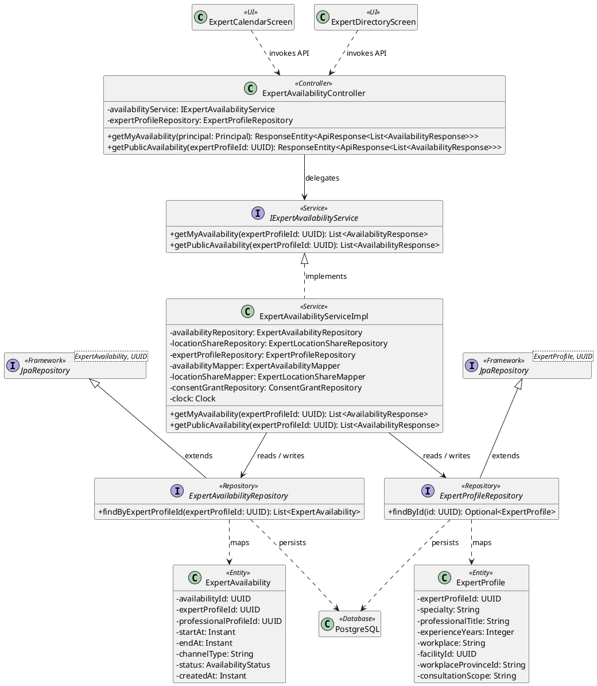
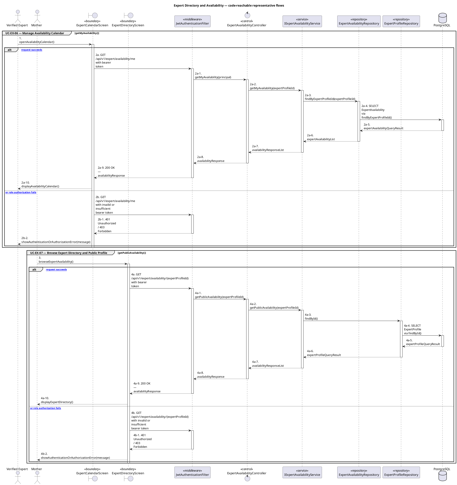
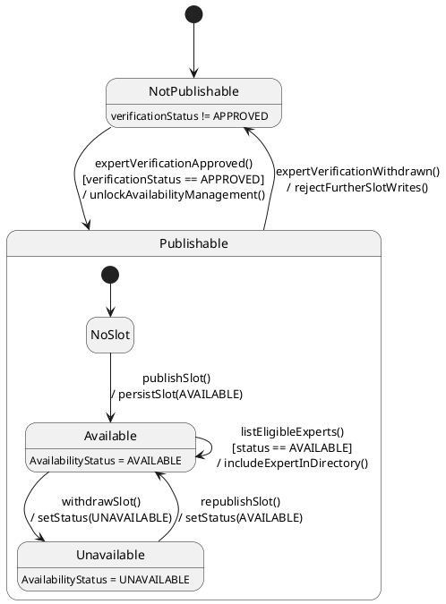

# MF-05 — Expert Directory and Availability

| Field | Value |
| --- | --- |
| Major Feature | **MF-05 — Verified Expert Network** |
| Function package | **Expert Directory and Availability** |
| Code-first use cases | `UC-EX-06, UC-EX-07` |
| Status | **Draft** |
| Baseline | Current reachable code and tests, 2026-08-23 |
| Diagram convention | `../sequence-diagram-skill.md`; explicit lifeline order, numbered messages, balanced activation |

## 1. Tổng quan luồng chính

Design expert-owned availability and consumer-facing eligible expert discovery.

- **UC-EX-06 — Manage Availability Calendar:** Create, batch-create, list, update, and remove consultation availability owned by the expert.
- **UC-EX-07 — Browse Expert Directory and Public Profile:** Search directory-eligible experts, inspect a public professional profile and availability, and choose an expert for consultation.

The code is authoritative for routes, handlers, delegation, authorization, and persisted state. Report1 section 6.2 is authoritative for the Major Feature name. Historical UC numbering and obsolete triage plans are not design inputs.

## 2. Function Design — Code Traceability

| UC | Actor goal | Method / route | Exact handler | Delegated function | Authorization | Source |
| --- | --- | --- | --- | --- | --- | --- |
| `UC-EX-06` | Manage Availability Calendar | `POST /api/v1/expert/availability` | `ExpertAvailabilityController.createAvailability()` | `IExpertAvailabilityService.createAvailability()` → `ExpertProfileRepository.findByIdForUpdate()` | hasRole('EXPERT') | `05_Development/CareBridgeAPI/src/main/java/com/carebridge/backend/expertavailability/controller/ExpertAvailabilityController.java` |
| `UC-EX-06` | Manage Availability Calendar | `PUT /api/v1/expert/availability/batch` | `ExpertAvailabilityController.replaceAvailability()` | `IExpertAvailabilityService.replaceAvailability()` → `ExpertProfileRepository.findByIdForUpdate()` | hasRole('EXPERT') | `05_Development/CareBridgeAPI/src/main/java/com/carebridge/backend/expertavailability/controller/ExpertAvailabilityController.java` |
| `UC-EX-06` | Manage Availability Calendar | `GET /api/v1/expert/availability/me` | `ExpertAvailabilityController.getMyAvailability()` | `IExpertAvailabilityService.getMyAvailability()` → `ExpertAvailabilityRepository.findByExpertProfileId()` | hasRole('EXPERT') | `05_Development/CareBridgeAPI/src/main/java/com/carebridge/backend/expertavailability/controller/ExpertAvailabilityController.java` |
| `UC-EX-06` | Manage Availability Calendar | `GET /api/v1/expert/availability/{expertProfileId}` | `ExpertAvailabilityController.getPublicAvailability()` | `IExpertAvailabilityService.getPublicAvailability()` → `ExpertProfileRepository.findById()` | hasAnyRole('MOTHER', 'FAMILY', 'EXPERT') | `05_Development/CareBridgeAPI/src/main/java/com/carebridge/backend/expertavailability/controller/ExpertAvailabilityController.java` |
| `UC-EX-06` | Manage Availability Calendar | `DELETE /api/v1/expert/availability/{id}` | `ExpertAvailabilityController.deleteAvailability()` | `IExpertAvailabilityService.deleteAvailability()` → `ExpertAvailabilityRepository.findById()` | hasRole('EXPERT') | `05_Development/CareBridgeAPI/src/main/java/com/carebridge/backend/expertavailability/controller/ExpertAvailabilityController.java` |
| `UC-EX-07` | Browse Expert Directory and Public Profile | `GET /api/v1/expert/availability/{expertProfileId}` | `ExpertAvailabilityController.getPublicAvailability()` | `IExpertAvailabilityService.getPublicAvailability()` → `ExpertProfileRepository.findById()` | hasAnyRole('MOTHER', 'FAMILY', 'EXPERT') | `05_Development/CareBridgeAPI/src/main/java/com/carebridge/backend/expertavailability/controller/ExpertAvailabilityController.java` |
| `UC-EX-07` | Browse Expert Directory and Public Profile | `GET /api/v1/expert/directory` | `ExpertProfileController.getDirectory()` | `IExpertProfileService.getPublicDirectory()` → `ExpertProfileRepository.searchDirectory()` | isAuthenticated() | `05_Development/CareBridgeAPI/src/main/java/com/carebridge/backend/expert/controller/ExpertProfileController.java` |
| `UC-EX-07` | Browse Expert Directory and Public Profile | `GET /api/v1/expert/profiles/{expertProfileId}` | `ExpertProfileController.getPublicProfile()` | `IExpertProfileService.getPublicProfile()` → `ExpertProfileRepository.findById()` | isAuthenticated() | `05_Development/CareBridgeAPI/src/main/java/com/carebridge/backend/expert/controller/ExpertProfileController.java` |
| `UC-EX-07` | Browse Expert Directory and Public Profile | `GET /api/v1/master-data/specialties` | `MasterDataController.getSpecialties()` | `IMasterDataService.getSpecialties()` → `SpecialtyRepository.findByIsActiveTrueOrderByName()` | No @PreAuthorize on handler/class; effective access comes from the security chain | `05_Development/CareBridgeAPI/src/main/java/com/carebridge/backend/masterdata/controller/MasterDataController.java` |

## 3. Class Diagram

This design-level UML follows the current source declarations: fields become attributes, reachable methods become operations, `implements` becomes realization, repository inheritance becomes generalization, and runtime-only calls remain dependencies. A missing layer or ownership relation is not invented.

**Figure 1 — Class Diagram: Expert Directory and Availability**

## 4. Sequence Diagram — Main Flow

Each group is a representative reachable main flow. The full endpoint surface remains in the Function Design table above.

**Brief Explanation:**

1. The actor starts each grouped use case through the code-reachable UI boundary.
2. Protected requests pass through JwtAuthenticationFilter; rejected credentials or roles return 401 Unauthorized or 403 Forbidden without invoking the controller.
3. The controller receives the request and invokes the exact delegated operation resolved from the current source.
4. The service applies the business policy and coordinates downstream collaborators while its caller remains active.
5. The repository executes the represented persistence operation and returns the stored or queried result before its activation ends.
6. The HTTP response unwinds through middleware when present, and the UI renders the server-authoritative outcome to the actor.

## 5. State Chart Diagram

The lifecycle below belongs to **ExpertAvailabilitySlot.status, enclosed by the approved-expert precondition that makes a slot publishable**. Its states are the persisted constants declared in the sources cited under this diagram, and every transition, guard, and action is taken from the service method that writes that constant. No unreachable state is introduced.

**Figure 2 — State Chart Diagram: Expert Directory and Availability**

**Brief Explanation:**

1. The lifecycle starts in `NotPublishable`: `ExpertAvailabilityServiceImpl` rejects every slot write unless the owning profile is `VerificationStatus.APPROVED`.
2. Approval is therefore drawn as the guarded transition into `Publishable`, not as a hidden precondition — losing approval closes availability management again.
3. Inside `Publishable`, a newly published slot is `AVAILABLE`, the only status the consumer-facing directory query includes.
4. `AvailabilityStatus` also declares `BUSY`, but no reachable code path writes it, so it is deliberately omitted rather than drawn as an implemented occupancy state.
5. `Unavailable` is the expert's explicit withdrawal from `Available`; it can be republished rather than being terminal.
6. The self-transition on `Available` is the directory read itself, which re-filters on the live slot status on every query instead of trusting a cached listing.

**State sources:**

- `05_Development/CareBridgeAPI/src/main/java/com/carebridge/backend/expertavailability/availabilitystatus/AvailabilityStatus.java`
- `05_Development/CareBridgeAPI/src/main/java/com/carebridge/backend/expertavailability/service/impl/ExpertAvailabilityServiceImpl.java`
- `05_Development/CareBridgeAPI/src/main/java/com/carebridge/backend/expert/verificationstatus/VerificationStatus.java`

## 6. Business Rules Applied

| UC | Enforced business/security rules | Known boundary or gap |
| --- | --- | --- |
| `UC-EX-06` | Availability ownership and overlap/state rules are server authoritative. Another expert cannot mutate the owner's slots. | No additional gap recorded in the code-first baseline. |
| `UC-EX-07` | Only directory-eligible verified experts are returned. The consumer directory is a Mobile flow; the Web portal is expert/admin oriented. | No additional gap recorded in the code-first baseline. |

## 7. Partial / Excluded Boundaries

- No extra release boundary beyond the code-first UC catalogue is introduced by this package.

## 8. Code and Test Evidence

- `05_Development/CareBridgeAPI/src/main/java/com/carebridge/backend/expertavailability/controller/ExpertAvailabilityController.java`
- `05_Development/CareBridgeMobileApp/lib/features/expert/screens/expert_calendar_screen.dart`
- `05_Development/CareBridgeWebApp/src/features/expert/pages/AvailabilityCalendarPage.tsx`
- `05_Development/CareBridgeAPI/src/test/java/com/carebridge/backend/expertavailability/service/impl/ExpertAvailabilityServiceImplTest.java`
- `05_Development/CareBridgeAPI/src/test/java/com/carebridge/backend/expertavailability/controller/ExpertAvailabilityControllerOwnershipTest.java`
- `05_Development/CareBridgeMobileApp/test/features/expert/expert_calendar_screen_test.dart`
- `05_Development/CareBridgeAPI/src/main/java/com/carebridge/backend/expert/controller/ExpertProfileController.java`
- `05_Development/CareBridgeAPI/src/main/java/com/carebridge/backend/masterdata/controller/MasterDataController.java`
- `05_Development/CareBridgeMobileApp/lib/features/directChat/screens/expert_directory_screen.dart`
- `05_Development/CareBridgeMobileApp/lib/features/expert/screens/expert_public_profile_screen.dart`
- `05_Development/CareBridgeAPI/src/test/java/com/carebridge/backend/expert/ExpertDirectoryEligibilityIntegrationTest.java`
- `05_Development/CareBridgeAPI/src/test/java/com/carebridge/backend/expert/service/ExpertProfileServiceImplDirectoryTest.java`
- `05_Development/CareBridgeMobileApp/test/features/directChat/expert_directory_screen_test.dart`
