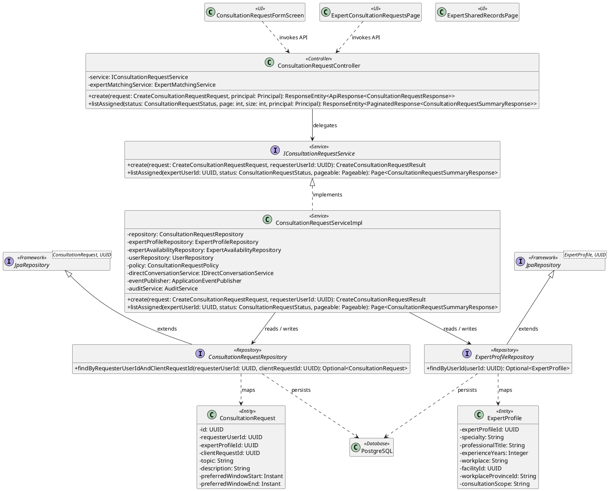
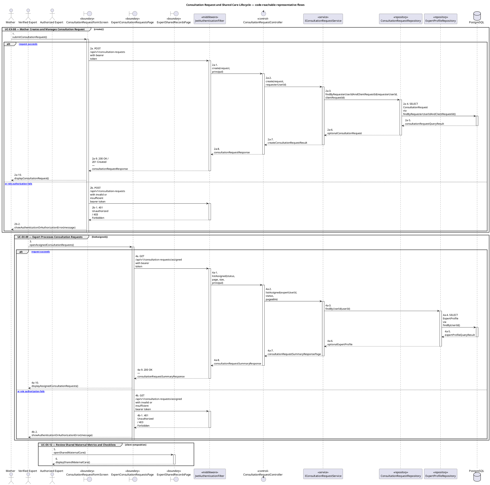
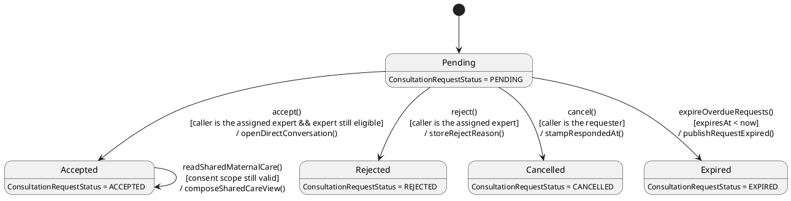

# MF-05 — Consultation Request and Shared Care Lifecycle

| Field | Value |
| --- | --- |
| Major Feature | **MF-05 — Verified Expert Network** |
| Function package | **Consultation Request and Shared Care Lifecycle** |
| Code-first use cases | `UC-EX-08, UC-EX-09, UC-EX-12` |
| Status | **Draft** |
| Baseline | Current reachable code and tests, 2026-08-23 |
| Diagram convention | `../sequence-diagram-skill.md`; explicit lifeline order, numbered messages, balanced activation |

## 1. Tổng quan luồng chính

Design request lifecycle and authorized shared maternal-care composition.

- **UC-EX-08 — Mother Creates and Manages Consultation Request:** Create a consultation request for an eligible expert, view its status/detail, and cancel it while the lifecycle permits.
- **UC-EX-09 — Expert Processes Consultation Requests:** View matching/assigned consultation requests and accept or reject an eligible request.
- **UC-EX-12 — Review Shared Maternal Metrics and Checklists:** Review maternal metrics and checklist information shared through an authorized consultation relationship.

The code is authoritative for routes, handlers, delegation, authorization, and persisted state. Report1 section 6.2 is authoritative for the Major Feature name. Historical UC numbering and obsolete triage plans are not design inputs.

## 2. Function Design — Code Traceability

| UC | Actor goal | Method / route | Exact handler | Delegated function | Authorization | Source |
| --- | --- | --- | --- | --- | --- | --- |
| `UC-EX-08` | Mother Creates and Manages Consultation Request | `POST /api/v1/consultation-requests` | `ConsultationRequestController.create()` | `IConsultationRequestService.create()` → `ConsultationRequestRepository.findByRequesterUserIdAndClientRequestId()` | hasAnyRole('MOTHER', 'FAMILY') | `05_Development/CareBridgeAPI/src/main/java/com/carebridge/backend/consultation/controller/ConsultationRequestController.java` |
| `UC-EX-08` | Mother Creates and Manages Consultation Request | `GET /api/v1/consultation-requests/mine` | `ConsultationRequestController.listMine()` | `IConsultationRequestService.listMine()` → `ConsultationRequestRepository.findByRequesterUserId()` | hasAnyRole('MOTHER', 'FAMILY') | `05_Development/CareBridgeAPI/src/main/java/com/carebridge/backend/consultation/controller/ConsultationRequestController.java` |
| `UC-EX-08` | Mother Creates and Manages Consultation Request | `GET /api/v1/consultation-requests/{id}` | `ConsultationRequestController.getById()` | `IConsultationRequestService.getById()` → `ConsultationRequestRepository.findById()` | hasAnyRole('MOTHER', 'FAMILY', 'EXPERT') | `05_Development/CareBridgeAPI/src/main/java/com/carebridge/backend/consultation/controller/ConsultationRequestController.java` |
| `UC-EX-08` | Mother Creates and Manages Consultation Request | `PATCH /api/v1/consultation-requests/{id}/cancel` | `ConsultationRequestController.cancel()` | `IConsultationRequestService.cancel()` → `ConsultationRequestRepository.tryTransition()` | hasAnyRole('MOTHER', 'FAMILY') | `05_Development/CareBridgeAPI/src/main/java/com/carebridge/backend/consultation/controller/ConsultationRequestController.java` |
| `UC-EX-09` | Expert Processes Consultation Requests | `GET /api/v1/consultation-requests/assigned` | `ConsultationRequestController.listAssigned()` | `IConsultationRequestService.listAssigned()` → `ExpertProfileRepository.findByUserId()` | hasRole('EXPERT') | `05_Development/CareBridgeAPI/src/main/java/com/carebridge/backend/consultation/controller/ConsultationRequestController.java` |
| `UC-EX-09` | Expert Processes Consultation Requests | `GET /api/v1/consultation-requests/matching` | `ConsultationRequestController.matching()` | `ExpertMatchingService.sweep()` | hasAnyRole('MOTHER', 'FAMILY') | `05_Development/CareBridgeAPI/src/main/java/com/carebridge/backend/consultation/controller/ConsultationRequestController.java` |
| `UC-EX-09` | Expert Processes Consultation Requests | `GET /api/v1/consultation-requests/pending-summary` | `ConsultationRequestController.pendingSummary()` | `IConsultationRequestService.pendingSummary()` → `ExpertProfileRepository.findByUserId()` | hasRole('EXPERT') | `05_Development/CareBridgeAPI/src/main/java/com/carebridge/backend/consultation/controller/ConsultationRequestController.java` |
| `UC-EX-09` | Expert Processes Consultation Requests | `PATCH /api/v1/consultation-requests/{id}/accept` | `ConsultationRequestController.accept()` | `IConsultationRequestService.accept()` → `UserRepository.findByIdForUpdate()` | hasRole('EXPERT') | `05_Development/CareBridgeAPI/src/main/java/com/carebridge/backend/consultation/controller/ConsultationRequestController.java` |
| `UC-EX-09` | Expert Processes Consultation Requests | `PATCH /api/v1/consultation-requests/{id}/reject` | `ConsultationRequestController.reject()` | `IConsultationRequestService.reject()` → `ConsultationRequestRepository.tryTransition()` | hasRole('EXPERT') | `05_Development/CareBridgeAPI/src/main/java/com/carebridge/backend/consultation/controller/ConsultationRequestController.java` |
| `UC-EX-12` | Review Shared Maternal Metrics and Checklists | GET `/api/v1/direct-conversations` | Client composition in `ExpertSharedRecordsPage.tsx` | `fetchExpertSharedRecords` calls `listMyConversations`; response is `DirectConversationSummary[]`. | Bearer-authenticated expert; server conversation membership filters the list | `05_Development/CareBridgeWebApp/src/features/expert/pages/ExpertSharedRecordsPage.tsx`, `05_Development/CareBridgeWebApp/src/features/expert/services/expertSharedRecordsService.ts` |
| `UC-EX-12` | Review Shared Maternal Metrics and Checklists | GET `/api/v1/direct-conversations/{conversationId}/timeline?limit=50` | Client composition in `ExpertSharedRecordsPage.tsx` | Reads `TimelinePage`; only non-recalled `MESSAGE` items tagged `[CAREBRIDGE_HEALTH_SHARE]` or `[CAREBRIDGE_CHECKLIST_SHARE]` become shared-record projections. | Bearer-authenticated conversation member | `05_Development/CareBridgeWebApp/src/features/expert/pages/ExpertSharedRecordsPage.tsx`, `05_Development/CareBridgeWebApp/src/features/expert/services/expertSharedRecordsService.ts` |
| `UC-EX-12` | Review Shared Maternal Metrics and Checklists | GET `/api/v1/journeys/{journeyId}/metrics?metricType={code}` | Client composition in `ExpertSharedRecordsPage.tsx` | Live-syncs each shared metric; failed refresh preserves the already-shared projection instead of fabricating a new value. | Existing authorized share/conversation context; backend remains the authorization authority | `05_Development/CareBridgeWebApp/src/features/expert/pages/ExpertSharedRecordsPage.tsx`, `05_Development/CareBridgeWebApp/src/features/expert/services/expertSharedRecordsService.ts` |
| `UC-EX-12` | Review Shared Maternal Metrics and Checklists | GET `/api/v1/checklists/journeys/{journeyId}/tasks` | Client composition in `ExpertSharedRecordsPage.tsx` | Live-syncs journey checklist sections `overdue`, `today`, `upcoming`, and `unscheduled`; completed state is normalized from `COMPLETED`/`DONE`. | Existing authorized share/conversation context | `05_Development/CareBridgeWebApp/src/features/expert/pages/ExpertSharedRecordsPage.tsx`, `05_Development/CareBridgeWebApp/src/features/expert/services/expertSharedRecordsService.ts` |
| `UC-EX-12` | Review Shared Maternal Metrics and Checklists | GET `/api/v1/checklists/users/{motherUserId}/tasks` | Client composition in `ExpertSharedRecordsPage.tsx` | Uses the same checklist projection rules; this UC creates no dedicated shared-record backend resource. | Fallback only when the shared payload lacks `journeyId` and includes the conversation-derived mother user | `05_Development/CareBridgeWebApp/src/features/expert/pages/ExpertSharedRecordsPage.tsx`, `05_Development/CareBridgeWebApp/src/features/expert/services/expertSharedRecordsService.ts` |

## 3. Class Diagram

This design-level UML follows the current source declarations: fields become attributes, reachable methods become operations, `implements` becomes realization, repository inheritance becomes generalization, and runtime-only calls remain dependencies. A missing layer or ownership relation is not invented.

**Figure 1 — Class Diagram: Consultation Request and Shared Care Lifecycle**

## 4. Sequence Diagram — Main Flow

Each group is a representative reachable main flow. The full endpoint surface remains in the Function Design table above.

**Brief Explanation:**

1. The actor starts each grouped use case through the code-reachable UI boundary.
2. Protected requests pass through JwtAuthenticationFilter; rejected credentials or roles return 401 Unauthorized or 403 Forbidden without invoking the controller.
3. The controller receives the request and invokes the exact delegated operation resolved from the current source.
4. The service applies the business policy and coordinates downstream collaborators while its caller remains active.
5. The repository executes the represented persistence operation and returns the stored or queried result before its activation ends.
6. The HTTP response unwinds through middleware when present, and the UI renders the server-authoritative outcome to the actor.

## 5. State Chart Diagram

The lifecycle below belongs to **ConsultationRequest.status**. Its states are the persisted constants declared in the sources cited under this diagram, and every transition, guard, and action is taken from the service method that writes that constant. No unreachable state is introduced.

**Figure 2 — State Chart Diagram: Consultation Request and Shared Care Lifecycle**

**Brief Explanation:**

1. A request is created in `PENDING`, the only non-terminal state in this lifecycle.
2. All four outgoing transitions run through the repository's `tryTransition()` compare-and-set, whose SQL predicate requires `status = PENDING` — so the first writer wins and a decided request can never be re-decided.
3. The guard on `accept()` is the strongest: the caller must be the assigned expert and `assertExpertStillEligibleForConsultation()` must pass against a locked profile and account row.
4. The action on `accept()` opens the direct conversation and stores its id on the request, which is what later authorizes shared maternal-care access.
5. `cancel()` is guarded to the requester and `reject()` to the expert, so the two parties cannot act on each other's behalf.
6. `expireOverdueRequests()` is the only system-driven transition; it uses the same compare-and-set, so a request accepted moments earlier is never retroactively expired.

**State sources:**

- `05_Development/CareBridgeAPI/src/main/java/com/carebridge/backend/consultation/entity/ConsultationRequestStatus.java`
- `05_Development/CareBridgeAPI/src/main/java/com/carebridge/backend/consultation/service/impl/ConsultationRequestServiceImpl.java`
- `05_Development/CareBridgeAPI/src/main/java/com/carebridge/backend/consultation/repository/ConsultationRequestRepository.java`

## 6. Business Rules Applied

| UC | Enforced business/security rules | Known boundary or gap |
| --- | --- | --- |
| `UC-EX-08` | Expert eligibility and request ownership are rechecked on mutation. Notifications are side effects, not the source of request state. | No additional gap recorded in the code-first baseline. |
| `UC-EX-09` | Eligibility and current state are rechecked for every decision. A client cannot assign an ineligible request by UI state alone. | Web reject currently sends POST while the backend requires PATCH; reject is broken on Web and remains Partial there. |
| `UC-EX-12` | The active sharing/consultation relationship is rechecked by the backend. Read access must not broaden to unrelated journeys or accounts. | No dedicated shared-record backend resource exists; this UC composes existing authorized endpoints. |

## 7. Partial / Excluded Boundaries

- Paid booking, payment, refund/dispute, and custom care-plan authoring are not reachable release-1 functions.
- Web reject currently sends POST while the backend requires PATCH; reject is broken on Web and remains Partial there.
- No dedicated shared-record backend resource exists; this UC composes existing authorized endpoints.

## 8. Code and Test Evidence

- `05_Development/CareBridgeAPI/src/main/java/com/carebridge/backend/consultation/controller/ConsultationRequestController.java`
- `05_Development/CareBridgeMobileApp/lib/features/consultation/screens/consultation_request_form_screen.dart`
- `05_Development/CareBridgeMobileApp/lib/features/consultation/screens/my_consultation_requests_screen.dart`
- `05_Development/CareBridgeAPI/src/test/java/com/carebridge/backend/consultation/service/impl/ConsultationRequestServiceImplCreateTest.java`
- `05_Development/CareBridgeMobileApp/test/features/consultation/consultation_request_mobile_test.dart`
- `05_Development/CareBridgeWebApp/src/features/expert/pages/ExpertConsultationRequestsPage.tsx`
- `05_Development/CareBridgeAPI/src/test/java/com/carebridge/backend/consultation/service/impl/ConsultationRequestServiceImplLifecycleTest.java`
- `05_Development/CareBridgeAPI/src/test/java/com/carebridge/backend/consultation/controller/ConsultationRequestControllerSecurityTest.java`
- `05_Development/CareBridgeWebApp/src/features/expert/pages/ExpertSharedRecordsPage.tsx`
- `05_Development/CareBridgeWebApp/src/features/expert/services/expertSharedRecordsService.ts`
- `05_Development/CareBridgeWebApp/src/features/directChat/services/directChatApi.test.ts`
