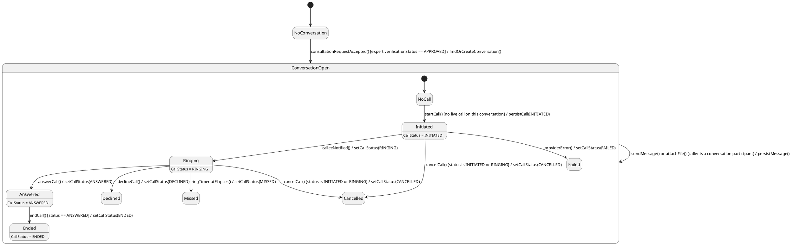

# MF-05 — Direct Messaging, Attachments, and Calls

| Field | Value |
| --- | --- |
| Major Feature | **MF-05 — Verified Expert Network** |
| Function package | **Direct Messaging, Attachments, and Calls** |
| Code-first use cases | `UC-EX-10, UC-EX-11, UC-AD-07` |
| Status | **Draft** |
| Baseline | Current reachable code and tests, 2026-08-23 |
| Diagram convention | `../sequence-diagram-skill.md`; explicit lifeline order, numbered messages, balanced activation |

## 1. Tổng quan luồng chính

Design accepted direct conversation, attachment, voice/video call, and administrative oversight paths.

- **UC-EX-10 — Exchange Direct Messages and Attachments:** Exchange authorized conversation messages and attachments, obtain the scoped Firebase token used by live synchronization, mark reads, and recall a message only when current policy permits.
- **UC-EX-11 — Make and Receive Voice/Video Calls:** Create, receive, join, end, or decline a direct voice/video call and apply consent-aware recording behavior.
- **UC-AD-07 — Oversee Consultation Calls and Recordings:** Inspect administrative consultation-call records, obtain an authorized recording URL, and delete a recording when retention policy permits.

The code is authoritative for routes, handlers, delegation, authorization, and persisted state. Report1 section 6.2 is authoritative for the Major Feature name. Historical UC numbering and obsolete triage plans are not design inputs.

## 2. Function Design — Code Traceability

| UC | Actor goal | Method / route | Exact handler | Delegated function | Authorization | Source |
| --- | --- | --- | --- | --- | --- | --- |
| `UC-EX-10` | Exchange Direct Messages and Attachments | `GET /api/v1/direct-conversations` | `DirectConversationController.listMyConversations()` | `IDirectConversationService.listMyConversations()` → `UserRepository.findAllById()` | hasAnyRole('MOTHER', 'FAMILY', 'EXPERT') | `05_Development/CareBridgeAPI/src/main/java/com/carebridge/backend/directchat/controller/DirectConversationController.java` |
| `UC-EX-10` | Exchange Direct Messages and Attachments | `GET /api/v1/direct-conversations/unread-summary` | `DirectConversationController.getUnreadSummary()` | `IDirectConversationService.getUnreadSummary()` → `ConversationSummaryAggregateRepository.fetchUnreadCounts()` | hasAnyRole('MOTHER', 'FAMILY', 'EXPERT') | `05_Development/CareBridgeAPI/src/main/java/com/carebridge/backend/directchat/controller/DirectConversationController.java` |
| `UC-EX-10` | Exchange Direct Messages and Attachments | `GET /api/v1/direct-conversations/{conversationId}` | `DirectConversationController.getConversation()` | `IDirectConversationService.getConversation()` → `DirectConversationRepository.findById()` | hasAnyRole('MOTHER', 'FAMILY', 'EXPERT') | `05_Development/CareBridgeAPI/src/main/java/com/carebridge/backend/directchat/controller/DirectConversationController.java` |
| `UC-EX-10` | Exchange Direct Messages and Attachments | `POST /api/v1/direct-conversations/{conversationId}/attachments` | `DirectMessageController.uploadAttachment()` | `DirectChatAttachmentAccessService.upload()` → `DirectConversationRepository.findById()` | hasAnyRole('MOTHER', 'FAMILY', 'EXPERT') | `05_Development/CareBridgeAPI/src/main/java/com/carebridge/backend/directchat/controller/DirectMessageController.java` |
| `UC-EX-10` | Exchange Direct Messages and Attachments | `POST /api/v1/direct-conversations/{conversationId}/messages` | `DirectMessageController.sendMessage()` | `IDirectMessageService.sendMessage()` → `DirectConversationRepository.findById()` | hasAnyRole('MOTHER', 'FAMILY', 'EXPERT') | `05_Development/CareBridgeAPI/src/main/java/com/carebridge/backend/directchat/controller/DirectMessageController.java` |
| `UC-EX-10` | Exchange Direct Messages and Attachments | `GET /api/v1/direct-conversations/{conversationId}/messages/{messageId}/attachment` | `DirectMessageController.viewAttachment()` | `DirectChatAttachmentAccessService.view()` → `DirectConversationRepository.findById()` | hasAnyRole('MOTHER', 'FAMILY', 'EXPERT') | `05_Development/CareBridgeAPI/src/main/java/com/carebridge/backend/directchat/controller/DirectMessageController.java` |
| `UC-EX-10` | Exchange Direct Messages and Attachments | `PATCH /api/v1/direct-conversations/{conversationId}/messages/{messageId}/recall` | `DirectMessageController.recallMessage()` | `IDirectMessageService.recallMessage()` → `DirectConversationRepository.findById()` | hasAnyRole('MOTHER', 'FAMILY', 'EXPERT') | `05_Development/CareBridgeAPI/src/main/java/com/carebridge/backend/directchat/controller/DirectMessageController.java` |
| `UC-EX-10` | Exchange Direct Messages and Attachments | `PATCH /api/v1/direct-conversations/{conversationId}/read` | `DirectConversationController.markRead()` | `IDirectConversationService.markRead()` → `DirectConversationRepository.findById()` | hasAnyRole('MOTHER', 'FAMILY', 'EXPERT') | `05_Development/CareBridgeAPI/src/main/java/com/carebridge/backend/directchat/controller/DirectConversationController.java` |
| `UC-EX-10` | Exchange Direct Messages and Attachments | `GET /api/v1/direct-conversations/{conversationId}/timeline` | `DirectMessageController.getTimeline()` | `IDirectMessageService.getTimeline()` → `DirectConversationRepository.findById()` | hasAnyRole('MOTHER', 'FAMILY', 'EXPERT') | `05_Development/CareBridgeAPI/src/main/java/com/carebridge/backend/directchat/controller/DirectMessageController.java` |
| `UC-EX-10` | Exchange Direct Messages and Attachments | `POST /api/v1/firebase/custom-token` | `FirebaseTokenController.issueCustomToken()` | `IFirebaseAuthBridgeService.createCustomToken()` → `IFirebaseAuthGateway.createCustomToken()` | isAuthenticated() | `05_Development/CareBridgeAPI/src/main/java/com/carebridge/backend/integration/firebase/FirebaseTokenController.java` |
| `UC-EX-11` | Make and Receive Voice/Video Calls | `GET /api/v1/direct-conversations/calls/active` | `ActiveConversationCallController.listActiveCalls()` | `IConversationCallService.listActiveCalls()` → `ConversationCallRepository.findActiveForParticipant()` | hasAnyRole('MOTHER', 'FAMILY', 'EXPERT') | `05_Development/CareBridgeAPI/src/main/java/com/carebridge/backend/directchat/controller/ActiveConversationCallController.java` |
| `UC-EX-11` | Make and Receive Voice/Video Calls | `POST /api/v1/direct-conversations/{conversationId}/calls` | `ConversationCallController.initiateCall()` | `IConversationCallService.initiateCall()` → `ConversationCallRepository.save()` | hasAnyRole('MOTHER', 'FAMILY', 'EXPERT') | `05_Development/CareBridgeAPI/src/main/java/com/carebridge/backend/directchat/controller/ConversationCallController.java` |
| `UC-EX-11` | Make and Receive Voice/Video Calls | `GET /api/v1/direct-conversations/{conversationId}/calls/{callId}` | `ConversationCallController.getCall()` | `IConversationCallService.getCall()` → `ConversationCallRepository.findById()` | hasAnyRole('MOTHER', 'FAMILY', 'EXPERT') | `05_Development/CareBridgeAPI/src/main/java/com/carebridge/backend/directchat/controller/ConversationCallController.java` |
| `UC-EX-11` | Make and Receive Voice/Video Calls | `PATCH /api/v1/direct-conversations/{conversationId}/calls/{callId}/answer` | `ConversationCallController.answer()` | `IConversationCallService.answer()` → `ConversationCallRepository.conditionallyAnswer()` | hasAnyRole('MOTHER', 'FAMILY', 'EXPERT') | `05_Development/CareBridgeAPI/src/main/java/com/carebridge/backend/directchat/controller/ConversationCallController.java` |
| `UC-EX-11` | Make and Receive Voice/Video Calls | `PATCH /api/v1/direct-conversations/{conversationId}/calls/{callId}/decline` | `ConversationCallController.decline()` | `IConversationCallService.decline()` → `ConversationCallRepository.conditionallyDecline()` | hasAnyRole('MOTHER', 'FAMILY', 'EXPERT') | `05_Development/CareBridgeAPI/src/main/java/com/carebridge/backend/directchat/controller/ConversationCallController.java` |
| `UC-EX-11` | Make and Receive Voice/Video Calls | `PATCH /api/v1/direct-conversations/{conversationId}/calls/{callId}/end` | `ConversationCallController.end()` | `IConversationCallService.end()` → `ConversationCallRepository.conditionallyEndAnswered()` | hasAnyRole('MOTHER', 'FAMILY', 'EXPERT') | `05_Development/CareBridgeAPI/src/main/java/com/carebridge/backend/directchat/controller/ConversationCallController.java` |
| `UC-EX-11` | Make and Receive Voice/Video Calls | `POST /api/v1/direct-conversations/{conversationId}/calls/{callId}/join-credentials` | `ConversationCallController.issueJoinCredentials()` | `IConversationCallService.issueJoinCredentials()` → `UserRepository.findById()` → `IZegoCloudService.generateToken()` | hasAnyRole('MOTHER', 'FAMILY', 'EXPERT') | `05_Development/CareBridgeAPI/src/main/java/com/carebridge/backend/directchat/controller/ConversationCallController.java` |
| `UC-EX-11` | Make and Receive Voice/Video Calls | `POST /api/v1/direct-conversations/{conversationId}/calls/{callId}/recording` | `ConversationCallController.uploadRecording()` | `IConversationCallService.uploadCallRecording()` → `ConversationCallRepository.save()` | hasAnyRole('MOTHER', 'FAMILY', 'EXPERT') | `05_Development/CareBridgeAPI/src/main/java/com/carebridge/backend/directchat/controller/ConversationCallController.java` |
| `UC-EX-11` | Make and Receive Voice/Video Calls | `PATCH /api/v1/direct-conversations/{conversationId}/calls/{callId}/ringing` | `ConversationCallController.markRinging()` | `IConversationCallService.markRinging()` → `ConversationCallRepository.conditionallyMarkRinging()` | hasAnyRole('MOTHER', 'FAMILY', 'EXPERT') | `05_Development/CareBridgeAPI/src/main/java/com/carebridge/backend/directchat/controller/ConversationCallController.java` |
| `UC-AD-07` | Oversee Consultation Calls and Recordings | `GET /api/v1/admin/consultation-calls` | `AdminConsultationCallController.searchCalls()` | `IAdminConsultationCallService.searchCalls()` → `ConversationCallRepository.findAll()` | hasAnyRole('SYSTEM_ADMIN', 'ADMIN') | `05_Development/CareBridgeAPI/src/main/java/com/carebridge/backend/directchat/controller/AdminConsultationCallController.java` |
| `UC-AD-07` | Oversee Consultation Calls and Recordings | `GET /api/v1/admin/consultation-calls/{callId}` | `AdminConsultationCallController.getCallDetail()` | `IAdminConsultationCallService.getCallDetail()` → `ConversationCallRepository.findById()` | hasAnyRole('SYSTEM_ADMIN', 'ADMIN') | `05_Development/CareBridgeAPI/src/main/java/com/carebridge/backend/directchat/controller/AdminConsultationCallController.java` |
| `UC-AD-07` | Oversee Consultation Calls and Recordings | `DELETE /api/v1/admin/consultation-calls/{callId}/recording` | `AdminConsultationCallController.deleteRecording()` | `IAdminConsultationCallService.deleteRecording()` → `ConversationCallRepository.findByIdForUpdate()` | hasAnyRole('SYSTEM_ADMIN', 'ADMIN') | `05_Development/CareBridgeAPI/src/main/java/com/carebridge/backend/directchat/controller/AdminConsultationCallController.java` |
| `UC-AD-07` | Oversee Consultation Calls and Recordings | `GET /api/v1/admin/consultation-calls/{callId}/recording-url` | `AdminConsultationCallController.getRecordingPresignedUrl()` | `IAdminConsultationCallService.getRecordingPresignedUrl()` → `ConversationCallRepository.findById()` | hasAnyRole('SYSTEM_ADMIN', 'ADMIN') | `05_Development/CareBridgeAPI/src/main/java/com/carebridge/backend/directchat/controller/AdminConsultationCallController.java` |

## 3. Class Diagram

This design-level UML follows the current source declarations: fields become attributes, reachable methods become operations, `implements` becomes realization, repository inheritance becomes generalization, and runtime-only calls remain dependencies. A missing layer or ownership relation is not invented.

```plantuml
@startuml ClassDiagram_04DirectMessagingAttachmentsandCalls
skinparam classAttributeIconSize 0
hide empty members

class "ConsultationCallListPage" as UIConsultationCallListPage <<UI>>
class "DirectCallProvider" as UIDirectCallProvider <<UI>>
class "DirectChatScreen" as UIDirectChatScreen <<UI>>
class "AdminConsultationCallController" as ControllerAdminConsultationCallController <<Controller>> {
  - adminCallService: IAdminConsultationCallService
  + searchCalls(keyword: String, callType: CallType, callStatus: CallStatus, hasRecording: Boolean, fromDate: Instant, toDate: Instant, page: int, size: int): ResponseEntity<PaginatedResponse<AdminConsultationCallSummaryResponse>>
}
class "ConversationCallController" as ControllerConversationCallController <<Controller>> {
  - callService: IConversationCallService
  + initiateCall(conversationId: UUID, request: InitiateCallRequest, principal: Principal): ResponseEntity<ApiResponse<ConversationCallResponse>>
  + issueJoinCredentials(conversationId: UUID, callId: UUID, principal: Principal): ResponseEntity<ApiResponse<ZegoJoinCredentialsResponse>>
}
class "DirectMessageController" as ControllerDirectMessageController <<Controller>> {
  - messageService: IDirectMessageService
  - attachmentAccessService: DirectChatAttachmentAccessService
  + sendMessage(conversationId: UUID, request: SendDirectMessageRequest, principal: Principal): ResponseEntity<ApiResponse<TimelineItemResponse>>
}
interface "IAdminConsultationCallService" as ServiceContractIAdminConsultationCallService <<Service>> {
  + searchCalls(query: AdminConsultationCallSearchQuery, pageable: Pageable): Page<AdminConsultationCallSummaryResponse>
}
class "AdminConsultationCallServiceImpl" as ServiceAdminConsultationCallServiceImpl <<Service>> {
  - callRepository: ConversationCallRepository
  - conversationRepository: DirectConversationRepository
  - userRepository: UserRepository
  - expertProfileRepository: ExpertProfileRepository
  - fileService: IFileService
  - uploadedFileRepository: UploadedFileRepository
  - storageServiceResolver: StorageServiceResolver
  - auditService: AuditService
  + searchCalls(query: AdminConsultationCallSearchQuery, pageable: Pageable): Page<AdminConsultationCallSummaryResponse>
}
ServiceContractIAdminConsultationCallService <|.. ServiceAdminConsultationCallServiceImpl : implements
interface "IConversationCallService" as ServiceContractIConversationCallService <<Service>> {
  + initiateCall(conversationId: UUID, callerUserId: UUID, type: CallType): ConversationCallResponse
  + issueJoinCredentials(conversationId: UUID, callId: UUID, currentUserId: UUID): ZegoJoinCredentialsResponse
}
class "ConversationCallServiceImpl" as ServiceConversationCallServiceImpl <<Service>> {
  - conversationRepository: DirectConversationRepository
  - callRepository: ConversationCallRepository
  - policy: IDirectConversationPolicy
  - expertProfileRepository: ExpertProfileRepository
  - userRepository: UserRepository
  - zegoCloudService: IZegoCloudService
  - eventPublisher: ApplicationEventPublisher
  - auditService: AuditService
  + initiateCall(conversationId: UUID, callerUserId: UUID, type: CallType): ConversationCallResponse
  + issueJoinCredentials(conversationId: UUID, callId: UUID, currentUserId: UUID): ZegoJoinCredentialsResponse
}
ServiceContractIConversationCallService <|.. ServiceConversationCallServiceImpl : implements
interface "IDirectMessageService" as ServiceContractIDirectMessageService <<Service>> {
  + sendMessage(conversationId: UUID, senderUserId: UUID, request: SendDirectMessageRequest): SendDirectMessageResult
}
class "DirectMessageServiceImpl" as ServiceDirectMessageServiceImpl <<Service>> {
  - conversationRepository: DirectConversationRepository
  - messageRepository: DirectMessageRepository
  - callRepository: ConversationCallRepository
  - timelineRepository: ConversationTimelineRepository
  - policy: IDirectConversationPolicy
  - expertProfileRepository: ExpertProfileRepository
  - eventPublisher: ApplicationEventPublisher
  - auditService: AuditService
  + sendMessage(conversationId: UUID, senderUserId: UUID, request: SendDirectMessageRequest): SendDirectMessageResult
}
ServiceContractIDirectMessageService <|.. ServiceDirectMessageServiceImpl : implements
interface "ConversationCallRepository" as RepositoryConversationCallRepository <<Repository>> {
  + findAll(): List<ConversationCall>
  + save(entity: ConversationCall): ConversationCall
}
class "ConversationCall" as EntityConversationCall <<Entity>> {
  - id: UUID
  - conversationId: UUID
  - initiatedByUserId: UUID
  - callType: CallType
  - callStatus: CallStatus
  - zegoRoomId: String
  - initiatedAt: Instant
  - answeredAt: Instant
}
interface "JpaRepository<ConversationCall, UUID>" as RepositoryBaseConversationCallRepository <<Framework>>
RepositoryBaseConversationCallRepository <|-- RepositoryConversationCallRepository : extends
interface "DirectConversationRepository" as RepositoryDirectConversationRepository <<Repository>> {
  + findById(id: UUID): Optional<DirectConversation>
}
class "DirectConversation" as EntityDirectConversation <<Entity>> {
  - id: UUID
  - motherUserId: UUID
  - expertUserId: UUID
  - status: String
  - createdAt: Instant
  - lastActivityAt: Instant
}
interface "JpaRepository<DirectConversation, UUID>" as RepositoryBaseDirectConversationRepository <<Framework>>
RepositoryBaseDirectConversationRepository <|-- RepositoryDirectConversationRepository : extends
interface "UserRepository" as RepositoryUserRepository <<Repository>> {
  + findById(id: java.util.UUID): Optional<User>
}
class "User" as EntityUser <<Entity>> {
  - person: Person
  - phone: String
  - email: String
  - passwordHash: String
  - name: String
  - displayName: String
  - dateOfBirth: LocalDate
  - area: String
}
interface "JpaRepository<User, java.util.UUID>" as RepositoryBaseUserRepository <<Framework>>
RepositoryBaseUserRepository <|-- RepositoryUserRepository : extends
class "IZegoCloudService" as ExternalIZegoCloudService <<External Service>> {
  + generateToken(sessionId: String, userId: String, userName: String): ZegoTokenDto
}
class "PostgreSQL" as DB <<Database>>
UIConsultationCallListPage ..> ControllerAdminConsultationCallController : invokes API
UIDirectCallProvider ..> ControllerConversationCallController : invokes API
UIDirectChatScreen ..> ControllerDirectMessageController : invokes API
ControllerAdminConsultationCallController --> ServiceContractIAdminConsultationCallService : delegates
ControllerConversationCallController --> ServiceContractIConversationCallService : delegates
ControllerDirectMessageController --> ServiceContractIDirectMessageService : delegates
ServiceAdminConsultationCallServiceImpl --> RepositoryConversationCallRepository : reads / writes
ServiceConversationCallServiceImpl --> RepositoryConversationCallRepository : reads / writes
ServiceConversationCallServiceImpl --> RepositoryUserRepository : reads / writes
ServiceDirectMessageServiceImpl --> RepositoryDirectConversationRepository : reads / writes
RepositoryConversationCallRepository ..> EntityConversationCall : maps
RepositoryDirectConversationRepository ..> EntityDirectConversation : maps
RepositoryUserRepository ..> EntityUser : maps
RepositoryConversationCallRepository ..> DB : persists
RepositoryDirectConversationRepository ..> DB : persists
RepositoryUserRepository ..> DB : persists
ServiceConversationCallServiceImpl ..> ExternalIZegoCloudService : invokes when required
@enduml
```

**Figure 1 — Class Diagram: Direct Messaging, Attachments, and Calls**

## 4. Sequence Diagram — Main Flow

Each group is a representative reachable main flow. The full endpoint surface remains in the Function Design table above.

```plantuml
@startuml
skinparam shadowing false
skinparam maxMessageSize 90
title Direct Messaging, Attachments, and Calls — code-reachable representative flows

actor "Mother" as AMother
actor "System Admin" as ASystem_Admin
boundary "DirectChatScreen" as UIDirectChatScreen <<boundary>>
boundary "DirectCallProvider" as UIDirectCallProvider <<boundary>>
boundary "ConsultationCallListPage" as UIConsultationCallListPage <<boundary>>
participant "JwtAuthenticationFilter" as JWT <<middleware>>
control "DirectMessageController" as CDirectMessageController <<control>>
control "ConversationCallController" as CConversationCallController <<control>>
control "AdminConsultationCallController" as CAdminConsultationCallController <<control>>
participant "IDirectMessageService" as SIDirectMessageService <<service>>
participant "IConversationCallService" as SIConversationCallService <<service>>
participant "IAdminConsultationCallService" as SIAdminConsultationCallService <<service>>
participant "DirectConversationRepository" as RDirectConversationRepository <<repository>>
participant "ConversationCallRepository" as RConversationCallRepository <<repository>>
participant "UserRepository" as RUserRepository <<repository>>
database "PostgreSQL" as DB
participant "IZegoCloudService" as XIZegoCloudService <<external system>>

group UC-EX-10 — Exchange Direct Messages and Attachments [sendMessage()]
AMother -> UIDirectChatScreen : 1. submitDirectMessage()
activate UIDirectChatScreen
alt [authorized request succeeds]
UIDirectChatScreen -> JWT : 2a. POST /api/v1/direct-conversations/{conversationId}/messages with bearer token
activate JWT
JWT -> CDirectMessageController : 2a-1. sendMessage(conversationId, request, principal)
activate CDirectMessageController
CDirectMessageController -> SIDirectMessageService : 2a-2. sendMessage(conversationId, senderUserId, request)
activate SIDirectMessageService
SIDirectMessageService -> RDirectConversationRepository : 2a-3. findById()
activate RDirectConversationRepository
RDirectConversationRepository -> DB : 2a-4. SELECT DirectConversation via findById()
activate DB
DB --> RDirectConversationRepository : 2a-5. directConversationQueryResult
deactivate DB
RDirectConversationRepository --> SIDirectMessageService : 2a-6. directConversationQueryResult
deactivate RDirectConversationRepository
SIDirectMessageService --> CDirectMessageController : 2a-7. sendDirectMessageResult
deactivate SIDirectMessageService
CDirectMessageController --> JWT : 2a-8. timelineItemResponse
deactivate CDirectMessageController
JWT --> UIDirectChatScreen : 2a-9. 200 OK / 201 Created — timelineItemResponse
deactivate JWT
UIDirectChatScreen --> AMother : 2a-10. displaySentDirectMessage()
else [authentication or role authorization fails]
UIDirectChatScreen -> JWT : 2b. POST /api/v1/direct-conversations/{conversationId}/messages with invalid or insufficient bearer token
activate JWT
JWT --> UIDirectChatScreen : 2b-1. 401 Unauthorized / 403 Forbidden
deactivate JWT
UIDirectChatScreen --> AMother : 2b-2. showAuthenticationOrAuthorizationError(message)
end
deactivate UIDirectChatScreen
end

group UC-EX-11 — Make and Receive Voice/Video Calls [initiateCall()]
AMother -> UIDirectCallProvider : 3. startDirectCall()
activate UIDirectCallProvider
alt [authorized request succeeds]
UIDirectCallProvider -> JWT : 4a. POST /api/v1/direct-conversations/{conversationId}/calls with bearer token
activate JWT
JWT -> CConversationCallController : 4a-1. initiateCall(conversationId, request, principal)
activate CConversationCallController
CConversationCallController -> SIConversationCallService : 4a-2. initiateCall(conversationId, callerUserId, type)
activate SIConversationCallService
SIConversationCallService -> RConversationCallRepository : 4a-3. save()
activate RConversationCallRepository
RConversationCallRepository -> DB : 4a-4. INSERT / UPDATE ConversationCall
activate DB
DB --> RConversationCallRepository : 4a-5. persistedConversationCall
deactivate DB
RConversationCallRepository --> SIConversationCallService : 4a-6. persistedConversationCall
deactivate RConversationCallRepository
SIConversationCallService --> CConversationCallController : 4a-7. conversationCallResponse
deactivate SIConversationCallService
CConversationCallController --> JWT : 4a-8. conversationCallResponse
deactivate CConversationCallController
JWT --> UIDirectCallProvider : 4a-9. 201 Created — conversationCallResponse
deactivate JWT
UIDirectCallProvider --> AMother : 4a-10. displayActiveDirectCall()
else [authentication or role authorization fails]
UIDirectCallProvider -> JWT : 4b. POST /api/v1/direct-conversations/{conversationId}/calls with invalid or insufficient bearer token
activate JWT
JWT --> UIDirectCallProvider : 4b-1. 401 Unauthorized / 403 Forbidden
deactivate JWT
UIDirectCallProvider --> AMother : 4b-2. showAuthenticationOrAuthorizationError(message)
end
deactivate UIDirectCallProvider
end

group UC-EX-11 — Make and Receive Voice/Video Calls [issueJoinCredentials()]
AMother -> UIDirectCallProvider : 5. requestCallJoinCredentials()
activate UIDirectCallProvider
alt [authorized request succeeds]
UIDirectCallProvider -> JWT : 6a. POST /api/v1/direct-conversations/{conversationId}/calls/{callId}/join-credentials with bearer token
activate JWT
JWT -> CConversationCallController : 6a-1. issueJoinCredentials(conversationId, callId, principal)
activate CConversationCallController
CConversationCallController -> SIConversationCallService : 6a-2. issueJoinCredentials(conversationId, callId, currentUserId)
activate SIConversationCallService
SIConversationCallService -> RUserRepository : 6a-3. findById()
activate RUserRepository
RUserRepository -> DB : 6a-4. SELECT User via findById()
activate DB
DB --> RUserRepository : 6a-5. userQueryResult
deactivate DB
RUserRepository --> SIConversationCallService : 6a-6. userQueryResult
deactivate RUserRepository
SIConversationCallService -> XIZegoCloudService : 6a-7. generateToken(sessionId, userId, userName)
activate XIZegoCloudService
XIZegoCloudService --> SIConversationCallService : 6a-8. zegoTokenDto
deactivate XIZegoCloudService
SIConversationCallService --> CConversationCallController : 6a-9. zegoJoinCredentialsResponse
deactivate SIConversationCallService
CConversationCallController --> JWT : 6a-10. zegoJoinCredentialsResponse
deactivate CConversationCallController
JWT --> UIDirectCallProvider : 6a-11. 200 OK — zegoJoinCredentialsResponse
deactivate JWT
UIDirectCallProvider --> AMother : 6a-12. openDirectCallRoom()
else [authentication or role authorization fails]
UIDirectCallProvider -> JWT : 6b. POST /api/v1/direct-conversations/{conversationId}/calls/{callId}/join-credentials with invalid or insufficient bearer token
activate JWT
JWT --> UIDirectCallProvider : 6b-1. 401 Unauthorized / 403 Forbidden
deactivate JWT
UIDirectCallProvider --> AMother : 6b-2. showAuthenticationOrAuthorizationError(message)
end
deactivate UIDirectCallProvider
end

group UC-AD-07 — Oversee Consultation Calls and Recordings [searchCalls()]
ASystem_Admin -> UIConsultationCallListPage : 7. submitCallSearch(filters)
activate UIConsultationCallListPage
alt [authorized request succeeds]
UIConsultationCallListPage -> JWT : 8a. GET /api/v1/admin/consultation-calls with bearer token
activate JWT
JWT -> CAdminConsultationCallController : 8a-1. searchCalls(keyword, callType, callStatus, hasRecording, ...)
activate CAdminConsultationCallController
CAdminConsultationCallController -> SIAdminConsultationCallService : 8a-2. searchCalls(query, pageable)
activate SIAdminConsultationCallService
SIAdminConsultationCallService -> RConversationCallRepository : 8a-3. findAll()
activate RConversationCallRepository
RConversationCallRepository -> DB : 8a-4. SELECT ConversationCall via findAll()
activate DB
DB --> RConversationCallRepository : 8a-5. conversationCallQueryResult
deactivate DB
RConversationCallRepository --> SIAdminConsultationCallService : 8a-6. conversationCallQueryResult
deactivate RConversationCallRepository
SIAdminConsultationCallService --> CAdminConsultationCallController : 8a-7. adminConsultationCallSummaryResponsePage
deactivate SIAdminConsultationCallService
CAdminConsultationCallController --> JWT : 8a-8. adminConsultationCallSummaryResponse
deactivate CAdminConsultationCallController
JWT --> UIConsultationCallListPage : 8a-9. 200 OK — adminConsultationCallSummaryResponse
deactivate JWT
UIConsultationCallListPage --> ASystem_Admin : 8a-10. displayFilteredConsultationCalls()
else [authentication or role authorization fails]
UIConsultationCallListPage -> JWT : 8b. GET /api/v1/admin/consultation-calls with invalid or insufficient bearer token
activate JWT
JWT --> UIConsultationCallListPage : 8b-1. 401 Unauthorized / 403 Forbidden
deactivate JWT
UIConsultationCallListPage --> ASystem_Admin : 8b-2. showAuthenticationOrAuthorizationError(message)
end
deactivate UIConsultationCallListPage
end
@enduml
```

**Brief Explanation:**

1. The actor starts each grouped use case through the code-reachable UI boundary.
2. Protected requests pass through JwtAuthenticationFilter; rejected credentials or roles return 401 Unauthorized or 403 Forbidden without invoking the controller.
3. The controller receives the request and invokes the exact delegated operation resolved from the current source.
4. The service applies the business policy and coordinates downstream collaborators while its caller remains active.
5. The repository executes the represented persistence operation and returns the stored or queried result before its activation ends.
6. Where the current implementation requires an external system, the service waits for its response before completing the domain result.
7. The HTTP response unwinds through middleware when present, and the UI renders the server-authoritative outcome to the actor.

## 5. State Chart Diagram

The lifecycle below belongs to **ConversationCall.callStatus, enclosed by the accepted direct conversation that must exist first**. Its states are the persisted constants declared in the sources cited under this diagram, and every transition, guard, and action is taken from the service method that writes that constant. No unreachable state is introduced.

**Figure 2 — State Chart Diagram: Direct Messaging, Attachments, and Calls**

**Brief Explanation:**

1. No messaging or call surface exists until a consultation acceptance opens the direct conversation, and the policy re-checks that the expert is still `APPROVED`.
2. Messages and attachments are self-transitions on `ConversationOpen`: they append to the conversation without changing its lifecycle state.
3. A call is created in `INITIATED` and moves to `RINGING` only once the callee has actually been notified.
4. `ANSWERED`, `DECLINED`, `MISSED`, `CANCELLED`, `ENDED`, and `FAILED` are all terminal — the transitions are append-only, so no terminal call state is ever revisited.
5. The guard on `cancelCall()` restricts it to `INITIATED` or `RINGING`, which is why an answered call must be ended rather than cancelled.
6. `endCall()` is guarded on `status == ANSWERED`, so a call that was never picked up settles as `MISSED` or `DECLINED` instead of `ENDED`.

**State sources:**

- `05_Development/CareBridgeAPI/src/main/java/com/carebridge/backend/directchat/entity/CallStatus.java`
- `05_Development/CareBridgeAPI/src/main/java/com/carebridge/backend/directchat/service/impl/ConversationCallServiceImpl.java`
- `05_Development/CareBridgeAPI/src/main/java/com/carebridge/backend/directchat/repository/ConversationCallRepository.java`
- `05_Development/CareBridgeAPI/src/main/java/com/carebridge/backend/directchat/policy/DirectConversationPolicyImpl.java`

## 6. Business Rules Applied

| UC | Enforced business/security rules | Known boundary or gap |
| --- | --- | --- |
| `UC-EX-10` | Conversation membership is server authoritative. Attachment access is purpose-bound; recall follows current ownership/time/state rules. | No additional gap recorded in the code-first baseline. |
| `UC-EX-11` | Conversation membership and call state are server authoritative. Provider secrets never belong in UI state; recording requires implemented consent. | No additional gap recorded in the code-first baseline. |
| `UC-AD-07` | Only authorized admins may access recordings. Recording consent, purpose-bound URLs, retention, deletion, and audit are server authoritative. | No additional gap recorded in the code-first baseline. |

## 7. Partial / Excluded Boundaries

- These are current direct communication functions; paid consultation commerce remains Version 2.

## 8. Code and Test Evidence

- `05_Development/CareBridgeAPI/src/main/java/com/carebridge/backend/directchat/controller/DirectConversationController.java`
- `05_Development/CareBridgeAPI/src/main/java/com/carebridge/backend/directchat/controller/DirectMessageController.java`
- `05_Development/CareBridgeAPI/src/main/java/com/carebridge/backend/integration/firebase/FirebaseTokenController.java`
- `05_Development/CareBridgeMobileApp/lib/features/directChat/screens/direct_chat_screen.dart`
- `05_Development/CareBridgeWebApp/src/features/directChat/pages/ConversationRoomPage.tsx`
- `05_Development/CareBridgeAPI/src/test/java/com/carebridge/backend/directchat/integration/DirectChatIntegrationTest.java`
- `05_Development/CareBridgeAPI/src/test/java/com/carebridge/backend/directchat/service/impl/DirectConversationServiceImplTest.java`
- `05_Development/CareBridgeAPI/src/test/java/com/carebridge/backend/directchat/service/impl/DirectMessageServiceImplTest.java`
- `05_Development/CareBridgeMobileApp/test/features/directChat/direct_chat_screen_test.dart`
- `05_Development/CareBridgeWebApp/src/features/directChat/services/directChatApi.test.ts`
- `05_Development/CareBridgeAPI/src/main/java/com/carebridge/backend/directchat/controller/ConversationCallController.java`
- `05_Development/CareBridgeAPI/src/main/java/com/carebridge/backend/directchat/controller/ActiveConversationCallController.java`
- `05_Development/CareBridgeMobileApp/lib/features/directChat/calls/direct_call_coordinator.dart`
- `05_Development/CareBridgeWebApp/src/features/directChat/calls/DirectCallProvider.tsx`
- `05_Development/CareBridgeAPI/src/test/java/com/carebridge/backend/directchat/service/impl/ConversationCallServiceImplTest.java`
- `05_Development/CareBridgeMobileApp/test/features/directChat/calls/direct_call_coordinator_test.dart`
- `05_Development/CareBridgeMobileApp/test/features/directChat/calls/rtc_permissions_test.dart`
- `05_Development/CareBridgeAPI/src/test/java/com/carebridge/backend/integration/zegocloud/ZegoCloudServiceImplTest.java`
- `05_Development/CareBridgeAPI/src/main/java/com/carebridge/backend/directchat/controller/AdminConsultationCallController.java`
- `05_Development/CareBridgeWebApp/src/features/consultationManagement/pages/ConsultationCallListPage.tsx`
- `05_Development/CareBridgeAPI/src/test/java/com/carebridge/backend/directchat/controller/AdminConsultationCallControllerSecurityTest.java`
- `05_Development/CareBridgeAPI/src/test/java/com/carebridge/backend/directchat/service/impl/AdminConsultationCallServiceImplTest.java`
- `05_Development/CareBridgeWebApp/src/features/consultationManagement/pages/ConsultationCallListPage.test.tsx`
