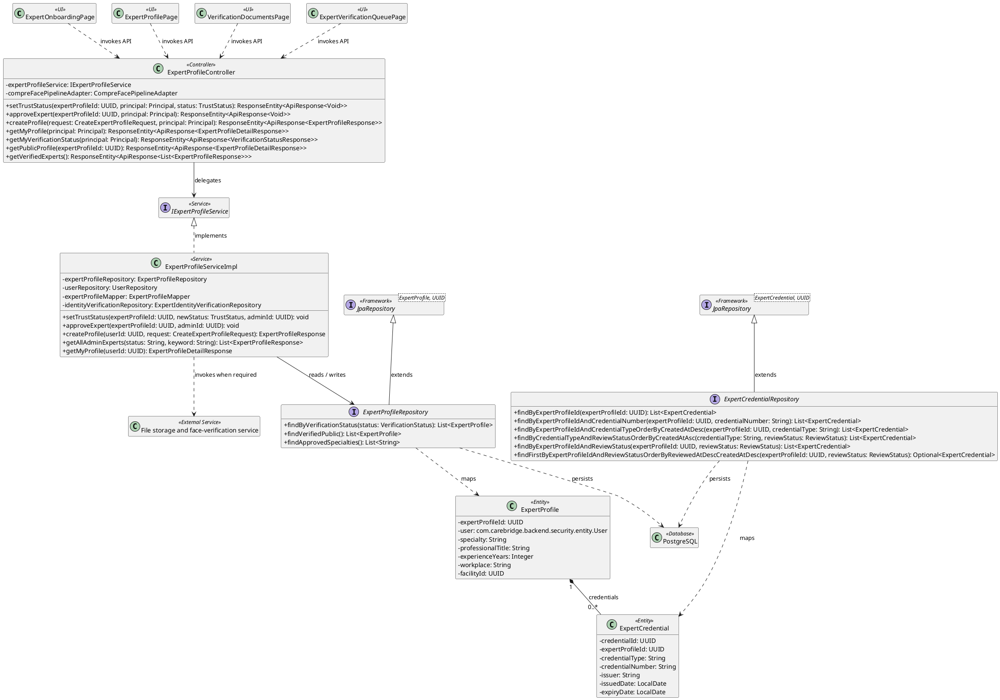
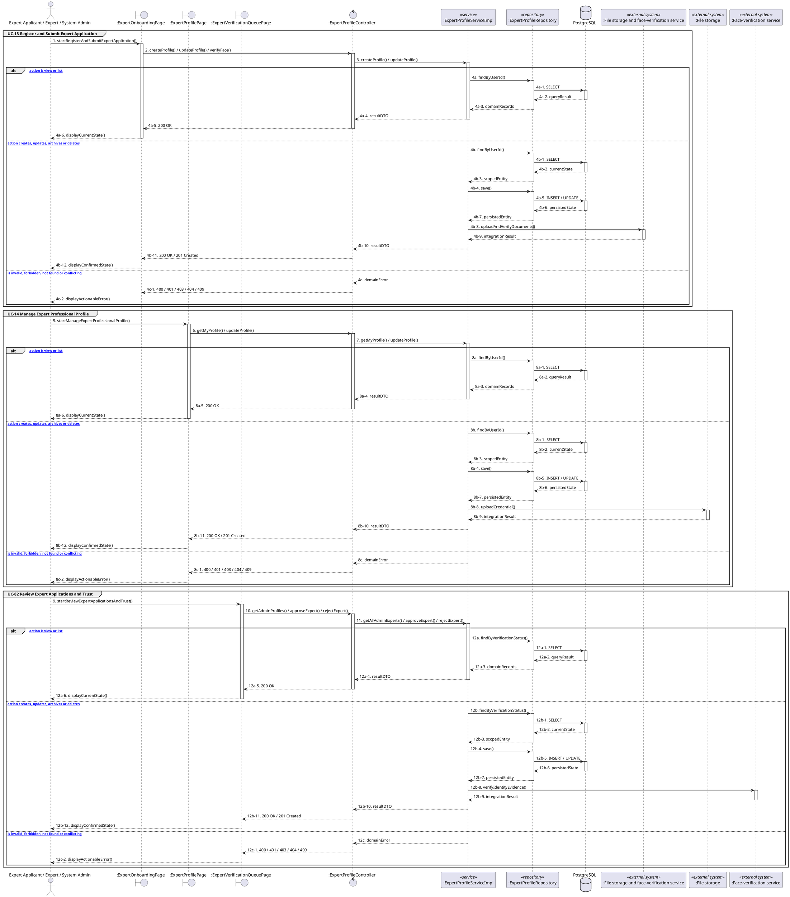

# MF-05 / Spec 01 — Expert Application, Professional Profile and Trust Review

| Field | Value |
| --- | --- |
| Status | Draft |
| Use Cases Covered | UC-13 Register and Submit Expert Application; UC-14 Manage Expert Professional Profile; UC-82 Review Expert Applications and Trust |
| Use Case Group | Shared / Common and Web App |
| Platform | Expert Mobile; Expert Web; Admin Web; Backend |
| Primary Actors | Expert Applicant / Expert / System Admin |
| In Scope | Only approved active profiles may perform verified contribution actions |
| Explicitly Excluded | Badges, points, leaderboard, pricing and ratings |
| Implementation Trace | UI: ExpertOnboardingPage, ExpertProfilePage, VerificationDocumentsPage, ExpertVerificationQueuePage; Controller: ExpertProfileController; Service: ExpertProfileServiceImpl; Repository: ExpertProfileRepository, ExpertCredentialRepository; Entity: ExpertProfile, ExpertCredential |

## 1. Tổng quan luồng chính (Main Flow Overview)

Only approved active profiles may perform verified contribution actions. The flow starts only from the reachable UI or system trigger named in the metadata. The Backend rechecks authentication, role, ownership, membership, consent and current state as applicable; client-side visibility alone never grants access. A confirmed mutation is persisted before the UI displays success. External-service failure returns a safe retry state and must not fabricate completion.

## 2. Class Diagram

**Figure 1 — Class Diagram: Expert Application, Professional Profile and Trust Review**

## 3. Sequence Diagram — Main Flow

**Figure 2 — Sequence Diagram: Expert Application, Professional Profile and Trust Review Main Flow**

**Brief Explanation:**

1. The diagram separates the implemented goals covered by this specification: UC-13 Register and Submit Expert Application; UC-14 Manage Expert Professional Profile; UC-82 Review Expert Applications and Trust.
2. Each actor action enters through the reachable mobile or web boundary and invokes the exact controller operation exposed by the current Backend.
3. The controller delegates to the mapped service operation; read branches query scoped records, while mutation branches load the current state before persisting the requested transition.
4. Repository calls and PostgreSQL responses are shown explicitly, including call-stack activation and dashed return messages.
5. Invalid, unauthorized, missing or conflicting requests return an actionable error without displaying a false success state.
6. External systems are invoked only for the mapped use cases; notification dispatches are asynchronous, while integrations that return data remain synchronous.

## 4. Business Rules Applied

- Access is enforced server-side using the current actor, role, ownership, membership and consent scope.
- Only approved active profiles may perform verified contribution actions.
- The following remains outside this contract: Badges, points, leaderboard, pricing and ratings.
- Retries must not duplicate confirmed records, transitions, notifications or external side effects.
- Sensitive health, identity, moderation, location and safety operations retain the minimum required audit evidence.
