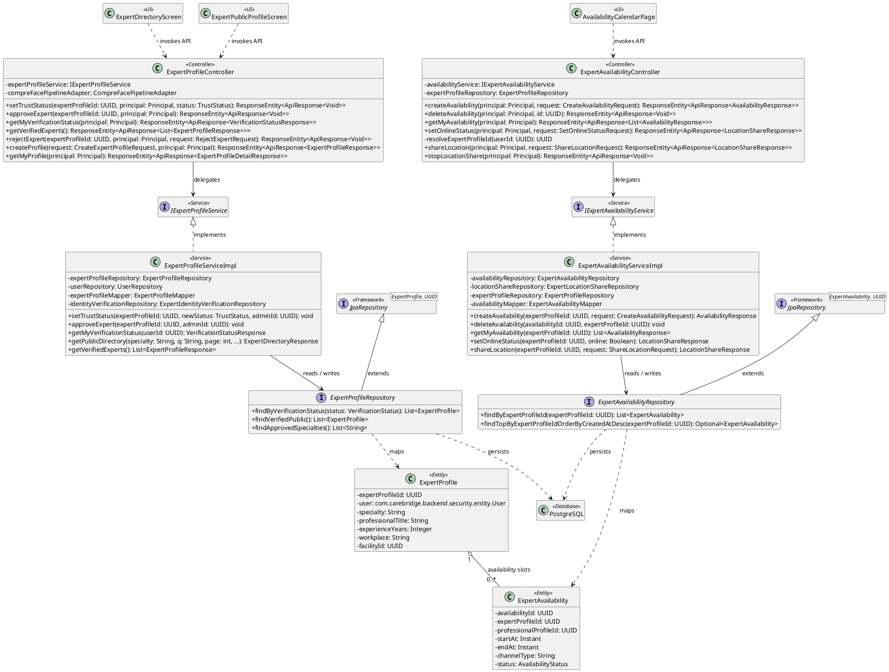
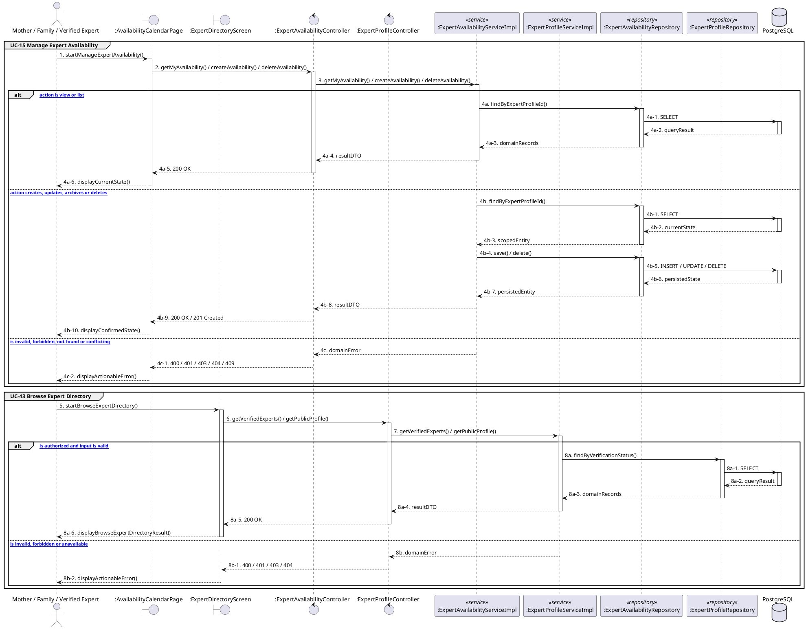

# MF-05 / Spec 02 — Expert Directory and Availability

| Field | Value |
| --- | --- |
| Status | Draft |
| Use Cases Covered | UC-15 Manage Expert Availability; UC-43 Browse Expert Directory |
| Use Case Group | Shared / Common and Mobile App |
| Platform | Mother and Family Mobile; Expert Mobile; Expert Web; Backend |
| Primary Actors | Mother / Family / Verified Expert |
| In Scope | Availability does not guarantee response; labels depend on current trust |
| Explicitly Excluded | Nearby-expert support and gamification |
| Implementation Trace | UI: ExpertDirectoryScreen, ExpertPublicProfileScreen, AvailabilityCalendarPage; Controller: ExpertProfileController, ExpertAvailabilityController; Service: ExpertProfileServiceImpl, ExpertAvailabilityServiceImpl; Repository: ExpertProfileRepository, ExpertAvailabilityRepository; Entity: ExpertProfile, ExpertAvailability |

## 1. Tổng quan luồng chính (Main Flow Overview)

Availability does not guarantee response; labels depend on current trust. The flow starts only from the reachable UI or system trigger named in the metadata. The Backend rechecks authentication, role, ownership, membership, consent and current state as applicable; client-side visibility alone never grants access. A confirmed mutation is persisted before the UI displays success. External-service failure returns a safe retry state and must not fabricate completion.

## 2. Class Diagram

**Figure 1 — Class Diagram: Expert Directory and Availability**

## 3. Sequence Diagram — Main Flow

**Figure 2 — Sequence Diagram: Expert Directory and Availability Main Flow**

**Brief Explanation:**

1. The diagram separates the implemented goals covered by this specification: UC-15 Manage Expert Availability; UC-43 Browse Expert Directory.
2. Each actor action enters through the reachable mobile or web boundary and invokes the exact controller operation exposed by the current Backend.
3. The controller delegates to the mapped service operation; read branches query scoped records, while mutation branches load the current state before persisting the requested transition.
4. Repository calls and PostgreSQL responses are shown explicitly, including call-stack activation and dashed return messages.
5. Invalid, unauthorized, missing or conflicting requests return an actionable error without displaying a false success state.
6. External systems are invoked only for the mapped use cases; notification dispatches are asynchronous, while integrations that return data remain synchronous.

## 4. Business Rules Applied

- Access is enforced server-side using the current actor, role, ownership, membership and consent scope.
- Availability does not guarantee response; labels depend on current trust.
- The following remains outside this contract: Nearby-expert support and gamification.
- Retries must not duplicate confirmed records, transitions, notifications or external side effects.
- Sensitive health, identity, moderation, location and safety operations retain the minimum required audit evidence.
