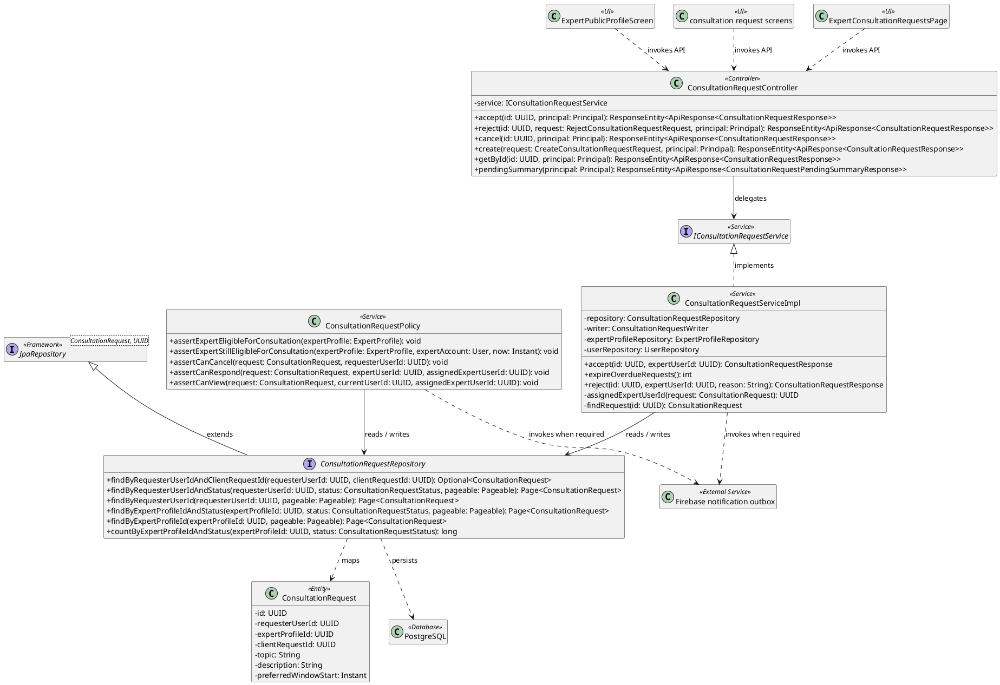
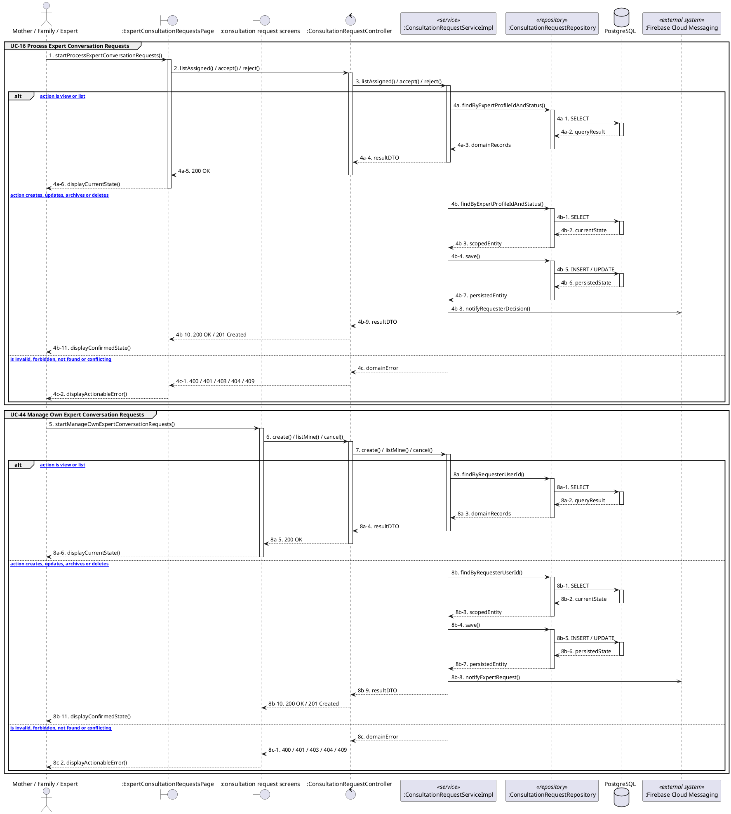

# MF-05 / Spec 03 — Free Expert Conversation Request Lifecycle

| Field | Value |
| --- | --- |
| Status | Draft |
| Use Cases Covered | UC-16 Process Expert Conversation Requests; UC-44 Manage Own Expert Conversation Requests |
| Use Case Group | Shared / Common and Mobile App |
| Platform | Mother and Family Mobile; Expert Mobile; Expert Web; Backend |
| Primary Actors | Mother / Family / Expert |
| In Scope | Accept locks an eligible expert and atomically creates or links the direct conversation |
| Explicitly Excluded | Booking, pricing, payment, commission and refund |
| Known Implementation Gap | Mobile accept/reject follows the Backend contract. Expert Web accept is aligned, but its reject call currently uses POST while the Backend requires PATCH; the Web reject branch must not be documented as operational success. |
| Implementation Trace | UI: ExpertPublicProfileScreen, consultation request screens, ExpertConsultationRequestsPage; Controller: ConsultationRequestController; Service: ConsultationRequestServiceImpl, ConsultationRequestPolicy; Repository: ConsultationRequestRepository; Entity: ConsultationRequest |

## 1. Tổng quan luồng chính (Main Flow Overview)

Accept locks an eligible expert and atomically creates or links the direct conversation. The flow starts only from the reachable UI or system trigger named in the metadata. The Backend rechecks authentication, role, ownership, membership, consent and current state as applicable; client-side visibility alone never grants access. A confirmed mutation is persisted before the UI displays success. External-service failure returns a safe retry state and must not fabricate completion.

## 2. Class Diagram

**Figure 1 — Class Diagram: Free Expert Conversation Request Lifecycle**

## 3. Sequence Diagram — Main Flow

**Figure 2 — Sequence Diagram: Free Expert Conversation Request Lifecycle Main Flow**

**Brief Explanation:**

1. The diagram separates the implemented goals covered by this specification: UC-16 Process Expert Conversation Requests; UC-44 Manage Own Expert Conversation Requests.
2. Each actor action enters through the reachable mobile or web boundary and invokes the exact controller operation exposed by the current Backend.
3. The controller delegates to the mapped service operation; read branches query scoped records, while mutation branches load the current state before persisting the requested transition.
4. Repository calls and PostgreSQL responses are shown explicitly, including call-stack activation and dashed return messages.
5. Invalid, unauthorized, missing or conflicting requests return an actionable error without displaying a false success state.
6. External systems are invoked only for the mapped use cases; notification dispatches are asynchronous, while integrations that return data remain synchronous.

## 4. Business Rules Applied

- Access is enforced server-side using the current actor, role, ownership, membership and consent scope.
- Accept locks an eligible expert and atomically creates or links the direct conversation.
- The Expert Web reject-method mismatch is an implementation gap; the authoritative Backend transition is PATCH and the Mobile client follows that contract.
- The following remains outside this contract: Booking, pricing, payment, commission and refund.
- Retries must not duplicate confirmed records, transitions, notifications or external side effects.
- Sensitive health, identity, moderation, location and safety operations retain the minimum required audit evidence.
