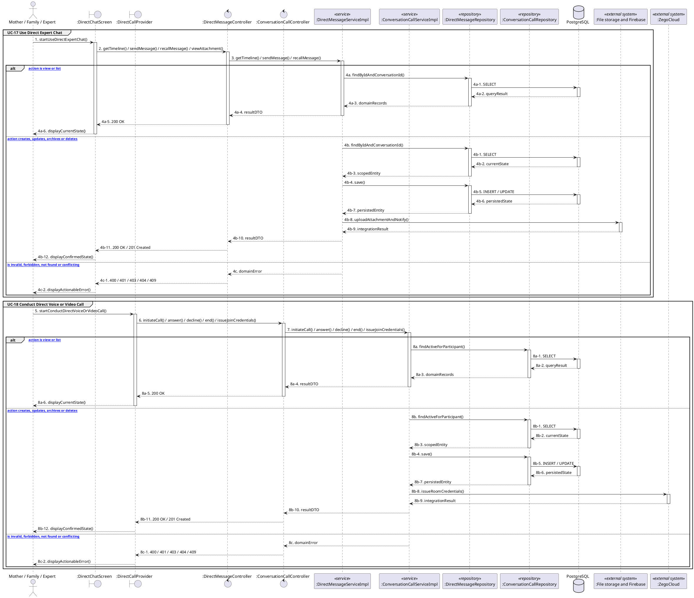

# MF-05 / Spec 04 — Direct Chat, Attachments and Voice or Video Calls

| Field | Value |
| --- | --- |
| Status | Draft |
| Use Cases Covered | UC-17 Use Direct Expert Chat; UC-18 Conduct Direct Voice or Video Call |
| Use Case Group | Shared / Common |
| Platform | Mother and Family Mobile; Expert Mobile; Expert Web; Backend |
| Primary Actors | Mother / Family / Expert |
| In Scope | Only accepted-conversation participants may read, send, recall, attach or join a call |
| Explicitly Excluded | Paid sessions, temporary paid record sharing and ratings |
| Implementation Trace | UI: ConversationListScreen, DirectChatScreen, ConversationRoomPage, DirectCallProvider; Controller: DirectConversationController, DirectMessageController, ConversationCallController; Service: DirectConversationServiceImpl, DirectMessageServiceImpl, ConversationCallServiceImpl; Repository: DirectConversationRepository, DirectMessageRepository, ConversationCallRepository; Entity: DirectConversation, DirectMessage, ConversationCall |

## 1. Tổng quan luồng chính (Main Flow Overview)

Only accepted-conversation participants may read, send, recall, attach or join a call. The flow starts only from the reachable UI or system trigger named in the metadata. The Backend rechecks authentication, role, ownership, membership, consent and current state as applicable; client-side visibility alone never grants access. A confirmed mutation is persisted before the UI displays success. External-service failure returns a safe retry state and must not fabricate completion.

## 2. Class Diagram

```plantuml
@startuml MF05_04_DirectChatAttachmentsandVoiceorVideoCalls_ClassDiagram
skinparam classAttributeIconSize 0
hide empty members

class "ConversationListScreen" as UI1 <<UI>>
class "DirectChatScreen" as UI2 <<UI>>
class "ConversationRoomPage" as UI3 <<UI>>
class "DirectCallProvider" as UI4 <<UI>>
class "DirectConversationController" as Controller1 <<Controller>> {
  - conversationService: IDirectConversationService
  + getConversation(conversationId: UUID, principal: Principal): ResponseEntity<ApiResponse<DirectConversationResponse>>
  + markRead(conversationId: UUID, request: MarkReadRequest, principal: Principal): ResponseEntity<ApiResponse<MarkReadResponse>>
  + getUnreadSummary(principal: Principal): ResponseEntity<ApiResponse<UnreadSummaryResponse>>
  + listMyConversations(principal: Principal): ResponseEntity<ApiResponse<List<DirectConversationSummaryResponse>>>
}
class "DirectMessageController" as Controller2 <<Controller>> {
  - messageService: IDirectMessageService
  - attachmentAccessService: DirectChatAttachmentAccessService
  + recallMessage(conversationId: UUID, messageId: UUID, principal: Principal): ResponseEntity<ApiResponse<Void>>
  + sendMessage(conversationId: UUID, request: SendDirectMessageRequest, principal: Principal): ResponseEntity<ApiResponse<TimelineItemResponse>>
  + viewAttachment(conversationId: UUID, messageId: UUID, principal: Principal): ResponseEntity<ApiResponse<ViewFileResponse>>
}
class "ConversationCallController" as Controller3 <<Controller>> {
  - callService: IConversationCallService
  + getCall(conversationId: UUID, callId: UUID, principal: Principal): ResponseEntity<ApiResponse<ConversationCallResponse>>
  + initiateCall(conversationId: UUID, request: InitiateCallRequest, principal: Principal): ResponseEntity<ApiResponse<ConversationCallResponse>>
  + issueJoinCredentials(conversationId: UUID, callId: UUID, principal: Principal): ResponseEntity<ApiResponse<ZegoJoinCredentialsResponse>>
  + answer(conversationId: UUID, callId: UUID, principal: Principal): ResponseEntity<ApiResponse<ConversationCallResponse>>
  + decline(conversationId: UUID, callId: UUID, principal: Principal): ResponseEntity<ApiResponse<ConversationCallResponse>>
  + end(conversationId: UUID, callId: UUID, principal: Principal): ResponseEntity<ApiResponse<ConversationCallResponse>>
  + markRinging(conversationId: UUID, callId: UUID, principal: Principal): ResponseEntity<ApiResponse<ConversationCallResponse>>
}
class "DirectConversationServiceImpl" as Service1 <<Service>> {
  - conversationRepository: DirectConversationRepository
  - expertProfileRepository: ExpertProfileRepository
  - userRepository: UserRepository
  - messageRepository: DirectMessageRepository
  + getConversation(conversationId: UUID, currentUserId: UUID): DirectConversationResponse
  + markRead(conversationId: UUID, currentUserId: UUID, lastSeenMessageId: UUID): ReadCursor
  - isExpertAvailable(expertUserId: UUID): boolean
  + findOrCreate(motherUserId: UUID, expertProfileId: UUID): FindOrCreateConversationResult
  + getUnreadSummary(currentUserId: UUID): UnreadSummaryResponse
}
class "DirectMessageServiceImpl" as Service2 <<Service>> {
  - conversationRepository: DirectConversationRepository
  - messageRepository: DirectMessageRepository
  - callRepository: ConversationCallRepository
  - timelineRepository: ConversationTimelineRepository
  + recallMessage(conversationId: UUID, messageId: UUID, senderUserId: UUID): void
  + sendMessage(conversationId: UUID, senderUserId: UUID, request: SendDirectMessageRequest): SendDirectMessageResult
  + getTimeline(conversationId: UUID, currentUserId: UUID, after: String, ...): TimelinePageResponse
  - assertAttachmentOwnedBySender(attachmentId: UUID, senderUserId: UUID): void
  - assertSameIdempotentPayload(existing: DirectMessage, requestedBody: String, requestedType: MessageType, ...): void
}
class "ConversationCallServiceImpl" as Service3 <<Service>> {
  - conversationRepository: DirectConversationRepository
  - callRepository: ConversationCallRepository
  - policy: IDirectConversationPolicy
  - expertProfileRepository: ExpertProfileRepository
  - canReadActiveCall(call: ConversationCall, currentUserId: UUID): boolean
  - loadCallConversation(requestedConversationId: UUID, call: ConversationCall): DirectConversation
  + getCall(conversationId: UUID, callId: UUID, currentUserId: UUID): ConversationCallResponse
  + initiateCall(conversationId: UUID, callerUserId: UUID, type: CallType): ConversationCallResponse
  + issueJoinCredentials(conversationId: UUID, callId: UUID, currentUserId: UUID): ZegoJoinCredentialsResponse
}
interface "IDirectConversationService" as Service1Contract <<Service>>
interface "IDirectMessageService" as Service2Contract <<Service>>
interface "IConversationCallService" as Service3Contract <<Service>>
interface "DirectConversationRepository" as Repository1 {
  + findByMotherUserIdAndExpertUserId(motherUserId: UUID, expertUserId: UUID): Optional<DirectConversation>
  + findByMotherUserIdOrExpertUserId(motherUserId: UUID, expertUserId: UUID): List<DirectConversation>
  + findByMotherUserIdOrExpertUserIdOrderByLastActivityAtDesc(motherUserId: UUID, expertUserId: UUID): List<DirectConversation>
}
interface "DirectMessageRepository" as Repository2 {
  + findByConversationIdAndSenderUserIdAndClientMessageId(conversationId: UUID, senderUserId: UUID, clientMessageId: UUID): Optional<DirectMessage>
  + findByIdAndConversationId(messageId: UUID, conversationId: UUID): Optional<DirectMessage>
}
interface "ConversationCallRepository" as Repository3
class "DirectConversation" as Entity1 <<Entity>> {
  - id: UUID
  - motherUserId: UUID
  - expertUserId: UUID
  - status: String
  - createdAt: Instant
  - lastActivityAt: Instant
  - motherLastReadAt: Instant
}
class "DirectMessage" as Entity2 <<Entity>> {
  - id: UUID
  - conversationId: UUID
  - senderUserId: UUID
  - clientMessageId: UUID
  - messageType: MessageType
  - messageBody: String
  - attachmentId: UUID
}
class "ConversationCall" as Entity3 <<Entity>> {
  - id: UUID
  - conversationId: UUID
  - initiatedByUserId: UUID
  - callType: CallType
  - callStatus: CallStatus
  - zegoRoomId: String
  - initiatedAt: Instant
}
interface "JpaRepository<DirectConversation, UUID>" as Repository1Base <<Framework>>
interface "JpaRepository<DirectMessage, UUID>" as Repository2Base <<Framework>>
interface "JpaRepository<ConversationCall, UUID>" as Repository3Base <<Framework>>
class "PostgreSQL" as DB <<Database>>
class "File storage, Firebase and ZegoCloud" as External <<External Service>>

Service1Contract <|.. Service1 : implements
Service2Contract <|.. Service2 : implements
Service3Contract <|.. Service3 : implements
Repository1Base <|-- Repository1 : extends
Repository2Base <|-- Repository2 : extends
Repository3Base <|-- Repository3 : extends
UI1 ..> Controller1 : invokes API
UI2 ..> Controller2 : invokes API
UI3 ..> Controller3 : invokes API
UI4 ..> Controller3 : invokes API
Controller1 --> Service1Contract : delegates
Controller2 --> Service2Contract : delegates
Controller3 --> Service3Contract : delegates
Service1 --> Repository1 : reads / writes
Service2 --> Repository2 : reads / writes
Service3 --> Repository3 : reads / writes
Repository1 ..> Entity1 : maps
Repository1 ..> DB : persists
Repository2 ..> Entity2 : maps
Repository2 ..> DB : persists
Repository3 ..> Entity3 : maps
Repository3 ..> DB : persists
Service1 ..> External : invokes when required
Service2 ..> External : invokes when required
Service3 ..> External : invokes when required
Entity1 "1" *-- "0..*" Entity2 : messages
Entity1 "1" *-- "0..*" Entity3 : calls
@enduml
```

**Figure 1 — Class Diagram: Direct Chat, Attachments and Voice or Video Calls**

## 3. Sequence Diagram — Main Flow

**Figure 2 — Sequence Diagram: Direct Chat, Attachments and Voice or Video Calls Main Flow**

**Brief Explanation:**

1. The diagram separates the implemented goals covered by this specification: UC-17 Use Direct Expert Chat; UC-18 Conduct Direct Voice or Video Call.
2. Each actor action enters through the reachable mobile or web boundary and invokes the exact controller operation exposed by the current Backend.
3. The controller delegates to the mapped service operation; read branches query scoped records, while mutation branches load the current state before persisting the requested transition.
4. Repository calls and PostgreSQL responses are shown explicitly, including call-stack activation and dashed return messages.
5. Invalid, unauthorized, missing or conflicting requests return an actionable error without displaying a false success state.
6. External systems are invoked only for the mapped use cases; notification dispatches are asynchronous, while integrations that return data remain synchronous.

## 4. Business Rules Applied

- Access is enforced server-side using the current actor, role, ownership, membership and consent scope.
- Only accepted-conversation participants may read, send, recall, attach or join a call.
- The following remains outside this contract: Paid sessions, temporary paid record sharing and ratings.
- Retries must not duplicate confirmed records, transitions, notifications or external side effects.
- Sensitive health, identity, moderation, location and safety operations retain the minimum required audit evidence.
