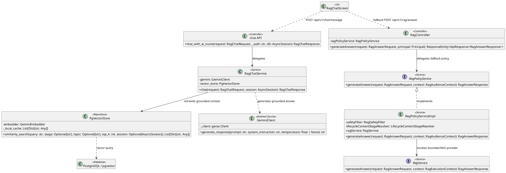
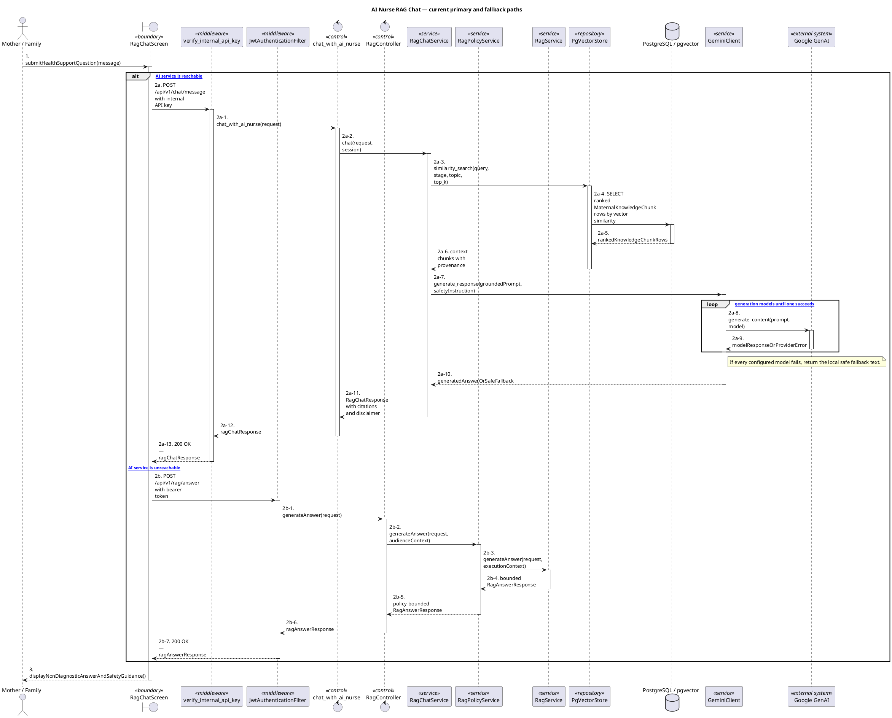

# MF-06 — AI Nurse RAG Chat and Safety Guardrails

| Field | Value |
| --- | --- |
| Major Feature | **MF-06 — AI Nurse Assistant** |
| Function package | **AI Nurse RAG Chat and Safety Guardrails** |
| Code-first use cases | `UC-AI-01` |
| Status | **Draft** |
| Baseline | Current reachable code and tests, 2026-08-23 |
| Diagram convention | `../sequence-diagram-skill.md`; explicit lifeline order, numbered messages, balanced activation |

## 1. Tổng quan luồng chính

Design the reachable Mobile RAG chat, Python AI path, Spring fallback, retrieval, model fallback, citations, and safety floor.

- **UC-AI-01 — Use AI Nurse RAG Chat:** Ask a maternal-care question through the reachable AI Nurse chat, receive a grounded advisory response with citations/disclaimer, and follow deterministic expert/emergency guardrails.

The code is authoritative for routes, handlers, delegation, authorization, and persisted state. Report1 section 6.2 is authoritative for the Major Feature name. Historical UC numbering and obsolete triage plans are not design inputs.

## 2. Function Design — Code Traceability

| UC | Actor goal | Method / route | Exact handler | Delegated function | Authorization | Source |
| --- | --- | --- | --- | --- | --- | --- |
| `UC-AI-01` | Use AI Nurse RAG Chat | `POST /api/v1/chat/message` | `chat.chat_with_ai_nurse()` | `RagChatService.chat()` → `PgVectorStore.similarity_search()` → `GeminiClient.generate_response()` | Internal API key via `verify_internal_api_key` dependency | `05_Development/CareBridgeAITriageService/app/api/v1/chat.py` |
| `UC-AI-01` | Use AI Nurse RAG Chat | `POST /api/v1/rag/answer` | `RagController.generateAnswer()` | `RagPolicyService.generateAnswer()` | No @PreAuthorize on handler/class; effective access comes from the security chain | `05_Development/CareBridgeAPI/src/main/java/com/carebridge/backend/integration/gemini/controller/RagController.java` |

## 3. Class Diagram

This design-level UML follows the current source declarations: fields become attributes, reachable methods become operations, `implements` becomes realization, repository inheritance becomes generalization, and runtime-only calls remain dependencies. A missing layer or ownership relation is not invented.

**Figure 1 — Class Diagram: AI Nurse RAG Chat and Safety Guardrails**

## 4. Sequence Diagram — Main Flow

Each group is a representative reachable main flow. The full endpoint surface remains in the Function Design table above.

**Brief Explanation:**

1. The Mother or Family user submits a health-support question through RagChatScreen.
2. When the Python AI service is reachable, the internal-key middleware validates the request before the chat route invokes RagChatService.
3. RagChatService retrieves grounded context through PgVectorStore and PostgreSQL/pgvector before requesting a generated response.
4. GeminiClient tries the configured Google GenAI models in order and returns local safe fallback text if every provider call fails.
5. When the Python service is unreachable, RagChatScreen uses the bearer-authenticated Spring RAG fallback and its audience-bounded policy service.
6. The UI displays the non-diagnostic answer, provenance, disclaimer, and safety guidance returned by the selected path.

## 5. Business Rules Applied

| UC | Enforced business/security rules | Known boundary or gap |
| --- | --- | --- |
| `UC-AI-01` | Python `RagChatRequest` carries message, stage, optional mother-only gestational age/survey/recent metrics, role, and conversation history; `RagChatResponse` returns answer, critical/expert flags, follow-ups, citations, disclaimer, and generated time. Mobile currently calls Python directly with literal internal key `carebridge`, then falls back to authenticated Spring `/api/v1/rag/answer`; this compiled-key boundary is not production-safe. Python retrieval defaults stage to `PREGNANCY`, includes stage plus `ALL`, requests top 4, and excludes returned chunks with similarity below `0.35` before prompting. Hybrid retrieval ranks by `0.35 * vector similarity + 0.20 * keyword ratio + title/phrase boosts` and de-duplicates title/section candidates. Retrieval-query expansion uses the latest user/human turn among the last two history messages; the prompt includes at most the last six messages. Family requests exclude gestational age, survey profile, and recent metrics; Mother requests include only supported formatted fields. Citations are created only from valid retrieved chunks, de-duplicated by title/section, and omit a generic root citation when a specific section exists. Generation tries distinct configured/fallback Gemini models and returns a bounded static response when all provider calls fail. Model tags are removed from visible text and mapped to critical/expert flags/follow-ups; deterministic abnormal-metric rules can raise but never lower expert consultation. Every Python success/degraded response includes the configured medical disclaimer; Spring returns its own constant disclaimer and explicit fallback flag. RAG is advisory/non-diagnostic; deterministic safety rules are the floor and citations must come from retrieved knowledge. | Structured triage session/history/handoff backend infrastructure has no reachable intake UI and remains Partial. The literal `carebridge` key is accepted even when another expected production key is configured; record this as a failing production-security expectation. No focused Mobile test currently proves Python failure to Spring fallback and response-shape downgrade. |

## 6. Partial / Excluded Boundaries

- Structured symptom-intake session/history/handoff remains Partial because no reachable Mobile intake owns that lifecycle.
- Structured triage session/history/handoff backend infrastructure has no reachable intake UI and remains Partial.
- The literal `carebridge` key is accepted even when another expected production key is configured; record this as a failing production-security expectation.
- No focused Mobile test currently proves Python failure to Spring fallback and response-shape downgrade.

## 7. Code and Test Evidence

- `docs/AI/01_THIET_KE_KIEN_TRUC_AI_RAG_VA_BAO_VE_DO_AN.md`
- `05_Development/CareBridgeAPI/src/main/java/com/carebridge/backend/integration/gemini/controller/RagController.java`
- `05_Development/CareBridgeAPI/src/main/java/com/carebridge/backend/integration/gemini/service/RagPolicyServiceImpl.java`
- `05_Development/CareBridgeAPI/src/main/java/com/carebridge/backend/integration/gemini/dto/RagAnswerRequest.java`
- `05_Development/CareBridgeAPI/src/main/java/com/carebridge/backend/integration/gemini/dto/RagAnswerResponse.java`
- `05_Development/CareBridgeAITriageService/app/api/v1/chat.py`
- `05_Development/CareBridgeAITriageService/app/models/schemas.py`
- `05_Development/CareBridgeAITriageService/app/services/rag_chat_service.py`
- `05_Development/CareBridgeAITriageService/app/rag/vector_store.py`
- `05_Development/CareBridgeAITriageService/app/rag/prompts.py`
- `05_Development/CareBridgeAITriageService/app/core/gemini.py`
- `05_Development/CareBridgeAITriageService/app/core/security.py`
- `05_Development/CareBridgeMobileApp/lib/features/aiTriage/screens/rag_chat_screen.dart`
- `05_Development/CareBridgeAPI/src/test/java/com/carebridge/backend/integration/gemini/RagControllerTest.java`
- `05_Development/CareBridgeAITriageService/tests/test_api_endpoints.py`
- `05_Development/CareBridgeAITriageService/tests/test_rag_chat.py`
