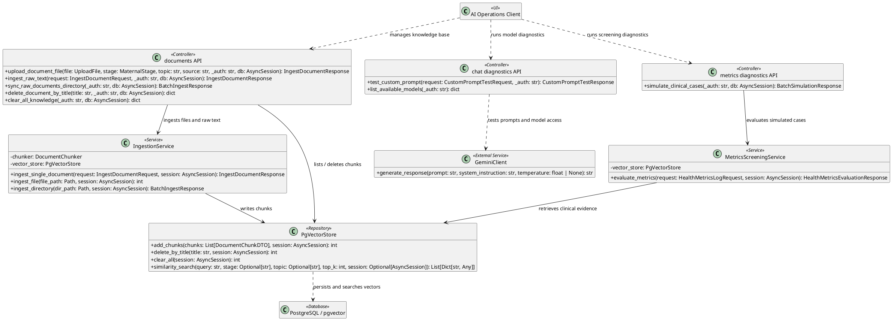
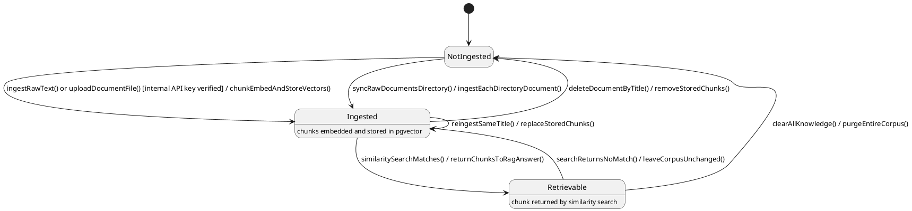

# MF-06 — AI Knowledge Base and Diagnostics Operations

| Field | Value |
| --- | --- |
| Major Feature | **MF-06 — AI Nurse Assistant** |
| Function package | **AI Knowledge Base and Diagnostics Operations** |
| Code-first use cases | `UC-AD-20, UC-AD-21` |
| Status | **Draft** |
| Baseline | Current reachable code and tests, 2026-08-23 |
| Diagram convention | `../sequence-diagram-skill.md`; explicit lifeline order, numbered messages, balanced activation |

## 1. Tổng quan luồng chính

Design operator knowledge ingestion/deletion and diagnostic endpoints separately from the user chat goal.

- **UC-AD-20 — Manage AI Knowledge Base:** Inspect knowledge/chunks, upload and ingest supported documents, synchronize/rebuild eligible sources, and delete obsolete knowledge.
- **UC-AD-21 — Run AI Diagnostic and Clinical Simulators:** Test prompt/model configuration and run deterministic metric simulation to inspect actual versus expected screening behavior.

The code is authoritative for routes, handlers, delegation, authorization, and persisted state. Report1 section 6.2 is authoritative for the Major Feature name. Historical UC numbering and obsolete triage plans are not design inputs.

## 2. Function Design — Code Traceability

| UC | Actor goal | Method / route | Exact handler | Delegated function | Authorization | Source |
| --- | --- | --- | --- | --- | --- | --- |
| `UC-AD-20` | Manage AI Knowledge Base | `DELETE /api/v1/documents/by-title` | `documents.delete_document_by_title()` | `PgVectorStore.delete_by_title()` | Internal API key via `verify_internal_api_key` dependency | `05_Development/CareBridgeAITriageService/app/api/v1/documents.py` |
| `UC-AD-20` | Manage AI Knowledge Base | `DELETE /api/v1/documents/clear-all` | `documents.clear_all_knowledge()` | `PgVectorStore.clear_all()` | Internal API key via `verify_internal_api_key` dependency | `05_Development/CareBridgeAITriageService/app/api/v1/documents.py` |
| `UC-AD-20` | Manage AI Knowledge Base | `GET /api/v1/documents/files` | `documents.list_raw_files()` | — | Internal API key via `verify_internal_api_key` dependency | `05_Development/CareBridgeAITriageService/app/api/v1/documents.py` |
| `UC-AD-20` | Manage AI Knowledge Base | `POST /api/v1/documents/ingest-text` | `documents.ingest_raw_text()` | `IngestionService.ingest_single_document()` → `PgVectorStore.add_chunks()` | Internal API key via `verify_internal_api_key` dependency | `05_Development/CareBridgeAITriageService/app/api/v1/documents.py` |
| `UC-AD-20` | Manage AI Knowledge Base | `GET /api/v1/documents/list` | `documents.list_knowledge_chunks()` | — | Internal API key via `verify_internal_api_key` dependency | `05_Development/CareBridgeAITriageService/app/api/v1/documents.py` |
| `UC-AD-20` | Manage AI Knowledge Base | `POST /api/v1/documents/search-vector` | `documents.simulate_vector_search()` | — | Internal API key via `verify_internal_api_key` dependency | `05_Development/CareBridgeAITriageService/app/api/v1/documents.py` |
| `UC-AD-20` | Manage AI Knowledge Base | `GET /api/v1/documents/stats` | `documents.get_knowledge_statistics()` | — | Internal API key via `verify_internal_api_key` dependency | `05_Development/CareBridgeAITriageService/app/api/v1/documents.py` |
| `UC-AD-20` | Manage AI Knowledge Base | `POST /api/v1/documents/sync-directory` | `documents.sync_raw_documents_directory()` | `IngestionService.ingest_directory()` → `PgVectorStore.add_chunks()` | Internal API key via `verify_internal_api_key` dependency | `05_Development/CareBridgeAITriageService/app/api/v1/documents.py` |
| `UC-AD-20` | Manage AI Knowledge Base | `POST /api/v1/documents/upload` | `documents.upload_document_file()` | `IngestionService.ingest_file()` → `PgVectorStore.add_chunks()` | Internal API key via `verify_internal_api_key` dependency | `05_Development/CareBridgeAITriageService/app/api/v1/documents.py` |
| `UC-AD-21` | Run AI Diagnostic and Clinical Simulators | `GET /api/v1/chat/models` | `chat.list_available_models()` | — | Internal API key via `verify_internal_api_key` dependency | `05_Development/CareBridgeAITriageService/app/api/v1/chat.py` |
| `UC-AD-21` | Run AI Diagnostic and Clinical Simulators | `POST /api/v1/chat/test-prompt` | `chat.test_custom_prompt()` | `GeminiClient.generate_response()` | Internal API key via `verify_internal_api_key` dependency | `05_Development/CareBridgeAITriageService/app/api/v1/chat.py` |
| `UC-AD-21` | Run AI Diagnostic and Clinical Simulators | `POST /api/v1/metrics/simulate-batch` | `metrics.simulate_clinical_cases()` | `MetricsScreeningService.evaluate_metrics()` → `PgVectorStore.similarity_search()` | Internal API key via `verify_internal_api_key` dependency | `05_Development/CareBridgeAITriageService/app/api/v1/metrics.py` |

## 3. Class Diagram

This design-level UML follows the current source declarations: fields become attributes, reachable methods become operations, `implements` becomes realization, repository inheritance becomes generalization, and runtime-only calls remain dependencies. A missing layer or ownership relation is not invented.

**Figure 1 — Class Diagram: AI Knowledge Base and Diagnostics Operations**

## 4. Sequence Diagram — Main Flow

Each group is a representative reachable main flow. The full endpoint surface remains in the Function Design table above.

```plantuml
@startuml
skinparam shadowing false
skinparam maxMessageSize 90
title AI Knowledge Base and Diagnostics Operations — code-reachable representative flows

actor "Authorized Technical Operator" as AAuthorized_Technical_Operator
boundary "CareBridge UI /docs" as UICareBridge_UI__docs <<boundary>>
participant "verify_internal_api_key" as InternalKey <<middleware>>
control "documents" as Cdocuments <<control>>
control "chat" as Cchat <<control>>
control "metrics" as Cmetrics <<control>>
participant "IngestionService" as SIngestionService <<service>>
participant "GeminiClient" as SGeminiClient <<service>>
participant "MetricsScreeningService" as SMetricsScreeningService <<service>>
participant "PgVectorStore" as RPgVectorStore <<repository>>
database "PostgreSQL / pgvector" as DB

group UC-AD-20 — Manage AI Knowledge Base [upload_document_file()]
AAuthorized_Technical_Operator -> UICareBridge_UI__docs : 1. selectKnowledgeDocumentForUpload()
activate UICareBridge_UI__docs
alt [authorized request succeeds]
UICareBridge_UI__docs -> InternalKey : 2a. POST /api/v1/documents/upload with internal API key
activate InternalKey
InternalKey -> Cdocuments : 2a-1. upload_document_file(file, stage, topic, source)
activate Cdocuments
Cdocuments -> SIngestionService : 2a-2. ingest_file(filePath, session)
activate SIngestionService
SIngestionService -> RPgVectorStore : 2a-3. add_chunks(chunks, session)
activate RPgVectorStore
RPgVectorStore -> DB : 2a-4. INSERT / UPDATE MaternalKnowledgeChunk
activate DB
DB --> RPgVectorStore : 2a-5. persistedMaternalKnowledgeChunk
deactivate DB
RPgVectorStore --> SIngestionService : 2a-6. affectedCount
deactivate RPgVectorStore
SIngestionService --> Cdocuments : 2a-7. affectedCount
deactivate SIngestionService
Cdocuments --> InternalKey : 2a-8. ingestDocumentResponse
deactivate Cdocuments
InternalKey --> UICareBridge_UI__docs : 2a-9. 200 OK — ingestDocumentResponse
deactivate InternalKey
UICareBridge_UI__docs --> AAuthorized_Technical_Operator : 2a-10. displayKnowledgeIngestionResult()
else [internal API key is rejected]
UICareBridge_UI__docs -> InternalKey : 2b. POST /api/v1/documents/upload with invalid internal API key
activate InternalKey
InternalKey --> UICareBridge_UI__docs : 2b-1. 401 Unauthorized
deactivate InternalKey
UICareBridge_UI__docs --> AAuthorized_Technical_Operator : 2b-2. showInternalApiKeyError(message)
else [downstream processing fails]
UICareBridge_UI__docs -> InternalKey : 2c. POST /api/v1/documents/upload with internal API key
activate InternalKey
InternalKey -> Cdocuments : 2c-1. upload_document_file(file, stage, topic, source)
activate Cdocuments
Cdocuments -> SIngestionService : 2c-2. ingest_file(filePath, session)
activate SIngestionService
SIngestionService --> Cdocuments : 2c-3. downstreamProcessingError
deactivate SIngestionService
Cdocuments --> InternalKey : 2c-4. downstreamProcessingError
deactivate Cdocuments
InternalKey --> UICareBridge_UI__docs : 2c-5. 500 Internal Server Error — downstreamProcessingError
deactivate InternalKey
UICareBridge_UI__docs --> AAuthorized_Technical_Operator : 2c-6. showKnowledgeIngestionError(message)
end
deactivate UICareBridge_UI__docs
end

group UC-AD-20 — Manage AI Knowledge Base [delete_document_by_title()]
AAuthorized_Technical_Operator -> UICareBridge_UI__docs : 3. confirmKnowledgeDocumentDeletion(title)
activate UICareBridge_UI__docs
alt [authorized request succeeds]
UICareBridge_UI__docs -> InternalKey : 4a. DELETE /api/v1/documents/by-title with internal API key
activate InternalKey
InternalKey -> Cdocuments : 4a-1. delete_document_by_title(title)
activate Cdocuments
Cdocuments -> RPgVectorStore : 4a-2. delete_by_title(title, session)
activate RPgVectorStore
RPgVectorStore -> DB : 4a-3. DELETE MaternalKnowledgeChunk via delete_by_title()
activate DB
DB --> RPgVectorStore : 4a-4. deletedMaternalKnowledgeChunkCount
deactivate DB
RPgVectorStore --> Cdocuments : 4a-5. affectedCount
deactivate RPgVectorStore
Cdocuments --> InternalKey : 4a-6. deleteDocumentByTitleResponse
deactivate Cdocuments
InternalKey --> UICareBridge_UI__docs : 4a-7. 200 OK — deleteDocumentByTitleResponse
deactivate InternalKey
UICareBridge_UI__docs --> AAuthorized_Technical_Operator : 4a-8. displayDeletedKnowledgeDocument()
else [internal API key is rejected]
UICareBridge_UI__docs -> InternalKey : 4b. DELETE /api/v1/documents/by-title with invalid internal API key
activate InternalKey
InternalKey --> UICareBridge_UI__docs : 4b-1. 401 Unauthorized
deactivate InternalKey
UICareBridge_UI__docs --> AAuthorized_Technical_Operator : 4b-2. showInternalApiKeyError(message)
end
deactivate UICareBridge_UI__docs
end

group UC-AD-21 — Run AI Diagnostic and Clinical Simulators [test_custom_prompt()]
AAuthorized_Technical_Operator -> UICareBridge_UI__docs : 5. submitDiagnosticPrompt()
activate UICareBridge_UI__docs
alt [authorized request succeeds]
UICareBridge_UI__docs -> InternalKey : 6a. POST /api/v1/chat/test-prompt with internal API key
activate InternalKey
InternalKey -> Cchat : 6a-1. test_custom_prompt(request)
activate Cchat
Cchat -> SGeminiClient : 6a-2. generate_response(prompt, systemInstruction, temperature)
activate SGeminiClient
SGeminiClient --> Cchat : 6a-3. generateResponseResult
deactivate SGeminiClient
Cchat --> InternalKey : 6a-4. customPromptTestResponse
deactivate Cchat
InternalKey --> UICareBridge_UI__docs : 6a-5. 200 OK — customPromptTestResponse
deactivate InternalKey
UICareBridge_UI__docs --> AAuthorized_Technical_Operator : 6a-6. displayDiagnosticModelAnswer()
else [internal API key is rejected]
UICareBridge_UI__docs -> InternalKey : 6b. POST /api/v1/chat/test-prompt with invalid internal API key
activate InternalKey
InternalKey --> UICareBridge_UI__docs : 6b-1. 401 Unauthorized
deactivate InternalKey
UICareBridge_UI__docs --> AAuthorized_Technical_Operator : 6b-2. showInternalApiKeyError(message)
end
deactivate UICareBridge_UI__docs
end

group UC-AD-21 — Run AI Diagnostic and Clinical Simulators [simulate_clinical_cases()]
AAuthorized_Technical_Operator -> UICareBridge_UI__docs : 7. runClinicalCaseSimulation()
activate UICareBridge_UI__docs
alt [authorized request succeeds]
UICareBridge_UI__docs -> InternalKey : 8a. POST /api/v1/metrics/simulate-batch with internal API key
activate InternalKey
InternalKey -> Cmetrics : 8a-1. simulate_clinical_cases()
activate Cmetrics
Cmetrics -> SMetricsScreeningService : 8a-2. evaluate_metrics(request, session)
activate SMetricsScreeningService
SMetricsScreeningService -> RPgVectorStore : 8a-3. similarity_search(query, stage, topic, topK)
activate RPgVectorStore
RPgVectorStore -> DB : 8a-4. SELECT ranked MaternalKnowledgeChunk rows by vector similarity
activate DB
DB --> RPgVectorStore : 8a-5. rankedMaternalKnowledgeChunkRows
deactivate DB
RPgVectorStore --> SMetricsScreeningService : 8a-6. knowledgeChunkList
deactivate RPgVectorStore
SMetricsScreeningService --> Cmetrics : 8a-7. healthMetricsEvaluationResponse
deactivate SMetricsScreeningService
Cmetrics --> InternalKey : 8a-8. batchSimulationResponse
deactivate Cmetrics
InternalKey --> UICareBridge_UI__docs : 8a-9. 200 OK — batchSimulationResponse
deactivate InternalKey
UICareBridge_UI__docs --> AAuthorized_Technical_Operator : 8a-10. displayClinicalSimulationResults()
else [internal API key is rejected]
UICareBridge_UI__docs -> InternalKey : 8b. POST /api/v1/metrics/simulate-batch with invalid internal API key
activate InternalKey
InternalKey --> UICareBridge_UI__docs : 8b-1. 401 Unauthorized
deactivate InternalKey
UICareBridge_UI__docs --> AAuthorized_Technical_Operator : 8b-2. showInternalApiKeyError(message)
end
deactivate UICareBridge_UI__docs
end
@enduml
```

**Brief Explanation:**

1. The actor starts each grouped use case through the code-reachable UI boundary.
2. AI-service requests pass through verify_internal_api_key and stop with 401 Unauthorized when the service credential is rejected.
3. The controller receives the request and invokes the exact delegated operation resolved from the current source.
4. The service applies the business policy and coordinates downstream collaborators while its caller remains active.
5. The repository executes the represented persistence operation and returns the stored or queried result before its activation ends.
6. The HTTP response unwinds through middleware when present, and the UI renders the server-authoritative outcome to the actor.

## 5. State Chart Diagram

The lifecycle below belongs to **The knowledge-base document as it moves through ingestion into the pgvector corpus (operator-driven, AI service side)**. Its states are the persisted constants declared in the sources cited under this diagram, and every transition, guard, and action is taken from the service method that writes that constant. No unreachable state is introduced.

**Figure 2 — State Chart Diagram: AI Knowledge Base and Diagnostics Operations**

**Brief Explanation:**

1. Every transition here is operator-driven and gated by the internal API key dependency, which is why no end-user actor appears in this lifecycle.
2. A document reaches `Ingested` through three distinct entry points — raw text, an uploaded file, or a directory sync — and all three end in the same chunk-embed-and-store action.
3. Re-ingesting the same title is a self-transition that replaces the stored chunks, so the corpus does not accumulate duplicate copies of a revised document.
4. `Retrievable` is the state a chunk occupies when a similarity search actually returns it; it is a read-time condition over the stored corpus, not a separate persisted flag.
5. Deletion by title and the corpus-wide clear are the only transitions that return content to `NotIngested`, and both are irreversible without re-ingestion.
6. The diagnostic endpoints — model listing, prompt testing, and batch clinical simulation — read this corpus without moving a document between states, so they add no transition.

**State sources:**

- `05_Development/CareBridgeAITriageService/app/api/v1/documents.py`
- `05_Development/CareBridgeAITriageService/app/services/ingestion_service.py`
- `05_Development/CareBridgeAITriageService/app/api/v1/chat.py`
- `05_Development/CareBridgeAITriageService/app/api/v1/metrics.py`

## 6. Business Rules Applied

| UC | Enforced business/security rules | Known boundary or gap |
| --- | --- | --- |
| `UC-AD-20` | All operations require the configured internal API key. File type/size/name validation and curated source metadata are required. Deleting knowledge changes future retrieval but does not prove generated answers are error-free. | Current operation is API/Swagger-based rather than a role-authenticated Web administration page. |
| `UC-AD-21` | Diagnostic endpoints are operational tools, not consumer clinical flows. Historical counts, latency, uptime, or accuracy are not current requirements unless rerun and dated. | No additional gap recorded in the code-first baseline. |

## 7. Partial / Excluded Boundaries

- The approved AI architecture document is a referenced design authority and is never generated or edited by this package.
- Current operation is API/Swagger-based rather than a role-authenticated Web administration page.

## 8. Code and Test Evidence

- `05_Development/CareBridgeAITriageService/app/api/v1/documents.py`
- `05_Development/CareBridgeAITriageService/app/services/ingestion_service.py`
- `05_Development/CareBridgeAITriageService/scripts/ingest_documents.py`
- `05_Development/CareBridgeAITriageService/tests/test_ingestion_and_chunker.py`
- `05_Development/CareBridgeAITriageService/tests/test_api_endpoints.py`
- `05_Development/CareBridgeAITriageService/app/api/v1/chat.py`
- `05_Development/CareBridgeAITriageService/app/api/v1/metrics.py`
- `05_Development/CareBridgeAITriageService/app/services/metrics_screening_service.py`
- `05_Development/CareBridgeAITriageService/tests/test_metrics_screening.py`
