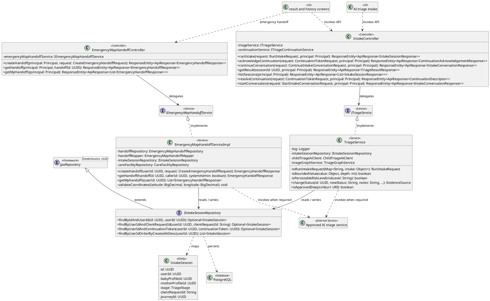
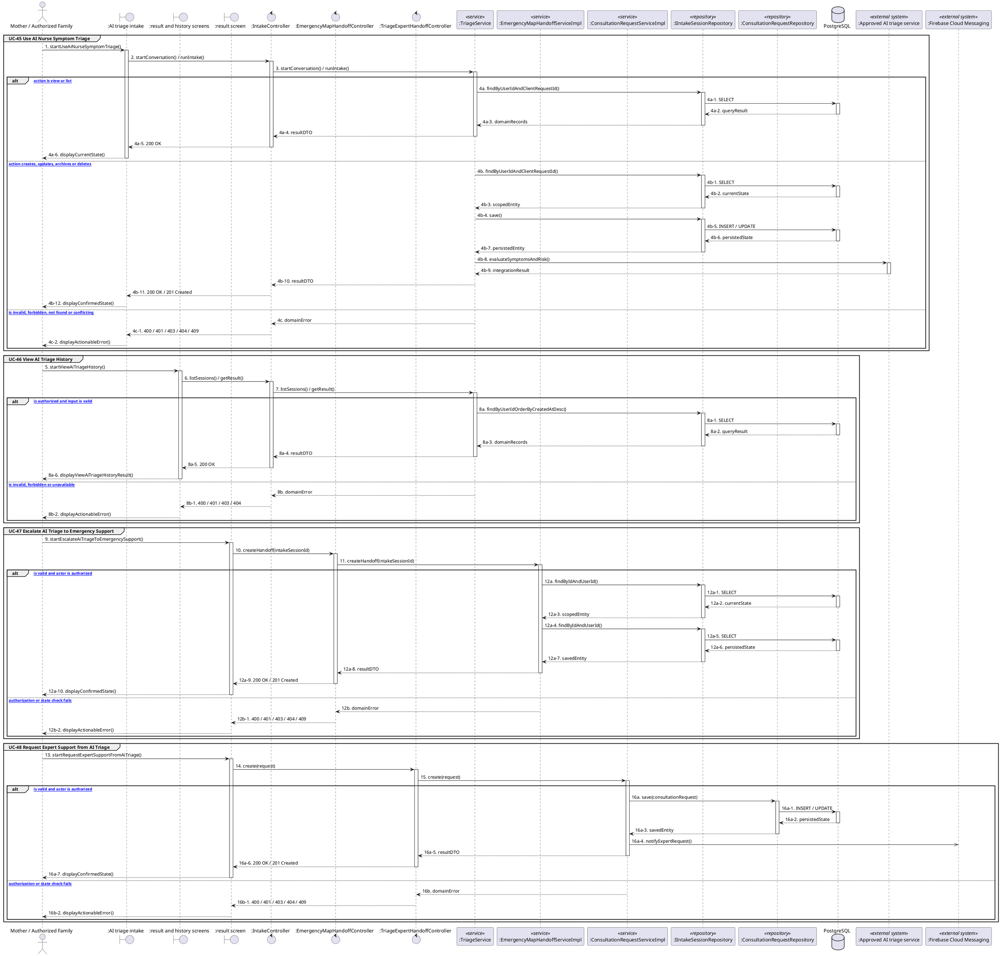

# MF-06 / Spec 01 — AI Symptom Intake, History and Escalation

| Field | Value |
| --- | --- |
| Status | Draft |
| Use Cases Covered | UC-45 Use AI Nurse Symptom Triage; UC-46 View AI Triage History; UC-47 Escalate AI Triage to Emergency Support; UC-48 Request Expert Support from AI Triage |
| Use Case Group | Mobile App |
| Platform | Mother and authorized Family Mobile; Backend; AI Service |
| Primary Actors | Mother / Authorized Family |
| In Scope | GREEN YELLOW RED output is non-diagnostic and red flags set a minimum risk |
| Explicitly Excluded | Standalone RagChatScreen and autonomous diagnosis |
| Implementation Trace | UI: AI triage intake, result and history screens; Controller: IntakeController, EmergencyMapHandoffController; Service: TriageService, EmergencyMapHandoffServiceImpl; Repository: IIntakeSessionRepository; Entity: IntakeSession |

## 1. Tổng quan luồng chính (Main Flow Overview)

GREEN YELLOW RED output is non-diagnostic and red flags set a minimum risk. The flow starts only from the reachable UI or system trigger named in the metadata. The Backend rechecks authentication, role, ownership, membership, consent and current state as applicable; client-side visibility alone never grants access. A confirmed mutation is persisted before the UI displays success. External-service failure returns a safe retry state and must not fabricate completion.

## 2. Class Diagram

**Figure 1 — Class Diagram: AI Symptom Intake, History and Escalation**

## 3. Sequence Diagram — Main Flow

**Figure 2 — Sequence Diagram: AI Symptom Intake, History and Escalation Main Flow**

**Brief Explanation:**

1. The diagram separates the implemented goals covered by this specification: UC-45 Use AI Nurse Symptom Triage; UC-46 View AI Triage History; UC-47 Escalate AI Triage to Emergency Support; UC-48 Request Expert Support from AI Triage.
2. Each actor action enters through the reachable mobile or web boundary and invokes the exact controller operation exposed by the current Backend.
3. The controller delegates to the mapped service operation; read branches query scoped records, while mutation branches load the current state before persisting the requested transition.
4. Repository calls and PostgreSQL responses are shown explicitly, including call-stack activation and dashed return messages.
5. Invalid, unauthorized, missing or conflicting requests return an actionable error without displaying a false success state.
6. External systems are invoked only for the mapped use cases; notification dispatches are asynchronous, while integrations that return data remain synchronous.

## 4. Business Rules Applied

- Access is enforced server-side using the current actor, role, ownership, membership and consent scope.
- GREEN YELLOW RED output is non-diagnostic and red flags set a minimum risk.
- The following remains outside this contract: Standalone RagChatScreen and autonomous diagnosis.
- Retries must not duplicate confirmed records, transitions, notifications or external side effects.
- Sensitive health, identity, moderation, location and safety operations retain the minimum required audit evidence.
