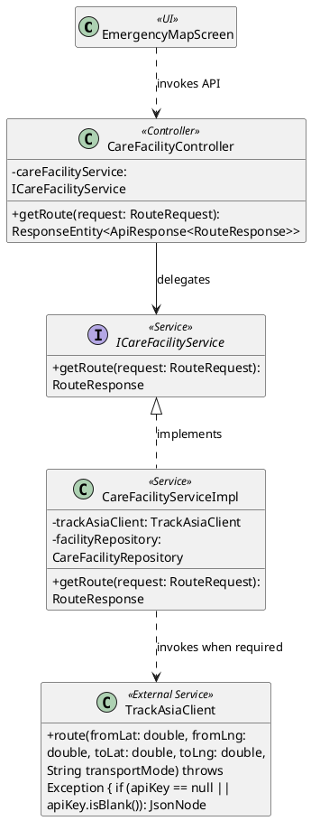
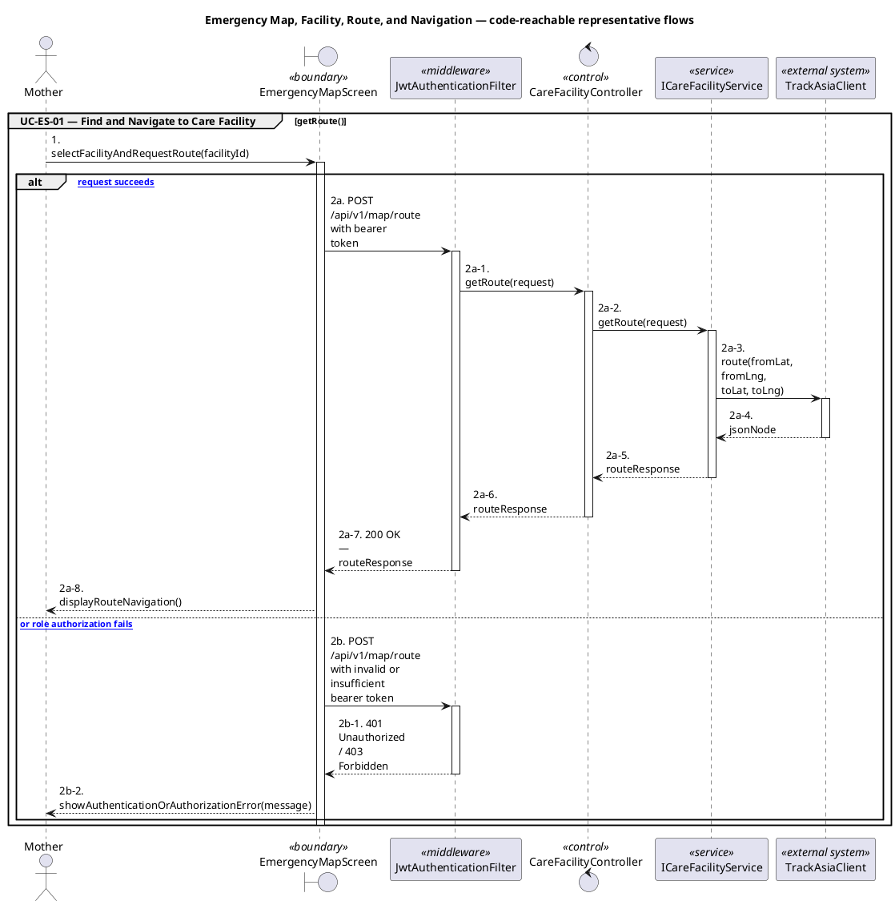
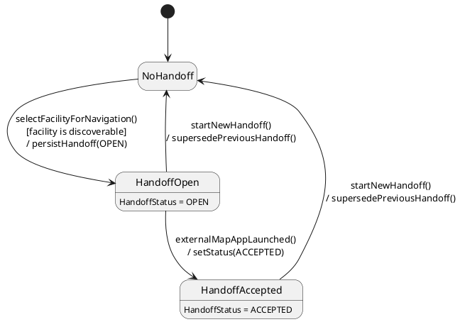

# MF-07 — Emergency Map, Facility, Route, and Navigation

| Field | Value |
| --- | --- |
| Major Feature | **MF-07 — Emergency Map & Nearby Care Support** |
| Function package | **Emergency Map, Facility, Route, and Navigation** |
| Code-first use cases | `UC-ES-01` |
| Status | **Draft** |
| Baseline | Current reachable code and tests, 2026-08-23 |
| Diagram convention | `../sequence-diagram-skill.md`; explicit lifeline order, numbered messages, balanced activation |

## 1. Tổng quan luồng chính

Design facility discovery and external map-navigation handoff.

- **UC-ES-01 — Find and Navigate to Care Facility:** Find nearby or listed eligible care facilities, inspect one, calculate a route, and hand off to external navigation when supported.

The code is authoritative for routes, handlers, delegation, authorization, and persisted state. Report1 section 6.2 is authoritative for the Major Feature name. Historical UC numbering and obsolete triage plans are not design inputs.

## 2. Function Design — Code Traceability

| UC | Actor goal | Method / route | Exact handler | Delegated function | Authorization | Source |
| --- | --- | --- | --- | --- | --- | --- |
| `UC-ES-01` | Find and Navigate to Care Facility | `POST /api/v1/map/emergency/handoff` | `EmergencyMapHandoffController.createHandoff()` | `IEmergencyMapHandoffService.createHandoff()` → `IIntakeSessionRepository.findByIdAndUserId()` | hasAnyRole('MOTHER', 'FAMILY') | `05_Development/CareBridgeAPI/src/main/java/com/carebridge/backend/emergency/controller/EmergencyMapHandoffController.java` |
| `UC-ES-01` | Find and Navigate to Care Facility | `GET /api/v1/map/facilities` | `CareFacilityController.getAllFacilities()` | `ICareFacilityService.getAllFacilities()` → `CareFacilityRepository.findByActiveTrueOrderByNameAsc()` | isAuthenticated() | `05_Development/CareBridgeAPI/src/main/java/com/carebridge/backend/map/controller/CareFacilityController.java` |
| `UC-ES-01` | Find and Navigate to Care Facility | `GET /api/v1/map/facilities/{id}` | `CareFacilityController.getFacility()` | `ICareFacilityService.getFacilityById()` → `CareFacilityRepository.findByFacilityIdAndActiveTrue()` | isAuthenticated() | `05_Development/CareBridgeAPI/src/main/java/com/carebridge/backend/map/controller/CareFacilityController.java` |
| `UC-ES-01` | Find and Navigate to Care Facility | `GET /api/v1/map/nearby-facilities` | `CareFacilityController.searchNearby()` | `ICareFacilityService.searchNearby()` → `TrackAsiaClient.searchNearby()` | hasAnyRole('MOTHER', 'FAMILY') | `05_Development/CareBridgeAPI/src/main/java/com/carebridge/backend/map/controller/CareFacilityController.java` |
| `UC-ES-01` | Find and Navigate to Care Facility | `POST /api/v1/map/route` | `CareFacilityController.getRoute()` | `ICareFacilityService.getRoute()` → `TrackAsiaClient.route()` | hasAnyRole('MOTHER', 'FAMILY') | `05_Development/CareBridgeAPI/src/main/java/com/carebridge/backend/map/controller/CareFacilityController.java` |

## 3. Class Diagram

This design-level UML follows the current source declarations: fields become attributes, reachable methods become operations, `implements` becomes realization, repository inheritance becomes generalization, and runtime-only calls remain dependencies. A missing layer or ownership relation is not invented.

**Figure 1 — Class Diagram: Emergency Map, Facility, Route, and Navigation**

## 4. Sequence Diagram — Main Flow

Each group is a representative reachable main flow. The full endpoint surface remains in the Function Design table above.

**Brief Explanation:**

1. The actor starts each grouped use case through the code-reachable UI boundary.
2. Protected requests pass through JwtAuthenticationFilter; rejected credentials or roles return 401 Unauthorized or 403 Forbidden without invoking the controller.
3. The controller receives the request and invokes the exact delegated operation resolved from the current source.
4. The service applies the business policy and coordinates downstream collaborators while its caller remains active.
5. Where the current implementation requires an external system, the service waits for its response before completing the domain result.
6. The HTTP response unwinds through middleware when present, and the UI renders the server-authoritative outcome to the actor.

## 5. State Chart Diagram

The lifecycle below belongs to **EmergencyMapHandoff.status, with the consumer-visible FacilityStatus as the discovery precondition**. Its states are the persisted constants declared in the sources cited under this diagram, and every transition, guard, and action is taken from the service method that writes that constant. No unreachable state is introduced.

**Figure 2 — State Chart Diagram: Emergency Map, Facility, Route, and Navigation**

**Brief Explanation:**

1. Facility discovery itself stores no per-user state; the lifecycle begins only when the user selects a facility and a handoff row is created.
2. `EmergencyMapHandoffMapper` creates the handoff in `OPEN`, recording the intent to navigate before any external application is involved.
3. `EmergencyMapHandoffServiceImpl` writes `ACCEPTED` when the external map application has actually been launched, which is the boundary where CareBridge stops controlling the route.
4. `FacilityStatus` is a catalogue-side attribute rather than a transition of this object; only a discoverable facility satisfies the guard on the first transition.
5. `HandoffStatus` also declares `COMPLETED` and `CANCELLED`, but no reachable code path writes either, so they are deliberately absent from this diagram rather than drawn as if implemented.
6. Starting a new handoff supersedes the previous one instead of mutating it, which keeps each navigation attempt individually auditable.

**State sources:**

- `05_Development/CareBridgeAPI/src/main/java/com/carebridge/backend/emergency/handoffstatus/HandoffStatus.java`
- `05_Development/CareBridgeAPI/src/main/java/com/carebridge/backend/map/mapper/EmergencyMapHandoffMapper.java`
- `05_Development/CareBridgeAPI/src/main/java/com/carebridge/backend/emergency/service/impl/EmergencyMapHandoffServiceImpl.java`
- `05_Development/CareBridgeAPI/src/main/java/com/carebridge/backend/map/facilitystatus/FacilityStatus.java`

## 6. Business Rules Applied

| UC | Enforced business/security rules | Known boundary or gap |
| --- | --- | --- |
| `UC-ES-01` | Location use is consent/permission gated. Map/provider failure must not report a false route or facility verification state. | No additional gap recorded in the code-first baseline. |

## 7. Partial / Excluded Boundaries

- No extra release boundary beyond the code-first UC catalogue is introduced by this package.

## 8. Code and Test Evidence

- `05_Development/CareBridgeAPI/src/main/java/com/carebridge/backend/map/controller/CareFacilityController.java`
- `05_Development/CareBridgeAPI/src/main/java/com/carebridge/backend/emergency/controller/EmergencyMapHandoffController.java`
- `05_Development/CareBridgeMobileApp/lib/features/emergency/screens/emergency_map_screen.dart`
- `05_Development/CareBridgeAPI/src/test/java/com/carebridge/backend/map/CareFacilityServiceImplTest.java`
- `05_Development/CareBridgeAPI/src/test/java/com/carebridge/backend/emergency/EmergencyMapHandoffServiceImplTest.java`
- `05_Development/CareBridgeMobileApp/test/features/emergency/emergency_map_screen_test.dart`
- `05_Development/CareBridgeMobileApp/test/features/emergency/trackasia_web_contract_test.dart`
