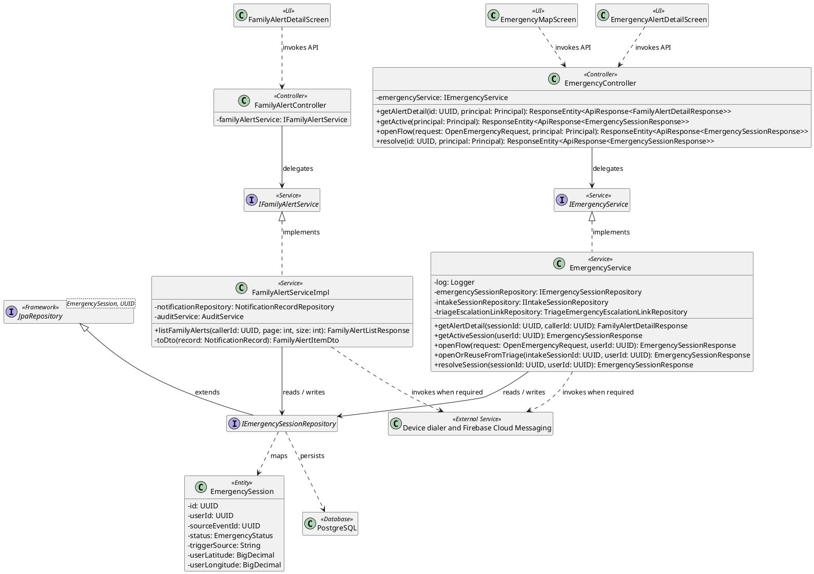
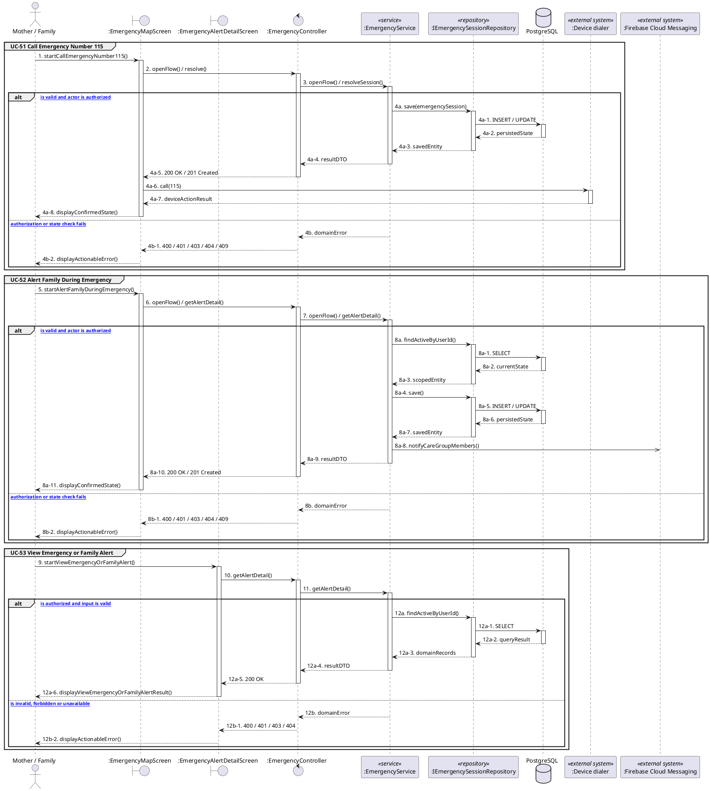

# MF-07 / Spec 02 — Emergency Call and Family Alert

| Field | Value |
| --- | --- |
| Status | Draft |
| Use Cases Covered | UC-51 Call Emergency Number 115; UC-52 Alert Family During Emergency; UC-53 View Emergency or Family Alert |
| Use Case Group | Mobile App |
| Platform | Mother and Family Mobile; Backend; Device Services |
| Primary Actors | Mother / Family |
| In Scope | CareBridge does not dispatch help or guarantee delivery |
| Explicitly Excluded | Automatic ambulance dispatch |
| Implementation Trace | UI: EmergencyMapScreen, EmergencyAlertDetailScreen, FamilyAlertDetailScreen; Controller: EmergencyController, FamilyAlertController; Service: EmergencyService, FamilyAlertServiceImpl; Repository: IEmergencySessionRepository; Entity: EmergencySession |

## 1. Tổng quan luồng chính (Main Flow Overview)

CareBridge does not dispatch help or guarantee delivery. The flow starts only from the reachable UI or system trigger named in the metadata. The Backend rechecks authentication, role, ownership, membership, consent and current state as applicable; client-side visibility alone never grants access. A confirmed mutation is persisted before the UI displays success. External-service failure returns a safe retry state and must not fabricate completion.

## 2. Class Diagram

**Figure 1 — Class Diagram: Emergency Call and Family Alert**

## 3. Sequence Diagram — Main Flow

**Figure 2 — Sequence Diagram: Emergency Call and Family Alert Main Flow**

**Brief Explanation:**

1. The diagram separates the implemented goals covered by this specification: UC-51 Call Emergency Number 115; UC-52 Alert Family During Emergency; UC-53 View Emergency or Family Alert.
2. Each actor action enters through the reachable mobile or web boundary and invokes the exact controller operation exposed by the current Backend.
3. The controller delegates to the mapped service operation; read branches query scoped records, while mutation branches load the current state before persisting the requested transition.
4. Repository calls and PostgreSQL responses are shown explicitly, including call-stack activation and dashed return messages.
5. Invalid, unauthorized, missing or conflicting requests return an actionable error without displaying a false success state.
6. External systems are invoked only for the mapped use cases; notification dispatches are asynchronous, while integrations that return data remain synchronous.

## 4. Business Rules Applied

- Access is enforced server-side using the current actor, role, ownership, membership and consent scope.
- CareBridge does not dispatch help or guarantee delivery.
- The following remains outside this contract: Automatic ambulance dispatch.
- Retries must not duplicate confirmed records, transitions, notifications or external side effects.
- Sensitive health, identity, moderation, location and safety operations retain the minimum required audit evidence.
