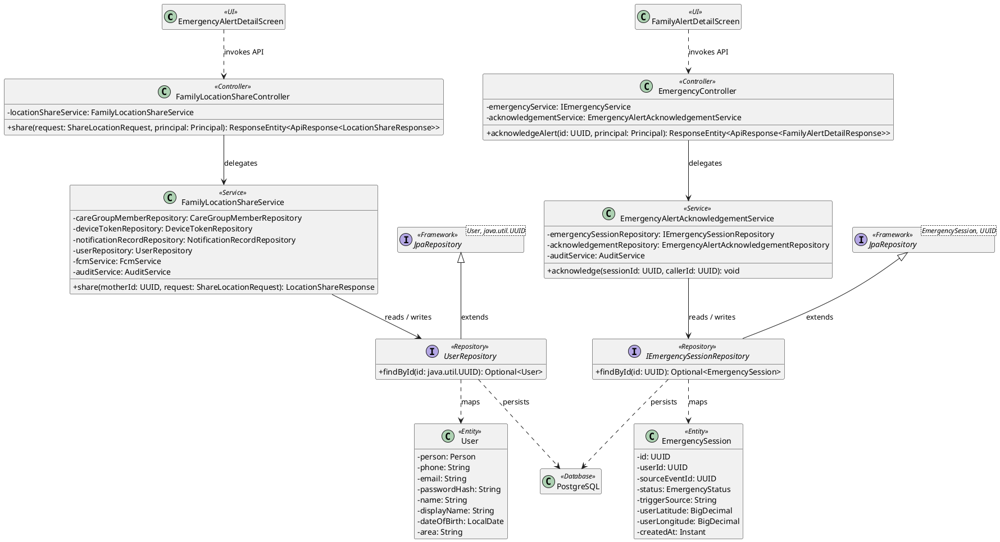
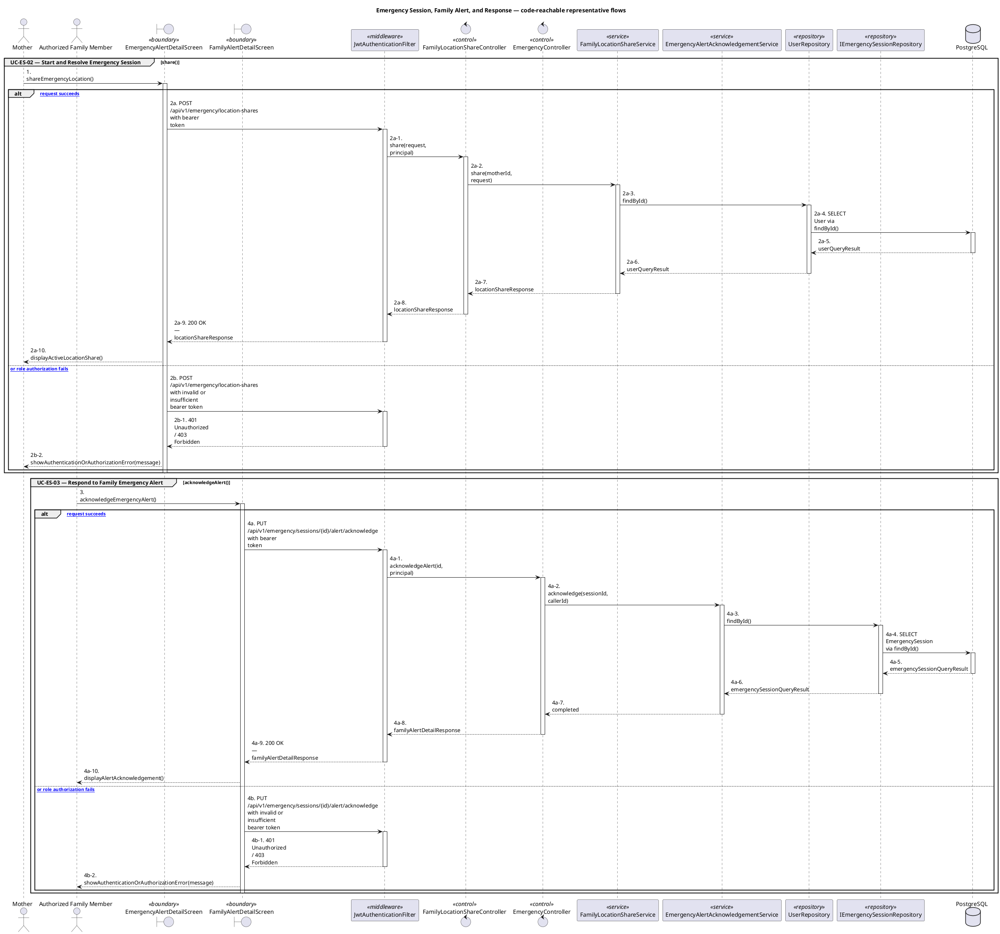
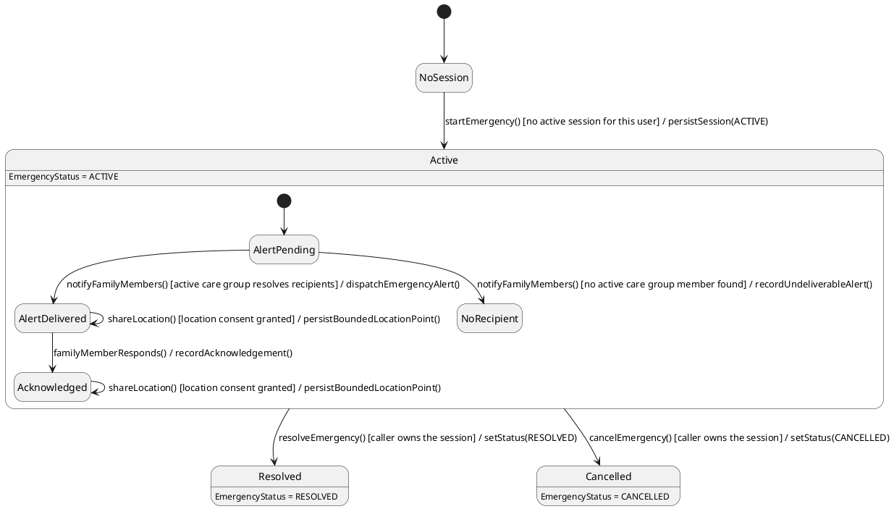

# MF-07 — Emergency Session, Family Alert, and Response

| Field | Value |
| --- | --- |
| Major Feature | **MF-07 — Emergency Map & Nearby Care Support** |
| Function package | **Emergency Session, Family Alert, and Response** |
| Code-first use cases | `UC-ES-02, UC-ES-03` |
| Status | **Draft** |
| Baseline | Current reachable code and tests, 2026-08-23 |
| Diagram convention | `../sequence-diagram-skill.md`; explicit lifeline order, numbered messages, balanced activation |

## 1. Tổng quan luồng chính

Design emergency-session state, bounded location share, and family acknowledgement.

- **UC-ES-02 — Start and Resolve Emergency Session:** Open an emergency session, share permitted location/alert context with family, view the active session, and resolve it when the incident ends.
- **UC-ES-03 — Respond to Family Emergency Alert:** Open a family alert, acknowledge it, contact the mother, or navigate toward the shared emergency location.

The code is authoritative for routes, handlers, delegation, authorization, and persisted state. Report1 section 6.2 is authoritative for the Major Feature name. Historical UC numbering and obsolete triage plans are not design inputs.

## 2. Function Design — Code Traceability

| UC | Actor goal | Method / route | Exact handler | Delegated function | Authorization | Source |
| --- | --- | --- | --- | --- | --- | --- |
| `UC-ES-02` | Start and Resolve Emergency Session | `POST /api/v1/emergency/location-shares` | `FamilyLocationShareController.share()` | `FamilyLocationShareService.share()` → `UserRepository.findById()` | hasRole('MOTHER') | `05_Development/CareBridgeAPI/src/main/java/com/carebridge/backend/emergency/controller/FamilyLocationShareController.java` |
| `UC-ES-02` | Start and Resolve Emergency Session | `POST /api/v1/emergency/sessions` | `EmergencyController.openFlow()` | `IEmergencyService.openFlow()` → `IEmergencySessionRepository.acquireUserLock()` | hasAnyRole('MOTHER', 'FAMILY') | `05_Development/CareBridgeAPI/src/main/java/com/carebridge/backend/emergency/controller/EmergencyController.java` |
| `UC-ES-02` | Start and Resolve Emergency Session | `GET /api/v1/emergency/sessions/active` | `EmergencyController.getActive()` | `IEmergencyService.getActiveSession()` → `IEmergencySessionRepository.findActiveByUserId()` | hasAnyRole('MOTHER', 'FAMILY') | `05_Development/CareBridgeAPI/src/main/java/com/carebridge/backend/emergency/controller/EmergencyController.java` |
| `UC-ES-02` | Start and Resolve Emergency Session | `PATCH /api/v1/emergency/sessions/{id}/resolve` | `EmergencyController.resolve()` | `IEmergencyService.resolveSession()` → `IEmergencySessionRepository.acquireUserLock()` | hasAnyRole('MOTHER', 'FAMILY') | `05_Development/CareBridgeAPI/src/main/java/com/carebridge/backend/emergency/controller/EmergencyController.java` |
| `UC-ES-03` | Respond to Family Emergency Alert | `GET /api/v1/emergency/sessions/{id}/alert` | `EmergencyController.getAlertDetail()` | `IEmergencyService.getAlertDetail()` → `IEmergencySessionRepository.findById()` | hasAnyRole('MOTHER', 'FAMILY') | `05_Development/CareBridgeAPI/src/main/java/com/carebridge/backend/emergency/controller/EmergencyController.java` |
| `UC-ES-03` | Respond to Family Emergency Alert | `PUT /api/v1/emergency/sessions/{id}/alert/acknowledge` | `EmergencyController.acknowledgeAlert()` | `EmergencyAlertAcknowledgementService.acknowledge()` → `IEmergencySessionRepository.findById()` | hasAnyRole('MOTHER', 'FAMILY') | `05_Development/CareBridgeAPI/src/main/java/com/carebridge/backend/emergency/controller/EmergencyController.java` |
| `UC-ES-03` | Respond to Family Emergency Alert | `GET /api/v1/family-alerts` | `FamilyAlertController.listFamilyAlerts()` | `IFamilyAlertService.listFamilyAlerts()` | isAuthenticated() | `05_Development/CareBridgeAPI/src/main/java/com/carebridge/backend/family/controller/FamilyAlertController.java` |

## 3. Class Diagram

This design-level UML follows the current source declarations: fields become attributes, reachable methods become operations, `implements` becomes realization, repository inheritance becomes generalization, and runtime-only calls remain dependencies. A missing layer or ownership relation is not invented.

**Figure 1 — Class Diagram: Emergency Session, Family Alert, and Response**

## 4. Sequence Diagram — Main Flow

Each group is a representative reachable main flow. The full endpoint surface remains in the Function Design table above.

**Brief Explanation:**

1. The actor starts each grouped use case through the code-reachable UI boundary.
2. Protected requests pass through JwtAuthenticationFilter; rejected credentials or roles return 401 Unauthorized or 403 Forbidden without invoking the controller.
3. The controller receives the request and invokes the exact delegated operation resolved from the current source.
4. The service applies the business policy and coordinates downstream collaborators while its caller remains active.
5. The repository executes the represented persistence operation and returns the stored or queried result before its activation ends.
6. The HTTP response unwinds through middleware when present, and the UI renders the server-authoritative outcome to the actor.

## 5. State Chart Diagram

The lifecycle below belongs to **EmergencySession.status, with the family alert and acknowledgement nested inside an active session**. Its states are the persisted constants declared in the sources cited under this diagram, and every transition, guard, and action is taken from the service method that writes that constant. No unreachable state is introduced.

**Figure 2 — State Chart Diagram: Emergency Session, Family Alert, and Response**

**Brief Explanation:**

1. A session starts in `ACTIVE` and `EmergencyService` guards creation so a single user cannot hold two concurrent active emergencies.
2. Both terminal transitions are owner-guarded, and neither is automatic — an emergency is never silently closed by the system.
3. Inside `Active`, recipients are resolved through the mother's `ACTIVE` care groups, so alert delivery depends on live membership rather than a stored recipient list.
4. `NoRecipient` is modelled explicitly because an undeliverable alert must remain visible rather than being presented as a delivered one.
5. Family acknowledgement moves the alert to `Acknowledged` but does not resolve the session — only the owner can close it, so an acknowledgement never suppresses escalation.
6. Location sharing is a guarded self-transition available in both alert states: each point is written only while location consent holds, and the share stays bounded to the session.

**State sources:**

- `05_Development/CareBridgeAPI/src/main/java/com/carebridge/backend/emergency/EmergencyStatus.java`
- `05_Development/CareBridgeAPI/src/main/java/com/carebridge/backend/emergency/service/impl/EmergencyService.java`
- `05_Development/CareBridgeAPI/src/main/java/com/carebridge/backend/emergency/adapter/FamilyMemberPortAdapter.java`
- `05_Development/CareBridgeAPI/src/main/java/com/carebridge/backend/consent/entity/ConsentGrant.java`

## 6. Business Rules Applied

| UC | Enforced business/security rules | Known boundary or gap |
| --- | --- | --- |
| `UC-ES-02` | Emergency session state is canonical; delivery retries cannot create duplicate active incidents. Location sharing is consent gated and is a subflow, not a separate UC. | No additional gap recorded in the code-first baseline. |
| `UC-ES-03` | Family authorization and active-session state are rechecked. Acknowledgement does not resolve the mother's emergency session. | No additional gap recorded in the code-first baseline. |

## 7. Partial / Excluded Boundaries

- No extra release boundary beyond the code-first UC catalogue is introduced by this package.

## 8. Code and Test Evidence

- `05_Development/CareBridgeAPI/src/main/java/com/carebridge/backend/emergency/controller/EmergencyController.java`
- `05_Development/CareBridgeAPI/src/main/java/com/carebridge/backend/emergency/controller/FamilyLocationShareController.java`
- `05_Development/CareBridgeMobileApp/lib/features/emergency/screens/emergency_alert_detail_screen.dart`
- `05_Development/CareBridgeAPI/src/test/java/com/carebridge/backend/emergency/EmergencyControllerTest.java`
- `05_Development/CareBridgeAPI/src/test/java/com/carebridge/backend/emergency/EmergencyServiceTest.java`
- `05_Development/CareBridgeAPI/src/test/java/com/carebridge/backend/emergency/EmergencySessionOpenedHandlerTest.java`
- `05_Development/CareBridgeAPI/src/test/java/com/carebridge/backend/emergency/FamilyLocationShareServiceTest.java`
- `05_Development/CareBridgeAPI/src/main/java/com/carebridge/backend/family/controller/FamilyAlertController.java`
- `05_Development/CareBridgeMobileApp/lib/features/emergency/screens/family_alert_detail_screen.dart`
- `05_Development/CareBridgeAPI/src/test/java/com/carebridge/backend/emergency/EmergencyAlertAcknowledgementServiceTest.java`
- `05_Development/CareBridgeAPI/src/test/java/com/carebridge/backend/emergency/FamilyAlertServiceTest.java`
- `05_Development/CareBridgeMobileApp/test/features/emergency/family_alert_detail_screen_test.dart`
