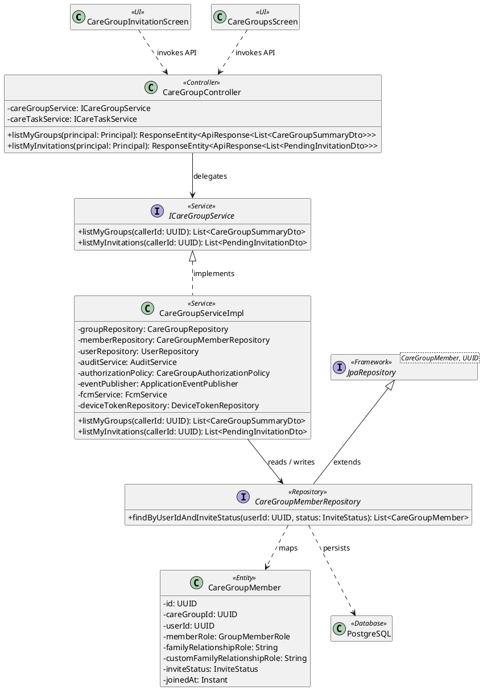
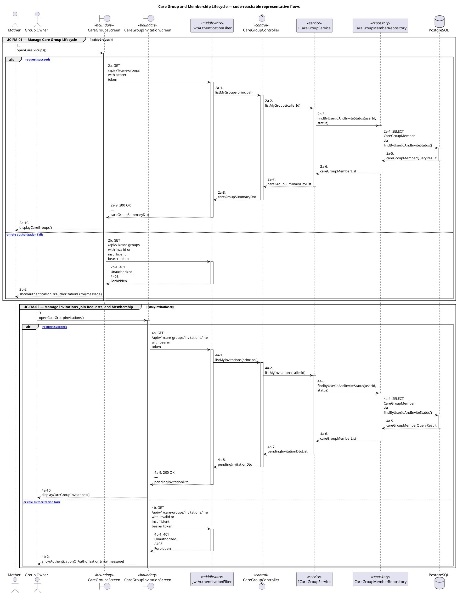
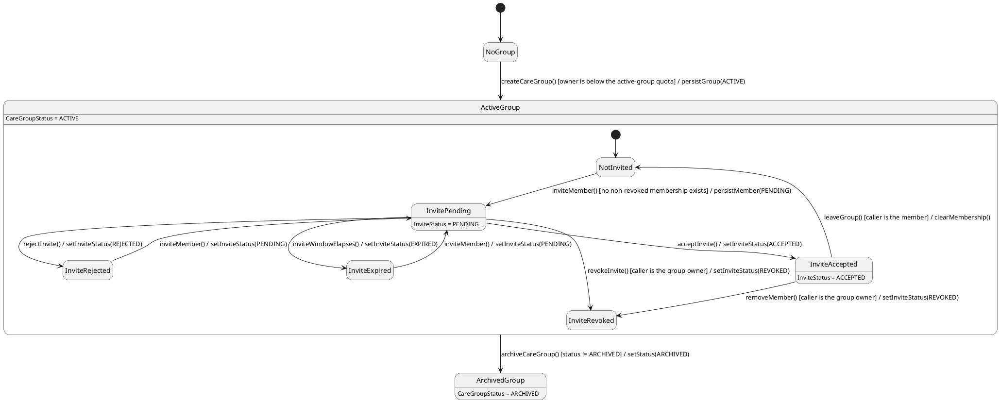

# MF-08 — Care Group and Membership Lifecycle

| Field | Value |
| --- | --- |
| Major Feature | **MF-08 — Family Sync & Cooperative Care** |
| Function package | **Care Group and Membership Lifecycle** |
| Code-first use cases | `UC-FM-01, UC-FM-02` |
| Status | **Draft** |
| Baseline | Current reachable code and tests, 2026-08-23 |
| Diagram convention | `../sequence-diagram-skill.md`; explicit lifeline order, numbered messages, balanced activation |

## 1. Tổng quan luồng chính

Design group ownership, invitation, join, leave, and membership state.

- **UC-FM-01 — Manage Care Group Lifecycle:** Create, list, leave, delete when eligible, and relink the journey associated with a care group.
- **UC-FM-02 — Manage Invitations, Join Requests, and Membership:** Invite a member, accept/decline/revoke an invitation, request to join, approve/reject a request, or remove an eligible member.

The code is authoritative for routes, handlers, delegation, authorization, and persisted state. Report1 section 6.2 is authoritative for the Major Feature name. Historical UC numbering and obsolete triage plans are not design inputs.

## 2. Function Design — Code Traceability

| UC | Actor goal | Method / route | Exact handler | Delegated function | Authorization | Source |
| --- | --- | --- | --- | --- | --- | --- |
| `UC-FM-01` | Manage Care Group Lifecycle | `GET /api/v1/care-groups` | `CareGroupController.listMyGroups()` | `ICareGroupService.listMyGroups()` → `CareGroupMemberRepository.findByUserIdAndInviteStatus()` | isAuthenticated() | `05_Development/CareBridgeAPI/src/main/java/com/carebridge/backend/family/controller/CareGroupController.java` |
| `UC-FM-01` | Manage Care Group Lifecycle | `POST /api/v1/care-groups` | `CareGroupController.createCareGroup()` | `ICareGroupService.createCareGroup()` → `CareGroupRepository.countByOwnerUserIdAndStatus()` | hasRole('MOTHER') | `05_Development/CareBridgeAPI/src/main/java/com/carebridge/backend/family/controller/CareGroupController.java` |
| `UC-FM-01` | Manage Care Group Lifecycle | `DELETE /api/v1/care-groups/{groupId}` | `CareGroupController.deleteCareGroup()` | `ICareGroupService.deleteCareGroup()` → `CareGroupRepository.findById()` | hasRole('MOTHER') | `05_Development/CareBridgeAPI/src/main/java/com/carebridge/backend/family/controller/CareGroupController.java` |
| `UC-FM-01` | Manage Care Group Lifecycle | `PATCH /api/v1/care-groups/{groupId}/journey` | `CareGroupController.relinkJourney()` | `ICareGroupService.relinkJourney()` → `CareGroupRepository.findByIdAndOwnerUserIdForUpdate()` | hasRole('MOTHER') | `05_Development/CareBridgeAPI/src/main/java/com/carebridge/backend/family/controller/CareGroupController.java` |
| `UC-FM-01` | Manage Care Group Lifecycle | `POST /api/v1/care-groups/{groupId}/leave` | `CareGroupController.leaveCareGroup()` | `ICareGroupService.leaveCareGroup()` → `CareGroupRepository.findById()` | isAuthenticated() | `05_Development/CareBridgeAPI/src/main/java/com/carebridge/backend/family/controller/CareGroupController.java` |
| `UC-FM-02` | Manage Invitations, Join Requests, and Membership | `GET /api/v1/care-groups/invitations/me` | `CareGroupController.listMyInvitations()` | `ICareGroupService.listMyInvitations()` → `CareGroupMemberRepository.findByUserIdAndInviteStatus()` | isAuthenticated() | `05_Development/CareBridgeAPI/src/main/java/com/carebridge/backend/family/controller/CareGroupController.java` |
| `UC-FM-02` | Manage Invitations, Join Requests, and Membership | `POST /api/v1/care-groups/invitations/{token}/accept` | `CareGroupController.acceptInvitationByToken()` | `ICareGroupService.acceptInvitationByToken()` → `CareGroupMemberRepository.findByInviteToken()` | isAuthenticated() | `05_Development/CareBridgeAPI/src/main/java/com/carebridge/backend/family/controller/CareGroupController.java` |
| `UC-FM-02` | Manage Invitations, Join Requests, and Membership | `POST /api/v1/care-groups/join` | `CareGroupController.joinGroupByCode()` | `ICareGroupService.joinGroupByCode()` → `CareGroupRepository.findById()` | isAuthenticated() | `05_Development/CareBridgeAPI/src/main/java/com/carebridge/backend/family/controller/CareGroupController.java` |
| `UC-FM-02` | Manage Invitations, Join Requests, and Membership | `POST /api/v1/care-groups/{groupId}/invitations` | `CareGroupController.inviteFamilyMember()` | `ICareGroupService.inviteFamilyMember()` → `CareGroupRepository.findById()` | hasRole('MOTHER') | `05_Development/CareBridgeAPI/src/main/java/com/carebridge/backend/family/controller/CareGroupController.java` |
| `UC-FM-02` | Manage Invitations, Join Requests, and Membership | `POST /api/v1/care-groups/{groupId}/invitations/accept` | `CareGroupController.acceptInvite()` | `ICareGroupService.acceptInvite()` → `CareGroupMemberRepository.save()` | isAuthenticated() | `05_Development/CareBridgeAPI/src/main/java/com/carebridge/backend/family/controller/CareGroupController.java` |
| `UC-FM-02` | Manage Invitations, Join Requests, and Membership | `POST /api/v1/care-groups/{groupId}/invitations/decline` | `CareGroupController.declineInvite()` | `ICareGroupService.declineInvite()` → `CareGroupMemberRepository.save()` | isAuthenticated() | `05_Development/CareBridgeAPI/src/main/java/com/carebridge/backend/family/controller/CareGroupController.java` |
| `UC-FM-02` | Manage Invitations, Join Requests, and Membership | `POST /api/v1/care-groups/{groupId}/invitations/{targetUserId}/revoke` | `CareGroupController.revokeInvitation()` | `ICareGroupService.revokeInvitation()` → `CareGroupRepository.findById()` | hasRole('MOTHER') | `05_Development/CareBridgeAPI/src/main/java/com/carebridge/backend/family/controller/CareGroupController.java` |
| `UC-FM-02` | Manage Invitations, Join Requests, and Membership | `GET /api/v1/care-groups/{groupId}/join-requests` | `CareGroupController.listJoinRequests()` | `ICareGroupService.listJoinRequests()` → `CareGroupRepository.findById()` | hasRole('MOTHER') | `05_Development/CareBridgeAPI/src/main/java/com/carebridge/backend/family/controller/CareGroupController.java` |
| `UC-FM-02` | Manage Invitations, Join Requests, and Membership | `POST /api/v1/care-groups/{groupId}/join-requests/{memberId}/respond` | `CareGroupController.respondJoinRequest()` | `ICareGroupService.respondJoinRequest()` → `CareGroupRepository.findById()` | hasRole('MOTHER') | `05_Development/CareBridgeAPI/src/main/java/com/carebridge/backend/family/controller/CareGroupController.java` |
| `UC-FM-02` | Manage Invitations, Join Requests, and Membership | `GET /api/v1/care-groups/{groupId}/members` | `CareGroupController.listMembers()` | `ICareGroupService.listMembers()` → `CareGroupRepository.findById()` | isAuthenticated() | `05_Development/CareBridgeAPI/src/main/java/com/carebridge/backend/family/controller/CareGroupController.java` |
| `UC-FM-02` | Manage Invitations, Join Requests, and Membership | `DELETE /api/v1/care-groups/{groupId}/members/{targetUserId}` | `CareGroupController.removeMember()` | `ICareGroupService.removeMember()` → `CareGroupRepository.findById()` | hasRole('MOTHER') | `05_Development/CareBridgeAPI/src/main/java/com/carebridge/backend/family/controller/CareGroupController.java` |

## 3. Class Diagram

This design-level UML follows the current source declarations: fields become attributes, reachable methods become operations, `implements` becomes realization, repository inheritance becomes generalization, and runtime-only calls remain dependencies. A missing layer or ownership relation is not invented.

**Figure 1 — Class Diagram: Care Group and Membership Lifecycle**

## 4. Sequence Diagram — Main Flow

Each group is a representative reachable main flow. The full endpoint surface remains in the Function Design table above.

**Brief Explanation:**

1. The actor starts each grouped use case through the code-reachable UI boundary.
2. Protected requests pass through JwtAuthenticationFilter; rejected credentials or roles return 401 Unauthorized or 403 Forbidden without invoking the controller.
3. The controller receives the request and invokes the exact delegated operation resolved from the current source.
4. The service applies the business policy and coordinates downstream collaborators while its caller remains active.
5. The repository executes the represented persistence operation and returns the stored or queried result before its activation ends.
6. The HTTP response unwinds through middleware when present, and the UI renders the server-authoritative outcome to the actor.

## 5. State Chart Diagram

The lifecycle below belongs to **CareGroup.status, with CareGroupMember.inviteStatus nested inside an active group**. Its states are the persisted constants declared in the sources cited under this diagram, and every transition, guard, and action is taken from the service method that writes that constant. No unreachable state is introduced.

**Figure 2 — State Chart Diagram: Care Group and Membership Lifecycle**

**Brief Explanation:**

1. A group is created in `ACTIVE`, and `CareGroupServiceImpl` guards creation against the owner's active-group quota.
2. `ACTIVE` is a live precondition rather than a one-time check: quick notes, dashboards, appointments, and baby access all re-verify it before serving data.
3. Archiving is one-way — no reachable transition returns an archived group to `ACTIVE`.
4. Inside the group, `inviteMember()` is guarded so an existing non-revoked membership is re-used instead of creating a duplicate row.
5. `ACCEPTED` is the only membership state that grants shared access, which is why every consuming policy filters on it specifically rather than on membership existence.
6. A rejected or expired invite can be re-issued back to `PENDING`, while `REVOKED` is the owner's terminal removal and `leaveGroup()` is the member's own exit.

**State sources:**

- `05_Development/CareBridgeAPI/src/main/java/com/carebridge/backend/family/entity/CareGroupStatus.java`
- `05_Development/CareBridgeAPI/src/main/java/com/carebridge/backend/family/entity/InviteStatus.java`
- `05_Development/CareBridgeAPI/src/main/java/com/carebridge/backend/family/service/impl/CareGroupServiceImpl.java`
- `05_Development/CareBridgeAPI/src/main/java/com/carebridge/backend/family/repository/CareGroupMemberRepository.java`

## 6. Business Rules Applied

| UC | Enforced business/security rules | Known boundary or gap |
| --- | --- | --- |
| `UC-FM-01` | Group ownership/membership and journey compatibility are server authoritative. Delete/leave/relink have distinct guarded effects. | No additional gap recorded in the code-first baseline. |
| `UC-FM-02` | Invitation/join-request states, expiry, uniqueness, and actor authority are server authoritative. A token or UI state cannot bypass membership policy. | No additional gap recorded in the code-first baseline. |

## 7. Partial / Excluded Boundaries

- No extra release boundary beyond the code-first UC catalogue is introduced by this package.

## 8. Code and Test Evidence

- `05_Development/CareBridgeAPI/src/main/java/com/carebridge/backend/family/controller/CareGroupController.java`
- `05_Development/CareBridgeMobileApp/lib/features/familySync/screens/care_groups_screen.dart`
- `05_Development/CareBridgeMobileApp/lib/features/familySync/screens/my_care_groups_screen.dart`
- `05_Development/CareBridgeAPI/src/test/java/com/carebridge/backend/family/CareGroupServiceImplTest.java`
- `05_Development/CareBridgeAPI/src/test/java/com/carebridge/backend/family/service/CareGroupJourneyRelinkServiceTest.java`
- `05_Development/CareBridgeMobileApp/test/features/familySync/mother_care_group_ui_test.dart`
- `05_Development/CareBridgeMobileApp/lib/features/familySync/screens/care_group_invitation_screen.dart`
- `05_Development/CareBridgeMobileApp/lib/features/familySync/screens/care_group_members_screen.dart`
- `05_Development/CareBridgeAPI/src/test/java/com/carebridge/backend/family/CareGroupInviteIntegrationTest.java`
- `05_Development/CareBridgeAPI/src/test/java/com/carebridge/backend/family/service/CareGroupServiceImplMembershipLifecycleTest.java`
- `05_Development/CareBridgeMobileApp/test/features/familySync/care_group_invitation_screen_test.dart`
