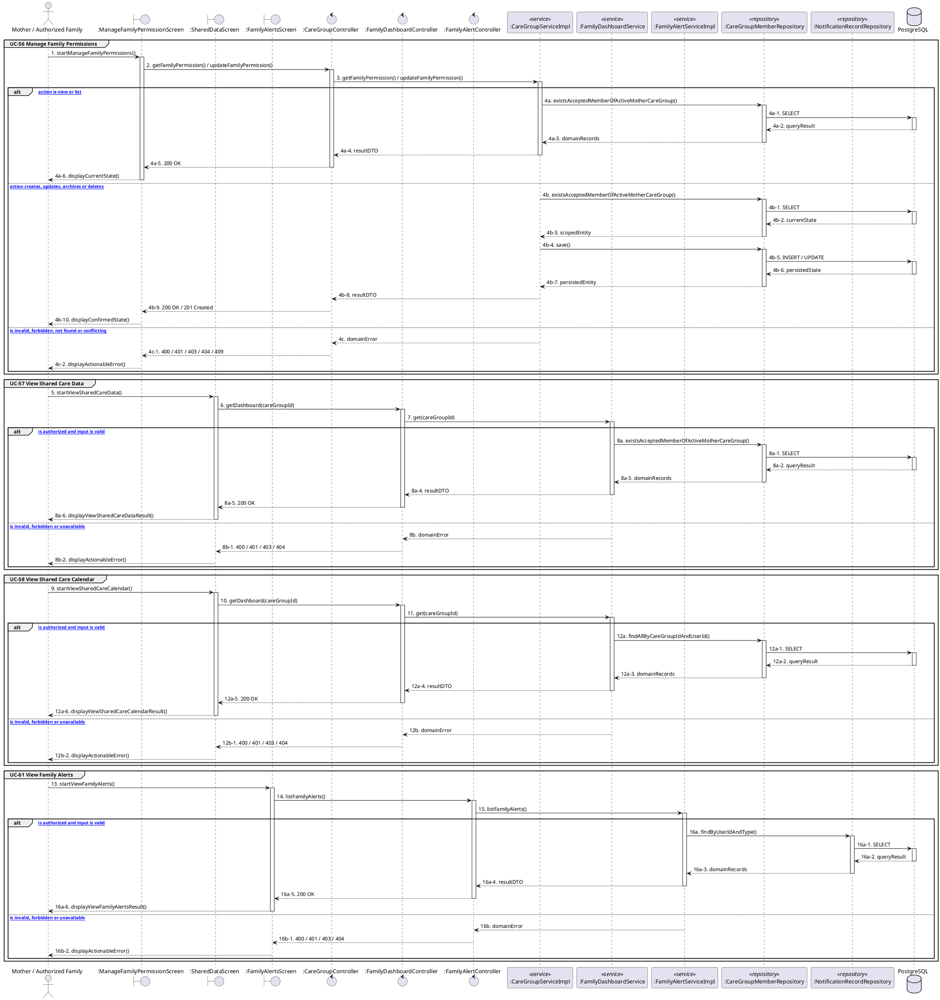

# MF-08 / Spec 02 — Family Permissions and Shared Care Visibility

| Field | Value |
| --- | --- |
| Status | Draft |
| Use Cases Covered | UC-56 Manage Family Permissions; UC-57 View Shared Care Data; UC-58 View Shared Care Calendar; UC-61 View Family Alerts |
| Use Case Group | Mobile App |
| Platform | Mother and Family Mobile; Backend |
| Primary Actors | Mother / Authorized Family |
| In Scope | Every read rechecks active membership and the exact permission flag; EPDS answers are never exposed |
| Explicitly Excluded | Full-record access by role alone |
| Implementation Trace | UI: ManageFamilyPermissionScreen, SharedDataScreen, FamilyQuickNoteHistoryScreen, FamilyAlertsScreen; Controller: CareGroupController, FamilyQuickNoteController, FamilyAlertController; Service: FamilyDashboardService, FamilyQuickNoteService, FamilyAlertServiceImpl; Repository: CareGroupMemberRepository, MaternalHealthMetricRepository; Entity: CareGroupMember, MaternalHealthMetric |

## 1. Tổng quan luồng chính (Main Flow Overview)

Every read rechecks active membership and the exact permission flag; EPDS answers are never exposed. The flow starts only from the reachable UI or system trigger named in the metadata. The Backend rechecks authentication, role, ownership, membership, consent and current state as applicable; client-side visibility alone never grants access. A confirmed mutation is persisted before the UI displays success. External-service failure returns a safe retry state and must not fabricate completion.

## 2. Class Diagram

```plantuml
@startuml MF08_02_FamilyPermissionsandSharedCareVisibility_ClassDiagram
skinparam classAttributeIconSize 0
hide empty members

class "ManageFamilyPermissionScreen" as UI1 <<UI>>
class "SharedDataScreen" as UI2 <<UI>>
class "FamilyQuickNoteHistoryScreen" as UI3 <<UI>>
class "FamilyAlertsScreen" as UI4 <<UI>>
class "CareGroupController" as Controller1 <<Controller>> {
  - careGroupService: ICareGroupService
  - careTaskService: ICareTaskService
  + createCareGroup(request: CreateCareGroupRequest, principal: Principal): ResponseEntity<ApiResponse<CreateCareGroupResponse>>
  + deleteCareGroup(groupId: UUID, principal: Principal): ResponseEntity<ApiResponse<Void>>
  + getFamilyPermission(groupId: UUID, memberId: UUID, principal: Principal): ResponseEntity<ApiResponse<FamilyPermissionResponse>>
  + leaveCareGroup(groupId: UUID, principal: Principal): ResponseEntity<ApiResponse<LeaveCareGroupResponse>>
  + updateFamilyPermission(groupId: UUID, memberId: UUID, request: UpdateFamilyPermissionRequest, ...): ResponseEntity<ApiResponse<FamilyPermissionResponse>>
  + inviteFamilyMember(groupId: UUID, request: InviteFamilyMemberRequest, principal: Principal): ResponseEntity<ApiResponse<InviteFamilyMemberResponse>>
  + joinGroupByCode(request: JoinCareGroupRequest, principal: Principal): ResponseEntity<ApiResponse<CareGroupSummaryDto>>
}
class "FamilyQuickNoteController" as Controller2 <<Controller>> {
  - quickNoteService: FamilyQuickNoteService
}
class "FamilyAlertController" as Controller3 <<Controller>> {
  - familyAlertService: IFamilyAlertService
}
class "FamilyDashboardService" as Service1 <<Service>> {
  - memberRepository: CareGroupMemberRepository
  - notificationRepository: NotificationRecordRepository
  - entityManager: EntityManager
  - authorizationPolicy: CareGroupAuthorizationPolicy
  - permissionScope(groupId: UUID, userId: UUID): FamilyDashboardResponse.Permission
  - groupContextComparator(): Comparator<GroupContext>
  - hasActiveLinkedContext(group: CareGroup, reminder: Reminder): boolean
  - isActive(task: CareTask): boolean
  - loadGroupContext(membership: CareGroupMember, userId: UUID, now: Instant): GroupContext
}
class "FamilyQuickNoteService" as Service2 <<Service>> {
  - groupRepository: CareGroupRepository
  - authorizationPolicy: CareGroupAuthorizationPolicy
  - journeyRepository: MotherJourneyRepository
  - observationRepository: HealthObservationRepository
  - isAllowedContextValue(metricType: MetricType, key: String, value: Object): boolean
  - requireQuickNotePermission(groupId: UUID, callerId: UUID, metricType: MetricType): void
  - toReadOnlyPoint(metric: HealthObservation, metricType: MetricType): MetricDataPoint
  + getHistory(careGroupId: UUID, callerId: UUID, metricType: MetricType, ...): MetricTrendResponse
  - canonicalMetricCode(metricType: MetricType): String
}
class "FamilyAlertServiceImpl" as Service3 <<Service>> {
  - notificationRepository: NotificationRecordRepository
  - auditService: AuditService
  + listFamilyAlerts(callerId: UUID, page: int, size: int): FamilyAlertListResponse
  - toDto(record: NotificationRecord): FamilyAlertItemDto
}
interface "IFamilyAlertService" as Service3Contract <<Service>>
interface "CareGroupMemberRepository" as Repository1 {
  + existsByCareGroupIdAndUserIdAndInviteStatus(careGroupId: UUID, userId: UUID, status: InviteStatus): boolean
  + findByCareGroupIdAndInviteStatusIn(careGroupId: UUID, statuses: List<InviteStatus>): List<CareGroupMember>
  + countByCareGroupId(careGroupId: UUID): long
  + deleteByCareGroupId(careGroupId: UUID): void
  + findAllByCareGroupIdAndUserId(careGroupId: UUID, userId: UUID): List<CareGroupMember>
  + findFirstByCareGroupIdAndUserIdAndInviteStatus(careGroupId: UUID, userId: UUID, inviteStatus: InviteStatus): Optional<CareGroupMember>
}
interface "MaternalHealthMetricRepository" as Repository2
class "CareGroupMember" as Entity1 <<Entity>> {
  - id: UUID
  - careGroupId: UUID
  - userId: UUID
  - memberRole: GroupMemberRole
  - familyRelationshipRole: String
  - customFamilyRelationshipRole: String
  - inviteStatus: InviteStatus
}
class "MaternalHealthMetric" as Entity2 <<Entity>> {
  - id: UUID
  - journeyId: UUID
  - careSubjectId: UUID
  - metricType: MetricType
  - valueNumeric: BigDecimal
  - valueSecondary: BigDecimal
  - unit: String
}
interface "JpaRepository<CareGroupMember, UUID>" as Repository1Base <<Framework>>
interface "JpaRepository<MaternalHealthMetric, UUID>" as Repository2Base <<Framework>>
class "PostgreSQL" as DB <<Database>>

Service3Contract <|.. Service3 : implements
Repository1Base <|-- Repository1 : extends
Repository2Base <|-- Repository2 : extends
UI1 ..> Controller1 : invokes API
UI2 ..> Controller2 : invokes API
UI3 ..> Controller2 : invokes API
UI4 ..> Controller3 : invokes API
Controller1 --> Service1 : delegates
Controller2 --> Service2 : delegates
Controller3 --> Service3Contract : delegates
Service1 --> Repository1 : reads / writes
Service2 --> Repository2 : reads / writes
Service3 --> Repository2 : reads / writes
Repository1 ..> Entity1 : maps
Repository1 ..> DB : persists
Repository2 ..> Entity2 : maps
Repository2 ..> DB : persists
@enduml
```

**Figure 1 — Class Diagram: Family Permissions and Shared Care Visibility**

## 3. Sequence Diagram — Main Flow

**Figure 2 — Sequence Diagram: Family Permissions and Shared Care Visibility Main Flow**

**Brief Explanation:**

1. The diagram separates the implemented goals covered by this specification: UC-56 Manage Family Permissions; UC-57 View Shared Care Data; UC-58 View Shared Care Calendar; UC-61 View Family Alerts.
2. Each actor action enters through the reachable mobile or web boundary and invokes the exact controller operation exposed by the current Backend.
3. The controller delegates to the mapped service operation; read branches query scoped records, while mutation branches load the current state before persisting the requested transition.
4. Repository calls and PostgreSQL responses are shown explicitly, including call-stack activation and dashed return messages.
5. Invalid, unauthorized, missing or conflicting requests return an actionable error without displaying a false success state.
6. External systems are invoked only for the mapped use cases; notification dispatches are asynchronous, while integrations that return data remain synchronous.

## 4. Business Rules Applied

- Access is enforced server-side using the current actor, role, ownership, membership and consent scope.
- Every read rechecks active membership and the exact permission flag; EPDS answers are never exposed.
- The following remains outside this contract: Full-record access by role alone.
- Retries must not duplicate confirmed records, transitions, notifications or external side effects.
- Sensitive health, identity, moderation, location and safety operations retain the minimum required audit evidence.
