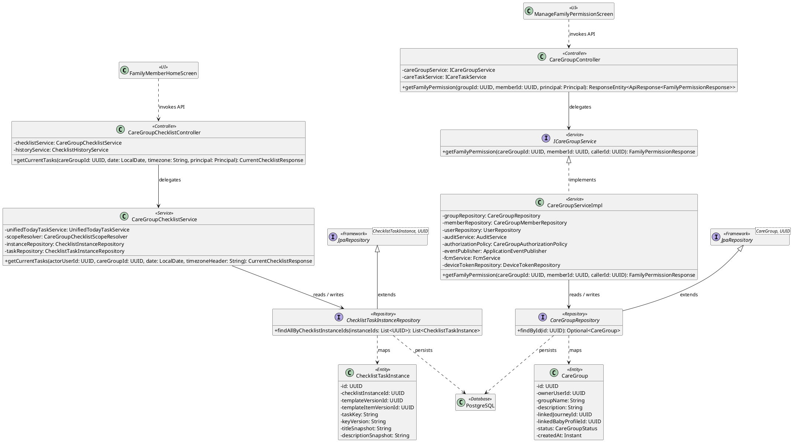
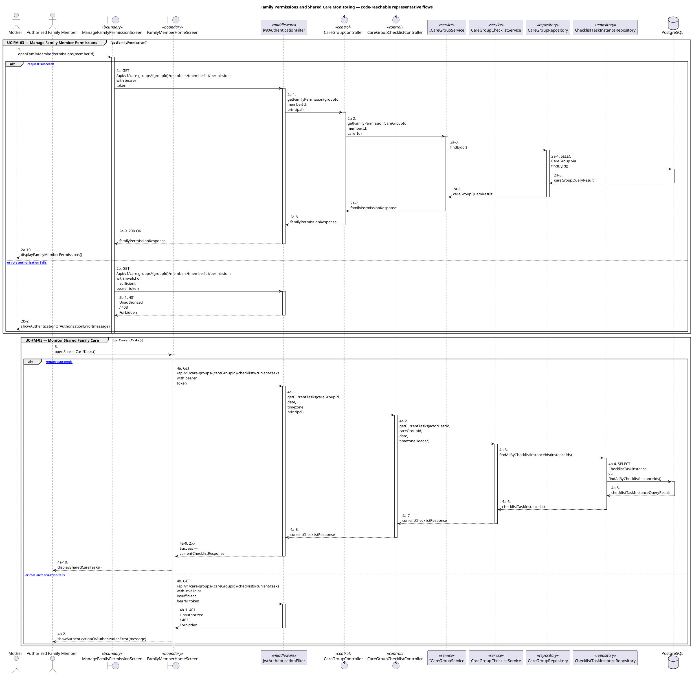
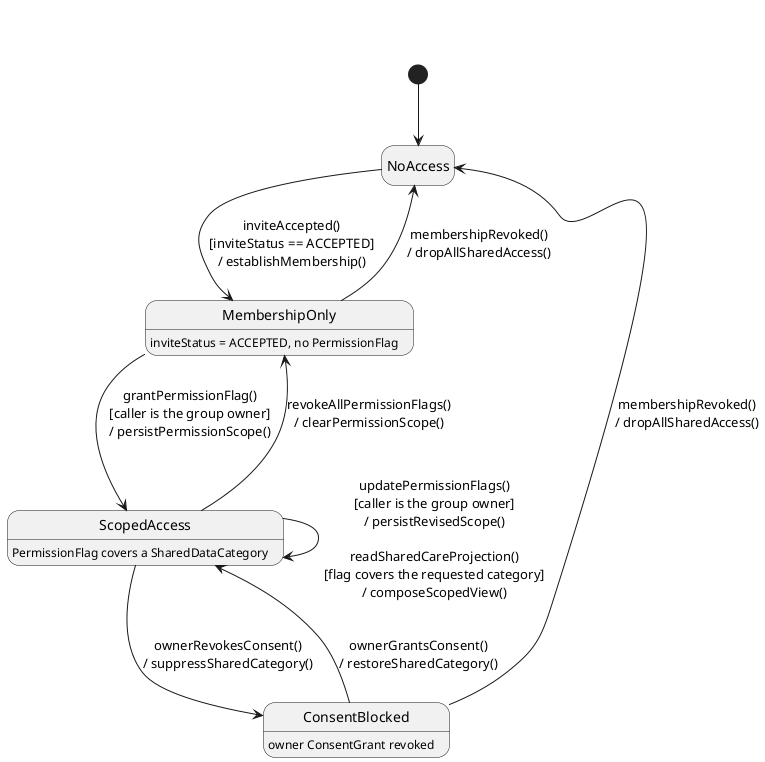

# MF-08 — Family Permissions and Shared Care Monitoring

| Field | Value |
| --- | --- |
| Major Feature | **MF-08 — Family Sync & Cooperative Care** |
| Function package | **Family Permissions and Shared Care Monitoring** |
| Code-first use cases | `UC-FM-03, UC-FM-05` |
| Status | **Draft** |
| Baseline | Current reachable code and tests, 2026-08-23 |
| Diagram convention | `../sequence-diagram-skill.md`; explicit lifeline order, numbered messages, balanced activation |

## 1. Tổng quan luồng chính

Design permission mutation and consent-scoped shared-care projections.

- **UC-FM-03 — Manage Family Member Permissions:** View and update the bounded sharing permissions of an eligible care-group member.
- **UC-FM-05 — Monitor Shared Family Care:** View family dashboard projections, permitted shared maternal/baby data, care-group checklist state/actions, and quick-note history.

The code is authoritative for routes, handlers, delegation, authorization, and persisted state. Report1 section 6.2 is authoritative for the Major Feature name. Historical UC numbering and obsolete triage plans are not design inputs.

## 2. Function Design — Code Traceability

| UC | Actor goal | Method / route | Exact handler | Delegated function | Authorization | Source |
| --- | --- | --- | --- | --- | --- | --- |
| `UC-FM-03` | Manage Family Member Permissions | `GET /api/v1/care-groups/{groupId}/members/{memberId}/permissions` | `CareGroupController.getFamilyPermission()` | `ICareGroupService.getFamilyPermission()` → `CareGroupRepository.findById()` | isAuthenticated() | `05_Development/CareBridgeAPI/src/main/java/com/carebridge/backend/family/controller/CareGroupController.java` |
| `UC-FM-03` | Manage Family Member Permissions | `PATCH /api/v1/care-groups/{groupId}/members/{memberId}/permissions` | `CareGroupController.updateFamilyPermission()` | `ICareGroupService.updateFamilyPermission()` → `CareGroupRepository.findById()` | hasRole('MOTHER') | `05_Development/CareBridgeAPI/src/main/java/com/carebridge/backend/family/controller/CareGroupController.java` |
| `UC-FM-05` | Monitor Shared Family Care | `GET /api/v1/care-groups/{careGroupId}/checklists/current/tasks` | `CareGroupChecklistController.getCurrentTasks()` | `CareGroupChecklistService.getCurrentTasks()` → `ChecklistTaskInstanceRepository.findAllByChecklistInstanceIds()` | hasRole('FAMILY') | `05_Development/CareBridgeAPI/src/main/java/com/carebridge/backend/checklist/today/controller/CareGroupChecklistController.java` |
| `UC-FM-05` | Monitor Shared Family Care | `GET /api/v1/care-groups/{careGroupId}/checklists/history` | `CareGroupChecklistController.listHistory()` | `ChecklistHistoryService.listSharedHistory()` → `ChecklistInstanceRepository.findFamilyHistory()` | hasRole('FAMILY') | `05_Development/CareBridgeAPI/src/main/java/com/carebridge/backend/checklist/today/controller/CareGroupChecklistController.java` |
| `UC-FM-05` | Monitor Shared Family Care | `POST /api/v1/care-groups/{careGroupId}/checklists/tasks/{taskId}/actions` | `CareGroupChecklistController.applyAction()` | `CareGroupChecklistService.applyAction()` | hasRole('FAMILY') | `05_Development/CareBridgeAPI/src/main/java/com/carebridge/backend/checklist/today/controller/CareGroupChecklistController.java` |
| `UC-FM-05` | Monitor Shared Family Care | `GET /api/v1/care-groups/{careGroupId}/quick-notes` | `FamilyQuickNoteController.getHistory()` | `FamilyQuickNoteService.getHistory()` → `CareGroupRepository.findById()` | hasAnyRole('MOTHER', 'FAMILY') | `05_Development/CareBridgeAPI/src/main/java/com/carebridge/backend/family/controller/FamilyQuickNoteController.java` |
| `UC-FM-05` | Monitor Shared Family Care | `GET /api/v1/care-groups/{groupId}/shared-data` | `SharedDataController.getSharedData()` | `ISharedDataService.getSharedData()` → `CareGroupRepository.findById()` | isAuthenticated() | `05_Development/CareBridgeAPI/src/main/java/com/carebridge/backend/family/controller/SharedDataController.java` |
| `UC-FM-05` | Monitor Shared Family Care | `GET /api/v1/family/dashboard` | `FamilyDashboardController.getDashboard()` | `FamilyDashboardService.get()` | isAuthenticated() | `05_Development/CareBridgeAPI/src/main/java/com/carebridge/backend/family/controller/FamilyDashboardController.java` |

## 3. Class Diagram

This design-level UML follows the current source declarations: fields become attributes, reachable methods become operations, `implements` becomes realization, repository inheritance becomes generalization, and runtime-only calls remain dependencies. A missing layer or ownership relation is not invented.

**Figure 1 — Class Diagram: Family Permissions and Shared Care Monitoring**

## 4. Sequence Diagram — Main Flow

Each group is a representative reachable main flow. The full endpoint surface remains in the Function Design table above.

**Brief Explanation:**

1. The actor starts each grouped use case through the code-reachable UI boundary.
2. Protected requests pass through JwtAuthenticationFilter; rejected credentials or roles return 401 Unauthorized or 403 Forbidden without invoking the controller.
3. The controller receives the request and invokes the exact delegated operation resolved from the current source.
4. The service applies the business policy and coordinates downstream collaborators while its caller remains active.
5. The repository executes the represented persistence operation and returns the stored or queried result before its activation ends.
6. The HTTP response unwinds through middleware when present, and the UI renders the server-authoritative outcome to the actor.

## 5. State Chart Diagram

The lifecycle below belongs to **The effective shared-care access grant for one care-group member — accepted membership combined with PermissionFlag scope and the owner's ConsentGrant**. Its states are the persisted constants declared in the sources cited under this diagram, and every transition, guard, and action is taken from the service method that writes that constant. No unreachable state is introduced.

**Figure 2 — State Chart Diagram: Family Permissions and Shared Care Monitoring**

**Brief Explanation:**

1. This package governs access rather than a single status column, so the lifecycle models the effective access grant a member holds; that is stated here so the states are not read as one persisted enum.
2. Accepted membership alone reaches only `MembershipOnly` — it conveys no health-data visibility, because every shared projection additionally requires a permission flag.
3. `grantPermissionFlag()` is owner-guarded and moves the member to `ScopedAccess`, where the flag names the exact `SharedDataCategory` that becomes visible.
4. Reads are guarded self-transitions: the projection is re-scoped on every request, so a widened or narrowed flag takes effect immediately rather than at the next session.
5. `ConsentBlocked` is deliberately separate from permission removal — an owner's consent revocation suppresses the category while leaving the member's permission scope intact, and restoring consent returns the previous scope.
6. Losing membership collapses the member straight to `NoAccess` from any state, so revocation is never partially applied.

**State sources:**

- `05_Development/CareBridgeAPI/src/main/java/com/carebridge/backend/family/entity/PermissionFlag.java`
- `05_Development/CareBridgeAPI/src/main/java/com/carebridge/backend/family/entity/InviteStatus.java`
- `05_Development/CareBridgeAPI/src/main/java/com/carebridge/backend/family/entity/SharedDataCategory.java`
- `05_Development/CareBridgeAPI/src/main/java/com/carebridge/backend/family/service/impl/CareGroupServiceImpl.java`
- `05_Development/CareBridgeAPI/src/main/java/com/carebridge/backend/family/service/FamilyDashboardService.java`
- `05_Development/CareBridgeAPI/src/main/java/com/carebridge/backend/consent/service/impl/ConsentServiceImpl.java`

## 6. Business Rules Applied

| UC | Enforced business/security rules | Known boundary or gap |
| --- | --- | --- |
| `UC-FM-03` | Only the authorized owner/mother may change member permissions. Revoked permissions must affect subsequent data reads immediately according to policy. | No additional gap recorded in the code-first baseline. |
| `UC-FM-05` | Membership, permission, and consent are rechecked for every projection. Family emergency alerts are specified under UC-ES-03, not duplicated here. | No additional gap recorded in the code-first baseline. |

## 7. Partial / Excluded Boundaries

- No extra release boundary beyond the code-first UC catalogue is introduced by this package.

## 8. Code and Test Evidence

- `05_Development/CareBridgeAPI/src/main/java/com/carebridge/backend/family/controller/CareGroupController.java`
- `05_Development/CareBridgeMobileApp/lib/features/familySync/screens/manage_family_permission_screen.dart`
- `05_Development/CareBridgeAPI/src/test/java/com/carebridge/backend/family/ManageFamilyPermissionIntegrationTest.java`
- `05_Development/CareBridgeAPI/src/test/java/com/carebridge/backend/family/controller/CareGroupControllerPermissionTest.java`
- `05_Development/CareBridgeAPI/src/test/java/com/carebridge/backend/family/service/CareGroupServiceImplPermissionTest.java`
- `05_Development/CareBridgeAPI/src/main/java/com/carebridge/backend/family/controller/FamilyDashboardController.java`
- `05_Development/CareBridgeAPI/src/main/java/com/carebridge/backend/family/controller/SharedDataController.java`
- `05_Development/CareBridgeAPI/src/main/java/com/carebridge/backend/checklist/today/controller/CareGroupChecklistController.java`
- `05_Development/CareBridgeAPI/src/main/java/com/carebridge/backend/family/controller/FamilyQuickNoteController.java`
- `05_Development/CareBridgeMobileApp/lib/features/home/screens/family_member_home_screen.dart`
- `05_Development/CareBridgeAPI/src/test/java/com/carebridge/backend/family/service/FamilyDashboardServiceTest.java`
- `05_Development/CareBridgeAPI/src/test/java/com/carebridge/backend/family/service/SharedDataServiceImplTest.java`
- `05_Development/CareBridgeAPI/src/test/java/com/carebridge/backend/family/service/FamilyQuickNoteServiceTest.java`
- `05_Development/CareBridgeMobileApp/test/features/familySync/family_dashboard_contract_test.dart`
