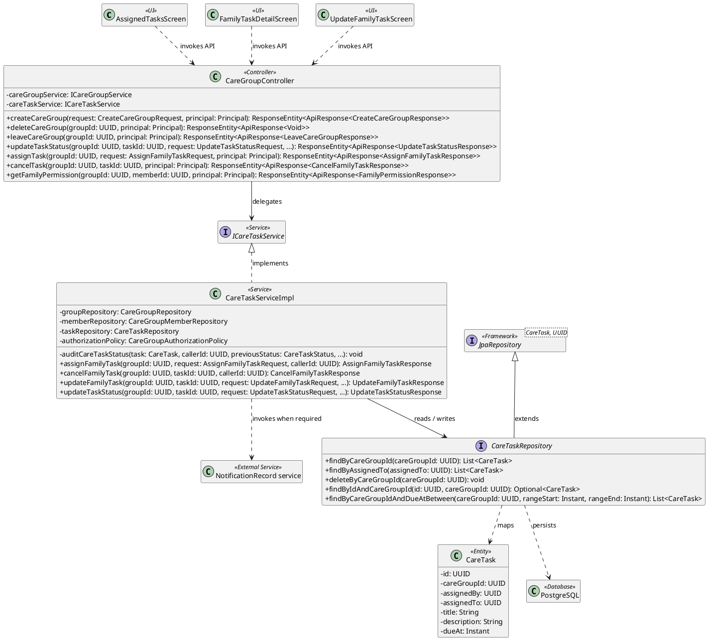
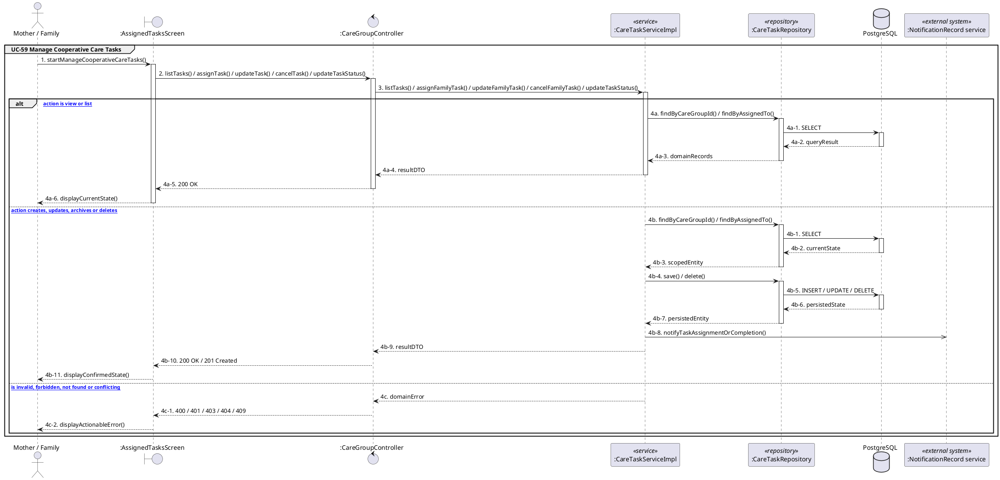

# MF-08 / Spec 03 — Cooperative Care Task Management

| Field | Value |
| --- | --- |
| Status | Draft |
| Use Cases Covered | UC-59 Manage Cooperative Care Tasks |
| Use Case Group | Mobile App |
| Platform | Mother and Family Mobile; Backend |
| Primary Actors | Mother / Family |
| In Scope | Owner and assignee actions differ and membership is rechecked |
| Explicitly Excluded | Clinical treatment plan |
| Implementation Trace | UI: AssignedTasksScreen, FamilyTaskDetailScreen, UpdateFamilyTaskScreen; Controller: CareGroupController; Service: CareTaskServiceImpl; Repository: CareTaskRepository; Entity: CareTask |

## 1. Tổng quan luồng chính (Main Flow Overview)

Owner and assignee actions differ and membership is rechecked. The flow starts only from the reachable UI or system trigger named in the metadata. The Backend rechecks authentication, role, ownership, membership, consent and current state as applicable; client-side visibility alone never grants access. A confirmed mutation is persisted before the UI displays success. External-service failure returns a safe retry state and must not fabricate completion.

## 2. Class Diagram

**Figure 1 — Class Diagram: Cooperative Care Task Management**

## 3. Sequence Diagram — Main Flow

**Figure 2 — Sequence Diagram: Cooperative Care Task Management Main Flow**

**Brief Explanation:**

1. The diagram separates the implemented goals covered by this specification: UC-59 Manage Cooperative Care Tasks.
2. Each actor action enters through the reachable mobile or web boundary and invokes the exact controller operation exposed by the current Backend.
3. The controller delegates to the mapped service operation; read branches query scoped records, while mutation branches load the current state before persisting the requested transition.
4. Repository calls and PostgreSQL responses are shown explicitly, including call-stack activation and dashed return messages.
5. Invalid, unauthorized, missing or conflicting requests return an actionable error without displaying a false success state.
6. External systems are invoked only for the mapped use cases; notification dispatches are asynchronous, while integrations that return data remain synchronous.

## 4. Business Rules Applied

- Access is enforced server-side using the current actor, role, ownership, membership and consent scope.
- Owner and assignee actions differ and membership is rechecked.
- The following remains outside this contract: Clinical treatment plan.
- Retries must not duplicate confirmed records, transitions, notifications or external side effects.
- Sensitive health, identity, moderation, location and safety operations retain the minimum required audit evidence.
