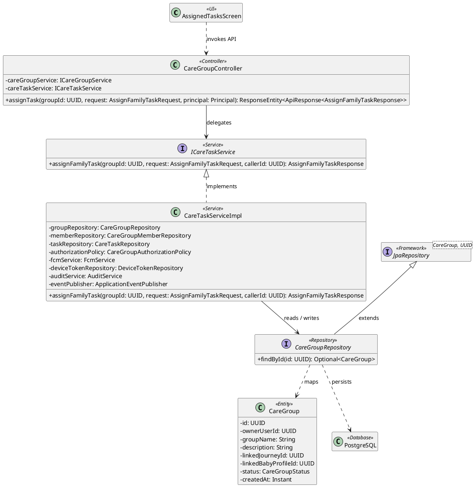
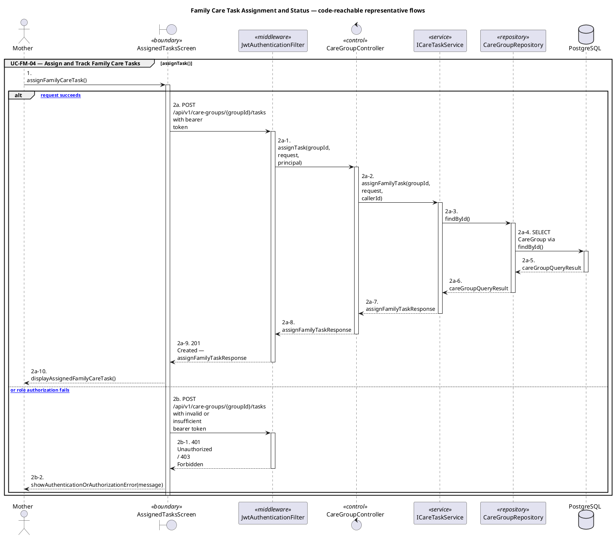

# MF-08 — Family Care Task Assignment and Status

| Field | Value |
| --- | --- |
| Major Feature | **MF-08 — Family Sync & Cooperative Care** |
| Function package | **Family Care Task Assignment and Status** |
| Code-first use cases | `UC-FM-04` |
| Status | **Draft** |
| Baseline | Current reachable code and tests, 2026-08-23 |
| Diagram convention | `../sequence-diagram-skill.md`; explicit lifeline order, numbered messages, balanced activation |

## 1. Tổng quan luồng chính

Design task assignment, ownership, detail, and status transitions.

- **UC-FM-04 — Assign and Track Family Care Tasks:** Assign a care task to an eligible member, view it, update status/details, or cancel it through the task lifecycle.

The code is authoritative for routes, handlers, delegation, authorization, and persisted state. Report1 section 6.2 is authoritative for the Major Feature name. Historical UC numbering and obsolete triage plans are not design inputs.

## 2. Function Design — Code Traceability

| UC | Actor goal | Method / route | Exact handler | Delegated function | Authorization | Source |
| --- | --- | --- | --- | --- | --- | --- |
| `UC-FM-04` | Assign and Track Family Care Tasks | `GET /api/v1/care-groups/{groupId}/tasks` | `CareGroupController.listTasks()` | `ICareTaskService.listTasks()` → `CareGroupRepository.findById()` | isAuthenticated() | `05_Development/CareBridgeAPI/src/main/java/com/carebridge/backend/family/controller/CareGroupController.java` |
| `UC-FM-04` | Assign and Track Family Care Tasks | `POST /api/v1/care-groups/{groupId}/tasks` | `CareGroupController.assignTask()` | `ICareTaskService.assignFamilyTask()` → `CareGroupRepository.findById()` | hasRole('MOTHER') | `05_Development/CareBridgeAPI/src/main/java/com/carebridge/backend/family/controller/CareGroupController.java` |
| `UC-FM-04` | Assign and Track Family Care Tasks | `GET /api/v1/care-groups/{groupId}/tasks/{taskId}` | `CareGroupController.getTaskDetail()` | `ICareTaskService.getTaskDetail()` → `CareGroupRepository.findById()` | isAuthenticated() | `05_Development/CareBridgeAPI/src/main/java/com/carebridge/backend/family/controller/CareGroupController.java` |
| `UC-FM-04` | Assign and Track Family Care Tasks | `PATCH /api/v1/care-groups/{groupId}/tasks/{taskId}` | `CareGroupController.updateTask()` | `ICareTaskService.updateFamilyTask()` → `CareTaskRepository.findByIdAndCareGroupId()` | hasRole('MOTHER') | `05_Development/CareBridgeAPI/src/main/java/com/carebridge/backend/family/controller/CareGroupController.java` |
| `UC-FM-04` | Assign and Track Family Care Tasks | `POST /api/v1/care-groups/{groupId}/tasks/{taskId}/cancel` | `CareGroupController.cancelTask()` | `ICareTaskService.cancelFamilyTask()` → `CareTaskRepository.findByIdAndCareGroupId()` | hasRole('MOTHER') | `05_Development/CareBridgeAPI/src/main/java/com/carebridge/backend/family/controller/CareGroupController.java` |
| `UC-FM-04` | Assign and Track Family Care Tasks | `PATCH /api/v1/care-groups/{groupId}/tasks/{taskId}/status` | `CareGroupController.updateTaskStatus()` | `ICareTaskService.updateTaskStatus()` → `CareGroupRepository.findById()` | isAuthenticated() | `05_Development/CareBridgeAPI/src/main/java/com/carebridge/backend/family/controller/CareGroupController.java` |

## 3. Class Diagram

This design-level UML follows the current source declarations: fields become attributes, reachable methods become operations, `implements` becomes realization, repository inheritance becomes generalization, and runtime-only calls remain dependencies. A missing layer or ownership relation is not invented.

**Figure 1 — Class Diagram: Family Care Task Assignment and Status**

## 4. Sequence Diagram — Main Flow

Each group is a representative reachable main flow. The full endpoint surface remains in the Function Design table above.

**Brief Explanation:**

1. The actor starts each grouped use case through the code-reachable UI boundary.
2. Protected requests pass through JwtAuthenticationFilter; rejected credentials or roles return 401 Unauthorized or 403 Forbidden without invoking the controller.
3. The controller receives the request and invokes the exact delegated operation resolved from the current source.
4. The service applies the business policy and coordinates downstream collaborators while its caller remains active.
5. The repository executes the represented persistence operation and returns the stored or queried result before its activation ends.
6. The HTTP response unwinds through middleware when present, and the UI renders the server-authoritative outcome to the actor.

## 5. Business Rules Applied

| UC | Enforced business/security rules | Known boundary or gap |
| --- | --- | --- |
| `UC-FM-04` | Assignee membership, ownership, and finite-state transitions are server authoritative. Retries cannot create duplicate assignments beyond current policy. | No additional gap recorded in the code-first baseline. |

## 6. Partial / Excluded Boundaries

- No extra release boundary beyond the code-first UC catalogue is introduced by this package.

## 7. Code and Test Evidence

- `05_Development/CareBridgeAPI/src/main/java/com/carebridge/backend/family/controller/CareGroupController.java`
- `05_Development/CareBridgeAPI/src/main/java/com/carebridge/backend/family/service/impl/CareTaskServiceImpl.java`
- `05_Development/CareBridgeMobileApp/lib/features/familySync/screens/assigned_tasks_screen.dart`
- `05_Development/CareBridgeAPI/src/test/java/com/carebridge/backend/family/CareTaskAssignmentIntegrationTest.java`
- `05_Development/CareBridgeAPI/src/test/java/com/carebridge/backend/family/service/CareTaskServiceImplTest.java`
- `05_Development/CareBridgeAPI/src/test/java/com/carebridge/backend/family/entity/CareTaskStatusFsmTest.java`
