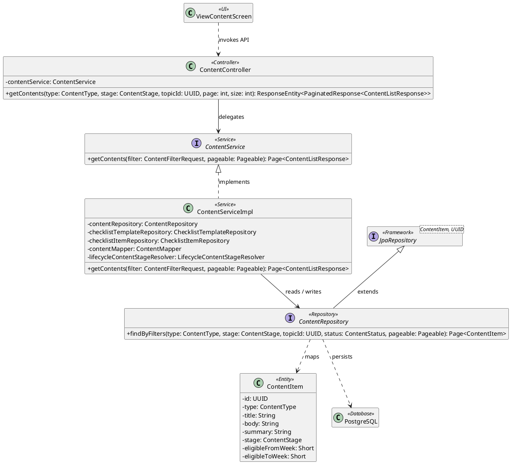
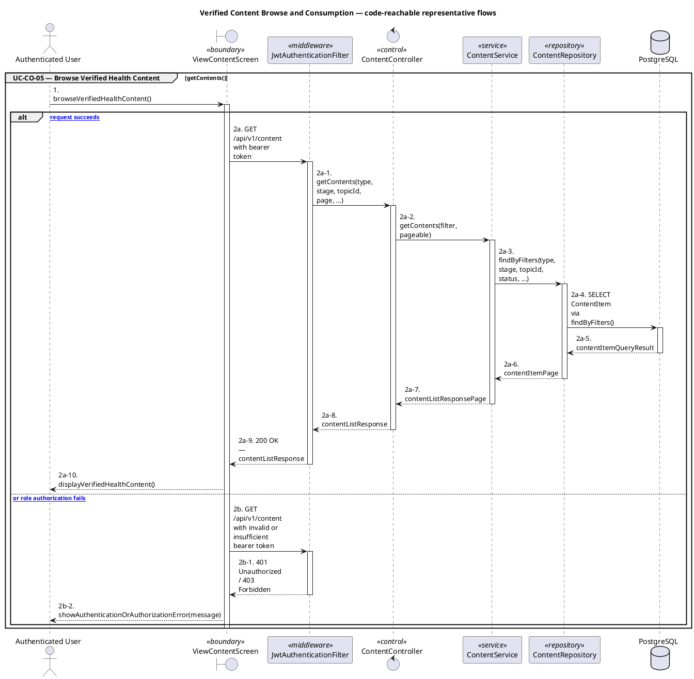
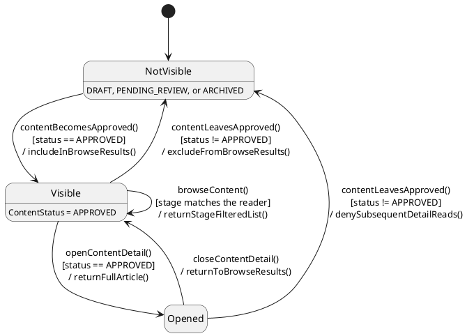

# MF-09 — Verified Content Browse and Consumption

| Field | Value |
| --- | --- |
| Major Feature | **MF-09 — Content Hub** |
| Function package | **Verified Content Browse and Consumption** |
| Code-first use cases | `UC-CO-05` |
| Status | **Draft** |
| Baseline | Current reachable code and tests, 2026-08-23 |
| Diagram convention | `../sequence-diagram-skill.md`; explicit lifeline order, numbered messages, balanced activation |

## 1. Tổng quan luồng chính

Design consumer browse/detail access to lifecycle-eligible health content.

- **UC-CO-05 — Browse Verified Health Content:** Browse/search consumer-visible verified content and open lifecycle/checklist content eligible for the current stage.

The code is authoritative for routes, handlers, delegation, authorization, and persisted state. Report1 section 6.2 is authoritative for the Major Feature name. Historical UC numbering and obsolete triage plans are not design inputs.

## 2. Function Design — Code Traceability

| UC | Actor goal | Method / route | Exact handler | Delegated function | Authorization | Source |
| --- | --- | --- | --- | --- | --- | --- |
| `UC-CO-05` | Browse Verified Health Content | `GET /api/v1/content` | `ContentController.getContents()` | `ContentService.getContents()` → `ContentRepository.findByFilters()` | No @PreAuthorize on handler/class; effective access comes from the security chain | `05_Development/CareBridgeAPI/src/main/java/com/carebridge/backend/content/controller/ContentController.java` |
| `UC-CO-05` | Browse Verified Health Content | `GET /api/v1/content/checklists` | `ContentController.getChecklists()` | `ContentService.getChecklists()` → `ChecklistTemplateRepository.findAllOptionalByStatus()` | No @PreAuthorize on handler/class; effective access comes from the security chain | `05_Development/CareBridgeAPI/src/main/java/com/carebridge/backend/content/controller/ContentController.java` |
| `UC-CO-05` | Browse Verified Health Content | `GET /api/v1/content/lifecycle` | `ContentController.getLifecycleContents()` | `ContentService.getLifecycleContents()` → `ContentRepository.findByFilters()` | hasRole('MOTHER') | `05_Development/CareBridgeAPI/src/main/java/com/carebridge/backend/content/controller/ContentController.java` |
| `UC-CO-05` | Browse Verified Health Content | `GET /api/v1/content/lifecycle/{id}` | `ContentController.getLifecycleContentById()` | `ContentService.getLifecycleContentById()` → `ContentRepository.findByIdAndStageAndStatus()` | hasRole('MOTHER') | `05_Development/CareBridgeAPI/src/main/java/com/carebridge/backend/content/controller/ContentController.java` |
| `UC-CO-05` | Browse Verified Health Content | `GET /api/v1/content/search` | `ContentController.searchContent()` | `ContentService.searchContent()` → `ContentRepository.searchByFilters()` | No @PreAuthorize on handler/class; effective access comes from the security chain | `05_Development/CareBridgeAPI/src/main/java/com/carebridge/backend/content/controller/ContentController.java` |
| `UC-CO-05` | Browse Verified Health Content | `GET /api/v1/content/{id}` | `ContentController.getContentById()` | `ContentService.getContentById()` → `ContentRepository.findByIdAndStatus()` | No @PreAuthorize on handler/class; effective access comes from the security chain | `05_Development/CareBridgeAPI/src/main/java/com/carebridge/backend/content/controller/ContentController.java` |

## 3. Class Diagram

This design-level UML follows the current source declarations: fields become attributes, reachable methods become operations, `implements` becomes realization, repository inheritance becomes generalization, and runtime-only calls remain dependencies. A missing layer or ownership relation is not invented.

**Figure 1 — Class Diagram: Verified Content Browse and Consumption**

## 4. Sequence Diagram — Main Flow

Each group is a representative reachable main flow. The full endpoint surface remains in the Function Design table above.

**Brief Explanation:**

1. The actor starts each grouped use case through the code-reachable UI boundary.
2. Protected requests pass through JwtAuthenticationFilter; rejected credentials or roles return 401 Unauthorized or 403 Forbidden without invoking the controller.
3. The controller receives the request and invokes the exact delegated operation resolved from the current source.
4. The service applies the business policy and coordinates downstream collaborators while its caller remains active.
5. The repository executes the represented persistence operation and returns the stored or queried result before its activation ends.
6. The HTTP response unwinds through middleware when present, and the UI renders the server-authoritative outcome to the actor.

## 5. State Chart Diagram

The lifecycle below belongs to **The consumer-visible ContentItem as seen through browse and detail reads — the authoring lifecycle itself is owned by MF-09 document 02**. Its states are the persisted constants declared in the sources cited under this diagram, and every transition, guard, and action is taken from the service method that writes that constant. No unreachable state is introduced.

**Figure 2 — State Chart Diagram: Verified Content Browse and Consumption**

**Brief Explanation:**

1. This package is read-only, so the lifecycle shown is the consumer's view of a content item rather than an editorial workflow; the authoring states are owned by the Content Authoring package and are not duplicated here.
2. `Visible` corresponds exactly to `ContentStatus.APPROVED` — `ContentServiceImpl` queries `findByIdAndStatus(id, APPROVED)`, so no other status is reachable through a consumer route.
3. Browse is a guarded self-transition on `Visible`: results are additionally filtered by `ContentStage`, so a reader only sees material matching their lifecycle stage.
4. `openContentDetail()` re-checks `status == APPROVED` rather than trusting the browse result, which is why the detail read carries its own guard.
5. Unpublishing or archiving an item moves it out of `Visible` immediately, and an already-open article stops serving further detail reads.
6. There is no consumer transition that writes content state — every transition here is driven by editorial changes made elsewhere or by the reader's own navigation.

**State sources:**

- `05_Development/CareBridgeAPI/src/main/java/com/carebridge/backend/content/entity/ContentStatus.java`
- `05_Development/CareBridgeAPI/src/main/java/com/carebridge/backend/content/service/ContentServiceImpl.java`
- `05_Development/CareBridgeAPI/src/main/java/com/carebridge/backend/recommendation/service/RecommendationEligibilityPolicy.java`
- `05_Development/CareBridgeAPI/src/main/java/com/carebridge/backend/content/entity/ContentStage.java`

## 6. Business Rules Applied

| UC | Enforced business/security rules | Known boundary or gap |
| --- | --- | --- |
| `UC-CO-05` | Only publication/lifecycle-eligible content is consumer-visible. Verified content is editorial content, not community Q&A. | No additional gap recorded in the code-first baseline. |

## 7. Partial / Excluded Boundaries

- No extra release boundary beyond the code-first UC catalogue is introduced by this package.

## 8. Code and Test Evidence

- `05_Development/CareBridgeAPI/src/main/java/com/carebridge/backend/content/controller/ContentController.java`
- `05_Development/CareBridgeMobileApp/lib/features/community/screens/view_content_screen.dart`
- `05_Development/CareBridgeMobileApp/lib/features/community/screens/verified_content_detail_screen.dart`
- `05_Development/CareBridgeAPI/src/test/java/com/carebridge/backend/content/unit/ContentControllerTest.java`
- `05_Development/CareBridgeAPI/src/test/java/com/carebridge/backend/content/unit/ContentSearchServiceTest.java`
- `05_Development/CareBridgeAPI/src/test/java/com/carebridge/backend/content/unit/LifecycleContentServiceTest.java`
- `05_Development/CareBridgeMobileApp/test/features/community/services/content_service_test.dart`
