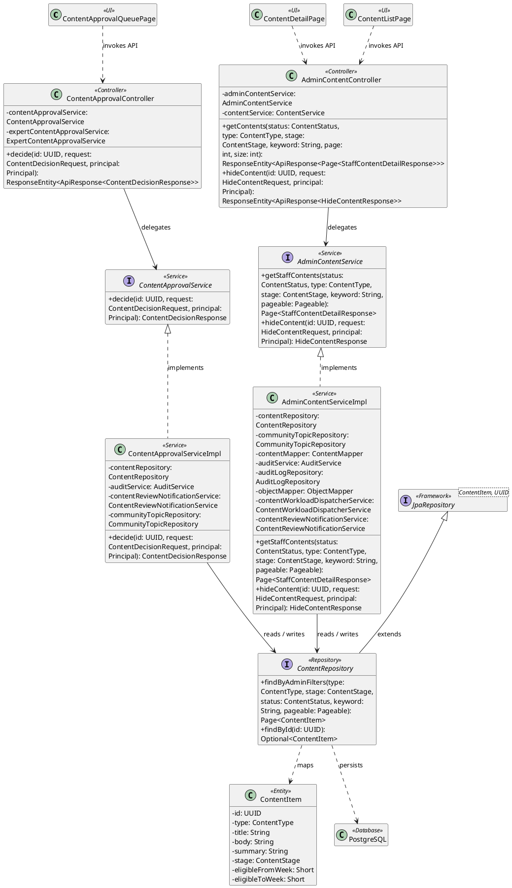
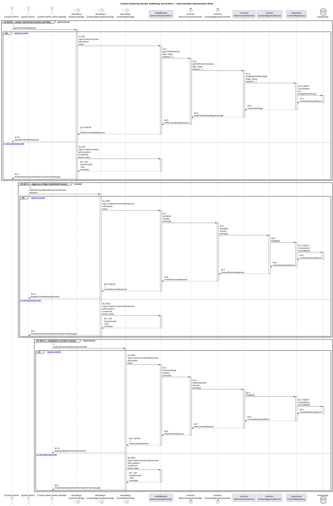
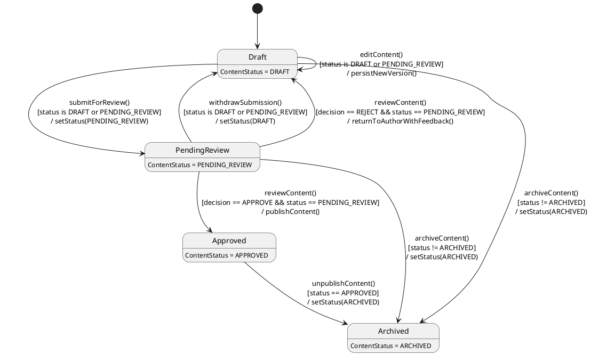

# MF-09 — Content Authoring, Review, Publishing, and Archive

| Field | Value |
| --- | --- |
| Major Feature | **MF-09 — Content Hub** |
| Function package | **Content Authoring, Review, Publishing, and Archive** |
| Code-first use cases | `UC-AD-08, UC-AD-14, UC-AD-15` |
| Status | **Draft** |
| Baseline | Current reachable code and tests, 2026-08-23 |
| Diagram convention | `../sequence-diagram-skill.md`; explicit lifeline order, numbered messages, balanced activation |

## 1. Tổng quan luồng chính

Design authoring/versioning, review decisions, publication state, unpublish, and archive.

- **UC-AD-08 — Author and Version Articles and FAQs:** Create, edit, version, preview, list, tag with the current recommendation catalogue, and manage supported draft lifecycle of verified articles and FAQs.
- **UC-AD-14 — Approve or Reject Submitted Content:** Review a submitted content version and record an approval or rejection decision.
- **UC-AD-15 — Unpublish or Archive Content:** Remove eligible published content from consumer visibility or archive it through the supported remediation lifecycle.

The code is authoritative for routes, handlers, delegation, authorization, and persisted state. Report1 section 6.2 is authoritative for the Major Feature name. Historical UC numbering and obsolete triage plans are not design inputs.

## 2. Function Design — Code Traceability

| UC | Actor goal | Method / route | Exact handler | Delegated function | Authorization | Source |
| --- | --- | --- | --- | --- | --- | --- |
| `UC-AD-08` | Author and Version Articles and FAQs | `GET /api/v1/admin/content` | `AdminContentController.getContents()` | `AdminContentService.getStaffContents()` → `ContentRepository.findByAdminFilters()` | hasAnyRole('CONTENT_ADMIN','SYSTEM_ADMIN') | `05_Development/CareBridgeAPI/src/main/java/com/carebridge/backend/content/controller/AdminContentController.java` |
| `UC-AD-08` | Author and Version Articles and FAQs | `POST /api/v1/admin/content` | `AdminContentController.createContent()` | `AdminContentService.createContent()` → `CommunityTopicRepository.existsById()` | hasRole('CONTENT_ADMIN') | `05_Development/CareBridgeAPI/src/main/java/com/carebridge/backend/content/controller/AdminContentController.java` |
| `UC-AD-08` | Author and Version Articles and FAQs | `GET /api/v1/admin/content/checklists` | `AdminContentController.getChecklists()` | `ContentService.getAdminChecklists()` | hasAnyRole('CONTENT_ADMIN','SYSTEM_ADMIN') | `05_Development/CareBridgeAPI/src/main/java/com/carebridge/backend/content/controller/AdminContentController.java` |
| `UC-AD-08` | Author and Version Articles and FAQs | `POST /api/v1/admin/content/import-batch` | `AdminContentController.importContentBatch()` | `AdminContentService.importContentBatch()` → `CommunityTopicRepository.findAll()` | hasRole('CONTENT_ADMIN') | `05_Development/CareBridgeAPI/src/main/java/com/carebridge/backend/content/controller/AdminContentController.java` |
| `UC-AD-08` | Author and Version Articles and FAQs | `GET /api/v1/admin/content/recommendation-tags` | `RecommendationAdminController.getCatalog()` | `RecommendationService.getCatalog()` → `CommunityTopicRepository.findAllBySlugIn()` | hasAnyRole('CONTENT_ADMIN','SYSTEM_ADMIN') | `05_Development/CareBridgeAPI/src/main/java/com/carebridge/backend/recommendation/controller/RecommendationAdminController.java` |
| `UC-AD-08` | Author and Version Articles and FAQs | `GET /api/v1/admin/content/{id}` | `AdminContentController.getContent()` | `AdminContentService.getStaffContent()` → `ContentRepository.findById()` | hasAnyRole('CONTENT_ADMIN','SYSTEM_ADMIN') | `05_Development/CareBridgeAPI/src/main/java/com/carebridge/backend/content/controller/AdminContentController.java` |
| `UC-AD-08` | Author and Version Articles and FAQs | `PUT /api/v1/admin/content/{id}` | `AdminContentController.updateContent()` | `AdminContentService.updateContent()` → `ContentRepository.findById()` | hasRole('CONTENT_ADMIN') | `05_Development/CareBridgeAPI/src/main/java/com/carebridge/backend/content/controller/AdminContentController.java` |
| `UC-AD-08` | Author and Version Articles and FAQs | `GET /api/v1/admin/content/{id}/versions` | `AdminContentController.getVersionHistory()` | `AdminContentService.getVersionHistory()` → `ContentRepository.existsById()` | hasAnyRole('CONTENT_ADMIN','SYSTEM_ADMIN') | `05_Development/CareBridgeAPI/src/main/java/com/carebridge/backend/content/controller/AdminContentController.java` |
| `UC-AD-14` | Approve or Reject Submitted Content | `POST /api/v1/admin/content/{id}/decision` | `ContentApprovalController.decide()` | `ContentApprovalService.decide()` → `ContentRepository.findById()` | hasAnyRole('SYSTEM_ADMIN', 'EXPERT') | `05_Development/CareBridgeAPI/src/main/java/com/carebridge/backend/content/controller/ContentApprovalController.java` |
| `UC-AD-15` | Unpublish or Archive Content | `POST /api/v1/admin/content/{id}/archive` | `AdminContentController.hideContent()` | `AdminContentService.hideContent()` → `ContentRepository.findById()` | hasRole('CONTENT_ADMIN') | `05_Development/CareBridgeAPI/src/main/java/com/carebridge/backend/content/controller/AdminContentController.java` |
| `UC-AD-15` | Unpublish or Archive Content | `POST /api/v1/admin/content/{id}/unpublish` | `ContentUnpublishController.unpublish()` | `ContentUnpublishService.unpublish()` → `ContentRepository.findById()` | hasRole('CONTENT_ADMIN') | `05_Development/CareBridgeAPI/src/main/java/com/carebridge/backend/content/controller/ContentUnpublishController.java` |

## 3. Class Diagram

This design-level UML follows the current source declarations: fields become attributes, reachable methods become operations, `implements` becomes realization, repository inheritance becomes generalization, and runtime-only calls remain dependencies. A missing layer or ownership relation is not invented.

**Figure 1 — Class Diagram: Content Authoring, Review, Publishing, and Archive**

## 4. Sequence Diagram — Main Flow

Each group is a representative reachable main flow. The full endpoint surface remains in the Function Design table above.

**Brief Explanation:**

1. The actor starts each grouped use case through the code-reachable UI boundary.
2. Protected requests pass through JwtAuthenticationFilter; rejected credentials or roles return 401 Unauthorized or 403 Forbidden without invoking the controller.
3. The controller receives the request and invokes the exact delegated operation resolved from the current source.
4. The service applies the business policy and coordinates downstream collaborators while its caller remains active.
5. The repository executes the represented persistence operation and returns the stored or queried result before its activation ends.
6. The HTTP response unwinds through middleware when present, and the UI renders the server-authoritative outcome to the actor.

## 5. State Chart Diagram

The lifecycle below belongs to **ContentItem.status**. Its states are the persisted constants declared in the sources cited under this diagram, and every transition, guard, and action is taken from the service method that writes that constant. No unreachable state is introduced.

**Figure 2 — State Chart Diagram: Content Authoring, Review, Publishing, and Archive**

**Brief Explanation:**

1. `ContentMapper` creates every item in `DRAFT`, so nothing enters the corpus already published.
2. Editing is guarded on the item being `DRAFT` or `PENDING_REVIEW` — `AdminContentServiceImpl` refuses content edits once an item is approved or archived.
3. `ContentApprovalServiceImpl` guards the review decision on `status == PENDING_REVIEW`, so an approval cannot be replayed against an already-published item.
4. The `ContentDecision` guard splits the review outcome: `APPROVE` publishes the item, while `REJECT` returns it to `DRAFT` with feedback rather than archiving it.
5. `APPROVED` is the only state consumers can read, which is why unpublishing is modelled as a transition to `ARCHIVED` rather than a separate visibility flag.
6. `ContentUnpublishServiceImpl` guards unpublish on `status == APPROVED`, and archiving is otherwise rejected when the item is already `ARCHIVED`; `ARCHIVED` is terminal, because the only other `DRAFT` write creates a new content item rather than restoring an archived one.

**State sources:**

- `05_Development/CareBridgeAPI/src/main/java/com/carebridge/backend/content/entity/ContentStatus.java`
- `05_Development/CareBridgeAPI/src/main/java/com/carebridge/backend/content/entity/ContentDecision.java`
- `05_Development/CareBridgeAPI/src/main/java/com/carebridge/backend/content/mapper/ContentMapper.java`
- `05_Development/CareBridgeAPI/src/main/java/com/carebridge/backend/content/service/AdminContentServiceImpl.java`
- `05_Development/CareBridgeAPI/src/main/java/com/carebridge/backend/content/service/ContentApprovalServiceImpl.java`
- `05_Development/CareBridgeAPI/src/main/java/com/carebridge/backend/content/service/ContentUnpublishServiceImpl.java`

## 6. Business Rules Applied

| UC | Enforced business/security rules | Known boundary or gap |
| --- | --- | --- |
| `UC-AD-08` | Draft/version/publication state is server authoritative. Rich text sanitization and image orphan cleanup follow current policies. | No additional gap recorded in the code-first baseline. |
| `UC-AD-14` | Only an eligible submitted version can be decided. Approval is auditable and controls later consumer visibility according to lifecycle. | No additional gap recorded in the code-first baseline. |
| `UC-AD-15` | Unpublish/archive permissions and state transitions are server authoritative. This remediation action is distinct from System Admin approval/rejection. | No additional gap recorded in the code-first baseline. |

## 7. Partial / Excluded Boundaries

- No extra release boundary beyond the code-first UC catalogue is introduced by this package.

## 8. Code and Test Evidence

- `05_Development/CareBridgeAPI/src/main/java/com/carebridge/backend/content/controller/AdminContentController.java`
- `05_Development/CareBridgeAPI/src/main/java/com/carebridge/backend/recommendation/controller/RecommendationAdminController.java`
- `05_Development/CareBridgeWebApp/src/features/contentManagement/pages/ContentListPage.tsx`
- `05_Development/CareBridgeWebApp/src/features/contentManagement/pages/EditContentPage.tsx`
- `05_Development/CareBridgeAPI/src/test/java/com/carebridge/backend/content/AdminContentControllerTest.java`
- `05_Development/CareBridgeAPI/src/test/java/com/carebridge/backend/integration/UpdateContentIntegrationTest.java`
- `05_Development/CareBridgeAPI/src/test/java/com/carebridge/backend/content/policy/HtmlContentSanitizerTest.java`
- `05_Development/CareBridgeWebApp/src/features/contentManagement/components/RichTextEditor.test.tsx`
- `05_Development/CareBridgeAPI/src/main/java/com/carebridge/backend/content/controller/ContentApprovalController.java`
- `05_Development/CareBridgeWebApp/src/features/contentManagement/pages/ContentApprovalQueuePage.tsx`
- `05_Development/CareBridgeWebApp/src/features/contentManagement/pages/ContentDetailPage.tsx`
- `05_Development/CareBridgeAPI/src/test/java/com/carebridge/backend/integration/ContentApprovalIntegrationTest.java`
- `05_Development/CareBridgeAPI/src/test/java/com/carebridge/backend/security/ContentApprovalControllerSecurityTest.java`
- `05_Development/CareBridgeWebApp/src/features/contentManagement/pages/ContentApprovalQueuePage.test.tsx`
- `05_Development/CareBridgeAPI/src/main/java/com/carebridge/backend/content/controller/ContentUnpublishController.java`
- `05_Development/CareBridgeAPI/src/test/java/com/carebridge/backend/integration/UnpublishContentIntegrationTest.java`
- `05_Development/CareBridgeAPI/src/test/java/com/carebridge/backend/content/UnpublishContentControllerTest.java`
- `05_Development/CareBridgeAPI/src/test/java/com/carebridge/backend/content/HideContentServiceImplTest.java`
