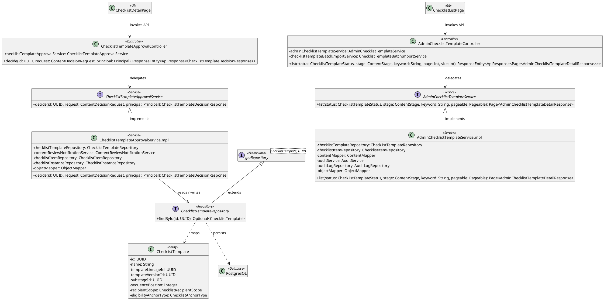
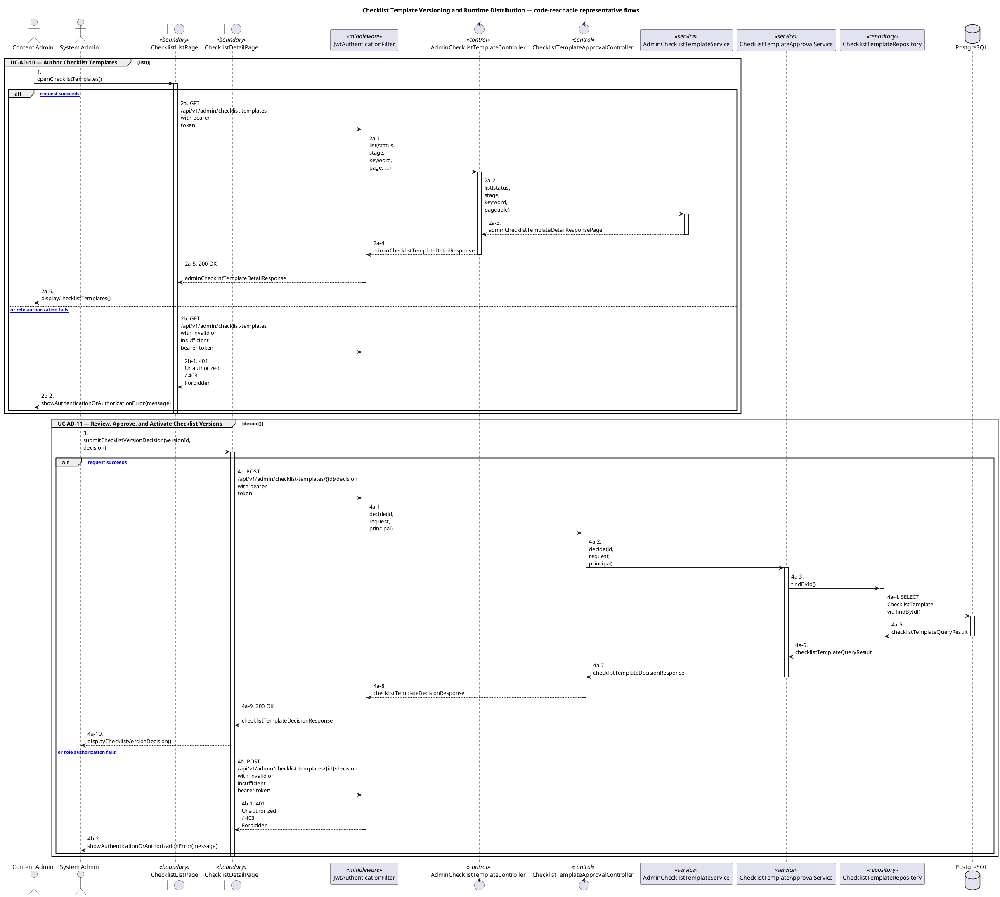

# MF-09 — Checklist Template Versioning and Runtime Distribution

| Field | Value |
| --- | --- |
| Major Feature | **MF-09 — Content Hub** |
| Function package | **Checklist Template Versioning and Runtime Distribution** |
| Code-first use cases | `UC-AD-10, UC-AD-11` |
| Status | **Draft** |
| Baseline | Current reachable code and tests, 2026-08-23 |
| Diagram convention | `../sequence-diagram-skill.md`; explicit lifeline order, numbered messages, balanced activation |

## 1. Tổng quan luồng chính

Design checklist template/version governance and distribution boundaries.

- **UC-AD-10 — Author Checklist Templates:** Create, edit, clone, import, version, and archive checklist templates before administrative approval.
- **UC-AD-11 — Review, Approve, and Activate Checklist Versions:** Review submitted checklist versions, record an approval decision, and activate an eligible approved version for distribution.

The code is authoritative for routes, handlers, delegation, authorization, and persisted state. Report1 section 6.2 is authoritative for the Major Feature name. Historical UC numbering and obsolete triage plans are not design inputs.

## 2. Function Design — Code Traceability

| UC | Actor goal | Method / route | Exact handler | Delegated function | Authorization | Source |
| --- | --- | --- | --- | --- | --- | --- |
| `UC-AD-10` | Author Checklist Templates | `GET /api/v1/admin/checklist-templates` | `AdminChecklistTemplateController.list()` | `AdminChecklistTemplateService.list()` | hasAnyRole('CONTENT_ADMIN','SYSTEM_ADMIN') | `05_Development/CareBridgeAPI/src/main/java/com/carebridge/backend/content/controller/AdminChecklistTemplateController.java` |
| `UC-AD-10` | Author Checklist Templates | `POST /api/v1/admin/checklist-templates` | `AdminChecklistTemplateController.create()` | `AdminChecklistTemplateService.create()` → `ChecklistTemplateRepository.save()` | hasRole('CONTENT_ADMIN') | `05_Development/CareBridgeAPI/src/main/java/com/carebridge/backend/content/controller/AdminChecklistTemplateController.java` |
| `UC-AD-10` | Author Checklist Templates | `POST /api/v1/admin/checklist-templates/import-batch` | `AdminChecklistTemplateController.importBatch()` | `ChecklistTemplateBatchImportService.importBatch()` | hasRole('CONTENT_ADMIN') | `05_Development/CareBridgeAPI/src/main/java/com/carebridge/backend/content/controller/AdminChecklistTemplateController.java` |
| `UC-AD-10` | Author Checklist Templates | `GET /api/v1/admin/checklist-templates/{id}` | `AdminChecklistTemplateController.getById()` | `AdminChecklistTemplateService.getById()` → `ChecklistTemplateRepository.findById()` | hasAnyRole('CONTENT_ADMIN','SYSTEM_ADMIN') | `05_Development/CareBridgeAPI/src/main/java/com/carebridge/backend/content/controller/AdminChecklistTemplateController.java` |
| `UC-AD-10` | Author Checklist Templates | `PUT /api/v1/admin/checklist-templates/{id}` | `AdminChecklistTemplateController.update()` | `AdminChecklistTemplateService.update()` → `ChecklistTemplateRepository.findById()` | hasRole('CONTENT_ADMIN') | `05_Development/CareBridgeAPI/src/main/java/com/carebridge/backend/content/controller/AdminChecklistTemplateController.java` |
| `UC-AD-10` | Author Checklist Templates | `POST /api/v1/admin/checklist-templates/{id}/archive` | `AdminChecklistTemplateController.archive()` | `AdminChecklistTemplateService.archive()` → `ChecklistTemplateRepository.findById()` | hasRole('CONTENT_ADMIN') | `05_Development/CareBridgeAPI/src/main/java/com/carebridge/backend/content/controller/AdminChecklistTemplateController.java` |
| `UC-AD-10` | Author Checklist Templates | `POST /api/v1/admin/checklist-templates/{id}/clone` | `AdminChecklistTemplateController.cloneVersion()` | `AdminChecklistTemplateService.cloneVersion()` → `ChecklistTemplateRepository.findById()` | hasRole('CONTENT_ADMIN') | `05_Development/CareBridgeAPI/src/main/java/com/carebridge/backend/content/controller/AdminChecklistTemplateController.java` |
| `UC-AD-10` | Author Checklist Templates | `GET /api/v1/admin/checklist-templates/{id}/versions` | `AdminChecklistTemplateController.getVersionHistory()` | `AdminChecklistTemplateService.getVersionHistory()` → `ChecklistTemplateRepository.existsById()` | hasAnyRole('CONTENT_ADMIN','SYSTEM_ADMIN') | `05_Development/CareBridgeAPI/src/main/java/com/carebridge/backend/content/controller/AdminChecklistTemplateController.java` |
| `UC-AD-10` | Author Checklist Templates | `POST /api/v1/admin/checklist-templates/{lineageId}/versions/{versionId}/clone` | `AdminChecklistTemplateController.cloneVersionInLineage()` | — | hasRole('CONTENT_ADMIN') | `05_Development/CareBridgeAPI/src/main/java/com/carebridge/backend/content/controller/AdminChecklistTemplateController.java` |
| `UC-AD-11` | Review, Approve, and Activate Checklist Versions | `POST /api/v1/admin/checklist-templates/{id}/decision` | `ChecklistTemplateApprovalController.decide()` | `ChecklistTemplateApprovalService.decide()` → `ChecklistTemplateRepository.findById()` | hasRole('SYSTEM_ADMIN') | `05_Development/CareBridgeAPI/src/main/java/com/carebridge/backend/content/controller/ChecklistTemplateApprovalController.java` |
| `UC-AD-11` | Review, Approve, and Activate Checklist Versions | `POST /api/v1/admin/checklist-templates/{lineageId}/versions/{versionId}/activate` | `ChecklistTemplateApprovalController.activateImportedVersion()` | `ChecklistTemplateApprovalService.activateImportedInLineage()` → `ChecklistTemplateRepository.findById()` | hasRole('SYSTEM_ADMIN') | `05_Development/CareBridgeAPI/src/main/java/com/carebridge/backend/content/controller/ChecklistTemplateApprovalController.java` |
| `UC-AD-11` | Review, Approve, and Activate Checklist Versions | `POST /api/v1/admin/checklist-templates/{lineageId}/versions/{versionId}/approve` | `ChecklistTemplateApprovalController.approveVersion()` | `ChecklistTemplateApprovalService.decideInLineage()` → `ChecklistTemplateRepository.findById()` | hasRole('SYSTEM_ADMIN') | `05_Development/CareBridgeAPI/src/main/java/com/carebridge/backend/content/controller/ChecklistTemplateApprovalController.java` |
| `UC-AD-11` | Review, Approve, and Activate Checklist Versions | `POST /api/v1/admin/checklist-templates/{lineageId}/versions/{versionId}/review` | `ChecklistTemplateApprovalController.reviewImportedVersion()` | `ChecklistTemplateApprovalService.reviewImportedInLineage()` → `ChecklistTemplateRepository.findById()` | hasRole('SYSTEM_ADMIN') | `05_Development/CareBridgeAPI/src/main/java/com/carebridge/backend/content/controller/ChecklistTemplateApprovalController.java` |

## 3. Class Diagram

This design-level UML follows the current source declarations: fields become attributes, reachable methods become operations, `implements` becomes realization, repository inheritance becomes generalization, and runtime-only calls remain dependencies. A missing layer or ownership relation is not invented.

**Figure 1 — Class Diagram: Checklist Template Versioning and Runtime Distribution**

## 4. Sequence Diagram — Main Flow

Each group is a representative reachable main flow. The full endpoint surface remains in the Function Design table above.

**Brief Explanation:**

1. The actor starts each grouped use case through the code-reachable UI boundary.
2. Protected requests pass through JwtAuthenticationFilter; rejected credentials or roles return 401 Unauthorized or 403 Forbidden without invoking the controller.
3. The controller receives the request and invokes the exact delegated operation resolved from the current source.
4. The service applies the business policy and coordinates downstream collaborators while its caller remains active.
5. The repository executes the represented persistence operation and returns the stored or queried result before its activation ends.
6. The HTTP response unwinds through middleware when present, and the UI renders the server-authoritative outcome to the actor.

## 5. Business Rules Applied

| UC | Enforced business/security rules | Known boundary or gap |
| --- | --- | --- |
| `UC-AD-10` | Content Admin authors; approval/activation is a separate System Admin UC. Import/version/template validation is server authoritative. | No additional gap recorded in the code-first baseline. |
| `UC-AD-11` | System Admin approval is distinct from Content Admin authoring. Version transition and distribution idempotency are server authoritative. | No additional gap recorded in the code-first baseline. |

## 6. Partial / Excluded Boundaries

- Personal checklist execution and today tasks are owned by MF-02 and are referenced consumers, not duplicated UC ownership here.

## 7. Code and Test Evidence

- `05_Development/CareBridgeAPI/src/main/java/com/carebridge/backend/content/controller/AdminChecklistTemplateController.java`
- `05_Development/CareBridgeWebApp/src/features/contentManagement/pages/ChecklistListPage.tsx`
- `05_Development/CareBridgeWebApp/src/features/contentManagement/pages/ChecklistFormPage.tsx`
- `05_Development/CareBridgeAPI/src/test/java/com/carebridge/backend/content/AdminChecklistTemplateControllerTest.java`
- `05_Development/CareBridgeAPI/src/test/java/com/carebridge/backend/content/AdminChecklistTemplateServiceImplTest.java`
- `05_Development/CareBridgeAPI/src/test/java/com/carebridge/backend/checklist/ChecklistImportControllerTest.java`
- `05_Development/CareBridgeAPI/src/main/java/com/carebridge/backend/content/controller/ChecklistTemplateApprovalController.java`
- `05_Development/CareBridgeWebApp/src/features/contentManagement/pages/ChecklistDetailPage.tsx`
- `05_Development/CareBridgeAPI/src/test/java/com/carebridge/backend/content/ChecklistTemplateApprovalServiceImplTest.java`
- `05_Development/CareBridgeAPI/src/test/java/com/carebridge/backend/checklist/distribution/ChecklistApprovalDistributionAuditContractTest.java`
