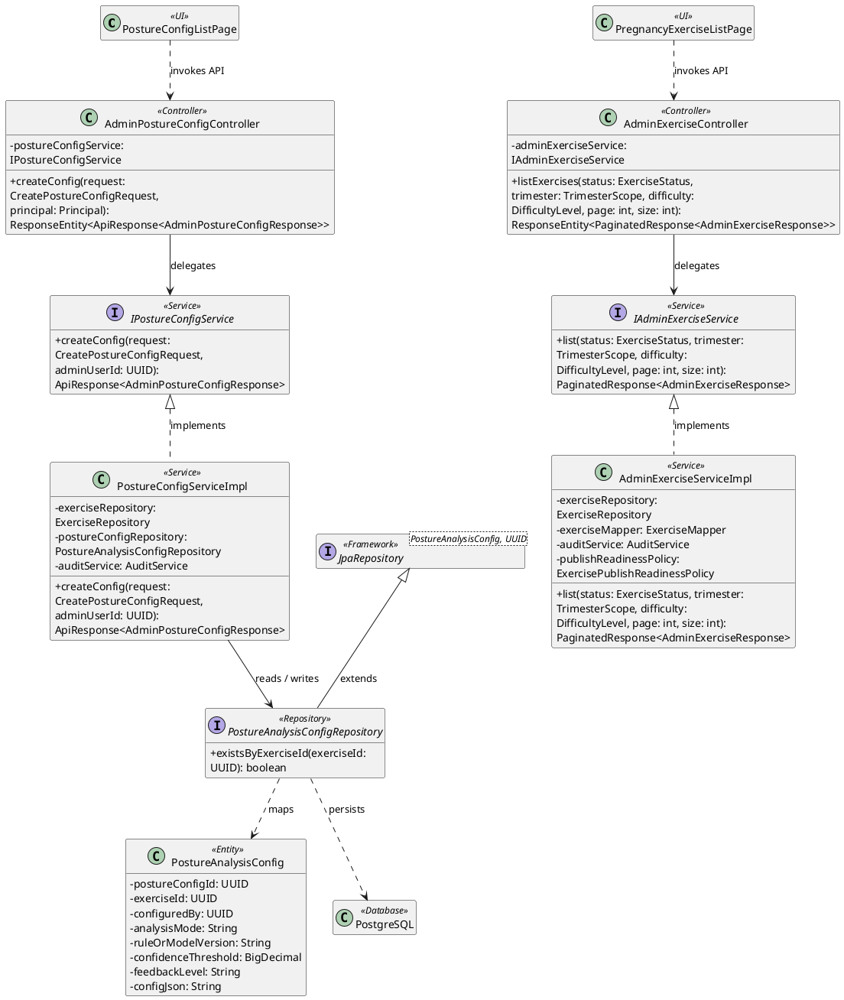
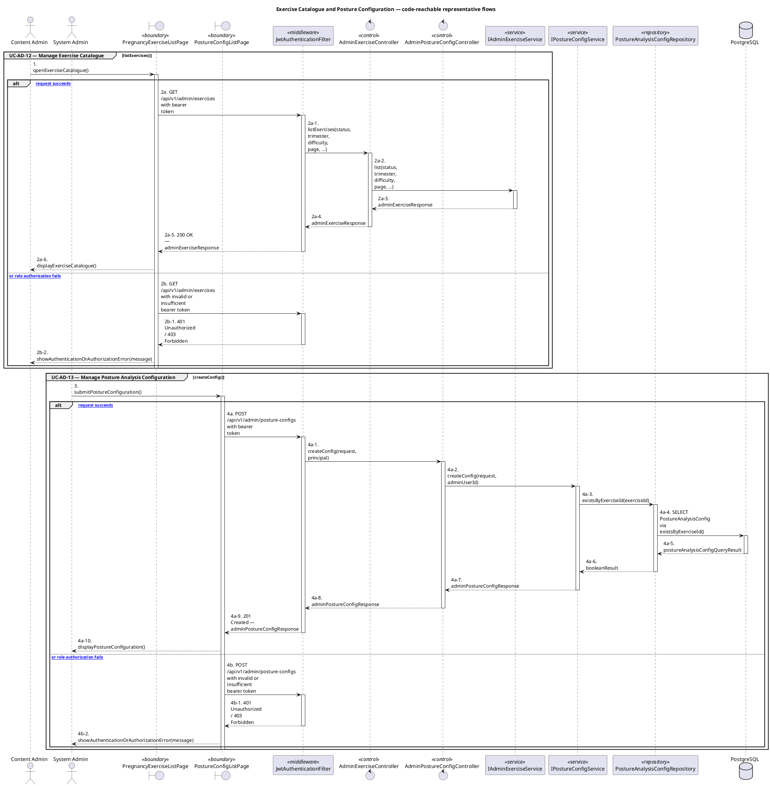
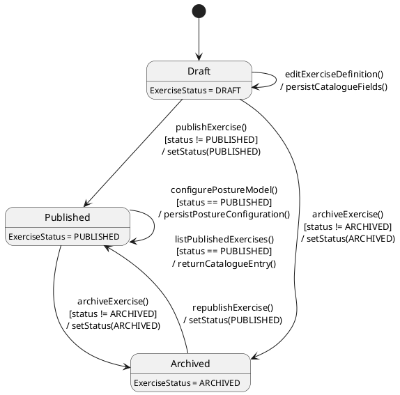

# MF-09 — Exercise Catalogue and Posture Configuration

| Field | Value |
| --- | --- |
| Major Feature | **MF-09 — Content Hub** |
| Function package | **Exercise Catalogue and Posture Configuration** |
| Code-first use cases | `UC-AD-12, UC-AD-13` |
| Status | **Draft** |
| Baseline | Current reachable code and tests, 2026-08-23 |
| Diagram convention | `../sequence-diagram-skill.md`; explicit lifeline order, numbered messages, balanced activation |

## 1. Tổng quan luồng chính

Design exercise catalogue and posture-model configuration governance.

- **UC-AD-12 — Manage Exercise Catalogue:** Create, edit, preview, publish-state manage, and archive pregnancy exercise catalogue entries.
- **UC-AD-13 — Manage Posture Analysis Configuration:** Create, version, validate, activate, and retire posture-analysis configuration associated with exercises.

The code is authoritative for routes, handlers, delegation, authorization, and persisted state. Report1 section 6.2 is authoritative for the Major Feature name. Historical UC numbering and obsolete triage plans are not design inputs.

## 2. Function Design — Code Traceability

| UC | Actor goal | Method / route | Exact handler | Delegated function | Authorization | Source |
| --- | --- | --- | --- | --- | --- | --- |
| `UC-AD-12` | Manage Exercise Catalogue | `GET /api/v1/admin/exercises` | `AdminExerciseController.listExercises()` | `IAdminExerciseService.list()` | hasRole('CONTENT_ADMIN') | `05_Development/CareBridgeAPI/src/main/java/com/carebridge/backend/exercise/controller/AdminExerciseController.java` |
| `UC-AD-12` | Manage Exercise Catalogue | `POST /api/v1/admin/exercises` | `AdminExerciseController.createExercise()` | `IAdminExerciseService.create()` → `ExerciseRepository.save()` | hasRole('CONTENT_ADMIN') | `05_Development/CareBridgeAPI/src/main/java/com/carebridge/backend/exercise/controller/AdminExerciseController.java` |
| `UC-AD-12` | Manage Exercise Catalogue | `GET /api/v1/admin/exercises/{exerciseId}` | `AdminExerciseController.getExercise()` | `IAdminExerciseService.getById()` | hasRole('CONTENT_ADMIN') | `05_Development/CareBridgeAPI/src/main/java/com/carebridge/backend/exercise/controller/AdminExerciseController.java` |
| `UC-AD-12` | Manage Exercise Catalogue | `PUT /api/v1/admin/exercises/{exerciseId}` | `AdminExerciseController.updateExercise()` | `IAdminExerciseService.update()` → `ExerciseRepository.save()` | hasRole('CONTENT_ADMIN') | `05_Development/CareBridgeAPI/src/main/java/com/carebridge/backend/exercise/controller/AdminExerciseController.java` |
| `UC-AD-12` | Manage Exercise Catalogue | `PATCH /api/v1/admin/exercises/{exerciseId}/activate` | `AdminExerciseController.activateExercise()` | `IAdminExerciseService.activate()` → `ExerciseRepository.save()` | hasRole('CONTENT_ADMIN') | `05_Development/CareBridgeAPI/src/main/java/com/carebridge/backend/exercise/controller/AdminExerciseController.java` |
| `UC-AD-12` | Manage Exercise Catalogue | `PATCH /api/v1/admin/exercises/{exerciseId}/disable` | `AdminExerciseController.disableExercise()` | `IAdminExerciseService.disable()` → `ExerciseRepository.save()` | hasRole('CONTENT_ADMIN') | `05_Development/CareBridgeAPI/src/main/java/com/carebridge/backend/exercise/controller/AdminExerciseController.java` |
| `UC-AD-13` | Manage Posture Analysis Configuration | `POST /api/v1/admin/posture-configs` | `AdminPostureConfigController.createConfig()` | `IPostureConfigService.createConfig()` → `PostureAnalysisConfigRepository.existsByExerciseId()` | hasRole('SYSTEM_ADMIN') | `05_Development/CareBridgeAPI/src/main/java/com/carebridge/backend/exercise/controller/AdminPostureConfigController.java` |
| `UC-AD-13` | Manage Posture Analysis Configuration | `GET /api/v1/admin/posture-configs/{exerciseId}` | `AdminPostureConfigController.listVersions()` | `IPostureConfigService.listVersions()` | hasRole('SYSTEM_ADMIN') | `05_Development/CareBridgeAPI/src/main/java/com/carebridge/backend/exercise/controller/AdminPostureConfigController.java` |
| `UC-AD-13` | Manage Posture Analysis Configuration | `POST /api/v1/admin/posture-configs/{exerciseId}/versions` | `AdminPostureConfigController.createNewVersion()` | `IPostureConfigService.createNewVersion()` → `PostureAnalysisConfigRepository.save()` | hasRole('SYSTEM_ADMIN') | `05_Development/CareBridgeAPI/src/main/java/com/carebridge/backend/exercise/controller/AdminPostureConfigController.java` |
| `UC-AD-13` | Manage Posture Analysis Configuration | `PATCH /api/v1/admin/posture-configs/{postureConfigId}/activate` | `AdminPostureConfigController.activateVersion()` | `IPostureConfigService.activateVersion()` → `PostureAnalysisConfigRepository.save()` | hasRole('SYSTEM_ADMIN') | `05_Development/CareBridgeAPI/src/main/java/com/carebridge/backend/exercise/controller/AdminPostureConfigController.java` |

## 3. Class Diagram

This design-level UML follows the current source declarations: fields become attributes, reachable methods become operations, `implements` becomes realization, repository inheritance becomes generalization, and runtime-only calls remain dependencies. A missing layer or ownership relation is not invented.

**Figure 1 — Class Diagram: Exercise Catalogue and Posture Configuration**

## 4. Sequence Diagram — Main Flow

Each group is a representative reachable main flow. The full endpoint surface remains in the Function Design table above.

**Brief Explanation:**

1. The actor starts each grouped use case through the code-reachable UI boundary.
2. Protected requests pass through JwtAuthenticationFilter; rejected credentials or roles return 401 Unauthorized or 403 Forbidden without invoking the controller.
3. The controller receives the request and invokes the exact delegated operation resolved from the current source.
4. The service applies the business policy and coordinates downstream collaborators while its caller remains active.
5. The repository executes the represented persistence operation and returns the stored or queried result before its activation ends.
6. The HTTP response unwinds through middleware when present, and the UI renders the server-authoritative outcome to the actor.

## 5. State Chart Diagram

The lifecycle below belongs to **Exercise.status, with posture configuration bound to a published exercise**. Its states are the persisted constants declared in the sources cited under this diagram, and every transition, guard, and action is taken from the service method that writes that constant. No unreachable state is introduced.

**Figure 2 — State Chart Diagram: Exercise Catalogue and Posture Configuration**

**Brief Explanation:**

1. `ExerciseMapper` creates every catalogue entry as `DRAFT`, so a new exercise is never immediately offered to mothers.
2. `AdminExerciseServiceImpl` guards `publishExercise()` against an already-published entry and `archiveExercise()` against an already-archived one, making both operations safe to retry.
3. `PUBLISHED` is the only state the mother-facing catalogue query returns, which is why the consumer read is drawn as a guarded self-transition on that state.
4. Posture configuration is bound to `PUBLISHED` as well, so a draft exercise cannot carry an active posture model into a session.
5. Archiving withdraws an exercise from the catalogue without deleting it, and `republishExercise()` makes that withdrawal reversible.
6. Mother-side exercise consumption and session state are owned by MF-02, so this lifecycle stops at catalogue and configuration governance.

**State sources:**

- `05_Development/CareBridgeAPI/src/main/java/com/carebridge/backend/exercise/entity/ExerciseStatus.java`
- `05_Development/CareBridgeAPI/src/main/java/com/carebridge/backend/exercise/mapper/ExerciseMapper.java`
- `05_Development/CareBridgeAPI/src/main/java/com/carebridge/backend/exercise/service/impl/AdminExerciseServiceImpl.java`

## 6. Business Rules Applied

| UC | Enforced business/security rules | Known boundary or gap |
| --- | --- | --- |
| `UC-AD-12` | Content Admin owns catalogue authoring; consumer visibility follows server lifecycle. Posture-analysis configuration is a separate System Admin lifecycle. | No additional gap recorded in the code-first baseline. |
| `UC-AD-13` | Only System Admin may mutate posture configuration. Version uniqueness, activation exclusivity, compatibility, and lifecycle state are server authoritative. | No additional gap recorded in the code-first baseline. |

## 7. Partial / Excluded Boundaries

- Mother exercise consumption and sessions are owned by MF-02.

## 8. Code and Test Evidence

- `05_Development/CareBridgeAPI/src/main/java/com/carebridge/backend/exercise/controller/AdminExerciseController.java`
- `05_Development/CareBridgeWebApp/src/features/contentManagement/pages/PregnancyExerciseListPage.tsx`
- `05_Development/CareBridgeWebApp/src/features/contentManagement/pages/EditPregnancyExercisePage.tsx`
- `05_Development/CareBridgeAPI/src/test/java/com/carebridge/backend/exercise/AdminExerciseControllerTest.java`
- `05_Development/CareBridgeAPI/src/test/java/com/carebridge/backend/exercise/AdminExerciseServiceTest.java`
- `05_Development/CareBridgeWebApp/src/features/contentManagement/pages/CreatePregnancyExercisePage.test.tsx`
- `05_Development/CareBridgeAPI/src/main/java/com/carebridge/backend/exercise/controller/AdminPostureConfigController.java`
- `05_Development/CareBridgeWebApp/src/features/postureConfiguration/pages/PostureConfigListPage.tsx`
- `05_Development/CareBridgeWebApp/src/features/postureConfiguration/pages/EditPostureConfigPage.tsx`
- `05_Development/CareBridgeAPI/src/test/java/com/carebridge/backend/exercise/AdminPostureConfigControllerSecurityTest.java`
- `05_Development/CareBridgeAPI/src/test/java/com/carebridge/backend/exercise/PostureConfigLifecycleIntegrationTest.java`
- `05_Development/CareBridgeAPI/src/test/java/com/carebridge/backend/exercise/PostureConfigServiceTest.java`
