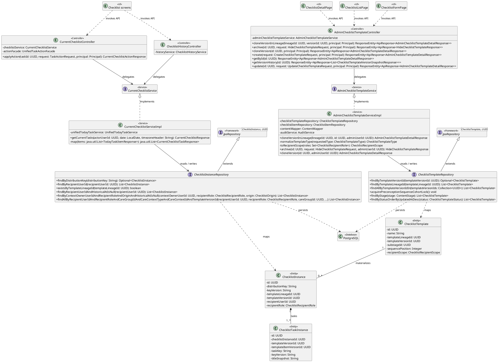
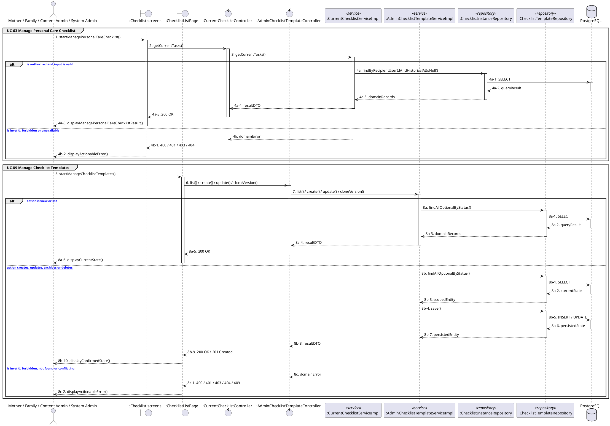

# MF-09 / Spec 03 — Checklist Template Governance and Personal Runtime

| Field | Value |
| --- | --- |
| Status | Draft |
| Use Cases Covered | UC-63 Manage Personal Care Checklist; UC-89 Manage Checklist Templates |
| Use Case Group | Mobile App and Web App |
| Platform | Mother and authorized Family Mobile; Content Admin Web; Admin Web; Backend |
| Primary Actors | Mother / Family / Content Admin / System Admin |
| In Scope | Only approved active distributable versions materialize for eligible recipients |
| Explicitly Excluded | Checklist as prescription |
| Implementation Trace | UI: Checklist screens, ChecklistListPage, ChecklistFormPage, ChecklistDetailPage; Controller: AdminChecklistTemplateController, CurrentChecklistController, ChecklistHistoryController; Service: AdminChecklistTemplateServiceImpl, CurrentChecklistServiceImpl; Repository: ChecklistTemplateRepository, ChecklistInstanceRepository; Entity: ChecklistTemplate, ChecklistInstance, ChecklistTaskInstance |

## 1. Tổng quan luồng chính (Main Flow Overview)

Only approved active distributable versions materialize for eligible recipients. The flow starts only from the reachable UI or system trigger named in the metadata. The Backend rechecks authentication, role, ownership, membership, consent and current state as applicable; client-side visibility alone never grants access. A confirmed mutation is persisted before the UI displays success. External-service failure returns a safe retry state and must not fabricate completion.

## 2. Class Diagram

**Figure 1 — Class Diagram: Checklist Template Governance and Personal Runtime**

## 3. Sequence Diagram — Main Flow

**Figure 2 — Sequence Diagram: Checklist Template Governance and Personal Runtime Main Flow**

**Brief Explanation:**

1. The diagram separates the implemented goals covered by this specification: UC-63 Manage Personal Care Checklist; UC-89 Manage Checklist Templates.
2. Each actor action enters through the reachable mobile or web boundary and invokes the exact controller operation exposed by the current Backend.
3. The controller delegates to the mapped service operation; read branches query scoped records, while mutation branches load the current state before persisting the requested transition.
4. Repository calls and PostgreSQL responses are shown explicitly, including call-stack activation and dashed return messages.
5. Invalid, unauthorized, missing or conflicting requests return an actionable error without displaying a false success state.
6. External systems are invoked only for the mapped use cases; notification dispatches are asynchronous, while integrations that return data remain synchronous.

## 4. Business Rules Applied

- Access is enforced server-side using the current actor, role, ownership, membership and consent scope.
- Only approved active distributable versions materialize for eligible recipients.
- The following remains outside this contract: Checklist as prescription.
- Retries must not duplicate confirmed records, transitions, notifications or external side effects.
- Sensitive health, identity, moderation, location and safety operations retain the minimum required audit evidence.
