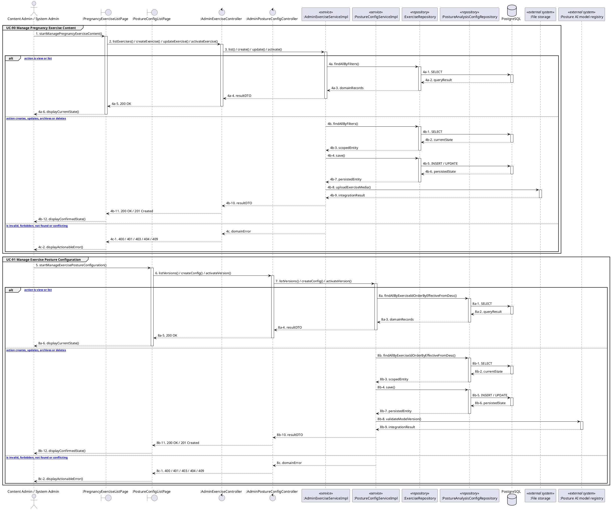

# MF-09 / Spec 04 — Pregnancy Exercise Content and Posture Configuration

| Field | Value |
| --- | --- |
| Status | Draft |
| Use Cases Covered | UC-90 Manage Pregnancy Exercise Content; UC-91 Manage Exercise Posture Configuration |
| Use Case Group | Web App |
| Platform | Content Admin Web; Admin Web; Backend |
| Primary Actors | Content Admin / System Admin |
| In Scope | Content Admin owns exercise content; System Admin owns active posture configuration |
| Explicitly Excluded | Medical exercise clearance |
| Implementation Trace | UI: PregnancyExerciseListPage, CreatePregnancyExercisePage, EditPregnancyExercisePage, PostureConfigListPage; Controller: AdminExerciseController, AdminPostureConfigController; Service: AdminExerciseServiceImpl, PostureConfigServiceImpl; Repository: ExerciseRepository, PostureAnalysisConfigRepository; Entity: PregnancyExercise, PostureAnalysisConfig |

## 1. Tổng quan luồng chính (Main Flow Overview)

Content Admin owns exercise content; System Admin owns active posture configuration. The flow starts only from the reachable UI or system trigger named in the metadata. The Backend rechecks authentication, role, ownership, membership, consent and current state as applicable; client-side visibility alone never grants access. A confirmed mutation is persisted before the UI displays success. External-service failure returns a safe retry state and must not fabricate completion.

## 2. Class Diagram

```plantuml
@startuml MF09_04_PregnancyExerciseContentandPostureConfiguration_ClassDiagram
skinparam classAttributeIconSize 0
hide empty members

class "PregnancyExerciseListPage" as UI1 <<UI>>
class "CreatePregnancyExercisePage" as UI2 <<UI>>
class "EditPregnancyExercisePage" as UI3 <<UI>>
class "PostureConfigListPage" as UI4 <<UI>>
class "AdminExerciseController" as Controller1 <<Controller>> {
  - adminExerciseService: IAdminExerciseService
  + activateExercise(exerciseId: UUID, principal: Principal): ResponseEntity<ApiResponse<AdminExerciseResponse>>
  + createExercise(request: CreateExerciseRequest, principal: Principal): ResponseEntity<ApiResponse<AdminExerciseResponse>>
  + disableExercise(exerciseId: UUID, principal: Principal): ResponseEntity<ApiResponse<AdminExerciseResponse>>
  + getExercise(exerciseId: UUID): ResponseEntity<ApiResponse<AdminExerciseResponse>>
  + updateExercise(exerciseId: UUID, request: UpdateExerciseRequest, principal: Principal): ResponseEntity<ApiResponse<AdminExerciseResponse>>
}
class "AdminPostureConfigController" as Controller2 <<Controller>> {
  - postureConfigService: IPostureConfigService
  + activateVersion(postureConfigId: UUID, principal: Principal): ResponseEntity<ApiResponse<AdminPostureConfigResponse>>
  + createConfig(request: CreatePostureConfigRequest, principal: Principal): ResponseEntity<ApiResponse<AdminPostureConfigResponse>>
  + createNewVersion(exerciseId: UUID, request: UpdatePostureConfigRequest, principal: Principal): ResponseEntity<ApiResponse<AdminPostureConfigResponse>>
  + listVersions(exerciseId: UUID): ResponseEntity<ApiResponse<List<AdminPostureConfigResponse>>>
}
class "AdminExerciseServiceImpl" as Service1 <<Service>> {
  - exerciseRepository: ExerciseRepository
  - exerciseMapper: ExerciseMapper
  - auditService: AuditService
  + activate(exerciseId: UUID, adminUserId: UUID): AdminExerciseResponse
  + create(request: CreateExerciseRequest, adminUserId: UUID): AdminExerciseResponse
  + disable(exerciseId: UUID, adminUserId: UUID): AdminExerciseResponse
  + getById(exerciseId: UUID): AdminExerciseResponse
  + list(status: ExerciseStatus, trimester: TrimesterScope, difficulty: DifficultyLevel, ...): PaginatedResponse<AdminExerciseResponse>
}
class "PostureConfigServiceImpl" as Service2 <<Service>> {
  - exerciseRepository: ExerciseRepository
  - postureConfigRepository: PostureAnalysisConfigRepository
  - auditService: AuditService
  + getActiveConfig(exerciseId: UUID): ApiResponse<PostureConfigResponse>
  + activateVersion(postureConfigId: UUID, adminUserId: UUID): ApiResponse<AdminPostureConfigResponse>
  + createConfig(request: CreatePostureConfigRequest, adminUserId: UUID): ApiResponse<AdminPostureConfigResponse>
  + createNewVersion(exerciseId: UUID, request: UpdatePostureConfigRequest, adminUserId: UUID): ApiResponse<AdminPostureConfigResponse>
  + listVersions(exerciseId: UUID): ApiResponse<List<AdminPostureConfigResponse>>
}
interface "IAdminExerciseService" as Service1Contract <<Service>>
interface "IPostureConfigService" as Service2Contract <<Service>>
interface "ExerciseRepository" as Repository1 {
  + findByExerciseIdAndStatus(exerciseId: UUID, status: ExerciseStatus): Optional<PregnancyExercise>
}
interface "PostureAnalysisConfigRepository" as Repository2 {
  + findByExerciseIdAndStatus(exerciseId: UUID, status: String): Optional<PostureAnalysisConfig>
  + findAllByExerciseIdOrderByEffectiveFromDesc(exerciseId: UUID): List<PostureAnalysisConfig>
  + existsByExerciseId(exerciseId: UUID): boolean
}
class "PregnancyExercise" as Entity1 <<Entity>> {
  - exerciseId: UUID
  - createdBy: UUID
  - title: String
  - description: String
  - trimesterScope: TrimesterScope
  - difficultyLevel: DifficultyLevel
  - durationMinutes: Short
}
class "PostureAnalysisConfig" as Entity2 <<Entity>> {
  - postureConfigId: UUID
  - exerciseId: UUID
  - configuredBy: UUID
  - analysisMode: String
  - ruleOrModelVersion: String
  - confidenceThreshold: BigDecimal
  - feedbackLevel: String
}
interface "JpaRepository<PregnancyExercise, UUID>" as Repository1Base <<Framework>>
interface "JpaRepository<PostureAnalysisConfig, UUID>" as Repository2Base <<Framework>>
class "PostgreSQL" as DB <<Database>>
class "Posture AI model registry" as External <<External Service>>

Service1Contract <|.. Service1 : implements
Service2Contract <|.. Service2 : implements
Repository1Base <|-- Repository1 : extends
Repository2Base <|-- Repository2 : extends
UI1 ..> Controller1 : invokes API
UI2 ..> Controller1 : invokes API
UI3 ..> Controller1 : invokes API
UI4 ..> Controller2 : invokes API
Controller1 --> Service1Contract : delegates
Controller2 --> Service2Contract : delegates
Service1 --> Repository1 : reads / writes
Service2 --> Repository2 : reads / writes
Repository1 ..> Entity1 : maps
Repository1 ..> DB : persists
Repository2 ..> Entity2 : maps
Repository2 ..> DB : persists
Service1 ..> External : invokes when required
Service2 ..> External : invokes when required
@enduml
```

**Figure 1 — Class Diagram: Pregnancy Exercise Content and Posture Configuration**

## 3. Sequence Diagram — Main Flow

**Figure 2 — Sequence Diagram: Pregnancy Exercise Content and Posture Configuration Main Flow**

**Brief Explanation:**

1. The diagram separates the implemented goals covered by this specification: UC-90 Manage Pregnancy Exercise Content; UC-91 Manage Exercise Posture Configuration.
2. Each actor action enters through the reachable mobile or web boundary and invokes the exact controller operation exposed by the current Backend.
3. The controller delegates to the mapped service operation; read branches query scoped records, while mutation branches load the current state before persisting the requested transition.
4. Repository calls and PostgreSQL responses are shown explicitly, including call-stack activation and dashed return messages.
5. Invalid, unauthorized, missing or conflicting requests return an actionable error without displaying a false success state.
6. External systems are invoked only for the mapped use cases; notification dispatches are asynchronous, while integrations that return data remain synchronous.

## 4. Business Rules Applied

- Access is enforced server-side using the current actor, role, ownership, membership and consent scope.
- Content Admin owns exercise content; System Admin owns active posture configuration.
- The following remains outside this contract: Medical exercise clearance.
- Retries must not duplicate confirmed records, transitions, notifications or external side effects.
- Sensitive health, identity, moderation, location and safety operations retain the minimum required audit evidence.
