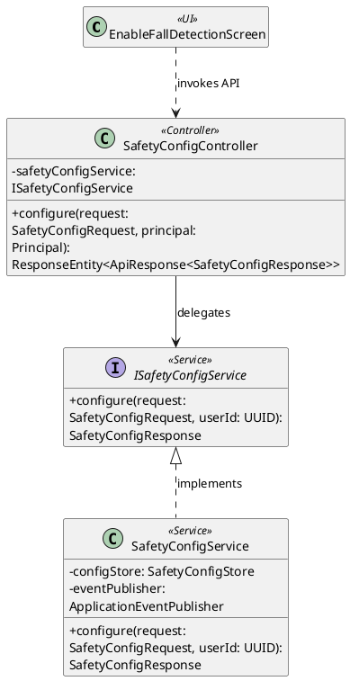
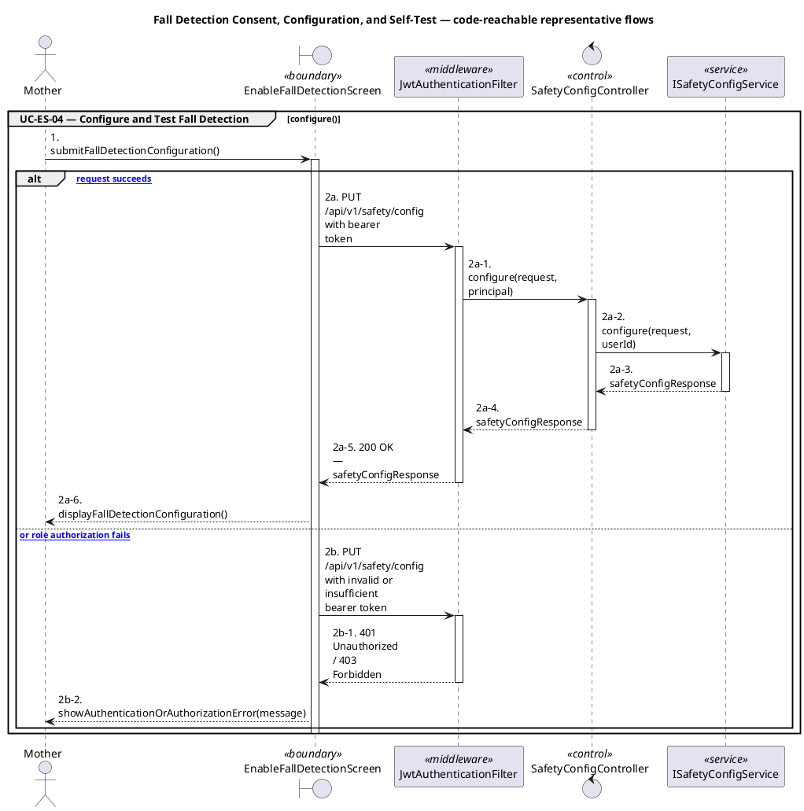
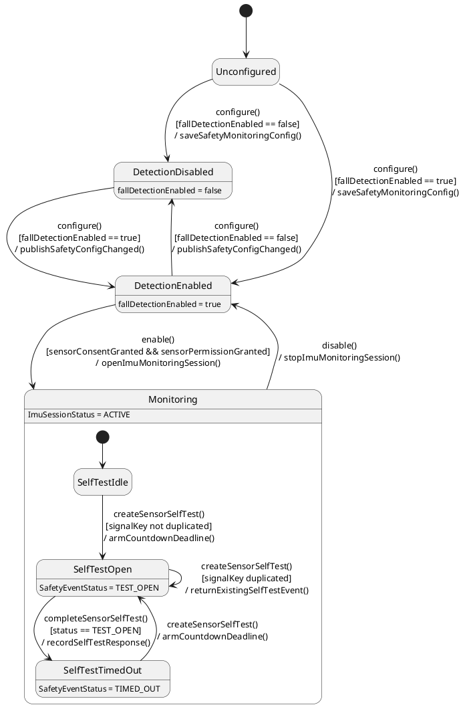

# MF-10 — Fall Detection Consent, Configuration, and Self-Test

| Field | Value |
| --- | --- |
| Major Feature | **MF-10 — Smart Activity Monitoring & Safety Support** |
| Function package | **Fall Detection Consent, Configuration, and Self-Test** |
| Code-first use cases | `UC-ES-04` |
| Status | **Draft** |
| Baseline | Current reachable code and tests, 2026-08-23 |
| Diagram convention | `../sequence-diagram-skill.md`; explicit lifeline order, numbered messages, balanced activation |

## 1. Tổng quan luồng chính

Design consent/configuration, enable/disable, and sensor self-test state.

- **UC-ES-04 — Configure and Test Fall Detection:** Grant required consent/permissions, enable or disable fall detection, configure current safety settings, and complete sensor self-test.

The code is authoritative for routes, handlers, delegation, authorization, and persisted state. Report1 section 6.2 is authoritative for the Major Feature name. Historical UC numbering and obsolete triage plans are not design inputs.

## 2. Function Design — Code Traceability

| UC | Actor goal | Method / route | Exact handler | Delegated function | Authorization | Source |
| --- | --- | --- | --- | --- | --- | --- |
| `UC-ES-04` | Configure and Test Fall Detection | `GET /api/v1/safety/config` | `SafetyConfigController.getConfig()` | `ISafetyConfigService.getConfig()` | hasRole('MOTHER') | `05_Development/CareBridgeAPI/src/main/java/com/carebridge/backend/safety/controller/SafetyConfigController.java` |
| `UC-ES-04` | Configure and Test Fall Detection | `PUT /api/v1/safety/config` | `SafetyConfigController.configure()` | `ISafetyConfigService.configure()` | hasRole('MOTHER') | `05_Development/CareBridgeAPI/src/main/java/com/carebridge/backend/safety/controller/SafetyConfigController.java` |
| `UC-ES-04` | Configure and Test Fall Detection | `POST /api/v1/safety/events/sensor-self-test` | `SensorSelfTestController.create()` | `SensorSelfTestService.create()` → `IImuMonitoringSessionRepository.findActiveForUpdateByUserId()` | hasRole('MOTHER') | `05_Development/CareBridgeAPI/src/main/java/com/carebridge/backend/safety/controller/SensorSelfTestController.java` |
| `UC-ES-04` | Configure and Test Fall Detection | `POST /api/v1/safety/events/{eventId}/sensor-self-test/complete` | `SensorSelfTestController.complete()` | `SensorSelfTestService.complete()` → `ISafetyEventRepository.findLockedByIdAndUserId()` | hasRole('MOTHER') | `05_Development/CareBridgeAPI/src/main/java/com/carebridge/backend/safety/controller/SensorSelfTestController.java` |
| `UC-ES-04` | Configure and Test Fall Detection | `POST /api/v1/safety/fall-detection/disable` | `FallDetectionController.disable()` | `IFallDetectionService.disable()` → `IImuMonitoringSessionRepository.acquireUserLock()` | hasRole('MOTHER') | `05_Development/CareBridgeAPI/src/main/java/com/carebridge/backend/safety/controller/FallDetectionController.java` |
| `UC-ES-04` | Configure and Test Fall Detection | `POST /api/v1/safety/fall-detection/enable` | `FallDetectionController.enable()` | `ISafetyConfigService.getConfig()` | hasRole('MOTHER') | `05_Development/CareBridgeAPI/src/main/java/com/carebridge/backend/safety/controller/FallDetectionController.java` |

## 3. Class Diagram

This design-level UML follows the current source declarations: fields become attributes, reachable methods become operations, `implements` becomes realization, repository inheritance becomes generalization, and runtime-only calls remain dependencies. A missing layer or ownership relation is not invented.

**Figure 1 — Class Diagram: Fall Detection Consent, Configuration, and Self-Test**

## 4. Sequence Diagram — Main Flow

Each group is a representative reachable main flow. The full endpoint surface remains in the Function Design table above.

**Brief Explanation:**

1. The actor starts each grouped use case through the code-reachable UI boundary.
2. Protected requests pass through JwtAuthenticationFilter; rejected credentials or roles return 401 Unauthorized or 403 Forbidden without invoking the controller.
3. The controller receives the request and invokes the exact delegated operation resolved from the current source.
4. The service applies the business policy and coordinates downstream collaborators while its caller remains active.
5. The HTTP response unwinds through middleware when present, and the UI renders the server-authoritative outcome to the actor.

## 5. State Chart Diagram

The lifecycle below belongs to **SafetyMonitoringConfig + ImuMonitoringSession (with the SENSOR_SELF_TEST SafetyEvent nested inside an active session)**. Its states are the persisted constants declared in the sources cited under this diagram, and every transition, guard, and action is taken from the service method that writes that constant. No unreachable state is introduced.

**Figure 2 — State Chart Diagram: Fall Detection Consent, Configuration, and Self-Test**

**Brief Explanation:**

1. The user starts in `Unconfigured` because `SafetyConfigStore.findByUserId()` holds no `SafetyMonitoringConfig` row yet.
2. The event `configure()` persists the configuration, and the guard on `fallDetectionEnabled` decides whether the user settles in `DetectionDisabled` or `DetectionEnabled`; the action publishes `SafetyConfigChanged`.
3. The event `enable()` moves the user to `Monitoring` only when the guard `sensorConsentGranted && sensorPermissionGranted` holds, because `FallDetectionService.enable()` calls `requireSensorCollection()` and rejects a missing device permission with `SAFETY-009`; the action opens an `ImuMonitoringSession` with `ImuSessionStatus.ACTIVE`.
4. Inside `Monitoring`, `createSensorSelfTest()` opens a `SENSOR_SELF_TEST` event in `TEST_OPEN` and arms the countdown deadline; a duplicated `signalKey` re-enters `SelfTestOpen` and returns the existing event rather than creating a second one.
5. The event `completeSensorSelfTest()` is accepted only under the guard `status == TEST_OPEN`, and the action records the response before the event settles in `TIMED_OUT` — a self-test never reaches the real alert states.
6. The event `disable()` leaves `Monitoring` from the active session only, stopping it with `ImuSessionStatus.STOPPED` and returning the user to `DetectionEnabled` with the configuration intact.

**State sources:**

- `05_Development/CareBridgeAPI/src/main/java/com/carebridge/backend/safety/ImuSessionStatus.java`
- `05_Development/CareBridgeAPI/src/main/java/com/carebridge/backend/safety/SafetyEventStatus.java`
- `05_Development/CareBridgeAPI/src/main/java/com/carebridge/backend/safety/service/impl/SafetyConfigService.java`
- `05_Development/CareBridgeAPI/src/main/java/com/carebridge/backend/safety/service/impl/FallDetectionService.java`
- `05_Development/CareBridgeAPI/src/main/java/com/carebridge/backend/safety/service/impl/SensorSelfTestService.java`

## 6. Business Rules Applied

| UC | Enforced business/security rules | Known boundary or gap |
| --- | --- | --- |
| `UC-ES-04` | Consent, device permission, and latest server configuration are required before monitoring. A failed self-test must not be presented as an enabled healthy detector. | No additional gap recorded in the code-first baseline. |

## 7. Partial / Excluded Boundaries

- No extra release boundary beyond the code-first UC catalogue is introduced by this package.

## 8. Code and Test Evidence

- `05_Development/CareBridgeAPI/src/main/java/com/carebridge/backend/safety/controller/SafetyConfigController.java`
- `05_Development/CareBridgeAPI/src/main/java/com/carebridge/backend/safety/controller/SensorSelfTestController.java`
- `05_Development/CareBridgeMobileApp/lib/features/safety/screens/enable_fall_detection_screen.dart`
- `05_Development/CareBridgeAPI/src/main/java/com/carebridge/backend/safety/controller/FallDetectionController.java`
- `05_Development/CareBridgeAPI/src/test/java/com/carebridge/backend/safety/SafetyConfigControllerTest.java`
- `05_Development/CareBridgeAPI/src/test/java/com/carebridge/backend/safety/SafetyConfigServiceTest.java`
- `05_Development/CareBridgeAPI/src/test/java/com/carebridge/backend/safety/SensorSelfTestServiceTest.java`
- `05_Development/CareBridgeMobileApp/test/features/safety/safety_contract_test.dart`
