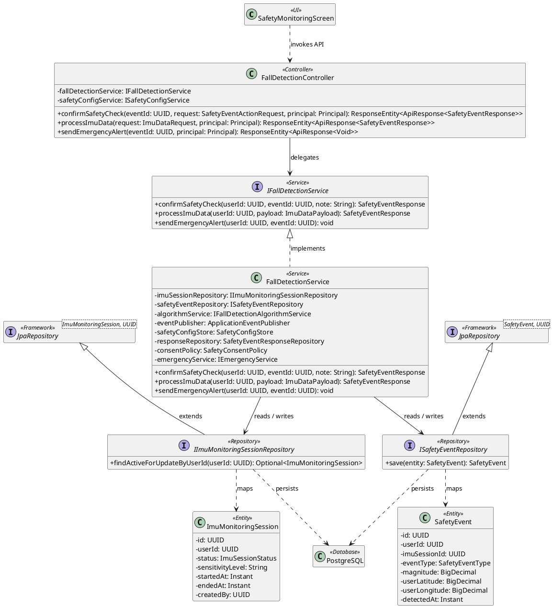
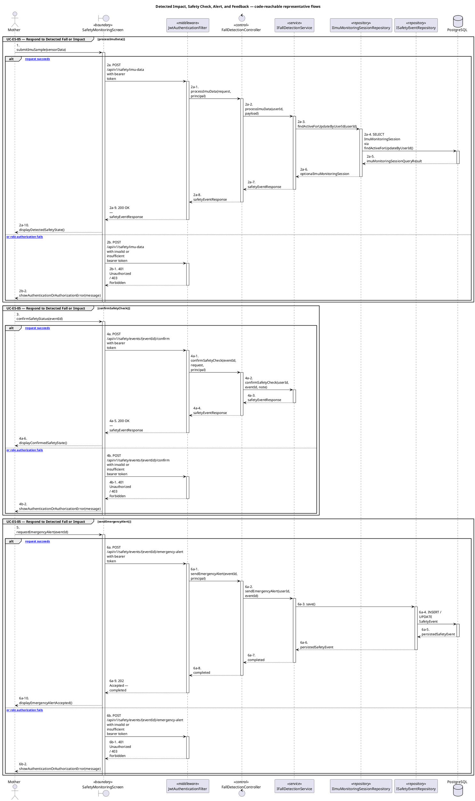
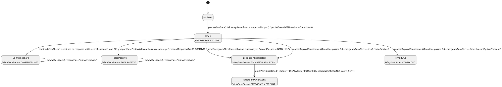

# MF-10 — Detected Impact, Safety Check, Alert, and Feedback

| Field | Value |
| --- | --- |
| Major Feature | **MF-10 — Smart Activity Monitoring & Safety Support** |
| Function package | **Detected Impact, Safety Check, Alert, and Feedback** |
| Code-first use cases | `UC-ES-05` |
| Status | **Draft** |
| Baseline | Current reachable code and tests, 2026-08-23 |
| Diagram convention | `../sequence-diagram-skill.md`; explicit lifeline order, numbered messages, balanced activation |

## 1. Tổng quan luồng chính

Design IMU ingestion, event history, safety confirmation, emergency alert, and false-positive feedback.

- **UC-ES-05 — Respond to Detected Fall or Impact:** Monitor device signals, display the suspected-fall countdown, and confirm safe/false-positive or escalate to emergency.

The code is authoritative for routes, handlers, delegation, authorization, and persisted state. Report1 section 6.2 is authoritative for the Major Feature name. Historical UC numbering and obsolete triage plans are not design inputs.

## 2. Function Design — Code Traceability

| UC | Actor goal | Method / route | Exact handler | Delegated function | Authorization | Source |
| --- | --- | --- | --- | --- | --- | --- |
| `UC-ES-05` | Respond to Detected Fall or Impact | `GET /api/v1/safety/events` | `FallDetectionController.listEvents()` | `IFallDetectionService.listSafetyEvents()` → `ISafetyEventRepository.findByUserIdOrderByDetectedAtDesc()` | hasRole('MOTHER') | `05_Development/CareBridgeAPI/src/main/java/com/carebridge/backend/safety/controller/FallDetectionController.java` |
| `UC-ES-05` | Respond to Detected Fall or Impact | `POST /api/v1/safety/events/{eventId}/confirm` | `FallDetectionController.confirmSafetyCheck()` | `IFallDetectionService.confirmSafetyCheck()` | hasRole('MOTHER') | `05_Development/CareBridgeAPI/src/main/java/com/carebridge/backend/safety/controller/FallDetectionController.java` |
| `UC-ES-05` | Respond to Detected Fall or Impact | `POST /api/v1/safety/events/{eventId}/emergency-alert` | `FallDetectionController.sendEmergencyAlert()` | `IFallDetectionService.sendEmergencyAlert()` → `ISafetyEventRepository.save()` | hasRole('MOTHER') | `05_Development/CareBridgeAPI/src/main/java/com/carebridge/backend/safety/controller/FallDetectionController.java` |
| `UC-ES-05` | Respond to Detected Fall or Impact | `POST /api/v1/safety/events/{eventId}/false-positive` | `FallDetectionController.reportFalsePositive()` | `IFallDetectionService.reportFalsePositive()` | hasRole('MOTHER') | `05_Development/CareBridgeAPI/src/main/java/com/carebridge/backend/safety/controller/FallDetectionController.java` |
| `UC-ES-05` | Respond to Detected Fall or Impact | `POST /api/v1/safety/imu-data` | `FallDetectionController.processImuData()` | `IFallDetectionService.processImuData()` → `IImuMonitoringSessionRepository.findActiveForUpdateByUserId()` | hasRole('MOTHER') | `05_Development/CareBridgeAPI/src/main/java/com/carebridge/backend/safety/controller/FallDetectionController.java` |

## 3. Class Diagram

This design-level UML follows the current source declarations: fields become attributes, reachable methods become operations, `implements` becomes realization, repository inheritance becomes generalization, and runtime-only calls remain dependencies. A missing layer or ownership relation is not invented.

**Figure 1 — Class Diagram: Detected Impact, Safety Check, Alert, and Feedback**

## 4. Sequence Diagram — Main Flow

Each group is a representative reachable main flow. The full endpoint surface remains in the Function Design table above.

**Brief Explanation:**

1. The actor starts each grouped use case through the code-reachable UI boundary.
2. Protected requests pass through JwtAuthenticationFilter; rejected credentials or roles return 401 Unauthorized or 403 Forbidden without invoking the controller.
3. The controller receives the request and invokes the exact delegated operation resolved from the current source.
4. The service applies the business policy and coordinates downstream collaborators while its caller remains active.
5. The repository executes the represented persistence operation and returns the stored or queried result before its activation ends.
6. The HTTP response unwinds through middleware when present, and the UI renders the server-authoritative outcome to the actor.

## 5. State Chart Diagram

The lifecycle below belongs to **SafetyEvent.status for a detected impact (the SENSOR_SELF_TEST variant is modelled in document 01)**. Its states are the persisted constants declared in the sources cited under this diagram, and every transition, guard, and action is taken from the service method that writes that constant. No unreachable state is introduced.

**Figure 2 — State Chart Diagram: Detected Impact, Safety Check, Alert, and Feedback**

**Brief Explanation:**

1. An event is only created when the fall-analysis service confirms a suspected impact, and it enters `OPEN` with a countdown deadline already armed.
2. The three user responses are mutually exclusive: each is guarded on the event not already carrying a response, so the first answer wins and cannot be overwritten.
3. When the countdown expires without an answer, the guard on `emergencyAutoAlert` decides the outcome — auto-alert escalates, otherwise the event settles as `TIMED_OUT`.
4. `TIMED_OUT` is deliberately not treated as safe; it records that no confirmation arrived rather than asserting the user is well.
5. `EMERGENCY_ALERT_SENT` is reached only from `ESCALATION_REQUESTED` and only once the family alert has actually been dispatched, so the state reflects delivery rather than intent.
6. False-positive feedback is a self-transition on the already-resolved states: it tunes future detection without rewriting the recorded outcome of a past event.

**State sources:**

- `05_Development/CareBridgeAPI/src/main/java/com/carebridge/backend/safety/SafetyEventStatus.java`
- `05_Development/CareBridgeAPI/src/main/java/com/carebridge/backend/safety/SafetyEventType.java`
- `05_Development/CareBridgeAPI/src/main/java/com/carebridge/backend/safety/service/impl/FallDetectionService.java`
- `05_Development/CareBridgeAPI/src/main/java/com/carebridge/backend/safety/service/SafetyCountdownJob.java`
- `05_Development/CareBridgeAPI/src/main/java/com/carebridge/backend/safety/service/FamilyAlertSentHandler.java`

## 6. Business Rules Applied

| UC | Enforced business/security rules | Known boundary or gap |
| --- | --- | --- |
| `UC-ES-05` | Server event state and deterministic detector rules are canonical. Late/repeated signals must not reopen a resolved event or duplicate emergency alerts. | No additional gap recorded in the code-first baseline. |

## 7. Partial / Excluded Boundaries

- No extra release boundary beyond the code-first UC catalogue is introduced by this package.

## 8. Code and Test Evidence

- `05_Development/CareBridgeAPI/src/main/java/com/carebridge/backend/safety/controller/FallDetectionController.java`
- `05_Development/CareBridgeAPI/src/main/java/com/carebridge/backend/safety/service/impl/FallDetectionService.java`
- `05_Development/CareBridgeMobileApp/lib/features/safety/screens/safety_monitoring_screen.dart`
- `05_Development/CareBridgeMobileApp/lib/features/safety/widgets/safety_countdown_sheet.dart`
- `05_Development/CareBridgeAPI/src/test/java/com/carebridge/backend/safety/FallDetectionControllerTest.java`
- `05_Development/CareBridgeAPI/src/test/java/com/carebridge/backend/safety/FallDetectionServiceTest.java`
- `05_Development/CareBridgeAPI/src/test/java/com/carebridge/backend/safety/SuspectedFallDetectedHandlerTest.java`
- `05_Development/CareBridgeMobileApp/test/features/safety/fall_detection_sensor_service_test.dart`
