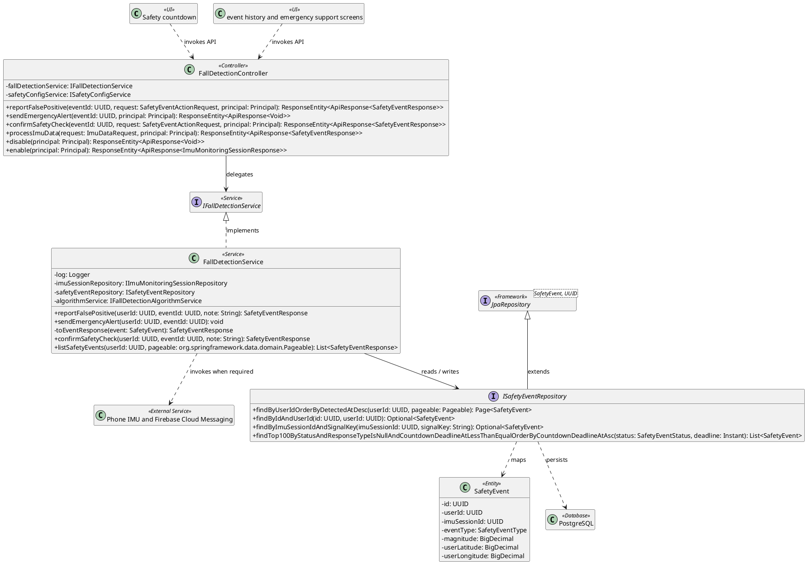
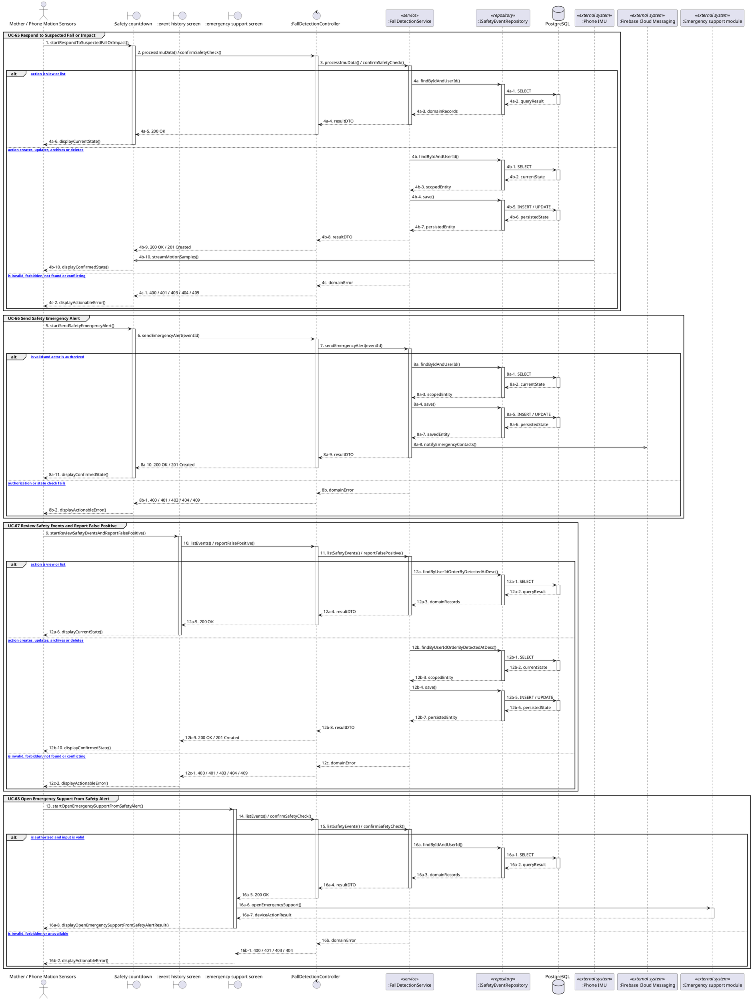

# MF-10 / Spec 02 — Suspected Fall Detection, Safety Check and Escalation

| Field | Value |
| --- | --- |
| Status | Draft |
| Use Cases Covered | UC-65 Respond to Suspected Fall or Impact; UC-66 Send Safety Emergency Alert; UC-67 Review Safety Events and Report False Positive; UC-68 Open Emergency Support from Safety Alert |
| Use Case Group | Mobile App |
| Platform | Mother Mobile; Backend; Phone IMU |
| Primary Actors | Mother / Phone Motion Sensors |
| In Scope | Detection creates a suspected event; first valid response wins and alerts do not guarantee assistance |
| Explicitly Excluded | Certified fall detection or emergency dispatch |
| Implementation Trace | UI: Safety countdown, event history and emergency support screens; Controller: FallDetectionController; Service: FallDetectionService; Repository: ISafetyEventRepository; Entity: SafetyEvent |

## 1. Tổng quan luồng chính (Main Flow Overview)

Detection creates a suspected event; first valid response wins and alerts do not guarantee assistance. The flow starts only from the reachable UI or system trigger named in the metadata. The Backend rechecks authentication, role, ownership, membership, consent and current state as applicable; client-side visibility alone never grants access. A confirmed mutation is persisted before the UI displays success. External-service failure returns a safe retry state and must not fabricate completion.

## 2. Class Diagram

**Figure 1 — Class Diagram: Suspected Fall Detection, Safety Check and Escalation**

## 3. Sequence Diagram — Main Flow

**Figure 2 — Sequence Diagram: Suspected Fall Detection, Safety Check and Escalation Main Flow**

**Brief Explanation:**

1. The diagram separates the implemented goals covered by this specification: UC-65 Respond to Suspected Fall or Impact; UC-66 Send Safety Emergency Alert; UC-67 Review Safety Events and Report False Positive; UC-68 Open Emergency Support from Safety Alert.
2. Each actor action enters through the reachable mobile or web boundary and invokes the exact controller operation exposed by the current Backend.
3. The controller delegates to the mapped service operation; read branches query scoped records, while mutation branches load the current state before persisting the requested transition.
4. Repository calls and PostgreSQL responses are shown explicitly, including call-stack activation and dashed return messages.
5. Invalid, unauthorized, missing or conflicting requests return an actionable error without displaying a false success state.
6. External systems are invoked only for the mapped use cases; notification dispatches are asynchronous, while integrations that return data remain synchronous.

## 4. Business Rules Applied

- Access is enforced server-side using the current actor, role, ownership, membership and consent scope.
- Detection creates a suspected event; first valid response wins and alerts do not guarantee assistance.
- The following remains outside this contract: Certified fall detection or emergency dispatch.
- Retries must not duplicate confirmed records, transitions, notifications or external side effects.
- Sensitive health, identity, moderation, location and safety operations retain the minimum required audit evidence.
